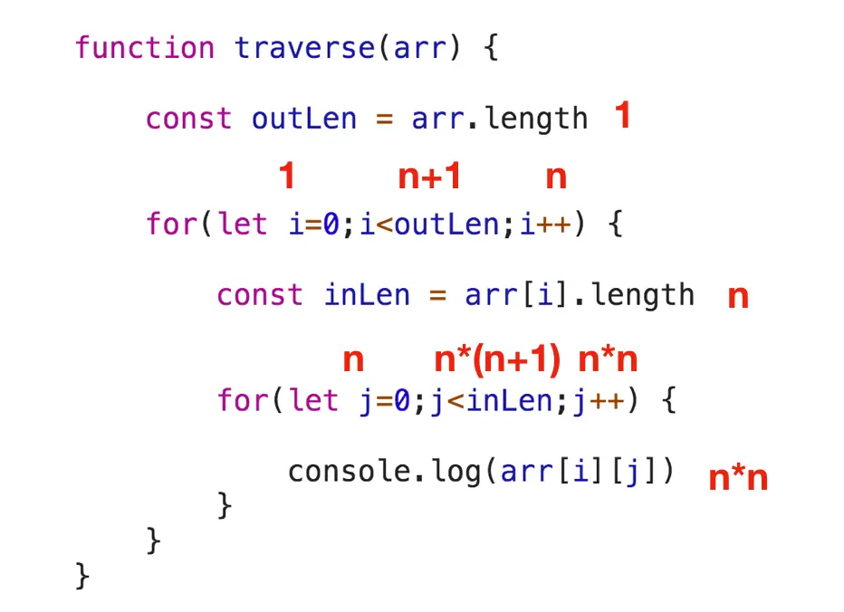
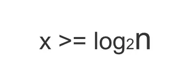

# 6.算法的衡量——轻松理解时间复杂度与空间复杂度

结束了数据结构基本功的学习，接下来在真正开始撸真题之前，大家还需要具备**评价算法的能力**。      

平时我们定义一个人是否“懂行”，一个重要的依据就是看这个人对某一个事物是否具备正确的评价能力。   
举个例子，同样是买手机，外行进到手机店，他关注的可能是手机有没有跑马灯、有没有皮套护体、有没有“八心八箭”——这些东西，任何一部手机随便包装一下就都有了，根本没法反映出这台手机的本质问题。但如果是一个相对懂手机的人，他可能就会去关注这台手机的芯片、内存、屏幕材质及分辨率等等，从而对手机的整体性能和质量作出一个合理的判断，这样他买到好手机的概率就更大。   
  
回到做算法题上，也是一样的道理。在面试时，自己给出的算法到底过不过得去，这一点在面试官给出评语之前，自己就应该有所感知。做到这一点，你才会掌握改进算法的主动权。   
  
本节我们要学习的就是评价算法的两个重要依据——时间复杂度和空间复杂度。  

很多同学算法入门直接就跪在复杂度理解这一环。时间复杂度、空间复杂度，直接读概念确实太无聊，我们本节从代码入手，大家的理解会更直观一点。   


## 时间复杂度    
大家先来看这样一个问题：下面这段代码，一共会执行多少次？    
```js
function traverse(arr) {
    var len = arr.length
    for(var i=0;i<len;i++) {
        console.log(arr[i])
    }
}
```
首先，最没有悬念的是函数里的第一行代码，它只会被执行1次：   
```js
var len = arr.length
```
其次没有悬念的是循环体：   
```js
console.log(arr[i])
```
`for`循环跑了 `n` 次，因此这条语句就会被执行 `n` 次。  

循环体上面的几个部分我们拆开来看，首先是 `i` 的初始化语句：  
```js
var i = 0
```
初始化只有1次，因此它也只会被执行1次。     

接着是 `i < len` 这个判断。这里有个规律大家可以记下：在所有的 `for` 循环里，判断语句都会比递增语句多执行一次。在这里，判断语句执行的次数就是 `n+1`。   
再往下就是递增语句 `i++` 了，它跟随整个循环体，毫无疑问会被执行 `n` 次。    
假如把总的执行次数记为 T(n)，下面咱们就可以来做个简单的加法：  
```
T(n) = 1 + n + 1 + (n+1) + n = 3n + 3
```   

接下来我们看看规模为 `n*n` 的二维数组的遍历，一共需要执行多少次代码：   

```js
function traverse(arr) {
    var outLen = arr.length

    for(var i=0;i<outLen;i++) {
        var inLen = arr[i].length

        for(var j=0;j<inLen;j++) { 
            console.log(arr[i][j])
        }
    }
}
```


首先仍然是没有悬念的第一行代码，它只会被执行一次：   

```js
var outLen = arr.length
```
接下来我们来看最内层的循环体：     

```js
console.log(arr[i][j])
```
因为咱们是两层循环，所以这货会被执行 `n*n = n^2` 次。   
其它语句的计算思路和咱们第一个🌰区别不大，这里我就不重复讲了，直接给出大家答案：   




继续来做个求总执行次数 T(n) 的加法看看：  

```js
T(n) = 1 + 1 + (n+1) + n + n + n + n*(n+1) + n*n + n*n = 3n^2 + 5n + 3
```    
  
代码的执行次数，可以反映出代码的执行时间。但是如果每次我们都逐行去计算 T(n)，事情会变得非常麻烦。算法的时间复杂度，它反映的不是算法的逻辑代码到底被执行了多少次，而是随着输入规模的增大，算法对应的执行总次数的一个**变化趋势**。要想反映趋势，那就简单多了，直接抓主要矛盾就行。我们可以尝试对 T(n) 做如下处理：   
- 若 T(n) 是常数，那么无脑简化为1  
- 若 T(n) 是多项式，比如 3n^2 + 5n + 3，我们只保留次数最高那一项，并且将其常数系数无脑改为1。    
   
经过这么一波操作，T(n) 就被简化为了 O(n)：   

```
T(n) = 10  
O(n) = 1
```   
```
T(n) = 3n^2 + 5n + 3
O(n) = n^2
```   

到这里，我们思路仍然是 `计算T(n) -> 推导O(n)`。这么讲是为了方便大家理解 O(n) 的简化过程，实际操作中，O(n) 基本可以目测，比如咱们上面的两个遍历函数： 

```js
function traverse1(arr) {
    var len = arr.length
    for(var i=0;i<len;i++) {
        console.log(arr[i])
    }
}

function traverse2(arr) {
    var outLen = arr.length

    for(var i=0;i<outLen;i++) {
        var inLen = arr[i].length

        for(var j=0;j<inLen;j++) { 
            console.log(arr[i][j])
        }
    }
}
```
遍历 N 维数组，需要 N 层循环，我们只需要关心其最内层那个循环体被执行多少次就行了。     

我们可以看出，规模为 `n` 的一维数组遍历时，最内层的循环会执行 `n` 次，其对应的时间复杂度是 `O(n)`；规模为 `n*n` 的二维数组遍历时，最内层的循环会执行 `n*n` 次，其对应的时间复杂度是 `O(n^2)`。     

以此类推，规模为 `n*m` 的二维数组最内层循环会执行 `n*m` 次，其对应的时间复杂度就是 `O(n*m)`；规模为 `n*n*n` 的三维数组最内层循环会执行 `n^3` 次，因此其对应的时间复杂度就表示为 `O(n^3)`。
  
常见的时间复杂度表达，除了多项式以外，还有`logn`。我们一起来看另一个算法：  
```js
function fn(arr) {
    var len = arr.length  
    
    for(var i=1;i<len;i=i*2) {
        console.log(arr[i])
    }
}
```
这个算法读取一个一维数组作为入参，然后对其中的元素进行跳跃式的输出。这个跳跃的规则，就是数组下标从1开始，每次会乘以二。   

如何计算这个函数的时间复杂度呢？在有循环的地方，我们关心的永远是最内层的循环体。这个算法中，我们关心的就是 `console.log(arr[i])` 到底被执行了几次，换句话说，也就是要知道 `i<n`（ len === n） 这个条件是在 `i` 递增多少次后才不成立的。     
  
假设 `i` 在以 `i=i*2`的规则递增了 `x` 次之后，`i<n` 开始不成立（反过来说也就是 `i>=n` 成立）。那么此时我们要计算的其实就是这样一个数学方程：  
 ```js
 2^x >= n
 ```  
 `x`解出来，就是要大于等于以 2 为底数的 `n` 的对数：  



也就是说，只有当 `x` 小于 `log2n` 的时候，循环才是成立的、循环体才能执行。注意涉及到对数的时间复杂度，底数和系数都是要被简化掉的。那么这里的 O(n) 就可以表示为：   
```js
O(n) = logn
```  
没错，这时的主要矛盾，就变成了一个对数表达式。     

关于常见的时间复杂度，我们会在后面讲到具体知识点（尤其是排序算法）时，结合实例来给大家做分析。这里大家首先要认识一下常见时间复杂度有哪些，并且对这些常见时间复杂度之间的大小关系做个把握。    
常见的时间复杂度按照从小到大的顺序排列，有以下几种：   

  
  


## 空间复杂度
空间复杂度是对一个算法在运行过程中临时占用存储空间大小的量度。和时间复杂度相似，它是内存增长的**趋势**。   
常见的空间复杂度有 `O(1)`、`O(n)` 和 `O(n^2)`。  

理解空间复杂度，我们照样来看一个🌰：   
```js
function traverse(arr) {
    var len = arr.length
    for(var i=0;i<len;i++) {
        console.log(arr[i])
    }
}
```  
在 `traverse` 中，占用空间的有以下变量：  
```js
arr    
len   
i    
```    
后面尽管咱们做了很多次循环，但是这些都是时间上的开销。循环体在执行时，并没有开辟新的内存空间。因此，整个 `traverse` 函数对内存的占用量是恒定的，它对应的空间复杂度就是 `O(1)`。   
  
下面我们来看另一个🌰，此时我想要初始化一个规模为 n 的数组，并且要求这个数组的每个元素的值与其索引始终是相等关系，我可以这样写：    
```js
function init(n) {
    var arr = []
    for(var i=0;i<n;i++) {
        arr[i] = i
    }
    return arr
}
```
在这个 `init` 中，涉及到的占用内存的变量有以下几个：   
```js
n 
arr
i
```
注意这里这个 `arr`，它并不是一个一成不变的数组。`arr`最终的大小是由输入的 `n` 的大小决定的，它会随着 `n` 的增大而增大、呈一个线性关系。因此这个算法的空间复杂度就是 `O(n)`。  
由此我们不难想象，假如需要初始化的是一个规模为 `n*n` 的数组，那么它的空间复杂度就是 `O(n^2)` 啦。    
  
## 小结  
结束了本节的学习，相信各位对时间复杂度和空间复杂度都有了一个感性的认知和初步的了解。在后续的学习中，我们会在必要的时候继续为大家提点真题中的时间复杂度和空间复杂度，带领大家在实战中强化对理论概念的认知。

（阅读过程中有任何想法或疑问，或者单纯希望和笔者交个朋友啥的，欢迎大家添加我的微信xyalinode与我交流哈~）