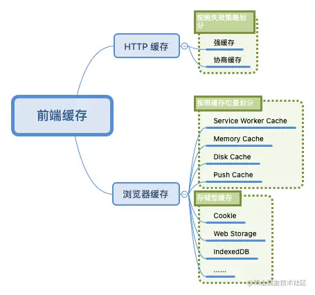

# 1.开篇：小册背景及前言

 ## 背景

大家好，我是劳卜，很高心能够再次以小册作者的身份跟大家见面。这一次我还将围绕前端这一大方向来“讲故事”，不同的是**前端缓存**成了本次故事的主人公，而我又成为了那个“码梦为生，笔耕不辍”的小说家。

说起缓存，这已经是一个老生常谈的话题了，既然是老生常谈的话题，那为什么这一次又要拾起它把它放到台面上来讲？因为我相信80%的小伙伴对于缓存的了解只停留在其表面功夫上，未有实质性的探究和深入的学习，因此当遇到因缓存造成的问题时，时常迷惑不堪，花费大把时间也无济于事。既然这样，何不和我一起踏入这一老生常谈的话题之中，揭开缓存背后的秘密。

其实在笔者的日常工作中也经常和缓存打交道，因为它无处不在，如果你所开发的前端项目没有涉及缓存，那一定是一件不可思议的事情。而**缓存的合理使用会直接影响到网页的性能**，可见它的重要性。

正因频繁的与缓存打交道并且善于总结，笔者我把处理缓存问题遇到的坑，总结的经验和分析得出的原理分享出来，汇聚成了这本小册与大家分享，希望屏幕前的你少走不必要的弯路。**同时，建议每一位读者都抱着一颗好奇的心往下阅读，因为面对枯燥的文字很容易产生抵抗的情绪阻止你变得更加强大。**

## 了解主人公：前端缓存

上述背景中我们频繁说到了一个词 —— 缓存，这一词也会贯穿整本小册并频繁出现在小册的上下文中，就好比一篇小说的主人公一样。既然缓存是我们的主人公，是最重要最核心的所在，接下来有必要给读者们介绍下什么是缓存？

首先就缓存来讲，百度百科是这样介绍的：

> **缓存（cache**），原始意义是指访问速度比一般[随机存取存储器](https://baike.baidu.com/item/%E9%9A%8F%E6%9C%BA%E5%AD%98%E5%8F%96%E5%AD%98%E5%82%A8%E5%99%A8)（RAM）快的一种高速存储器，通常它不像系统主存那样使用[DRAM](https://baike.baidu.com/item/DRAM)技术，而使用昂贵但较快速的[SRAM](https://baike.baidu.com/item/SRAM)技术。缓存的设置是所有现代计算机系统发挥高性能的重要因素之一。

其实我们不用太关注介绍中所述的一些名词，因为此缓存非彼缓存，和本小册介绍的前端缓存有着实质性的区别，但共同之处在于**访问速度快**、**高性能**。

那么什么又是前端缓存？大家都知道前端开发脱离不了网络和浏览器，前端缓存也可以直接看作是
**HTTP 缓存**和**浏览器缓存**的结合，两者是相辅相成的关系。

HTTP 缓存是产生于客户端与服务器之间通信的一种缓存，利用这一缓存可以提升服务器资源的重复利用率，在有效的时间内不必每次都向服务器请求相同的资源，大大减少服务器的压力；而浏览器缓存则是浏览器提供的一种缓存机制，可以将服务器资源和网页访问产生的临时数据缓存到内存或本地，提升客户端的加载速度。

以上我们把前端缓存划分为两个大类，比较笼统，如果我们要往下细分的话，还可以继续拆解，这里笔者顺藤摸瓜，再提出一个问题：**前端到底有哪些缓存？**

因分类方式及细分程度的不同，不同的读者可能有不同的答案，比如 HTTP 缓存**按照失效策略划分**可以分为：

- 强缓存
- 协商缓存

浏览器缓存**按照缓存位置划分**可以分为：

- Service Worker Cache
- Memory Cache
- Disk Cache
- Push Cache

当然前端缓存不止以上这些，比如还有存储型缓存 Cookie、Web Storage、IndexedDB 等。

有读者可能会说还有 CDN 缓存，其实从本质上讲 CDN 缓存属于服务端缓存，不在本小册前端缓存的介绍之中，但前端会使用 CDN 加速静态文件，也会涉及一些前端的缓存知识，所以本小册在介绍前端缓存时会有所涉及但不会进行详细介绍。

最后，我们都知道一篇小说的主人公是有主人公光环的，能伴随小说自始至终，经久不衰，笔者认为前端缓存也是如此。虽然在前端技术领域，曾经出现过很多脍炙人口的技术或框架，但随着技术的发展和迭代都经历不住考验渐渐退出历史舞台。但**前端缓存毕竟是一个与网络、浏览器息息相关的技术，相信会和主人公光环那样经久不衰，即便技术不断发展也不会消失，反而会日新月异**。

## 致读者

如果读者对上述介绍的缓存一无所知或有些陌生，那么本小册一定适合你进行阅读和学习，你必将收获很多平时开发过程中隐藏在代码和性能背后的秘密。虽然陌生但我相信作为一个普通用户也经常会与它打交道，最直接的接触感受有以下两点：

**一是第一次访问网站打开速度会有点慢，再次访问的时候就快了很多；二是当登录一个网站后再次访问的时候就已经是登录状态了。这两种最直接感受的背后就是前端缓存在“作祟”。**

如果读者已经对前端缓存有过较为深入的学习和实践，那么本小册也值得成为你进行系统性复习的资料。笔者之所以会写此小册也是因为目前市面上系统性详细介绍前端缓存的书籍或资料少之又少，大多是简单和分散性的介绍，不利于知识点的梳理和学习。

当然并不是所有的读者都适合阅读本小册，兴趣是最好的老师，如果你对前端缓存没有兴趣，加上平时工作中也不会接触，那么不建议进行购买和阅读。

总的来说，前端缓存无时无刻不影响着我们，本小册也将主要围绕 HTTP 缓存和浏览器缓存这两个大类及以上所述的小类展开解析，同时会将缓存技术与缓存方案结合，**让你在了解“是什么”的前提下知道“为什么”、“怎么做”。**

倘若读者你已经准备好踏入这老生常谈的话题之中，希望你能够从上而下阅读，因为小册的知识点是循序渐进、由浅入深的，跳章节阅读不利于系统性的学习。同时对于自己不易理解的知识点需要反复阅读，笔者我也会尽力将艰涩难懂的知识采用流程图或举例进行说明，尽量消除缺乏经验读者的阅读障碍。

**路虽弥，不行不至；事虽小，不为不成。若你已备好行囊，愿归来任是少年。**

