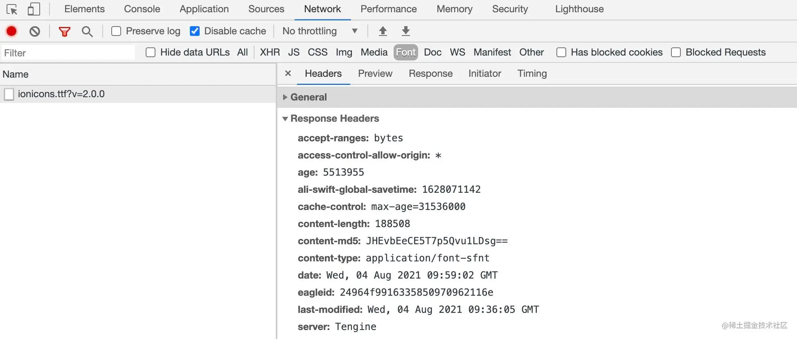
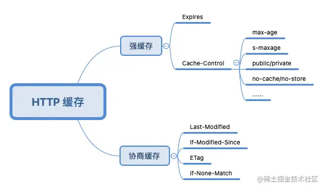

# 2.HTTP 缓存1：开门见山——请求响应头中关于缓存的奥秘

首先，在开启本节之前，欢迎大家来到前端缓存第一课：HTTP 缓存。在本节中，笔者将带大家揭开 HTTP 请求响应头中关于缓存的奥秘。

那么在介绍 HTTP 缓存前，我们不妨先介绍下 HTTP。

## 从 HTTP 开始

首先我们了解下 HTTP 的概念：

> 超文本传输协议（Hyper Text Transfer Protocol，HTTP）是一个简单的请求-响应协议，它通常运行在TCP之上。它指定了客户端可能发送给服务器什么样的消息以及得到什么样的响应。

以上我们不难发现 HTTP 是一种超文本传输协议，HTTP 协议用于客户端和服务端之间的通信（通过请求和响应的交换达成通信），请求必定由客户端发出，而服务端回复响应。

HTTP 请求部分又可以称为前端工程师眼中的 HTTP，它主要发生在客户端，请求是由“报文”的形式发送的，请求报文由三部分组成：**请求行、请求报头和请求正文**。同样 HTTP 响应部分的响应报文也由三部分组成：**状态行、响应报头和响应正文**。

这里我们拎出关键与缓存有关的**请求报头**和**响应报头**，也正是我们浏览器 `Network` 面板中常见的 `Request Headers` 和 `Response Headers`部分，以 Chrome 为例：



我们可以看到报头是由一系列中间用冒号 “:” 分隔的键值对组成，我们把它称为**首部字段**，其由首部字段名和字段值构成。如：

```bash
Content-Type: text/javascript
```

以上首部字段名为 Content-Type，首部字段值为 text/javascript，表示报文主体的对象类型。

首部字段又分为四种类型：

- [通用首部字段](https://www.w3.org/Protocols/rfc2616/rfc2616-sec4.html#sec4.5)（请求报头和响应报头都会用到的首部）
- [请求首部字段](https://www.w3.org/Protocols/rfc2616/rfc2616-sec5.html#sec5.3)（请求报头用到的首部）
- [响应首部字段](https://www.w3.org/Protocols/rfc2616/rfc2616-sec6.html#sec6.2)（响应报头用到的首部）
- [实体首部字段](https://www.w3.org/Protocols/rfc2616/rfc2616-sec7.html#sec7.1)（针对请求报头和响应报头实体部分使用的首部）

那么各类型的首部字段到底包含哪些首部？读者可以点击查阅以上各首部字段对应的 `w3` 文档进行查阅。比如通用首部字段包含了：

```bash
Cache-Control
Connection
Date
Pragma
Trailer
Transfer-Encoding
Upgrade
Via
Warning
```

与缓存无关的首部字段不在本小册的介绍范围内，下面我们重点介绍与缓存有关的首部字段名，为后续章节储备必要的知识。

## 与缓存有关的首部字段名

开篇我们提到了 HTTP 缓存可以拆解为强缓存和协商缓存，也就是我们需要弄清楚和强缓存、协商缓存有关的首部字段名。为了让读者便于理解和记忆，笔者我使用了以下思维导图的模式来展示：



上图中和强缓存有关的首部字段名主要有两个：`Expires` 和 `Cache-Control`，我们依次来进行讲解。

### Expires

Expires 首部字段是 `HTTP/1.0` 中定义缓存的字段，其给出了缓存过期的**绝对时间**，即在此时间之后，响应资源过期，属于**实体首部字段**。

#### 示例

```bash
Expires: Wed, 11 May 2022 03:50:47 GMT
```
上述示例表示该资源将在以上时间之后过期，而在该时间之前浏览器可以直接从浏览器缓中读取数据，无需再次请求服务器。注意这里**无需再次请求服务器**便是命中了强缓存。

但是因为 Expires 设置的缓存过期时间是一个绝对时间，所以会受客户端时间的影响而变得不精准。

### Cache-Control

Cache-Control 首部字段是 `HTTP/1.1` 中定义缓存的字段，其用于控制缓存的行为，可以组合使用多种指令，多个指令之间可以通过 “,” 分隔，属于**通用首部字段**。常用的指令有：max-age、s-maxage、public/private、no-cache/no store 等。

#### 示例

```bash
Cache-Control: max-age:3600, s-maxage=3600, public
Cache-Control: no-cache
```
`max-age` 指令给出了缓存过期的**相对时间**，单位为秒数。当其与 Expires 同时出现时，**max-age 的优先级更高**。但往往为了做向下兼容，两者都会经常出现在响应首部中。

同时 max-age 还可在请求首部中被使用，告知服务器客户端希望接收一个存在时间（age）不大于多少秒的资源。

而 `s-maxage` 与 max-age 不同之处在于，其只适用于公共缓存服务器，比如资源从源服务器发出后又被中间的代理服务器接收并缓存。


**当使用 s-maxage 指令后，公共缓存服务器将直接忽略 Expires 和 max-age 指令的值。**

另外，`public` 指令表示该资源可以被任何节点缓存（包括客户端和代理服务器），与其行为相反的 `private` 指令表示该资源只提供给客户端缓存，代理服务器不会进行缓存。**同时当设置了 private 指令后 s-maxage 指令将被忽略。**

下面再来介绍下 no-cache、no store 指令，**需要注意的是这两个指令在请求和响应中都可以使用**，两者看上去都代表不缓存，但在响应首部中被使用时， `no store` 才是真正的不进行任何缓存。

当 no-cache 在请求首部中被使用时，表示告知（代理）服务器不直接使用缓存，要求向源服务器发起请求，而当在响应首部中被返回时，表示客户端可以缓存资源，但每次使用缓存资源前都**必须**先向服务器确认其有效性，这对每次访问都需要确认身份的应用来说很有用。

当然，我们也可以在代码里加入 meta 标签的方式来修改资源的请求首部：

```html
<meta http-equiv="Cache-Control" content="no-cache" />
```

至此，我们已经基本了解了强缓存下请求响应的两个主要首部字段，那么顺其自然，我们接着再来看看协商缓存中涉及的主要首部字段名：`Last-Modified`、`If-Modified-Since`、`Etag`、`If-None-Match`。

### Last-Modified 与 If-Modified-Since

Last-Modified 首部字段顾名思义，代表资源的最后修改时间，其属于**响应首部字段**。当浏览器第一次接收到服务器返回资源的 Last-Modified 值后，其会把这个值存储起来，并再下次访问该资源时通过携带 If-Modified-Since 请求首部发送给服务器验证该资源有没有过期。

#### 示例

```bash
Last-Modified: Fri , 14 May 2021 17:23:13 GMT
If-Modified-Since: Fri , 14 May 2021 17:23:13 GMT
```

如果在 If-Modified-Since 字段指定的时间之后**资源发生了更新**，那么服务器会将更新的资源发送给浏览器（状态码200）并返回最新的 Last-Modified 值，浏览器收到资源后会更新缓存的 If-Modified-Since 的值。

如果在 If-Modified-Since 字段指定的时间之后**资源都没有发生更新**，那么服务器会返回状态码 `304 Not Modified` 的响应。

### Etag 与 If-None-Match

Etag 首部字段用于代表资源的唯一性标识，服务器会按照指定的规则生成资源的标识，其属于**响应首部字段**。当资源发生变化时，Etag 的标识也会更新。同样的，当浏览器第一次接收到服务器返回资源的 Etag 值后，其会把这个值存储起来，并在下次访问该资源时通过携带 If-None-Match 请求首部发送给服务器验证该资源有没有过期。

#### 示例

```bash
Etag: "29322-09SpAhH3nXWd8KIVqB10hSSz66"
If-None-Match: "29322-09SpAhH3nXWd8KIVqB10hSSz66"
```

如果服务器发现 If-None-Match 值与 Etag 不一致时，说明服务器上的文件已经被更新，那么服务器会发送更新后的资源给浏览器并返回最新的 Etag 值，浏览器收到资源后会更新缓存的 If-None-Match 的值。

行文至此，和强缓存与协商缓存相关的首部字段已经介绍完毕，相信大家在有所收获的同时也产生了一些疑惑和不解，没关系，这毕竟只是一个开始，相信后续的章节将逐渐为大家“拨开云雾”。

## 结语

本文从 HTTP 出发，介绍了 HTTP 的概念、报文的组成及与缓存相关的首部字段，一层层揭开请求响应头中关于缓存的奥秘。其中有些知识点笔者故意没有进行详细的介绍，是为了为后续的章节做好铺垫。

本文涉及的首部字段将会在后续的“关卡”中频繁出现，倘若你已经大致了解了本文所述的知识点，打开了属于你的“知识宝箱”，那么下一关的大门便已敞开。

## 欢迎加入作者互动群


