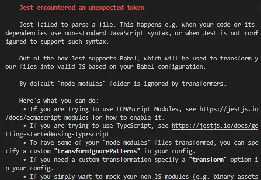
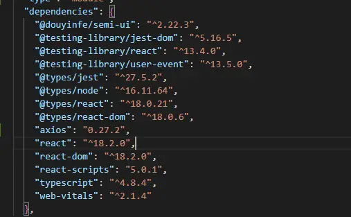
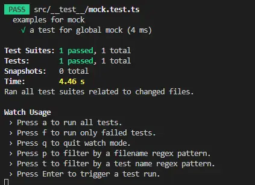

# 10.Mock：怎么替代不需要关注的逻辑？

> 代码仓库：https://github.com/czm1290433700/test_demo

上节课我们学习了 Jest 提供的 FakeTimer，通过它我们可以“快进”定时任务用例，不再需要等待同样的定时时长来获取最终的结果了。在上节课的最后的一则用例中，我们使用了 `jest.fn()`来作为 `asyncSleep`函数的入参。

```
import React from "react";
import { sleep, loopSleep, asyncSleep } from "../components/FakeTimer";

// 9 | FakeTimer：如何"快进"测试定时任务？
describe("examples for fakeTimers", () => {
  beforeAll(() => {
    jest.useFakeTimers();
  });

  // ... other content
  test("a test for a setTimeout with async function", async () => {
    const fn = jest.fn();
    asyncSleep(6000, fn);
    jest.runOnlyPendingTimers();
    await Promise.resolve();
    expect(fn).toBeCalled();
  });
});
```

在上面这则例子中，因为我们并不关心传入 asyncSleep 的回调函数逻辑，我们只希望它可以在指定时间执行回调，所以我们这里使用了 jest 提供的 mock 函数作为它的入参。

因为我们之前的场景并不那么复杂，在实际的业务场景中，我们一个文件中往往穿插着各种引用。其中包含一些测试环境没有的 API 或者全局变量，或者不在我们测试范围内的外部文件，这都是很常见的现象，这些情况我们都需要使用 mock 来模拟它们进行测试。

所以在实际的业务单测中，mock 是很重要的测试手段，这节课我们就来结合场景捋捋，怎么通过 mock 来模拟一些不需要关注的逻辑。

## 全局 mock

在业务场景中，我们可能会导入一些外部依赖进行测试，针对这些外部依赖，我们可能并不关心它的内部逻辑是怎么样的，我们只需要它可以返回预期的结果就好，对于这种场景，我们可以采取全局 mock 的方式，jest 为我们提供了一个 全局 mock 的 API。

```
jest.mock(path, moduleFactory)
```

它接受两个参数，path 和 moduleFactory，其中 path 是需要 mock 的文件路径，moduleFactory 是这个模块的工厂函数，类型与模块保持一致就行，可以进行更自定义的 mock。

这个 mock 的执行会被提升到 import 之前，也就是对于这个文件而言，mock 的内容会替代原有的模块，我们以需求中最常见的场景请求（axios）为例子，看下如何通过全局的方式来测试请求。

首先我们来安装一下 axios 的依赖：

```
npm install axios
```

然后我们加上下面的用例：

```
// ./src/__test__/mock.test.ts
import React from "react";
import axios from "axios";

jest.mock("axios");

// 10 | Mock: 怎么替代不那么重要的逻辑？
describe("examples for mock", () => {
  test("a test for global mock", async () => {
    const res = "this is a test for global mock";
    axios.get.mockResolvedValue(res);
    const data = await axios.get("/");
    expect(data).toBe("this is a test for global mock");
  });
});
```

在上面的例子中，我们用 mock 替代了 axios 的原生模块，其中 axios.get 会返回 jest 的 mockFn，mockResolvedValue 是 mockFn 提供的一个 API，通过它，我们可以模拟 mockFn 的异步返回值，除这个之外，我们还会经常用到以下几种:

| mockFn 提供的 API                        | 能力                        |
| ------------------------------------- | ------------------------- |
| `mockFn.mockReturnValue(value)`       | Mock 返回值，同步               |
| `mockFn.mockReturnValueOnce(value)`   | Mock 返回值，同步，只生效一次         |
| `mockFn.mockResolvedValue(value)`     | Mock resolve 返回值，异步       |
| `mockFn.mockResolvedValueOnce(value)` | Mock resolve 返回值，异步，只生效一次 |
| `mockFn.mockRejectedValue(value)`     | Mock reject 返回值，异步        |
| `mockFn.mockRejectedValueOnce(value)` | Mock reject 返回值，异步, 只生效一次 |

现在我们可以来执行一下这个用例。用例执行的过程中大家可能会遇到下面的报错。



这是因为 axios1.x 现在只发出一个 ESM 模块，而不再是一个 CJS 模块，这会导致 Jest 出现解析错误，这是一个已知 [issue](https://github.com/axios/axios/issues/5026)，目前还没得到解决。针对这个问题有两个解决方案。

-   我们可以降级 axios 版本到 0.27.2，这是 0.x 中最新的版本。



-   仍然选择延用 1.x 的同学可以修改 jest.config.js 的配置，把 axios 移除测试编译范围。以我们当前项目为例子，因为我们使用的是 CRA，不通过 jest.config.js 配置，我们可以直接在 package.json 加上下面的配置，默认 node_modules jest 是不走 babel 编译的，现在我们把 axios 引入编译范围。

```
// ./package.json
{
  // ...
  "jest": {
    "transformIgnorePatterns": [
      "node_modules/(?!axios)"
    ]
  }
}
```

直接使用 jest.config.js 配置的同学可以直接在 jest.config.js 中加上同样的配置：

```
module.exports = {
  // ...
  transformIgnorePatterns: ["node_modules/(?!axios)"],
};
```

这两种方案都可以解决这个问题，大家可以根据自己对 axios 的需求自行选用：



不过因为 mock 是在 import 之前覆写的缘故，类型并没有得到修改，所以我们会有下面的类型报错：


这个问题我们可以通过 jest-mock 提供的 mocked 函数来解决，它会帮我们补充全局 mock 对应的 mockFn 类型，首先我们来安装一下依赖：

```
npm install jest-mock
```

然后我们来调整一下用例：

```
// ./src/__test__/mock.test.ts
import React from "react";
import axios from "axios";
import { mocked } from "jest-mock";

jest.mock("axios");

// 10 | Mock: 怎么替代不那么重要的逻辑？
describe("examples for mock", () => {
  test("a test for global mock", async () => {
    const res = "this is a test for global mock";
    // axios.get.mockResolvedValue(res);
    mocked(axios.get).mockResolvedValue(res);
    const data = await axios.get("/");
    expect(data).toBe("this is a test for global mock");
  });
});
```

可以看到现在就没有类型的报错了~


## 单次 mock

上面我们提到针对 jest 的 mock API 会提升到 import 之前，也就是 import 的内容不再是原有的模块，除全局的 mock 外，我们还可以进行单次的 mock，jest 对于单次的 mock 提供了一个与 mock 对应的方法 —— doMock

```
jest.doMock(moduleName, factory, options)
```

doMock 的使用与 mock 略有不同，我们可以先来看下下面的例子：

```
// ./src/components/Mock/index.ts
const mock = {
  getMockData: () => {
    return "oldMockData";
  },
};

export default mock;
```

```
// ./src/__test__/mock.test.ts
import React from "react";
import axios from "axios";
import mock from "../components/Mock";

jest.mock("axios");

// 10 | Mock: 怎么替代不那么重要的逻辑？
describe("examples for mock", () => {
  // ...other

  test("a test for single mock", () => {
    jest.doMock("../components/Mock", () => ({
      __esModule: true,
      getMockData: () => {
        return "newMockData";
      },
    }));
    // expect(mock.getMockData()).toBe("newMockData");
    const mock = require("../components/Mock");
    expect(mock.getMockData()).toBe("newMockData");
  });
});
```

在这个例子中，有几个大家需要关注的点。

-   doMock 的第二个入参：也就是我们之前提到的 factory，我们可以通过这个参数来覆写原模块的属性和属性函数，让它们可以返回固定的逻辑或者值。
-   `__esModule: true`：因为我们定义的 mock 模块是通过 esModule 导出的，所以需要加上这个属性帮助 jest 进行 mock。
-   `require("../components/Mock")`: 如果我们直接在全局定义，然后调用可以吗？当然不可以~ 因为 doMock 只会对我们这个 test 生效，而不会提升到 import 之前去覆写原有模块，所以需要采用在用例内 require 的方式导入，直接 import 的模块还会是原来的文件，并不会生效 mock。

## mock 函数

除了 mock 和 doMock 外，jest 还提供了两个常用的 function 帮助我们进行函数的 mock：

```
jest.fn(implementation?)
jest.spyOn(object, methodName)
```

其中 `jest.fn` 用于 mock 一个空函数，它会默认返回 undefined，当然我们也可以传入两个类型来控制它的入参和回参内容，例如`jest.fn<string, string>()`就对应一个入参和回参都为 string 的 mock 函数了~

`jest.spyon`也可以创建一个和`jest.fn`类似的 mock 函数，不同的是它可以追踪目标函数的调用，使得它的入参和回参与需要 mock 的函数是自动匹配的，对于全局 mock 中的那个类型问题，我们就可以使用`jest.spyon`来解决。

```
// ./src/__test__/mock.test.ts
import React from "react";
import axios from "axios";

jest.mock("axios");

// 10 | Mock: 怎么替代不那么重要的逻辑？
describe("examples for mock", () => {
  test("a test for global mock", async () => {
    const res = "this is a test for global mock";
    // axios.get.mockResolvedValue(res);
    jest.spyOn(axios, "get").mockResolvedValue(res);
    const data = await axios.get("/");
    expect(data).toBe("this is a test for global mock");
  });
});
```

这样就不会有类型的问题了，不仅如此，单次 mock 中的例子我们也可以尝试使用它来覆盖：

```
import React from "react";
import axios from "axios";
import mock from "../components/Mock";

jest.mock("axios");

// 10 | Mock: 怎么替代不那么重要的逻辑？
describe("examples for mock", () => {
  // ...other

  test("other ways for single mock", () => {
    jest.spyOn(mock, "getMockData").mockReturnValue("newMockData");
    expect(mock.getMockData()).toBe("newMockData");
  });
});
```

其实，通过 `jest.spyOn` 足够覆盖我们需要的大部分场景，不过它一次只能 mock 一个对应的函数，如果需要对整体模块覆写，那我们还是需要 mock 和 doMock 来协助实现的。

## 小结

这节课我们学习了怎么使用 mock 来替代不需要关注的逻辑，在我们的业务场景中，经常会引用一些外部或者全局逻辑，这些逻辑和我们需要测试的组件内容其实不那么相关，我们可能只需要这些逻辑能有预期的输入输出，通过这种场景我们都会使用 mock来解决。

我们分别介绍了全局 mock，单次 mock 和 mock 函数三种场景，在全局 mock 中我们使用了 jest 的 `mock` API，这个会被提升到文件的 import 之前，使得整个文件引用的对应模块都会采用我们进行的 mock，不过这个可能会有类型的问题，我们可以通过 jest-mock 提供的 `mocked` 函数解决。

紧接着我们还学习了单次 mock，与全局 mock 不同的是，它只会对单次的用例生效，我们需要采用 require 的方式来动态导入我们需要 mock 的模块。

除了这些，我们还学习了 mock 函数中的 `fn` 和 `spyon` API，fn 需要自己定义入参和回参的类型，我们通常用它来定义一些简单、好定义类型的函数，而 spyon 自动追踪需要调用的函数类型进行 mock，通过它我们可以实现我们需要的大部分场景，不过它一次只能 mock 一个函数，针对一个模块，我们还是需要使用 `mock` 和 `doMock` 来完成。

到这里，其实相信大部分的场景同学们都可以完成了，但是在 React 中还有一个很特殊而且使用广泛的模块 —— hook，与常规函数不同，hook 只能在组件中使用，我们并不能像测试函数一样直接去验证它的输入输出，不过也是有解决的办法的。下节课我们就来学习怎么对我们业务中的 hook 覆盖单测。