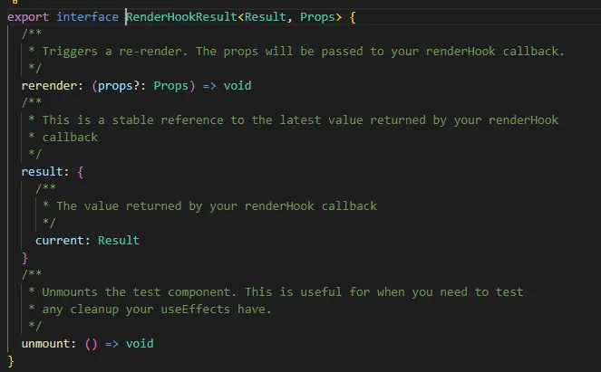

# 11.RenderHook：怎么测试 React hook？

> 代码仓库：https://github.com/czm1290433700/test_demo

上一节课中，我们学习了怎么使用 Mock 来代替不那么重要的逻辑，分别了解了全局 mock 和 局部 mock 的方式，当我们使用`  mock  `方法的时候，这部分 mock 将被提升到 import 之前，使得整个模块的导入可以由 mock 内容替代。除了全局 mock 外，我们还可以使用 `doMock`、`spyon`等方法来在指定用例下进行模块的模拟。

到目前为止，我们已经学习了单元测试下的大部分场景，相信大家对于业务测试已经有一定的思路了。不过还有一种特殊的情况我们没有提及，那就是 hook 的测试。

Hook 是 React16 提出的新特性，通过它我们慢慢抛弃了 class 的写法，开始可以在不编写 class 的情况下使用 state 以及其他 React 特性，转向函数式编程。

不过与普通函数不同的，hook 只可以在 React 组件的顶部进行调用。在我们的测试用例中，并不能像普通函数那样去测试 hook，那么应该怎么去测试 React hook 呢？

## 从组件维度进行覆盖

最简单直接的方式就是从组件维度展开测试，通过直接测试调用 hook 组件的方式来完成这部分用例，我们来看下面的例子：

```
// ./src/components/RenderHook/useCount.ts
import { useCallback, useState } from "react";

// 11 | RenderHook：怎么测试React hook？
const useCount = () => {
  const [num, setNum] = useState(0);

  const increase = useCallback(() => {
    setNum(num + 1);
  }, []);

  return { num, increase };
};

export default useCount;
```

```
// ./src/components/RenderHook/index.tsx
import { FC } from "react";
import useCount from "./useCount";

interface IProps {}

export const RenderHook: FC<IProps> = ({}) => {
  const { num, increase } = useCount();

  return (
    <div>
      <span role="note">{num}</span>
      <button onClick={increase}>增加</button>
    </div>
  );
};
```

上面我们实现了一个 hook useCount 和组件 RenderHook，在组件 RenderHook 中使用了 useCount 的 hook 来实现数字点击递增的效果，在这个例子中，我们就可以通过测试 RenderHook 组件的能力来推断 useCount 是否符合预期，我们来看下面的用例。

```
import React from "react";
import { render, screen} from "@testing-library/react";
import useCount from "../components/RenderHook/useCount";
import { RenderHook } from "../components/RenderHook";
import userEvent from "@testing-library/user-event";

// 11 | RenderHook：怎么测试React hook？
describe("examples for render hook", () => {
  test("a test for component with useCount", () => {
    render(<RenderHook />);
    const note = screen.getByRole("note");
    expect(note).toHaveTextContent("0");
    userEvent.click(screen.getByRole("button"));
    expect(note).toHaveTextContent("1");
  });
});
```


## RenderHook

但是上面的这个方法只能覆盖这个 hook 本身就是为组件定义的场景，我们不可避免会定义一些公共的 hook ，对于这些 hook 可能会被多个组件调用，我们不可能深入组件内部去测试。同学们可能会说，那我们为这些公共 hook 来定义一个组件专门测试不就好了吗？


的确是可行的，但是为了测试 hook ，我们不得不创建大量与业务代码无关的测试组件，这个过程在业务中实现显得不那么优雅。为了解决这个问题，testing-library 提供了一个 renderHook 的库来帮我们实现，在它的内部会替我们完成上面我们提到的想法。

如果项目是 React 18 & testing - library 13.1 以上版本的同学，不需要安装任何额外的依赖，可以直接在 `@testing-library/react`中直接调用，依赖本身已经做了相关的集成处理。

如果不满足上述的情况，我们需要自己安装一下依赖，在依赖中引用：

```
npm i @testing-library/react-hooks
```

现在我们来通过 renderHook 再覆盖一下上面 hook 的用例：

```
import React from "react";
import { render, screen, renderHook } from "@testing-library/react";
import useCount from "../components/RenderHook/useCount";
import { RenderHook } from "../components/RenderHook";
import { act } from "react-dom/test-utils";
import userEvent from "@testing-library/user-event";

// 11 | RenderHook：怎么测试React hook？
describe("examples for render hook", () => {
  // ... other
  test("a test for useCount", () => {
    const { result } = renderHook(() => useCount());
    act(() => {
      result.current.increase();
    });
    expect(result.current.num).toBe(1);
  });
});
```


可以看到优雅了很多，我们不再需要基于组件维度去测试我们的用例，只需要把它包裹在 renderHook中，对应的结果会被存放在 result 字段中，我们可以直接解构出来断言。



不过值得一提的是，因为 renderHook 并没有帮我们触发 rerender，所以对于会修改到 state 的方法，我们需要手动将它们用 act 包裹起来触发 rerender。

## 关于 hook 测试的建议

虽然 renderHook 能帮助我们很方便地测试 hook，但是不得不说的是，我仍然建议大家通过组件维度来测试 hook ，而不是滥用 renderHook。

在之前的课程中，我们有反复提到，我们应该尽可能让测试更为强健，也就是从用户视角展开测试，而不是代码结构层面来开展我们的测试。对于用户而言，它并不关心你这里使用的是 hook 还是普通函数，只要能得到它预期的结果就可以，至于内部实现其实并不重要。也就是说，如果对于组件内部的 hook，直接对 hook 展开测试，并不如从组件维度展开测试来的强健。

当然，如果这个 hook 是作为一个公共的 hook，被多个组件来使用，这种场景更适合使用 renderHook 来实现，这个是不矛盾的，因为作为公共组件的 hook，它的直接用户是组件（component），所以我们不应该深入组件内部去测，而是应该直接通过 renderHook 来验证 hook 的功能正常。

## 小结

这节课我们学习了怎么测试 React hook，hook 在 React 中是一个特殊的函数，它只能在 React 组件顶部进行调用，所以我们不能像普通函数一样，在用例中直接调用它来测试。

对于它的测试，我们有两种方法，一种是基于组件维度来进行覆盖，通过测试调用 hook 的组件功能，进而验证 hook 的功能符合预期，另一种则是使用 renderHook 来进行 hook 验证，通过传入 hook 的回调，我们可以直接获取对应 hook 的返回，从而来进行我们的断言。

虽然 renderHook 的测试很方便，但是并不建议大家滥用，因为我们需要从用户视角来展开测试，从而保证用例尽可能强健，当然对于公共逻辑的 hook，因为用户是组件（component) 本身，所以我们还是适合通过 renderHook 的方式来完成用例。

到这里单元测试的部分我们就已经学完了，下节课我们会来学习一种特殊的测试方式，快照测试。通过它，我们可以快速高效地保证组件 UI 的完整。