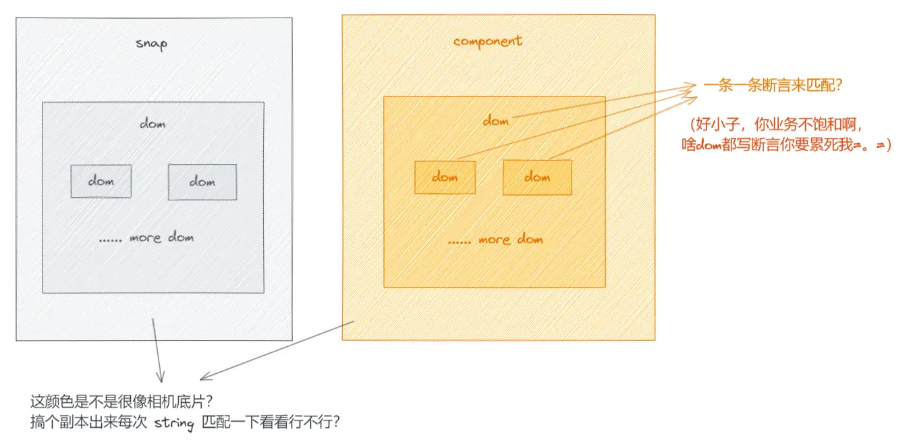
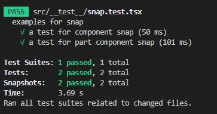
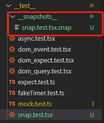
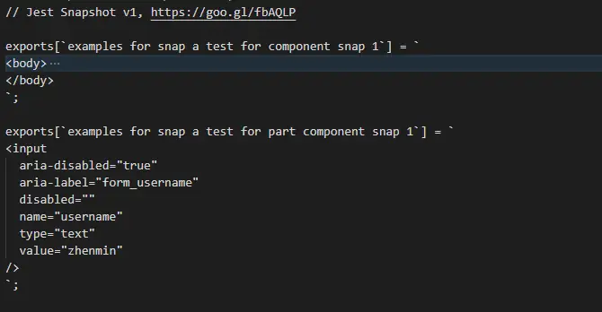
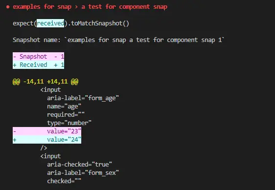
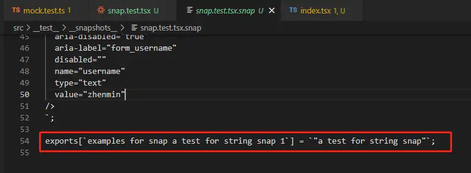
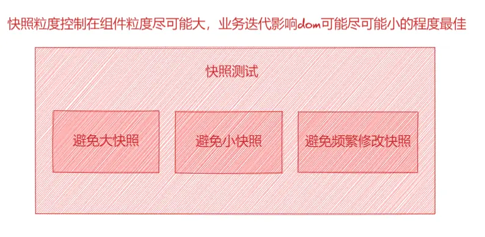

# 12.快照测试：怎么保障组件 UI 的完整？

> 代码仓库：https://github.com/czm1290433700/test_demo

上节课我们学习了怎么测试一个 hook 方法，因为 hook 只能在 React 组件顶部调用的特性，所以我们不能像测试普通函数一样测试它，还学习了从组件维度和 renderHook 两种测试的方案和它们适用的场景，我们单元测试的内容就已经学完了，在这节课中，我们会来学习一种不同的测试方案 ---- 快照测试。

在开始这节课的学习前，我想请同学们思考一个问题，对于一个业务组件，我们可以用什么手段来保证组件 UI 的完整呢？有的同学可能就会说了，我们可以用断言呀，查询到对应的元素来判定它不就好了吗 ~ 

这个的确是一个办法，但是断言只能匹配到我们查询到的区域是正常的，一个组件中肯定有一些 DOM 是和功能本身关系不大，但又必须存在的，如果都覆盖断言，一个用例可能就会有几十上百行，那对工程师的心理负担和业务压力增加就太大了（可能真的就要提桶跑路了=。=）



这边有一个解决办法是使用快照测试，快照测试和它的字面意思一样，通过“快速（简单）拍出的照片”来测试，它是将我们需要判定的元素的内容存储下来，在下一次匹配时，会判断两次的结果能否匹配，从而达到从整体维度保证组件功能完成的能力。

## 组件的快照测试

React Testing library 中提供了快照测试的能力，我们只需要使用它提供给我们的 `toMatchSnapshot` 断言就好，我们可以直接来看看下面的例子：

```
// ./src/components/DomSnap/index.tsx
import { FC } from "react";

interface IProps {}

// 12 | 快照测试：怎么保障组件 UI 的完整？
export const DomSnap: FC<IProps> = ({}) => {
  return (
    <form aria-label="form">
      <input
        type="text"
        name="username"
        disabled
        aria-disabled
        defaultValue="zhenmin"
        aria-label="form_username"
      />
      <input
        type="number"
        name="age"
        defaultValue={23}
        required
        aria-label="form_age"
      />
      <input
        type="radio"
        name="sex"
        value="man"
        defaultChecked
        aria-checked
        aria-label="form_sex"
      />
      <input type="radio" name="sex" value="woman" aria-label="form_sex" />
    </form>
  );
};
```

```
import React from "react";
import { render, screen } from "@testing-library/react";
import { DomSnap } from "../components/DomSnap";

// 12 | 快照测试：怎么保障组件 UI 的完整？
describe("examples for snap", () => {
  test("a test for component snap", () => {
    const { baseElement } = render(<DomSnap />);
    expect(baseElement).toMatchSnapshot();
  });

  test("a test for part component snap", () => {
    render(<DomSnap />);
    expect(
      screen.getByRole("textbox", { name: "form_username" })
    ).toMatchSnapshot();
  });
});
```

在上面的例子中，定义了一个 form，我们需要对它进行快照测试，在用例当中，我示范了全局和部分区域的快照筛选，我们来执行这个用例看看。



除了用例执行成功的说明外，可以发现在 __test__ 目录下生成了一个 __snapshots__ ，这个目录用来存放我们的快照文件：



我们来看看新生成的快照里面有什么：



可以看到针对每一个用例中使用到 toMatchSnapshot 断言的地方，它都会生成一个对应查询区域的快照，后面我们在每次执行这个用例的时候，都会去比对这次的快照能否和上次的匹配起来，我们不妨来改点 dom 试试看。

```
// ./src/components/DomSnap/index.tsx
import { FC } from "react";

interface IProps {}

// 12 | 快照测试：怎么保障组件 UI 的完整？
export const DomSnap: FC<IProps> = ({}) => {
  return (
    <form aria-label="form">
      <input
        type="text"
        name="username"
        disabled
        aria-disabled
        defaultValue="zhenmin"
        aria-label="form_username"
      />
      <input
        type="number"
        name="age"
        // defaultValue={23}
        defaultValue={24}
        required
        aria-label="form_age"
      />
      <input
        type="radio"
        name="sex"
        value="man"
        defaultChecked
        aria-checked
        aria-label="form_sex"
      />
      <input type="radio" name="sex" value="woman" aria-label="form_sex" />
    </form>
  );
};
```

因为祯民马上 24 了，所以我们这边可以把 age 表单的默认值换成 24，然后我们重新跑一下用例看看会不会匹配出来对应的调整，可以看到和我们预期的一样，对应的区域发生了调整。



## 序列字符的快照测试

除组件以外呢，快照测试其实也是可以用在函数返回值等非 DOM 的序列字符场景下的，我们来看看下面的例子。

```
import React from "react";
import { render, screen } from "@testing-library/react";
import { DomSnap } from "../components/DomSnap";

// 12 | 快照测试：怎么保障组件 UI 的完整？
describe("examples for snap", () => {
  // ...
  test("a test for string snap", () => {
    expect("a test for string snap").toMatchSnapshot();
  });
});
```

上面的例子里，我们增加一个字符串的快照，这个也是可以用快照测试来验证的。



## 快照测试的更新

大家可能会有一个疑问，如果我这次需求迭代完，这个组件的确 DOM 结构就是会变，那我们应该怎么更新之前的快照呢？对于用例中的快照更新有两种方式，第一种我们可以直接在控制台中输入 `u` 来更新快照：


但是这样很容易误操作，所以我更建议大家用第二种方式，我们可以额外在 package.json 中加入这样的一条命令，对于不是 CRA 项目的同学，也只需要把前面的`react-scripts`换成`jest`即可：

```
"updateSnap": "react-scripts test --updateSnapshot"
```

包含 updateSnapshot 参数的测试环境会自动更新每一个 diff 不同的快照。

## Where & how to use 快照测试？

虽然快照测试相比断言匹配更加短平快，简单暴力，但并不意味着它可以适用所有的场景，针对每个用例都输出快照是没有意义的。

那么我们应该在什么场景下去使用快照测试呢？其实我们可以把快照测试输出的内容理解为 `screen.debug()`，比对的目的只是需要保证前后两次 debug 的输出是相同的，通过这个特点，我们就可以推断出快照测试**更适合使用在不轻易改变，甚至不会去改变的公共逻辑中**。

快照测试的使用是比较简单的，只需要加上一个断言就可以自动生成，但是对于快照测试的使用，我还是想提几个建议：



-   避免大快照：在我们的业务页面中，组件之间多层嵌套是常有的事情，我们应该避免对一个页面，或者一个大组件直接整体进行快照，因为这样的快照可能会导致后期迭代中需要频繁修改快照。
-   避免小快照：有同学看到这个，就会觉得祯民这不是在自己打自己脸？上面才刚说了要避免大快照，现在又说避免小快照，那还用不用了~其实是这样的，这边的"小”是指粒度过小，比如它可能就一行，像我们上面举例中的`  expect("a test for string snap").toMatchSnapshot() `其实就是一个 bad case，这种粒度我们完全可以使用断言来获得更精准的测试，也更方便。其实快照的粒度怎么选取，还是决定于你认为组件中最大粒度的不会去改变的公共逻辑是到哪里，我们应该尽可能保证粒度大，且快照的内容并不会被修改。
-   避免频繁更新快照：虽然我们有学习怎么去更新快照，但我是不希望大家去频繁更新快照的，使用快照的目的应该就是为了保证这个稳定的公共逻辑能够不变，如果每个开发同学发现快照通过不了就更新，那么快照的意义也就丢失了，就不需要使用快照测试。

## 小结

这节课我们学习怎么使用快照测试来保障组件 UI 的完整，快照测试相比断言成本更小，可以快速匹配这次和历史版本的区别，我们只需要对需要快照的内容使用 `toMatchSnapshot`就可以生成对应的快照了。快照测试本身并不难，反而是如何妥善使用，不滥用快照测试倒显得更为重要。

我们应该尽可能使用快照测试在不容易频繁迭代更改的场景，并且在粒度上，我们要尽可能保证从组件维度上粒度尽可能大，又不容易去迭代更改的程度，这样才能避免对一两行代码快照，或者是快照过大需要频繁更新快照的问题，这两种情况都会丢失快照测试的初衷。

到现在为止，我们需要学习的单元测试内容已经完成了，大家可能会很好奇，Jest 是怎么实现这么一个庞大的单元测试系统的呢？所以下一节课，我们就来深入原理讲一讲，从我们运行命令到用例执行完成究竟发生了什么事情。