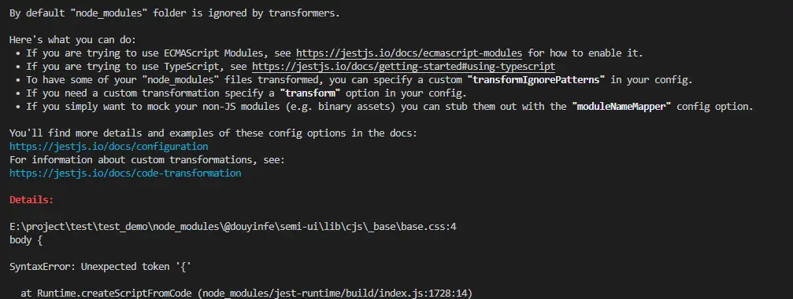
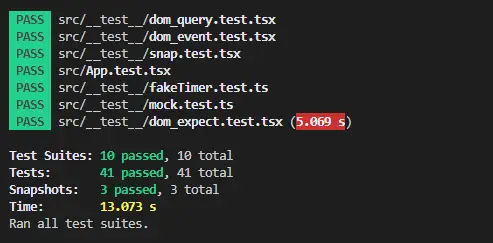
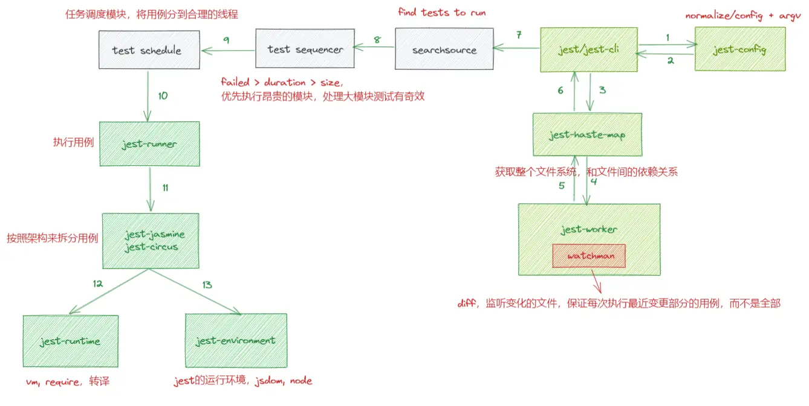
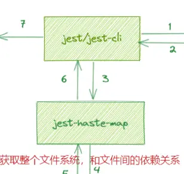
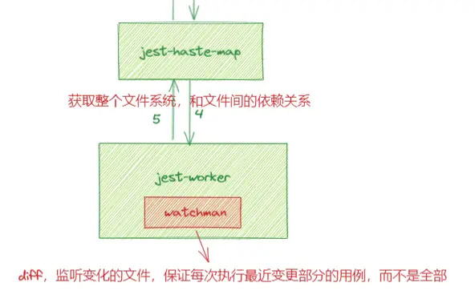
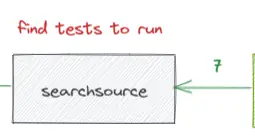
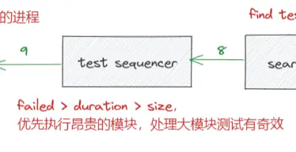
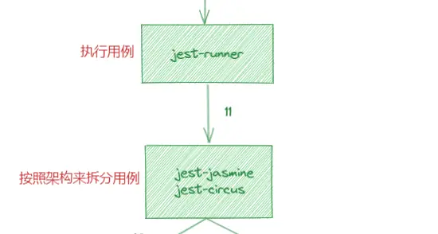
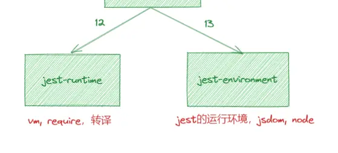
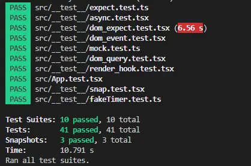

# 13.深入原理：Jest 是怎么实现整个单元测试系统的？

> 代码仓库：<https://github.com/czm1290433700/test_demo>

上节课我们学习了怎么通过快照测试来保证 UI 的完整，相比查询元素进行断言，快照测试更加简洁粗暴，可以帮助我们快速检测整个模块是否和上次的快照结果匹配。

在快照的设计中，我们讲究不”大“不“小”，一方面不生成大快照，使得组件频繁变动，带动快照也一起更新；另一方面，不生成小快照，因为过小的快照完全可以通过一两句断言解决，就丧失了快照的意义，尽可能在保证组件不变的前提下，将快照的粒度放大才是更加合适的做法。

到这里相信大家对单元测试如何实现已经了然于心了，不过现在 Jest 做的事情还是比较黑盒的，我们只知道它帮我们开展测试，但是我们并不知道它在这个过程中发生了什么，我们为什么需要配置这个配置那个，所以这一节课，我们就专门来学习一下这其中的原理，一起来看看 Jest 是怎么实现整个单元测试系统的。

## 小彩蛋

在开始这节课的学习前，先同步一个小问题，今天我在执行用例的时候，发现有下面的报错：



这个是因为不能编译依赖中的 css 导致的，解决方法也很简单，只需要加一个 css 的 mock 去替代就好，原先我一直以为 react-scripts 有帮我们完成这一步，遇到这个问题的同学可以参照下面的步骤修复：

```
// ./package.json
"jest": {
    "transformIgnorePatterns": [
      "node_modules/(?!axios)"
    ],
    "moduleNameMapper": {
      "\.(css|scss)$": "<rootDir>/styleMock.js"
    }
  }
```

加上 moduleNameMapper ，如果有更多的样式类型，可以自行补充到前面的正则中，styleMock.js 中的内容就一行，将导入改成空即可，如下：

```
module.exports = {};
```

然后我们再执行所有的用例试试，默认的 test 只会执行最近 commit 相关的用例，我们可以加一则命令用于执行所有的用例，现在可以看到所有的用例都可以通过了。

```
"test:all": "react-scripts test --watchAll",
```



## Jest 系统实现



为了方便大家理解，我画了上面的架构图。一起来看看从配置到用例的执行这个过程究竟发生了什么？首先，所有事情的起点是 jest, 准确的说是 jest-cli ，这是我们单测的开始，初始化所有的配置。


紧接着我们来到第二步，也就是我们之前常常配置到的 jest-config，在这里我们可以配置一些全局或者针对目前项目的配置，在获取到这部分配置后，进入到第三步。



在第三步中，我们直接交互的部分是 jest-haste-map，这部分是一个虚拟的文件系统，它会在我们第一次执行用例的时候，去遍历一遍项目的文件目录，形成一个 Map ，其中存储着我们文件之间的依赖和上下级关系，在后续的热更新操作中，它将会直接获取之前的 Map 缓存而不再遍历文件系统。



再往下就是比较重要的一步了，jest-worker，它的底层基于 watchman 来实现。有一个读者问我 jest 每次热更新会执行全部用例吗？答案当然是不会的，jest-worker 会监听变化的文件，来保证每次热更新重新执行的是最近变更部分的用例，而不是全部。

我们想象一下，如果咱们的用例很多，没有这样一步的话，每次 change 都要等待所有的用例执行完，那真的就是一个很痛苦的事情了。



在上一步完成后，我们已经拿到了我们的配置和文件系统。接下来会通过 searchsource 的集成类来找寻我们需要运行的用例。



获取到用例后，我们会经过 test sequencer，这是一个测试排序器，在这一步中我们会来排序用例执行的优先级，优先级会按照过去失败过的用例 > 执行实现长的用例 > 文件 size 大的用例这样一个顺序来执行，来保证用户关注的内容可以被优先做完。


到下一步仍然是调度，我们会经过 test schedule，不过与 test sequencer 不同，这一次不再是分优先级了，而是安排进程，会根据现在 CPU 的情况来把用例分配到合理的线程，也许会单线程，也许会安排多个线程来分开执行。



调度的部分完成以后，就要开始着手执行我们的用例了，其中比较核心的两个部分是 jest-runner 和 jest-jasmine，其中 jest-runner 负责直接执行，而 jest-jasmine 负责根据架构来拆分我们的用例，这里的架构指的就是我们的 describe 和 test。



在执行的过程中，我们可以分为两个部分，一个是运行环境，另一个就是转译。对于运行环境, 我们可以分为 jsdom 和 node，默认我们是选用 node 的，不过如果我们测试的是 web 应用程序，那就应该选用 jsdom，两者是不同的运行引擎。

对于转译，我们知道 nodejs 是 commonjs 的 "拥护者“，在直接的 node 环境里是不能识别 esm 的写法的，所以我们需要使用一些转译工具，比如 babel，来帮助我们转译成 commonjs，为我们的测试程序保驾护航。

到这里，咱们的 jest 用例就执行完成了，我们再回顾一遍。

首先是前置的工作，我们会拿到 jest 的配置并且会根据文件系统生成一组虚拟的文件映射，来保证后续热更新的效率；接下来会找寻我们文件中需要执行的用例，并且根据优先级和 CPU 的使用情况，将它们分给不同的线程按顺序执行；在执行的过程中，因为环境的原因，需要确定我们的执行引擎和文件转译，然后就会按照我们之前拆分的 decribe 和 test 分批执行我们的用例了。

## 额外的启发

在了解完原理后，其中我们可以得到一点启发，除了 Jest 黑盒的部分，像转译的部分其实是由我们来控制的，在性能上，转译还有优化的空间，除 babel 和 ts-jest 外，业内还提供有 esbuild-jest 和 @swc/jest，以 esbuild-jest 为例，它是基于 esbuild 来实现的 jest 转译工具。

Esbuild 有些同学可能已经比较熟悉了，它是基于 Go 开发的打包工具，不同于 JavaScript，Go 可以直接被编译为本地代码，所以性能上有极大的提升，下面我们以 esbuild-jest 为例介绍一下怎么优化转译，首先来安装一下依赖。

```
npm i esbuild-jest --save-dev
```

然后我们补充一下对应的转译配置，非 CRA 的同学可以把对应的配置加到 jest.config.js 中。

```
// ./package.json
"transform": {
    "^.+\.(t|j)sx?$": "esbuild-jest"
 },
```

我们来执行一下用例，对比之前的 13s 执行时间，我们优化了整整 30%，现在用例数尚且不多，如果更多的用例，这个会更加明显！不过缺陷就是相比 babel 和 ts-jest ，esbuild-jest 和 @swc/jest 的社区相对还比较年轻，所以遇到一些特殊的问题（比如一些老的不合规的依赖，并没有 esm 的写法）可以不能立刻找到解决的办法，不过这并不妨碍我们在新项目中体验~如果遇到不能兼容的问题，我们再换回来就好。



## 小结

这一节我们学习了 Jest 系统是如何实现的，简单来说，首先我们会经过一个前置工作的阶段，拿到所有的配置，并且构造出一个虚拟的文件系统用于热更新的 diff，接下来我们会找寻所有需要执行的用例，根据优先级和 CPU 的情况分给不同线程按顺序执行，执行的过程中，我们会经过转译和环境引擎编译的步骤，最后按照我们 describe 的架构和分组完成指定的用例。

除此之外，我们还介绍了一种让单元测试跑得更快的方式，因为 Jest 运行的过程中，虽然大部分是黑盒不可控的，但是其中转译的部分我们还有可以优化的空间，如果我们不使用 babel 而是换用 esbuild 等方案，那么在性能上会有不错的提升。虽然社区还比较年轻，但是尝试一下还是可以的~大不了兼容不了咱再换回去就是haha……

到这里单元测试的部分就已经全部介绍完了，不过在我们的需求中，仍然有一些单元测试难以覆盖的场景，比如滚动、跳转等比较复杂的场景，这些是不好模拟的，这时候就需要借助端对端测试（E2E)的方案来协助我们完成了, 下节课我们就来详细介绍一下什么是端对端测试，我们应该怎么展开对应的测试。