# 14.E2E：怎么覆盖滚动等复杂交互场景的测试？

> 代码仓库：https://github.com/czm1290433700/test_demo

上节课我们学习了 Jest 是怎么实现整个测试系统的，相信大家对“运行命令到用例执行”这个过程都有了初步的认知。现在我们已经学完了单元测试的全部内容，已经可以对我们的组件的大部分功能进行覆盖了。

不过针对一些复杂的场景，比如滚动，我们没办法通过单元测试的方式来验证，因为它并不支持滚动事件的模拟。针对这种场景，我们可以通过 E2E（端对端）测试的方式来覆盖。

## 什么是端对端测试？

我们之前的测试其实都需要在项目中来编写，针对组件的单一原型来书写用例，这是为了稳固内部系统的质量和功能而展开的测试，也就是单元测试。但是除单元测试外，还有一种自动化测试方案，这种自动化测试方案通常由质量保障团队编写，也就是QA，不需要基于项目展开，从用户角度进行测试。

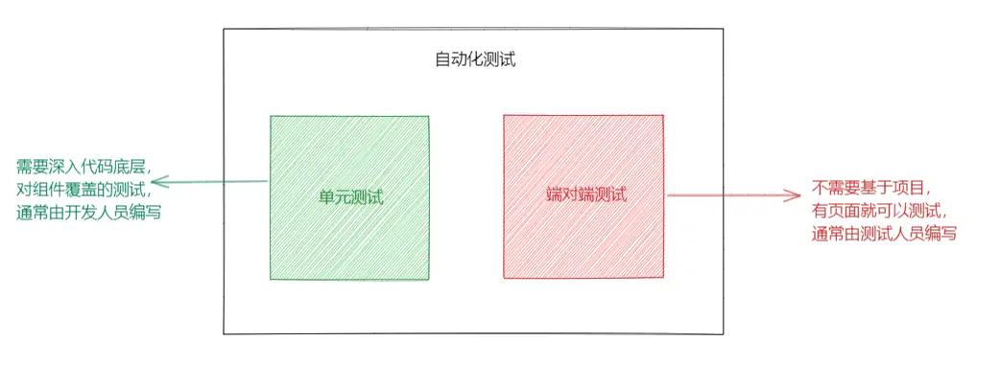

端对端测试是可以覆盖滚动和跳转场景的，虽然通常由测试人员编写，但是这并不代表我们不能用~

对于 JS 技术栈的前端开发来说，通常会使用 cypress 作为端对端测试工具，它更加贴近我们的代码习惯，而且支持 npm 包安装，我们就可以把端对端代码维护到我们的项目中进行统一的覆盖率统计。

除 cypress 外，还需要有个服务来单独渲染我们的组件，便于我们进行端对端测试，可以选用 storybook 来帮助快速渲染我们的组件，这样我们就可以通过 cypress 来测试了。


思路确定了，下面我们来就例子看看应该怎么覆盖滚动场景的用例。

## 滚动场景的覆盖

我们首先来实现一个有滚动场景的组件，比如下面的例子：

```
// ./src/components/ScrollList/index.tsx
import { FC, useMemo, useState } from "react";
import "./styles.css";

interface IProps {
  data: string[];
  height: string | number;
  pageSize?: number;
}

/**
 * 滚动 list, 拉到底部刷新新的一页
 * @param data
 * @param height
 * @returns
 */
export const ScrollList: FC<IProps> = ({ data, height, pageSize = 10 }) => {
  const [page, setPage] = useState(1);

  const currentData = useMemo(
    () => data.slice(0, pageSize * page),
    [pageSize, page]
  );

  return (
    <div
      className="scrollList"
      style={{ height }}
      onScroll={(e) => {
        const { scrollTop, clientHeight, scrollHeight } = e.currentTarget;
        if (
          scrollTop + clientHeight >= scrollHeight &&
          currentData.length < data.length
        ) {
          alert(`当前page为${page}`);
          setPage(page + 1);
        }
      }}
    >
      {currentData.map((item, index) => {
        return (
          <div className="item" key={index}>
            {item}
          </div>
        );
      })}
    </div>
  );
};
```

我们实现了一个组件，这个组件的功能是可以对一个列表进行滚动分页，每次滚到底部，就会渲染出下一页的内容，下面我们就这个组件来展开我们的端对端测试。

首先我们安装一下 cypress：

```
npm install cypress --save-dev
```

安装完成后，会自动打开一个窗口，后续我们打开可以执行 `npm run cypress`：

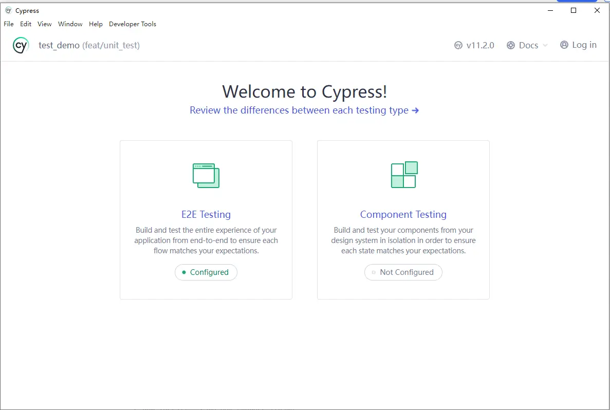

选择 E2E Testing，然后选择谷歌浏览器预览，最后会得到这样的一个页面：

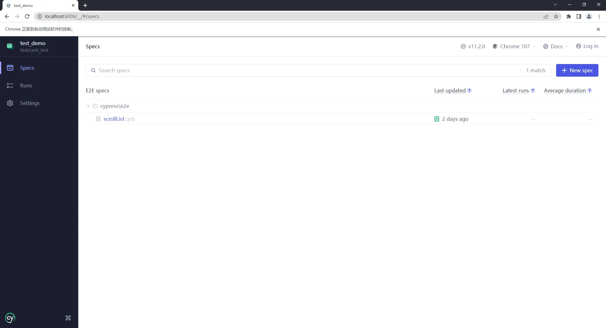

做完这一步，我们应该可以看到项目中发生了一些变更，可以暂时把 cypress 放一放，我们来继续初始化一下 storybook：

```
npx storybook init
```

执行下面的命令后，会进行 storybook 的初始化，启动的默认端口号是 6006， 我们可以看到会打开这样的一个页面：

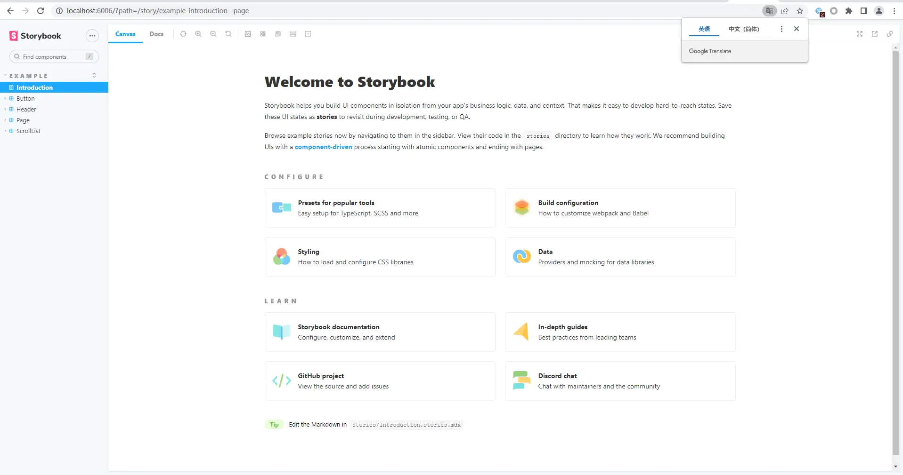

因为 cypress 测试，我们也希望测试 storybook 的页面，所以咱们也可以修改 cypress 的 baseurl 为 6006 端口，这样我们在写访问链接的时候就可以省略域名的部分了：

```
// ./cypress.config.ts
import { defineConfig } from "cypress";

export default defineConfig({
  e2e: {
    baseUrl: "http://localhost:6006/",
    setupNodeEvents(on, config) {
      // implement node event listeners here
    },
    defaultCommandTimeout: 10000,
  },
});
```

这时候咱们来稍微看一看初始化了哪些内容：


其中针对 cypress ，它帮我们初始化了一个 cypress 的目录，以及 cypress 的配置文件，其中 cypress 目录中的 e2e 文件夹存放着我们的端对端测试用例，后续如果有新增，保持 xxx.cy.ts 的格式，就可以识别到是测试文件了。

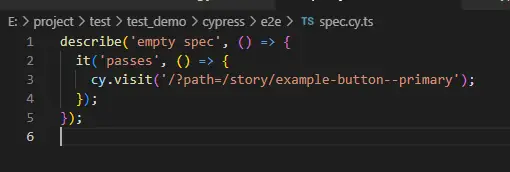

这个我不讲解大家应该都可以看懂，因为和单元测试的写法真的真的很像，只是提供了一些额外的 API 而已。Btw，如果有同学打开 e2e 发现其中的 API 会报错也不要着急，因为 tsconfig.json 并没有包括到根目录，我们可以加上：

```
// ./tsconfig.json
{
  "compilerOptions": {
    // ... other
    "types": ["cypress"]
  },
  "include": ["src", "cypress"]
}
```

大概介绍完了 cypress 的目录结构，我们再来看看 storybook。

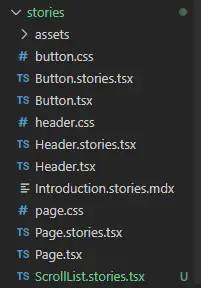

这里它帮我们创建了一些例子，我们以 button.stories.tsx 为例看看写了点啥：

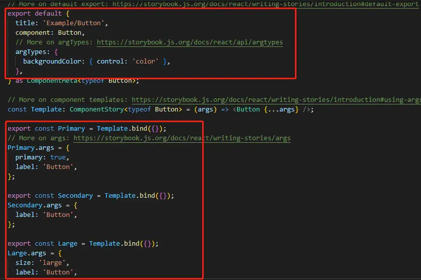

首先是默认暴露的一些属性，这个决定了它的文档根目录，然后底下是调用这个组件以及不同场景下组件的入参，每个都会形成一个子目录，可以用于调试，我们可以看看对应 button 的效果：

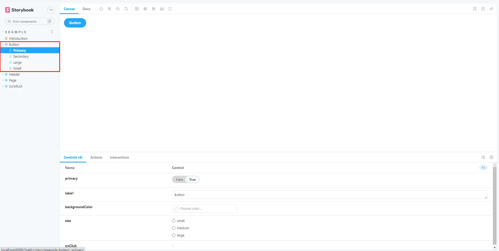

如果大家后续想写一些架构的项目，用 storybook 来书写架构文档真的是很不错的选择，我们来为滚动组件照猫画虎写一个：

```
// ./src/stories/ScrollList.stories.tsx
import React from "react";
import { ComponentStory, ComponentMeta } from "@storybook/react";

import { ScrollList } from "../components/ScrollList";

export default {
  title: "Example/ScrollList",
  component: ScrollList,
  argTypes: {
    backgroundColor: { control: "color" },
  },
} as ComponentMeta<typeof ScrollList>;

const Template: ComponentStory<typeof ScrollList> = (args) => (
  <ScrollList {...args} />
);

export const List = Template.bind({});
List.args = {
  data: [
    "test1",
    "test2",
    "test3",
    "test4",
    "test5",
    "test6",
    "test7",
    "test8",
    "test9",
    "test10",
  ],
  height: 80,
  pageSize: 3,
};
```

咱们来看看效果， 真的很棒！

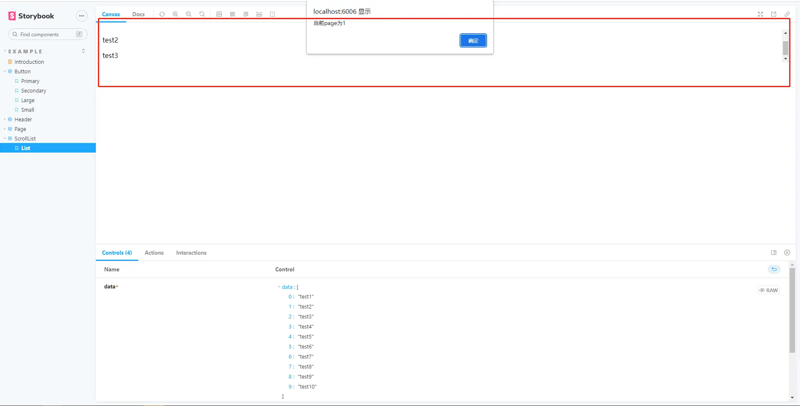

有可访问的页面了，就可以开始写咱们的端对端测试了~

```
// ./cypress/e2e/scrollList.cy.ts
describe("tests for ScrollList", () => {
  it("should render ", () => {
    cy.visit("/iframe.html?id=example-scrolllist--list");
    cy.get(".item").should("have.length", 3);
    cy.get(".scrollList").scrollTo("bottom");
    cy.get(".item").should("have.length", 6);
    cy.get(".scrollList").scrollTo("bottom");
    cy.get(".item").should("have.length", 9);
    cy.get(".scrollList").scrollTo("bottom");
    cy.get(".item").should("have.length", 10);
  });
});

export {};
```

上面的代码相信大家都可以看得懂，查询 - 断言，端对端和单元测试一样，采用类似的链式写法，在这则用例中，我们获取了一开始列表长度，断言初始化为 3， 然后把它滚动到底部，我们希望它可以更新长度为 6，如此循环，最后长度是 10，因为已经没有更多的数据可以用于更新了。

  


不过比较细心的同学可能会发现，你写的访问链接好像和咱们 API 的对不上呀 ~

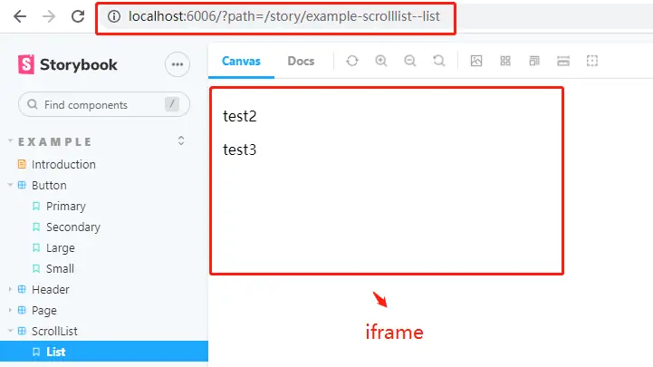

我们直接访问的链接是这个，不过呢 cypress 的测试是不会深入到 iframe 中的，而对于组件右边的部分是通过 iframe 嵌入进来的，我们写的链接就是这个 iframe 的链接，`/iframe.html?id=${你的组件id}`，所以我们直接测试 iframe 就好，同学们也可以直接打开这个链接看看，这个页面中只包含我们的组件。


好了，现在来尝试看看跑一下我们的端对端用例，怎么跑呢，进我们刚才打开的 cypress GUI 页面就可以了。

  


很棒，可以看到我们的用例全部都通过啦~我们运行测试的时候，右侧的窗口会同步地模拟我们用例中描述的过程，并与断言进行匹配。

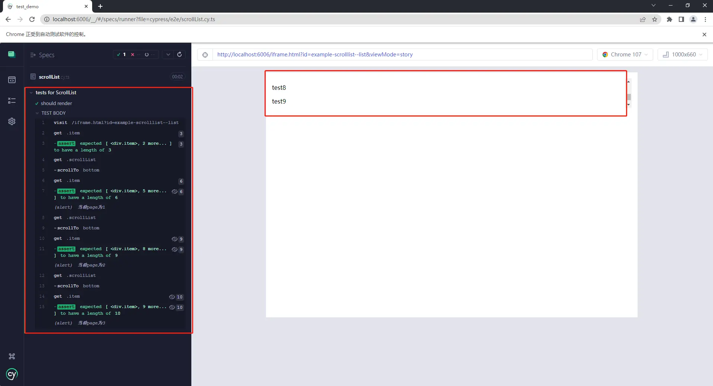

不过我们肯定不希望每次都需要我们自己点一遍用例，通过命令自动化执行肯定是需要的，所以我们可以加上下面的这条命令，通过执行这条命令，它就会自动帮我们完成所有的用例了~

```
 // package.json
 "cypress:run": "cypress run",
```

当然 E2E 的功能远不只是协助我们的单元测试覆盖滚动场景这么点，它甚至可以覆盖我们整个项目中的细枝末节，感兴趣的同学也可以自行了解一下，写法上有单元测试的基础，掌握也会很快~只是一些 API 上的不同。

## 小结

这节课我们学习了怎么通过 cypress 和 storybook 覆盖滚动等复杂交互场景，通过端对端测试，我们可以覆盖很多单元测试难以企及的场景，虽然开发并不经常写这个，但是在整个项目质量的维稳上，端对端测试的确起到了不小的作用~

现在我们已经学了不少测试知识了，那么我们应该怎么衡量测试用例覆盖得是否完整呢？那就需要测试覆盖率登场了，下节课我们就来学习怎么对测试代码覆盖自动化测试。