# 16.CI：项目自动化测试的持续集成方案

> 代码仓库：https://github.com/czm1290433700/test_demo

上节课我们学习了怎么对自动化测试覆盖率的统计，分别统计了 Jest 和 Cypress 的测试覆盖率，Jest 的覆盖率比较简单，可以直接通过它提供的能力进行统计，但是 Cypress 需要我们自己通过 “插桩” 的方式进行统计，最后将两个覆盖率进行了合并，获得了我们项目最终的一个覆盖率。

当然在实际的项目开发中，一个项目大多数情况下并不是一个人来维护，不可能凭借口头上的要求来保证每个开发者在项目提交或是 pull request 时通过用例或是满足覆盖率，这不现实也不保险，所以我们要把这部分验证绑定到 CI，使得每次主分支的 commit 和 pull request 都可以得到限制验证。这节课我们就来学习具体应该怎么实现这个效果。

## 使用 Codecov 存储覆盖率

上节课虽然我们获得了一个覆盖率，但是这个覆盖率终究只是一个文件，它并没有得到一个有效的汇总，也不能提醒什么（除非每次 pull request 我们都自己生成看一看），所以这里我们需要把它存储起来，进行一个汇总提示，借助 Codecov，这是一个开源的代码覆盖率汇总的地方。

首先登录一下 [Codecov](https://app.codecov.io/gh) ，这边使用的是 Github 账号登录，大家也可以选择其他的方式，登录完成后，在 not yet setup 处可以看到我们还未接入 Codecov 的仓库，我们点击我们需要接入的仓库，就可以获得一个密钥 token。

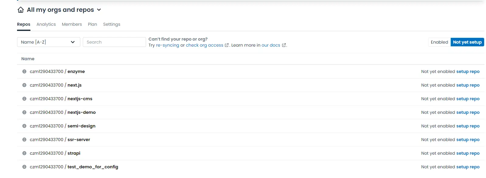

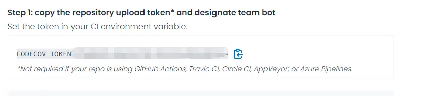

然后我们在项目中合并覆盖率后，执行下面的命令，发现覆盖率就已经上传到 Codecov了。

```
npx codecov --token=xxx(换成你的token) --file=coverage.json
```

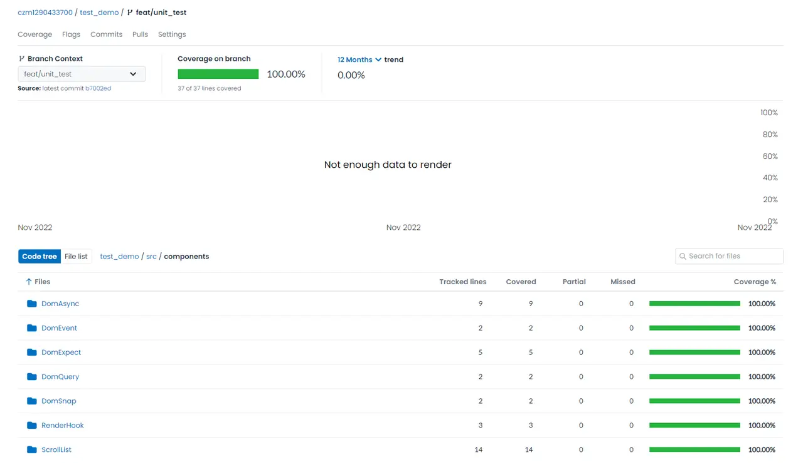

这个结果还有大用途，可以和我们的 Github 记录结合起来，我们继续往下做。

上面我们已经尝试过手动上传 Codecov 了，不过呢，这个 token 还是暴露出来的，后面接到命令脚本里可不行，这样所有人都可以看到我们仓库的 token，如果随便上传一些东西上去不就有脏数据了？我们需要给它加上一个密钥来进行脱敏。

我们点到 Github 的 settings 中，点击新建仓库密钥。

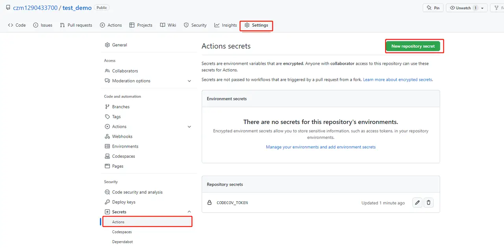

然后我们把密钥填入。

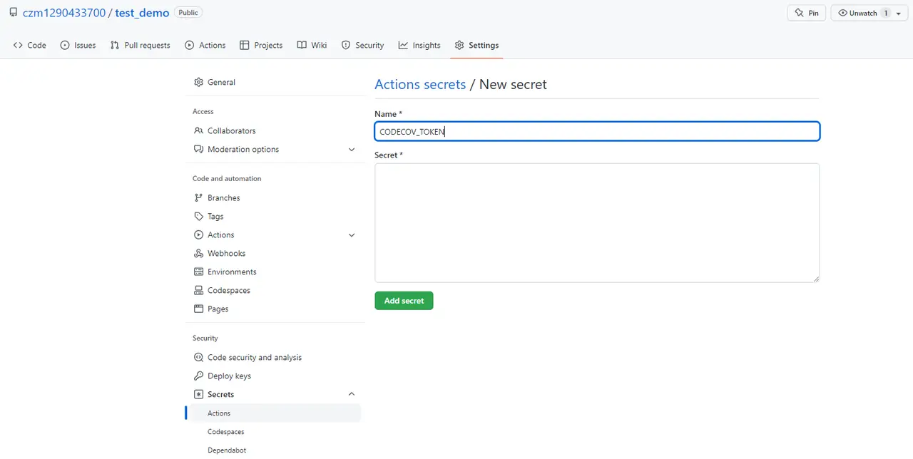

后面就可以利用 secrets.CODECOV_TOKEN 这个 key 在我们的 CI 中运行了。

## 怎么把操作绑定到 CI ？

现在我们应该把测试相关的操作绑定到 CI 上，这就需要借助 git action 了，它可以帮助我们在项目中创建自动化的软件开发流程，从而形成流水线。

大家先按我的步骤继续走下去，后面我们会详细解析应该怎么写一个 action 出来。我们先安装下面的依赖：

```
npm install wait-on --save-dev
```

然后我们在 .github/workflows 目录创建一个 test.yml，这个目录用于指定对应 github 的 action，每个 yml 文件都会对应到一个 action，这些 action 会在指定的情况下触发对应的命令。

```
name: test

on:
  push:
    branches: [master]
  pull_request:
    branches: [master]
  workflow_dispatch:

jobs:
  coverage:
    runs-on: ubuntu-latest
    steps:
      - uses: actions/checkout@v3
      - uses: actions/setup-node@v3
        with:
          node-version: "16"
      - name: Run install
        run: npm install
      - name: Run Jest coverage
        run: npm run test:coverage &
      - name: Build storybook
        run: npm run build-storybook
      - name: Serve storybook
        run: nohup npx http-server -p 6006 storybook-static &
      - name: Run Cypress coverage
        run: npx wait-on http://127.0.0.1:6006 && npm run cypress:run
      - name: Run Coverage merge
        run: npm run coverage:merge
      - name: Run codecov
        run: npx codecov --token=${{ secrets.CODECOV_TOKEN }} --file=coverage.json
      - name: Run test
        run: npm run test
```

我们来看上面的 action， 简单讲讲为什么这么写。

-   `name` 是这个 action 的名字，会在 Github 的 action 页面对应出来。

-   `on` 对应这个 action 的触发方式，这里我们加上了两个触发方式，当 master 分支 push 和 pull request 的时候，`workflow_dispatch` 这个加上，可以使得这个 action 允许被手动执行。

-   `job` 则对应这个 action 触发的时候需要执行的命令，其中包含着很多流水线的节点：

    -   `coverage` 可以理解成是一个流水线的节点名称，你可以自己定义，当然我们也可以定义多个；

    -   `runs - on` 对应我们运行的环境，我们默认填最近版本的 ubuntu 就可，也就是 ubuntu-latest；

    -   `steps` 中就是这个流水线节点中需要执行的内容了。

        -   `actions/checkout@v3` 和 `actions/setup-node@v3` 就是运行的 node 环境 action 打包，会自动帮我们配置好 node 环境，如果是 14 的版本，这两个可以用 v2。

        -   `name` 和 `run` 分别对应节点步骤名称和要执行的命令 , 这里需要特别解释几个步骤。

            -   `npm run test:coverage &` 中的 & 是为了保证这条命令在后台执行并不阻塞后续节点的展开，因为 `npm run test:coverage` 在完成后并不会退出进程。
            -   `nohup npx http-server -p 6006 storybook-static &`和上面同理，因为服务并不会自动中断进程，我们需要后台执行，保证后续节点不被阻塞。
            -   ` npx wait-on  ``http://127.0.0.1:6006``  && npm run cypress:run `因为 Cypress 需要在 storybook 服务启动后才可以进行端对端测试，所以我们需要 wait-on 等待服务能被响应后再开始端对端测试。

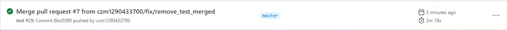

我们把这则修改提交到 PR 后，可以到 action 看到一则自动运行的 action。

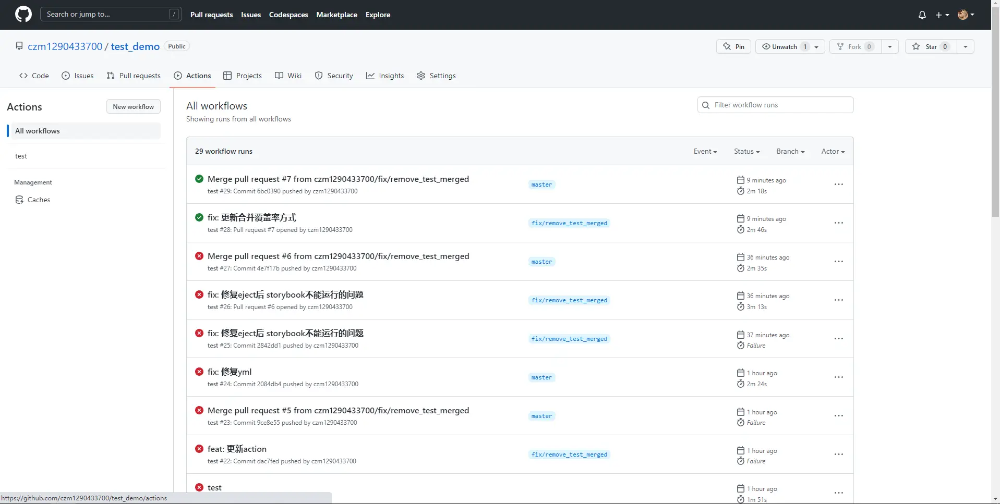

点进这个 action, 可以看到我们之前设置的节点。

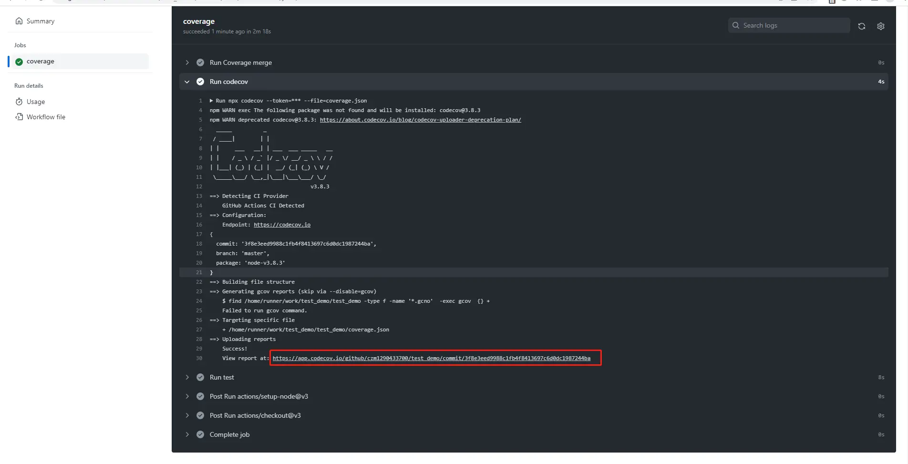

在这里看到每一步执行的情况，可以看到，每次类似的覆盖率都会被更新到 Codecov中。

## 如何在本地开发 action？

Action 的触发默认是使用 master 主分支的 workflow，那我们在分支中应该怎么开发呢？我们在上面的部分介绍了，如果加上`workflow_dispatch`， 那么我们就可以手动执行这个流水线。

切到 actions，可以看到左边有我们定义的这个 test action，可以按下图点击右侧的 run workflow，选择对应的分支后，手动执行流水线。

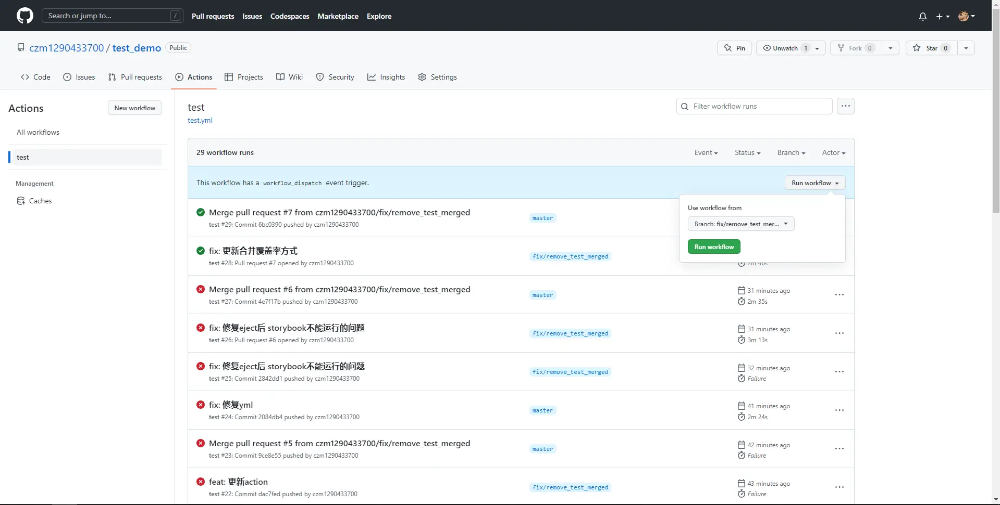

## Codecov 机器人

Codecov 除了基础的覆盖率存储功能外，还可以支持我们每次 PR 时在下面进行覆盖率的评论，可以在 [Codecov 团队机器人](https://docs.codecov.com/docs/team-bot) 页面开启 Github 机器人。

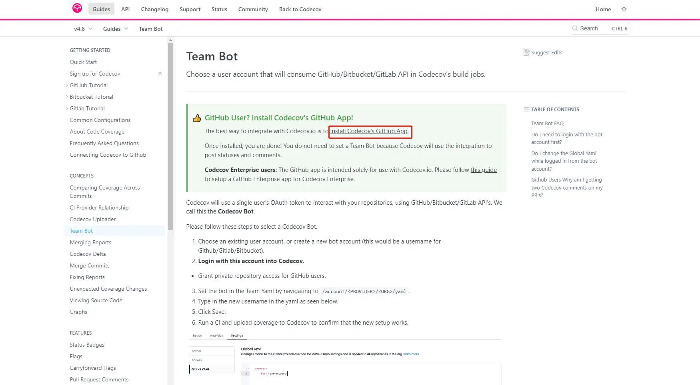

然后我们在 PR 的时候执行完 action， codecov 就会在 pr 下评论当前 PR 的覆盖率情况

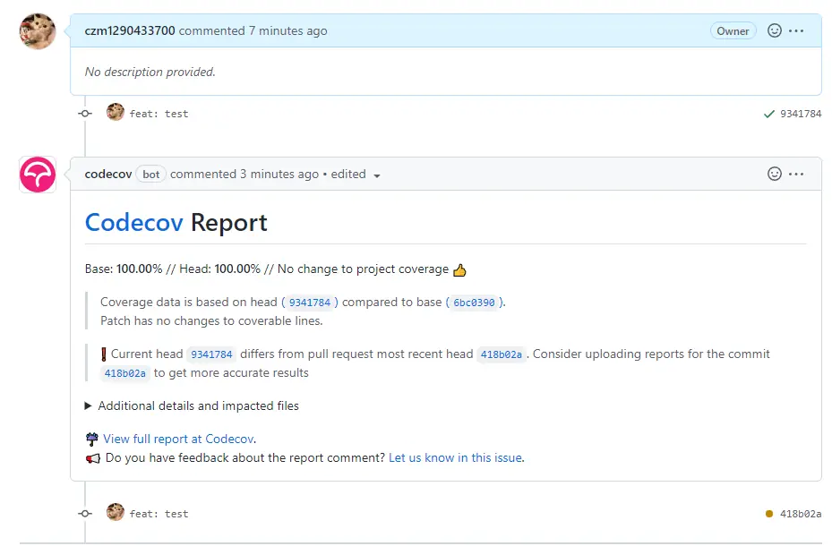

## 用例的验证

在上面的 action 中，最后还验证了我们的用例能否通过，可以随便改错一个用例，并提交 PR，看看会发生什么。

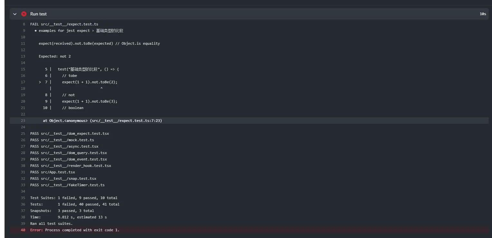

可以看到， PR 下的 check 将会报错，我们可以通过这种方式来统一项目中的规范。

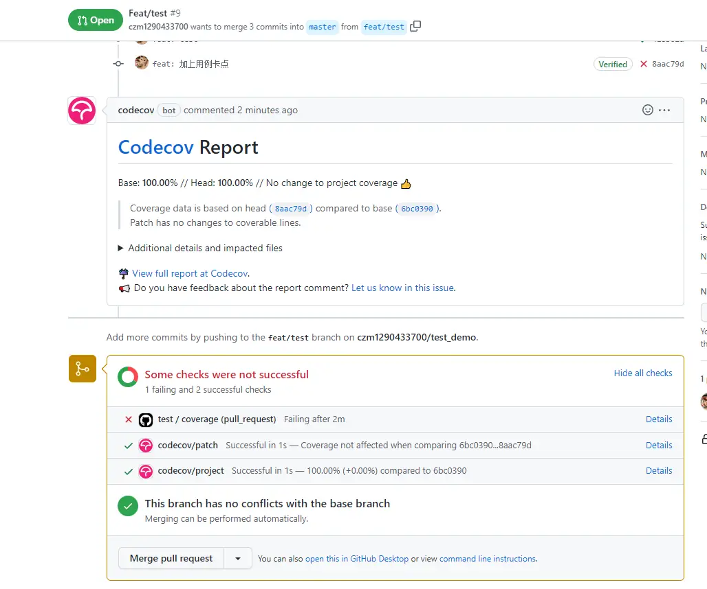

对于 action，我们也可以按照它的使用类别创建多个，拆分开来，这样有问题的时候，我们也可以快速定位它是哪个问题。现在我们把这个用例改回来，用例就可以通过了。

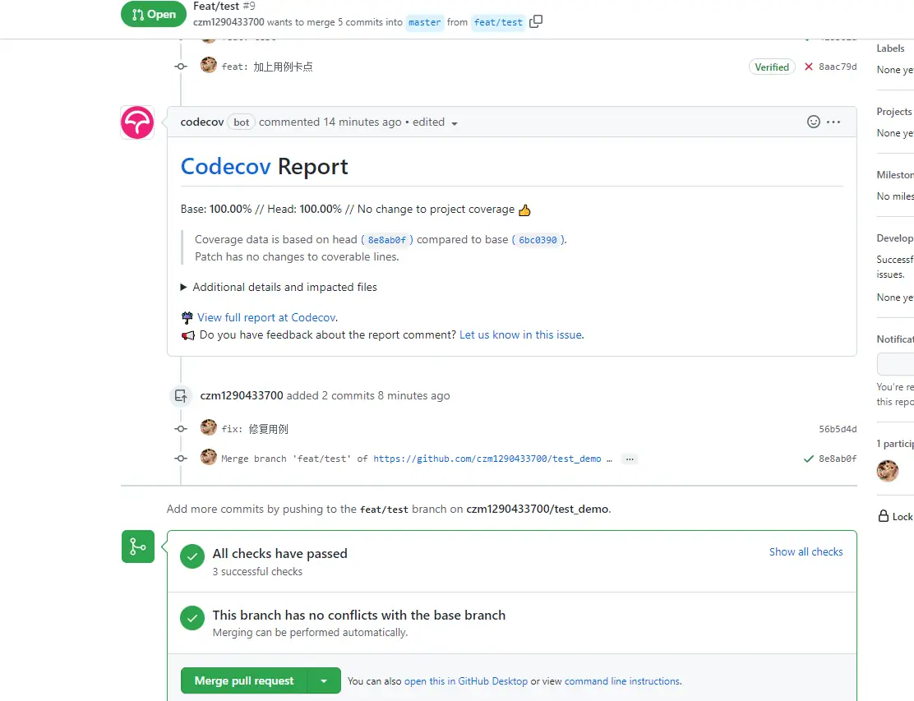

现在就可以进行分支的合并了~如果是多人合作，就可以让同团队的同学帮你 code review，然后 approve 一下了。

## Codecov 覆盖率标记

大家在使用一些开源项目的时候，经常会看到它们的 readme 里会有相关覆盖率的标签，我们以 Semi 为例，可以看到会有覆盖率 89% 的标记。

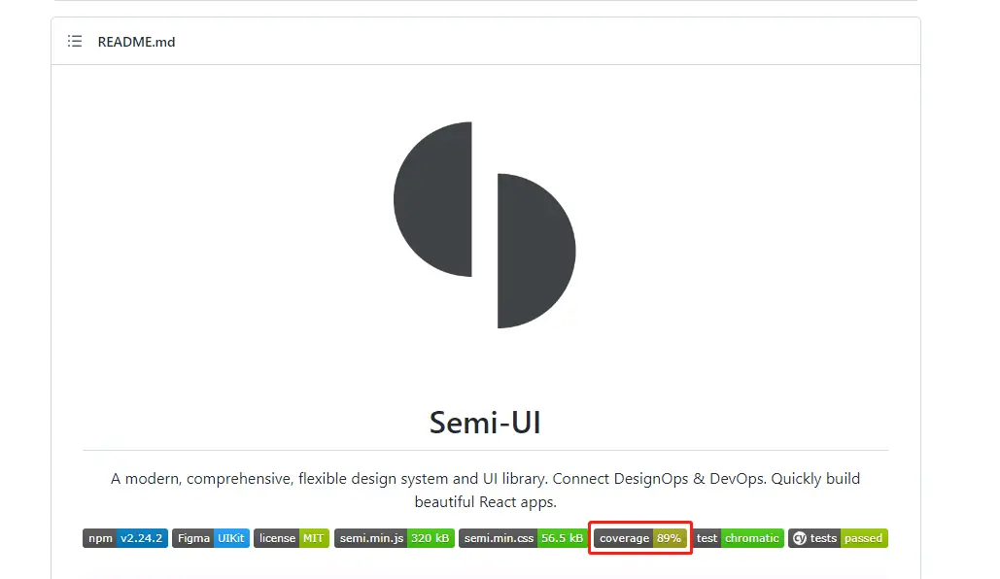

难道是随便写的标签？当前不是，要是这么搞肯定要被骂死，打开我们项目的 Codecov 的 settings 页，可以看到有个 badge 标签可以复制

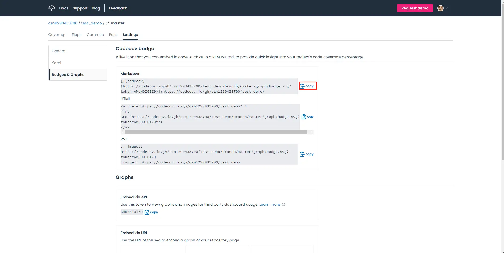

copy 下来贴到我们项目的 Readme 中试试。

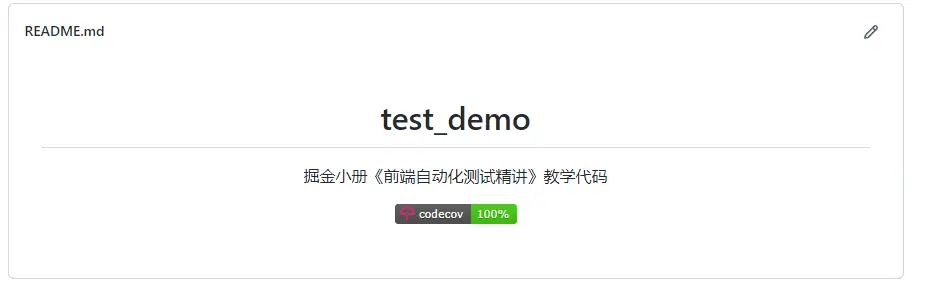

这样我们项目的覆盖率结果也就生成了，用户也可以点击我们的 Codecov 跳转到 Codecov 项目页进行细节的查阅，对于架构项目，可以大大增加用户使用的信心。

## 小结

这节课我们学习了怎么对项目自动化测试进行持续集成，达到在每次 pull request 或是 push 的时候自动进行流水线的效果。通过这种方式，可以有效统一项目开发中团队成员的规范，我们的测试用例也可以真正在项目维度提高整体的质量。

到这里，其实我们前端自动化的内容就已经学习完了，下节课是我们《前端自动化测试精讲》的最后一节，我想和大家分享一下，写这本小册 & 为团队中后台推广单测这段时间我的一些困惑和思考，希望可以给大家一些对代码质量的额外启发。