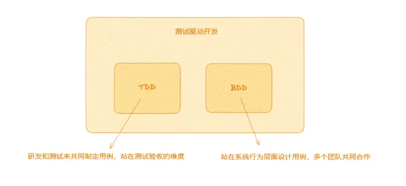
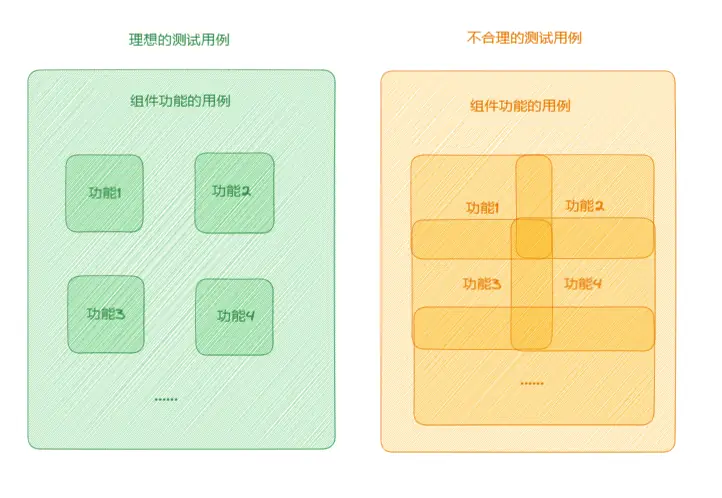

# 17.最后的思考：用例的边界和深度究竟在哪里？

上一节课中，我们学习了怎么将自动化测试融入项目的 CICD 中，分别配置了 Codecov 和对应的 git actions，对我们的项目 master 分支中的 pull request 和 push 节点进行了流水线的卡点，大家也可以根据自己的需求去配置需要的卡点。

到这里我们前端自动化测试的相关技术知识就已经学习完了，但是很多同学相信还会有不少困惑，对于一个需求，我们应该从哪些方面来展开用例呢？我们又应该怎么向团队推广自动化测试呢？

这些困惑我思考了很久，这节课我们就来一起聊聊，用例的边界和深度究竟在哪里？

## TDD & BDD 的理想国

首先我们来了解两种开发模式，TDD 和 BDD ，这两种都是敏捷软件工程开发下的产物，相信很多同学在阅读这本小册前就已经有所耳闻了。

在之前的章节中，我们编写自动化测试用例的时机都是在组件开发完成之后，对于 TDD 和 BDD 而言，它们都推崇测试驱动开发，与我们平时业务的软件开发模式不同，测试不再仅仅是研发的下游，同时也成为上游的一个角色。

在这两个开发模式中，期望用例可以在实际开发前确定，并且实现对应的自动化测试后，再进行对应的开发，使得组件可以切合于测试或是用户的维度展开，获得更合理的设计和封装。

TDD 和 BDD 最大的区别在于，TDD 站在测试的维度展开，通常由于研发和测试共同来制定用例，或是研发根据组件维度提供用例测试进行 review。而 BDD 则是站在系统行为层面设计用例，多个团队共同合作提供出最终的设计用例。

这两种开发模式的初衷的确是很好的，但是站在国内的大环境下看，这两种模式可能只能是开发人员心中的理想国，能实现的少之又少，BDD 就不用说了，涉及过多的团队，一起合作整理用例是不现实且低效的。而TDD，我们可以一起来看看它和现状有哪些冲突：

-   研发懂开发，但是对用例的设计不够专业，测试虽然懂设计用例，但是对代码的维护和封装理解上又弱于研发，两者虽然理论上可以进行优势互补，但是在实际的合作中是难以实现的，这就强需求一个对研发和测试用例设计都很专业的人来介入，这样的人选并不多。
-   国内的研发迭代频率是较高的，这种模式会影响整体的开发进度，大环境下，宁可选择手工测试也不会选择 TDD 的模式，因为短期收益比一定是更低的，长期不确定，得看合作情况。
-   这种模式可能会导致研发过度关注用例，而缺失对整体系统的认知。需求开发会被等价于所有的用例通过，长期看，对研发和测试人选的综合能力要求都不小。

之所以称为理想国，代表着虽然它在实际的开发中很难落地，但是仍然是我们最理想的开发模式。那么有没有一些场景，我们可以尽可能去用 TDD 这种模式来开发呢？

是有的，对于一些输入和输出都比较明确的函数，我们是可以先自行定义好自动化测试用例，再对函数内容进行补全的，这个过程可以很好地审视函数是否有功能或者边界情况的遗漏。

但是想要在业务组件需求中应用，我想目前还是很困难的。对项目人员水平和大环境的要求都很高，这个理想国难以推行，至少在国内来看，还需要一个长期努力的过程。

## 测试用例应该从哪些角度展开？

在写这本小册之前，其实我也有和一些同学聊，为什么大家不愿意去写单测呢？其中一个让我比较震惊的理由是，一个需求，他的用例写了快一个月，成本太大了。我很奇怪，真的要写这么久吗？

这个同学是很资深的工程师，对前端各个领域都有自己的见解，技术上是没有问题的，所以我特地 clone 他以前的那个仓库看了一下对应的用例，突然知道为什么会写这么长时间了。用例之间重复交集的内容过多，或是对本不需要测试的内容进行了测试。

总地来说，还是因为缺乏用例设计的思路，而不知道怎么展开对应的测试用例。

因为大多数前端的确缺乏对用例设计的经验，即使让测试人员来协助我们，测试人员的用例也没办法很好站在组件维度从封装和功能的角度来展开，所以不知道怎么展开对应的组件测试是很正常的现象。

这里我给大家提供我测试一个组件的思路：

-   Props 的覆盖：组件的每一条 props 需要覆盖一条用例，因为组件的每个 props 都是对外暴露的。通常来说，每个 props 都对应这个组件的一个重要能力，所以这个是必须强制覆盖的。
-   组件耦合度的审视：针对组件的 props 覆盖完成后，这个组件的用例覆盖率通常可以达到 70% 以上，如果覆盖率仍然较低，那么需要考虑是不是有核心的功能可以通过 props 暴露出来。这种情况下大概率是耦合了一些业务逻辑，导致用例没办法走到，建议大家把业务逻辑抽出来提高封装复用度。
-   对剩余代码逻辑覆盖用例：props 的用例覆盖可以包括组件的大部分能力，但是可能会有逻辑的遗漏，这是正常的现象，因为并不是所有逻辑都可以通过暴露的 props 来触发，在 [15 | Coverage: 自动化测试覆盖率的统计](https://juejin.cn/book/7174044519350927395/section/7176804672613646376) 我们有介绍过怎么提高覆盖率，可以通过 coverage 的提示来覆盖到未覆盖的逻辑。
-   合理使用快照：对于的确稳定几乎不变的组件，采用小快照的方式进行。
-   只断言核心元素：很多同学写测试用例，恨不得把每个 DOM 都断言一遍，这个是不合理的，我们应该只断言核心的单个元素，每则用例的长度控制在 10 行以内才是正常的。

通常来说，在完成上面五步后，排除跳转滚动等逻辑，单测的覆盖率可以达到 85% - 90%，时间成本也完全可控。

提供一组我在团队内推广单测时获得的数据给大家参考，一个 JSON Schema 动态渲染的组件，简单来说可以通过 JSON schema 动态解析为需要的表单元素，当时我的开发 & 重构周期在 7 天+，单测的行数是 82 行，覆盖率可以达到 100%，对应的开发/单测时间比远低于 10：1。

所以，如果有一个合理的测试用例，测试的时间不应该会占用开发过多的精力和排期，还是可以控制的。

## 怎么在团队中推广自动化测试？

最后我们来一起聊一聊至今我仍然存在困惑的点，怎么在团队中推广自动化测试。

团队内的每个成员都有自己的想法和习惯，怎样才能去说服他们去用起来自动化测试呢（排除 leader 直接推的场景，leader 很赞同就可以跳过这一段了 hahaha）？

任何一个可以在团队内展开的规范，都有以下的几个特点：

-   可以解决普遍的一个痛点；
-   有比较流程化的规范，或者比较容易通过技术手段的方式达成流程化的效果（比如 lint)；
-   学习成本可控，大家可以快速上手；
-   时间收益比较高。

首先我希望大家可以明确一点，自动化测试的核心目标是为未来的迭代保驾护航，所以收益上是很难在短期看出什么效果的，而且衡量的方式也比较模糊（因为你没办法解释，这里本来要出一个 bug ，因为有自动化测试，成功地阻止了这个 bug）。

出于这个原因，给业务项目推广单测是一件极其困难的事情，除非你们的业务项目 bug 很多，很好衡量。

我们目前团队的情况是，要求需求的 bug 估分比低于 0.5，也就是你 2 天的排期只允许你出一个 bug，如果最后 bug 过多就需要复盘，所以大家的项目质量都比较高（至少从 bug 单数量上看，可能是包含了一些 QA 的人情世故的），这个收益就不好衡量，也没办法解决大家的什么痛点。

所以我是怎么慢慢向团队推广自动化测试的呢？

-   首先我在我负责的业务线先自己推广了自动化测试，因为全权负责的关系，所以不会有太多的阻碍，只需要我自己控制业务和测试的平衡就好，在这个基础上试验一段时间后，落地一个最佳实践的方案以及具体的时间比，提供给 ld，来获得最基本的支持。
-   虽然已经有了最佳实践的文档，但是大家可能还是不愿意去做的，因为上面我们也说了，在团队层面推广，大家需要有共同的痛点，这个痛点在业务项目中很难得到体现，所以我先向团队内的架构项目进行了推广，因为架构项目有多个业务线复用，这个痛点相比业务项目会体现得更明显。
-   在有愿意体验的同学后，怎么去解决学习成本的问题？其实最好的学习方式都是基于模仿的，如果项目中有可以运行的用例后，照猫画虎也就不那么困难了。真正难的其实是开始，那么对一开始有意愿去尝试的同学，我就会帮他们的项目接入测试，并且针对典型的代码和组件，我来帮他们覆盖一个最佳实践的用例，通过这种方式慢慢引导同学们开始去写。
-   对架构项目进行流水线卡点，我们可以通过 git actions 的方式给项目的流水线逐一卡点，来促使开发同学不得不写用例来保证功能的完整，当然，我还在思考这个具体怎么实施，力度才不会过。

总而言之，最重要的就是能够**收益明确 & 学习成本不高 & 流程可以规范化**。

目前团队里的自动化测试已经推广了一部分，但是业务项目推广的效果还是不尽人意的。最主要的原因就是业务项目需求的频繁迭代 & 业务压力大，开发同学没时间学习和尝试新的事物。

这个我还在想怎么去解决，可能会通过写一些 lint 或是模版生成测试用例的插件来提效，后面如果有好的解决思路，我也会在掘金上分享给大家，一起讨论。

## 小结

到这里《前端自动化测试精讲》就结束了，自动化测试是我半年来一直思考困惑的事，也算是对自己长期对项目质量思考的答卷吧。

其实我一直觉得，任何项目的终点可能都是重构，随着需求的迭代，人员的流动，项目会越来越不可维护，即使你的初衷再好，迭代过程中都深思熟虑，这个终点可能都无法避免，只是时间的问题。

一个工程师的优秀与否就在于将一个项目引导到这个终点的时间需要多久，优秀的工程师一直在尽力地阻止这一天的到来，或者让这天到来的时候重构不那么困难。而自动化测试就是我们这个工程中最重要的方式，前期可能会有额外的压力，但是长期来看，对项目代码的质量提升都是有巨大帮助的。

很开心大家能看到这里，如果对自动化测试或是项目质量有自己的想法或困惑的同学也可以加读者群，我们一起交流，祝愿大家能早日成为独当一面，重视代码质量的优秀工程师～