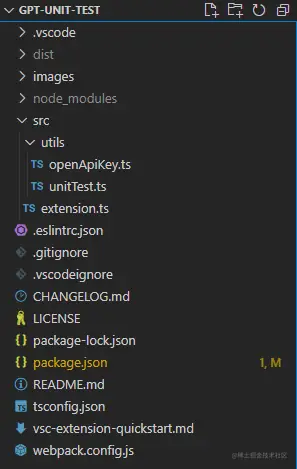
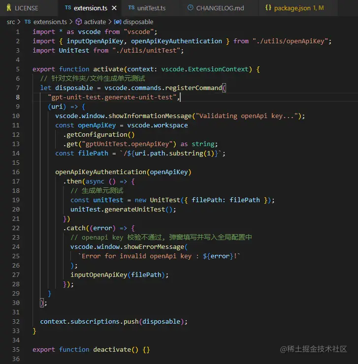
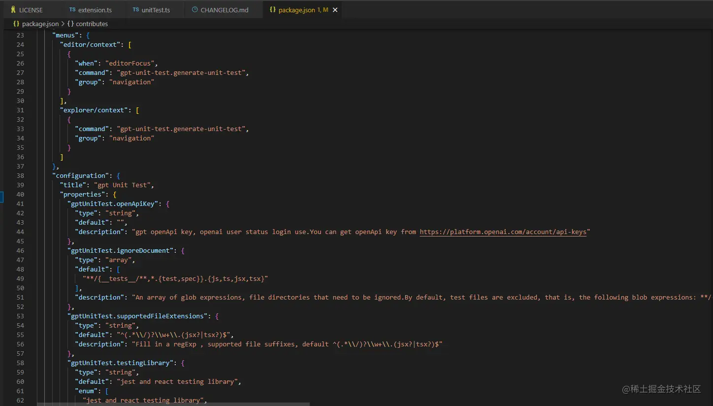
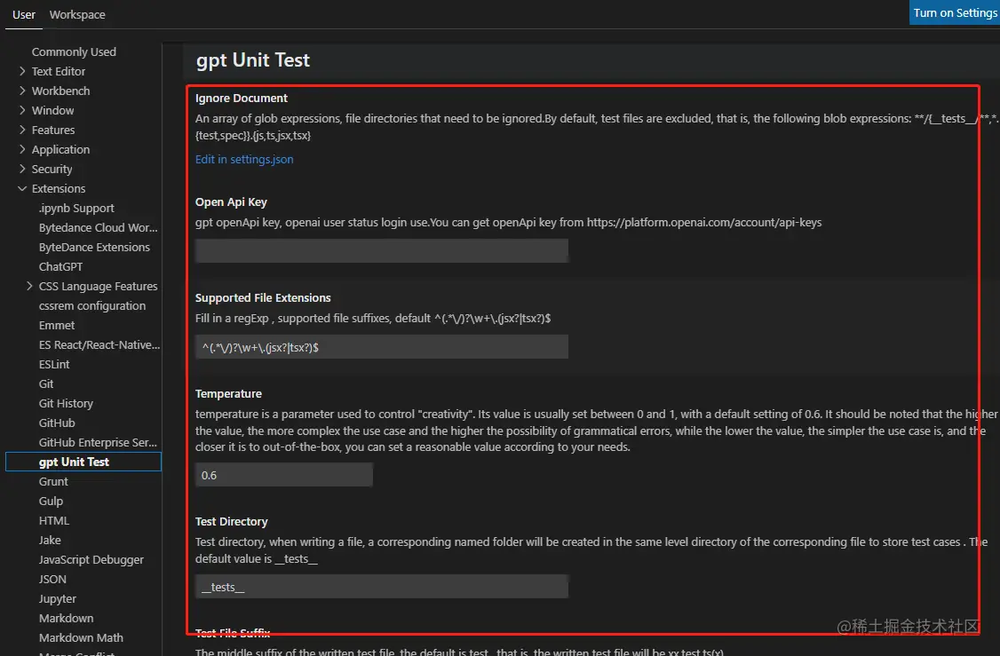
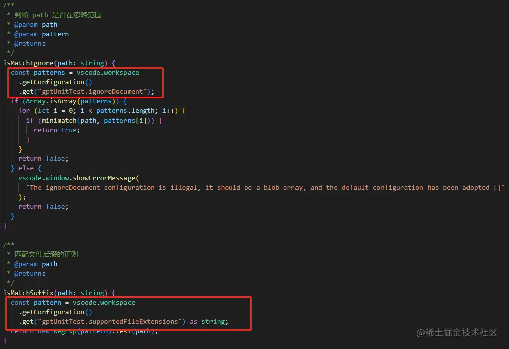
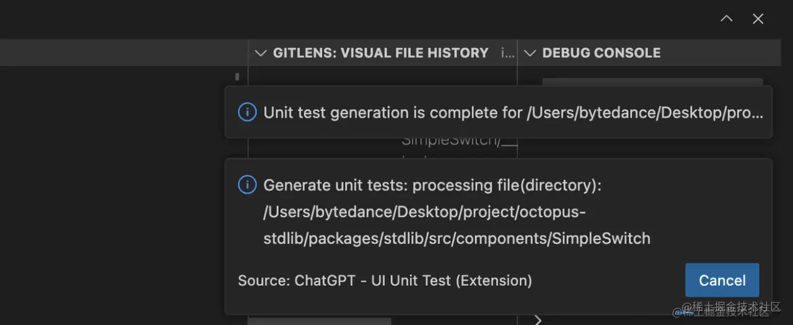
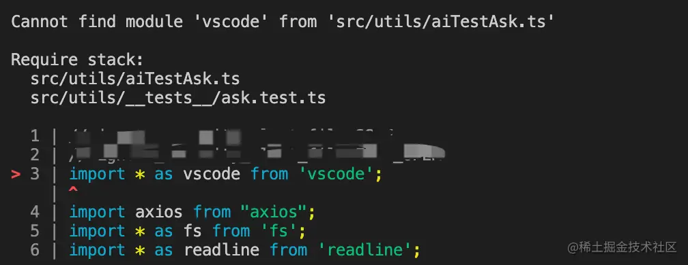
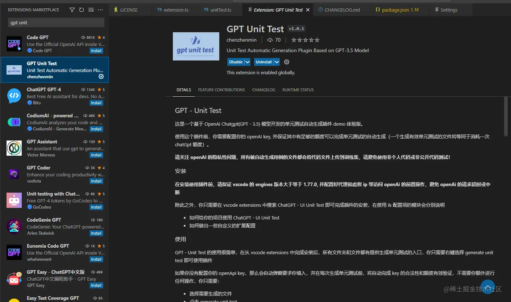
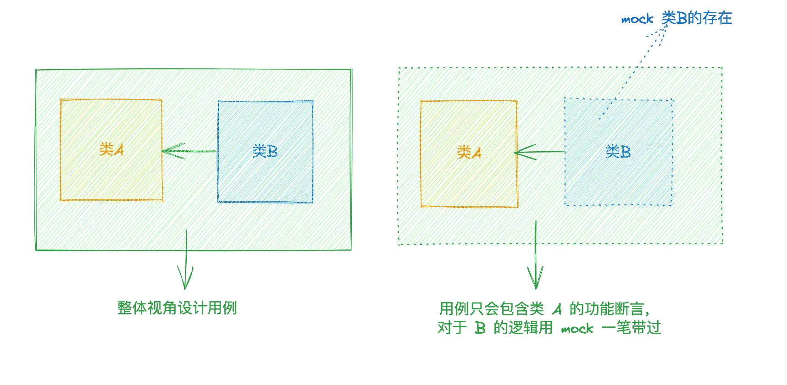

大家好，我是祯民。我们在平常的开发中，面对一些基础轮子或者服务的项目，常常会需要写一些单元测试来保证历史逻辑的稳定。
> 单元测试（Unit Testing）是指对软件系统中的最小可测试单元进行检查和验证，通常是对程序中的一个函数、一个类或一个模块进行测试。其目的是确认这个部分的代码是否能够正常工作，达到预期的结果，并且百分之百地覆盖所有的代码分支和可能的输入情况。


**单元测试不同于平时测试同学的功能测试，它更看重以某个模块的角度展开测试，从模块到整体，进而达到为整个系统维稳的目的**，这个是研发同学比较常用的自动化测试手段。

对于前端的单元测试，我们常常使用 jest 作为我们的测试库。当然具体的原因和其中包含了什么功能并不是咱们这篇文章的重点，我们不会过多介绍，还不清楚一些前置信息的同学可以看看这篇[《技术选型：React testing library or Enzyme?》](https://juejin.cn/book/7174044519350927395/section/7176612133294063668)

因为测试过程中很难做到每个环境和 API 是真实存在的，所以**大家在用 Jest 完成单元测试的时候，常常需要使用 mock 来模拟一些特定的环境或者 API 信息来保证整体流程的通畅**，mock 的手段和思路还是有很多值得分享的地方的，所以这一章节我们将来具体学习 Jest mock 的极致用法。

为了方便大家理解，而不是纸上谈兵，这篇文章会以 VSCode 插件为背景展开。因为 VSCode 插件运行时环境包含很多插件 API 以及通常作为一个服务存在的原因，所以它是一个非常典型的适合用于 mock 的业务背景，当然没开发过 VSCode 插件的同学也不需要紧张，这篇文章会包含一些必要的前置知识，其实很简单，并不影响全文的学习。

本文的内容会从以下三个方向展开：
- **VSCode 插件开发前置知识**：在这个模块中，我会给大家简单介绍一下 VSCode 插件开发有什么特殊性，以及我们常用的 API 可能有哪些。
- **VSCode 运行时环境的 mock**：在这个模块中，我们会来学习 VSCode 插件单元测试中必须完成的环境 mock，不仅是 VSCode 插件开发，只要涉及前置环境配置的开发（比如 sql, canvas 等），这都是必不可少的一步。
- **公用模块的 mock**： 对于一些公用模块，我们虽然可以使用它们的真实 API 来调用，但是真实 API 往往存在一些前置环境，或者 catch 兜底，导致我们需要花费额外精力保证这些公用模块在测试环境下可用。可事实上，这些公用模块又并不是我们用例的重点，这时候就可以用 mock 来简化这个调用调试的过程。
- **内部类引用的 mock**：在服务开发中，我们通常会定义大量的类，而且类之间也可能会存在互相的调用，在这个过程中，类的互相调用很容易导致类的用例之间耦合度剧增，从而脱离设计的单一原则。在这种场景下，我们也可以使用 mock 来提高用例的稳健性。

## VSCode 插件开发前置知识
VSCode 插件开发简单来说就是一个 node 服务的开发，只不过在常规 node 服务基础上，它额外提供了一些全局环境下的 API，来触发 VSCode 中的参数配置、弹窗、确认框和插件信息等原生能力。以我前段时间发布的一个插件 demo 为例，它的目录结构是这样的。



对于VSCode 插件开发，微软是有提供一个脚手架来初始化项目的，大家可以参考下面指令试试
```shell
# 18.【加餐】Jest Mock 的极致用法 _ 如何对 VSCode 插件进行单元测试？
npm install -g yo generator-code
# or yarn
yarn global add yo generator-code
# 根据提示创建插件工程
yo code
# 使用 VSCode 打开插件工程，假设为 hello-world
code ./hello-world
```
在创建完成以后，大体目录结构和上面的截图应该差不多，大家真正需要关注的主要是两个文件，一个是 extensions.ts，这个是整个插件的入口文件。也许你在初始化的时候选的内容不同，所以你的入口文件也会有差异，具体大家可以以 package.json 中的 main 配置的是啥为准。



这个文件中的内容也很简单，通过 vscode 提供的 registerCommand 方法我们可以注册一个命令，第一个参数是命令的 key，第二个参数是命令触发后的回调函数，完成注册后我们只需要安装插件即可搜索到这个命令。


可以看到 vscode 实际开发是很简单的，没什么特殊的，我们只需要像正常的 node 服务那样编写功能类以后，在命令回调中调用即可。

第二个大家需要关注的文件即 package.json，在 vscode 插件开发中，package.json 中不仅是一个存放项目脚本和依赖的文件，更是整个插件名称、配置参数以及菜单等重要内容的配置文件。



具体怎么配置的大家可以自行去官网查阅，这里就不做介绍了。大家只需要知道，在这里配置好的参数会在插件安装后，从 extensions 指定插件目录体现。



同时我们可以通过调用 vscode 提供的 API 获取到这些参数的配置值，并在我们的实际逻辑中调用。



除了 registerCommand 和 getConfiguration 外，vscode 还提供了其他的一些方法来调用它的原生能力，比如 showWarningMessage 触发弹窗警告等，更具体的我这里就不提了，大家可以去官网查阅 API。



我们可以看到 vscode 环境下提供了很多 node 环境下没有的能力和 API 来触发它们的原生事件，但是我们的测试环境是普通的 node 环境，意味着这些 API 是没办法在测试环境中正常使用的，所以 mock 的重要的意义就体现出来了，可以说对于 VSCode 插件的单元测试，如果你不合理使用 mock 是没办法完成的。




另外提一个题外话，这里提到的 vscode 插件是我写的一个基于 gpt 模型开发的可以自动生成单元测试的辅助工具，感兴趣的同学可以试试，更详细的信息可以阅读[《（建议收藏深读）GPT 高阶玩法 - 万字 GPT 模型自动化应用指南（ javaScript 示例）》 ](https://juejin.cn/post/7221739494277480504#heading-12)




## VSCode 运行时环境的 mock

上个小标题我们提到，vscode 环境相比 node 环境有很多额外的 API，比如弹窗，进度条等，要为它完成测试，需要mock 插件环境保证 api 的存在，这种针对环境且量不小的 mock 我们通常写在 jest 配置根目录的 `__mocks__` 目录下，这个目录下的文件会作为默认 mocks 加入测试环境，这部分在官方文档中也有额外的补充介绍。

> Manual mocks are defined by writing a module in a `__mocks__/` subdirectory immediately adjacent to the module. For example, to mock a module called `user` in the `models` directory, create a file called `user.js` and put it in the `models/__mocks__` directory.

下面我给出我的 vscode 插件配置给大家参考，这个没有一个标准答案，简单来说，你用到了哪些 API 你都需要为它们兜底一个实现或者值，不仅是 vscode 插件开发，别的场景也是如此。
```javascript
// vscode 环境 mock

const languages = {
  createDiagnosticCollection: jest.fn()
};

const StatusBarAlignment = {};

const window = {
  createStatusBarItem: jest.fn(() => ({
    show: jest.fn()
  })),
  showInformationMessage: jest.fn(),
  showErrorMessage: jest.fn(),
  showWarningMessage: jest.fn(() => ({
    then: jest.fn()
  })),
  createTextEditorDecorationType: jest.fn(),
  withProgress: jest.fn()
};

const workspace = {
  getConfiguration: () => {
    return {
      get: (section) => {
        const configuration = {
          'chatgptUiUnitTest.model': 'azure3.5',
          'chatgptUiUnitTest.ignoreDocument': [
            "**/{__tests__/**,*.{test,spec}}.{js,ts,jsx,tsx}"
          ],
          'chatgptUiUnitTest.supportedFileExtensions': '^(.*\/)?\w+\.(jsx?|tsx?)$',
          'chatgptUiUnitTest.testingLibrary': 'jest',
          'chatgptUiUnitTest.testingLibraryReplenish': '',
          'chatgptUiUnitTest.testDirectory': '__tests__',
          'chatgptUiUnitTest.testFileSuffix': 'test',
          'chatgptUiUnitTest.temperature': 0.8,
          'chatgptUiUnitTest.automaticRetries': 2
        };
        return configuration[section];
      }
    };
  },
  workspaceFolders: [],
  onDidSaveTextDocument: jest.fn()
};

const OverviewRulerLane = {
  Left: null
};

const Uri = {
  file: f => f,
  parse: jest.fn()
};
const Range = jest.fn();
const Diagnostic = jest.fn();
const DiagnosticSeverity = { Error: 0, Warning: 1, Information: 2, Hint: 3 };

const debug = {
  onDidTerminateDebugSession: jest.fn(),
  startDebugging: jest.fn()
};

const commands = {
  executeCommand: jest.fn()
};

class CancellationTokenSource { }

const ProgressLocation = {
  Notification: 1
};

const vscode = {
  languages,
  StatusBarAlignment,
  window,
  workspace,
  OverviewRulerLane,
  Uri,
  Range,
  Diagnostic,
  DiagnosticSeverity,
  debug,
  commands,
  CancellationTokenSource,
  ProgressLocation
};

module.exports = vscode;
```
我用到的 API 相对较多，大家可以根据自己的场景移除掉一些自己没调用的 API，然后我们再重新尝试，会发现用例将可以正常执行。

## 公用模块的 mock

在 node 服务开发中，我们常常会用到 fs 等模块进行一些文件操作，就比如下面的例子。
```javascript
export class B {
  constructor() {
  }

  b1(dirPath) {
    const fileContent = fs.readFileSync(dirPath, 'utf8');
    return fileContent;
  }
}
```
在上面的例子中，我们读了一个文件的内容并将它返回，在实际的测试中，大部分同学会这样设计用例，我们需要先创建一个测试文件，然后将路径传给这个文件，最后测试完成后还需要删除这个文件，比如下面的实现

```javascript
describe('B', () => {

  beforeEach(() => {
    // ... 测试前置环境准备（文件夹创建、文件写入）
  });
  
  afterEach(() => {
     // ... 完成测试后，清除缓存、测试文件等
  })

  it('test for b1', () => {
    b.b1();
    expect(a.a1).toHaveBeenCalled();
    expect(a.a1).toHaveLastReturnedWith('test');
  });
})
```

这个过程是不是太繁琐了？

而且在上面的测试过程中，**与其说我们在测试 b1 , 倒不如说我们在测试 `fs.readFileSync` 的功能**，是不是有点本末倒置的味道？事实上，在用例的测试过程中，我们通常都需要保证用例的单一原则性，通俗地讲，**你的函数干了啥事就测啥，通过别的函数完成的内容与我们无关。**

在上面的 case 中，我们完全可以通过 mock 来简化这个测试过程，比如下面的实现。
```javascript
import * as fs from "fs";

describe('B', () => {

  it('test for b1', () => {
    jest.spyOn(fs, 'readFileSync').mockReturnValueOnce('');
    const res = b.b3('test');
    expect(res).toEqual('');
  });
})
```
`jest.spyOn`可以监听某个公共模块，并通过链式调用的方式（比如这个 case 中的 `mockReturnValueOnce`）来提供一些确切的 mock 方式。我们上面也提到，这个用例中 `fs.readFileSync` 有没有 bug 我们并不关注，所以我们完全不用真实调用它的内部实现，可以通过 mock 拟定一个实现或者返回值，我们继续后续的流程。

这个用法在实际的测试中会有大量的应用，大家可以多思考练习。

## 内部类引用的 mock

因为 node 服务，与 web 开发不同的是，我们会定义更多的类，也会存在类之间的调用，那么如果存在类 A 和 类 B 的互相调用，那么对于它们的测试应该如何展开呢？

诚然，最简单直接也是最符合业务场景的做法就是，mock 一个足够真实的场景，来一步一步验证效果是否是符合预期的，这种效果最理想，但成本也最高，用例的耦合度也最高。

**单元测试与功能测试不同，我们的确需要从用户和产品功能的视角来展开用例的设计，但是代码结构的设计原理也是单元测试用例设计的一个重要因素。** 换言之，牺牲一些产品功能的完整度，来换取更细粒度的用例和更好维护的测试代码是可取的，我们可以追求更加单一原则的用例代码来提高我们测试代码的优雅度。



举个例子，例如 类 A 调用了 类 B，那么我们对类 A 的测试其实并不需要覆盖类 B 的逻辑，也就是说，类 B 功能是不是符合预期的在类 A 的用例中并不重要，我们只需要在类 A 的用例中保证涉及类 B 调用的部分存在且能有正常的值即可（这个保证也许是虚假不确定的）。

至于这其中的过程和类 B 是不是真的可以根据它的流程得到我们预期的值那就不是类 A 关注的了，这应该是类 B 的用例去考虑的，为达到这种目的，我们就可以使用 mock 来为 A 提供一个虚假不确定的 类 B 保证。

**这种用例的设计法则，极致地满足单一原则，虽然牺牲了一些业务完整度（因为做了也许虚假的承诺），但是写出的用例最为优雅可维护，即使类 B 的承诺真的出错了，也可以在它对应的用例中得到体现，而不干扰 A 的用例。** 我们来看下面的例子。

```javascript
import * as fs from 'fs';

export class B {
  constructor() {

  }

 b1() {
    console.log('b1');
  }
}

export class A {
  private b: B;

  constructor(bObj: B) {
    this.b = bObj;
  }

  a1() {
    this.b.b1();
  }
}
```
对于上面的例子，我们可以写出如下的测试用例
```javascript
import { A, B } from '../test';
import * as fs from 'fs';

jest.mock('fs');

describe('A', () => {
  let b: B;
  let a: A;

  beforeEach(() => {
    b = new B();
    b.b1 = jest.fn().mockReturnValue('test');
    a = new A(B);
  });

  it('b1: 是否调用了A的方法a1', () => {
    b.b1();
    expect(a.a1).toHaveBeenCalled();
    expect(a.a1).toHaveLastReturnedWith('test');
  });
});
```
不过需要注意的是，这样设计用例需要满足 b 的引用会在 a 的构造函数中传入，而不是在 a 中直接创建出来，mock 的引用需要保证一致，才能完成 b 方法的 mock 替换。如果是在 a 直接创建出来，a 中使用的 b 引用与测试代码中 mock 的 b 引用就会不同, mock 也便不会生效。

## 小结

到这里，我们这篇文章的内容就讲完了，对于单元测试而言，保证用例的单一原则是一个很重要的用例设计原则，为了达到这个目的，我们常常会使用 mock 来替代掉非该用例中使用的其他的方法。

一方面这样做可以减少对运行环境的模拟准备，也不需要在测试完成后清除之前准备的测试环境，另一方面用例的单一原则也可以达到一个极致的效果，只会包含对应函数中实际需要测试的内容。

我们知道测试用例除了保证历史功能的稳定外，还有一个重要的目的，就是文档用例化，相比 readme ，测试用例无疑是最好的最有时效性的文档，**一个具备单一原则的用例将是最好的组件或是服务文档，不管是交接还是带新同学都会有不错的效果。**

今天的课程我们就到这里，有问题欢迎大家在评论区提问交流。