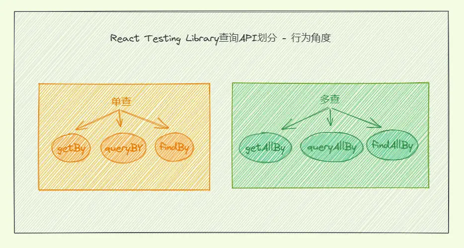
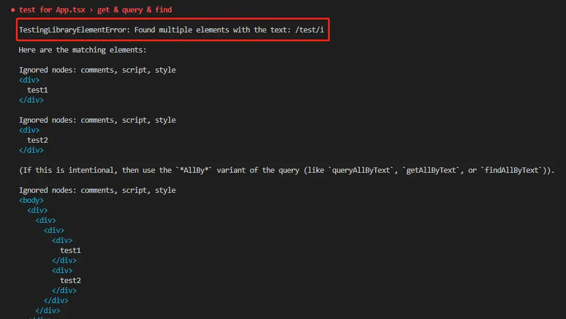
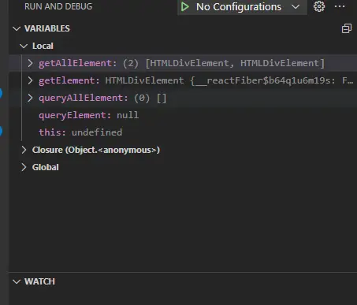

# 4.DOM 查询（上）：页面元素的渲染和行为查询

> 代码仓库：https://github.com/czm1290433700/test_demo

上节课我们学习了如何告诉程序什么是我们的预期，在单测程序中，每一个预期都通过断言的方式来说明，Jest 提供了很多基础的断言来帮助描述程序中可能存在的不同场景，但是 Jest 的基础断言通常用于纯 JavaScript 逻辑的断言，例如 node 服务的函数。

但是面对业务场景，我们的逻辑中不可避免会涉及 Dom 元素的选取，也就是所谓的 UI 自动化，面对这种场景，我们需要对页面元素进行渲染 、 查询，然后再对结果进行断言，仅通过 Jest 就没办法满足我们的需求了，需要 React Testing Library 的帮助，这节课我们就来学习，如何对 DOM 元素进行渲染、查询。

## 页面元素的渲染

首先还是回到我们最初的例子：

```
test("renders learn react link", () => {
  render(<App />);
  const linkElement = screen.getByText(/learn react/i);
  expect(linkElement).toBeInTheDocument();
});
```

@testing-library/react 这个依赖提供了一些处理 React Component 的 API，其中 render 方法用于元素的渲染，并且在 render 执行过后会把值注入到 screen对象中。像上面这个例子中，使用 screen 来选取我们需要的元素，其中 `getByText` 是 React Testing Library 提供的查询 API，我们一会着重介绍。

以上面的例子举例，除了通过 screen 选取元素，还可以直接通过 render 来选取。

```
const linkElementByScreen = screen.getByText(/learn react/i);
const { getByText }  = render(<App />);
const linkElementByRender = getByText(/learn react/i);
```

这两种写法都可以获取到需要的元素，那它们之间有什么区别吗？

> The benefit of using `screen` is you no longer need to keep the `render` call destructure up-to-date as you add/remove the queries you need. You only need to type `screen.` and let your editor's magic autocomplete take care of the rest.

上面是作者对于这个问题的解释，翻译一下是这样的：

> 使用屏幕的好处是，您不再需要在添加/删除所需查询时，保持渲染调用的解构是最新的。您只需要输入屏幕，让您的编辑器神奇地自动完成功能来处理其余的事情。

这样直接看大家可能还不是很理解，我们可以结合[源码](https://github1s.com/testing-library/dom-testing-library/blob/HEAD/src/screen.ts#L5)来一起理解一下这句话。

这是 render 方法的定义：


这是 screen 方法的定义：


它们都有使用`  getQueriesForElement ` 方法，这个方法是为了获取指定元素下的查询，作者有将 role， text 等类别的查询通过这种方式暴露出来。

我们再来具体看这两个方法做了什么，render 方法首先会创建一个元素，并写入到 innerHTML 中，然后再去获取我们传入的组件（html 参数）下的查询对象，并暴露出来，而 screen 方法则是在 document.body 存在的时候，获取 document.body 下的查询进行暴露。

这里的`  document.body ` 和 html 参数其实是同步的，只不过在基础上包了一层 `<body></body>`，这么看来好像只是把查询的字段放在全局进行导出了，这么做的意义是什么呢？综合来讲是两个原因：

-   Render 方法的主要意义其实是渲染，虽然它也会暴露出查询的 API，但这个 API 和 渲染其实是没有关系的，所以把查询作为一个独立的全局对象 screen 暴露出来，可以有效区分渲染和查询的界限，这样从测试项目的结构上来说是更清晰的；

-   另外一个重要的原因是，DOM 相关的查询 API 是比较多的，采用解构的方式很容易就出现下面的写法，我们不得不在每个 test 中重复解构。

```
import {render} from '@testing-library/react'

test('test 1', () => {
  const {queryByLabelText, getByText, getByLabelText} = render(<Thing />)
})

test('test 2', () => {
  const {getByLabelText, queryByLabelText} = render(<Thing />)
})

test('test 3', () => {
  const {getByLabelText, queryByLabelText} = render(<Thing />)
})

test('test 4', () => {
  const {getByLabelText, queryByLabelText} = render(<Thing />)
})
 ```
 这种解构其实是重复的，且与实际测试的逻辑的确半毛钱关系都没有，相比之下 screen 的写法要清晰舒服很多。
 ```
test("test", () => {
  render(<App />);
  screen[...] // 需要啥用啥
}
```
所以我们在写 DOM 相关的单测时，更建议大家采用 screen 来获取 DOM 的 container 来查询，额外值得一提的是，render 函数需要放在每个独立的 test 中，因为在每个 test 执行完以后， React Testing Library 会调用 cleanup 方法来清理环境，例如下面的写法，会导致后面的 test 不能读到元素，**这是一个常见的问题，大家需要注意一下**。
 ```
import React from "react";
import { render, screen } from "@testing-library/react";
import App from "./App";

render(<App />)

describe("tests", () => {
  test("test1", () => {
    // ...
  });

  test("test2", () => {
    screen.debug(); // ... 会读不到元素，仅剩body
  });
});
 ```

## 页面元素的查询

渲染完组件元素后，我们需要对组件进行查询，从而选取到我们需要的区域，React Testing Library 提供的查询 API 很多，但是可以从行为和参照物两个维度进行拆分理解，这节课我们先来学习行为维护的分类。

从行为角度上，查询 API 可以包含三种类别（getBy, queryBy, findBy），它们各自又包含单查和多查，也就是（getBy, queryBy, findBy, getAllBy, queryAllBy, findAllBy)，其中同一种类别的能力类似，区别只在于查询的数量，比如 getBy 和 getAllBy 在 API 的表述上就是近似的，大家可以参照下图来初步理解。



其中针对三种类别，它们之间的区别在于：

-   Get：返回查询的匹配节点，如果没元素匹配，则会报错（针对单查如果查到多个也会报错）；
-   Query：返回查询的匹配节点，如果没有元素匹配会返回 null，但是不会报错（同样针对单查，如果查到多个匹配元素也会报错）
-   Find：返回一个 Promise，默认超时时间为 1000 ms， 如果没有元素匹配或者查找超时，Promise 状态切为 reject（同样针对单查，如果查到多个元素，也会返回 reject）。

find 方法我们会在[8 | Async 异步：异步方法如何进行单测？](https://juejin.cn/book/7174044519350927395/section/7176612133516345378) 详细介绍，这节课我们先来学习 get 和 query 的类别。以我们之前使用过的 text 来举例说明，可以创建一个组件作为我们这部分的测试。

```
// ./src/components/DomQuery/index.tsx
import { FC } from "react";

interface IProps {}

// 《4 | DOM查询(上)：页面元素的渲染和行为查询》 & 《5 |DOM查询(下)：页面元素的参照物查询和优先级》
export const DomQuery: FC<IProps> = ({}) => {
  return (
    <div>
      <div>test1</div>
      <div>test2</div>
    </div>
  );
};
```

然后我们加上这样一条单测：

```
// ./src/__test__/dom_query.test.tsx
import React from "react";
import { render, screen } from "@testing-library/react";
import { DomQuery } from "../components/DomQuery";

describe("tests for 《4 | DOM查询(上)：页面元素的渲染和行为查询》 & 《5 | DOM查询(下)：页面元素的参照物查询和优先级》", () => {
  test("get & query & find", () => {
    render(<DomQuery />);
    const element = screen.getByText(/test/i);
    screen.debug(element);
  });
});
```

其中 screen.debug 是暴露出来的一个调试 API，可以帮我们将查询出来的元素在控制台中显示出来，我们可以看看效果，发现会抛出找到多个元素的错误，getBy 是没办法直接查询多个的，我们换用 query 或是 find 也会有相同的效果。



在这个基础上，再来丰富一下我们的例子，将用例调整为下面的代码，然后在最后一行加上断点，然后用 debugger 终端执行看看。

```
// ./src/__test__/dom_query.test.tsx
import React from "react";
import { render, screen } from "@testing-library/react";
import { DomQuery } from "../components/DomQuery";

describe("tests for 《4 | DOM查询(上)：页面元素的渲染和行为查询》 & 《5 | DOM查询(下)：页面元素的参照物查询和优先级》", () => {
  test("get & query & find", () => {
    render(<DomQuery />);
    const getElement = screen.getByText("test1");
    const getAllElement = screen.getAllByText(/test/i);
    const queryElement = screen.queryByText("test3");
    const queryAllElement = screen.queryAllByText("test3");
    debugger;
  });
});
```

大家可以先根据之前学的理论判断一下预期的结果是什么。query 相比 get 不同的是，它在没匹配到对应元素时，并不会抛出错误，而是返回 null 或是 []，那么这个结果其实应该是`  htmlDivElement, [htmlDivElement, htmlDivElement], null, [] `，我们来看看结果是不是和我们想的一样。



相信到这里大家就已经熟悉 get 和 query 以及单查和多查的区别了，那么什么场景下我们应该用 get， 什么场景下我们用 query 呢？

如果说这个元素的存在与否，并不决定这个用例能不能通过，或者说，这个元素不存在，也并不影响这个用例通过的话，我们应该使用 query。如果说这个元素不存在，那么后续的步骤就没有执行的意义，这个用例就是不通过的，我们应该使用 get，因为 get 会抛出错误，直接中断这个用例。

在上面的例子中，我们后缀使用的是 text，这是一种通过标签文本作为参照物的方式，除了这种以外， React Testing Library 还涉及其余 7 种参照物的查询方式，因为文章篇幅的关系，我们将在下一节课继续学习。

## 小结

这节课我们学习了 DOM 查询的上篇 - 页面元素的渲染和行为查询。对于页面元素的渲染，通常采用 render ，这个函数会返回给我们需要的查询，因为考虑到重复解构的原因，React Testing Library 有在全局暴露一个 screen 对象，当我们调用 render 方法后，它会注入 element 到页面的 innerHtml 中，而 screen 则会针对页面 body 区域获取查询，并暴露给我们 body 区域的查询API。

针对查询的部分，我们按照行为和参照物进行了分类，行为上我们分为了 get、 query 和 find 三种类别，其中 get 获取不到元素会抛出错误，而 query 获取不到则是返空，对于 find 则采取异步返回 reject。

在实际场景的应用中，如果元素获取不到，并不意味着这条用例失败，我们可以使用 query 来进行获取，因为 get 抛出的错误也会中断这条用例的执行。我们还学习了单查和多查两种情况的区别，当使用单查 API 查询到多个匹配元素的时候，也会抛出对应的错误来中断用例。

同时我们还接触到了第一个参照物 text， 这是一种通过标签文本作为参照物的方式，除此之外，其实还有其余的 7 种参照物，再考虑到查询行为的三种分类，单查和多查的场景，涉及到的实际 API 有8*3*2 = 48 种之多，那么，应该如何有效排列这些查询方式的优先级，并且在合适的场景使用呢？这些我们都将在下节课详细讨论。