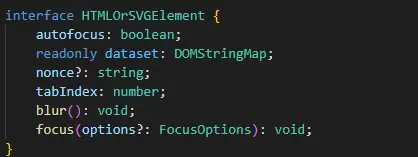
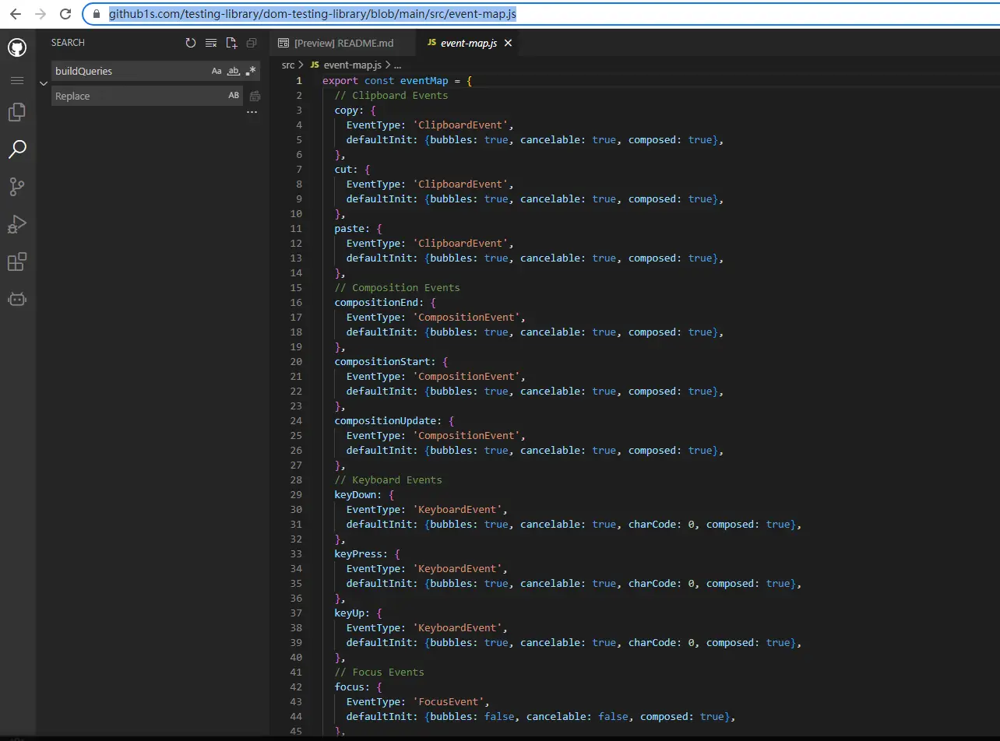
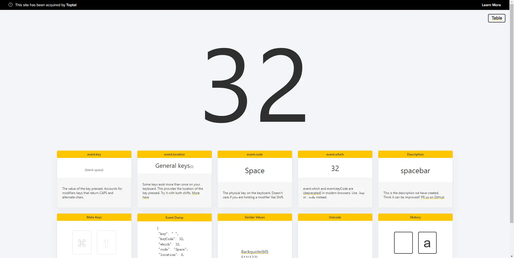
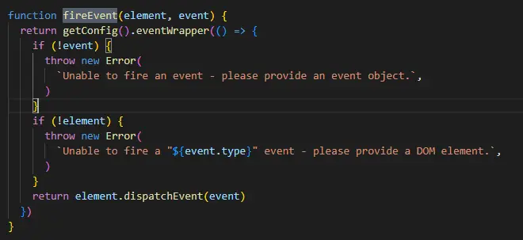
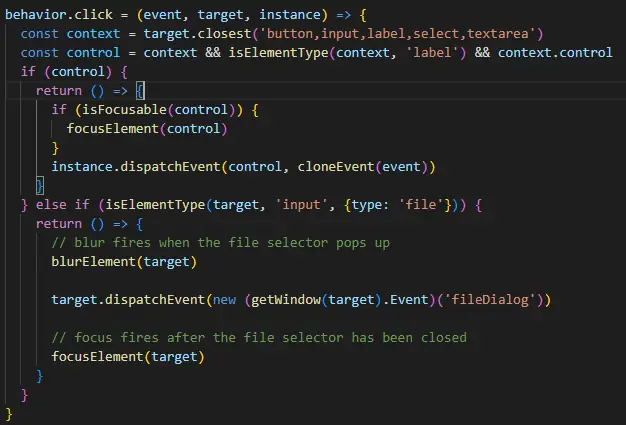

# 7.User-event：怎么对 Dom 组件绑定事件进行模拟触发？

> 代码仓库：https://github.com/czm1290433700/test_demo

经过前三节课的学习，我们现在已经学会了怎么对 DOM 元素进行查询和断言，但是光这样还不足够覆盖我们业务场景的用例需求。在实际的业务场景中，往往会包含各种事件，比如按钮点击，表单提交等，对于这类用例，我们需要模拟对应的事件来触发。

针对这种场景，React Testing Library 提供了两种手段来模拟，fireEvent 和 userEvent，这节课我们就来学习怎么通过它们来模拟事件。

## fireEvent

fireEvent 是 React Testing Library 提供的一组 API，通过它我们可以高效模拟事件的触发。在介绍之前，我们首先回到上节课中的例子。在上节课中，我们测试聚焦的断言时，有使用 fireEvent 来模拟文本框的聚焦。

```
// ./src/__test__/dom_expect.test.tsx
import React from "react";
import { render, screen } from "@testing-library/react";
import { DomExpect } from "../components/DomExpect/index";

describe("tests for 《6 | DOM断言:页面元素的断言》", () => {
  // ...
  test('form validation without semi', () => {
    // ...
    age.focus();
    // ...
  });
});
```

这是一种特殊的方式，focus 事件有被绑定在元素的对象上，与此类似的 blur（失焦）事件，执行的效果与 fireEvent 中提供的 focus 是相同的。



fireEvent Api 的结构是这样的：

```typescript
fireEvent[eventName](node: HTMLElement, eventProperties: Object)
```

上面的参数 eventName 是指需要模拟的事件，除 focus 外，fireEvent 还可以模拟 click 等事件，其中 eventName 涉及大部分 document event，支持的内容大家可以在源码 [event-map.js](https://github1s.com/testing-library/dom-testing-library/blob/main/src/event-map.js) 中查看。



小部分较难模拟的事件不支持，例如滚动，这部分我们可以采用端对端测试的方案来覆盖，具体会在 [14 | E2E:  怎么覆盖滚动等复杂交互场景的测试？](https://juejin.cn/book/7174044519350927395/section/7176804898074427427) 介绍。

除 eventName 外，还有一个 node 和 eventProperties ，node可以接收一个我们查询出来的对象，而 eventProperities 则是描述这个具体事件的属性，以键盘按下事件为例，不同的按键按下会有对应的属性，这个具体的属性可以通过 [下面的页面](https://www.toptal.com/developers/keycode) 查询，比如我们按一下空格键。



与之对应的 fireEvent，我们就可以写作：

```
firEvent.keyDown(node, {key: '', code: 'Space', charCode: 32})
```

我们来举个例子具体说明一下：

```
// ./src/components/DomEvent.tsx
import { FC } from "react";

interface IProps {
  onClick: () => void;
}

// 《7 | User-event: 怎么对 Dom 组件绑定事件进行模拟触发？》
export const DomEvent: FC<IProps> = ({ onClick }) => {
  return (
    <div role="note" onClick={onClick}>
      点我试试
    </div>
  );
};
```

```
// ./src/__test__/dom_event.test.tsx
import React from "react";
import { fireEvent, render, screen } from "@testing-library/react";
import { DomEvent } from "../components/DomEvent";

describe("tests for 《7 | User-event: 怎么对 Dom 组件绑定事件进行模拟触发？》", () => {
  test("mock events with fireEvent", () => {
    const clickEvent = jest.fn();
    render(<DomEvent onClick={clickEvent} />);
    fireEvent.click(screen.getByRole("note"));
    expect(clickEvent).toBeCalled();
    expect(clickEvent).toBeCalledTimes(1);
  });
});
```

通常对于事件的用例，我们会使用到 Jest 提供的 mock 事件，以及 `toBeCalled` 和 `toBeCalledTimes` 两个断言，`toBeCalled` 用来判断 mock 事件是否被调用，而 `toBeCalledTimes` 用来判断 mock 事件被调用的次数。

在上面的例子中，我们 mock 了一个函数，并且把它传入我们定义组件的 click 事件中，作为预期，我们断言了这个函数在模拟点击后，将会被执行，且执行次数为1。大家可能会有一个疑问，我们实际传入的方法并不是 mock 方法，那怎么保证这个事件触发后可以按预期执行呢？

其实，这个我们应该单独为函数本身书写用例来测试，因为根据单一原则，我们这边需要保证的是在事件触发后，可以执行对应的回调，至于回调自己的函数做了什么事情，我们应该直接配置入参来测试函数。

## userEvent

上面我们介绍了 fireEvent，虽然它是可以满足我们需求的，但是其实我们应该尽量避免使用 fireEvent，而是使用 userEvent，为什么呢？

在之前的章节我们反复提到，我们书写的用例应该尽可能从用户视角来展开，而不是代码层面，这样对于用例本身来说，才是更强健的，对于 fireEvent 而言，它只是在调度一个 DOM 事件，例如 click 事件，对于 fireEvent 而言，它只是直接触发了这个元素的 click。

然而在实际的场景中，我们点击一个按钮，会有先 hover 再聚焦的过程，这些事件的触发并不会在 fireEvent 中体现出来。 userEvent 则是在模拟完整的事件流程，我们上面提到的 click 事件，它同样也会触发 hover 等事件效果，更为真实地还原了用户的场景，我们可以从源码上来更深刻地认识这个问题。



这是 fireEvent 的实现，很简单，除了一些异常的兜底外，就是直接模拟返回的事件。



这是 userEvent 的实现，除了模拟传入实例直接需要的 click 外，它还触发了这个元素聚焦和失焦，就不像 fireEvent ，只是简单返回模拟的事件。对于其他事件，userEvent 也是针对事件来一一定制对应的响应函数的，目前支持的有下面的事件， 对于还没实现的事件大家可以用 fireEvent 先替代。


对于之前写的 fireEvent 用例，我们尝试用 userEvent 改写一下：

```
// ./src/__test__/dom_event.test.tsx
import React from "react";
import { fireEvent, render, screen } from "@testing-library/react";
import { DomEvent } from "../components/DomEvent";
import userEvent from "@testing-library/user-event";

describe("tests for 《7 | User-event: 怎么对 Dom 组件绑定事件进行模拟触发？》", () => {
  // ... other content
  test("mock events with userEvent", () => {
    const clickEvent = jest.fn();
    render(<DomEvent onClick={clickEvent} />);
    userEvent.click(screen.getByRole("note"));
    expect(clickEvent).toBeCalled();
    expect(clickEvent).toBeCalledTimes(1);
  });
});
```


## 小结

这节课我们学习了怎么对 DOM 组件的事件进行模拟，React Testing Library 提供了 fireEvent 和 userEvent 两组 API 来帮助我们进行事件模拟，在 API 支持的情况下，我推荐大家优先使用 userEvent。

从实现上来说，fireEvent 采用简单的事件模拟方式，只会触发对应的事件，并不是真实还原用户操作的完整场景，而 userEvent 暴露的每个方法都是根据实际事件场景去定制的还原。从用例的强健性上看，与网页使用方式越相近的测试用例，给予我们的信心就会越大，用例也不容易变更或是遗漏边缘情况。

现在我们已经学习了查询、断言以及事件模拟的相关内容，对于 DOM 事件的用例书写，相信大家已经有了初步的认知，但是到目前为止，我们的用例都还是同步进行的，事实上在实际的业务场景，我们难免会遇到异步执行的逻辑，这个也是我们用例需要覆盖的重要模块，下节课我们就来学习如何测试异步逻辑。