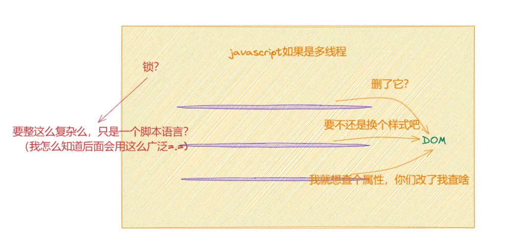
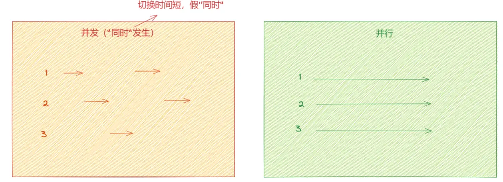
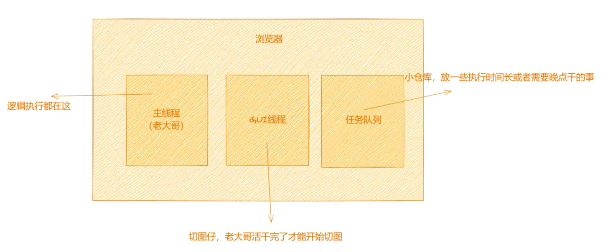
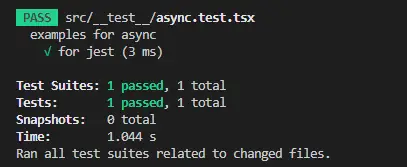
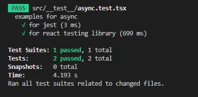
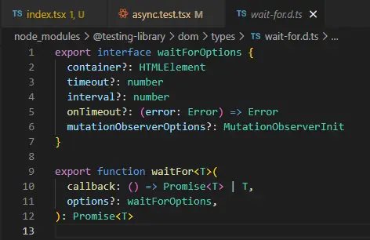
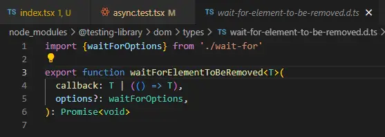
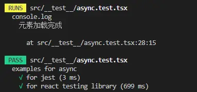
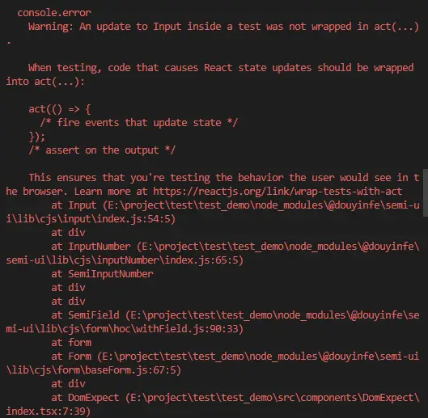

# 8.Async 异步：异步方法如何进行单测？

> 代码仓库：https://github.com/czm1290433700/test_demo

上节课我们学习了怎么模拟 DOM 事件触发来进行逻辑的断言，在 React testing library 中有提供 fireEvent 和 userEvent 两种事件的模拟 API，其中 fireEvent 是简单的事件触发，而 userEvent 相比之下会根据实际场景的角度进行事件的模拟，不仅是事件本身，也包括触发这个事件过程中可能会触发的额外事件，相比之下更符合我们用例的设计原则 -- 贴近用户使用。

之前的课程我们虽然学会了查询，断言和事件的模拟，但一直是同步的逻辑。在实际的业务场景中，异步逻辑的占比也是不小的，那么在测试程序中，我们应该怎么对异步的方法或逻辑进行单测呢？

## 什么是异步？

> 异步指两个或两个以上的对象或事件不同时存在或发生（或多个相关事物的发生无需等待其前一事物的完成）。

对于异步的概念，这个也是我们面试中八股文比较爱问的问题了，虽然很多同学都比较清楚了，但是考虑到读者也有一些是测试的同学，所以这边我们还是一起简单回顾一下什么是异步？

我们知道 JavaScript 不同于 Java 、Golang 等，它是一门单线程编程语言，用通俗易懂的话来说，如果把编程语言比作赛道，JavaScript 是单条赛道，在这条赛道的运动员没有跑完之前，是不能让另一个运动员上去跑的，而别的编程语言有多条赛道，可以实现应用的并行运行，从而提高吞吐率。


这样设计的原因是 JavaScript 的使用场景是一门浏览器脚本语言，如果设计为多线程，在操作 DOM 的时候，不同线程之间的互动可能会出现冲突，比如某个线程希望删除这个 DOM 元素，另一个线程要对这个 DOM 元素进行修改。

当然如果参考别的语言中锁的概念进行设计，也是可以解决这个问题的，不过会加大 JavaScript 的设计复杂程度，在早期也很难想象到 JavaScript 会有这么广泛的应用，所以会有这样的一个设计。



但是这就很奇怪了，上面我们介绍到异步是不同时存在或者发生的事情，JavaScript 既然是单线程的，只有一条赛道怎么可能能不阻塞，同时执行呢？

可以很确定的是，JavaScript 还是不能有多个跑道来执行任务的，我们理解中的异步和其他语言中的并行是不同的，在 JavaScript 中异步是基于一个叫 Eventloop 并发模型展开的，注意是 “并发”，不是“并行”，这两者是有很大的区别的。



JavaScript 的处理其实是在不同的时间之间切换任务，从而实现并发，光 JavaScript 自己是做不到的，因为它自己就一个赛道，不可能跑一半把运动员拉下来，这些都得益于它的运行环境，也就是我们的浏览器。浏览器引擎的实现是多个线程的，大家可以理解成一个是用来跑逻辑的，也就是主线程，另外一个是构图的，也就是 GUI 线程，还有一个是存放异步任务的，也叫任务队列。



咱们的逻辑都是在主线程上跑的，主线程没跑完前是不能进行构图的，因为有任务队列的存在，所以主线程是可以不需要等 IO 返回异步任务结果的，可以先挂在任务队列上，先运行后头的任务。

所以对异步最简单的理解就是不挂在主线程，而是放在任务队列中的任务。这些任务通常需要一些时间，或者需要等待拿到结果后才应该执行。只有同步任务走完了，主线程空闲了，任务队列通知主线程这个异步该跑了，才会放到主线程上执行。这个过程会一直重复去执行，也就是 Eventloop 模型。

## Jest 异步

首先我们来介绍一下不涉及 DOM 和事件，也就是 Jest 中的异步。大家应该还记得，我们在 [3 | Jest 断言：如何告诉程序什么是你的预期？](https://juejin.cn/book/7174044519350927395/section/7176802434533048372)这节课中，自定义过一个异步的匹配器，我们来回顾一下这个例子。

```
// ./src/__test__/expect.test.ts
test("异步自定义匹配器", async () => {
    const toBeBetweenZeroAndTen = async (num: number) => {
      const res = await new Promise<{ message: () => string; pass: boolean }>(
        (resolve) => {
          setTimeout(() => {
            if (num >= 0 && num <= 10) {
              resolve({
                message: () => "",
                pass: true,
              });
            } else {
              resolve({
                message: () =>
                  "expected num to be a number between zero and ten",
                pass: false,
              });
            }
          }, 1000);
        }
      );
      return (
        res || {
          message: () => "expected num to be a number between zero and ten",
          pass: false,
        }
      );
    };
    expect.extend({
      toBeBetweenZeroAndTen,
    });
    await expect(8).toBeBetweenZeroAndTen();
    await expect(11).not.toBeBetweenZeroAndTen();
  });
```

在这个例子中，匹配器是异步执行的，需要等待匹配器返回对应的值才能进行断言，所以我们为断言前面加了一个 await 来等待它结果的返回，这个是用例中出现异步的一种情况。

当然除了匹配器异步的情况外，expect 的值是异步的场景会更多，我们来看下面的例子：

```
const fetchData = async () => {
  const res = await new Promise((resolve) =>
    resolve("this is a demo for fetching data")
  );
  return res;
};
```

上面我们定义了一个异步的函数，如果要对这个函数的值进行断言，我们应该怎么做呢？因为断言本身是同步的，按照前几节课的写法，会先执行断言再执行异步函数，这样就拿不到预期的值。我们来看一下下面的用例：

```
// ./src/__test__/async.test.tsx
import React from "react";

describe("examples for async", () => {
  test("for jest", async () => {
    const fetchData = async () => {
      const res = await new Promise((resolve) =>
        resolve("this is a demo for fetching data")
      );
      return res;
    };
    const data = await fetchData();
    expect(data).toBe("this is a demo for fetching data");
  });
});
```

与异步匹配器的使用不同，因为我们需要等待函数的值返回，所以 await 加在函数之前，而不是断言的位置。



除了这种写法外，我们还可以借助 Jest 提供的 resolves 和 rejects 匹配器来进行异步逻辑的断言，例如下面的例子：

```
// ./src/__test__/async.test.tsx
import React from "react";

// 8 | Async 异步：异步方法如何进行单测？
describe("examples for async", () => {
  test("for jest", async () => {
    const fetchData = async () => {
      const res = await new Promise((resolve) =>
        resolve("this is a demo for fetching data")
      );
      return res;
    };
    const data = await fetchData();
    expect(data).toBe("this is a demo for fetching data");
    await expect(fetchData()).resolves.toBe("this is a demo for fetching data");
    // await expect(fetchData()).rejects.toBe('this is a demo for fetching data');
  });
});
```

对于 `await expect(fetchData()).resolves.toBe("this is a demo for fetching data");` 它会等待前面的断言的 Promise 函数返回 resolve 状态后，再执行后面的断言，rejects 匹配器也同理。

## React Testing library 异步

除了 Jest 中的异步外，React Testing library 也有提供一组的额外的 API 来协助我们进行 DOM 和 state 状态下的断言，其中就包含我们在 [4 | DOM 查询（上）：页面元素的渲染和行为查询](https://juejin.cn/book/7174044519350927395/section/7176803841113849908) 中遗留下来的 findBy 和 findAllBy，我们可以先来看一下下面的这个场景。

```
// ./src/components/DomAsync/index.tsx
import { FC, useEffect, useMemo, useState } from "react";

interface IProps {}

export const DomAsync: FC<IProps> = ({}) => {
  const [text, setText] = useState("");

  const hasDescription = useMemo(() => {
    return text !== "a demo for async test";
  }, [text]);

  useEffect(() => {
    setTimeout(() => {
      setText("a demo for async test");
    }, 500);
  }, []);

  return (
    <div>
      <div>{text}</div>
      {hasDescription && <div>加载中...</div>}
    </div>
  );
};
```

在上面的例子中，我们定义了一个组件，它会在 500ms 后完成加载，显示出 "a demo for async test" 的区域，对于这个场景， "a demo for async test" 并不是在刚加载的时候就存在的，我们使用 get 或者 query 是不能查到它的，那我们应该怎么去完成我们的用例呢？

在 [4 | DOM 查询（上）：页面元素的渲染和行为查询](https://juejin.cn/book/7174044519350927395/section/7176803841113849908)中我们也有提到，findBy 与 getBy 的不同在于，它会重复执行回调去查找对应的元素，直到超过默认的 1000ms 超时时间。对于这个组件，我们就可以通过 findBy 来书写用例，我们来看下面的例子：

```
// ./src/__test__/async.test.tsx
import React from "react";
import {
  render,
  screen
} from "@testing-library/react";
import { DomAsync } from "../components/DomAsync";

// 8 | Async 异步：异步方法如何进行单测？
describe("examples for async", () => {
  // ... other content
  
  test("for react testing library", async () => {
    render(<DomAsync />);
    const testDom = await screen.findByText("a demo for async test");
    expect(testDom).toBeInTheDocument();
  });
});
```



不过`  findBy  `只能固定查元素，而且超时时间固定，如果我们想测一些特殊的逻辑，或者想自定义超时时间应该怎么做呢？React testing library 还提供有一个 `waitfor` 的 API 可以满足我们这个场景，`findBy`其实也是通过 `getBy` 和`waitfor` 来实现的一个常用 API，我们来看看如果使用 waitfor 怎么实现我们上面的场景呢？我们来看下面的例子：

```
// ./src/__test__/async.test.tsx
import React from "react";
import {
  render,
  screen,
  waitFor,
} from "@testing-library/react";
import { DomAsync } from "../components/DomAsync";

// 8 | Async 异步：异步方法如何进行单测？
describe("examples for async", () => {
  // ... other content
  
  test("for react testing library", async () => {
    render(<DomAsync />);
    const testDom = await screen.findByText("a demo for async test");
    expect(testDom).toBeInTheDocument();
    await waitFor(
      () => {
        const waitTestDom = screen.getByText("a demo for async test");
        expect(waitTestDom).toBeInTheDocument();
      },
      {
        timeout: 1000,
        interval: 100,
      }
    );
  });
});
```

`waitfor`接收两个参数，第一个是需要重复执行的回调函数，我们可以在其中查询元素并且断言，`waitfor` 会根据设定（或者默认）的超时时间和执行间隔来重复执行回调。第二个参数是可以配置的数据，比如说超时时间（timeout)、执行间隔（interval），通过这个参数我们就可以自定义我们需要的超时场景。



值得一提的是，在官网的推荐中，建议我们在 `waitfor` 中只加入一个断言，也就是只有一个 expect，这样是为了如果 `waitfor` 失败，可以更快获得某个断言的报错信息，而不用等待超时结束才看到所有的断言报错。

回到上面的场景，现在我们已经断言了 500ms 后 "a demo for async test" 的展示，但是我们组件除了这个功能外，还会在 "a demo for async test"展示的时候隐藏“加载中”的文案，这个是一个常见的场景，我们其实也可以通过 `waitfor` 来自己实现，不过因为常见，所以 React testing library 也有提供对应的包装函数`waitForElementToBeRemoved`来更高效地帮助我们判断。

关于`waitForElementToBeRemoved` 的类型定义是这样的：



它包含一个泛型 T，这个对应需要判断移除的元素类型，函数本身接收两个参数，一个是 callback，对于这个参数我们可以传入元素本身，或者返回一个返回值为元素的回调函数，至于第二个参数，和`waitfor` 的 options 参数相同，会直接透传给内部逻辑的 `waitfor`，我们可以看下下面的例子：

```
// ./src/__test__/async.test.tsx
import React from "react";
import {
  render,
  screen,
  waitFor,
  waitForElementToBeRemoved,
} from "@testing-library/react";
import { DomAsync } from "../components/DomAsync";

// 8 | Async 异步：异步方法如何进行单测？
describe("examples for async", () => {
  // ... other content
  
  test("for react testing library", async () => {
    render(<DomAsync />);
    waitForElementToBeRemoved(screen.queryByText("加载中...")).then(() => {
      console.log("元素加载完成");
    });
    const testDom = await screen.findByText("a demo for async test");
    expect(testDom).toBeInTheDocument();
    await waitFor(
      () => {
        const waitTestDom = screen.getByText("a demo for async test");
        expect(waitTestDom).toBeInTheDocument();
      },
      {
        timeout: 1000,
        interval: 100,
      }
    );
  });
});
```

在之前的用例基础上，我们补充了一个对加载中的判断，当加载中元素消失的时候，控制台会输出一个元素加载完成的日志。



需要特别说明一下的是，对于`waitForElementToBeRemoved`需要判断的 DOM 元素，也就是第一个入参 callback，我们应该使用 `queryBy` 来查询，而不是 `getBy`，在 [4 | DOM 查询（上）：页面元素的渲染和行为查询](https://juejin.cn/book/7174044519350927395/section/7176803841113849908) 中我们有提到过，`queryBy` 和`getBy` 的区别在于 `getBy` 在未查询到指定元素时，会抛出错误。

在我们这个场景下，查询的元素不存在可以说是符合预期的，因为我们本身就是想在它消失的时候做出判断，`getBy` 的错误信息会与`waitForElementToBeRemoved`的错误信息混淆，导致报错并不一致，从而影响到我们对用例结果的判断。

## 一个小彩蛋

细心的同学可能有发现在执行第六节用例的时候，虽然用例通过了，但是我们控制台中有一个这样的报错，因为那时候我们还没有学习异步，虽然这个并不直接属于异步的 API，但是原理其实涉及到异步。所以我没立刻去解决这个问题，考虑了一下这个放在这一节课来介绍大家可能更容易深刻理解，现在我们来看一下这个究竟是什么原因。



Act Api 是什么呢？这个其实就已经不是 React testing library 的范畴了，它是 React 测试程序提供的一个触发重新渲染的 API ，我们来从 React 运行机制上解释一下为什么需要这么个 API ？我们可以看一下下面的图解：


这个图虽然画得可能有点丑，但的确可以很好地说明这个问题，我们知道在 React hook 中有一个 state，这个直接影响到元素本身的渲染内容，当 state 发生改变的时候，将会触发元素的重新 render，但是这个过程后续的断言将会继续执行，也就是说，我们的断言并没有等重渲染完成后，再次获取我们最新的 UI 进行断言，这个也许会导致一些问题。

再来看我们的这个例子，为什么我们聚焦 focus 会影响到重渲染呢？因为我们在 onchange 的时候有改变 state。

```
// ./src/__test__/dom_expect.test.tsx
import { FC, useState } from 'react';
import { Form } from '@douyinfe/semi-ui';

interface IProps {}

// 《6 | DOM断言：页面元素的断言》
export const DomExpect: FC<IProps> = ({}) => {
  const [semiFormValues, setSemiFormValues] = useState({ username: 'zhenmin', age: 23, sex: 'man', hobby: 'code' });

  return (
    <div>
      {/* ... other content */}
      {/* semi 表单验证 */}
      <Form
        initValues={semiFormValues}
        aria-label="semi-form"
        onChange={(data: any): void => {
          setSemiFormValues(data);
        }}
      >
        <Form.Input field="username" disabled name="username" />
        <Form.InputNumber field="age" required name="age" />
        <Form.RadioGroup field="sex" name="sex">
          <Form.Radio value="man" />
          <Form.Radio value="woman" />
        </Form.RadioGroup>
        <Form.Select field="hobby" name="hobby">
          <Form.Select.Option value="code">code</Form.Select.Option>
          <Form.Select.Option value="read">read</Form.Select.Option>
        </Form.Select>
      </Form>
      <input type="hidden" role="note" value={JSON.stringify(semiFormValues)} />
    </div>
  );
};
```

这个问题怎么修呢？我们只需要把可能会干扰到 state 的逻辑放到 act，这样就会刷新所有的效果并且重新渲染。不过其实就我们这个例子而言，不加也没什么关系，因为 focus 这个事件并不会影响到 state，也不会影响到表单的值，也不会重渲染。这个报错的意思更多只是提醒我们，某些逻辑可能修改到了 state， 可能需要考虑到用例出错的场景。

```
import React from "react";
import { render, screen, waitFor } from "@testing-library/react";
import { DomExpect } from "../components/DomExpect/index";
import { act } from "react-dom/test-utils";

describe("tests for 《6 | DOM断言:页面元素的断言》", () => {
  // ... other

  test("form validation without semi", async () => {
    // ... other
    act(() => {
      age.focus();
    })
    // ... other
  });

  // ... other

  test("visible validation with semi", () => {
    // ... other
    act(() => {
      age.focus();
    })
    // ... other
});
```

而且 React testing library 已经把 render 和 事件都包裹到了 act 中，在绝大部分场景下我们是不需要用到它的，但是如果针对 render 和事件之外的场景，我们自己的逻辑有修改到 state，并且出现了这样的报错，我们就需要按照上面说的，把影响到 state 的逻辑包括到 act 中了。

## 小结

这节课我们学习了什么是异步以及怎么测试异步方法，在 JS 中，因为单线程的缘故，异步其实是基于运行引擎的来展开的能力，JS 本身并没办法支持异步，在我们运行 JS 代码的过程中，除了在主线程上跑的逻辑外，还有一部分任务会被放在任务队列中，这些队列需要一定时间，或者拿到结果后才能运行，被称为异步。

这种函数因为不能立刻拿到结果，所以不能够按照常规的方法来测试，在 Jest 中，我们可以通过 await 的方式，等待异步的结果拿到后再断言，如果涉及到 DOM 或者事件需要异步断言，React testing library 也有提供额外的 Api 来协助我们。

我们分别介绍了 `findBy`， `waitfor` 和`waitForElementToBeRemoved`三个 API，其实它们底层都是基于 `waitfor` 来展开的。

除了这些内容外，我们还介绍了一个前几节遗留下来的报错，这个其实是因为我们触发了 state 的修改，react 判断可能会导致 expect 不能取到最新 UI 导致的，我们可以为修改到 state 的逻辑加上 act 函数来触发 DOM 的重渲染。

然而并不是每个定时任务我们都可以通过 waitfor 来搞定，如果这个定时任务需要一天呢？难道咱们的用例也得等一天？这样是很不合理的，其实有一种“假定时器”的做法，可以快进这个过程，下节课我们就来学习 FakeTimer (假定时器）来“快进”测试我们的定时任务。