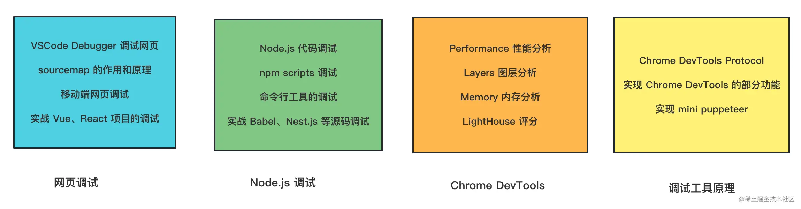
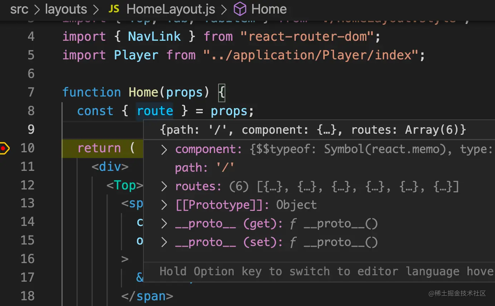
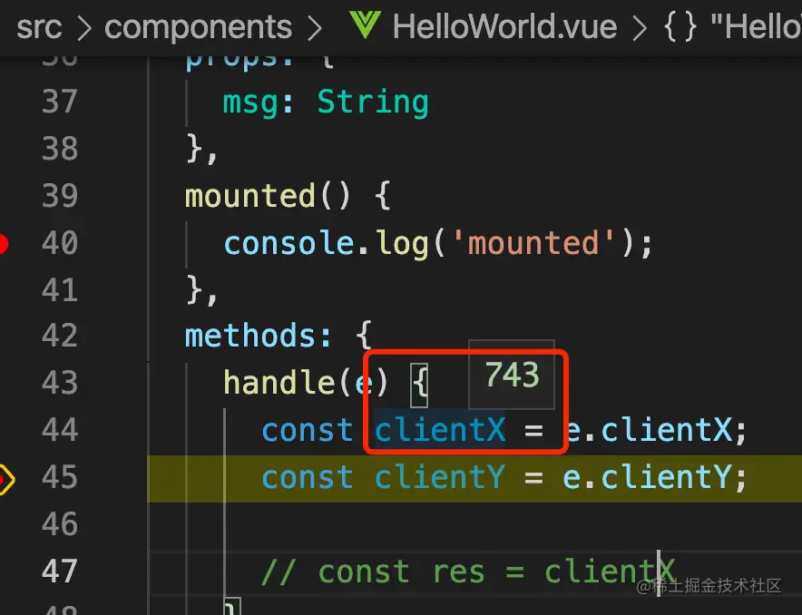
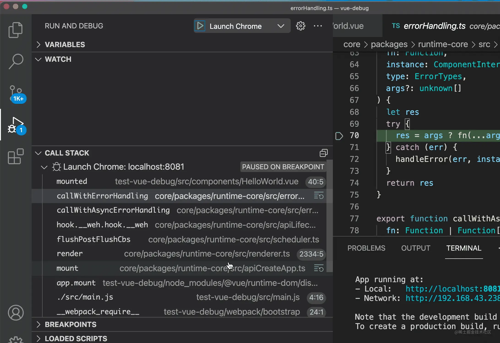
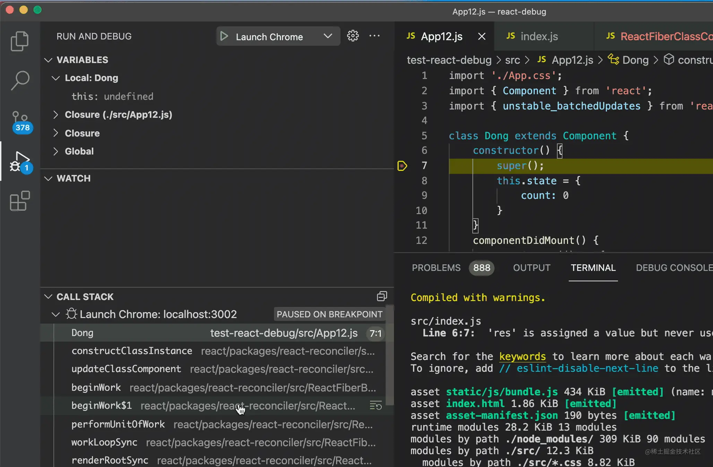
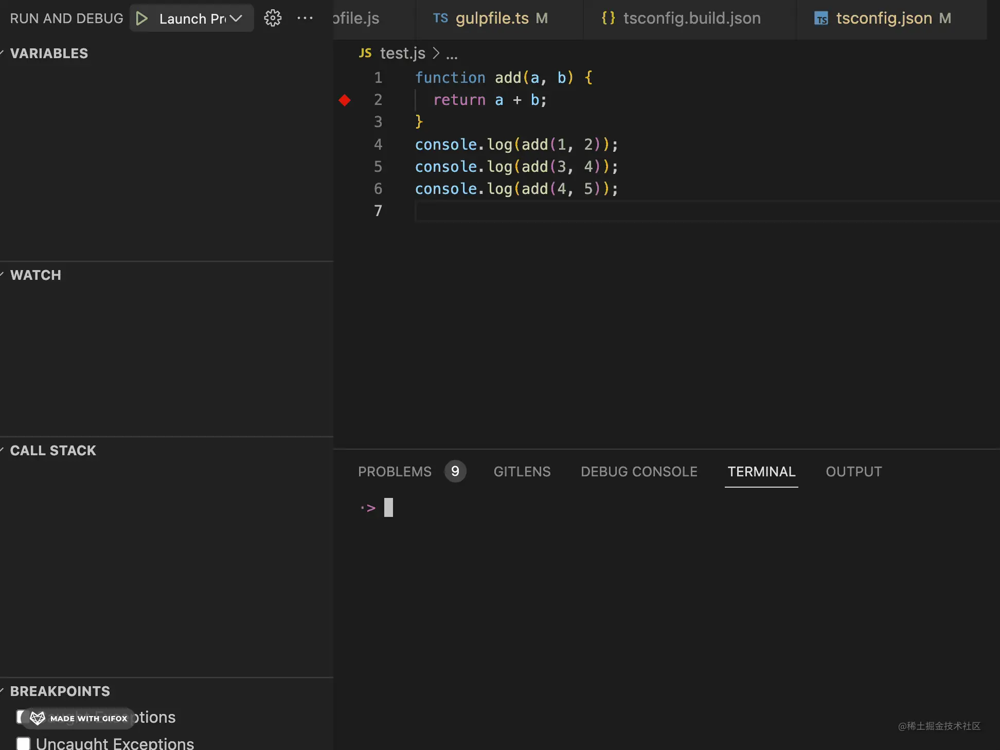
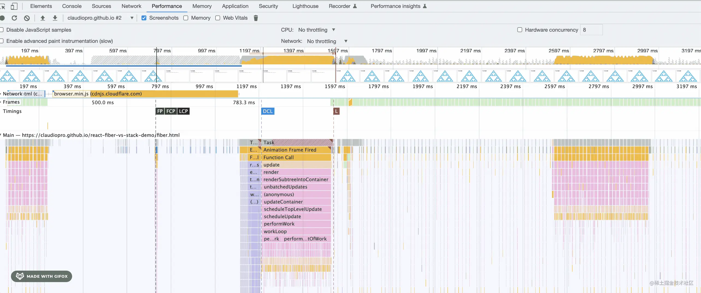

# 1.如何阅读本小册？

众所周知，阅读源码是前端进阶的一种方式，但很多同学不会使用调试工具，不知道该怎么高效的阅读源码。市面上也没有课程专门讲调试的，而这门课程就是弥补这个领域的空白。

我们会学习网页、Node.js 的调试，还会学习调试工具的实现原理。

课程主要分为四部分内容：**用 VSCode Debugger 调试网页的 JS、用 VSCode Debugger 调试 Node.js、用 Chrome DevTools 调试网页、调试工具的原理。**

首先，我们会学习如何用 VSCode Debugger 调试网页，以 React 项目为例，然后我们会过一遍 VSCode Chrome Debugger 的配置，之后再调试下 Vue 项目。

这个过程中会用到 sourcemap，所以接下来会讲 sourcemap 的原理和作用，webpack 的 sourcemap 配置，然后再用这些知识来调试 React、Vue 源码。

调试完 Vue、React 项目和 Vue、React 源码之后，相信任何网页的 JS 你都会调试了。

因为调试配置创建比较麻烦，接下来会讲用 VSCode Snippets 简化它的创建。

之后会进入 Node.js 的调试部分，我们会学习如何用 VSCode Debugger 调试 Node.js 代码，如何调试 npm scripts，然后过一遍 VSCode Node Debugger 的各种配置。

接下来会讲命令行工具的两种调试方式，然后再调试下 ESLint、Babel、TypeScript 的源码，Nest.js 源码。

经过这些实战案例之后，相信你对调试各种 Node.js 的代码也得心应手了。

然后我们再来学习 Chrome DevTools：

我们会学习 Chrome DevTools 的 7 种打断点的方式、用 Performance 工具分析和优化网页性能、用 LightHouse 工具检测页面性能、用 Memory 工具分析内存问题、用 Layers 工具进行图层分析等。

相信学完这些之后，你会对每天都用的 Chrome DevTools 有一个更全面和深入的掌握。

之后会讲如何调试移动端网页，包括安卓和 ios 的网页。因为网页调试离不开代理，所以我们还会学习 Charles 的使用。

学完这些之后，相信你对网页、Node.js 的调试都已经挺熟悉的了。

接下来我们深入下调试工具的原理，我们讲解 Chrome DevTools 的实现原理，包括 CDP 协议，puppeteer 也是基于这个实现的，我们会实现 mini puppeteer 来深入理解 CDP。

学完各种调试工具的实现原理之后，相信你用各种调试工具的时候都会更加得心应手，而且如果需要自研调试工具的话，你也会有思路。

到了这里，调试也算学的差不多了，最后会做一个总结，然后结束本门课程。

课程中涉及到 Vue、React、Nest.js、ESLint、TypeScript 等源码的调试，如果你对某些库的源码感兴趣，也可以评论区告诉我，我会把它的源码调试方式加到课程里。

希望这门课能帮助大家“通关” 各种调试工具，全面提升调试能力，各种源码的调试对你来说都不再是难题。

那么，当一个前端开发会了调试，可以有多爽呢？

别人开发 React 组件，想查看 props 的详情，会靠 console.log 和 props 类型定义。

你呢？靠调试。

别人开发 Vue 组件，用到了 event 的某个值，需要 console.log 打印下看看，然后再写代码。

你呢？靠调试。边调试边写代码。

别人用到了 node 的某个库，不知道有啥 api，要去查文档，或者靠库的类型定义。

你呢？靠调试。

别人想看 Vue、React 源码，调试的都是打包后的代码，比如 react-dom.development.js。

你呢？直接调试 Vue 和 React 最初的源码。

别人会用 console.log 打印日志，调试完要删掉。

你呢？用 Logpoint，加了日志的打印也不用改源码。

别人对 Event Loop的理解只停留在概念层面。

你呢？可以通过 Performance 分析真实的 Event Loop、网页运行的全流程。

更多会调试的好处，可以自行体会。
