# 13.如何调试 Node.js 代码

学会了网页里 JS 的调试，我们再来学下 Node.js 代码的调试。

我们准备一段 Node.js 的代码：

```javascript
const fs = require('fs/promises');

(async function() {
    const fileContent = await fs.readFile('./package.json', {
        encoding: 'utf-8'
    });
    
    await fs.writeFile('./package2.json', fileContent);
})();
```

就是简单的文件读写，先用 node index.js 跑一下：

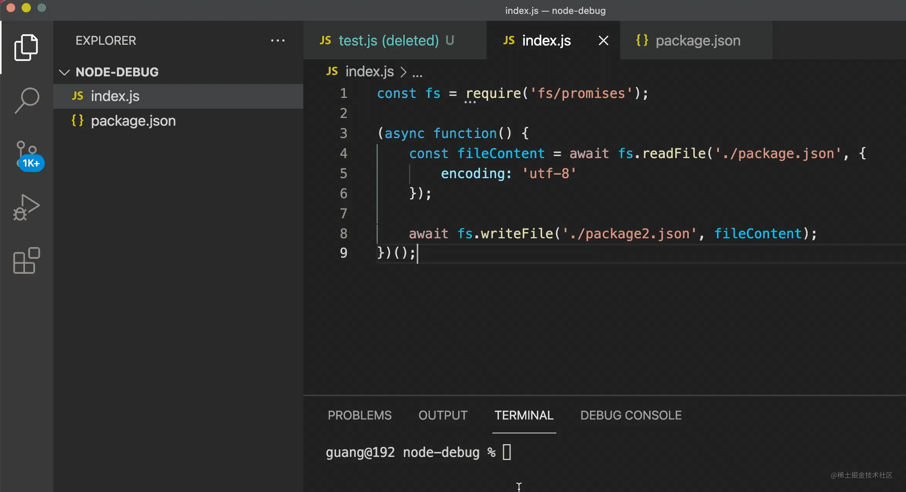

然后以调试模式启动，加个 --inspect-brk 参数：

```
node --inspect-brk ./index.js
```

--inspect 是以调试模式启动，--inspect-brk 是以调试模式启动并且在首行断住。

然后你就会发现它打印了 ws 的地址：

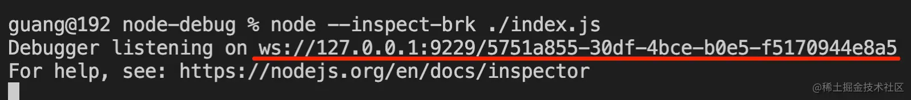

这就是调试的服务端。

接下来找个对接它的调试协议的客户端连上就行了。

Node.js 可以用 Chrome DevTools 来调试：

## 用 Chrome DevTools 调试 node 代码

浏览器打开 [chrome://inspect/#devices](chrome://inspect/#devices) ，下面列出的是所有可以调试的目标，也就是 ws 服务端：

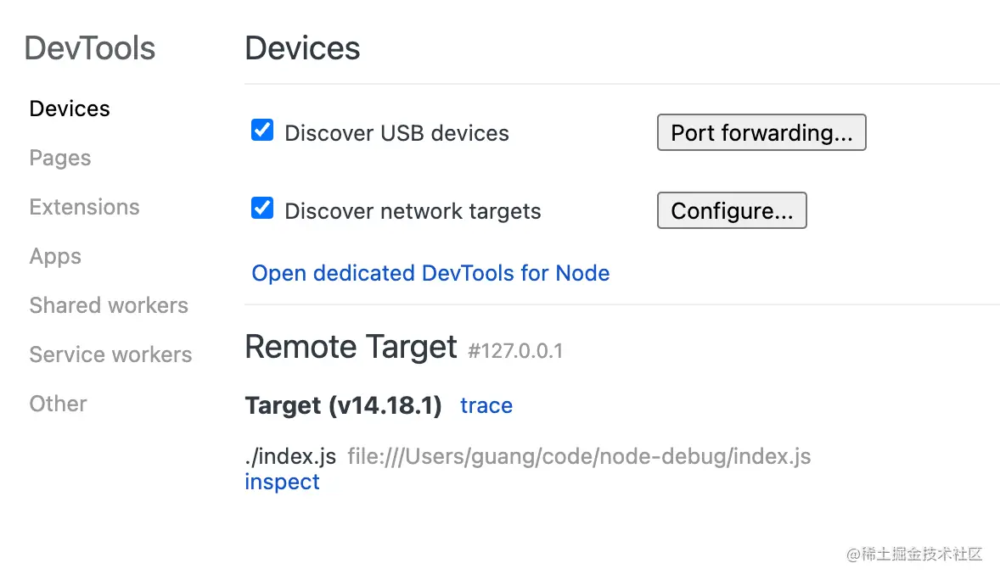

你会发现这里列出了我们启动的跑的那个 node 脚本。

这是因为我在网络端口里加上了 node 的 ws 调试服务的端口：

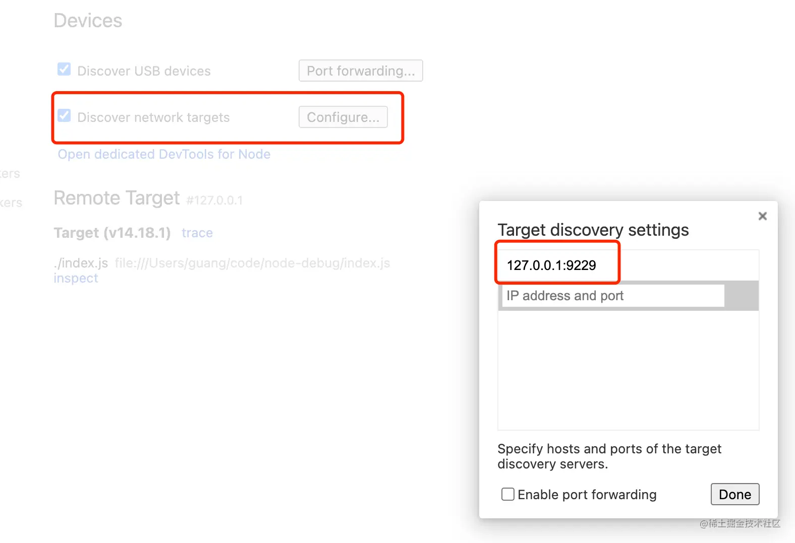

node 调试服务默认是跑在 9229 端口，但是也可以换：

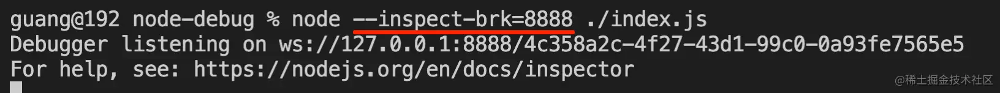

只要把它的端口加入到配置里就可以了：

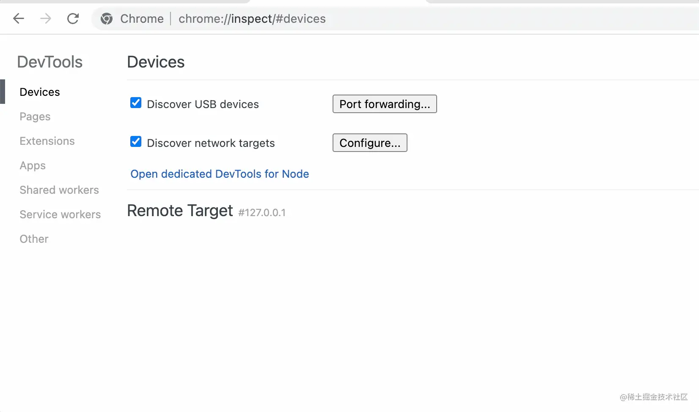

点击 inspect 就可以调试这个 node 脚本了：

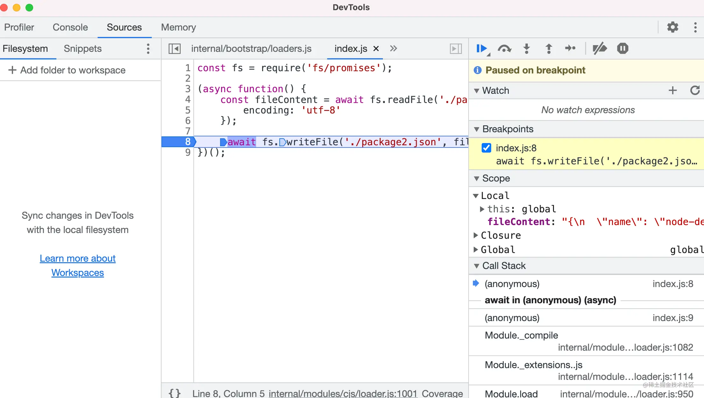

但是这样也是和调试网页一样的问题，在 Chrome DevTools 里调试，在 VSCode 里写代码，这俩是分离开的，切来切去也挺不方便的。

那 VSCode 能不能调试 node 代码呢？

明显是可以的：

## 用 VSCode Debugger 调试 node 代码

我们创建 .vscode/launch.json 的调试配置文件：

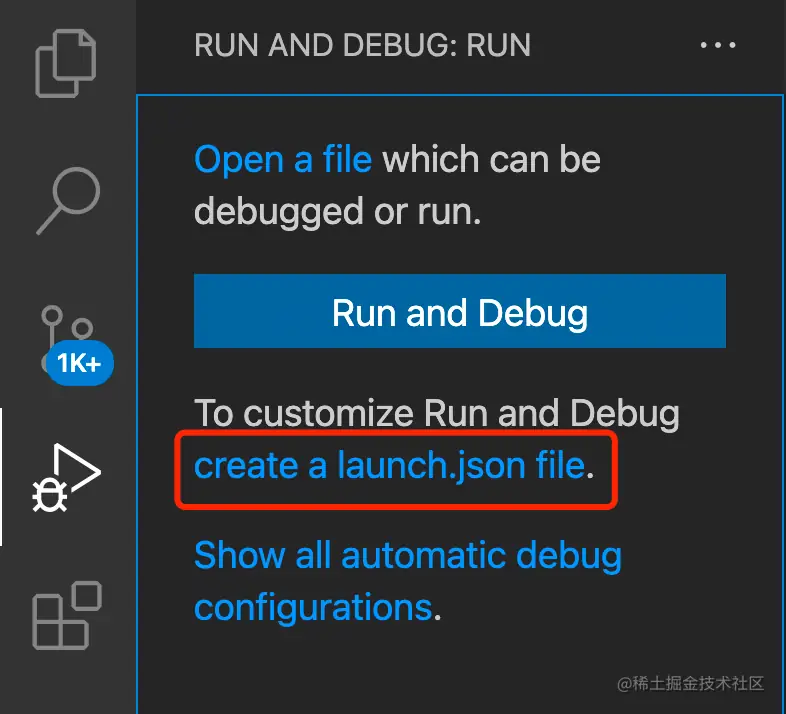

添加一个 node 类型的 attach 的调试配置：

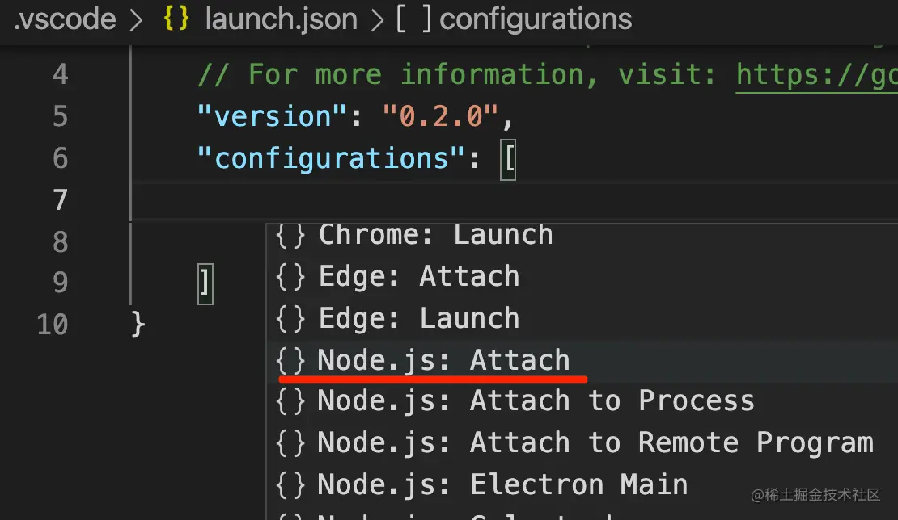

端口改成 ws 服务启动的端口 8888:

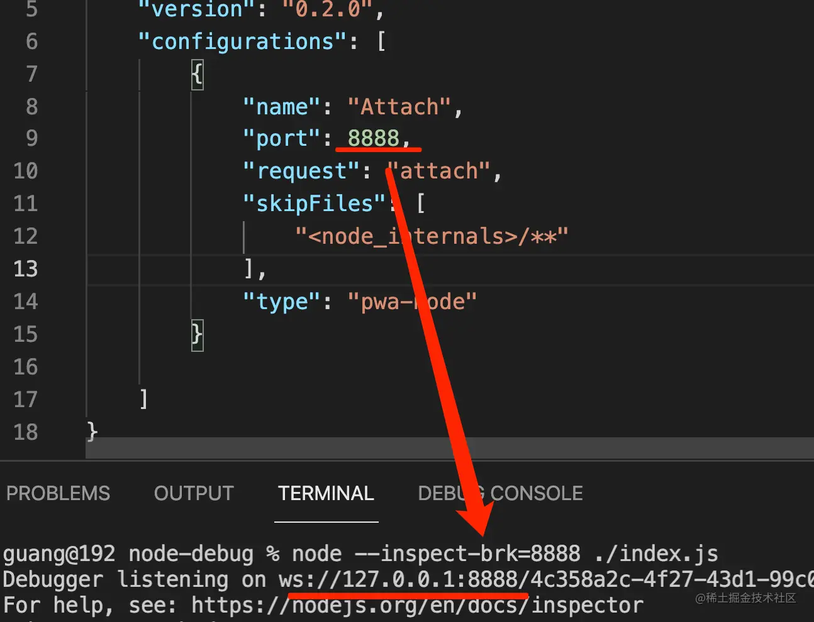

然后点击 debug 启动：

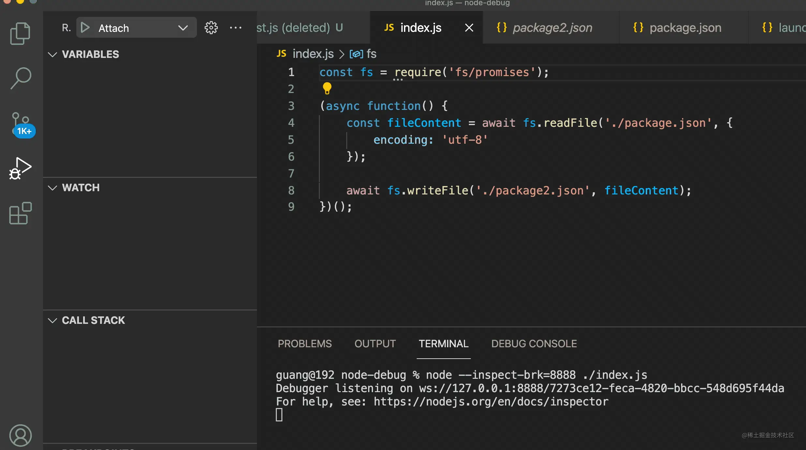

VSCode Debugger 就会连接上 8888 的调试端口开始调试，可以边调试边修改代码。

能调试还能修改代码，这是比 Chrome DevTools 更好用的地方，因此我们一般使用 VSCode Debugger 来调试 Node.js 代码的。

有的同学可能会说，每次都要先 node --inspect xxx.js 把调试服务跑起来，然后再手动 attach，比较麻烦。能不能自动做呢？

当然是可以的：

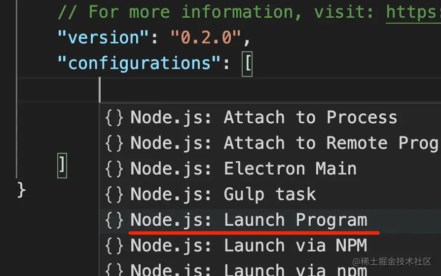

创建调试配置的时候选择 launch program，指定 program 的路径：

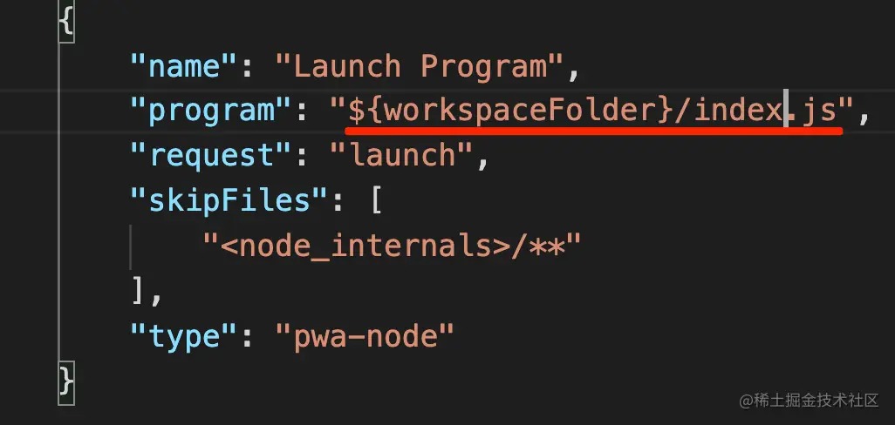

VSCode Debugger 就会自动以调试模式跑这个 node 脚本，并且自动 attach 上：

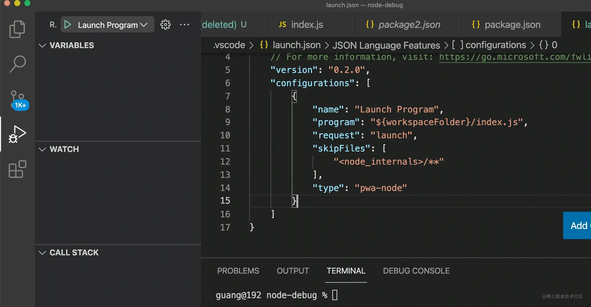

这样就方便多了。

如果你也想首行断住，可以加一个 stopOnEntry 的配置：

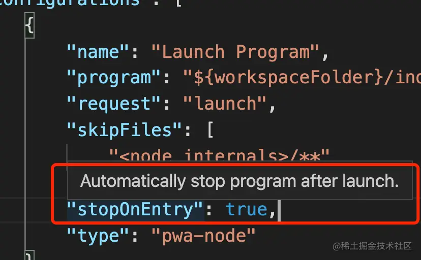

和 node --inspect-brk 启动一样的效果：

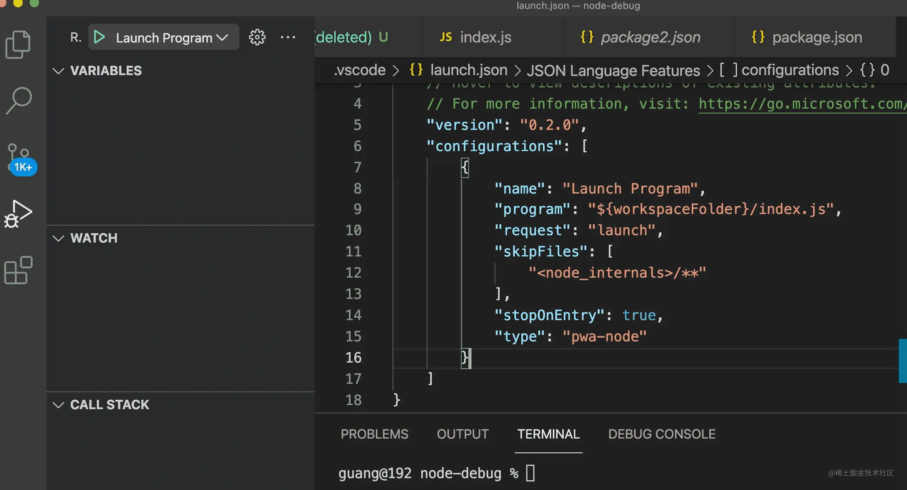

回过头来我们看一下，为什么 VSCode Debugger 和 Chrome DevTools 都可以调试 node 代码呢？

这是因为都对接了 node 的调试协议，只是实现了各自的 UI：

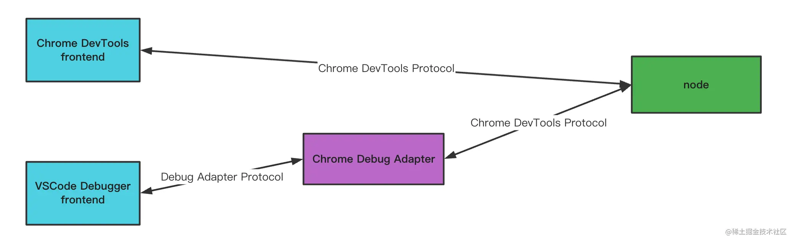

有的同学可能会问，为啥图上画的是 Chrome Devtools Protocol 呢？node 也是用 CDP 作为调试协议么？

确实，node 也是基于 CDP 调试的。

至于为什么要用 CDP 来调试 node 代码，这就涉及到一段历史了：

## node debugger 的历史

我们知道 Node.js 是基于 V8 的，V8 本身有调试协议 V8 Debug Protocol，所以 Node.js 最早的调试协议也就是 V8 Debug Protocol。

当时调试是这样的：

通过 node debug 来跑 js 文件，会在首行断住：

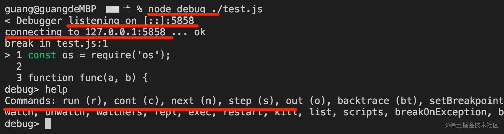

然后可以通过 run、cont、next、step 等命令来实现单步调试，通过 backtrace 打印调用栈，通过 setBreakPoint 等设置断点：

比如用 setBreakPoint（sb）命令在第四行打个断点：

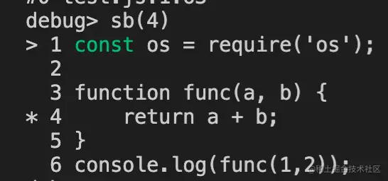

然后 cont(c) 命令继续执行，backtrace(bt) 打印调用栈：

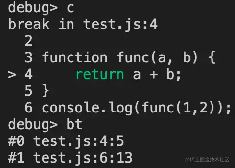

虽然该有的调试功能都有，但是这样调试还是比较费劲的。

怎么能不用命令行调试，而是用 UI 来调试呢？

当时 Node 就瞄准了 Chrome DevTools，它的调试 UI 就很不错。

但是 Chrome DevTools 的调试协议是 Chrome DevTools Protocol，和 V8 Debug Protocol 还是有些差距的，怎么能用上 Chrome DevTools 的调试工具来调试 Node 呢？

其实还挺容易想到的，就是加一个中间的服务来做转换：

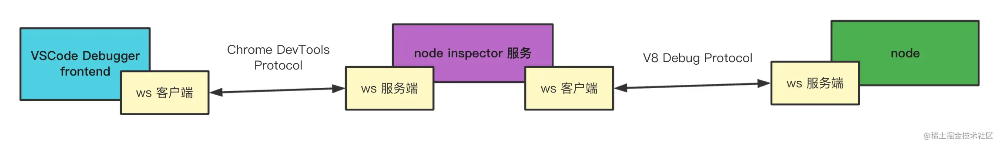

这个服务是 node-inspector 这个包提供的。

所以当时 node debug 服务跑起来之后，还要要再跑一个 node-inspector 服务，这样才能用 chrome devtools 来调试 Node.js 代码。

后来维护 Node.js 的那些人觉得这样也太麻烦了，要不让 Node.js 提供的调试协议就直接就是兼容 Chrome Devtools Protocol 的吧。

当时就有了这样一个 pr，把 v8 inspector 集成到 Node.js 中：

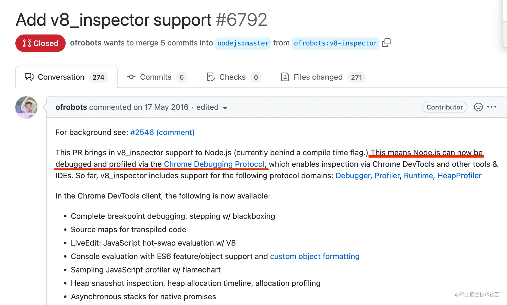

这个 v8 inspector 就是从 chrome 的内核 blink 里剥离出来的让 v8 支持 chrome devtools protocol 的部分。

很明显这需要 v8 团队的配合，所以说 Node.js 的发展还是很依赖 v8 团队的支持的。

之后 Node.js 就在 v6.3 中加入了这个功能：

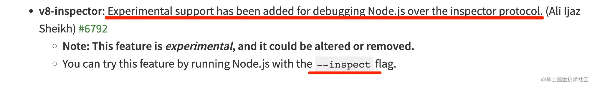

并且在成熟之后去掉了对 v8 debug protocol 的支持，也就是废弃了 node debug 命令，改为了 node inspect。

启动 ws 调试服务的方式就是 node --inspect 或者 node --inspect-brk。

当然，之前作为两个协议的中转的服务 node-inspector 也就退出了历史舞台。

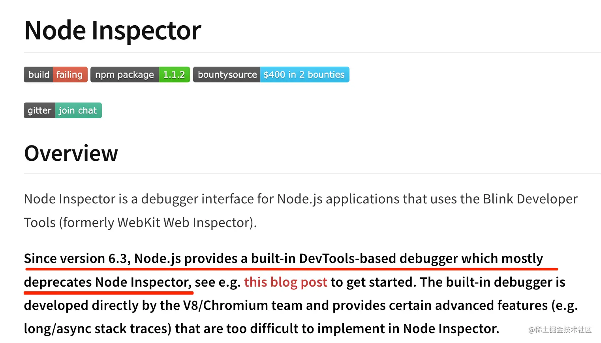

所以今天，我们可以轻易的用 Chrome DevTools 来调试 Node.js 代码。

当然，这里只是说 Chrome DevTools 调试 Node.js，在 VSCode 里调试 Node.js 的话还要做一些额外的处理：

调试的原理我们已经知道了，就是 ws 客户端和服务器的通信，然后基于调试协议来完成不同的功能。Node.js 是这样，其他语言也是这样。

VSCode 是一个通用的编辑器，是要支持多种语言的，也就是它的调试 UI 要支持多种调试协议。

要同一个调试工具同时支持不同的协议有点不太现实，那怎么办呢？

可以加一个中间层，VSCode 的调试 UI 只要支持这个中间的调试协议就可以了，其余的调试协议适配到这个调试协议上来：

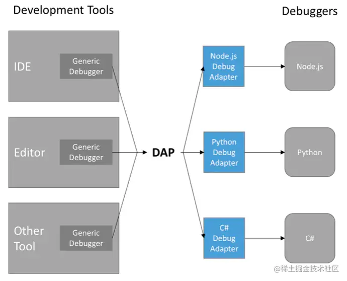

这就是 DAP 协议，debugger adpater protocol。

Node.js 在把调试工具的协议换成 Chrome Devtools Protocol 之后，只要实现个 DAP 的 adapter 就可以对接到 VSCode 的调试工具了。

这样我们就可以在 VSCode 里调试 Node.js 了。

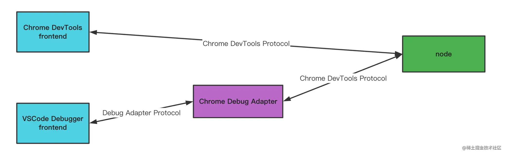

## 总结

我们分别用 Chrome DevTools 和 VSCode Debugger 调试了下 node 代码：

用 node --inspect 或 node --inspect-brk 以调试模式跑 node 脚本，然后用调试的 UI 连接上这个调试服务就可以进行调试了。

在 VSCode Debugger 里调试 node 代码还可以边调试边修改，更方便。

除了自己启动 node 调试服务，然后手动 attach 外，还可以选择 launch 类型的调试配置，自动进行这个过程。

node 调试的协议也是用的 Chrome DevTools Protocol，就是为了能够复用 Chrome DevTools 的 UI 的，中间还有一段历史是用 node inspector 做中转。

学会了调试 node 代码，各种命令行工具、node 服务，我们就都可以调试了。


