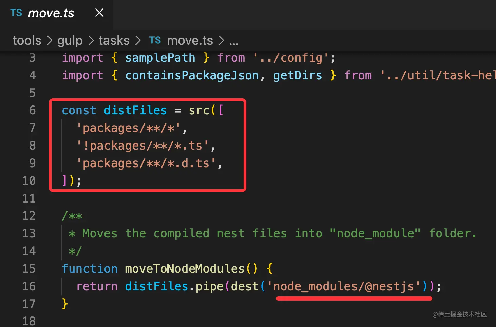
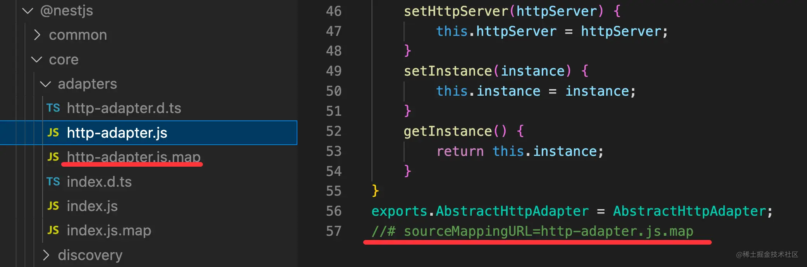

# 16.实战案例：调试 Nest.js 项目和源码

Nest.js 是当下最流行的 Node.js 服务端框架，它建立在 Express 之上，实现了 IOC 的架构模式，并且对很多方案都有集成，比如 websocket、graphql 等。

当然，这节不是讲 Nest.js 的原理，而是讲如何调试 Nest.js 的项目，如何调试 Nest.js 的源码。

## 调试 Nest.js 项目

Nest.js 提供了快速创建项目的命令行工具 @nest/cli，首先全局安装它：

```
npm i -g @nestjs/cli
```

然后用 nest new nest-test 快速创建一个 nest 的项目。


进入项目目录，执行 npm run start 就会启动服务：


然后浏览器访问 http://localhost:3000 ，可以看到 Hello World，说明服务启动成功了。


然后我们创建一个 node 调试配置，指定 npm 为 runtime：


这里 console 要设置为 integratedTerminal，这样日志会输出在 terminal，就和我们手动执行 npm run start 是一样的。

不然，日志会输出在 debug console。颜色啥的都不一样：


点击 Debug 启动：


注意，用 deubg 方式跑之前要把之前起的服务关掉，不然端口会被占用。

或者也可以用这样的方式杀死占用哪个端口的进程：


在 controller 打个断点：


然后浏览器重新访问 http://localhost:3000

这时候代码就会在断点处断住：


这样就可以愉快的调试 Nest.js 项目了。

接下来我们再来调试下 Nest.js 源码。

## 调试 Nest.js 源码

其实调用栈里，我们的代码之前的部分，就是 Nest.js 框架的代码：


但是这明显是编译后的代码：


而我们是想调试 Nest 的 ts 源码的，这就需要用到 sourcemap 了。

从 npm registry 下载的包是没有 sourcemap 的代码，想要 sourcemap，需要自己 build 源码。

把 Nest 项目下载下来，并安装依赖（加个 --depth=1 是下载单 commit，--single-branch 是下载单个分支，这样速度会快很多）：

```
git clone --depth=1 --single-branch https://github.com/nestjs/nest
```
执行 npm run build，它会用 tsc 编译代码：


并且在 build 命令执行完之后会自动执行 postbuild：


它做的事情就是把编译后的文件移动到 node_modules/@nestjs 目录下：



执行 npm run build，你就会在 node_modules/@nestjs 下看到这样的代码：


只包含了 js 和 ts，没有 sourcemap：


生成 sourcemap 需要改下 tsc 编译配置，也就是 packages/tsconfig.build.json 文件：


设置 sourceMap 为 true 也就是生成 sourcemap，但默认的 sourcemap 里不包含内联的源码，也就是 sourcesContent 部分，需要设置 inlineSources 来包含。

再次执行 npm run build，就会生成带有 sourcemap 的代码：



并且 sourcemap 是内联了源码的：


然后我们跑一下 Nest 的项目，直接跑 samples 目录下的项目即可，这是 Nest 内置的一些案例项目：


创建这样一个调试配置：


```json
{
    "name": "Launch via NPM",
    "request": "launch",
    "runtimeArgs": [
        "run-script",
        "start"
    ],
    "runtimeExecutable": "npm",
    "console": "integratedTerminal",
    "cwd": "${workspaceFolder}/sample/01-cats-app/",
    "skipFiles": [
        "<node_internals>/**"
    ],
    "type": "node"
}
```
主要是要指定 cwd 为那个项目的目录，也就是在那个目录下执行 npm run start。

我们在 cats 的 controller 里打个断点：


然后浏览器访问 http://localhost:3000/cats ，代码就会在断点处断住：


但是现在调用栈中的依然不是源码：


这是为什么呢？

这是因为这样一个调试配置 resolveSourceMapLocations：


它的默认值是排除掉了 node_modules 目录的，也就是不会查找 node_modules 下的 sourcemap。

去掉那条配置：


再跑一下：


这时候 sourcemap 就生效了，可以看到调用栈中显示的就是 Nest 的 ts 源码。

这样就达到了调试 Nest 源码的目的。

只不过现在 nest 的 ts 源码是只读的：


这是因为 sourcemap 到的路径不对，我们可以再去改下配置，修改生成的 sourcemap 的路径：


那为什么 sourcemap 到的路径不对呢？

看下 map 文件：


sourcemap 到的路径是 sourceRoot + sources 文件名。

我们需要设置下 sourcesRoot。

nest 的这几个目录下都有单独的 tsconfig.build.json，需要分别设置：


比如我设置了 core 包下的 tsconfig.build.json 的 sourceRoot 为 core 包的绝对路径：


再次 build，生成的 map 文件就是这样的：


重新跑下调试：


现在的路径就对了，内容不再只读，而且点击可以直接跳到源码文件：


至此，我们就可以愉快的调试 Nest.js 源码了。

## 总结

Nest.js 是流行的 node 服务端框架，这节我们实战了下 Nest 项目的调试和源码的调试。

调试 Nest.js 项目就是用 npm 的方式启动调试配置，指定下 console 为 terminal 就可以了。

调试 Nest.js 源码的话，需要把 Nest 源码下载下来，build 出一份带有 sourcemap 版本的代码，同时还要设置 resolveSourcemapLocations 去掉排除 node_modules 的配置，然后再调试，就可以直接调试 Nest 的 ts 源码了。
