# 16.调试代码会遇到的 9 种 JS 作用域

作用域想必大家都知道，就是变量生效的范围，比如函数就会生成一个作用域，声明的变量只在函数内生效。

调试的时候，可以看到作用域的信息，这样的作用域一共有 9 种。

下面我们就一起过一遍这 9 种作用域吧：

## Global 作用域

通过 var 声明一个变量，打个断点，可以看到 Scope 里有 Global 类型的作用域，也就是全局作用域，里面保存了变量 a：

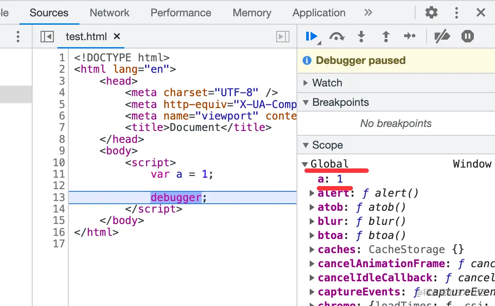

在浏览器环境下，可以通过 a 访问全局变量，也可以通过 window.a 访问。

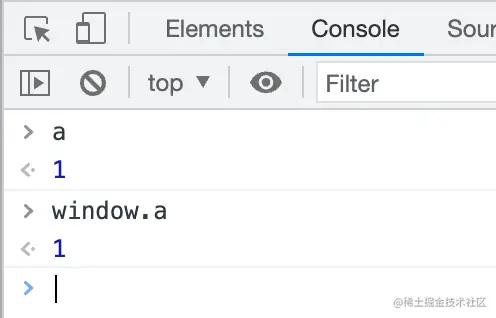

## Local 作用域

声明个函数，在函数内声明一个变量，调用这个函数的时候，可以看到 Scope 里有 Local 类型的作用域，也就是本地作用域，里面保存了变量 b：

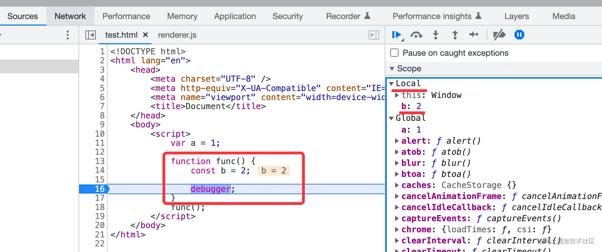

这两种作用域都很常见，没啥好说的。

## Block 作用域

es6 加入了块语句，它也同样会生成作用域：

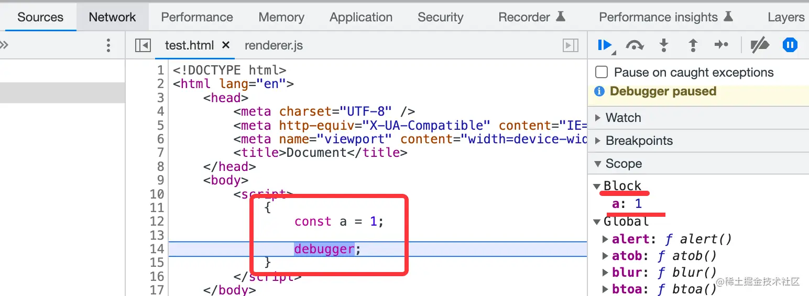

如图，会把里面声明的变量 a 放到 Block 作用域内，也就是块级作用域。

if、while、for 等语句都会生成 Block 作用域：

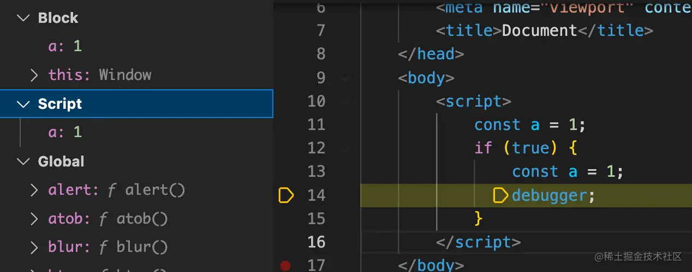

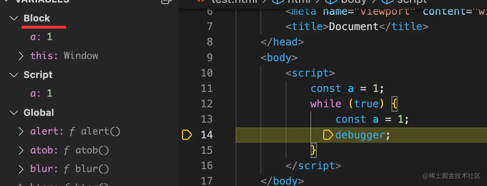

前几种作用域很常规，但下面这种作用域绝大部分前端就不知道了：

## Script 作用域

这段代码大家觉得会生成什么作用域：

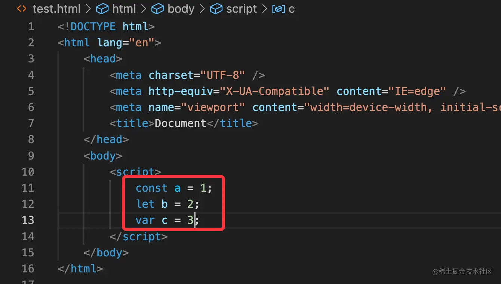

很多同学都会说，不是全局作用域么？

那这个现象你能解释么：

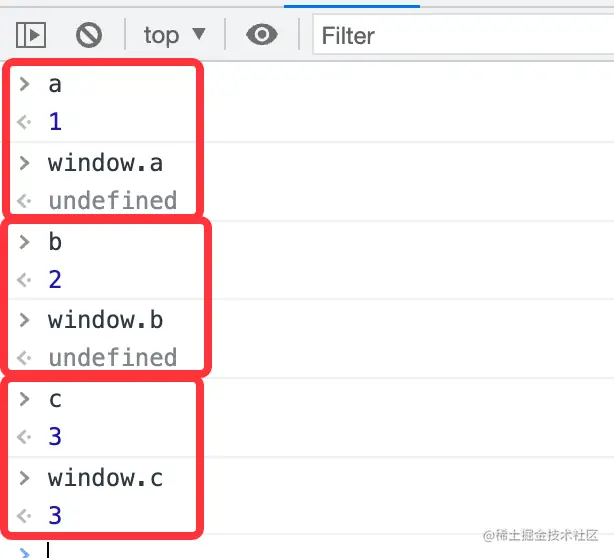

a、b、c 如果都是全局变量，那在浏览器里就可以通过 window.xx 来访问，但结果 window.a 和 window.b 都是 undefined，而直接访问 a、b 能拿到值。

看下现在的作用域就知道了：

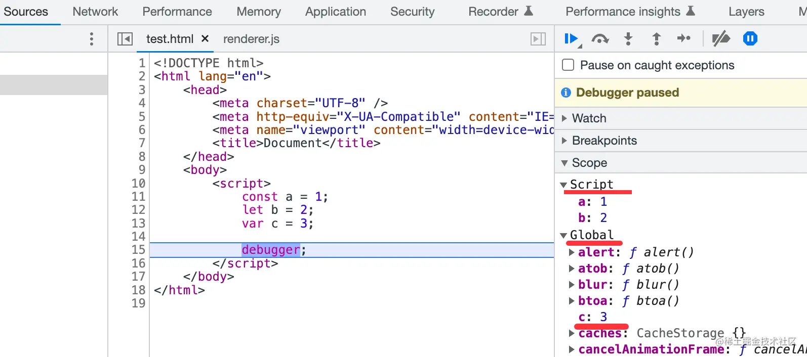

你会发现 let、const 声明的全局变量被放到了 script 作用域，而 var 声明的变量被放到了 global 作用域。

**这就是浏览器环境下用 let const 声明全局变量时的特殊作用域，script 作用域。可以直接访问这个全局变量，但是却不能通过 window.xx 访问。**

所以你再看到这样的代码，就不奇怪了：

```javascript
window.xxx = xxx；
```

这个 xxx 肯定是通过 let、const 声明的全局变量，需要手动挂到 window 上。

那上面这个 script 作用域在 node 环境里有么？

我们用 node 调试下：

## 模块作用域

同样的代码，在 node 环境下就没有了 Script 作用域，但是多了一个 Local 作用域：

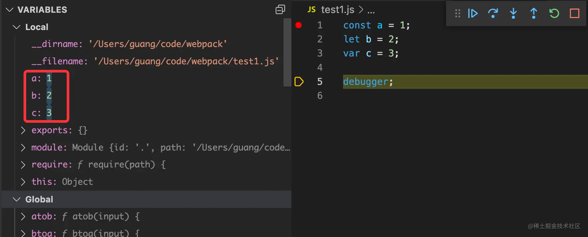

这个 Local 作用域还有 module、exports、require 等变量，这个叫做模块作用域。
 
这个作用域有些特殊，其实它也是函数作用域。为什么呢？后面会有解释。

说到特殊的作用域，其实还有一些：
## Catch Block 作用域

Catch 语句也会生成一个特殊的作用域，Catch Block 作用域，特点是能访问错误对象：

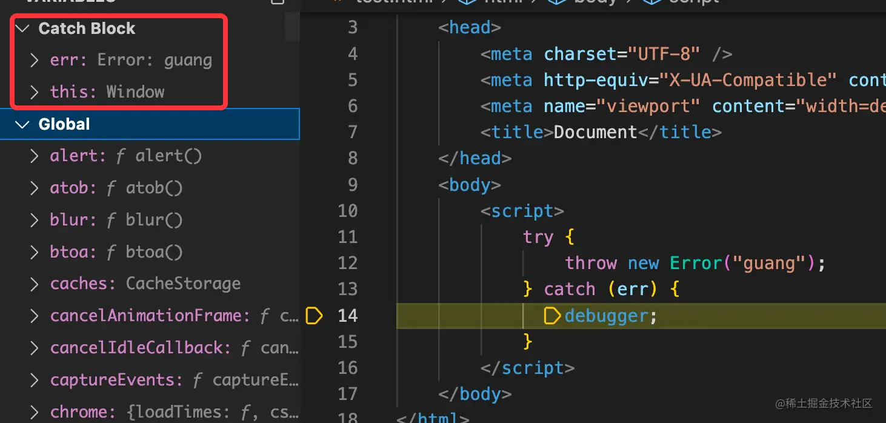

在 node 里也是一样，只不过还有一层模块作用域：

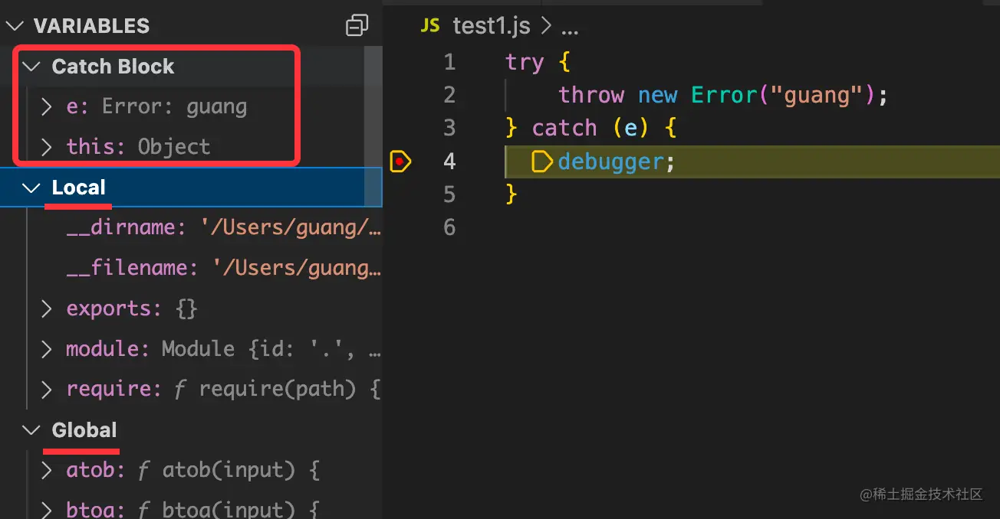

有同学会问，那 finally 语句呢？

这个就没啥特殊的了，就是 Block 作用域：

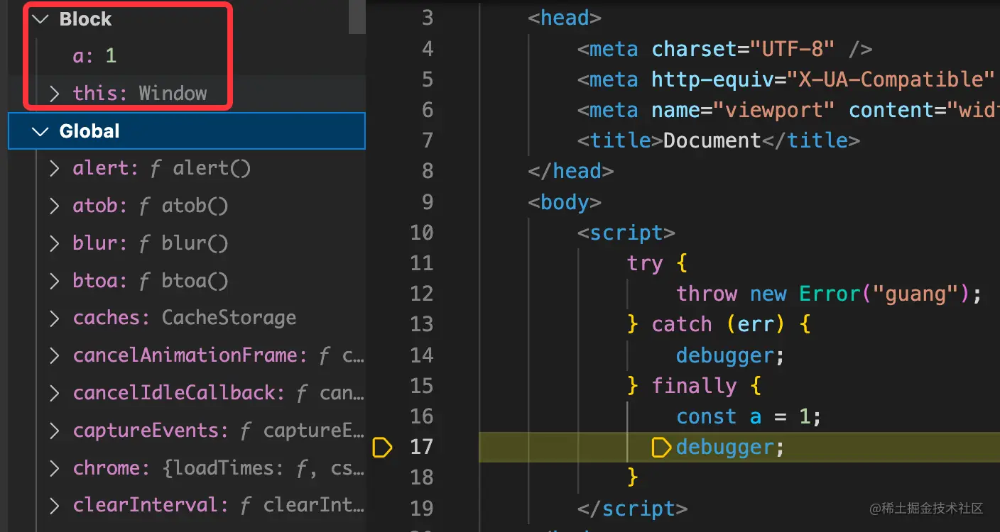

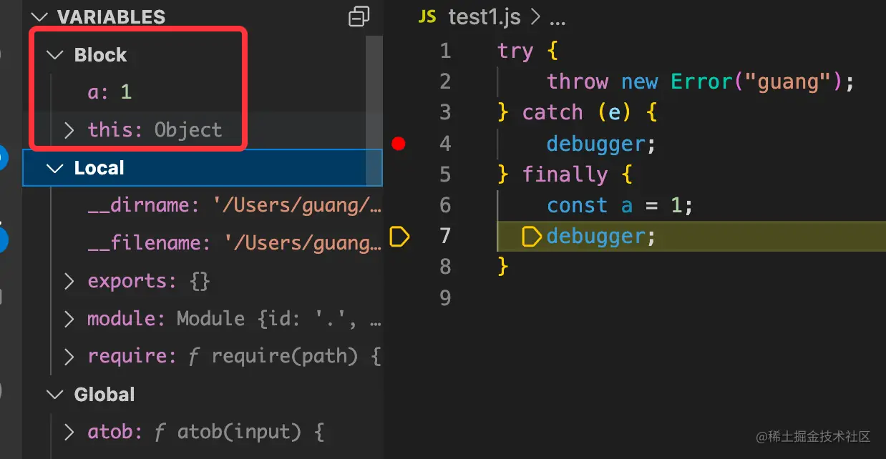

类似的还有 With Block：

## With Block 作用域

大家猜下这个 with 语句里的作用域是是啥：

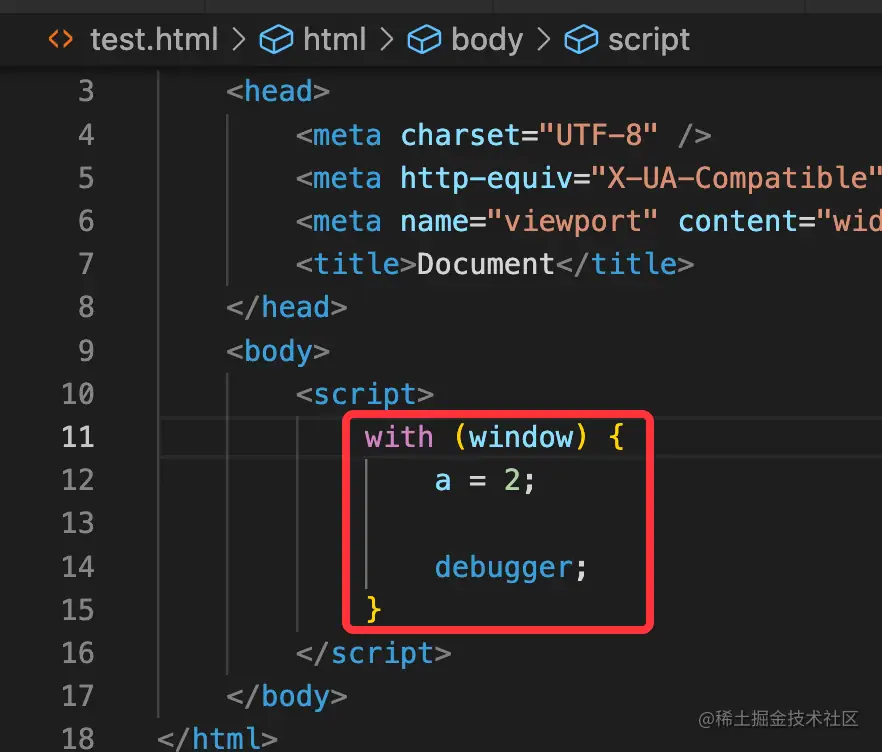

想必你猜到了，with 语句里的作用域就是这个对象：

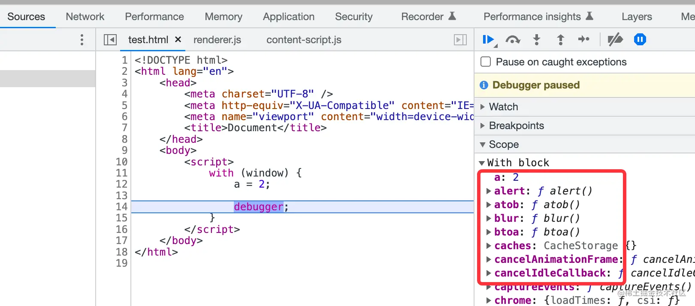

换成普通的对象更明显一些：

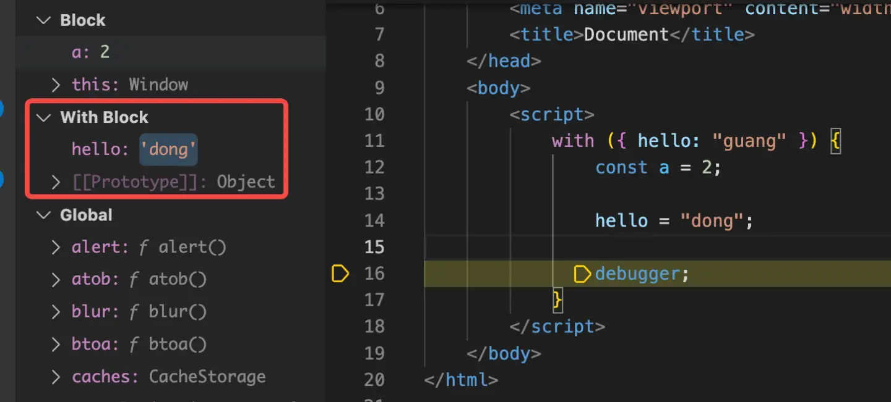

可以直接访问 witch 对象的值，就是因为形成了一个 With Block 作用域，当然，里面再声明的变量还是在 Block 作用域里。

## Closure 作用域

闭包是 JS 的常见概念，它是一个函数返回另一个函数的形式，返回的函数引用了外层函数的变量，就会以闭包的形式保存下来。

比如这样：

```javascript
function fun() {
    const a = 1;
    const b = 2;
    return function () {
        const c = 2;

        console.log(a, c);
        debugger;
    };
}

const f = fun();
f();
```

那闭包的变量怎么保存的呢？

通过 node 可以看到：

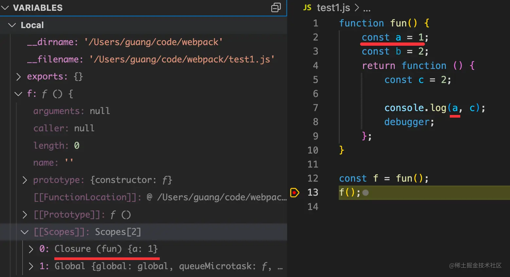

通过 Closure 作用域保存了变量 a 的值，这个 Closure 作用域就是闭包的核心。

那为啥只保存了 a 没保存 b、c 呢？

c 是返回的函数的作用域里的，不是外部作用域，而 b 则是没用到，所以 Closure 作用域里只保存了 a。

然后执行的时候就会恢复这个 Closure 作用域：

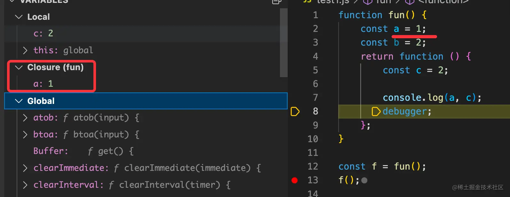

这样函数需要的外部变量都在 Closure 作用域里，啥也没丢，可以正常执行。

是不是很巧妙！

这就是闭包的核心。

当然，Closure 作用域也可以多层，比如这样：

```javascript
function fun() {
    const a = 1;
    const b = 2;
    return function () {
        const c = 2;
        const d = 4;

        return function () {
            const e = 5;

            console.log(a, c, e);
        };
    };
}

const f = fun()();
f();
```
用到的外部变量分别在两个作用域里，那就会生成两个 Closure 作用域：

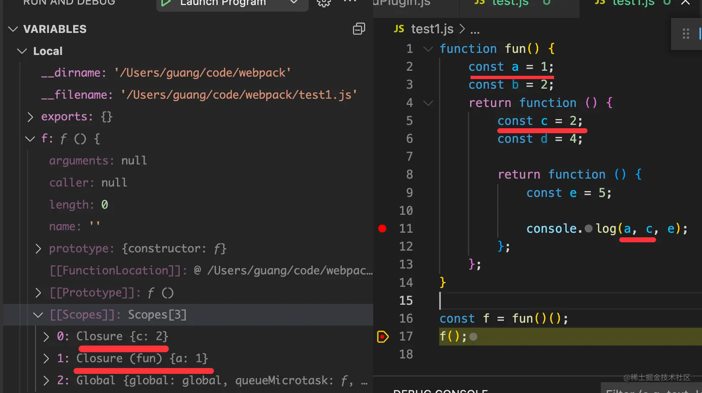

只留下用到的作用域的变量 a、c。

执行的时候就会恢复这两层闭包作用域：

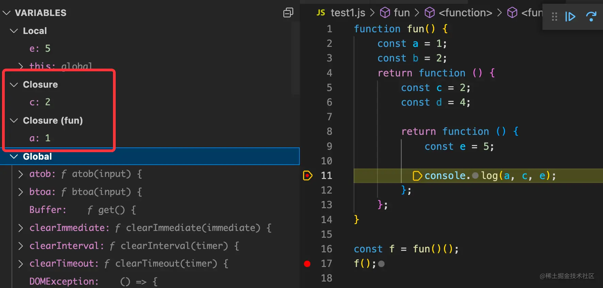

这样函数需要的外部环境一点都不少。

理解了 Closure 作用域，就真正理解了闭包。

闭包里还有一种特殊情况，就是 eval：

上面的代码如果我改动一下，把打印语句变成 eval，会发生什么呢？

```javascript
function fun() {
    const a = 1;
    const b = 2;
    return function () {
        const c = 2;
        const d = 4;

        return function () {
            const e = 5;

            eval("console.log(a, c, e);");
        };
    };
}

const f = fun()();
f();
```

有的同学会说，这不是一样么，都会形成闭包。

没错，都会形成闭包，但是保存的变量不一样了：

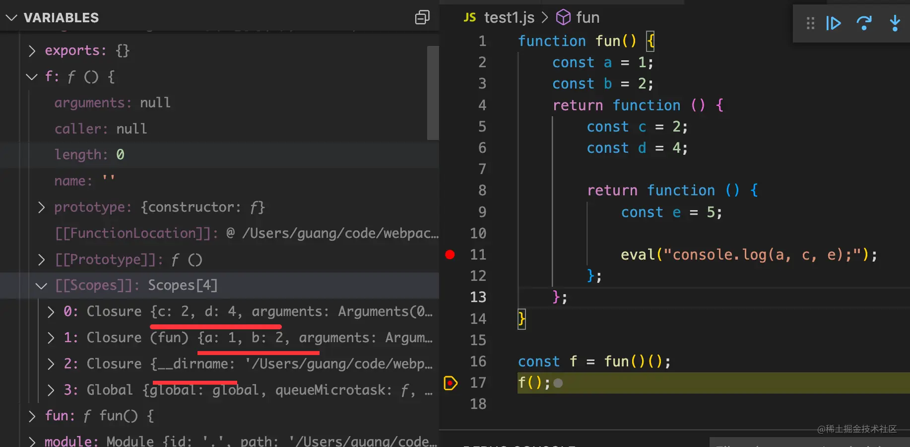

你会发现它把所有外部的作用域的变量都保存到了 Closure 作用域，包括模块作用域的变量。

为什么呢？

因为它根本不会去分析字符串呀，也没法分析，万一你这段 JS 是动态从服务端获取再 eval 的呢？

没法分析！

没法分析怎么保证代码执行不出错呢？

全部保存不就行了？

所以当返回的函数有 eval 的时候，JS 引擎就会形成特别大的 Closure，会把所有的变量都放到里面。

这样再执行 eval 的时候就不会出错了：

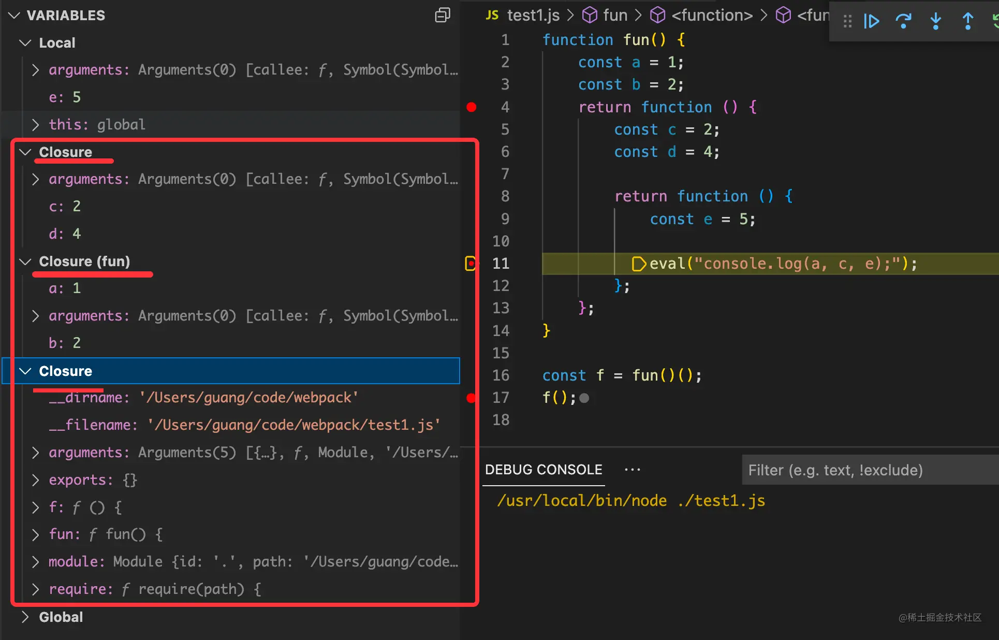

所有的变量都给你了，怎么可能出错呢？

但是这样明显性能不好，会占用更多的内存，所以闭包里尽量不要用 eval。

前面说模块作用域是特殊的函数作用域，为什么这么说呢？

这就与 node 模块的执行机制有关系了。

比如这样一段代码：

```javascript
function func() {
    require;
    debugger;
}
func();
```
执行后发现形成了闭包：

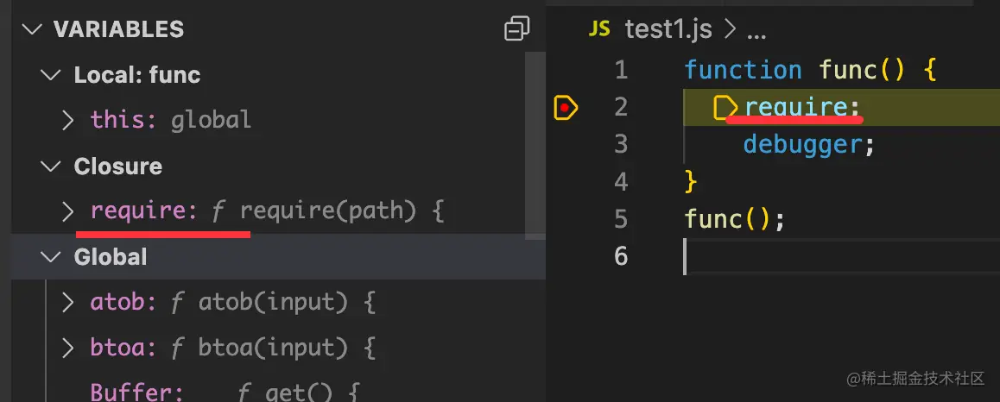

而如果不访问模块作用域的变量，就没有这一层了：

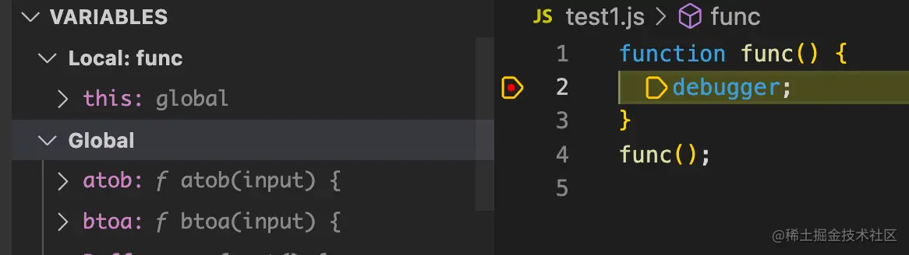

我这明明没有闭包的代码呀！

这就与 node 模块的执行机制有关系了：

**node 会把模块变为一个函数，它有 exports、require、module、__dirname、__filename 这五个参数，然后传入这五个参数来执行：**

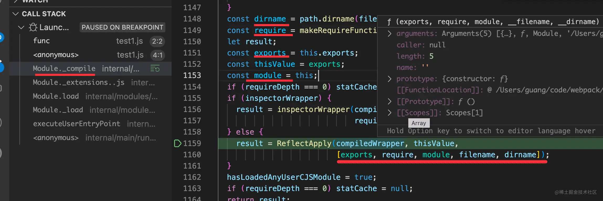

所以**模块作用域就是个函数作用域而已！**

模块里的函数引用模块作用域的变量，再执行，自然就形成了闭包。

## Module 作用域

前面那个 commonjs 的模块作用域本质上还是函数作用域。

而直接跑 es module 代码是能看到真正的模块作用域的：

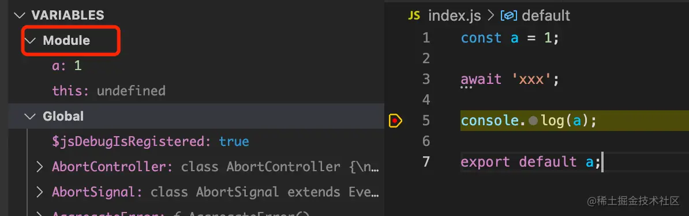

但这需要在 package.json 里指定 type 为 module

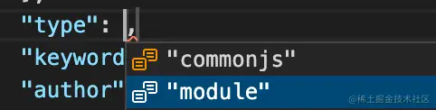

就是指定所有的模块都是 es module 模块：

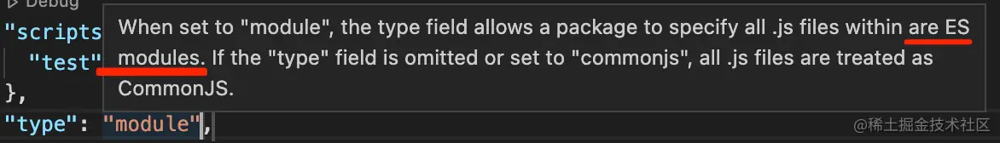

这样就可以用 import、export 语法了，也可以使用顶层 await 等特性。

这才是真正的模块作用域。

## Eval 作用域

最后一种特殊的作用域就是 eval 作用域了。

比如这样一段代码：

```javascript
eval(`
    const a = 1;
    const b = 2;
    const c = 3;

    console.log(a,b,c);
    debugger;
`);
```

执行之后是这样的：

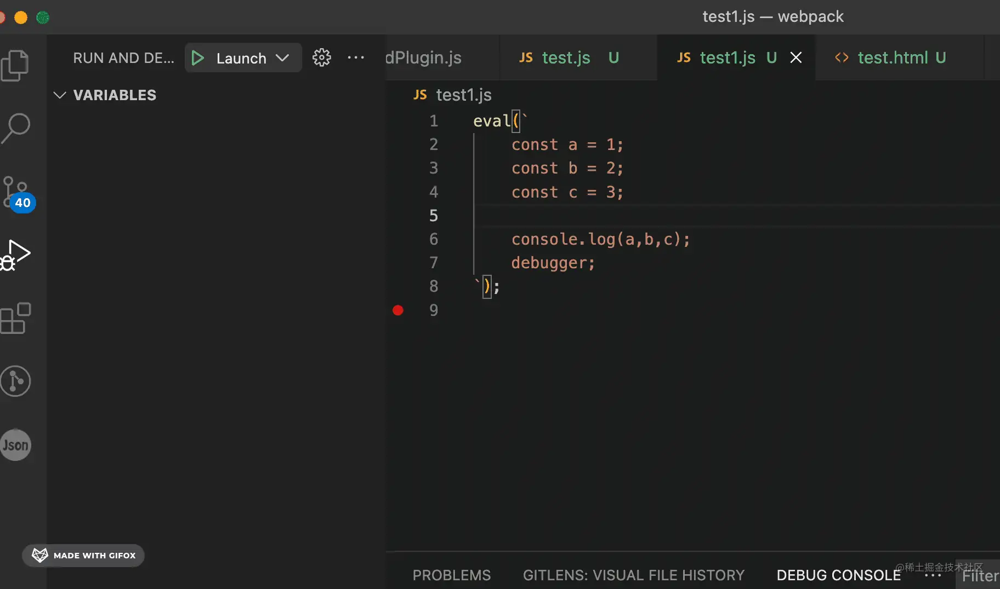

可以看到有单独的 Eval 作用域，eval 的代码里声明的变量都在这个作用域里：

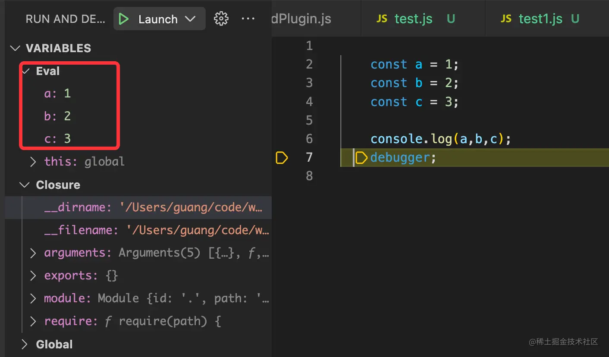

## 总结

JS 总共有 9 种作用域，我们通过调试的方式来分析了下：

- **Global 作用域**： 全局作用域，在浏览器环境下就是 window，在 node 环境下是 global
- **Local 作用域**：本地作用域，或者叫函数作用域
- **Block 作用域**：块级作用域
- **Script 作用域**：let、const 声明的全局变量会保存在 Script 作用域，这些变量可以直接访问，但却不能通过 window.xx 访问
- **Module 作用域**：es module 模块运行的时候会生成 Module 作用域，而 commonjs 模块运行时严格来说也是函数作用域，因为 node 执行它的时候会包一层函数，算是比较特殊的函数作用域，有 module、exports、require 等变量 
- **Catch Block 作用域**： catch 语句的作用域可以访问错误对象
- **With Block 作用域**：with 语句会把传入的对象的值放到单独的作用域里，这样 with 语句里就可以直接访问了
- **Closure 作用域**：函数返回函数的时候，会把用到的外部变量保存在 Closure 作用域里，这样再执行的时候该有的变量都有，这就是闭包。eval 的闭包比较特殊，会把所有变量都保存到 Closure 作用域
- **Eval 作用域**：eval 代码声明的变量会保存在 Eval 作用域

上面这些都是调试得出的，是 JS 引擎执行代码时的真实作用域。后面调试代码的时候就会遇到这些作用域。
