# 21.实战案例：调试 Vite 源码

Vite 这两年比较火，大家应该都接触过它，但很少有人调试过它的源码。而想要深入理解它的原理，调试源码是必不可少的一步。

这节我们就一起来调试下 Vite 的源码。

首先，用 create-vue 创建一个 vite + vue3 的项目：

```
npm init vue@3
```

然后进入项目目录，安装依赖。

之后把 vite 的开发服务跑起来：
```
npm run dev
```

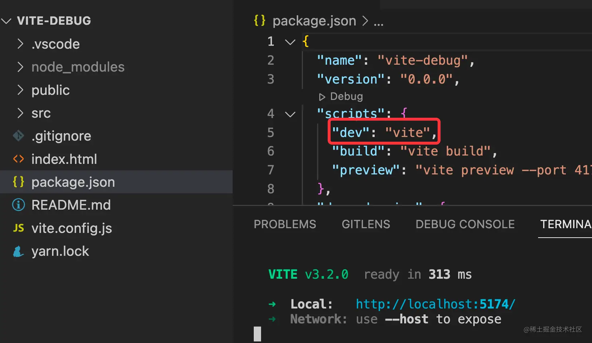

那么问题来了，vite 跑 dev server 的过程都执行了什么逻辑？

这就要调试源码来找答案了。

创建 .vscode/launch.json 的配置文件，添加一个 npm 类型的调试配置：

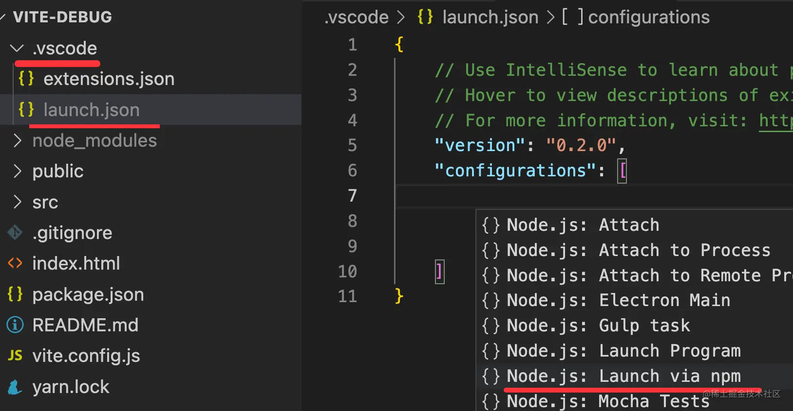

指定用调试的方式跑 npm run dev：

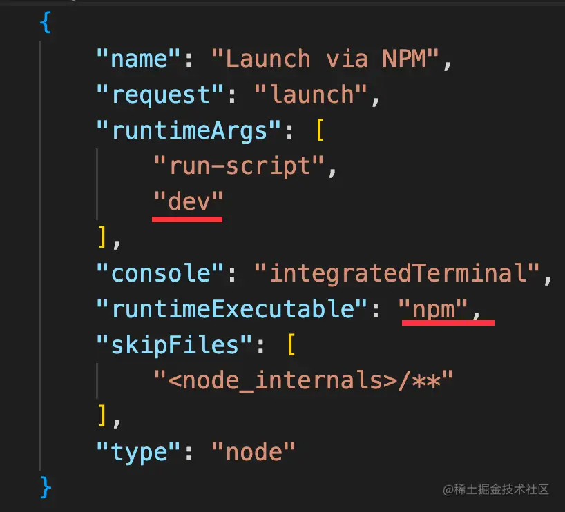

```json
{
    "name": "Launch via NPM",
    "request": "launch",
    "runtimeArgs": [
        "run-script",
        "dev"
    ],
    "runtimeExecutable": "npm",
    "console": "integratedTerminal",
    "skipFiles": [
        "<node_internals>/**"
    ],
    "type": "node"
}
```

其他的都是默认配置，但要指定下 console 为 integratedTerminal，这样会把日志打在我们平时用的那个集成终端里。不然默认是打在这里的：

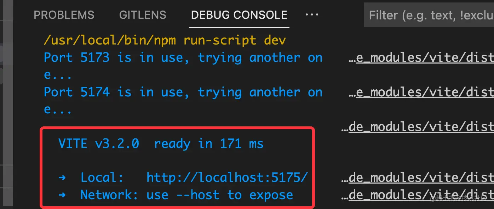

可以在 vite.config.js 这里打个断点：

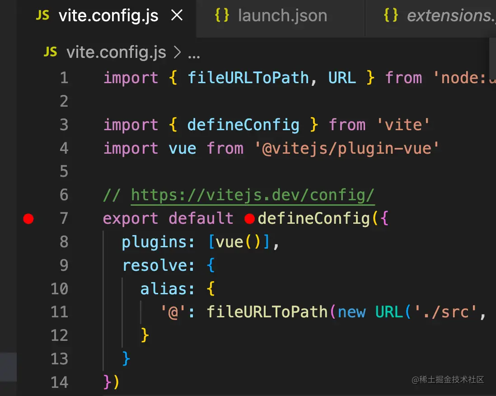

因为这个 defineConfig 肯定是被 vite 调用的，我们可以看下 vite 处理配置的代码。

调试的方式跑，代码会在这里断住：

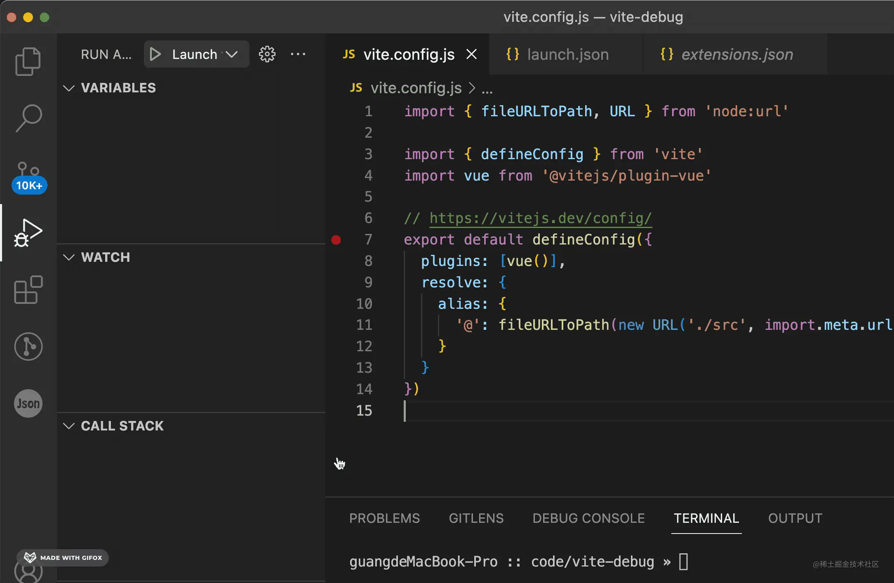

往下执行一步，就进入到 vite 源码了，这就是读取配置的相关代码。

但是现在的代码是被编译过的，可读性很差。所以我们要通过 sourcemap 来把它映射到源码再调试。

可以调用栈看到这部分代码是 node_modules/vite/dist/node 下的：

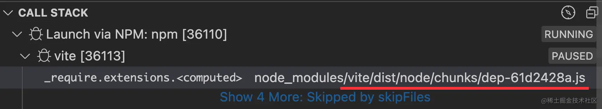

去 node_modules 下看了下，并没有 sourcemap：

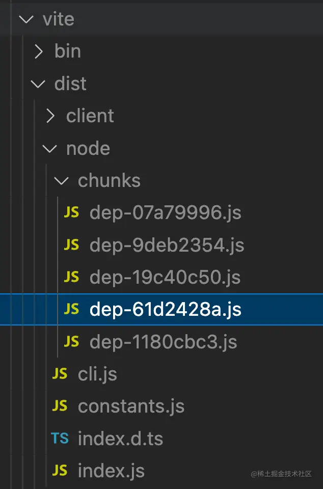

那去哪里找 sourcemap 呢？

这时就只能通过源码 build 了。

从 github 把 vite 下载下来：
```
git clone git@github.com:vitejs/vite.git
```
安装依赖，然后执行 pnpm run build，就可以在每个包下的 dist 目录看到 build 产物：

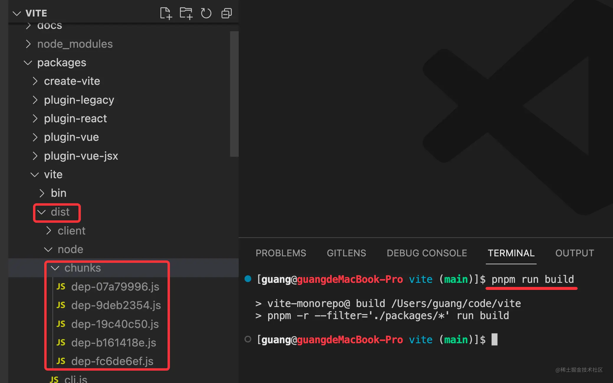

默认是没 sourcemap 的，想生成 sourcemap 要改下配置。

vite 是用 rollup 打包的，每个包下都有个 rollup.config.ts 文件，

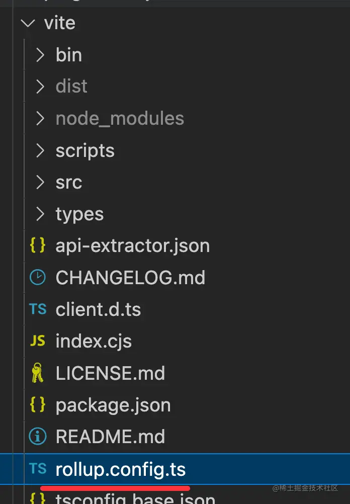

搜一下 sourcemap，会找到一个 createNodeConfig 的函数，这里就是配置 node 部分的代码是否生成 sourcemap 的地方：

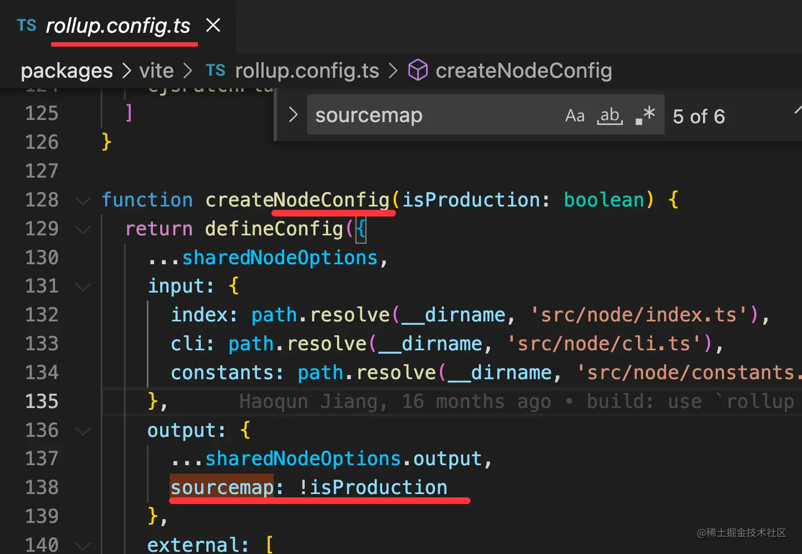

vite 编译会生成三部分代码，一部分是浏览器里的，也就是 client 目录下的，一部分是 node 跑的，是 esm 的模块，还有一部分是 node 跑的 cjs 的模块。

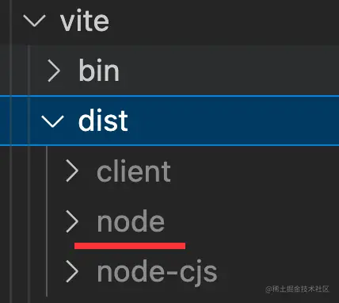

上面搜到的就是 node 部分代码的打包配置。

搜一下这个 isProduction，发现当命令行有 --watch 参数的时候，isProduction 就是 false：

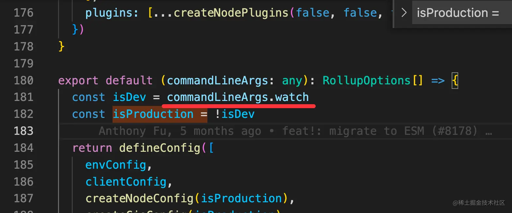

而这个参数只有这个包需要，所以 cd ./packages/vite，然后执行 npm run build --watch

或者更简单一点，直接把 sourcemap 改成 true

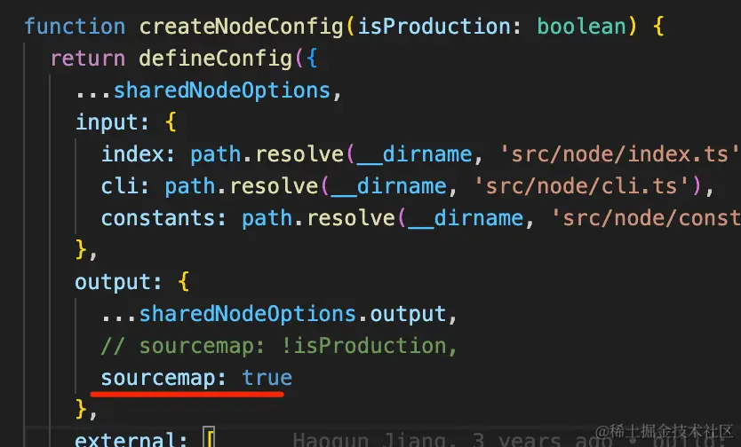

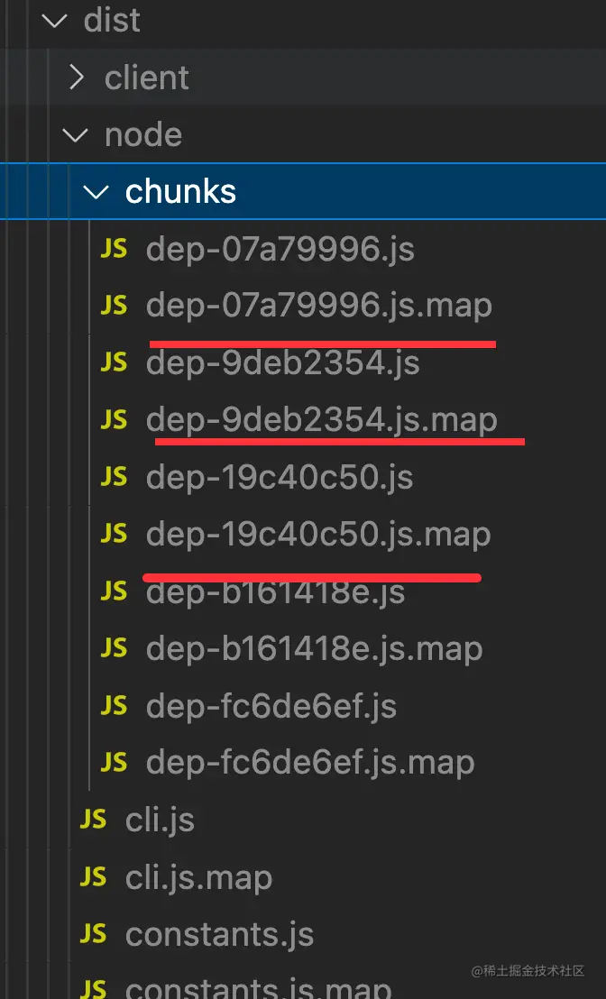

这时候你就会发现生成的代码有 sourcemap 了！

把这个 dist 目录复制到测试项目的 node_modules/vite 下，覆盖原来的 dist。

然后重新跑调试：

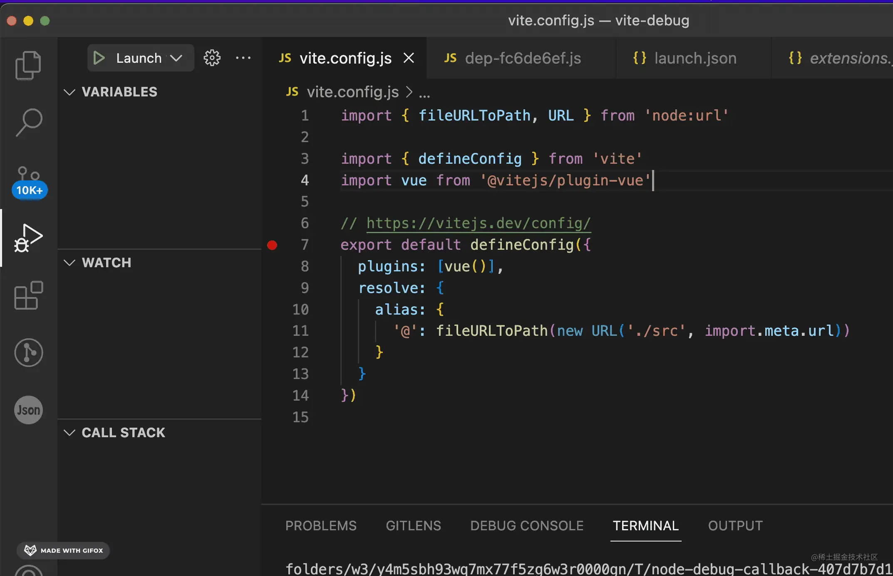

你会发现调试还是编译后的源码。

但这个文件明明关联了 sourcemap 的：

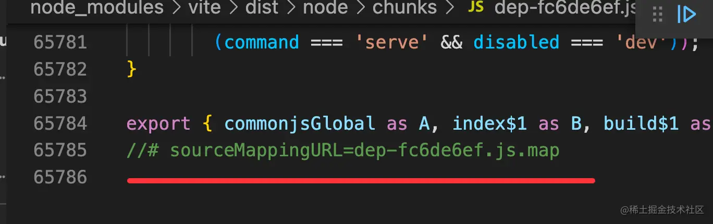

这是为什么呢？

这是因为默认 VSCode Node Debugger 会忽略 node_modules 下的 sourcemap：

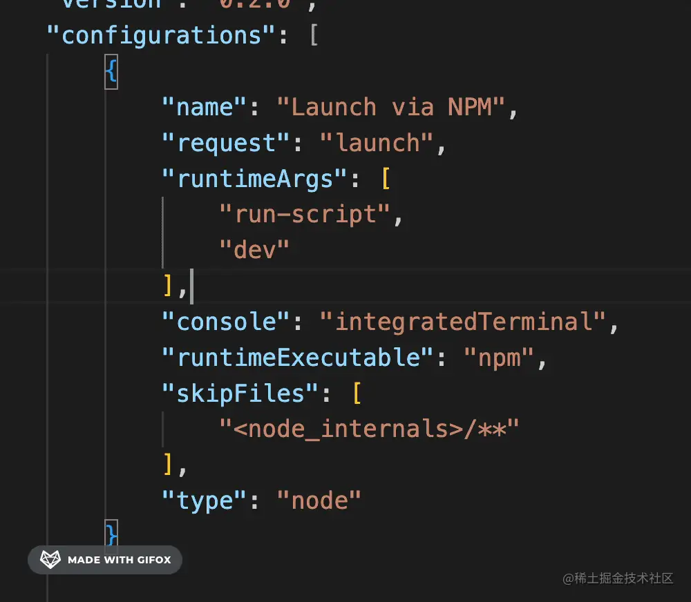

resolveSourceMapLocations 是配置去哪里找 sourcemap 的，默认把 node_modules 排除了。去掉那行配置即可。

再次调试，你就会发现调试的是 vite 的 ts 源码了！

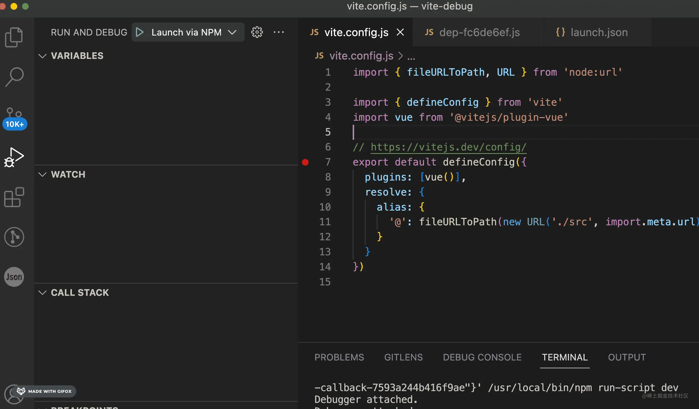

可以调用栈中找到关心的部分打个断点看下对应的逻辑。

至此，我们就成功的调试了 vite 的源码。

## 总结

这节我们调试了 vite 的源码。

用 create-vue 创建了 vite+vue3 的项目，然后调试的方式跑 npm run dev，在 vite.config.js 里断住。

但这时候调用栈中的代码是被编译过的 js。

我们把 vite 源码下下来，修改 rollup 配置，build 出带有 sourcemap 的代码。用它覆盖原来的 node_modules 下的 vite 代码。

重新调试，调用栈中就是 sourcemap 之后的 ts 代码。

这样就能愉快的断点调试 vite 源码了。
