# 22.实战案例：调试 TypeScript 源码

不知道大家对 ts 是否熟悉，你觉得下面这段 ts 代码，res 类型是什么？

```typescript
type Test<T> = T extends number ? 1 : 2;

type res = Test<any>;
```

结果是 1 | 2 的联合类型：

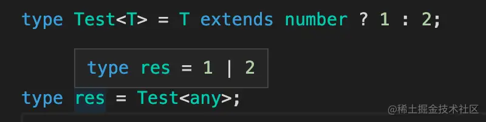

很多同学会感到迷惑，为什么是这样呢？

这就要从源码找答案了，今天我们就来调试下 ts 源码来探究上面这个类型的求值过程。

首先，我们要把 ts 源码下载下来（加个 depth=1 可以下载单 commit，速度比较快）

```
git clone --depth=1 git@github.com:microsoft/TypeScript.git
```

然后可以看到 lib 目录下有 tsc.js 和 typescript.js，这两个分别是 ts 的命令行和 api 的入口。

但是，这些是编译以后的 js 代码，源码在 src 下，是用 ts 写的。

怎么把编译后的 js 代码和 ts 源码关联起来呢？ sourcemap！

编译源码：

```
yarn 
yarn run build:compiler
```
然后就可以看到多了一个 built 目录，下面有 tsc.js、typescript.js 这两个入口文件，而且也有了 sourcemap：

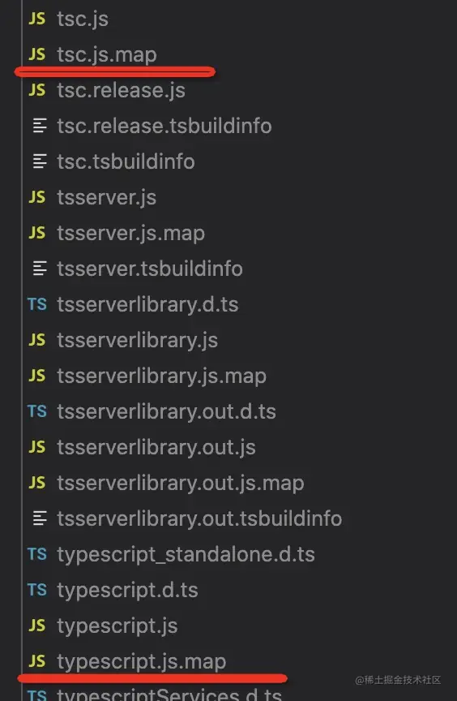

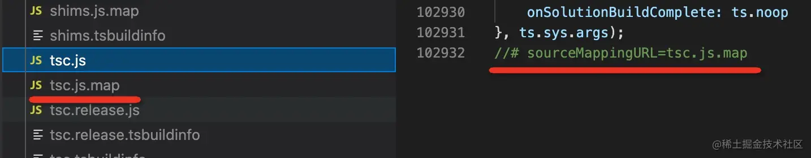

接下来就可以直接调试 ts 源码，而不是编译后的 js 代码了。

我们来试试：

添加一个 node 调试配置：

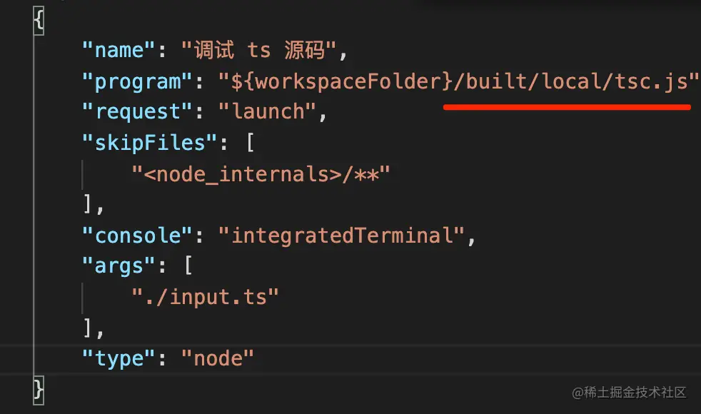

```json
{
    "name": "调试 ts 源码",
    "program": "${workspaceFolder}/built/local/tsc.js",
    "request": "launch",
    "skipFiles": [
        "<node_internals>/**"
    ],
    "console": "integratedTerminal",
    "args": [
        "./input.ts"
    ],
    "type": "node"
}
```
入口是 tsc，我们找到 src/tsc/tsc.ts 打个断点：

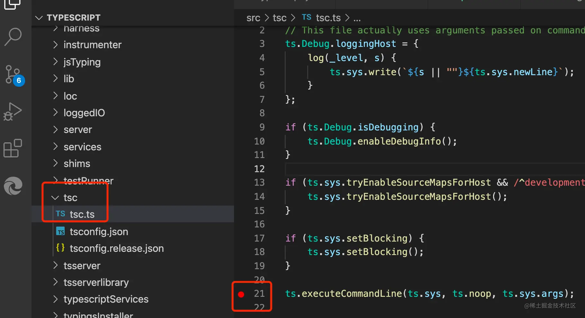

然后 debug 启动，就会发现它断住了：

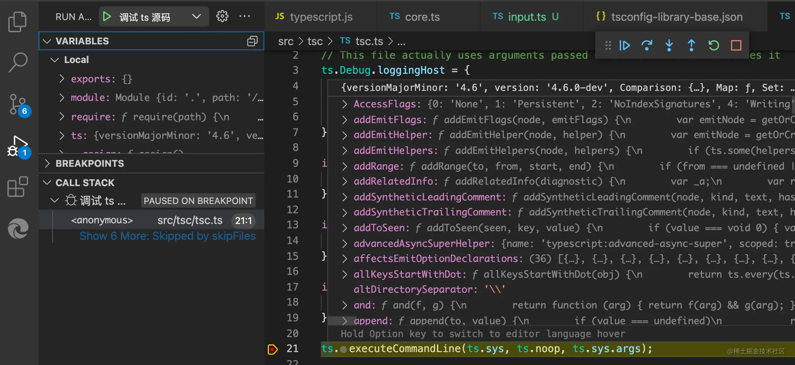

这就是命令行的入口。

而且我们是直接调试 ts 源码的，在 ts 源码里打的断点，这就是 sourcemap 的作用。

但是你会发现 ts 代码太多了，不知道哪些是解析类型的逻辑，在哪里打断点比较好。

这种情况还是用 api 的方式调试比较好。

我们创建一个 test.js，输入这样的代码：

```typescript
const ts = require("./built/local/typescript");

const filename = "./input.ts";
const program = ts.createProgram([filename], {
    allowJs: false,
    strictNullChecks: true
});

const sourceFile = program.getSourceFile(filename);
const typeChecker = program.getTypeChecker();

function visitNode(node) {
    if (node.kind === ts.SyntaxKind.TypeAliasDeclaration && node.name.escapedText === 'res')  {
        const type = typeChecker.getTypeFromTypeNode(node.name);

        console.log(type);
    }

    node.forEachChild(child =>
        visitNode(child)
    );
}

visitNode(sourceFile);
```

ts.createProgram 就是 ts 的 api 入口，通过 program.getSourceFile 拿到的是 AST，通过 program.getTypeChecker 拿到的是实现类型检查的 type cheker。

遍历 AST，找到 AST 类型为类型别名，并且名字是 res 的节点，然后调用 typeCheker.getTypeFromTypenode 进行类型检查。

想知道代码哪部分是什么 AST 可以通过 [astexplorer.net](https://astexplorer.net/#/gist/3a718a7f5072cdaad804c0ebec076526/5baa661cc653c9846479de3f012f6fbd8dbe1fd3) 来查看：

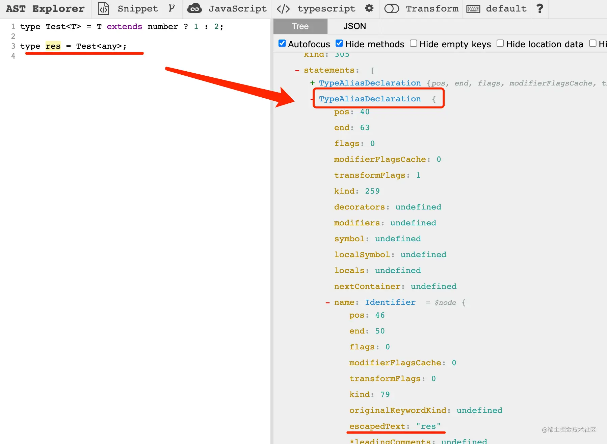

这样我们就完成了用 ts 对 res 的节点进行类型检查的逻辑。

接下来开始调试。

创建这样的调试配置：

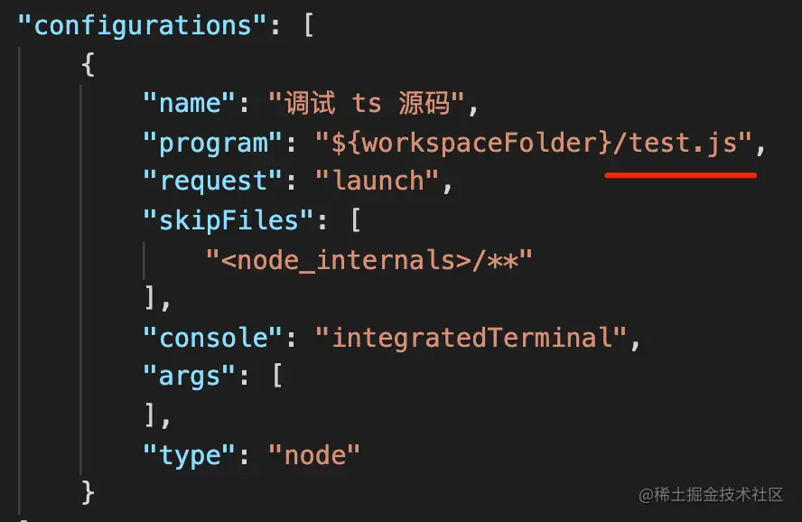

```json
{
    "name": "调试 ts 源码",
    "program": "${workspaceFolder}/test.js",
    "request": "launch",
    "skipFiles": [
        "<node_internals>/**"
    ],
    "console": "integratedTerminal",
    "args": [
    ],
    "type": "node"
}
```

在类型检查这行打个断点：

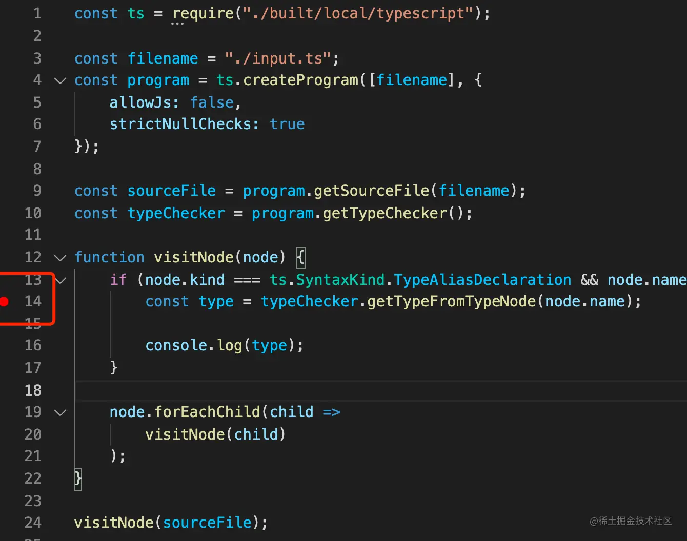

启动调试，你会发现断住的地方就是我们在 astexplorer.net 里看到的那个 AST 节点：

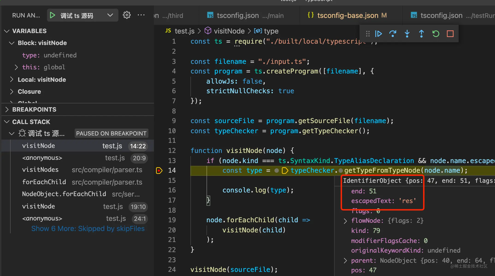

点击 step into 进入函数内部，然后单步执行，你会走到这样的代码：

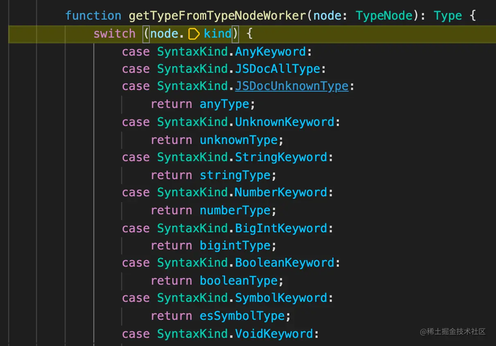

这个就是根据不同的 node.type 来进行不同的类型检查过程的枢纽：

当然它中间会进行很多节点的类型检查过程，而我们只关心 ? : 的部分，也就是 Conditional Type 的部分：

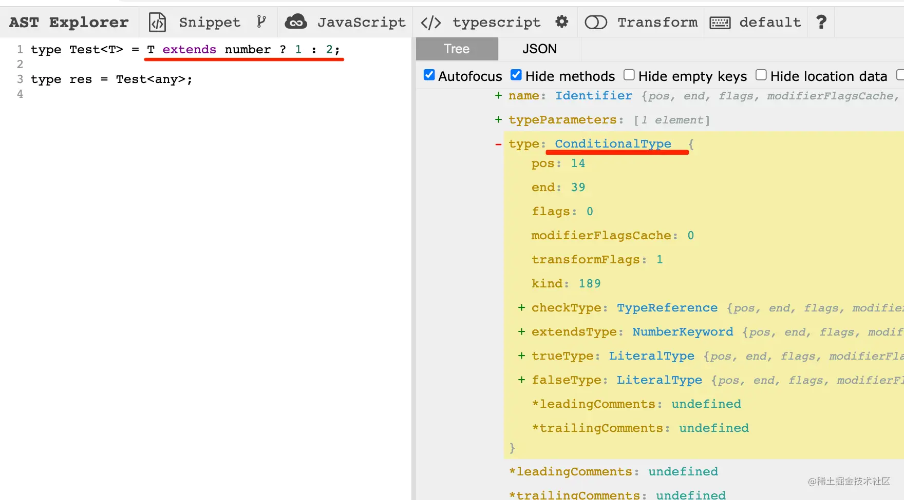

所以在这一行打个断点：

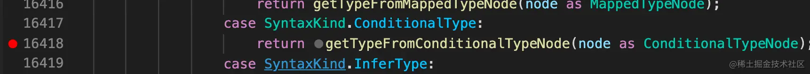

断住之后，step into 进入内部：

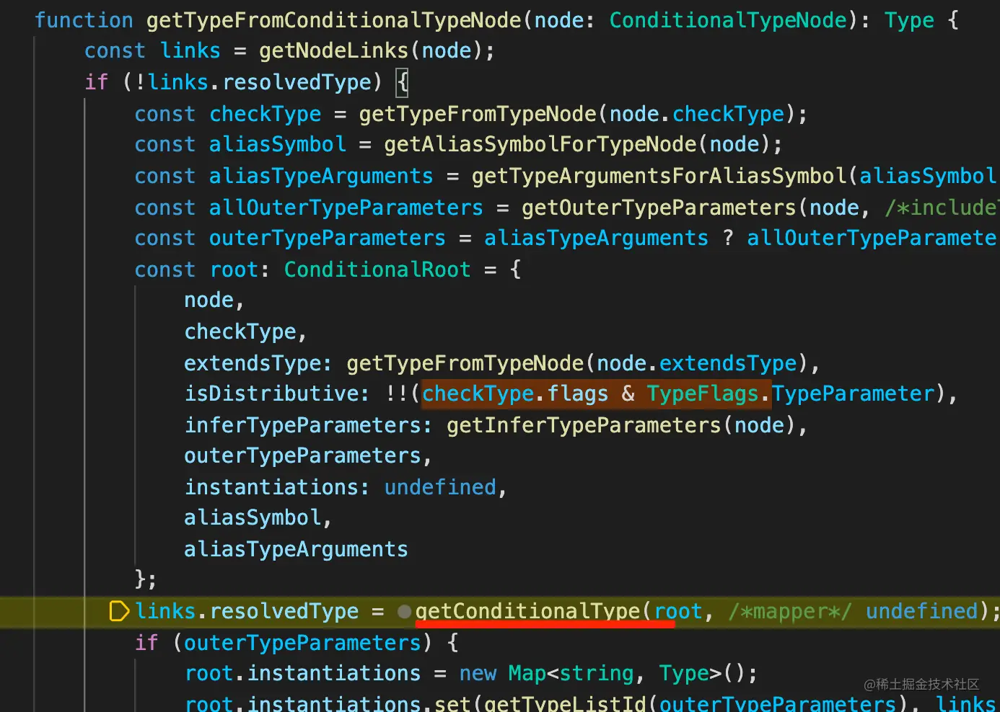

发现这里调用了个 getConditionalType 的方法。

我们只是想看下条件类型里 any 是怎么处理的，在 getConditionalType 方法的开始处搜索下 any 就可以找到这一行代码：


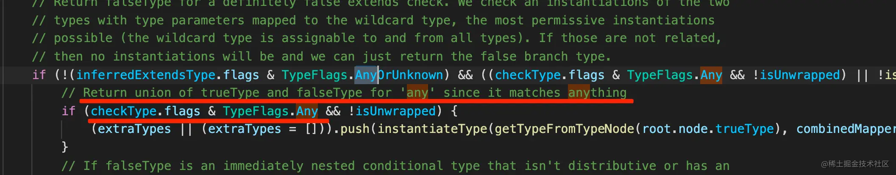

看注释 Return union of trueType and falseType for 'any' since it matches anything 的意思就是如果左边是 any，那就返回 trueType 和 falseType 的联合类型。

checkType、extendsType、trueType、falseType 也可以在 AST 里找到：

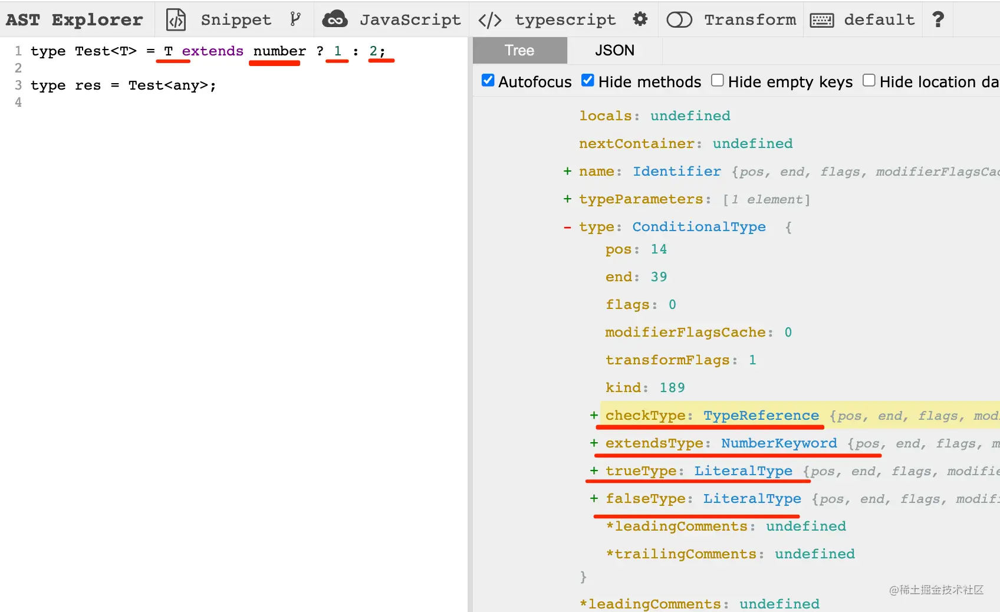

我们定位到条件类型里处理 any 的地方里，在这里打个断点：

会发现代码确实走到了这里：

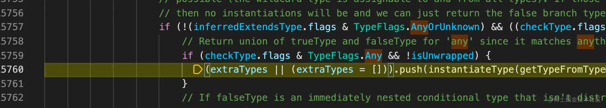

最后在打印的地方打个断点就可以看到返回的是  trueType 和 falseType 的联合类型。

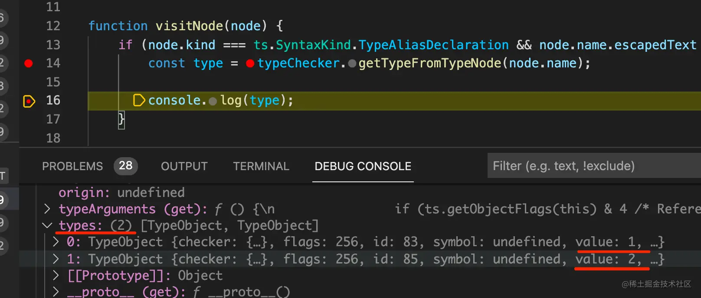

至此，我们通过源码理清了条件类型左边为 any 的时候，为什么会返回这样的结果：


## 总结

ts 里很多类型的解释需要从源码找答案，我们调试了下 ts 的源码：

通过 sourcemap 关联到了 src 下的代码，然后在源码里打断点。

api 的方式比命令行的方式更精准一些，我们可以直接调用 api 对目标 AST 进行类型检查，然后进入源码内部探究原因。

定位到处理条件类型的方法，然后搜索了下处理 any 的地方，打了个断点来验证，最终找到了条件类型为 any 的时候，返回的是一个联合类型的原因。

ts 源码的调试确实很复杂，但是我们通过 sourcemap 定位到源码、通过 api 调试、结合搜索来打断点，还是能读懂一些类型的处理流程的。

