# 23.如何通过变量写出更灵活的调试配置？

我们写过很多调试配置了，不管是调试网页代码的，还是调试 node 代码的。

但我们之前的调试配置都是写死的，不够灵活。

比如我有两个 js 文件：

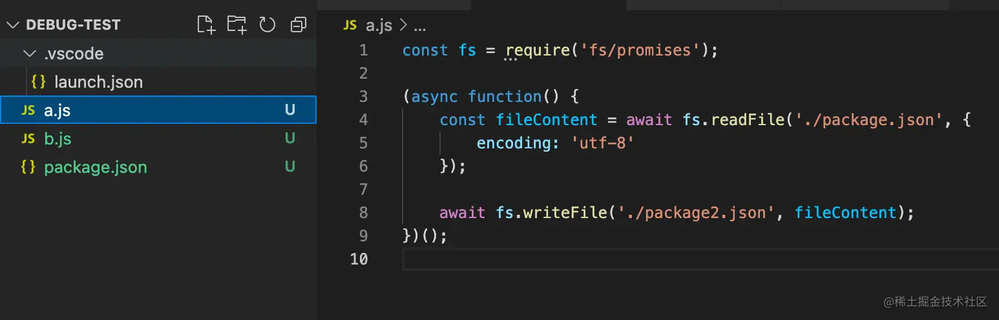

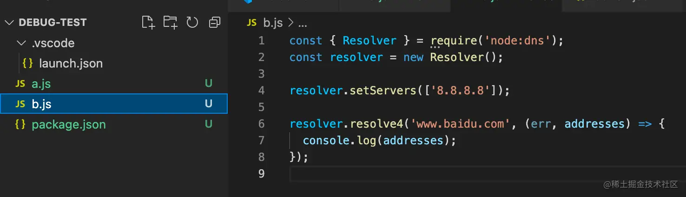

那就要写两个调试配置：

```json
{
    "type": "pwa-node",
    "request": "launch",
    "name": "Launch Program",
    "skipFiles": [
        "<node_internals>/**"
    ],
    "program": "${workspaceFolder}/a.js"
},
{
    "name": "Launch Program",
    "program": "${workspaceFolder}/b.js",
    "request": "launch",
    "skipFiles": [
        "<node_internals>/**"
    ],
    "type": "pwa-node"
}
```

如果要调试的文件更多呢？

就很麻烦。

能不能我选中哪个文件调试哪个呢？

可以的，这个就是变量的作用。

比如当前打开的文件是 file 这个变量，那就可以这样写：

```json
{
    "name": "Launch Program",
    "program": "${file}",
    "request": "launch",
    "skipFiles": [
        "<node_internals>/**"
    ],
    "type": "pwa-node"
}
```

这个 \${file} 就是取 file 变量的值，也就是当前文件路径的作用。

效果就是这样的：

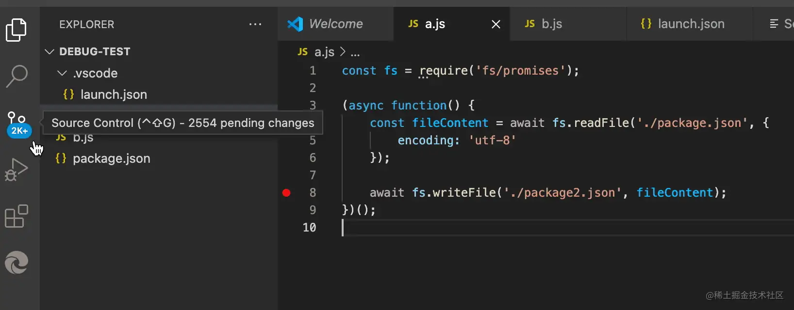

当前选中哪个文件，调试的就是哪个文件。

这样通过变量来给调试配置增加了灵活性。

类似的这种变量还有很多：

*   **\${workspaceFolder}**  在 VSCode 中打开的目录的路径
*   **\${workspaceFolderBasename}** 在 VSCode 中打开的目录的名称
*   **\${file}** 当前打开的文件
*   **\${relativeFile}** 当前打开的文件相对于 workspaceFolder 的路径
*   **\${relativeFileDirname}** 当前打开的文件相对于workspaceFolder 的目录名
*   **\${fileBasename}**  当前打开文件的名称
*   **\${fileBasenameNoExtension}**  当前打开的文件去掉扩展名的名称
*   **\${fileExtname}** 当前打开文件的扩展名
*   **\${fileDirname}**  当前打开文件的目录路径
*   **\${cwd}** 当前执行命令的工作目录
*   **\${lineNumber}**  当前行号
*   **\${selectedText}** 当前选中的文本
*   **\${execPath}** 当前 VSCode 可执行文件的路径
*   **\${pathSeparator}**  操作系统文件路径分割符

我们通过这样一个 node 脚本来测试下：

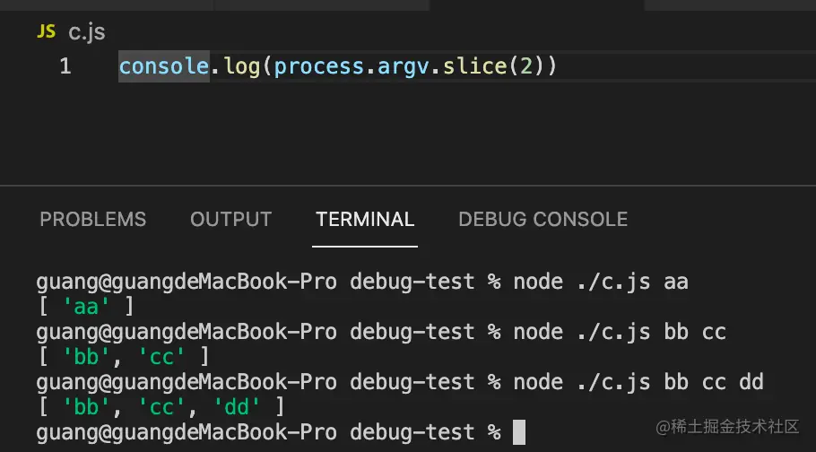

添加调试配置：

```json
{
    "name": "Launch Program",
    "program": "${workspaceFolder}/c.js",
    "args": [
        "workspaceFolder:  ${workspaceFolder}"
    ],
    "console": "integratedTerminal",
    "request": "launch",
    "type": "node"
}
```

console 为 integratedTerminal 是指定信息输出在集成的 terminal 而不是默认的 debug console。

启动调试，可以看到 workspaceFolder 变量的值：

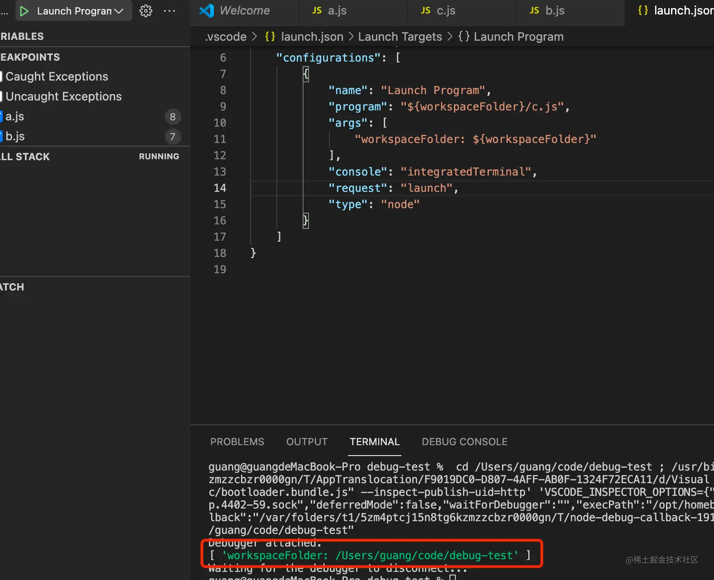

明显，这个是 VSCode 打开的目录的名字。

我们分批测试下其他变量：

```json
{
    "name": "Launch Program",
    "program": "${workspaceFolder}/c.js",
    "args": [
        "workspaceFolder: ${workspaceFolder}",
        "workspaceFolderBasename: ${workspaceFolderBasename}"
    ],
    "console": "integratedTerminal",
    "request": "launch",
    "type": "node"
}
```

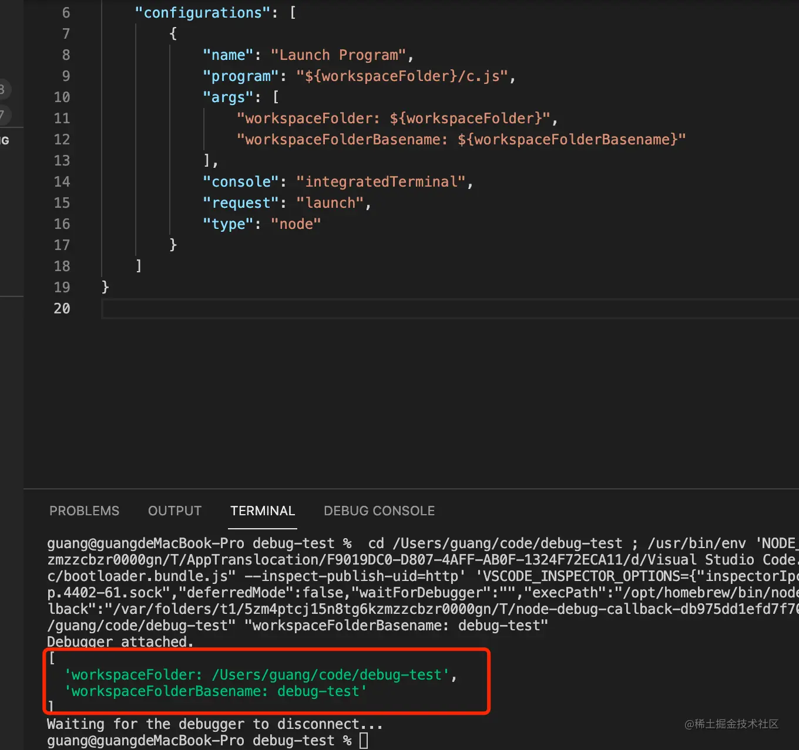

workspaceFolderBasename 相较于 workspaceFolder 只有文件名，没有前面的路径。

```json
{
    "name": "Launch Program",
    "program": "${workspaceFolder}/c.js",
    "args": [
        "file: ${file}",
        "relativeFile: ${relativeFile}",
        "relativeFileDirname: ${relativeFileDirname}",
        "fileBasename: ${fileBasename}",
        "fileBasenameNoExtension: ${fileBasenameNoExtension}",
        "fileExtname: ${fileExtname}",
        "fileDirname: ${fileDirname}",
        "fileDirnameBasename: ${fileDirnameBasename}"
    ],
    "console": "integratedTerminal",
    "request": "launch",
    "type": "node"
}
```

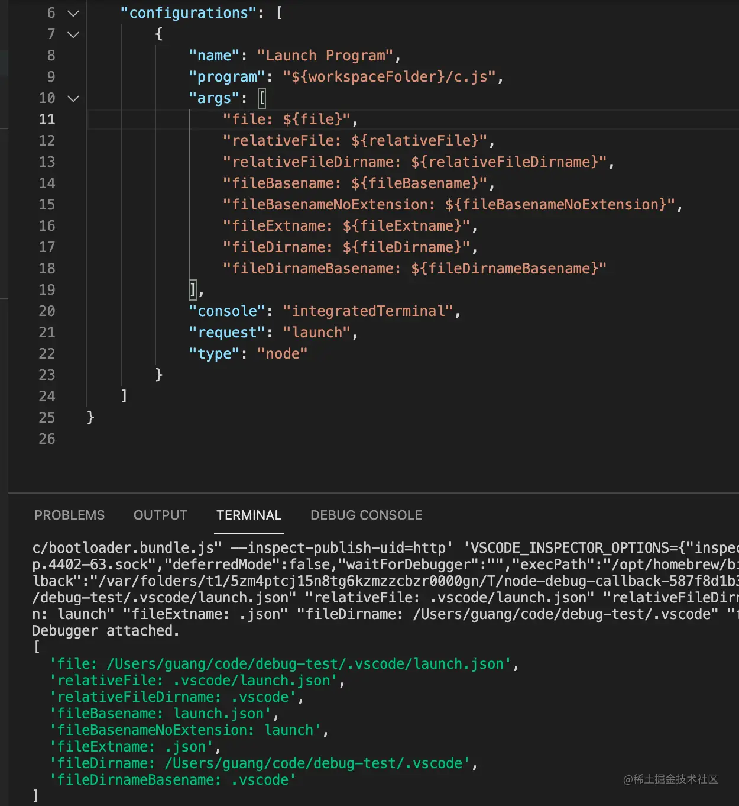

file 是当前文件的路径，relativeFile 是相较于项目根目录（workspaceFolder）的路径。

relativeFileDirname 是当前文件的目录名字。

fileBasename 是文件名，没有前面的路径。fileBasenameNotExtension 是去掉扩展名以后的。

fileExtname 是扩展名，fileDirname 是当前文件的目录路径。

fileDirnameBasename 是文件夹名字，没有前面的路径。

```json
{
    "name": "Launch Program",
    "program": "${workspaceFolder}/c.js",
    "args": [
        "cwd: ${cwd}",
        "lineNumber: ${lineNumber}",
        "execPath: ${execPath}",
        "selectedText: ${selectedText}",
        "pathSeparator: ${pathSeparator}"
    ],
    "console": "integratedTerminal",
    "request": "launch",
    "type": "node"
}
```

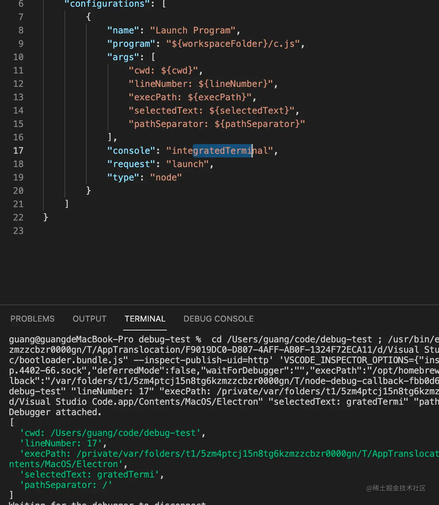

cwd 是当前工作目录。

lineNumber 是当前的行数。

execPath 是 vscode 可执行文件的路径。

selectedText 是当前选中文本。

pathSeprator 是路径分隔符，比如 mac 下是 /，而 windows 可能就是 \ 了。

灵活运用这些变量能够增加调试配置的灵活性。

此外，如果我想取环境变量作为参数呢？

自然也是可以的，通过 \${env: 环境变量名} 的语法。

```json
{
    "name": "Launch Program",
    "program": "${workspaceFolder}/c.js",
    "args": [
        "${env:PATH}"
    ],
    "console": "integratedTerminal",
    "request": "launch",
    "type": "node"
}
```

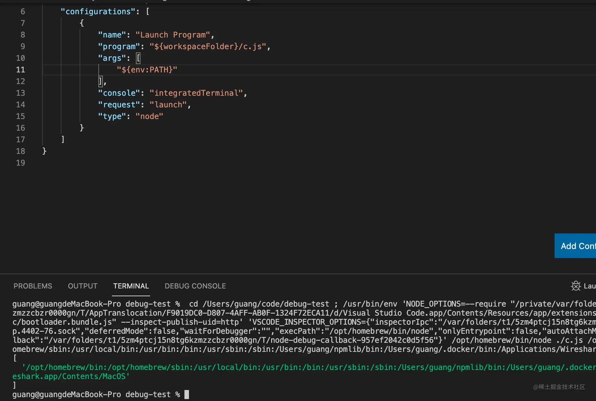

此外，还可以取 vscode 配置中的值。

通过 cmd + shift + p 打开默认配置：

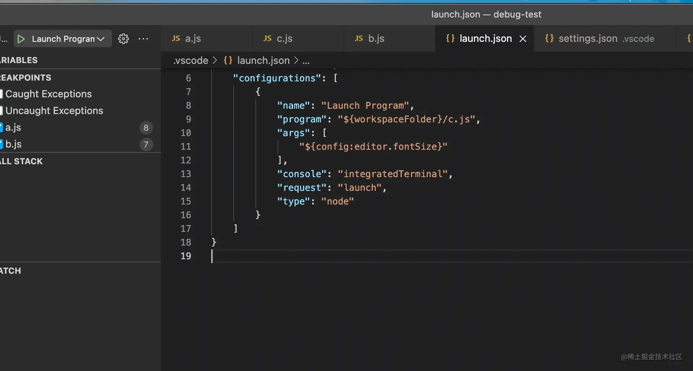

如果我想取配置的值就可以这样写:

```json
{
    "name": "Launch Program",
    "program": "${workspaceFolder}/c.js",
    "args": [
        "${config:editor.fontSize}"
    ],
    "console": "integratedTerminal",
    "request": "launch",
    "type": "node"
}
```

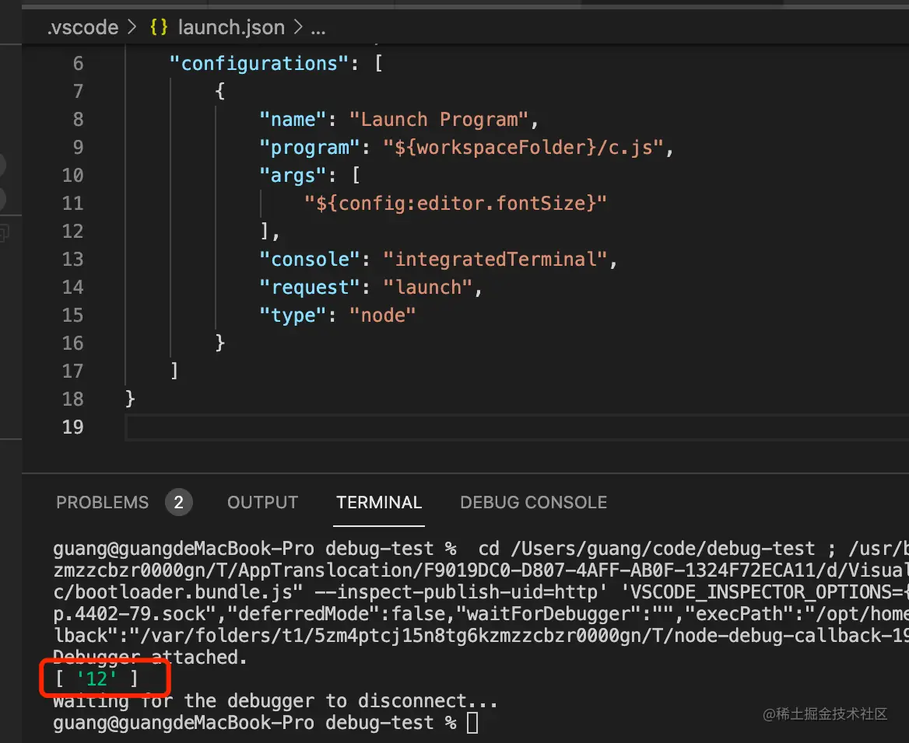

除了取 vscode 的配置外，还可以执行 vscode 的命令获取它的返回值：

    {
        "name": "Launch Program",
        "program": "${workspaceFolder}/c.js",
        "args": [
            "${command:extension.pickNodeProcess}"
        ],
        "console": "integratedTerminal",
        "request": "launch",
        "type": "node"
    }

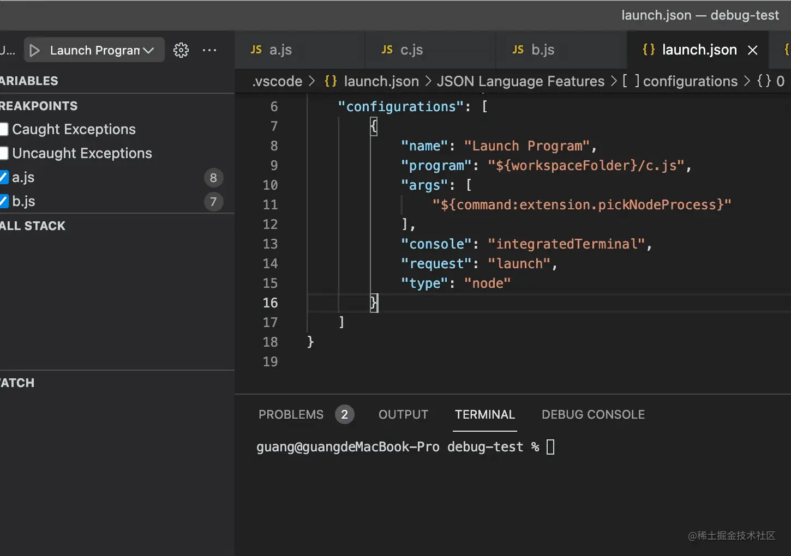

那如果我想用户自己输入调试哪个文件呢？

自然也可以可以的：

```json
{
    "version": "0.2.0",
    "configurations": [
        {
            "name": "Launch Program",
            "program": "${workspaceFolder}/c.js",
            "args": [
                "${input:aaa}",
                "${input:bbb}",
            ],
            "console": "integratedTerminal",
            "request": "launch",
            "type": "node"
        }
    ],
    "inputs": [
        {
            "type": "pickString",
            "id": "aaa",
            "description": "选择一个作为 aaa 的值?",
            "options": [
              "a1",
              "a2",
              "a3"
            ],
            "default": "a4"
          },
          {
            "type": "promptString",
            "id": "bbb",
            "description": "输入 bbb 的值",
            "default": "b1"
          }
    ]
}
```
通过 ${input: xxx} 的语法，指定 id 为 aaa 和 bbb 的两个 input。

下面有两个 input 的具体定义，一个是选择、一个是输入。

效果如下：

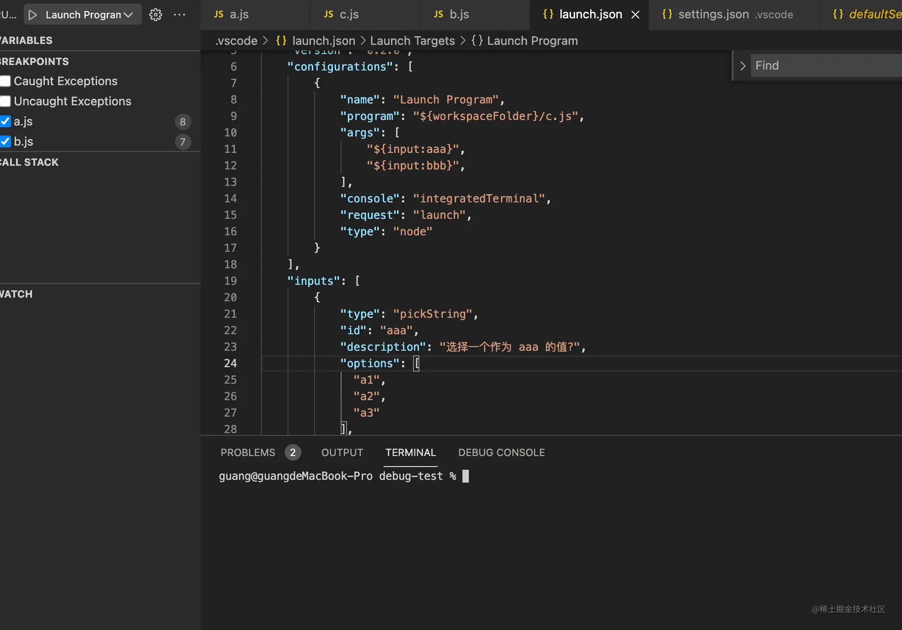

## 总结

不管是 node 调试配置还是网页调试配置都可以通过变量来增加配置的灵活性。

- input 变量，可以让用户输入或者选择，通过 \${input:xxx} 语法
- env 变量，可以读取环境变量值，通过 \${env:xxx} 语法
- config 变量，取 vscode 的配置，通过 \${config:xxx} 语法
- command 变量，可以读取命令执行结果，通过 \${command: xxx} 语法
- 内置变量，可以取当前文件、目录等信息，通过 \${xxx} 语法

灵活运用这些变量，可以让调试配置更灵活。
