# 24.如何灵活的调试 Jest 测试用例

Jest 是一个前端测试框架，它可以组织和运行测试用例，并且提供了 mock、断言等 api。

比如这样：

这是 nest 应用的一段测试代码，在 beforeEach 里面做了初始化逻辑，在每个 describe 里写不同的测试逻辑。

这样的测试代码在应用中有很多。

输入 jest 就会执行所有的测试代码：

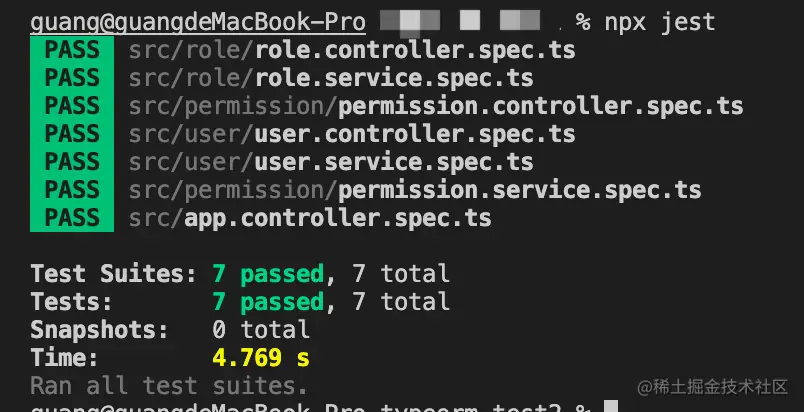

如果只是想跑某个测试文件的用例呢？

可以这样：

jest 后面加上要跑的测试文件的就行。

那如果测试文件里有多个测试用例，想只跑某个测试用例呢？

比如这三个测试用例：

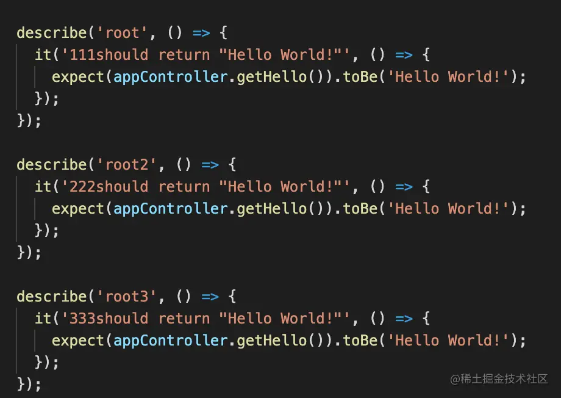

可以通过 -t 来指定：

-t 是 --testNamePattern 的缩写，可以指定要跑的用例名的正则。

jest 只会跑匹配的用例：

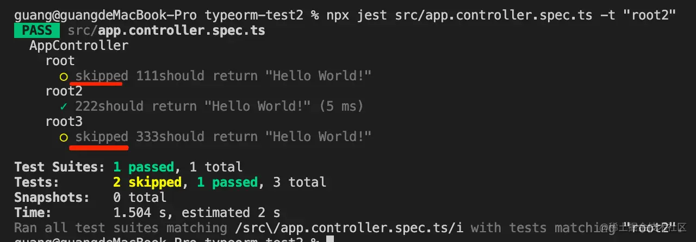

知道了 jest 用例怎么跑，那有时我们想断点调试它怎么办呢？

node 调试都是在 .vscode/launch.json 里加一个调试配置：

然后在 debug 面板点击启动调试：

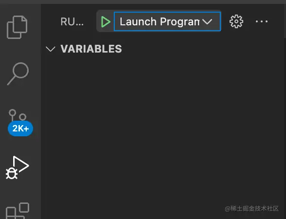

那跑 jest 怎么跑呢？

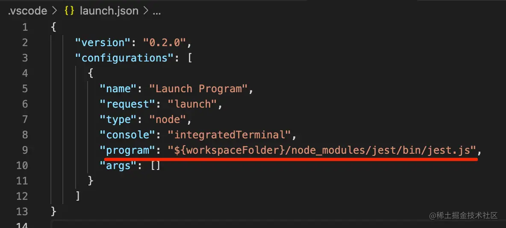

其实我们跑 jest 最终执行的是 node_modules/jest/bin/jest.js 这个文件，所以调试的时候就直接用 node 跑这个文件，传入参数就行。

还要指定日志输出位置为内置的终端，也就是 console 为 integratedTerminal。

打个断点，然后点击调试按钮：

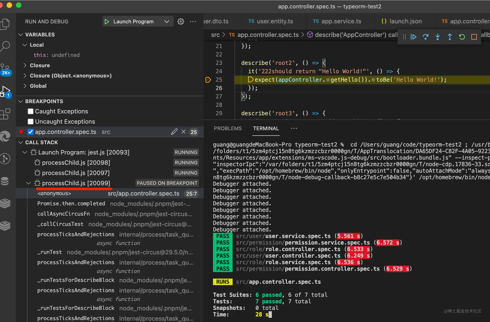

但你会发现它跑了多个 woker 进程，每个用例一个，这是 jest 优化性能的方式。

但调试的时候可以不用这种优化，直接在主进程跑就行。

可以加个 -i 的参数：

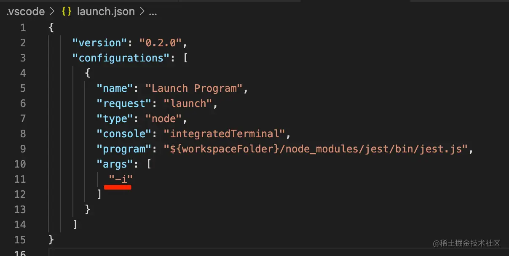

-i 是 --runInBand 的缩写，这个参数的意思是不再用 worker 进程并行跑测试用例，而是在当前进程串行跑：

看左侧的调用栈，明显能看出区别来：

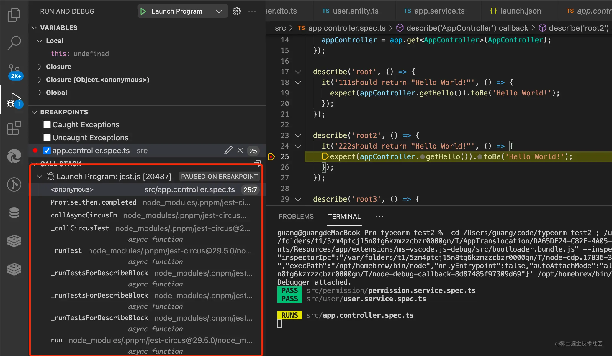

如果我们只想调试 root2 这个测试用例，那就可以加上对应的参数：

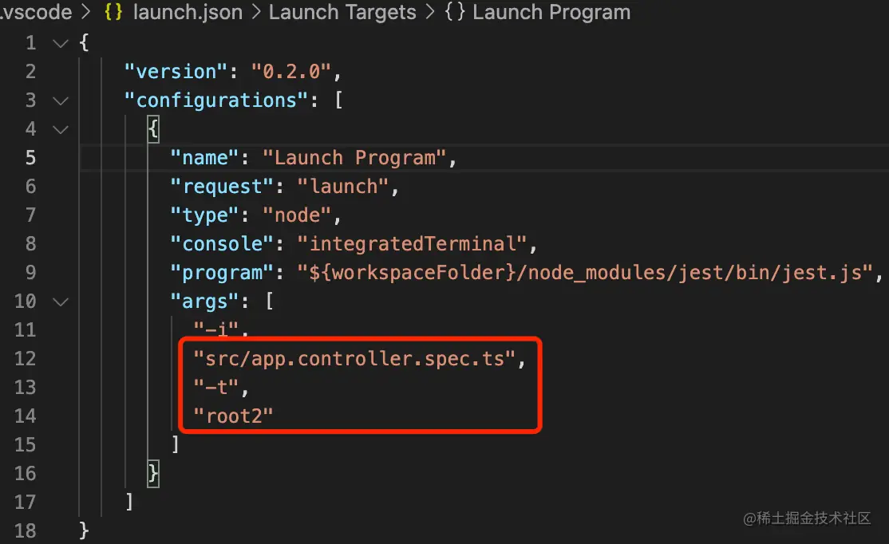

加上文件名和用例名。

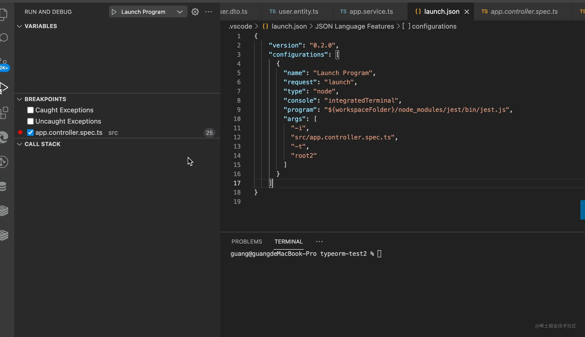

但这样每调试一个用例都得改下配置也太麻烦了，能不能我打开哪个文件，就跑哪个文件的用例呢？

可以的。

VSCode 调试配置支持变量，比如 \${file} 就代表当前文件。

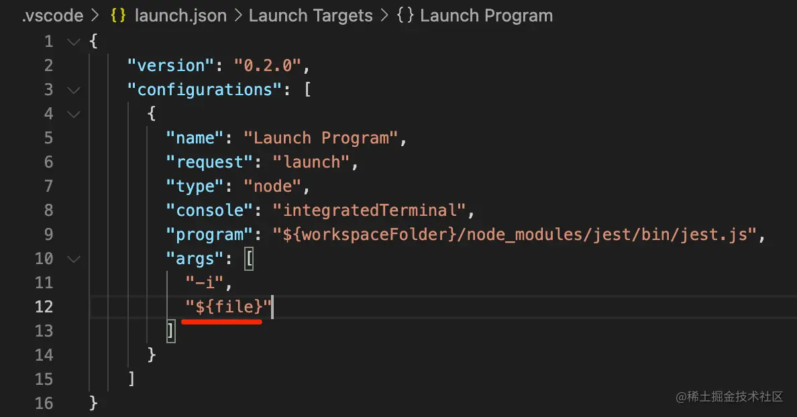

跑起来可以看到，文件路径是对的：

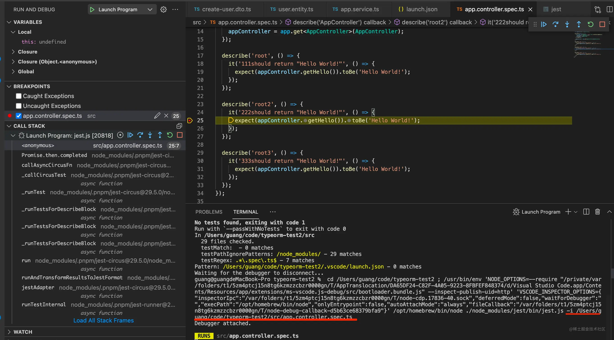

这样就可以打开哪个调试那个了。

那想指定具体的测试用例呢？

vscode 还支持输入类型的变量。

在 inputs 部分声明一个输入的变量，指定描述信息、默认值。然后在调试配置部分通过 \${input:变量名} 引用：

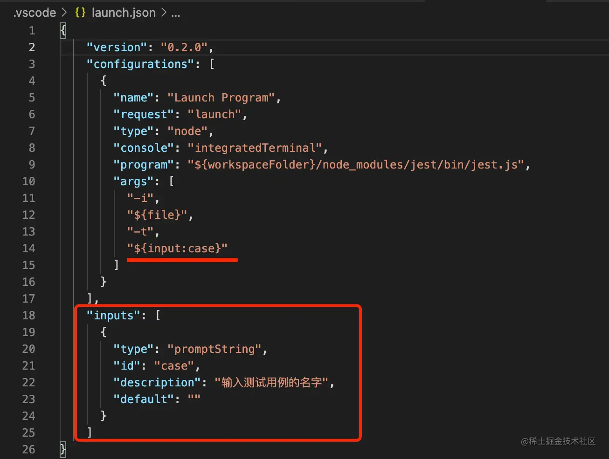

跑起来就是这样的：

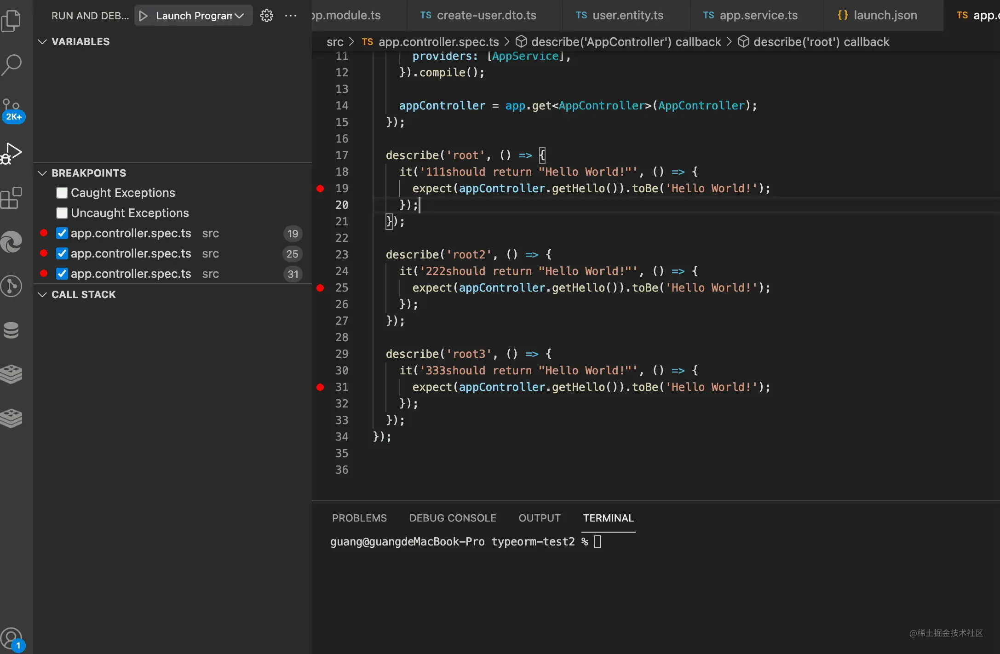

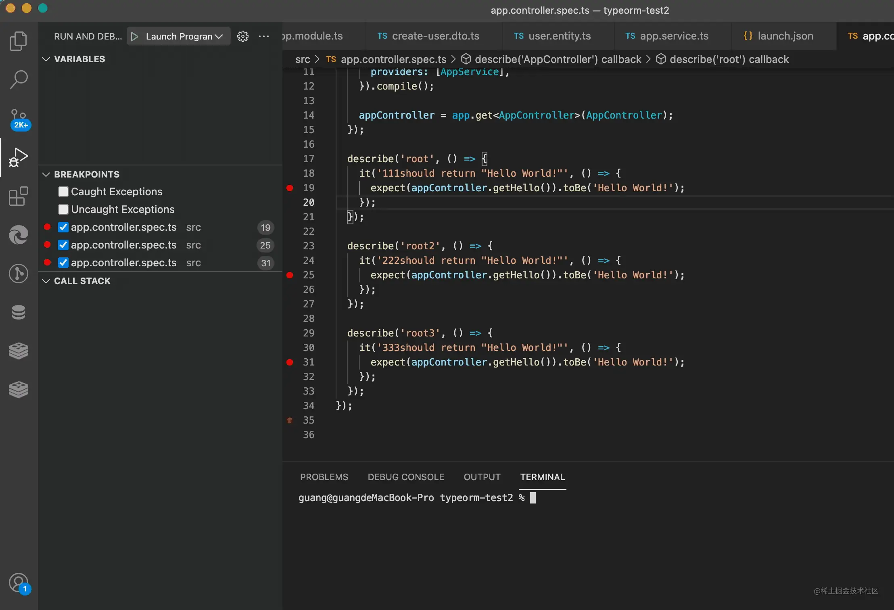

输入哪个用例的名字就跑哪个用例。

这样，就一个调试配置来调试任意测试用例了！

大家可能用过 Jest Runner 等 VSCode 插件：

它会在每个测试用例旁边加一个运行和调试的按钮：

原理就很容易懂了，点击不同位置的 debug，就是获取文件名和用例名传入调试配置。

这种插件是挺方便，但是太过黑盒，出了问题很难解决，不如自己写调试配置，各种 jest 运行的参数都可以自己加。

而且调试配置可以写的很灵活，比如 -t 后面支持正则，那 root、root2、root3 这三个用例想跑后两个，我们完全可以输入 root\d 来匹配。

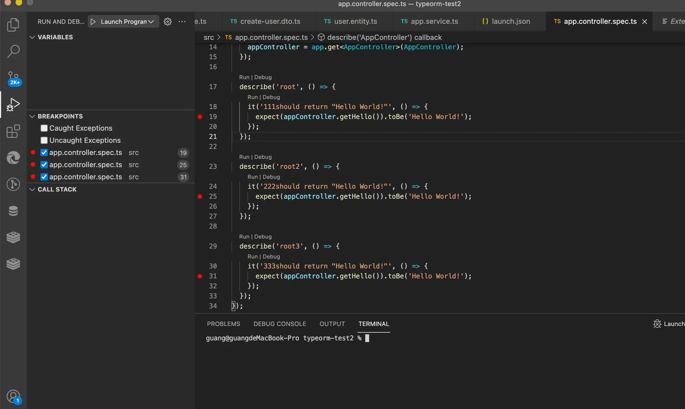

用那个 jest 的插件可以么？明显不能。

## 总结

Jest 支持跑全部的测试用例，或者跑指定文件指定名字的用例，在 VSCode 里可以通过 node 调试的方式来调试。

通过调试配置的内置变量以及输入的变量，可以达到一个调试配置调试任意文件任意用例的效果。

相比第三方的 Jest 插件，自己写调试配置明显灵活、强大的多。
