# 24.打断点的 7 种方式，你用过几种？

我们学习了如何调试网页和 Node.js 的代码，可以在代码某一行打个断点，代码执行到这里的时候就会断住，可以看它的作用域、调用栈等。

但有的时候，我们并不知道应该在哪里打断点：

- 比如代码抛了异常，你想打个断点看看异常出现的原因，但你并不知道异常在哪里发生的。

- 比如 dom 被某个地方修改了，你想打个断点看看怎么修改的，但你并不知道是哪段代码修改了它。

- 比如有的断点你想只在满足某个条件的时候断住，不满足条件就不需要断住。

类似的情况有很多，需要断住，但是普通的断点又不大合适，这时候就需要其他的断点类型了。

我们分别来看一下：

## 异常断点

代码抛了异常，你想知道在哪抛的，这时候就可以用异常断点。

比如这样一段代码：

```javascript
function add(a, b) {
    throw Error('add');
    return a + b;    
}

console.log(add(1, 2));
```

add 函数里抛了个异常，你想在异常处断住，这时候就可以加个异常断点：

用 node 的调试来跑：

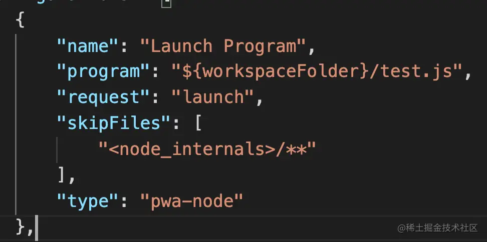

勾选 Uncaught Exceptions：

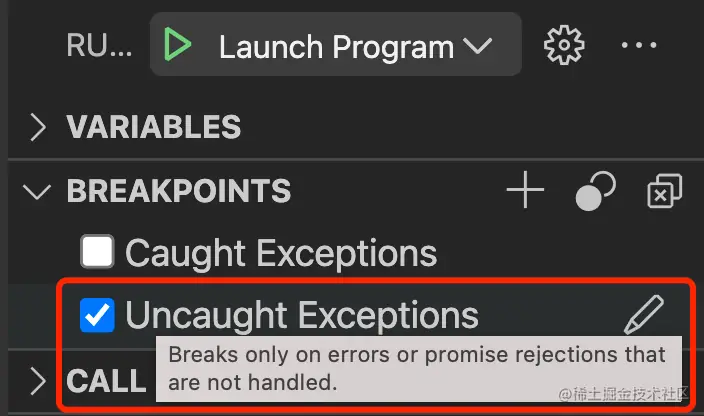

它可以在没有被处理的错误或者 Promise 的 reject 处断住。

上面那个 Caught Exception 是在被 catch 处理的异常出断住。

Uncaught Exceptions 更常用一些。

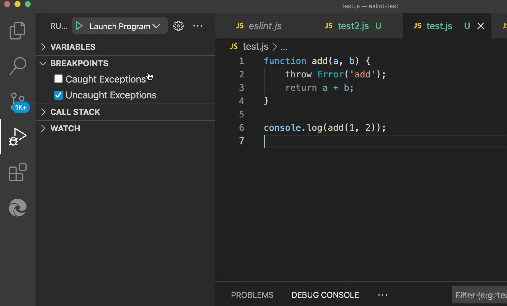

当然，网页调试也可以用异常断点：

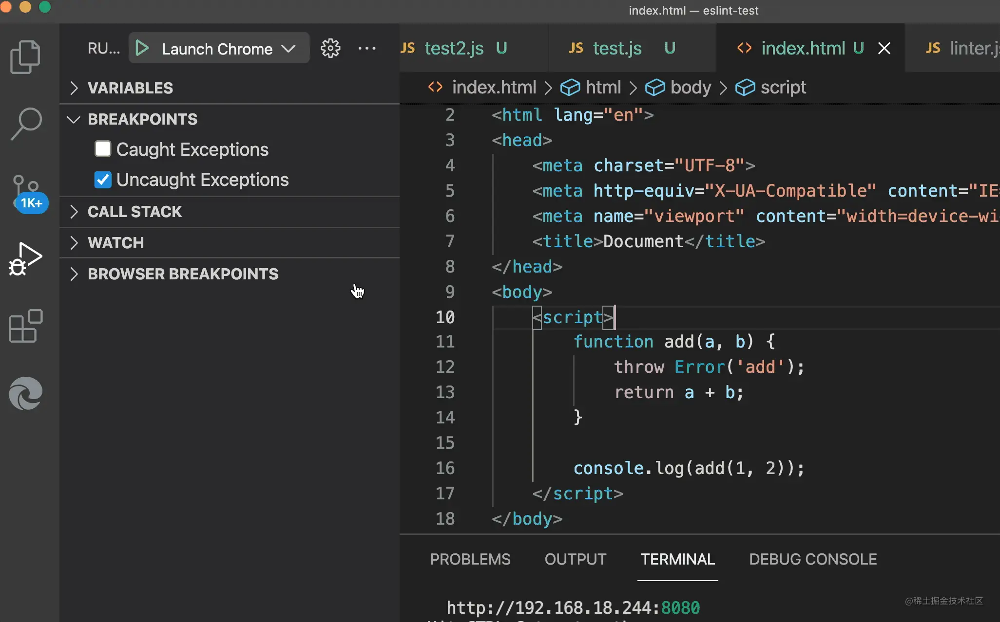

示例代码比较简单，很多时候代码抛了错你不知道哪里抛的，就可以用异常断点来找原因，断住以后看看调用栈啥的。

## 条件断点

有的时候我们只想在满足一定条件的时候才断住，这时候就可以用条件断点：

在代码左边打断点的地方右键单击，就可以选择条件断点：

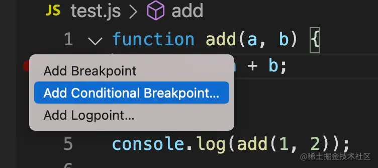

添加一个表达式，比如我只想在 a 等于 3 的时候断住：

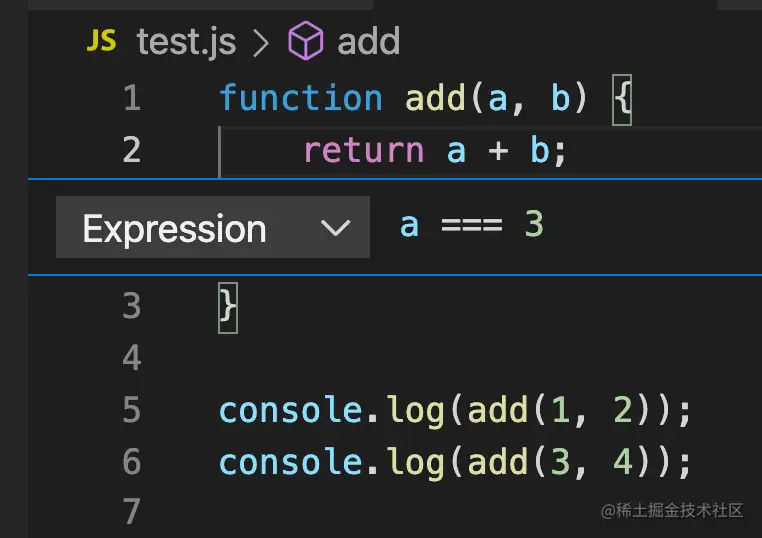

跑下 node 调试，你会发现这段代码虽然执行了两次，但只断住了一次：

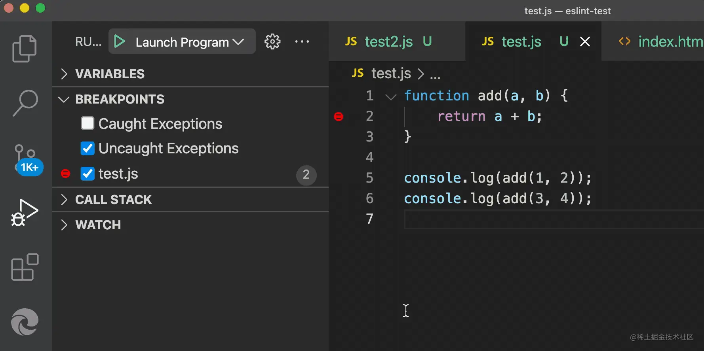

条件断点也是在网页调试也是支持的：

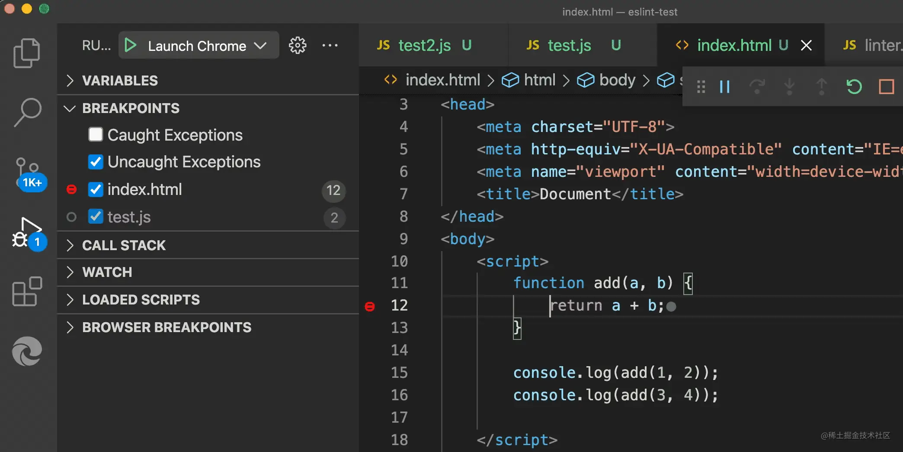

## LogPoint

当你觉得断住次数太多了，太麻烦，不想在断点处断住，但却想看下这时候的值，你是不是会选择加一个 console.log 呢？

绝大部分同学是这样的，但其实有更好的方式。

添加一个 LogPoint：

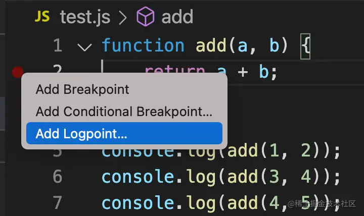

输入打印的表达式：

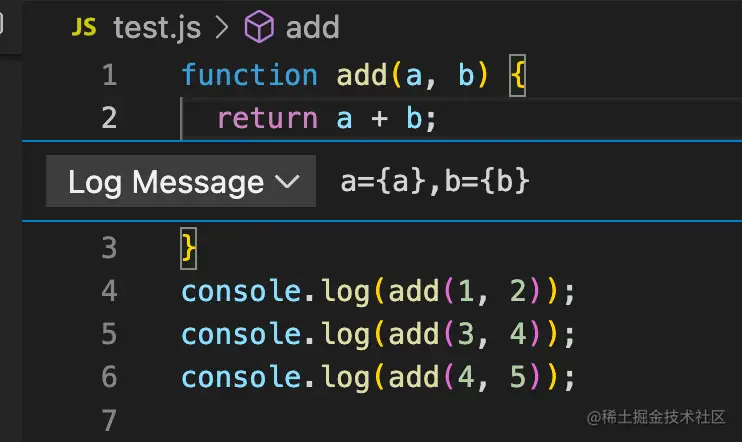

跑一下 node 调试，你会发现打印了日志，但没有断住：

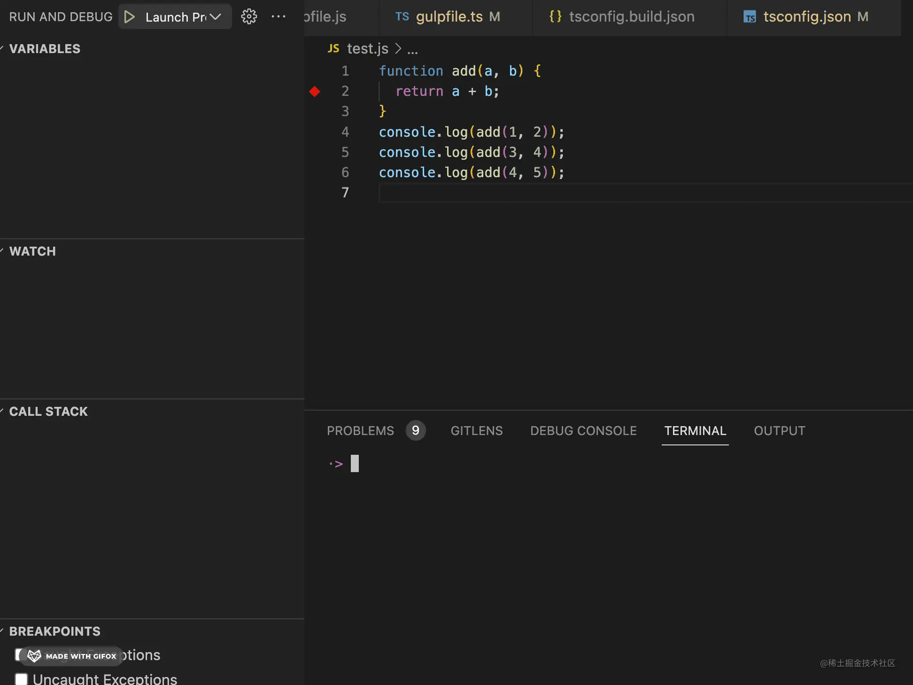

网页调试里也是支持 LogPoint 的：

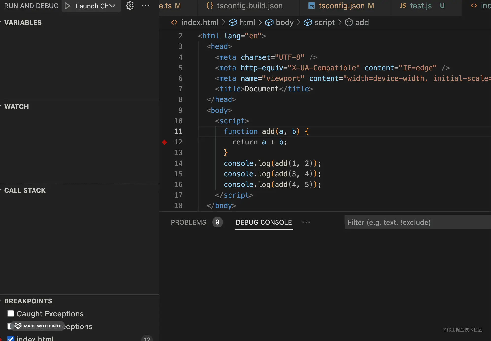

打印了调试用的日志，但没有污染代码，这不比 console.log 香么？

## DOM 断点

后面几种断点是网页里专用的，也是在特定场景下很有用的断点类型。

用 create-react-app 创建的 react 项目，有这样一个组件：

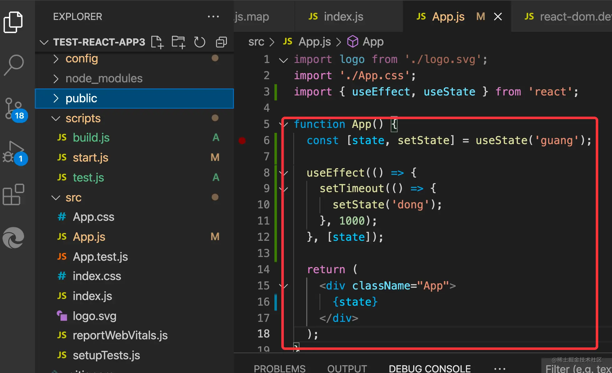

我们想知道 setState 之后是怎么修改 DOM 的，想在 DOM 被修改的时候断住，应该怎么做呢？

找到源码打断点么？

不熟悉源码的话，你根本不知道在哪里打断点。

这时候就可以用 DOM 断点了：

我先创建一个 chrome 调试配置，把网页跑起来：

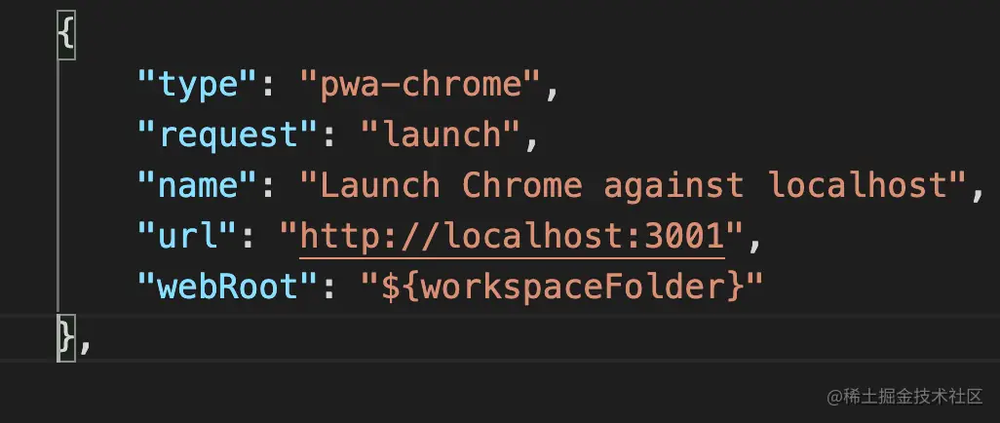

然后打开 Chrome DevTools，在 root 的节点上加一个 DOM 断点：

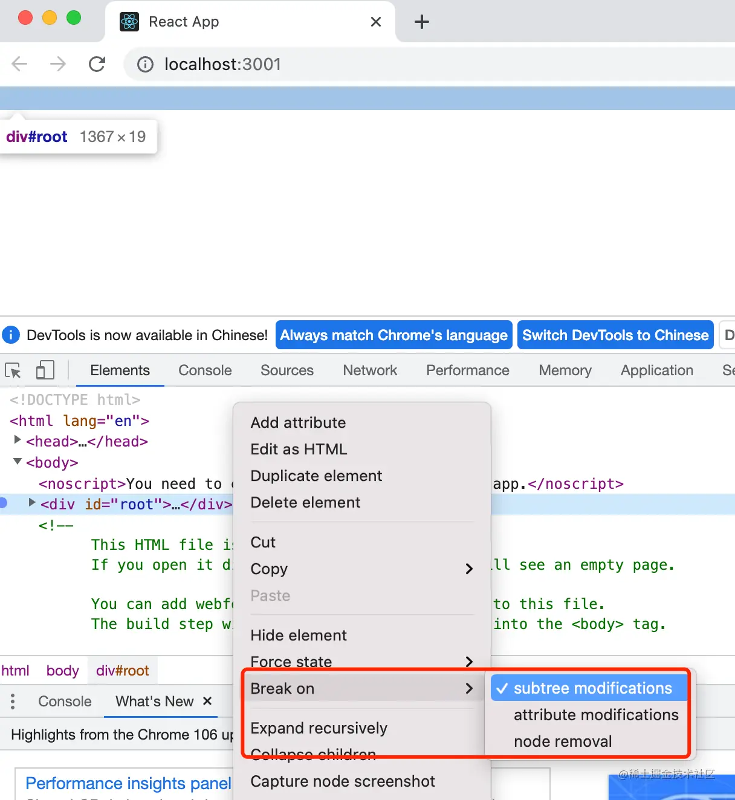

有三种类型，子树修改的时候断住、属性修改的时候断住、节点删除的时候断住。

我们选择第一种，然后刷新页面。

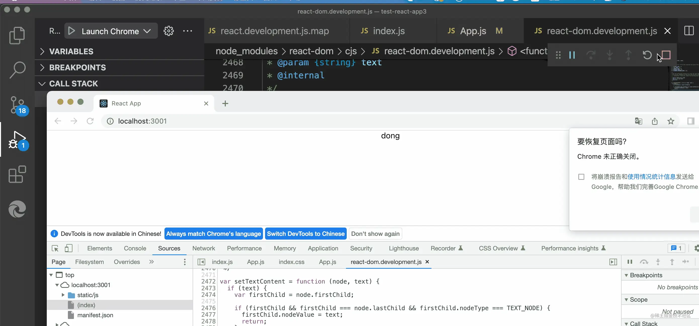

这时候你会发现代码在修改 DOM 的地方断住了，这就是 React 源码里最终操作 DOM 的地方，看下调用栈就知道 setState 之后是如何更新 DOM 的了。

当然这只是一种用途，特定场景下，DOM 断点是很有用的。

## Event Listener 断点

之前我们想调试事件发生之后的处理逻辑，需要找到事件监听器，然后打个断点。

但如果你不知道哪里处理的这个事件呢？

这时候就可以用事件断点了：

打开 sources 面板，就可以找到事件断点，有各种类型的事件：

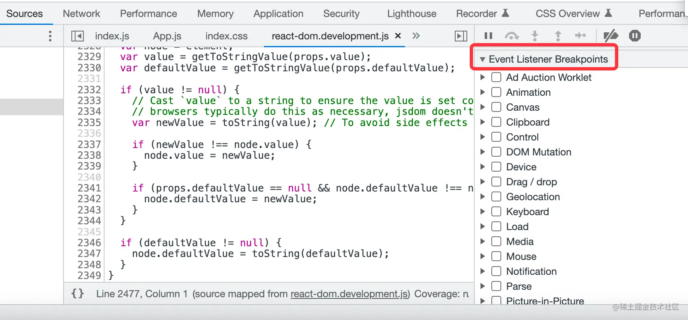

比如这样一段代码：

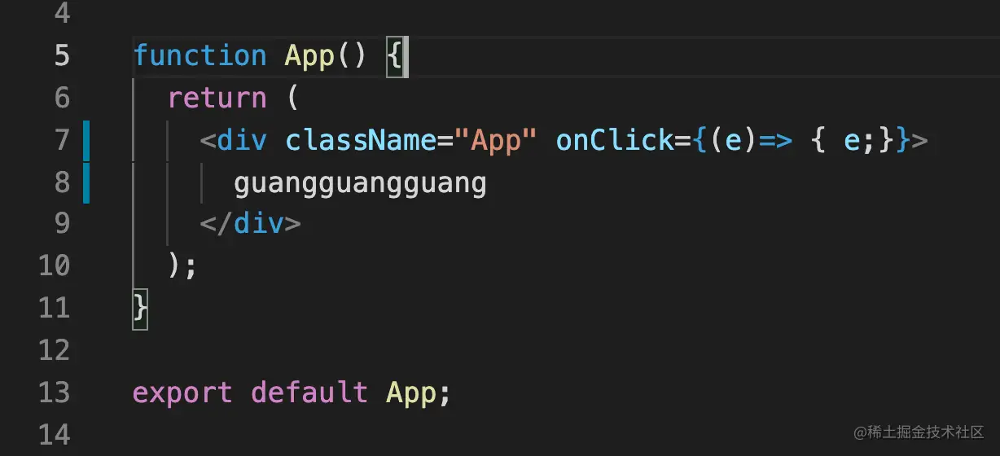

你找不到哪里处理的点击事件，那就可以加一个 click 的事件断点：

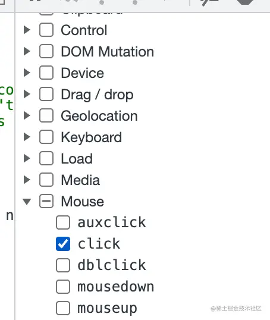

这时当你点击元素的时候，代码就会在事件处理器断住：

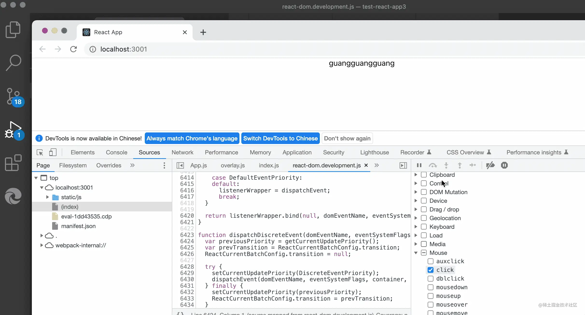

当然，因为 React 是合成事件，也就是事件绑定在某个元素上自己做的分发，所以这里是在源码处理事件的地方断住的。用 Vue 就可以直接在事件处理函数处断住。

## url 请求断点

当你想在某个请求发送的时候断住，但你不知道在哪里发的，这时候就可以用 url 请求断点

比如这样一段代码，你想在发送 url 包含 guang 的请求的时候断住，就可以使用 url 请求断点：

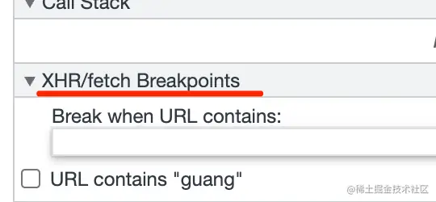

不输入内容就是在任何请求处断住，你可以可以输入内容，那会在 url 包含该内容的请求处断住：

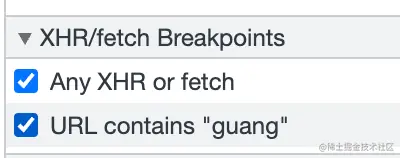

效果如下：

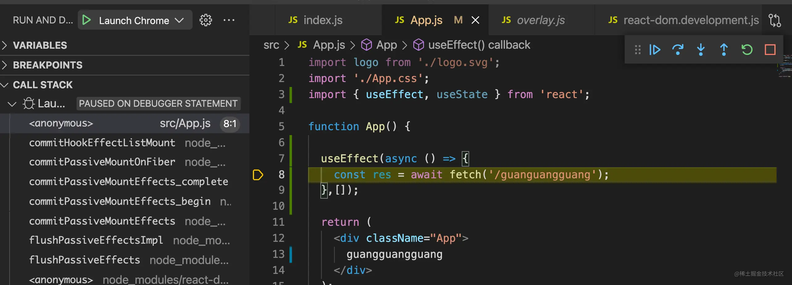

这在调试网络请求的代码的时候，是很有用的。

## 总结

很多时候我们想打断点却不知道应该打在哪里，这时候就要用其他的断点类型了：

- 异常断点：在抛异常处断住
- 条件断点：在满足某个表达式的时候断住
- 日志点：打印日志但不断住，觉得断住太多次的时候可以用这个
- DOM 断点：在 DOM 子树修改、属性修改、节点删除的时候断住
- Event Listenter 断点：在某个事件发生的时候断住
- url 请求断点：在发送 url 包含某内容的请求时断住

加上普通断点，一共 7 种。这些类型的断点在特定场景下都是很有用的，灵活运用这些断点，能大幅提升调试效率。
