# 28.面试必问的异步顺序问题，用 Performance 轻松理清

异步代码的执行顺序是前端面试必问的面试题，它主要考察对 Event Loop、宏微任务以及它们执行顺序的理解。

这类问题新手比较容易困惑，老手一不注意也容易掉坑里。

那理清这类问题，有没有什么好的办法呢？

还真有，就是通过 Performance 工具。

Performance 是 Chrome DevTools 内置的用来分析代码执行耗时的工具，它会记录每个函数、每个宏微任务的耗时，并且会把超过 50ms 的长任务标红，这样开发者就可以针对性的优化。

比如这就是一个长任务：

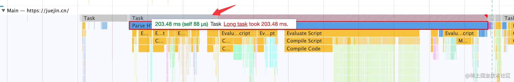

优化 js 运行性能的目标就是消除它。

但是今天我们不是用它来分析代码性能，而是用它来看宏微任务的执行情况。

我们准备这样一段代码：

```html
<!DOCTYPE html>
<html lang="en">
  <body>
    <script>
      Promise.resolve().then(() => {
        console.log('promise1');
        const timer2 = setTimeout(() => {
          console.log('timer2');
        }, 0);
      });
      const timer1 = setTimeout(() => {
        console.log('timer1');

        Promise.resolve().then(() => {
          console.log('promise2');
        });
      }, 0);

      console.log('start');
    </script>
  </body>
</html>
```
很常见的 Promise、setTimeout 混合的代码。

不着急分析它的执行顺序，我们用 performance 工具来看下。

用 npx http-server . 跑一个静态服务器

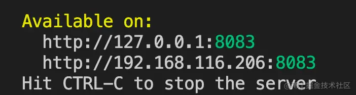

然后浏览器访问。

这里要用无痕模式来跑，不然插件啥的也是在同一个 Event Loop 运行，会影响分析结果。

点击 reload，录制几秒：

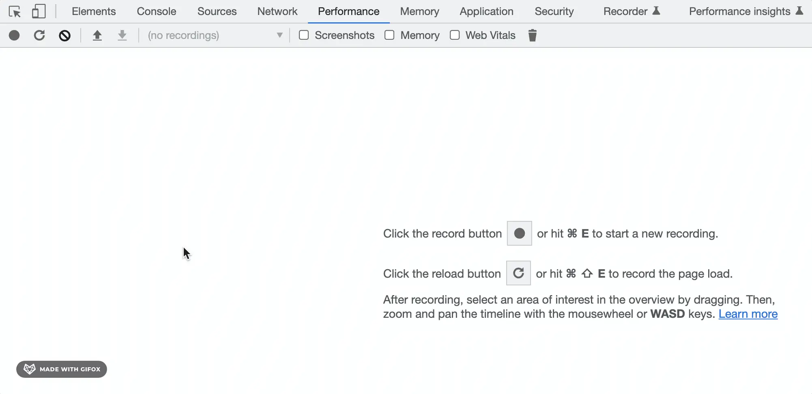

Main 的部分就是主线程，向下拖动放大就可以看到代码执行情况也就是 Event Loop 的详情。

你可能首先会注意到这些一个个很细的 task：

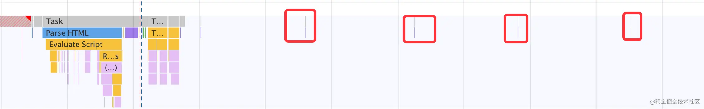

放大可以看到是渲染的 repaint：

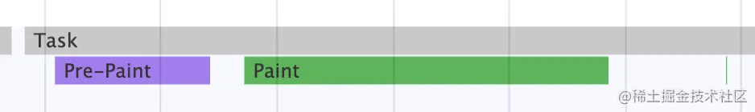

或者是 reflow 和 repaint：

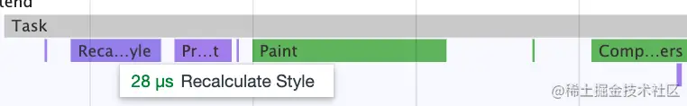

也就是重新计算样式和重新渲染的过程，这些是宏任务。

再往前，可以看到 parse html 的那个 task：

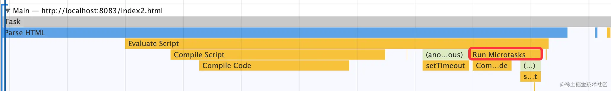

这就是我们的 js 代码执行的部分了。

还是可以看出是先执行了一些匿名代码，然后再执行的所有微任务，里面还有一些匿名代码。

怎么能让它更清晰一些呢？

首先，现在显示的太细了，火焰图的宽细代表了耗时，所以我们可以加点耗时逻辑。

比如这样：

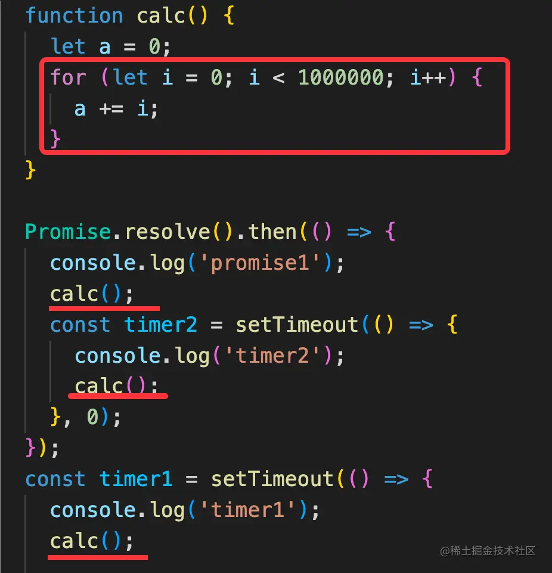

再重新录制一下，就这样了：

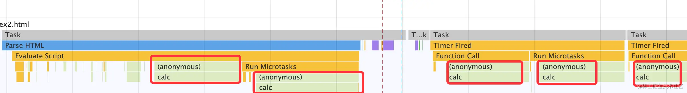

现在是不是就明显多了。

可以看到是执行了一个匿名函数，然后执行了所有微任务。

之后 timer 触发了一个宏任务，执行了一些匿名函数，然后执行所有微任务。

后面还有一个 timer 的宏任务。

虽然流程是看清了，但是匿名这块还是比较难受。

倒是可以点击查看详情，然后定位到对应的代码：

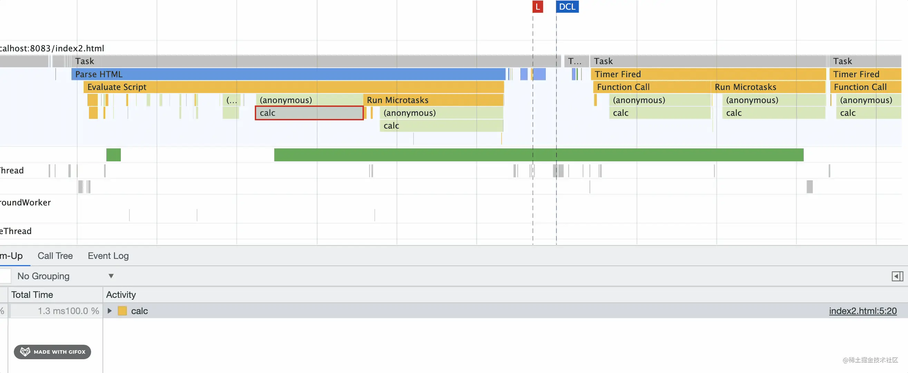

但还是不够直观。

那我们就加上一些有名字的函数吧。

就是这样，换成有名字的函数：

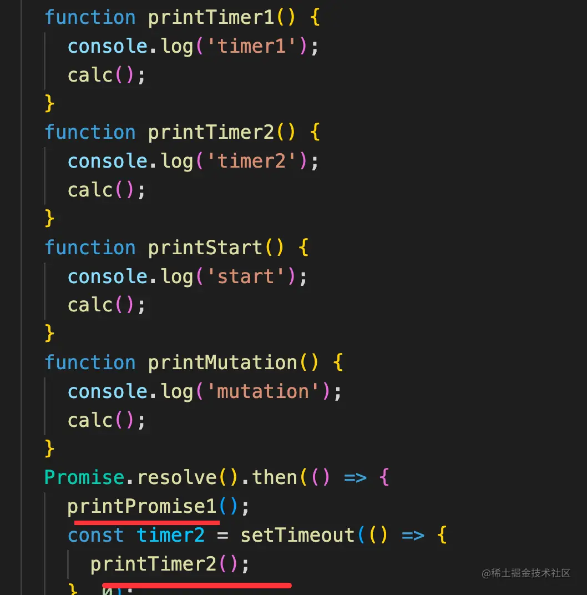

然后再分析：

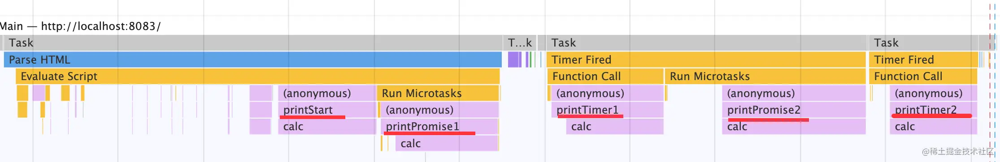

现在是不是就很清楚了。

然后再看下最开始这段代码：
```
Promise.resolve().then(() => {
    console.log('promise1');
    const timer2 = setTimeout(() => {
      console.log('timer2');
    }, 0);
});
const timer1 = setTimeout(() => {
    console.log('timer1');

    Promise.resolve().then(() => {
      console.log('promise2');
    });
}, 0);

console.log('start');
```
对照着 performance 分析出来的结果，就很容易理清宏微任务执行顺序了：

先执行同步代码，打印 start。

然后执行 Promise.then 微任务，打印 promise1。

再打印的是 timer1，因为那个 setTimeout 是在之前被放入任务队列的。

执行完 timer1 的宏任务再执行了 promise2 的微任务。

最后执行了 timer2 的宏任务。

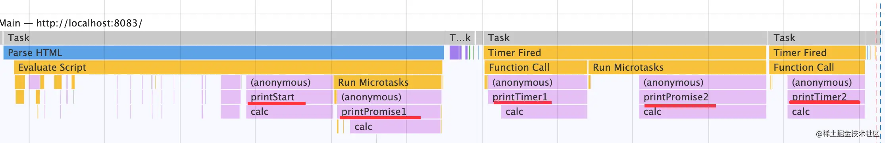

这样我们就通过 Performance 看到了真实的宏微任务的划分以及执行顺序。

当然，微任务不只是 Promise.then，比如 MutationOberser 也是：

MutationObserver 是监听 dom 变化的，比如属性、子节点等：

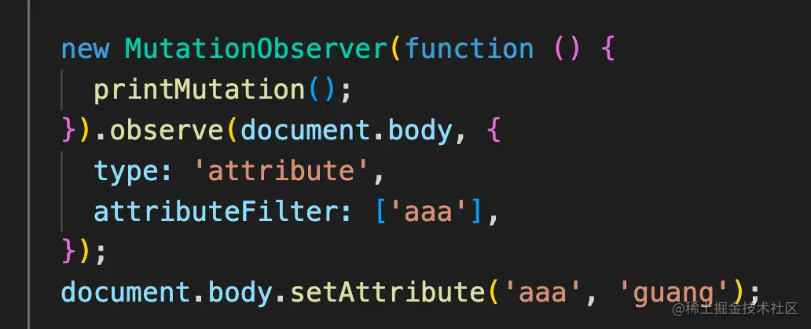

试一下：

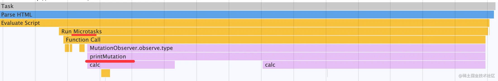

可以看到，MutationObserver 确实是微任务。

有的同学一直有疑惑，setTimeout 是宏任务我们知道，那 requestAnimationFrame 呢？

把 setTimeout 换成 rAF：

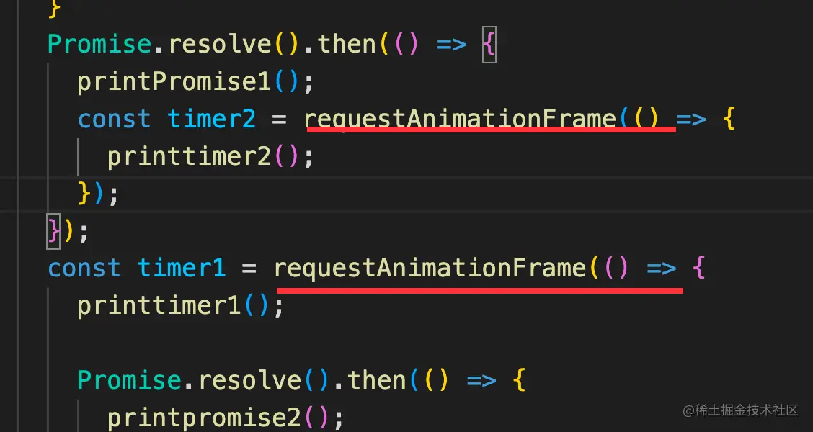

可以看到，rAF 也是宏任务：

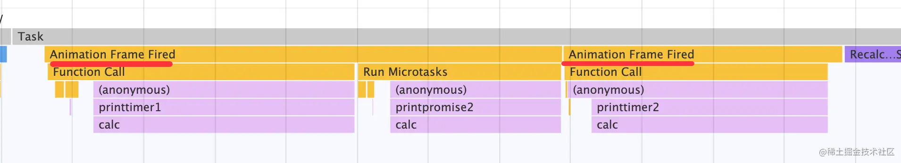

全部测试代码：

```html
<!DOCTYPE html>
<html lang="en">
  <body>
    <script>
      function calc() {
        let a = 0;
        for (let i = 0; i < 1000000; i++) {
          a += i;
        }
      }

      function printPromise1() {
        console.log('promise1');
        calc();
      }
      function printpromise2() {
        console.log('promise2');
        calc();
      }
      function printtimer1() {
        console.log('timer1');
        calc();
      }
      function printtimer2() {
        console.log('timer2');
        calc();
      }
      function printstart() {
        console.log('start');
        calc();
      }
      function printMutation() {
        console.log('mutation');
        calc();
      }
      Promise.resolve().then(() => {
        printPromise1();
        const timer2 = setTimeout(() => {
          printtimer2();
        }, 0);
      });
      const timer1 = setTimeout(() => {
        printtimer1();

        Promise.resolve().then(() => {
          printpromise2();
        });
      }, 0);
      new MutationObserver(function () {
        printMutation();
      }).observe(document.body, {
        type: 'attribute',
        attributeFilter: ['aaa'],
      });
      document.body.setAttribute('aaa', 'guang');

      printstart();
    </script>
  </body>
</html>
```
## 总结

异步代码执行顺序是前端面试必问的问题，这类问题可以通过 Performance 工具来轻松理清。

通过 Performance 工具可以看到代码执行的 Event Loop，包括宏微任务、执行时间等。

可以看到渲染、setTimeout、requestAnimationFrame 等是宏任务。Promise.then、MutationObserver 是微任务。

这些都是我们自己证实过的。

当你对某段代码的宏微任务顺序有疑惑，不妨就试试 Performance 工具吧，在分析宏微任务方面可以说是神器了。

