# 32.如何用 Layers 分析网页的图层

大家应该接触过图层的概念，可能是在一些设计软件里面，其实网页里也有图层。

用 Performance 分析页面运行流程的时候，你可能会主线程发现这样的任务：

回流、重绘、绘制，然后再合并图层。

下面还有 Compositor 线程，专门用来合并图层：

说明网页前面的绘制是在绘制在不同的图层上的。

为什么一个网页要分为不同的图层呢？

页面中的不同部分，重绘频率是不一样的，比如 video、canvas、动画这种就要高频重绘，而且现代浏览器都支持通过 GPU 做计算来加速渲染（硬件加速），怎么综合高频重绘和低频重绘、CPU 渲染和 GPU 渲染呢？

答案就是分成不同的图层，每个图层单独做自己的绘制，最后由 Compositor 线程把它们合并到一起。

那什么样式会新建图层呢？

大家可能听过用 3D transform 会新建图层，用 will-change 会新建图层等等，但是是否真的新建了图层心里并没底。

其实这个也是有工具可以分析的，就是 Layers 工具。

在 more tools 里开启 Layers：

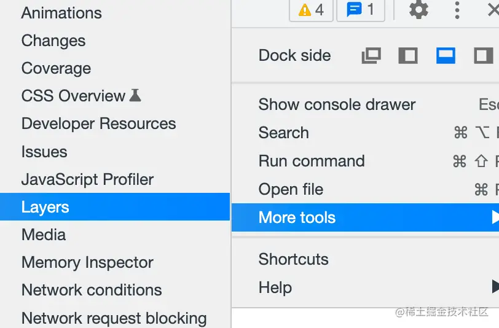

就可以看到所有的图层，就是被黑框框出的那些：

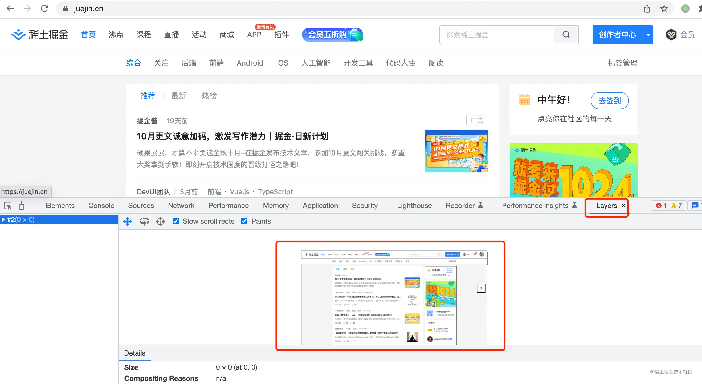

选中某一个图层后，会展示图层的详细信息：

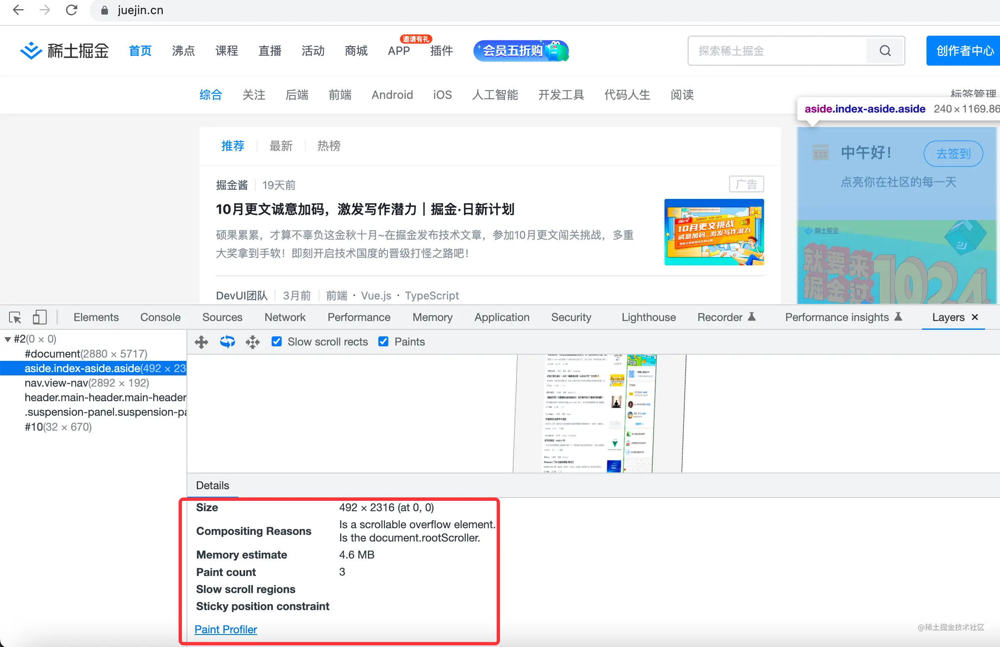

图层大小、创建图层的原因、内存估计等。

点击下面的 Paint Profiler 可以看到这个图层绘制的过程：

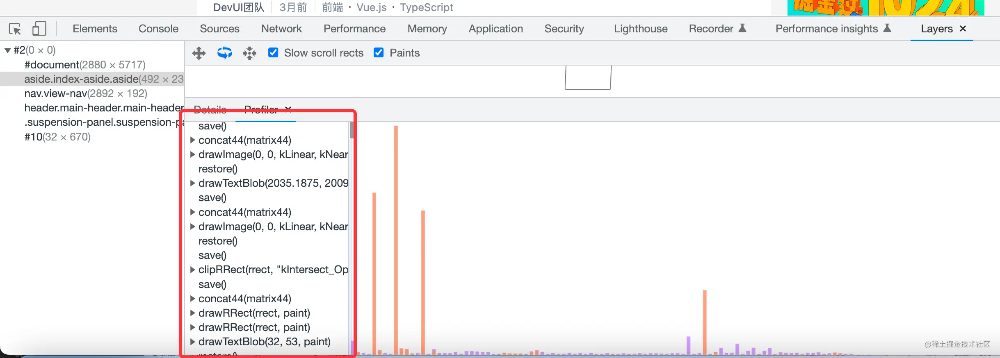

你会看到一些类似 canvas 的 api，这就是浏览器实现网页渲染的底层流程。这个我们不大需要关注。

Layers 工具最有用的是可以分析图层创建的原因，不过 Chrome DevTools 里图层创建的原因做的不大好，推荐更好有用的一个工具 Safari DevTools 的 Layers：

## Safari DevTools 的图层分析工具

首先，Safari 的 DevTools 要在 偏好设置 > 高级 里手动开启下，：

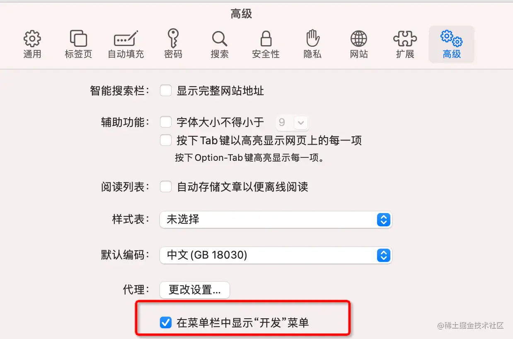

打开 DevTools，这个层就是用于图层分析的：

还是以掘金为例：

中间区域展示的就是页面中的图层。

右边的三个按钮分别是**显示图层边框、启用绘图闪烁，显示页面中所有的层**，都勾选上。

**显示图层边框**就是会给每个图层加上绿色边框，可以直观地看到有哪些区域是在单独的图层渲染的。

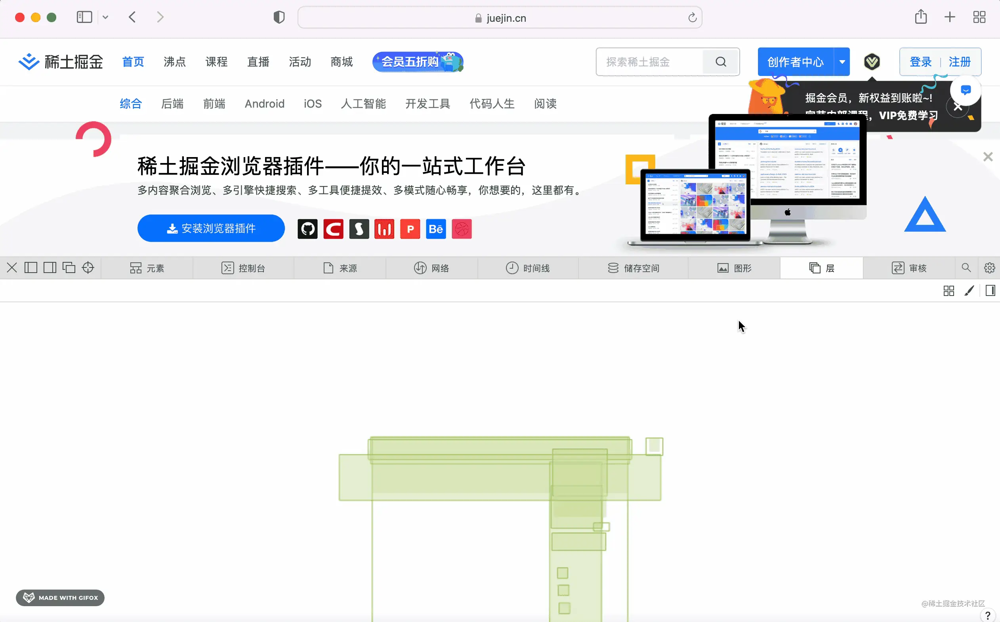

**启用绘图闪烁**就是在每帧渲染都会闪一下，能直观看出哪块做了新一帧的渲染。

**显示页面中所有的层**会在右边列出页面中所有的图层，可以看到页面上有 19 个图层。

而且点击图层可以看到每个图层创建的原因：

比如 html，是因为是根元素创建的图层。

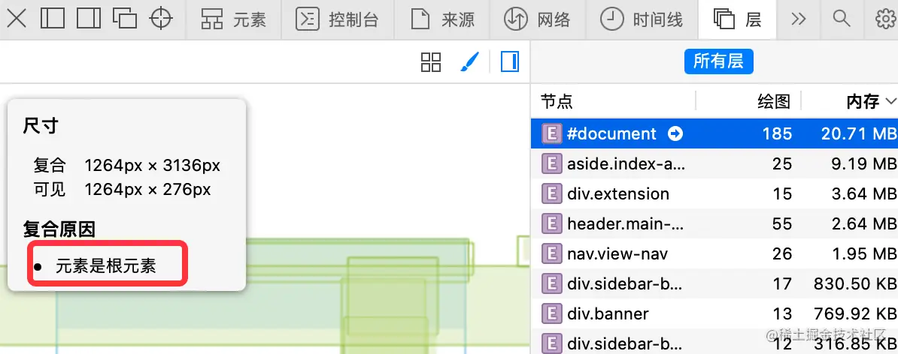

导航栏是因为 2 个原因创建的图层：元素有 3D 转换，有 position:fixed 的样式。

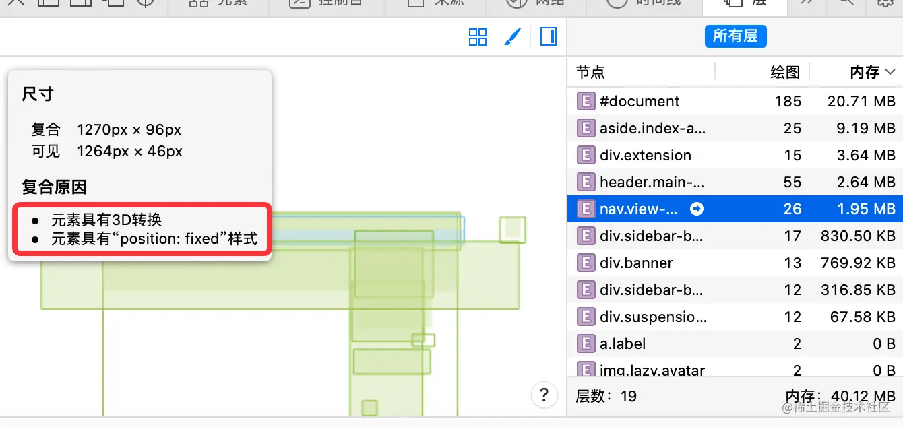

3D 转换会创建图层是因为会专门用 GPU 做计算和渲染；position：fixed 会创建图层是因为脱离了文档流。

好像 will-change 导致的图层新建并没有？

那么我们试一下，我们找个元素加上 will-change 的样式：

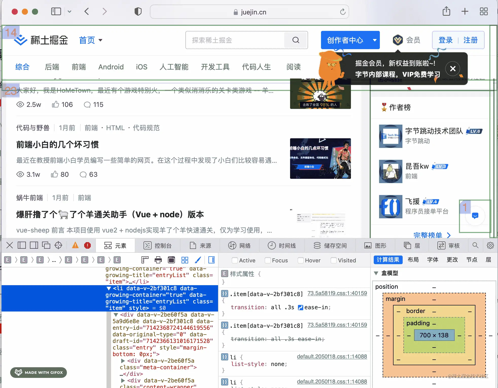

看，绿框了，这说明新建了图层，我们去 Layers 看下原因。

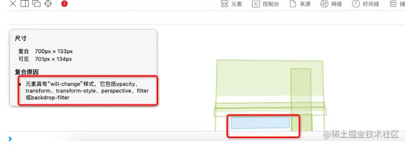

创建图层的原因就是 will-change。

如果层这里没更新，关掉再打开层就好了：

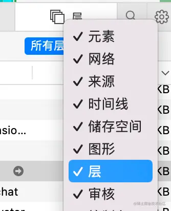

will-change 只有 opacity、transform、transform-style、perspective、filter、backdrop-filter 这 6 个属性值的时候才会新建图层。

这些都不用记，用 Safari Devtools 可以直接把图层分析出来并给出原因。

而且图层之间的上下关系也可以直观的看出来：

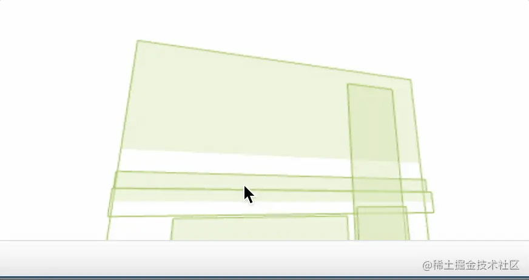

## 总结

页面的绘制是分成多个图层的，因为不同部分重绘频率不同，而且有的部分还是用的 GPU 渲染，所以网页用的是绘制在多个图层，然后合并的方式。

用 Performance 工具也可以分析出这个过程，而且可以看到专门用于图层合并的 Compositor 线程。

Chrome DevTools 和 Safari DevTools 都有 Layers 工具，Safari DevTools 的更好用一些，可以显示中文的图层创建的原因。

如果你需要优化渲染的性能，就需要把一些高频绘制的区域移到单独的图层里，比如加 will-change 属性，这时候就可以通过 Layers 工具来分析了。

