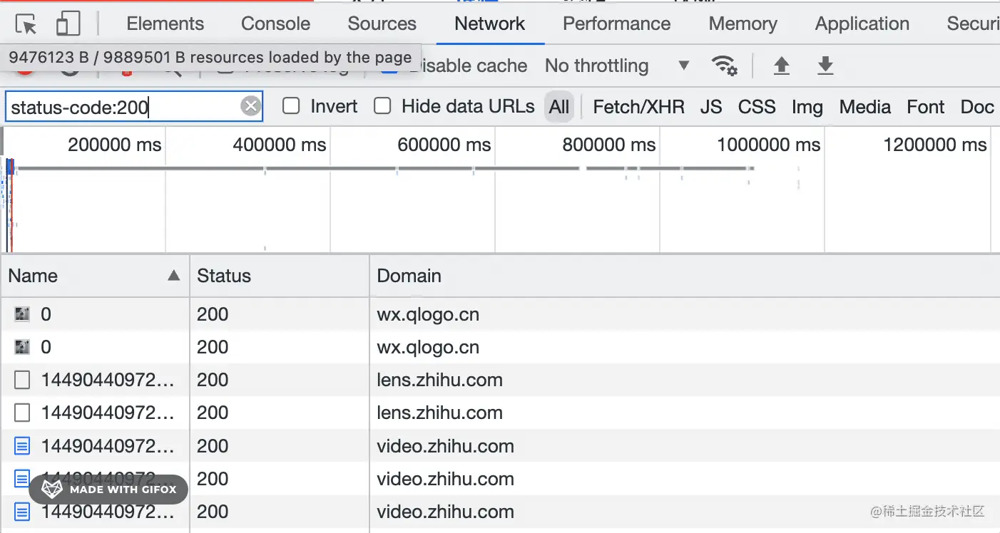

# 33.Chrome DevTools 小功能集锦

Chrome DevTools 有很多有用的小功能，这节就专门梳理一下这个：

## reply XHR

当你想重新发送一次 XHR 请求的时候，不用刷新页面，直接点击 replay XHR 即可：

## 请求定位到源码

当你想知道某个请求是在哪里发的，可以打开 Network 面板，在每个网络请求的 initiator 部分可以看到发请求代码的调用栈，点击可以快速定位到对应代码。

## 元素定位到创建的源码

当你想知道某个元素的创建流程，可以通过 Elements 面板选中某个元素，点击 Stack Trace，就会展示出元素创建流程的调用栈。这可以帮你理清前端框架的运行流程。

这个功能是实验性的，需要手动开启下：在 settings 的 expriments 功能里，勾选 “Capture node creation stacks”。

## group by folder

网页加载的文件默认是按照域名和目录组织的，找文件时一层层找起来比较麻烦。

这时候可以切换为平铺的，会按照 js、css、图片的顺序列出来，找某个文件就容易多了：

## Network 自定义展示列

Network 是可以修改展示的列的，比如我勾选 Cookie 和 Set-Cookie：

就会在 Network 列表里展示这两列：

这两列啥意思呢？

Set-Cookie 的意思就是这个请求的响应会设置几个 cookie。

点开请求的详情确实是这样的：

Cookies 的意思就是说这个请求会携带几个 cookie：

比如那个携带 17 个 cookie 的请求：

不用数，肯定是 17 个。

除此以外，你还可以自定义展示的响应 header：

我比较常用的是 Cache Control：

可以快速查看每个文件的缓存策略：

请求列表右边有个 waterfall，默认是展示请求的时间，但我觉得这个没啥用，我更喜欢看请求响应的耗时：

所以我会把它换成 total duration：

这样 waterfall 展示的就是耗时了：

可以直观的看到请求的耗时，还可以排序。我觉得这个数据有用的多。

## 代码手动关联 sourcemap

sources 面板可以右键点击 add soruce map，输入 sourcemap 的 url 就可以关联上 sourcemap，当调试线上代码的时候可以用这种方式关联源码。

## filter

一个网站会有很多的请求，当你想查找某个请求的时候，是怎么过滤的呢？

关键词搜索么？

但是关键词搜索只能根据 url 来过滤。

很多时候这样不太够。

比如我想搜索视频类型的请求，根据 url 怎么过滤？比如我想搜索大于 1M 的请求，根据 url 怎么过滤？

这时候就可以用过滤器功能了。

输入 mime-type，加个冒号，Chrome DevTools 就会列出当前网页的请求的所有 mime type，选择某一种，就会过滤出那种 mime type 的请求。

比如过滤 mp4 请求：

过滤 webp 请求：

或者不根据 mime-type，根据资源的大致分类来过滤：

输入 resource-type，加个冒号或者按右方向键，会展示出所有的资源分类，包括 document、stylesheet、image 等：

其实这就是 Network 的这部分：

而且还可以按住 command 键多选。

除了资源类型外，还可以根据状态码过滤：

比如 200、404、500 等，只是我测试的这个页面没有 404 之类的请求。

状态码 0 代表被删除或取消的请求，网络请求是可以被取消的，这种就可以通过状态码 0 来过滤。

此外还可以根据资源的大小来过滤：

通过 larger-than 指定 100、300k、2M 等大小的限制，就可以过滤出大小大于这个值的请求。

还可以根据请求方式，是 GET、POST 等来过滤：

根据是否包含某个响应 header 来过滤：

has-response-header:Set-Cookie 过滤出来的就是有设置 cookie 的响应的请求

has-response-header:access-control-allow-origin 过滤出来的就是支持跨域的请求

根据是否包含某个 cookie 来过滤：

常用的过滤器主要有这些：

- has-response-header：过滤响应包含某个 header 的请求

- method：根据 GET、POST 等请求方式过滤请求

- domain: 根据域名过滤

- status-code：过滤响应码是 xxx 的请求，比如 404、500 等

- larger-than：过滤大小超过多少的请求，比如 100k，1M

- mime-type：过滤某种 mime 类型的请求，比如 png、mp4、json、html 等

- is：过滤某种状态的请求，比如 from cache 从缓存拿的，比如 running 还在运行的

- resource-type：根据请求分类来过滤，比如 document 文档请求，stylesheet 样式请求、fetch 请求，xhr 请求，preflight 预检请求

- cookie-name：过滤带有某个名字的 cookie 的请求

当然，这些不需要记，输入一个 - 就会提示所有的过滤器：

但是这个减号之后要去掉，它是非的意思：

和右边的 invert 选项功能一样。

而且，这些过滤器都可以组合，只要中间加个空格就行。

但是有同学会问了，这些过滤器里好像不支持根据内容过滤呀。

确实，过滤器不支持这个，但是可以自己搜：

## developer resources

看到 sourcemap 有的同学可能会问，对了，sourcemap 文件为啥在 Network 里看不到呢？

明明会下载 sourcemap 文件，为啥我从来没看到过呢？

其实这个被 Network 过滤掉了，想看到这些文件的请求在另一个地方：

点击 show console drawer：

打开 developer resources:

就可以看到所有的 sourcemap 请求了：

只不过这部分做的很简陋，只能看 sourcemap 文件请求成功、失败之类的。

## remove event listeners

element 面板选中元素可以看到这个元素和它的父元素的所有事件监听器：

可以手动 remove。

比如你想看下拉菜单的样式，但是鼠标一移开就消失了

这时候你可以删掉这个按钮的 mouseleave 事件的监听器：

这样移开鼠标也不会消失了：

## 

## 总结

这节梳理了比较有用的 Chrome DevTools 小功能，学会这些小功能的使用能提升调试网页的效率。