# 38.如何远程调试 android  移动端网页

作为前端开发，我们每天都会用 Chrome DevTools 调试 Chrome 的网页，但其实它还可以远程调试安卓手机的网页。

那 Chrome DevTools 如何远程调试安卓网页呢？它的实现原理是什么？

今天我们就来了解一下：

## 远程调试安卓网页

用数据线把安卓手机和电脑连接起来，在手机设置里打开 USB 调试：

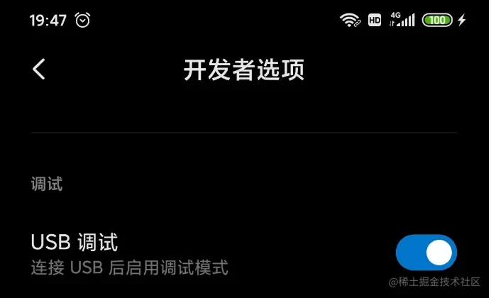

然后在 chrome 打开 chrome://inspect 页面，勾选 Discover USB devices（默认是勾选的）：

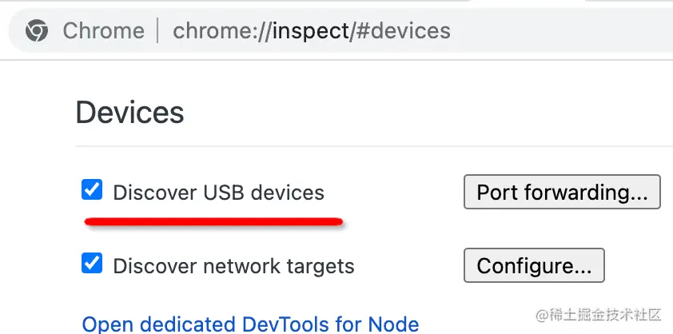

这时候下面就会出现一个提示：请在设备上接受 debugging 会话

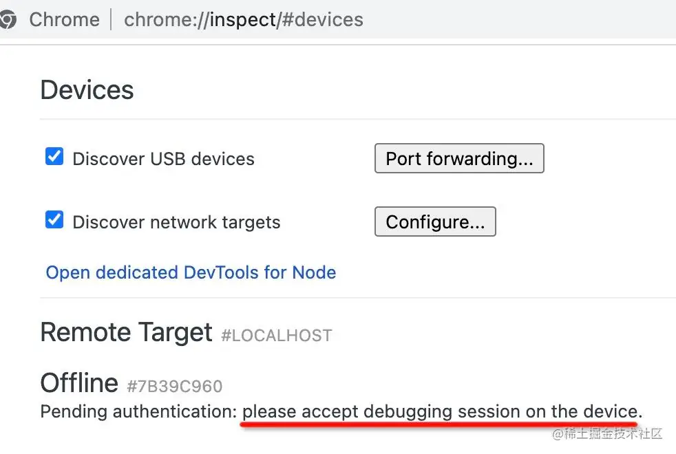

在手机上点击确定，就会建立调试会话：

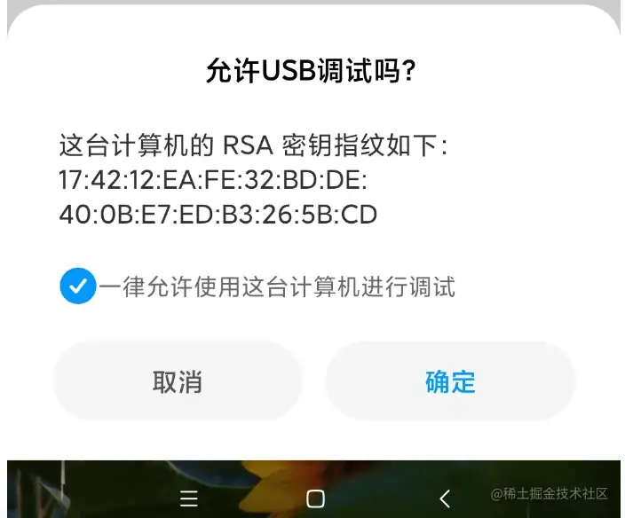

下面就会列出所有可以调试的网页：

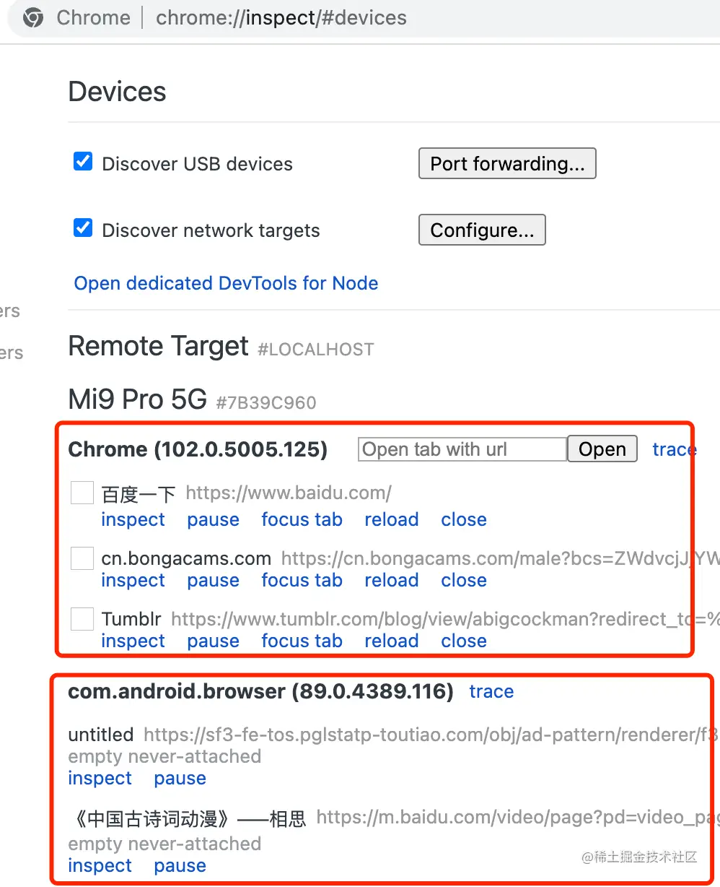

浏览器里的网页，或者 APP 调试包的 webview 的网页都会列出来。

点击 inspect 就可以调试了：

可以审查元素：

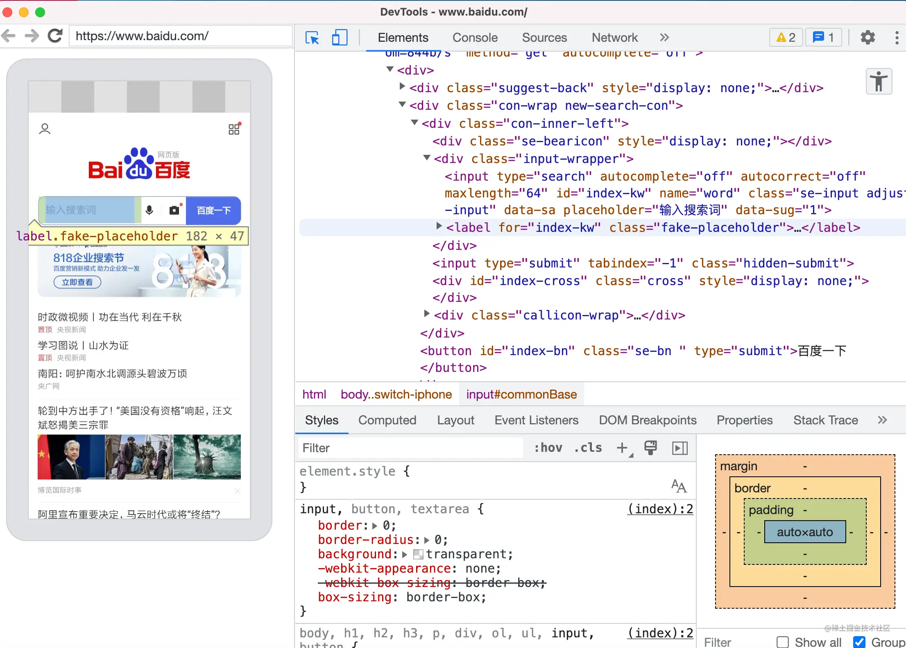

可以打断点：

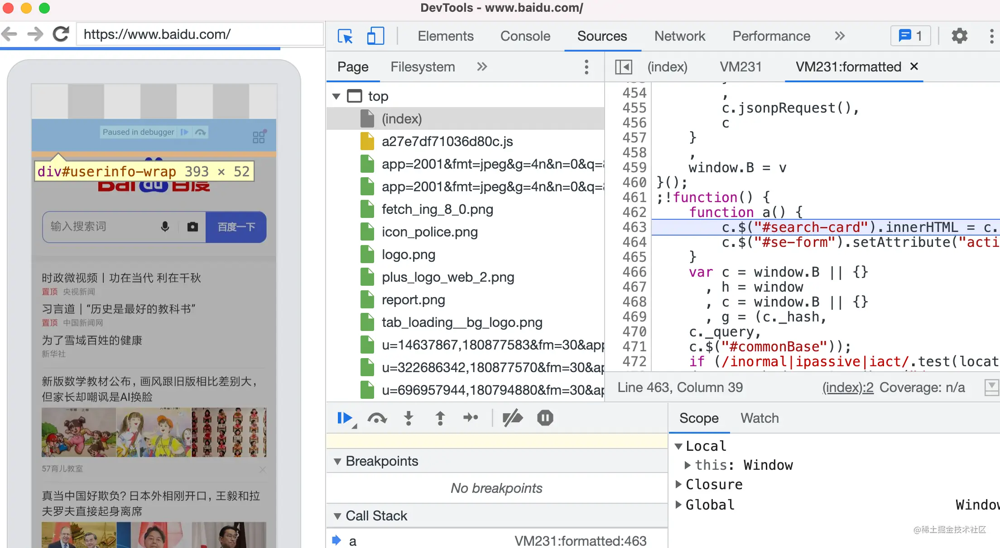

也可以用 Performance 分析性能：

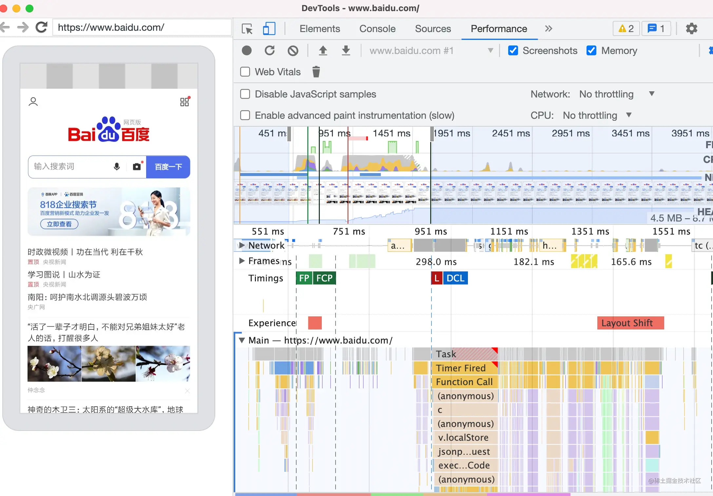

各种调试 PC 网页的功能基本都支持。
这样就可以愉快的调试安卓的移动端网页了。

不过这个过程你可能会遇到这样的问题，打开的窗口是空白的或者是 404:

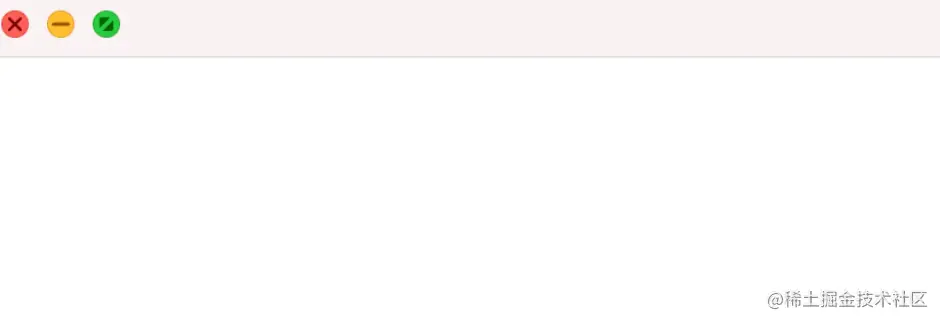

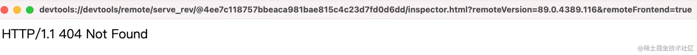

这是因为调试的目标可能是任意 chrome 版本，那么 Chrome DevTools 自然也要用相应的版本才行，所以就需要动态下载。

而动态下载的 devtools 网页是在 google 域名下的，需要科学上网才行。

科学上网之后，就可以正常的下载 Chrome DevTools 来做调试，也就不会白屏或 404 了。

但也不是每次都要科学上网，一个调试目标只需要下载一次 Chrome DevTools 的代码，之后就可以一直用了。

我们了解了 Chrome DevTools 怎么调试安卓的网页，那它的原理是什么呢？

## Chrome DevTools 的原理

Chrome DevTools 被设计成了和 Chrome 分离的架构，两者之间通过 WebSocket 通信，设计了专门的通信协议： Chrome DevTools Protocol。

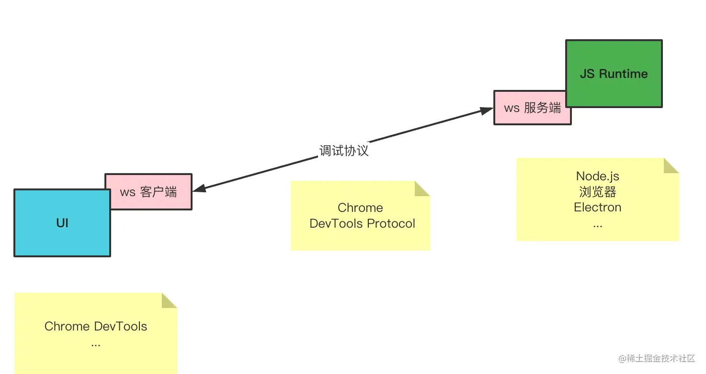

这样只要实现对接 CDP 协议的 ws 服务端，就可以用 Chrome DevTools 来调试，所以 Chrome DevTools 可以用来调试浏览器的网页、调试 Node.js，调试 Electron 等。

那自然也就可以远程调试安卓手机的网页了，只要开启了 USB 调试，那手机和电脑就可以做网络通信，从而实现基于 CDP 的调试。

这个 CDP 的调试协议是 json 格式的，如果想看它传输了什么也是可以的：

在 Chrome DevTools 的设置里开启 Protocol Monitor：

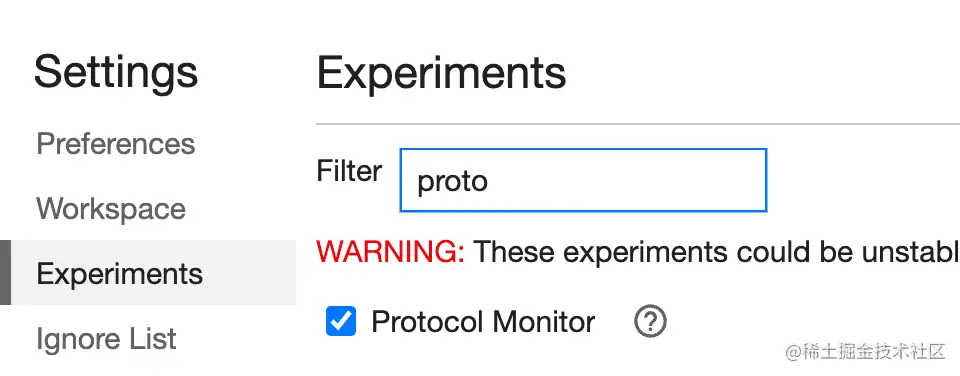

然后在 more tools 里打开 Protocol Monitor 面板：

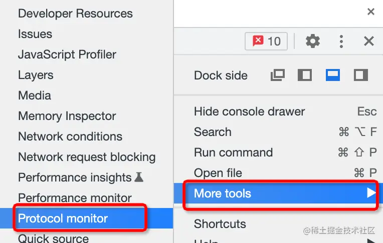

然后你就可以在 Protocol Monitor 面板里看到所有的 CDP 协议的数据交互了：

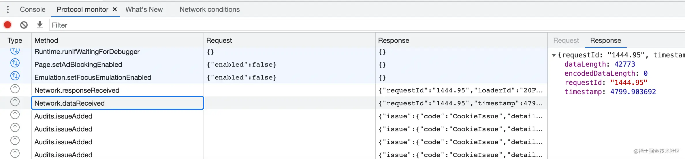

这就是调试的实现原理。

那如何知道哪些界面是网页，哪些是原生绘制的呢？

Android 下可以在设置里打开显示布局边界：

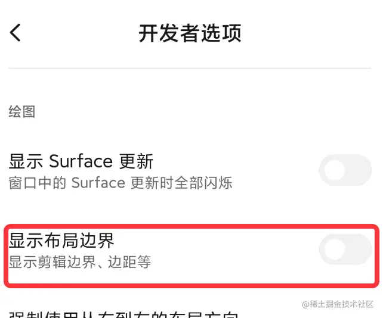

如果是原生的组件，就会显示边框：

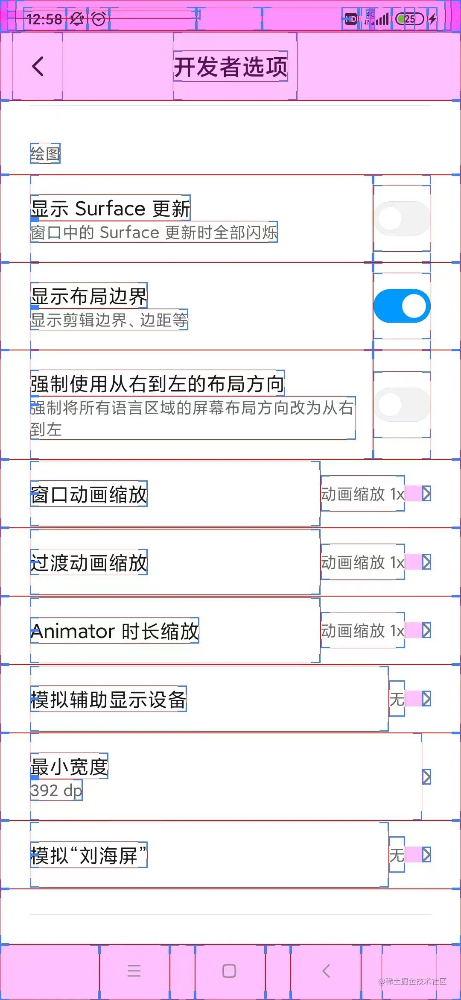

而没有边框的，就是网页。比如钉钉的这个界面：

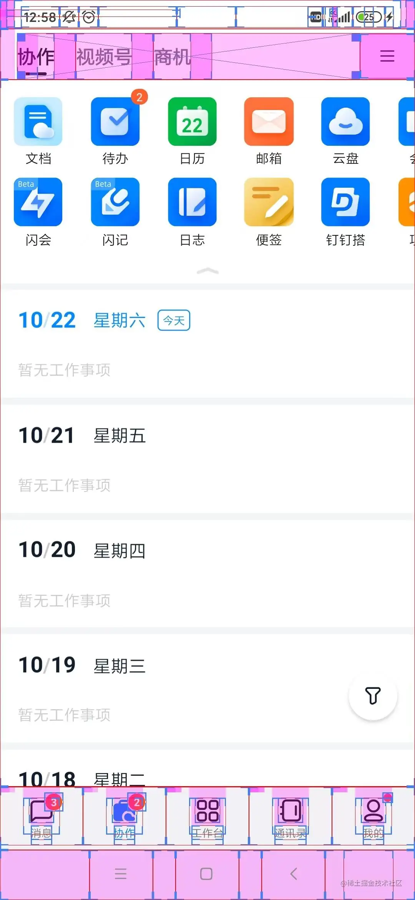

## 总结

Chrome DevTools 和 Chrome 是分离的架构，两者通过 WebSocket 通信，通信协议是 Chrome DevTools Protocol，可以在 Protocol Monitor 里看到 CDP 的数据交互。

因为这样的实现原理，Chrome DevTools 可以调试很多目标，其中就包括 USB 设备。

打开 USB 调试之后，在 chrome://inspect 页面就可以看到可调试的网页了，点击对应的网页就可以调试。

要注意的是调试的目标浏览器要和用的 Chrome DevTools 版本一一对应才行，所以第一次调试会先下载 Chrome DevTools，这需要访问 google 的域名，如果没有科学上网，会有白屏和 404 的问题。

理解了调试的原理，Chrome DevTools 调试安卓网页的流程，就可以愉快的远程调试安卓手机的网页了。
