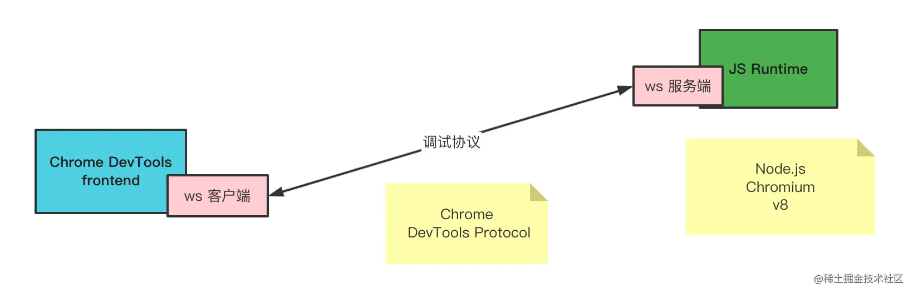

# 39.远程调试移动端网页的原理

前两节我们学习了用 chrome 远程调试安卓移动端网页，用 safari 远程调试 ios 移动端网页：


那他们是怎么实现呢？

首先，我们知道调试是 client server 的架构，比如 chrome 会使用 CDP 协议来传输数据。



传递的 CDP 数据可以通过 Protocol monitor 看到：


pc 端是这样，移动端也是这样，只不过传递协议数据的方式不大一样。

要想起一个有 CDP server 的浏览器，需要单独指定一些参数。

pc 端是跑 chrome 的时候带上 remote-debugging-port 参数，类似这样：

```
/Applications/Google\ Chrome.app/Contents/MacOS/Google\ Chrome --remote-debugging-port=9222
```
然后就可以连上这个端口进行调试了，不管你是用 chrome devtools 还是 vscode debugger 或者其余的 frontend UI。

那移动端呢？

自然也是一样的，要开启调试模式才有这个 CDP Server 可以连接。

andorid 的 app 里面的 weview 需要类似这样的方式开启调试：

```javascript
// Android 4.4 以上 WebView 才真正使用 Blink 内核，所以需要在此版本及以上系统。
if (Build.VERSION.SDK_INT >= Build.VERSION_CODES.KITKAT) {
    WebView.setWebContentsDebuggingEnabled(true);
}
```
所以你想调试 app 里网页的话，让移动端开发给你一个调试包即可。

有了 CDP Server 的标志就是你访问 9229 端口的 /json 是可以看到所有页面的 websocket 地址的：


每个页面就可以连接对应的 ws 服务端来进行 CDP 协议数据的交换，实现调试。

那问题来了，pc 端怎么访问移动端的页面呢？

有两种方式，第一种是通过 USB，连上 USB 之后就可以使用 android 的 adb 工具来转发端口：

```
adb forward tcp:9229
```

之后就可以进行通信，自然也就可以调试了。


ios 下也有类似的工具。

当然，也可以通过 wifi 的方式，只不过这种就需要单独起一个 ws 服务做转发了。


这个 ws 服务做的事情比较简单，就是原封不动转发了下 CDP 数据。

这样就能实现 wifi 调试，扫码调试等功能。

这就是远程调试移动端网页的原理。

最后，android 这个实时看到移动端网页的界面是怎么实现的呢？


其实就是一帧帧截图实现的。

CDP 协议里有这样一个传输 base64 的截图数据的事件：


## 总结

我们可以通过 chrome、safari 调试移动端的网页，原理就是开启调试模式之后，可以通过 CDP server 和 client 进行通信，从而实现调试。

pc 端开启调试只要指定 remote-debugging-port 的启动参数即可，而移动端则需要指定 webview 的参数。

可以通过 USB 调试，是因为 adb 做了端口转发，也可以通过 wifi 调试，这种就需要自己实现一个 ws 服务做中转了。

理解了远程调试的原理，当你再用各种移动端网页调试工具、小程序调试工具、跨端调试工具等，心里就有底了。
