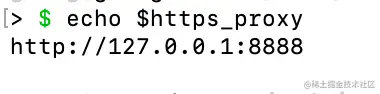

# 42.Charles 全功能速通（下）

上节学了常用的代理功能，这节我们来学其他的 charles 功能：

## DNS Spoofing

在本地准备一个 index.html，然后 npx http-server . 来跑一个静态服务器：


浏览器访问下：


执行 sudo vim /etc/hosts 修改 hosts 文件，添加一条 www.guangguangtest.com 到 127.0.0.1 的映射：


之后就可以用这个域名来访问了：


（如果你把科学上网的工具设置为系统代理，hosts 可能就不生效了，关掉即可）

除了浏览器，在 Terminal 也是可以通过 curl 访问的：


ping 也能 ping 通：


charles 也有这个功能，叫做 DNS Spoofing（DNS 欺骗），在 Tools > DNS Spoofing 开启：


它的功能和 hosts 类似：


比如我配置了 www.guangguangtest2.com 的域名到 127.0.0.1 的映射，之后就可以浏览器访问这个域名了：


但在 Terminal 还不行：


为什么呢？

因为 DNS Spoofing 生效的前提是走了 charles 代理呀！

在浏览器里可以通过 SwitchyOmega 的插件切换代理，那命令行里怎么切换呢？

可以通过设置这个环境变量：

```
export https_proxy=http://127.0.0.1:8888 http_proxy=http://127.0.0.1:8888
```

设置之后执行 echo $https_proxy 就可以看到它的值：



这个端口就是 charles 代理服务的端口，可以在 Proxy > Proxy Settings 里设置：


之后在命令行里的 http、https 请求，也会走 charles 代理：


curl 可以走代理，但是 ping 不会：


因为 charles 只有 http、https 请求会走 charles 代理，这是和配置 hosts 的区别。

那如果不想用代理了，怎么取消呢？

通过 unset 去掉这个环境变量即可：


这就是 DNS Spoofing 功能，相比改 hosts 更便捷一些。

## Client Process

charles 可以展示发送 http 请求的 url。

在 Tools > Client Process Settings 开启：


开启之后可以在 notes 看到发送请求的客户端进程：


这个 google chrome helper 就是网页的一个渲染进程：

在进程管理器里也可以看到：


在终端设置为 charles 代理之后，之后的 http 请求也会被 charles 捕获到：


这时候也可以看到对应的客户端进程：


我们主要是调试网页用，所以这个功能倒是用的不多。

## Compose

能不能用 charles 手动发送请求呢？就像 postman 那样。

可以的，这就是 compose 功能。

点击 Tools > Compose New，创建一个 www.guangguangtest.com:8081 的请求：


然后编辑请求的内容，可以修改 header、body 等：


点击 execute 来发送请求，就可以看到刚才这个请求的响应了：


我们再来构造个 post 请求，修改 header、query、body 等：


点击 execute 就可以看到这个 post 请求了：


除了创建新的请求外，也可以直接修改已有的请求，也就是 compose：


这里变成钢笔就代表在 compose 中：


修改完点击 execute 就可以发送请求，也可以点击 cancle 来取消 compose。

## Repeat

可以 Tools > Repeat 或者右键请求然后点 Repeat 来重发请求：


如果想重发 n 次呢？这可以用高级 repeat 功能。

在 Tools > Advanced Repeat 里开启：


比如重复 10 次、两个并发，重复间隔为 1000ms，在新的 session 里展示结果。

效果是这样的：


可以用来测试接口。

## Throttle

这个是模拟慢速的请求用的，点击这个乌龟的图标开启：


或者在 Proxy > Start Throttling 开启。

当然，一般我们只需要对某些域名开启 throttle，可以在 Proxy > Throttle Settings 里设置：


下面可以做更详细的速率设置。

## Web Interface

charles 也支持通过 web 网页来控制，在 Proxy > Web Interface Settings 里开启：


可以支持匿名访问，也可以设置用户名和密码访问。

这这里可以做一些功能的开启和关闭：


有同学说，不是已经有客户端了么？

本地确实没啥必要用这个，但是远程控制的时候，就可以通过 web interface 了。

## Focused Hosts

charles 默认展示全部的 url：


我们想找 juejin.cn 的请求的话可以过滤：


也可以通过 View > Focused Hosts 来设置关注的域名：


这样  charles 就会把其他的域名的请求折叠起来：


也可以在请求上右键开启：


## Highlight Rules

还可以给不同的 url 指定不同的颜色。

在 View > Highlight Rules 开启：


效果如下：


更有用的是可以根据条件来高亮，比如我设置所有 Set-Cookie 的 header 不为空的响应都设置黄色。


这样所有响应有 Set-Cookie 的 header 的请求都高亮了：


和 Chrome DevTools 里的 has-response-header 过滤器类似：


但是这个可以过滤的更多。

## find 

find 是搜索功能，可以在 session、选择的 url 或者某个 url 的请求里搜索。

在 Edit > Find 里开启：


比如我选中 juejin.cn，然后在里面搜索 guang：


右键有个 find in 功能，这个就是在某个 path 内搜索：


还可以指定搜索 url/header/body。

## External Proxy

访问国外的网站需要科学上网，会起一个代理服务器，charles 抓包也要跑一个代理服务器。

但是我们网页只能指定代理服务器，那如何同时又能科学上网，又能 charles 抓包呢？

这就是 External Proxy 的功能了：


可以在 Proxy > External Proxy Settings 设置转发的代理服务器，这样 charles 抓包之后会再转发给别的代理服务器。

还可以在 bypass 里设置白名单，这些 url 不走别的代理服务器。

## 总结

这节我们过了一遍 charles 的其他的功能：

- DNS Spoofing：DNS 欺骗，类似 hosts，但是只影响 http 和 https
- Client Process：展示发请求的进程名
- Compose：compose new 创建一个新的请求，compose 修改已有的请求
- Repeat：重发请求，可以设置重发次数、并发数、重发间隔
- Throttle：模拟慢速请求，可以做具体的速率设置
- Focus：只展示关注的 hosts 的请求，其余的折叠
- Highlight Rules：根据规则来高亮请求，使用不同的颜色
- Web Interface：通过 web 界面来控制一些功能的开启关闭，这适用于远程控制
- Find：在 session、path 等范围内根据关键词搜索
- External Proxy：charles 可以把请求转发给别的代理服务器，比如科学上网的

在调试网络请求的时候，这些都是挺有用的功能。


