# 43.实现 Chrome DevTools 的 Coverage 功能

上节我们把 chrome devtools frontend 跑起来，然后连上自己做的 CDP backend，实现了 network 面板、element 面板的对接，明白了 Chrome DevTools 的运行原理。

那我们能基于已有的 backend，自己实现 frontend 么？

当然也是可以的。

我们通过命令行的方式把 chrome 跑起来，通过 remote-debugging-port 指定 backend 的端口（这是 mac 下的 chrome 路径，windows 下的话大家自己找一下）：

```
/Applications/Google\ Chrome.app/Contents/MacOS/Google\ Chrome --remote-debugging-port=9222
```

然后我们自己通过 WebSocket 客户端连上就可以了。

当然自己实现 CDP 的交互还是挺麻烦的，chrome 给提供了一个工具包 chrome-remote-interface，内部实现了和 CDP backend 的 WebSocket 通信，我们只需要调用它的 api 即可：

```javascript
const CDP = require('chrome-remote-interface');

async function test() {
    let client;
    try {
        client = await CDP({ host: '127.0.0.1', port: 9222 });
        const { Page, DOM, Debugger } = client;
        //...
    } catch(err) {
        console.error(err);
    }
}
test();
```
我们测试一下 DOM 部分的协议：

```javascript
const CDP = require('chrome-remote-interface');
const fs = require('fs');

async function test() {
    let client;
    try {
        client = await CDP({ host: '127.0.0.1', port: 9222 });
        const { Page, DOM, Debugger } = client;

        await Page.enable();
        await Page.navigate({url: 'https://baidu.com'});

        await DOM.enable();

        const { root } = await DOM.getDocument({
            depth: -1
        });
        
    } catch(err) {
        console.error(err);
    }
}
test();
```

打个断点，看下 backend 返回的消息：

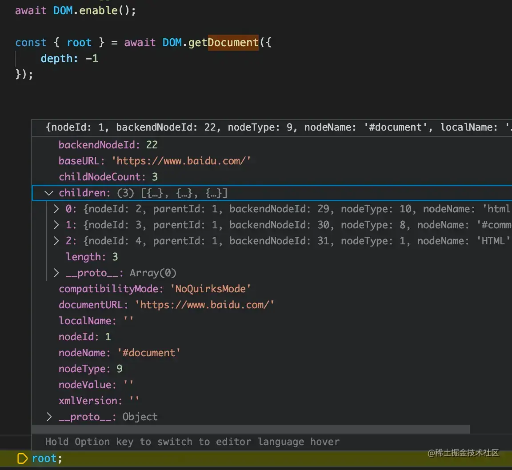

这就是真实的包含 DOM 信息的 CDP 数据。

接下来我们来实现一个真实的 Chrome DevTools 的功能：

Chrome DevTools 有一个覆盖率检测的功能，可以检测 JS、CSS 代码里有哪些执行了，哪些没执行。并且还会在 sources 里标记出来。

如下图，绿色的部分是执行过的，而红色的部分是没执行的：


在 sources 面板里可以直接看到哪些代码没执行，比如下面的红色部分就是没有执行的：

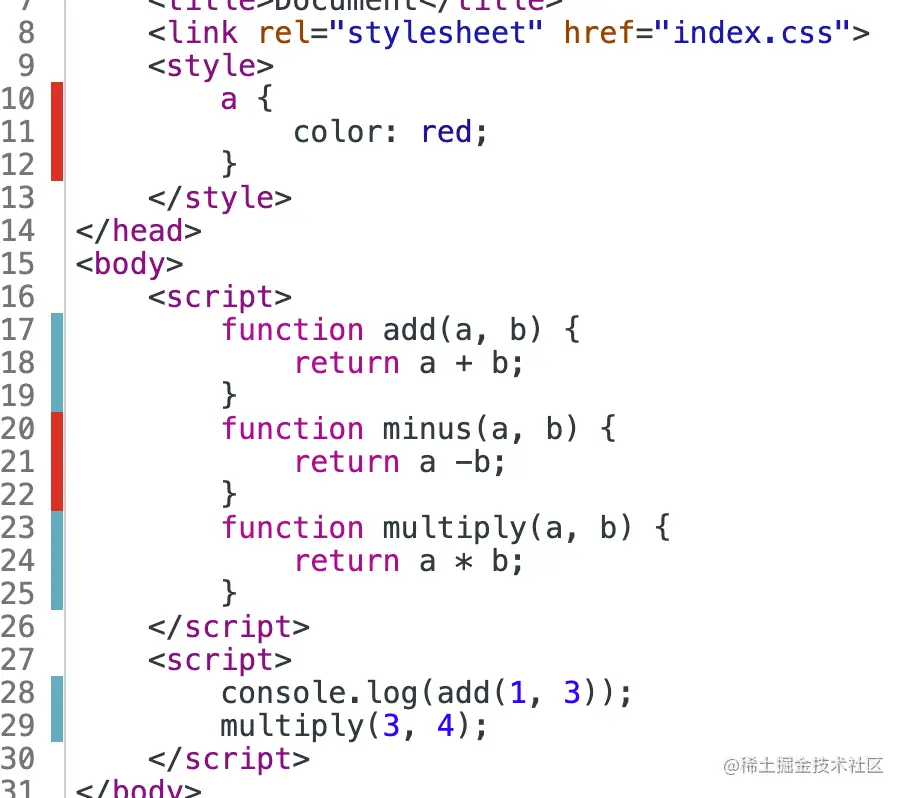

这个功能还是很有用的，可以帮助我们分析哪些代码是用不到的，可以进行延后加载或者删掉等优化。

在 More Tools 里开启：

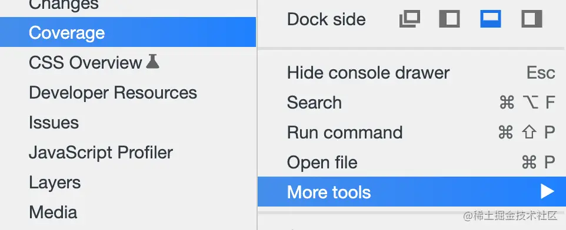

使用还是很简单的，但它是怎么实现的呢？

首先，我们要知道页面下载了哪些 JS 和 CSS。

这个是通过监听事件拿到的， CSS.styleSheetAdded 和 Debugger.scriptParsed 这俩事件。

我们监听下这俩事件：

```javascript
const CDP = require('chrome-remote-interface');

async function test() {
    let client;
    try {
        client = await CDP({
            host: '127.0.0.1',
            port: 9222
        });
        const { Page, DOM, Debugger, Runtime, CSS } = client;

        await Page.enable();
        await Debugger.enable();
        await DOM.enable();
        await CSS.enable();

        CSS.on('styleSheetAdded', async (event) => {
            debugger;
        })
        Debugger.on('scriptParsed', async (event) => {
            debugger;
        })

        await Page.navigate({url: 'http://127.0.0.1:8084'});

    } catch(err) {
        console.error(err);
    }
}
test();
```
因为用到 DOM、CSS、Debugger、Page 域的协议，所以需要先 enable 一下，只有 enable的功能才会启用。

这个很正常，没 enable 就不启用，这样能节省性能。

执行这段代码，看下拿到的事件对象：

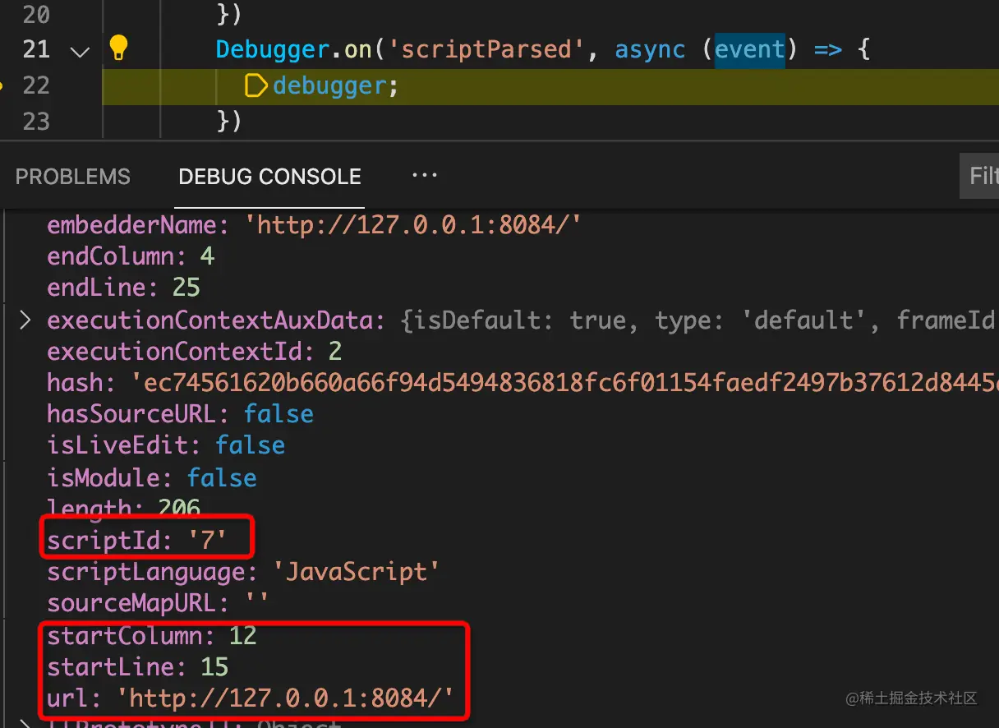

事件对象里是这段 js 的 url 和行列号，再就是 scriptId。

然后再看下 CSS.styleSheetAdded 的事件对象：

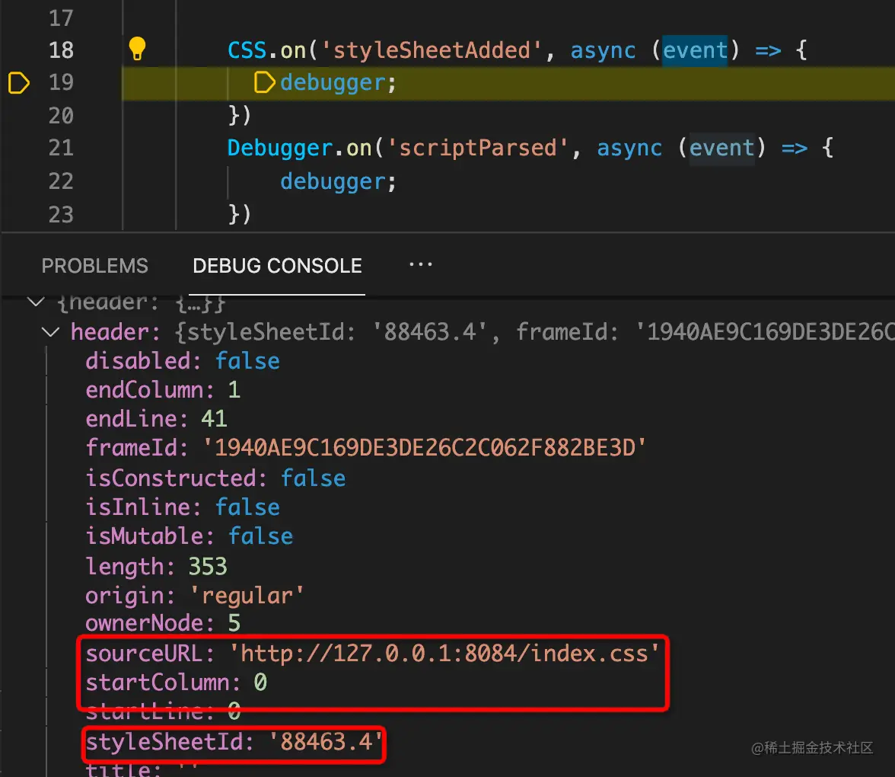

也差不多，只不过这里是 styleSheetId。

那怎么拿到 CSS 和 JS 的内容呢？

这就需要用到别的 api 了。

css 的内容是用 CSS.getStyleSheetText 来拿，传入 styeleSheetId：

```javascript
const styleSheetId = event.header.styleSheetId;
const content = await CSS.getStyleSheetText({ styleSheetId });
```

JS 的内容是用 Debugger.getScriptSource 来拿，传入 scriptId：

```javascript
const scriptId = event.scriptId;
const content = await Debugger.getScriptSource({ scriptId });
```

我们把它们按照 id 放到 Map 里：

```javascript
const cssMap = new Map();
const jsMap = new Map();

CSS.on('styleSheetAdded', async (event) => {
    const styleSheetId = event.header.styleSheetId;
    const content = await CSS.getStyleSheetText({ styleSheetId });

    cssMap.set(styleSheetId, {
        meta: event.header,
        content: content.text
    });
})
Debugger.on('scriptParsed', async (event) => {
    const scriptId = event.scriptId;
    const content = await Debugger.getScriptSource({ scriptId });

    jsMap.set(scriptId, {
        meta: event,
        content: content.scriptSource
    });
})
```
这样就能把页面上所有的 js 和 css 收集起来：

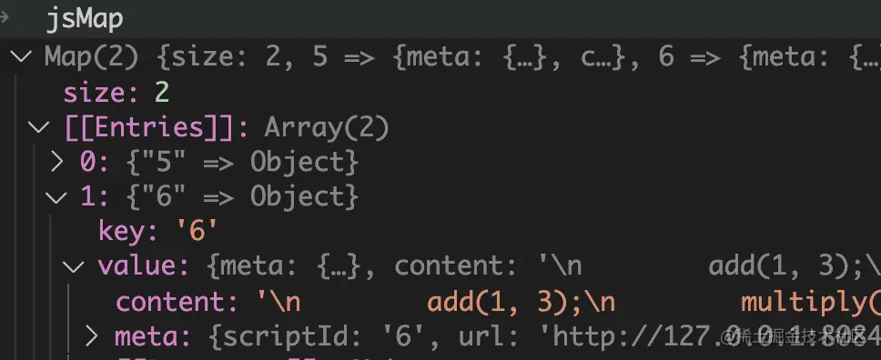


对了，测试页面的内容是这样的：

```html
<!DOCTYPE html>
<html lang="en">
<head>
    <meta charset="UTF-8">
    <meta http-equiv="X-UA-Compatible" content="IE=edge">
    <meta name="viewport" content="width=device-width, initial-scale=1.0">
    <title>Document</title>
    <link rel="stylesheet" href="index.css">
    <style>
        a {
            color: red;
        }
    </style>
</head>
<body>
    <script>
        function add(a, b) {
            return a + b;
        }
        function minus(a, b) {
            return a -b;
        }
        function multiply(a, b) {
            return a * b;
        }
    </script>
    <script>
        add(1, 3);
        multiply(3, 4);
    </script>
</body>
</html>
```
有一个外部 css：

```css
.aaa {
    color: red;
}
div {
    color: blue;
}
body {
    background: pink;
}
```
收集到了 JS 和 CSS 的数据只是第一步，要计算出覆盖率数据，还要知道哪些 JS 和 CSS 执行了。

这个也有 api：

CSS 开启执行数据的收集是用 CSS.startRuleUsageTracking：

```javascript
await CSS.enable();

await CSS.startRuleUsageTracking();
```
然后一段时间后 stop：

```javascript
// 延迟一段时间再获取数据，等页面渲染完
await new Promise(resolve => setTimeout(resolve, 3000));

const cssCoverage = await CSS.stopRuleUsageTracking();
```

这样就能获取 CSS 的执行数据：

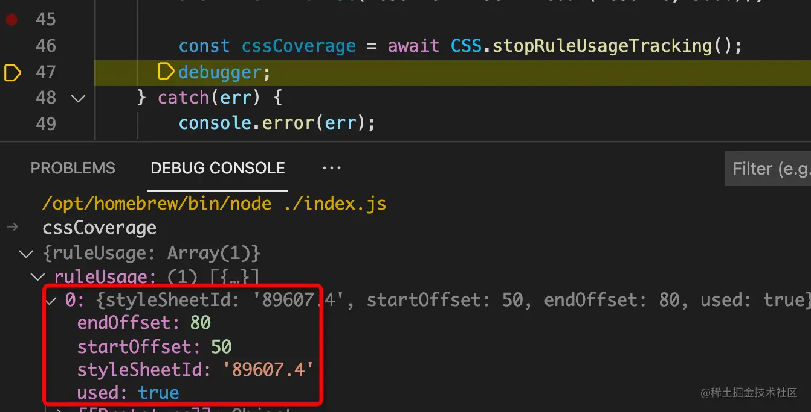

返回的结果显示 scriptId 为 89607.4 的 css 的 50 到 80 个字符的代码执行了。

我们在 cssMap 里看下这个 id 对应的代码：


然后取出 50 到 80 个字符的代码：


也就是说所有 css 里只有这一段代码是生效的：

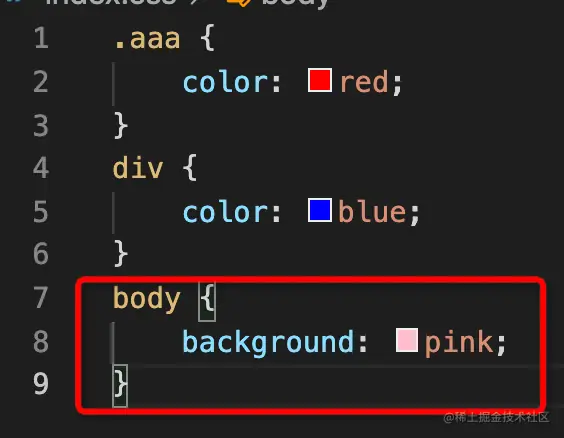

你用 Chrome DevTools 的 Coverage 分析结果也是这样的：

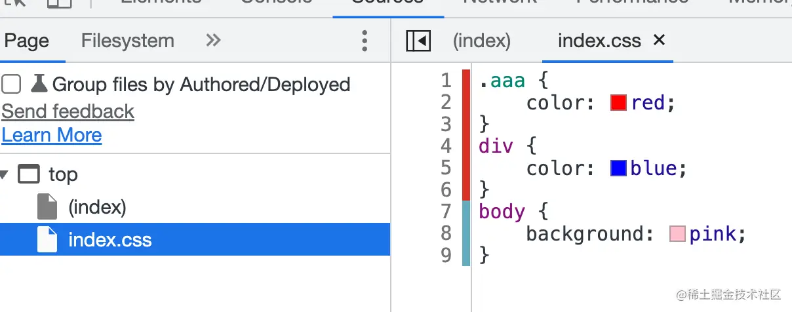

有了所有 CSS 代码的数据，有了执行了哪些 CSS 的代码的数据，覆盖率的计算不就很简单了么？

我们再来看下 JS 的：

JS 使用 Profiver 的 prociseCoverage 的 api 获取覆盖率数据：

```javascript
await Profiler.enable();

await Profiler.startPreciseCoverage();

// 延迟一会再获取数据，等 js 执行完
await new Promise(resolve => setTimeout(resolve, 3000));

const jsCoverage = await Profiler.takePreciseCoverage();

```
可以看到返回了两个 script 的执行数据：

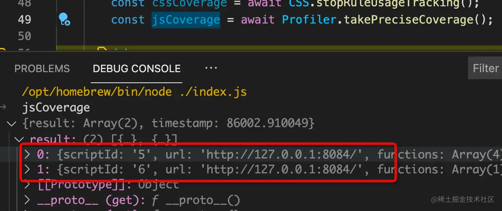

因为我们页面上就两个 script 嘛：

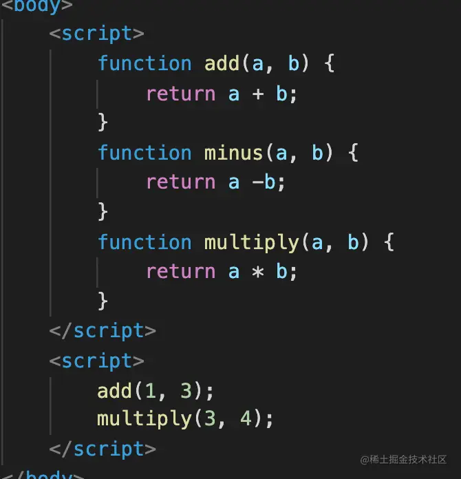

第一个 script 有 4 个 functions：


有同学说，不对呀，不是 add、minus、multiply 3 个吗？

那个没有名字的代表 script 的匿名代码块。

每个 function 都记录了字符的范围，还有执行的次数：

比如 add 函数执行了 1 次：

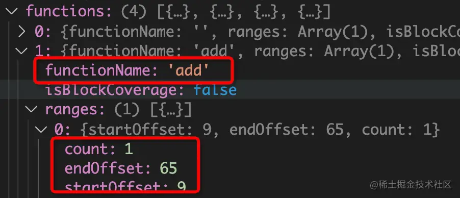

minus 函数执行了 0 次：

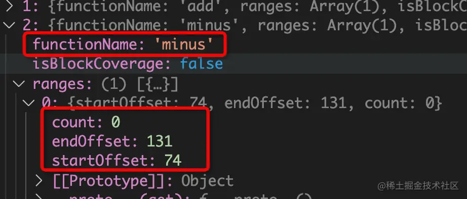

第二个 script 的匿名代码块执行了 1 次：

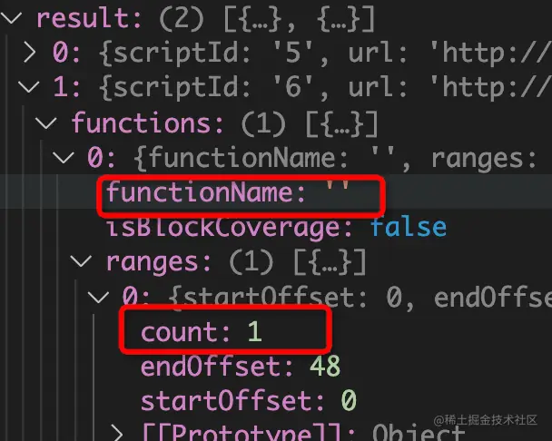

这不就和 Chrome DevTools 的 Coverage 结果对上了么：

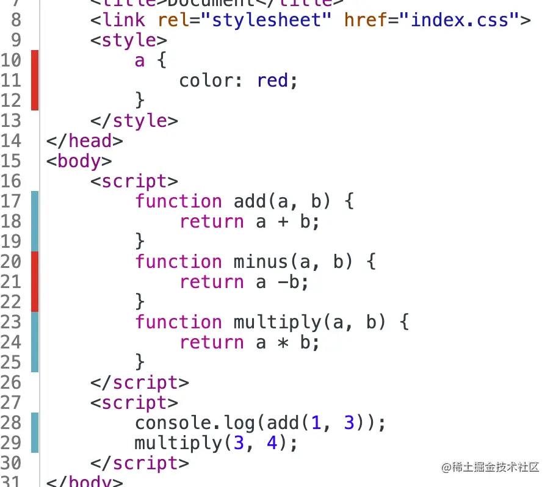

不管是覆盖率数据也好，还是在 sources 里可视化展示哪些代码没执行也好，都很容易实现。

全部代码如下，也可以从[小册仓库](https://github.com/QuarkGluonPlasma/fe-debug-exercize)里找到。

```javascript
const CDP = require('chrome-remote-interface');

async function test() {
    let client;
    try {
        client = await CDP({
            host: '127.0.0.1',
            port: 9222
        });
        const { Page, DOM, Debugger, Runtime, CSS, Profiler } = client;

        await Page.enable();
        await Debugger.enable();
        await DOM.enable();
        await CSS.enable();
        await Profiler.enable();

        const cssMap = new Map();
        const jsMap = new Map();

        CSS.on('styleSheetAdded', async (event) => {
            const styleSheetId = event.header.styleSheetId;
            const content = await CSS.getStyleSheetText({ styleSheetId });

            cssMap.set(styleSheetId, {
                meta: event.header,
                content: content.text
            });
        })
        Debugger.on('scriptParsed', async (event) => {
            const scriptId = event.scriptId;
            const content = await Debugger.getScriptSource({ scriptId });

            jsMap.set(scriptId, {
                meta: event,
                content: content.scriptSource
            });
        })

        await CSS.startRuleUsageTracking();
        await Profiler.startPreciseCoverage();

        await Page.navigate({url: 'http://127.0.0.1:8084'});

        await new Promise(resolve => setTimeout(resolve, 3000));

        const cssCoverage = await CSS.stopRuleUsageTracking();
        const jsCoverage = await Profiler.takePreciseCoverage();

        debugger;
    } catch(err) {
        console.error(err);
    }
}
test();
```

其实 lighthouse 的 cli 就是通过这种方式实现的数据收集和分析：


如果某一天，你也要做一个网页分析工具，是不是也可以通过 CDP 的方式来获取一些网页运行数据做分析呢？

所有 Chrome DevTools 的数据，你通过 CDP 都是能拿到的，能做的事情有很多。

## 总结

可以自己实现 CDP backend，当然也可以实现 frontend，但自己对接 WebSocket 和 CDP 协议还是挺麻烦的，可以直接用 chrome-remote-interface  这个包。

这节我们实现了下 Coverage 功能：

Chrome DevTools 有 Coverage 面板，可以分析 JS 和 CSS 代码执行的覆盖率，分析出哪些代码没执行，然后做后续优化。

这是 Chrome 通过 CDP 暴露给 Chrome DevTools 的，而 CDP 的数据我们也能自己实现 ws 客户端来拿到，那自然也可以自己实现覆盖率的计算。

我们通过 chrome-remote-interface 的不同域的 api 来进行了 CSS 和 JS 的代码的收集，代码执行数据的收集，有了这些数据就能轻松算出覆盖率。

lighthouse 的 cli 就是通过这种方式来收集 Chrome 运行时数据，做分析和展示的。如果我们想做一个调试工具，或者网页分析工具，也可以用类似的思路。

Chrome DevTools 能做的所有事情，我们都能自己实现，因为 CDP 数据是一摸一样的。
