# 44.线上报错如何直接调试本地源码？

当线上有报错的时候，大家是怎么定位问题的呢？

断点调试么？

但是这时候代码是被压缩过的，变量名都是 a、b、c、d 这种，根本看不出啥来。

如果调试线上报错能像本地开发的时候一样就好了。

其实这是可以做到的，这节就分享下如何优雅的调试线上报错：

首先，我们准备一段 JS 代码：

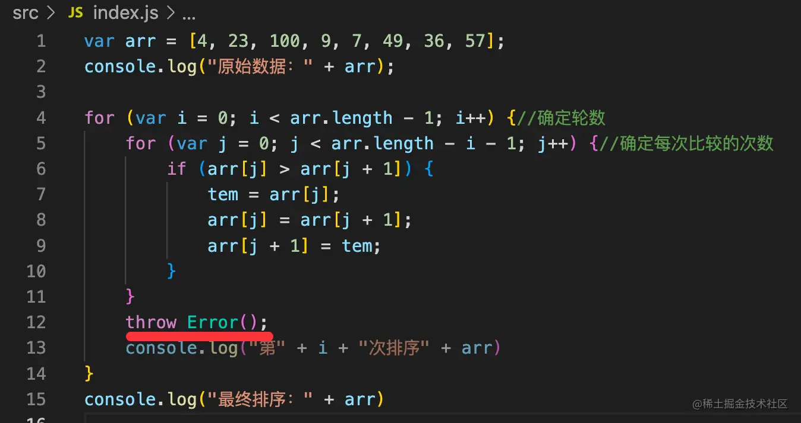

这是我随便找的一段 JS 代码，里面抛了一个错误。

然后用 webpack 进行编译：

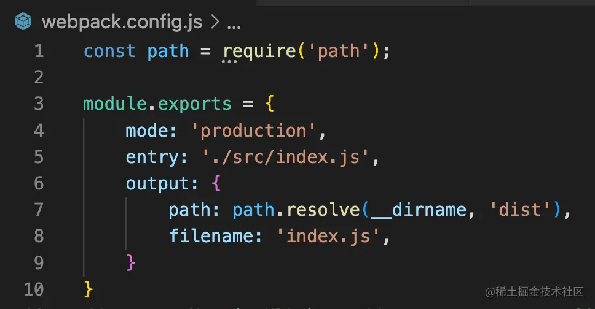

在 index.html 里引入构建产物：

然后跑个静态服务器 npx http-server .

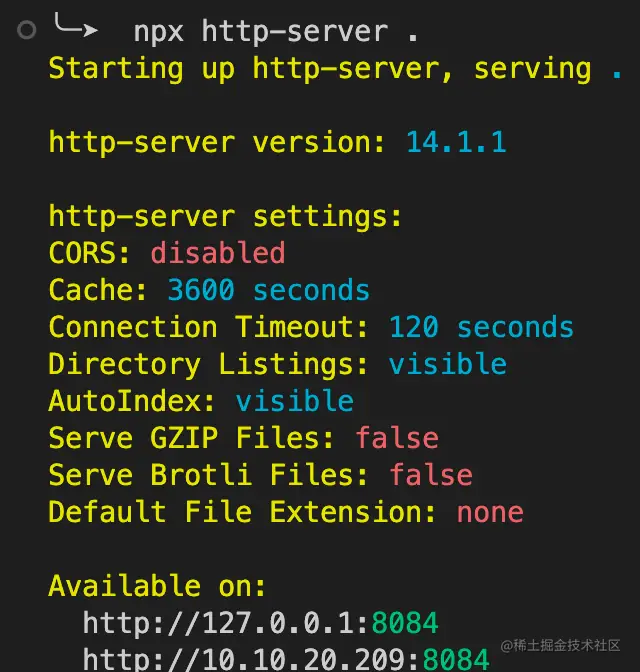

浏览器访问，就会发现代码确实报错了：

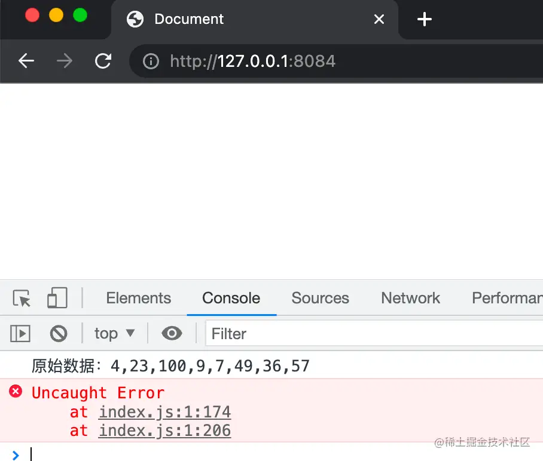

那问题来了，怎么定位错误原因呢？

首先，我们可以使用异常断点，在抛异常的地方断住：

创建一个 vscode 调试配置：

勾选 uncaught exceptions，在未被捕获的异常处断住：

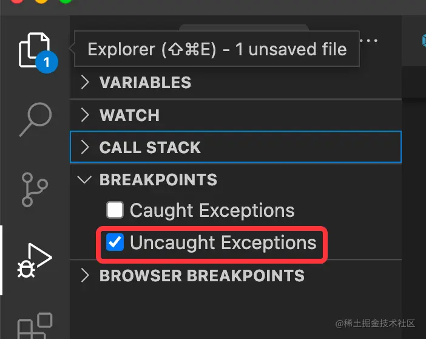

然后启动调试：

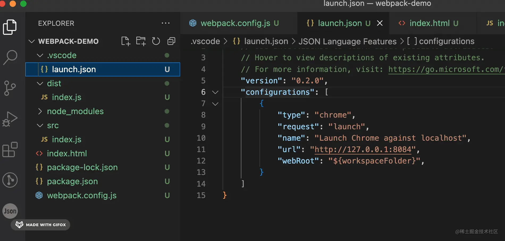

你会发现代码在抛异常的地方断住了，这就是异常断点的功能。当你不知道哪里抛的异常的时候，可以用这个。

但现在代码是被压缩过的，看不出啥来：

怎么能直接定位到抛异常的源码呢？

这时候就要用到 sourcemap 了，它就是用于把编译后的源码映射回源码的：

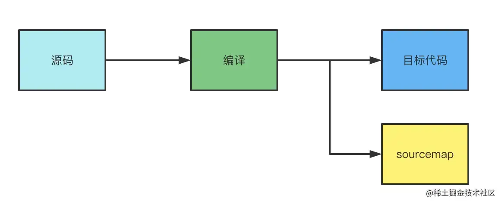

首先要生成 sourcemap，这个配置下 webpack 的 devtool 为 hidden-source-map 即可：

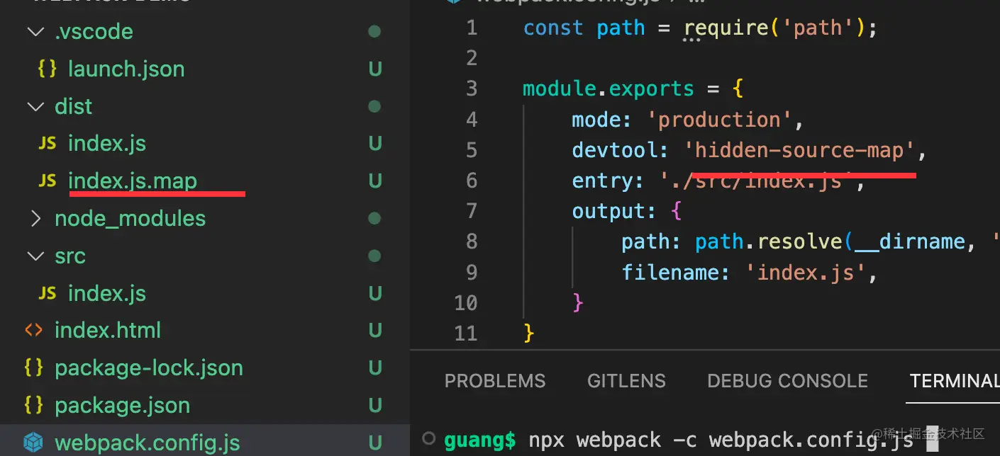

hidden-source-map 的意思是生成 sourcemap 但是不关联。

如果你配成 source-map，代码是关联了 sourcemap 的：

关联 sourcemap 需要在文件末尾加上 //# sourceMappingURL=xxx.js.map 的代码。

但现在这个文件是线上的，不能直接改本地文件。我们可以使用 charles 的断点功能来修改它：

charles 默认不代理 127.0.0.1 的请求，我们要配下 hosts：

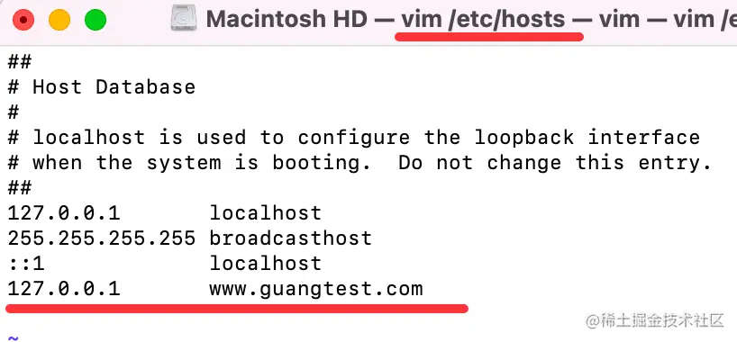

比如我配了一个 www.guangtest.com 的域名到 127.0.0.1。

试一下：

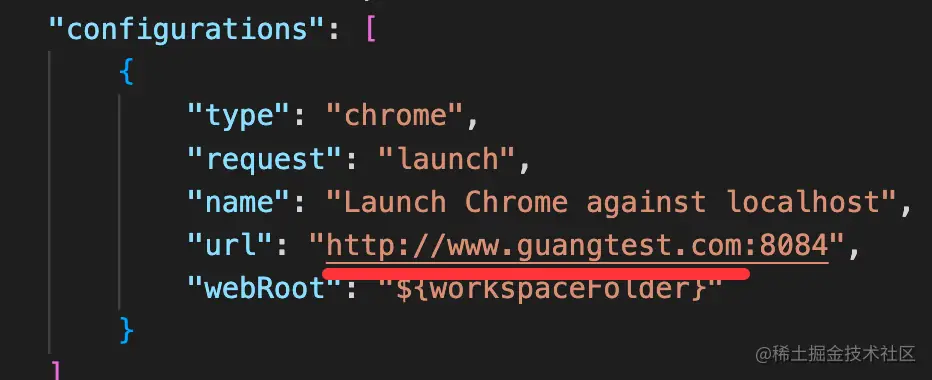

hosts 配置生效了（如果 hosts 不生效，一般是你用了某个翻墙软件改了系统代理，关掉即可）：

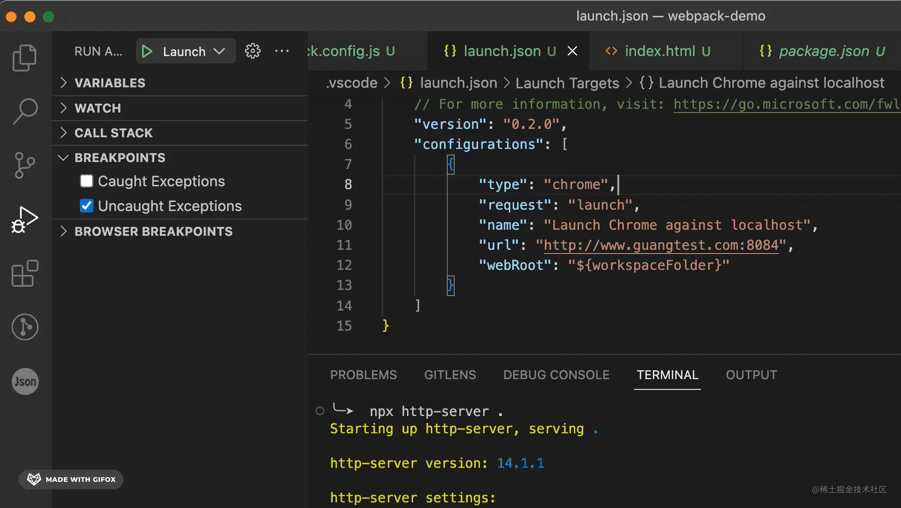

然后我们要让 charles 拦截这个 url 的请求，需要安装一个插件 SwitchyOmega

不过在那之前要指定一个数据目录，也就是浏览器把插件、历史、cookie 等数据保存在哪里：

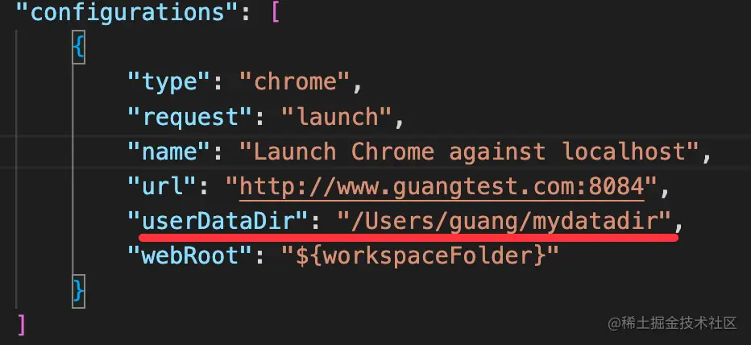

不指定的话每次调试都会创建一个临时数据目录来跑调试，上次安装的插件就没有了。

chrome 应用商店搜索 switchy omega：

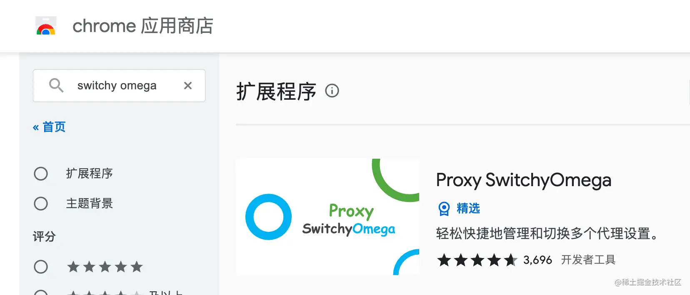

配置下代理服务器，这里我 charles 是在 127.0.0.1:8888 的：

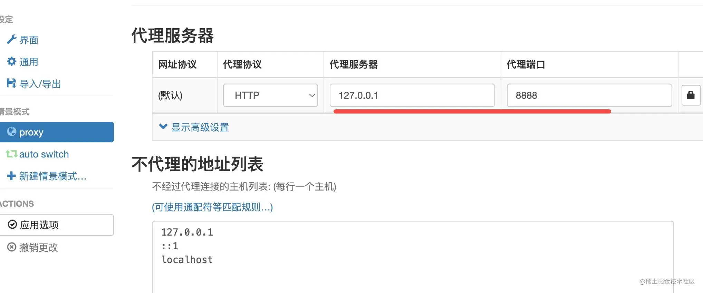

之后配下 auto switch，让 www.guangtest.com 的请求都走我们刚刚配的代理：

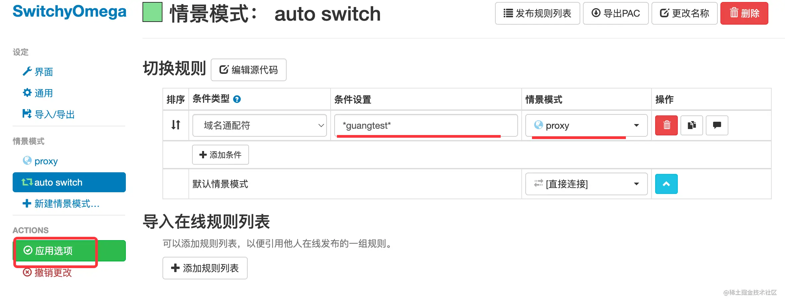

之后点击应用选项。

代理方式设置成 auto switch，也就是根据配置的规则自动切换代理：

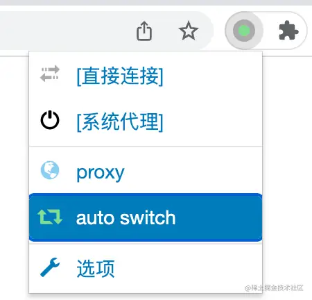

这个网页的代理配成 charles 之后，在 charles 就可以抓到对应的请求了：

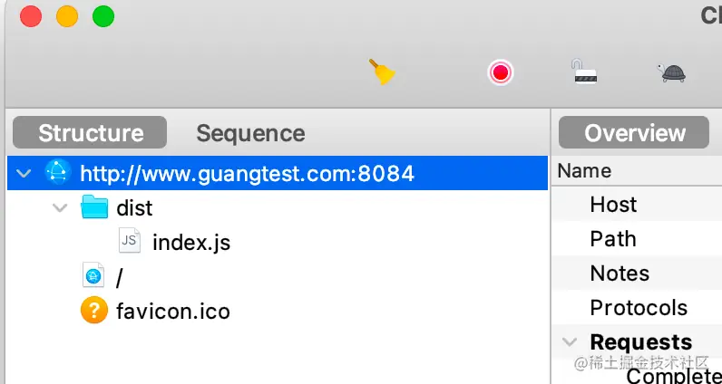

接下来就是断点修改响应的内容了：

点击 Proxy > Breakpoint Settings

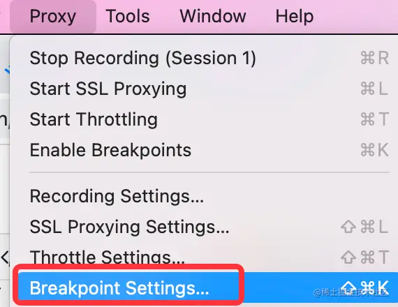

添加一个对 guangtest.com 的 dist/index.js 响应的断点：

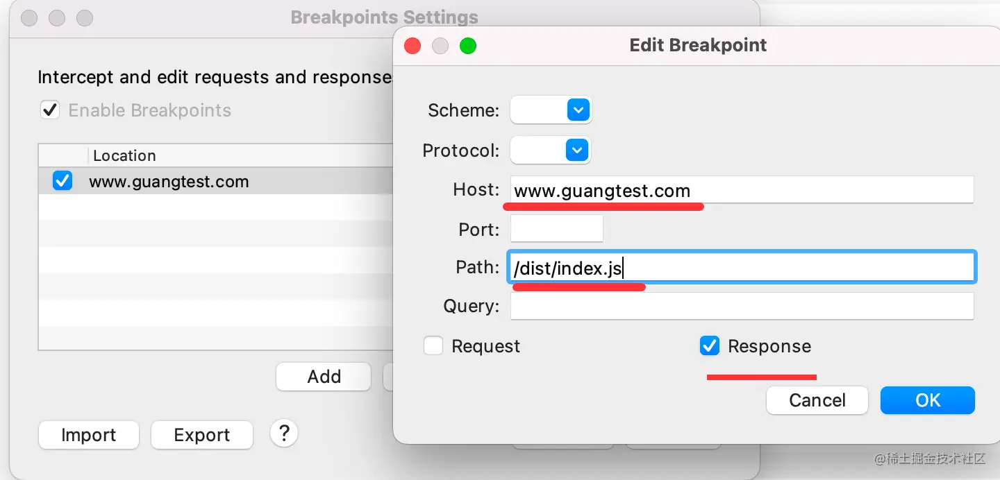

强制刷下页面，charles 就会断住：

我们可以修改响应的内容，然后点击 execute 来执行修改：

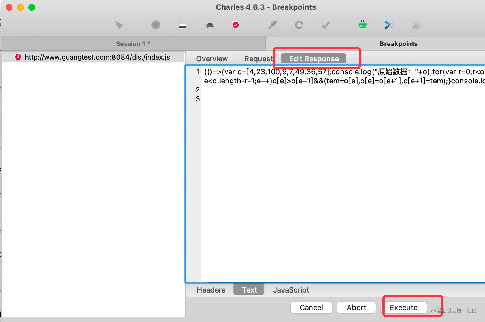

我加上了这样一行 sourcemap 的关联：

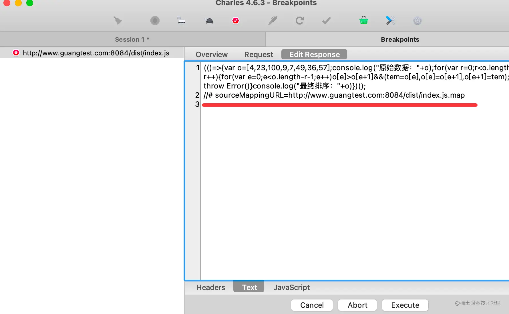

在 chrome devtools 里可以看到拿到的响应是被修改过的：

异常断点现在直接在源码处断住了：

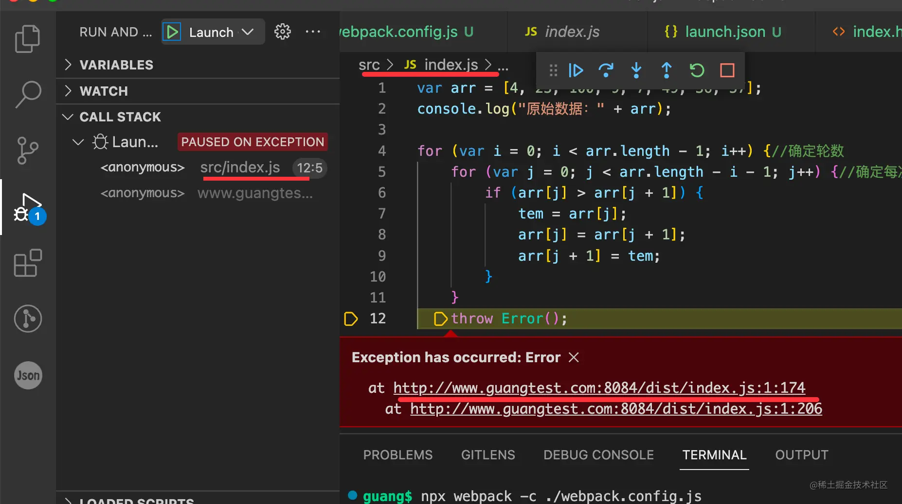

接下来就可以直接调试源码了，可以通过作用域、调用栈等信息来定位报错原因：

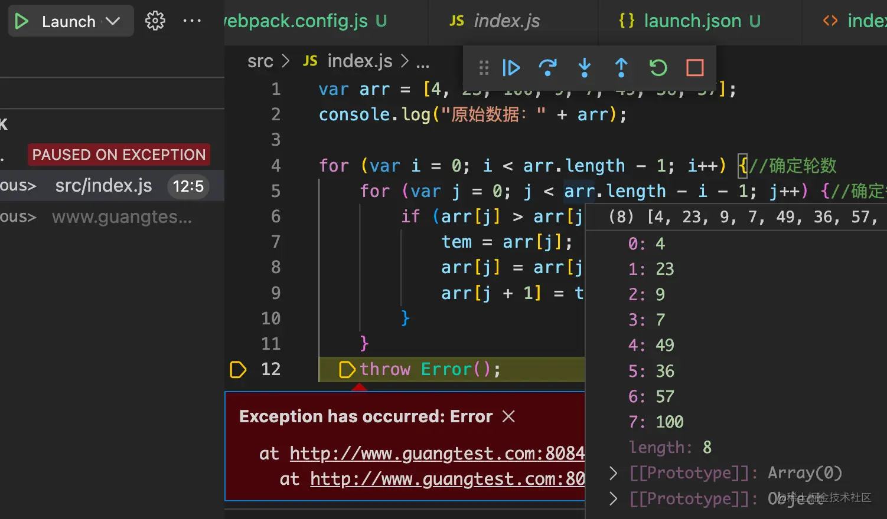

这样我们就完成了直接本地调试线上报错代码对应的源码！

案例代码在[小册仓库](https://github.com/QuarkGluonPlasma/fe-debug-exercize)

有的同学可能会问，前面我们不是学过一个小技巧，sources 面板可以右键点击 add soruce map，就可以手动关联 sourcemap么：

没错，那样比较简单，不用 charles 来断点修改文件内容，但那个是一次性的，刷新就没了。

而 charles 断点修改的内容会缓存，强制刷新才会重新请求。

这两种方式都可以。

## 总结

通过 sourcemap，我们可以调试线上报错的时候直接对应到本地源码来断点调试。

要让线上代码关联 sourcemap 可以通过 charles 断点修改对应的响应，加上一行 sourceMappingURL=xxx 的注释。

然后在 VSCode Debugger 里加个异常断点，这样就可以在异常处断住。

这样就可以快速定位线上错误的原因了，体验就和本地开发时一样！

当然，更快捷的方式是 VSCode Debugger 异常断点断住的时候右键 chrome devtools 的 sources 面板，手动 add source map。不过这种方式是一次性的。

