# 45.手动对接 CDP 来理解 Chrome DevTools 实现原理

前面学习了 Chrome DevTools 的各种工具的使用，从这节开始深入下它的实现原理。

调试工具都包含 frontend、backend、调试协议、信道这四个部分：


而在 Chrome DevTools 里这个调试协议就是 Chrome DevTools Protocol，简称 CDP。

打开 [CDP 的文档](https://chromedevtools.github.io/devtools-protocol/)，可以看到 CDP 协议分为了不同的 Domain：

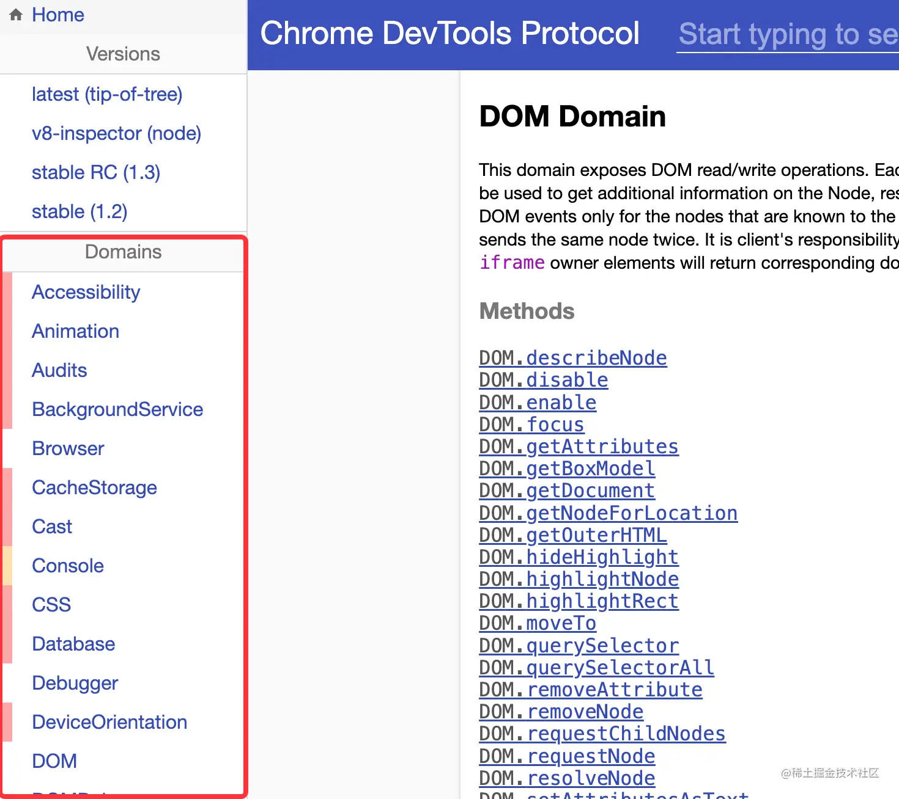

比如 DOM、CSS、Debugger 等，这个很容易理解，各种工具的数据通信总不能混到一起吧，所以分成了不同的域来管理。

每个 Domain 下都包含了 Methods 和 Events：

- Method 就是 frontend 向 backend 请求数据，backend 给它返回相应的数据
- Event 就是 backend 推送给 frontend 的一些数据。

你可以在 Chrome DevTools 的设置里开启 Protocol Monitor 面板：

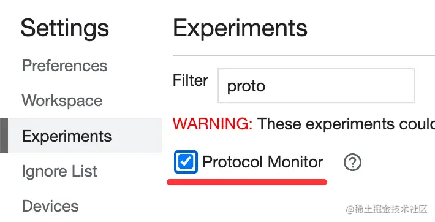

在 More Tools 里打开：

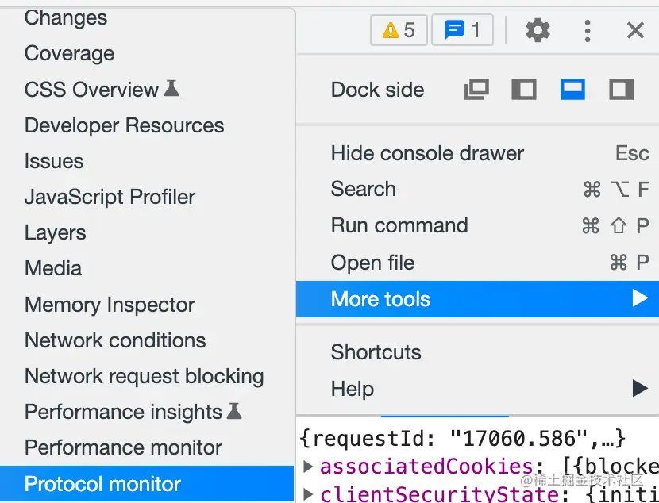

然后你就可以看到当前页面所有的 CDP 数据交互：

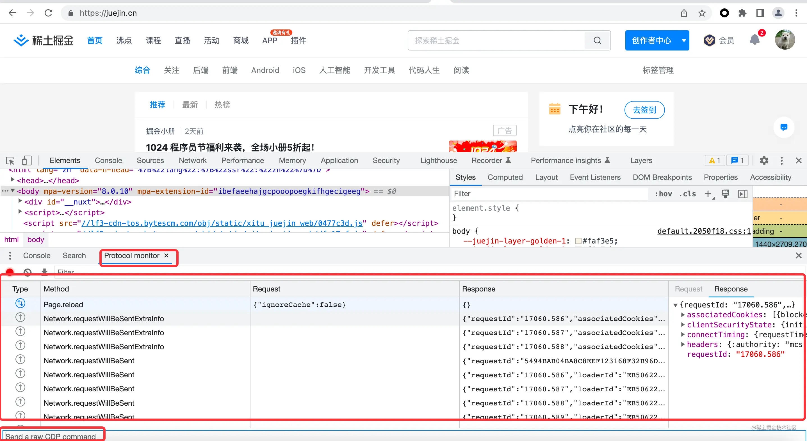

双向箭头的就是 Method，单向箭头的就是 backend 推给 frontend 的 Event。

你可以在下面的 send a raw CDP method 的输入框里输入协议数据，Chrome DevTools 会把它发给 backend:

比如发送 DOM.getDocument 的 method：

```json
{"method": "DOM.getDocument","params": {}}
```
就会返回整个 DOM 的信息：

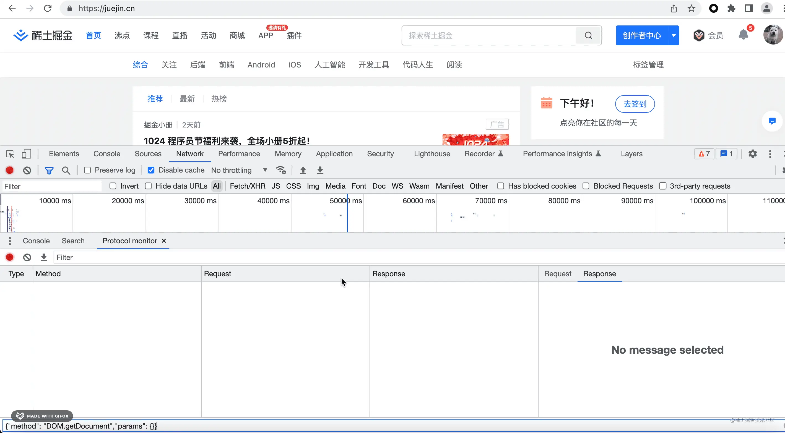

比如发送 CSS.getComputedStyleForNode 的 method，带上某个 nodeId：

```json
{"method": "CSS.getComputedStyleForNode","params": {"nodeId": 920}}
```

就可以拿到这个 node 的所有计算后的样式：

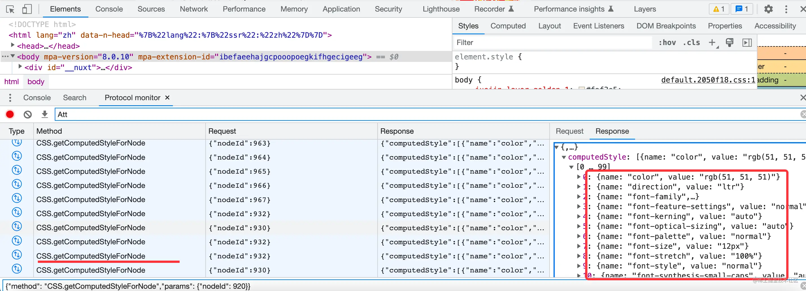

Chrome DevTools 里展示的所有内容都是从 backend 那里拿到的，他只是一个展示和交互的 UI 而已。

这个 UI 是可以换的，比如我们可以用 VSCode Debugger 对接 CDP 调试协议来调试网页。

Chrome DevTools frontend 也是一个独立的项目，我们可以从 npm 仓库下载 chrome-devtools-frontend 的代码，我这里用的是 1.0.672485 版本的：

```
npm install chrome-devtools-frontend@1.0.672485
```
下载下来的代码有个 front_end 目录，这个就是 Chrome DevTools 的前端代码：


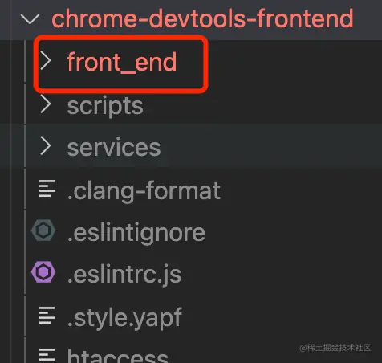

它下面有几个 html：

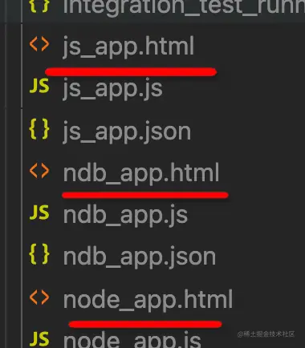

我们在 node_modules/chrome-devtools-frontend 下执行 "npx http-server ." 起个静态服务看一下：

devtools_app.html 就是网页的那个调试页面：

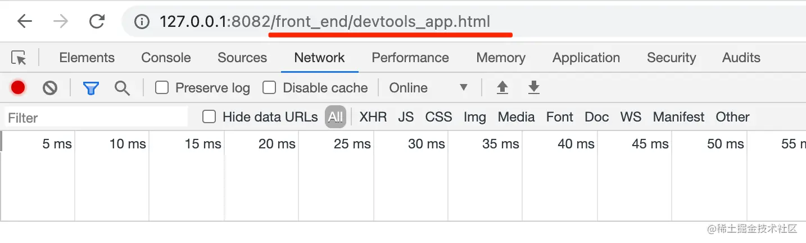

node_app.html 就是 node 的那个调试页面：

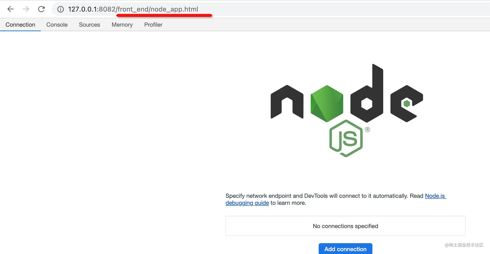

这就是 Chrome DevTools 的 frontend 部分。

那怎么用这个独立的 frontend 呢？

给它配个 WebSocket 的 backend 就行.

用 node 创建个 WebSocket 服务端，打印下收到的消息：

```javascript
const ws = require('ws');

const wss = new ws.Server({ port: 8080 });

wss.on('connection', function connection(ws) {
    ws.on('message', function message(data) {
        console.log('received: %s', data);  
    });
});
```

在 devtools_app.html 后面加上 ws=localhost:8080 的参数：

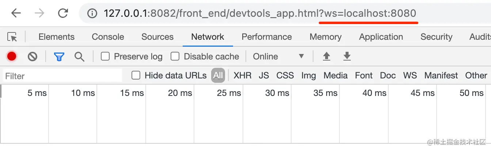

启动 ws 服务，你就会发现控制台打印了一系列收到的消息：

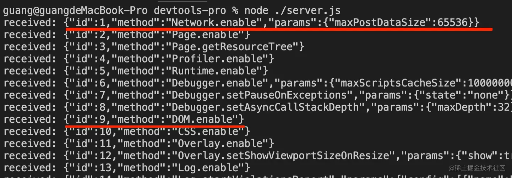

这就是 CDP 协议的数据。

那我们对接一下这个协议，返回相应格式的数据，能在 Chrome DevTools 里做显示么？

我们试一下。

我们找个网络相关的协议：

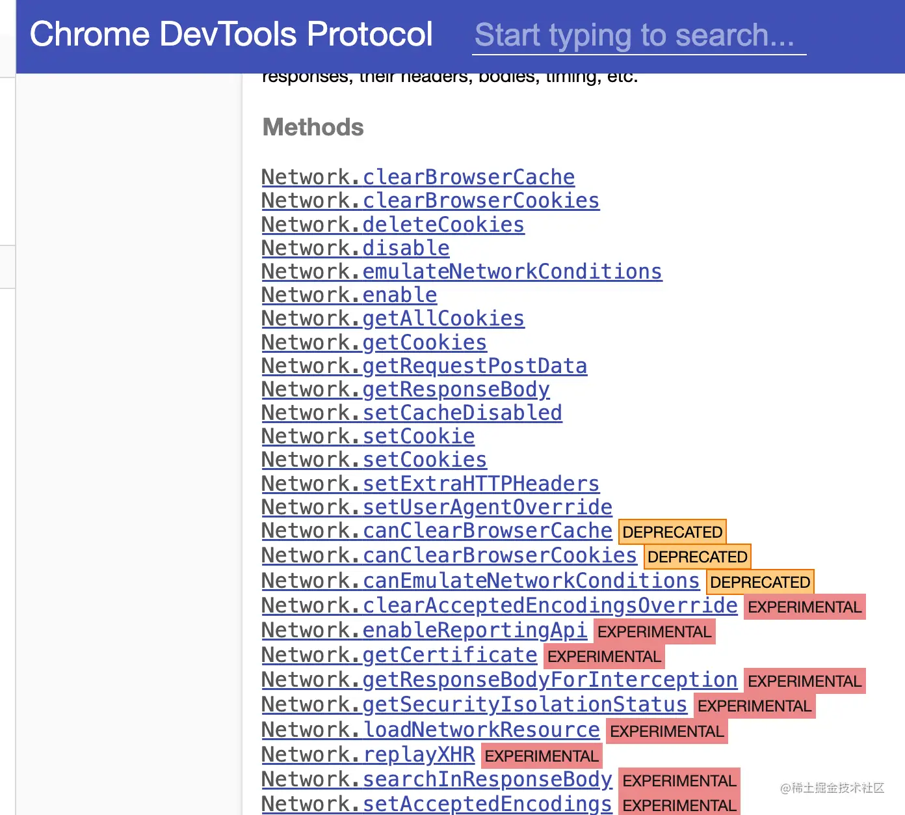

现在 Protocol Monitor 里看看 NetWork 部分都是怎么通过 CDP 交互的：

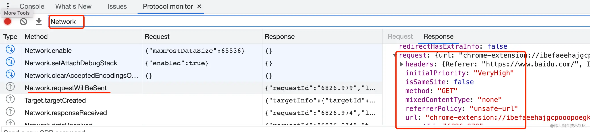

然后你会发现每次发请求前，backend 都会给 frontend 传一个 Network.requestWillBeSent 的消息，带上这次请求的信息。

那我们能不能也发一个这样的消息呢？

我模拟构造了一个类似的 CDP 消息：

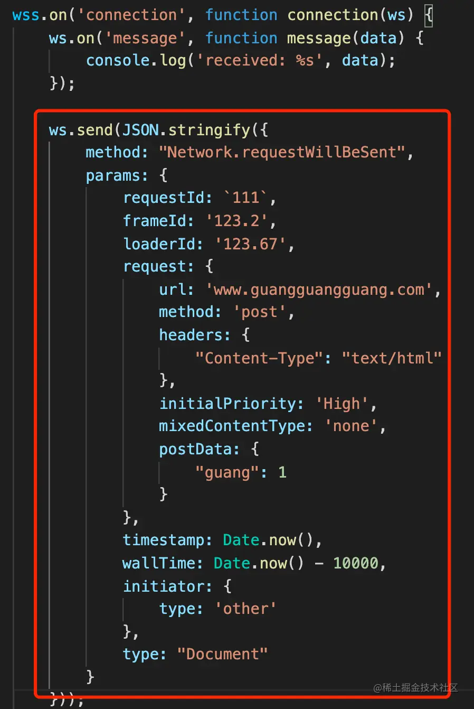

然后在 frontend 的页面看一下：

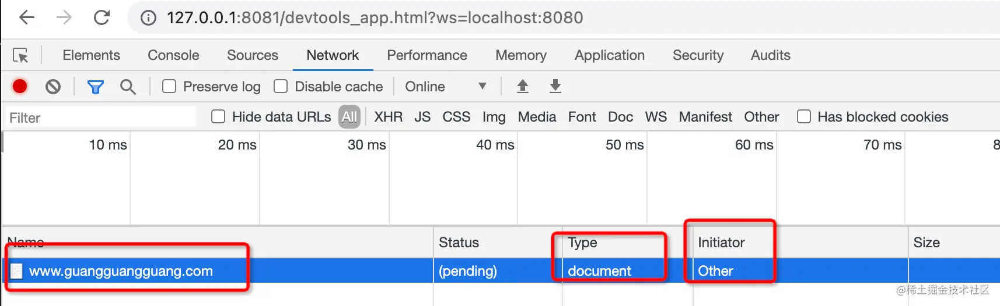

你会发现 Network 面板显示了我们发过来的消息！

这就是 Chrome DevTools 的原理。

（代码在[小册仓库](https://github.com/QuarkGluonPlasma/fe-debug-exercize/tree/main/react-source-debug)）

测试了下 Network 部分的协议之后，我们再来试下 DOM 的。

我用 Protocol Monitor 观察了下 DOM 部分的 CDP 交互：

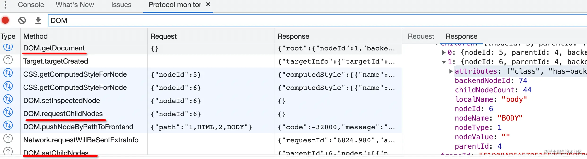

首先通过 DOM.getDocument 获取 root 的信息，这一级返回的 node 只到 body。

然后后面再发 DOM.requestChildNodes 的消息，服务端会回一个 DOM.setChildNodes 的消息来返回子节点的信息。

我们也这样实现一下：

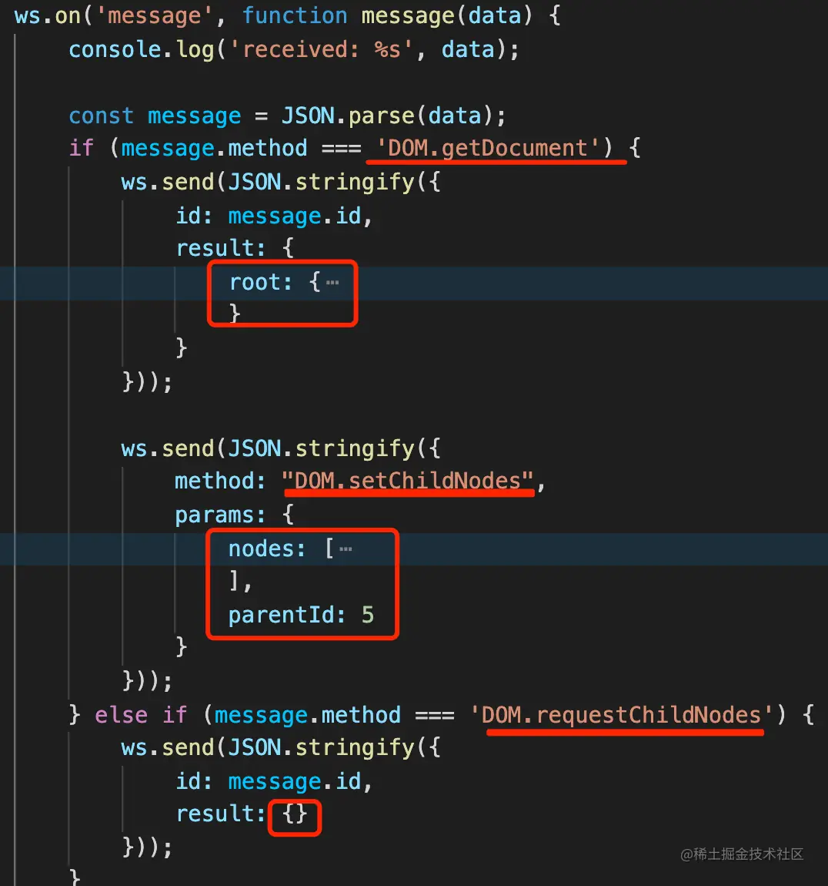

收到 DOM.getDocument 的消息的时候，我们返回 root 的信息，只到 body 那一级。

然后发送 DOM.setChildNotes 来返回子节点的信息。

还要处理下 DOM.requestChildNodes 的消息，返回空就行。

完整代码如下：

```javascript
ws.on('message', function message(data) {
        console.log('received: %s', data);

        const message = JSON.parse(data);
        if (message.method === 'DOM.getDocument') {
            ws.send(JSON.stringify({
                id: message.id,
                result: {
                    root: {
                        nodeId: 1,
                        backendNodeId: 1,
                        nodeType: 9,
                        nodeName: "#document",
                        localName: "",
                        nodeValue: "",
                        childNodeCount: 2,
                        children: [
                            {
                                nodeId: 2,
                                parentId: 1,
                                backendNodeId: 2,
                                nodeType: 10,
                                nodeName: "html",
                                localName: "",
                                nodeValue: "",
                                publicId: "",
                                systemId: ""
                            },
                            {
                                nodeId: 3,
                                parentId: 1,
                                backendNodeId: 3,
                                nodeType: 1,
                                nodeName: "HTML",
                                localName: "html",
                                nodeValue: "",
                                childNodeCount: 2,
                                children: [
                                    {
                                        nodeId: 4,
                                        parentId: 3,
                                        backendNodeId: 4,
                                        nodeType: 1,
                                        nodeName: "HEAD",
                                        localName: "head",
                                        nodeValue: "",
                                        childNodeCount: 5,
                                        attributes: []
                                    },
                                    {
                                        nodeId: 5,
                                        parentId: 3,
                                        backendNodeId: 5,
                                        nodeType: 1,
                                        nodeName: "BODY",
                                        localName: "body",
                                        nodeValue: "",
                                        childNodeCount: 1,
                                        attributes: []
                                    }
                                ],
                                attributes: [
                                    "lang",
                                    "en"
                                ],
                                frameId: "3A70524AB6D85341B3B613D81FDC2DDE"
                            }
                        ],
                        documentURL: "http://127.0.0.1:8085/",
                        baseURL: "http://127.0.0.1:8085/",
                        xmlVersion: "",
                        compatibilityMode: "NoQuirksMode"
                    }
                }
            }));

            ws.send(JSON.stringify({
                method: "DOM.setChildNodes",
                params: {
                    nodes: [
                        {
                            attributes: [
                                "class",
                                "guang"
                            ],
                            backendNodeId: 6,
                            childNodeCount: 0,
                            children: [
                                {
                                    backendNodeId: 6,
                                    localName: "",
                                    nodeId: 7,
                                    nodeName: "#text",
                                    nodeType: 3,
                                    nodeValue: "光光光",
                                    parentId: 6,
                                }
                            ],
                            localName: "p",
                            nodeId: 6,
                            nodeName: "P",
                            nodeType: 1,
                            nodeValue: "",
                            parentId: 5
                        }
                    ],
                    parentId: 5
                }
            }));
        } else if (message.method === 'DOM.requestChildNodes') {
            ws.send(JSON.stringify({
                id: message.id,
                result: {}
            }));
        }
    });
```

返回的内容如上，我们返回了一个 P 标签，有 class 属性，还有一个文本节点。

重启下 backend 服务，在 frontend 里重连一下，你就会发现 frontend 显示了我们返回的 DOM 信息：

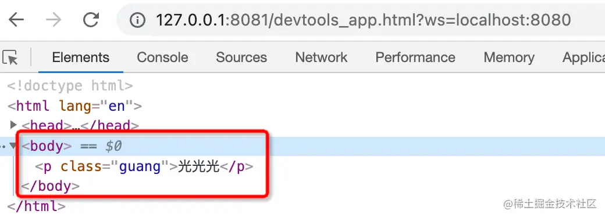

经过这两个案例，我们就搞明白了 Chrome DevTools frontend 是怎么和 backend 交互的。

看到自己模拟 DOM 信息这部分，不知道你是否会想到跨端引擎呢。

跨端引擎就是通过前端的技术来描述界面（比如也是通过 DOM），实际上用安卓和 IOS 的原生组件来做渲染。

它的调试工具也是需要显示 DOM 树的信息的，但是因为并不是网页，所以不能直接用 Chrome DevTools。

那如何用 Chrome DevTools 来调试跨端引擎呢？

看完上面两个案例，相信你就会有答案了。只要对接了 CDP，自己实现一个 backend，把 DOM 树的信息，通过 CDP 的格式传给 frontend 就可以了。

自定义的调试工具基本都是前端部分集成下 Chrome DevTools frontend，后端部分实现下对接 CDP 的 ws 服务来实现的。

比如有很多[用 Chrome DevTools 的backend 调试其他代码的工具](https://github.com/ChromeDevTools/awesome-chrome-devtools)：

比如监听系统级别的（包括浏览器之外）的 http 请求，用 chrome devtools 的Network面板展示的工具 [betwixt](https://github.com/kdzwinel/betwixt)：

比如用 Chrome DevTools 调试 ios 的网络和数据的工具[PonyDebugger](https://github.com/square/PonyDebugger)：

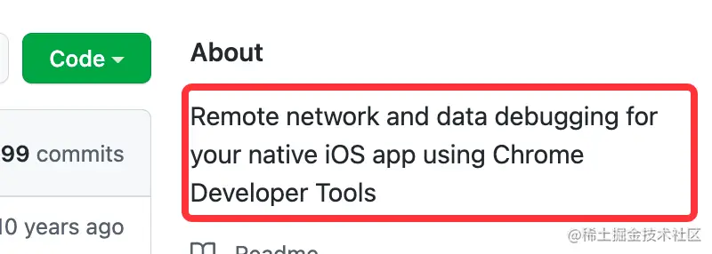

frontend 只是一个对接了 CDP 的独立的客户端 UI，自己实现 CDP 的 backend 就可以用它来调试各种东西。

对前端来说，常见的就是跨端引擎、小程序引擎的调试工具：

小程序引擎的调试工具更简单，因为它实际上渲染是用的网页，有 CDP 的 backend，可以直接和 frontend 对接，不用自己实现 CDP 交互。

比如 vivo 的快应用开发工具，它有编辑器、调试器、模拟器这几部分：

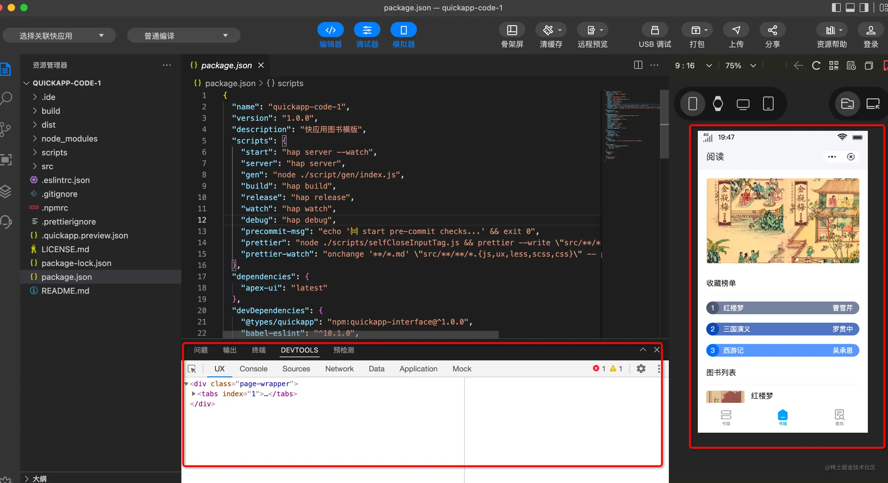

模拟器渲染的内容能够在调试器里调试，就是调试器集成的 frontend 对接了模拟器的 CDP backend。

当然，这里就不是通过 WebSocket 的信道了，而是通过其它方式：

Chrome DevTools 支持多种信道：

比如 WebSocket 时的通信实现是这样的：

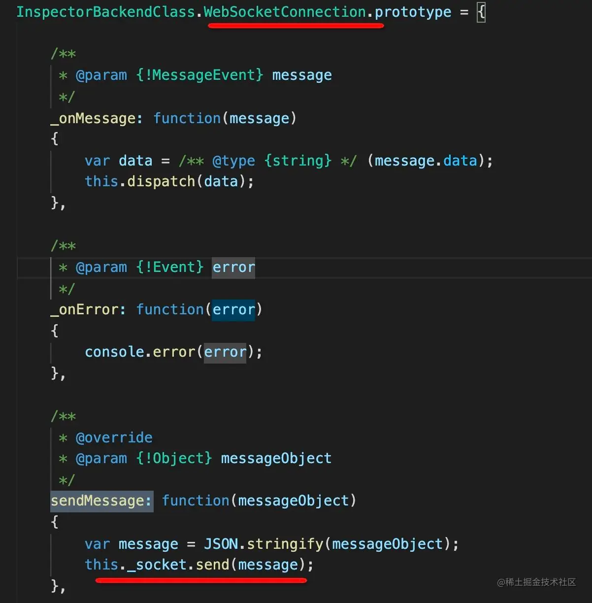

而 electron 环境下是这样的：

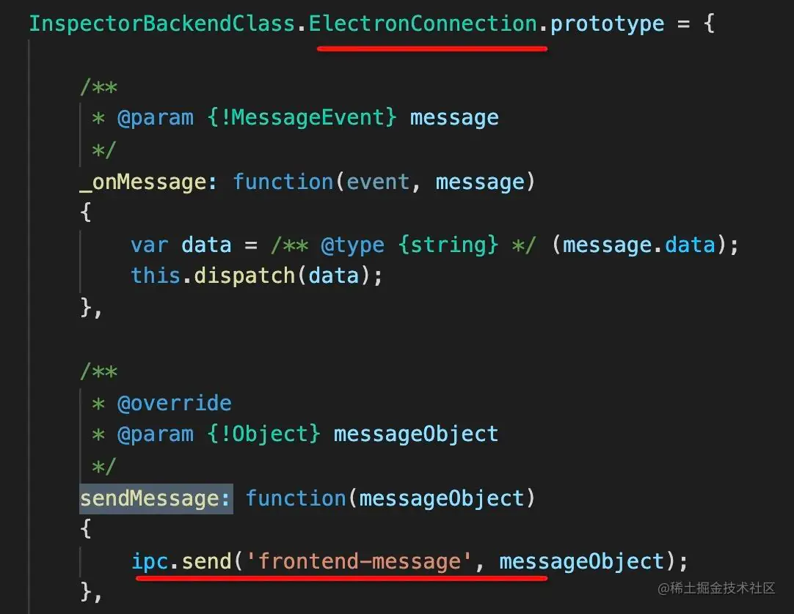

嵌入到一个环境的时候是这样的：

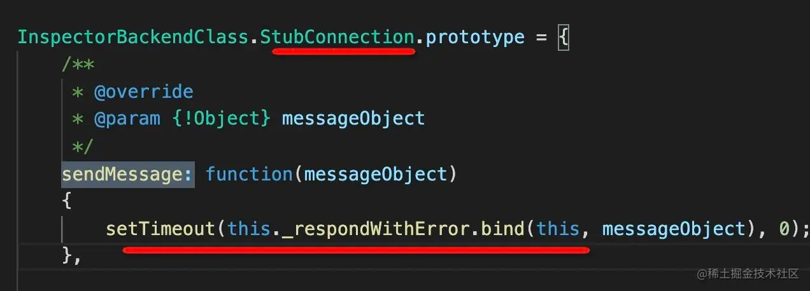

而且，像上面那种在一个窗口里渲染，在另一个窗口里调试的这种需求，electron 直接提供了 api 来支持。

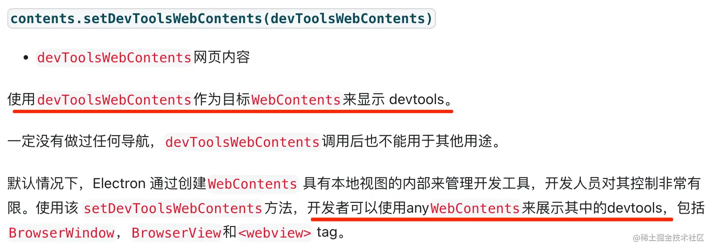

使用 setDevToolsWebContents 的 api，就可以让 devtools 的 frontend 显示在任意的窗口里。

所以，小程序的调试工具实现起来还是很简单的，不但 CDP 交互不用自己实现，而且一个窗口渲染，一个窗口显示 Chrome DevTools frontend 这种功能 electron 都已经提供了。

## 总结

这节我们探究了下 Chrome DevTools 的实现原理，它只是一个对接了 CDP 的 UI，完全可以用来调试别的 target，只要实现对应的 CDP backend 即可。

CDP 协议可以在 Protocol Monitor 里看到，分成了多个 Domain，每个 Domain 下有很多 Method 和 Event。

有很多用 Chrome DevTools 调试别的目标的工具，而前端领域的跨端引擎、小程序引擎也是通过这种方式实现的。

跨端引擎要自己实现 CDP 协议的对接，而小程序引擎简单一些，本来就有了 CDP backend，对接到 frontend 即可。
