# 46.基于 CDP 实现 Puppeteer（下）

上一节我们实现了 Chromium 的自动下载，这节把 Chromium 跑起来，实现远程控制。

你是否好奇过 Puppeteer 的远程控制是怎么实现的呢？

其实也是基于 Chrome DevTools Protocol，它是 chrome devtools 和 chromium 通信的协议，chrome devtools 用它来获取 chromium 的一些信息，并且还可以控制 chromium 来做一些事情。


在 chrome devtools 里打开 Protocol Monitor，就可以看到 CDP 的数据：


chrome devtools 里展示的数据，控制浏览器执行一些行为，都是通过这个实现的，Puppeteer 也同样是基于这个。

在 [CDP 的文档](https://chromedevtools.github.io/devtools-protocol/)可以看到协议的详细描述：

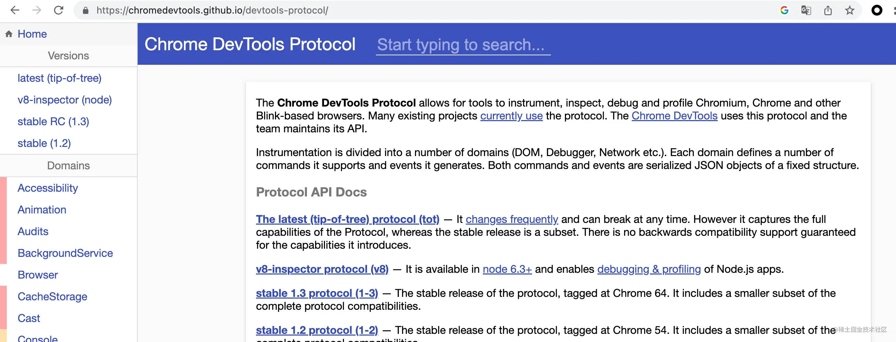

它是分为不同的域的，比如 Page、Browser、Network 等，分区来管理不同的协议。

比如 Page.navigate 可以让页面导航到某个 url：

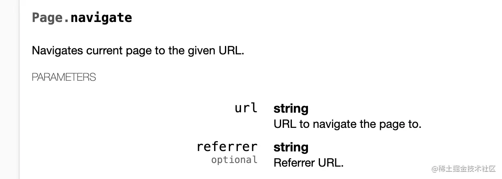

Page.close 可以关闭页面


Browser.close 可以关闭浏览器


Puppeteer 就是基于这些来远程控制 Chromium 的。

我们来实现一下。

首先，我们手动走下这个流程：

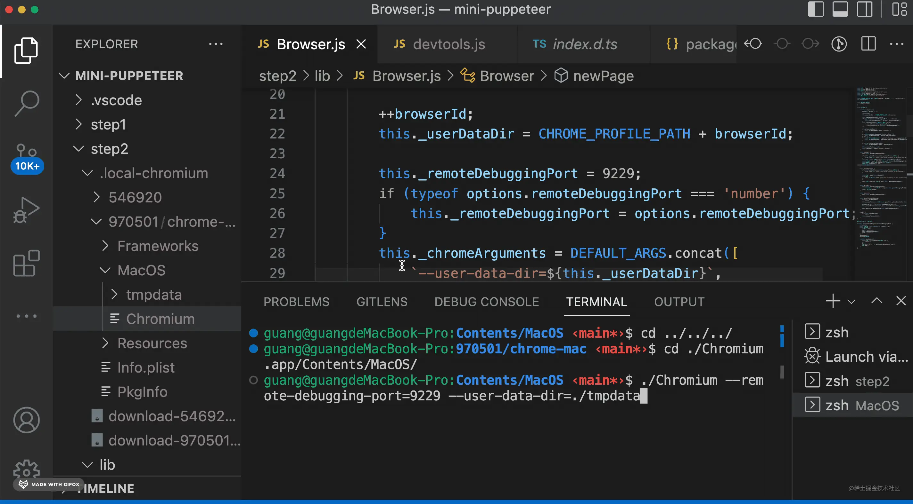

启动前面下载的 Chromium 浏览器，指定启动参数 --remote-debugging-port 和 --user-data-dir

--remote-debugging-port 就是调试服务的启动端口，--user-data-dir 是保存用户数据的地方

用户数据是指插件、浏览记录、历史、Cookie、网站数据等所有用户使用浏览器时的数据，指定了 userDataDir，chromium 就会把数据保存在那个目录：

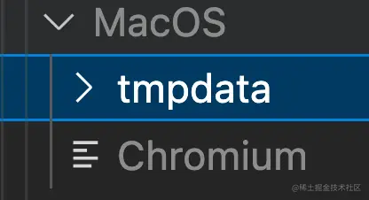

但这个参数在低版本的 chromium 不支持，所以如果有报错就用版本高一点的 chromium 来跑，比如我这里用的是 970501

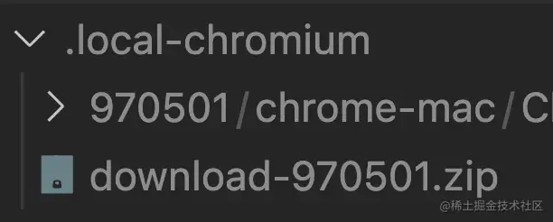

以调试模式跑起 Chromium 之后，访问 http://localhost:9929/json/list 就可以看到每个页面的 ws 服务的信息，可以连上每个页面进行调试：


比如我再访问下 baidu 和 juejin，就会多这俩页面的 ws 调试服务的信息：

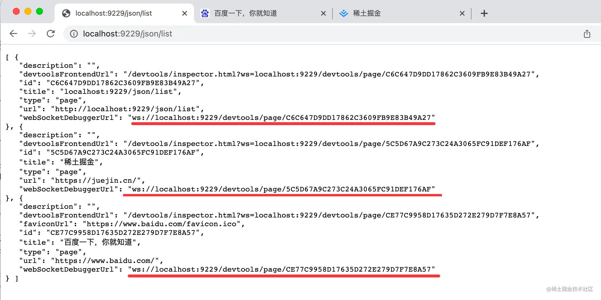

我们可以用 http://localhost:9929/json/list 这个页面是否可以打开来判断浏览器是否以调试模式启动成功了。

然后你还会发现 /json/new 可以新建一个页面：

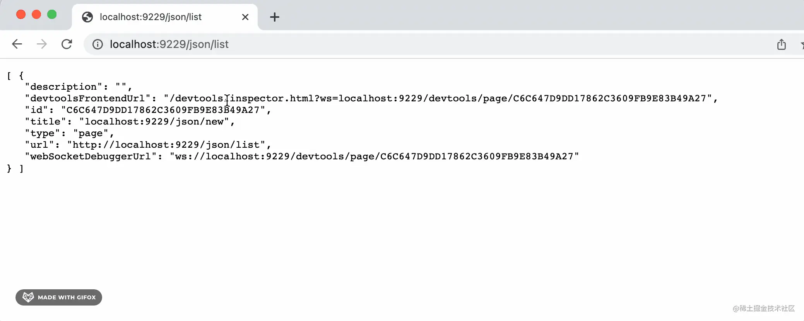

Puppeteer 新建页面也是这样实现的。

下面我们把这个流程用代码来实现一下：

我们先处理下 chromium 的启动参数，也就是 user-data-dir、remote-debugging-port 等这些：

```javascript
let browserId = 0;

//用户数据目录
const CHROME_PROFILE_PATH = path.resolve(__dirname, '..', '.dev_profile');

class Browser {

    constructor(options) {
        options = options || {};

        ++browserId;
        this._userDataDir = CHROME_PROFILE_PATH + browserId;

        this._remoteDebuggingPort = 9229;
        if (typeof options.remoteDebuggingPort === 'number') {
            this._remoteDebuggingPort = options.remoteDebuggingPort;
        }
        this._chromeArguments = [ 
            `--user-data-dir=${this._userDataDir}`,
            `--remote-debugging-port=${this._remoteDebuggingPort}`,
        ];

        if (options.headless) {
            this._chromeArguments.push(`--headless`);
        }

        if (typeof options.executablePath === 'string') {
            this._chromeExecutable = options.executablePath;
        } else {
            const chromiumRevision = require('../package.json').puppeteer.chromium_revision;
            this._chromeExecutable = Downloader.executablePath(chromiumRevision);
        }

        if (Array.isArray(options.args))
            this._chromeArguments.push(...options.args);

        this._chromeProcess = null;
    }
}
```

这段逻辑就是 Browser 的启动参数的处理，包括启动路径 _chromeExecutable，启动参数 user-data-dir 的路径、headless、remote-debugging-port。

启动参数有了，接下来就是启动 Chromium 了：

```javascript
const childProcess = require('child_process');
const removeRecursive = require('rimraf').sync;

async launch() {
    if (this._chromeProcess)
        return;
    this._chromeProcess = childProcess.spawn(this._chromeExecutable, this._chromeArguments, {});

    process.on('exit', () => this._chromeProcess.kill());
    this._chromeProcess.on('exit', () => removeRecursive(this._userDataDir));
}
```

启动 chromium 就是通过 childProcess 以子进程的方式启动，并且在它退出的时候递归删除下用户数据目录。

这里的 rimraf 是第三方的包，node 只提供了删除单个文件或目录的 api fs.unlink，不支持递归删除。

这样就通过代码的方式把我们手动启动浏览器的步骤给自动化了。

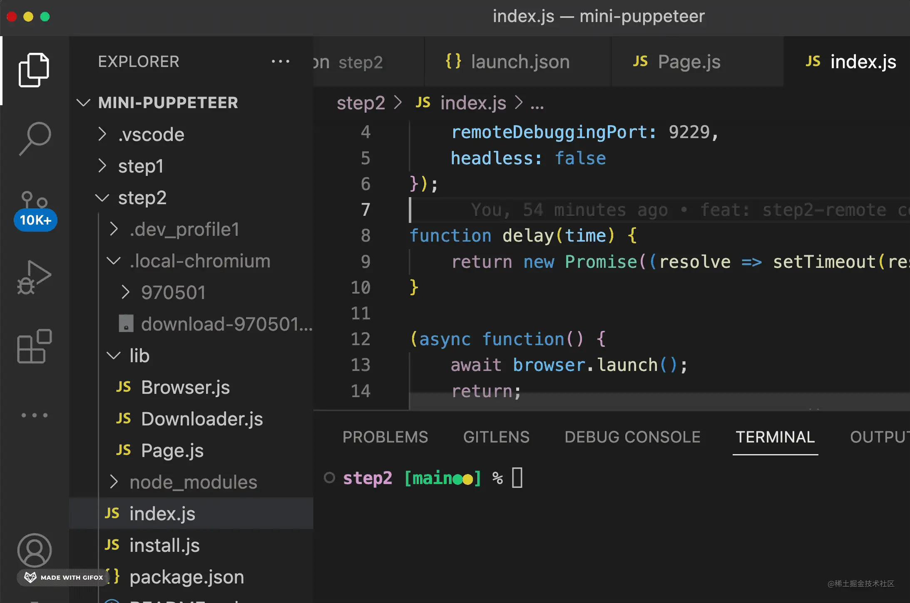

CDP 协议只有以调试模式启动 Chromium 的时候才能生效，所以我们要保证它是启在调试模式的，也就是访问下 http://localhost:9929/json/list 是有数据的：

所以要加一段这样的逻辑：

```javascript
function waitForChromeResponsive(remoteDebuggingPort) {
    var resolve;
    const promise = new Promise(x => resolve  = x);

    const options = {
        method: 'GET',
        host: 'localhost',
        port: remoteDebuggingPort,
        path: '/json/list'
    };
    sendRequest();
    return promise;

    function sendRequest() {
        const req = http.request(options, res => {
            resolve ()
        });
        req.on('error', e => setTimeout(sendRequest, 100));
        req.end();
    }
}
```

就是访问下这个 url，如果成功就 resolve promise，否则定时重试。

经过这个验证之后，之后就可以通过 CDP 来和 chromium 通信了。

这个方法我们可以把它叫做 _ensureChromeIsRunning，确保 chrome 在调试模式运行的方法：

```javascript
async launch() {
    await this._ensureChromeIsRunning();
}

async _ensureChromeIsRunning() {
    if (this._chromeProcess)
        return;
    this._chromeProcess = childProcess.spawn(this._chromeExecutable, this._chromeArguments, {});

    process.on('exit', () => this._chromeProcess.kill());
    this._chromeProcess.on('exit', () => removeRecursive(this._userDataDir));

    await waitForChromeResponsive(this._remoteDebuggingPort);
}
```
之后就开始通过 CDP 控制浏览器。

这个 CDP 的 WebSocket 通信过程也不用我们自己搞，chrome 提供了一个 chrome-remote-interface 的包。

比如我们可以用它新建一个页面：

```javascript
const CDP = require('chrome-remote-interface');

async newPage() {
    await this._ensureChromeIsRunning();

    if (!this._chromeProcess || this._chromeProcess.killed) {
        throw new Error('ERROR: this chrome instance is not alive any more!');
    }

    const tab = await CDP.New({port: this._remoteDebuggingPort});
}
```

跑起来确实可以看到 chromium 新建了一个页面，这就是我们实现的第一个远程控制效果！（原理就是访问 /json/new）

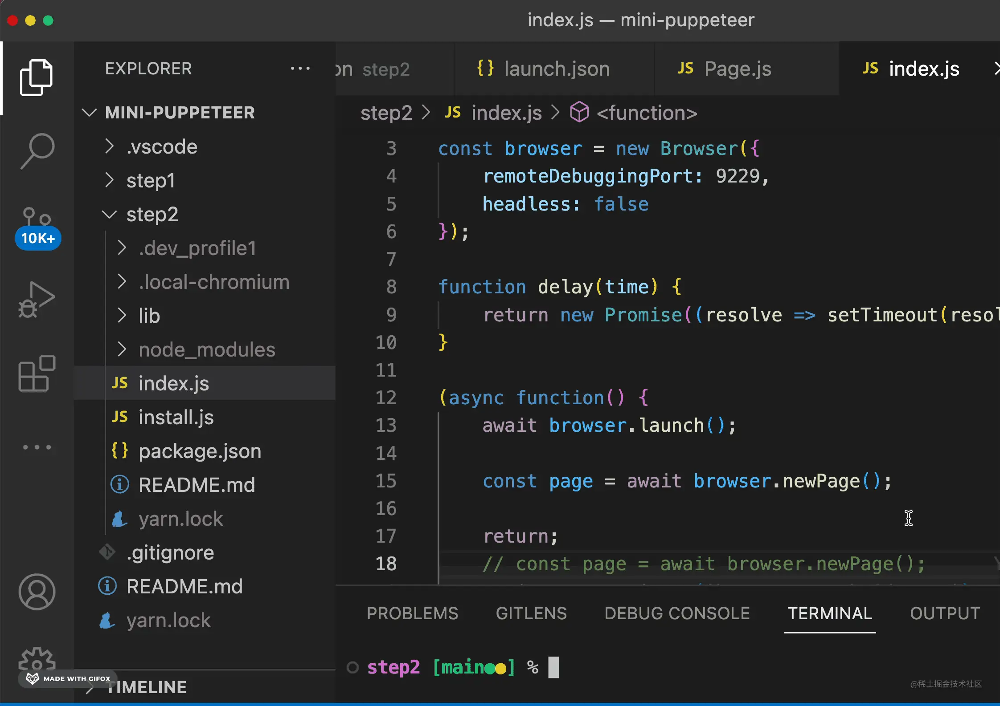

接下来进行更多的 page 的控制，Page 级别的控制我们单独封装一下，放到 Page 的类里：

```javascript
class Page{

    static async create(browser, client) {
        await client.send('Page.enable', {});

        const page = new Page(browser, client);
        return page;
    }

    constructor(browser, client) {
        this._browser = browser;
        this._client = client;
    }
}
```
需要传入浏览器实例和 CDP 客户端。

所以在 Browser 的 newPage 方法里就创建个 page 的对象返回，之后的控制都交给它：

```javascript
const CDP = require('chrome-remote-interface');

async newPage() {
    await this._ensureChromeIsRunning();

    if (!this._chromeProcess || this._chromeProcess.killed) {
        throw new Error('ERROR: this chrome instance is not alive any more!');
    }
    const tab = await CDP.New({port: this._remoteDebuggingPort});
    
    const client = await CDP({tab: tab, port: this._remoteDebuggingPort});
    const page = await Page.create(this, client);
    page[this._tabSymbol] = tab;
    return page;
}
```
CDP 传入 port 参数和 tab 参数，那连接的就是这个 tab 页面的 ws 调试服务，也就是我们在 /json/list 里看到的那个：


之后开始做一些页面级别的控制：

CDP 每个域的使用都要先开启下，创建 Page 对象的时候我们已经开启了 Page 域的协议：

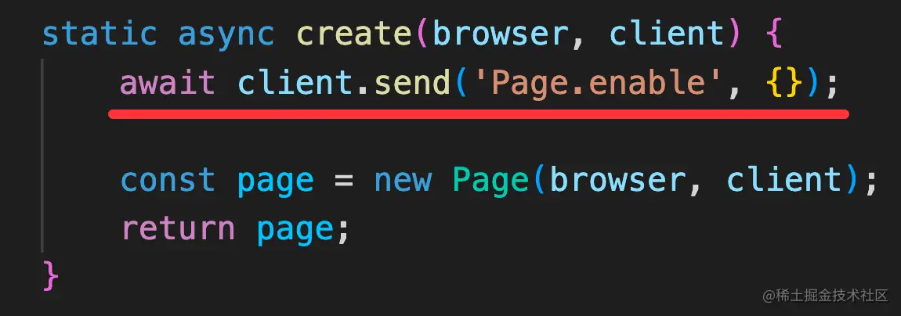

然后实现个 navigate 方法：

```javascript
async navigate(url) {
    var loadPromise = new Promise(resolve => this._client.once('Page.loadEventFired', resolve)).then(() => true);

    await this._client.send('Page.navigate', {url});
    return await loadPromise;
}
```
通过 CDP 协议里的 Page.navigate 来导航到某个 url，在 Page.loadEventFired 的时候 resolve。

然后再实现个 setContent 方法：
```javascript
async setContent(html) {
    var resourceTree = await this._client.send('Page.getResourceTree', {});
    await this._client.send('Page.setDocumentContent', {
        frameId: resourceTree.frameTree.frame.id,
        html: html
    });
}
```
这个是设置 Page 的 html 内容的 CDP 协议，需要传入 frameId，这个可以通过 Page.getResourceTree 拿到。

最后我们再去 Browser 那里实现俩方法，之后再一起测试。

加一个 version 方法，用于获取浏览器版本：
```javascript
async version() {
    await this._ensureChromeIsRunning();
    const version = await CDP.Version({port: this._remoteDebuggingPort});
    return version.Browser;
}
```
加一个 close 方法用于关闭浏览器：

```javascript
close() {
    if (!this._chromeProcess)
        return;
    this._chromeProcess.kill();
}
```
至此，全部搞定之后，我们整体来调用一下：

```javascript
const Browser = require('./lib/Browser');

const browser = new Browser({
    remoteDebuggingPort: 9229,
    headless: false
});

function delay(time) {
    return new Promise((resolve => setTimeout(resolve, time)))
}

(async function() {
    await browser.launch();

    const page = await browser.newPage();
    await page.navigate('https://www.baidu.com');

    await delay(2000);
    const version = await browser.version();
    await page.setContent(`<h1 style="font-size:50px">hello, ${version}</h1>`);

    await delay(2000);
    await page.close();

    await delay(1000);
    await browser.close();
})()
```
我们创建了一个 Browser，传入启动参数，然后把它跑起来，之后创建了个新页面，导航到 baidu，2s 后修改了内容，再 2s 关闭页面，之后再 1s 关闭浏览器。

我们跑一下试试：

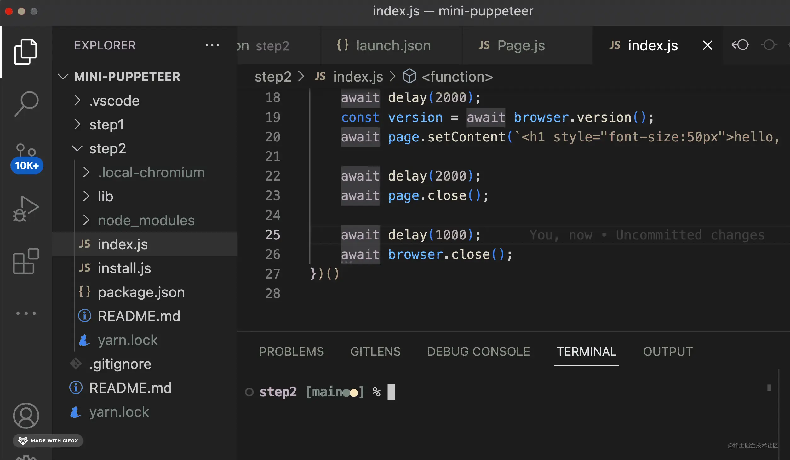

可以看到，Chromium 正确执行了我们写的脚本！

puppeteer 还能远程执行 JS，也就是在脚本里写一段 JS，puppeteer 会把它发给浏览器执行，最后返回结果。

这个是怎么实现的呢？

CDP 协议里的 Runtime.evaluate 就是用来执行一段 JS 表达式的：

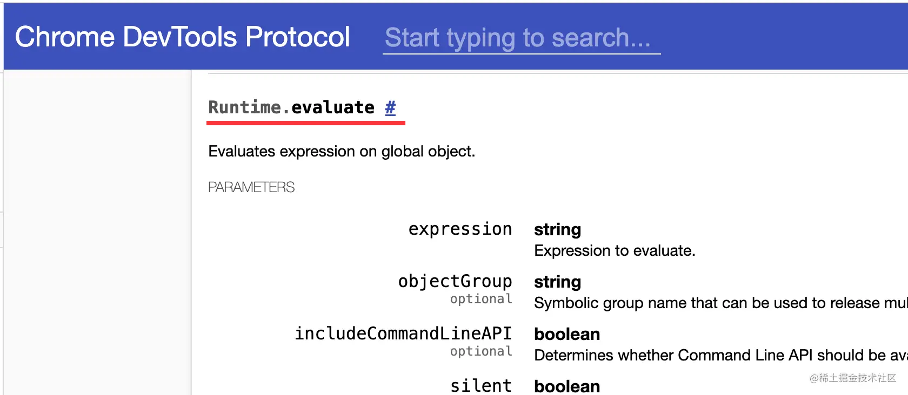

我们平时在 console 里写的代码能够计算出结果就是通过这个协议。

我们封装这样一个函数：

```javascript
function evaluate(client, fun, args) {
    var argsString = args.map(x => JSON.stringify(x)).join(',');
    var code = `(${fun.toString()})(${argsString})`;

    return client.send('Runtime.evaluate', {
        expression: code,
        returnByValue: true
    });
}
```
它就是通过 CDP client 给留浏览器发一个 Runtime.evaluate 的协议数据，内容是 stringify 之后的函数。

并在 Page.js 里添加这样一个 evaluate 方法：

```javascript
async evaluate(fun, ...args) {
    var response = await evaluate(this._client, fun, args, false);

    return response.result.value;
}
```

然后就可以使用 evaluate 来远程执行 JS 了：

我们把 index.js 的测试脚本改成这样：

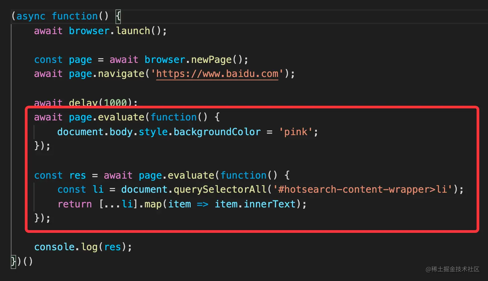

把 baidu 页面的背景改为粉色，并且拿到热榜列表的文本数据。

测试下：

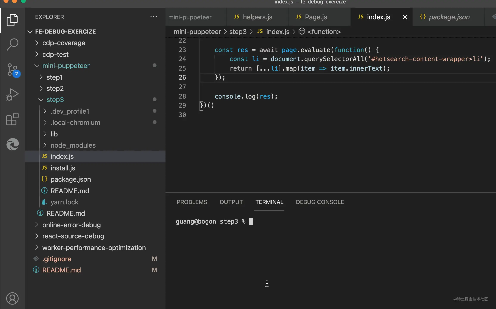

这样就能远程执行 JS 了。

至此，我们实现了 Puppeteer 的基本功能。

代码在[小册仓库](https://github.com/QuarkGluonPlasma/fe-debug-exercize)里，大家可以下下来跑跑

## 总结

这一节我们实现了启动 Chromium 并远程控制，还有远程执行 JS。

Chromium 指定 remote-debugging-port 的参数的时候就会以调试模式来跑，如果可以通过 http://localhost:9229/json/list 拿到调试的数据就证明启动成功了。

之后可以通过 CDP 协议来进行页面级别的控制，这就是 Puppeteer 的原理。

我们实现了浏览器的打开、关闭、查看版本号，页面的新建、导航、设置内容等功能，还实现了 JS 的远程执行。

这就是一个简易版 puppeteer 了，其他的功能也是基于 CDP 实现的。

通过这个案例，我们也能更深刻的理解 CDP。
