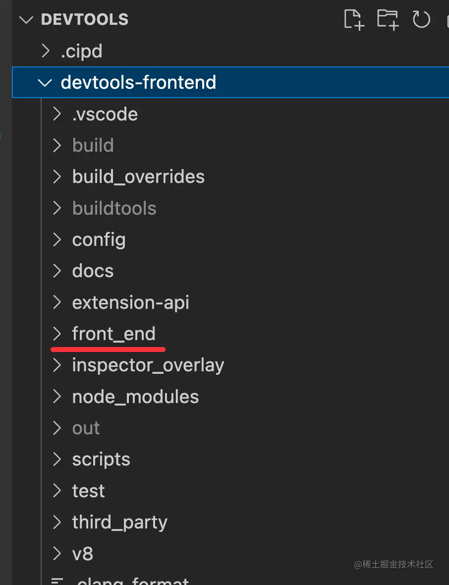
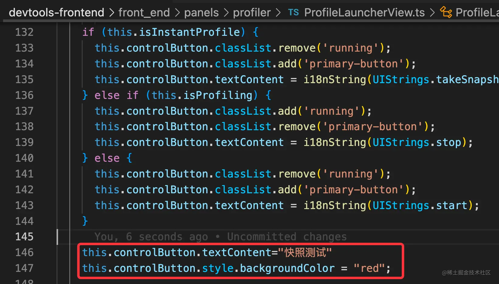
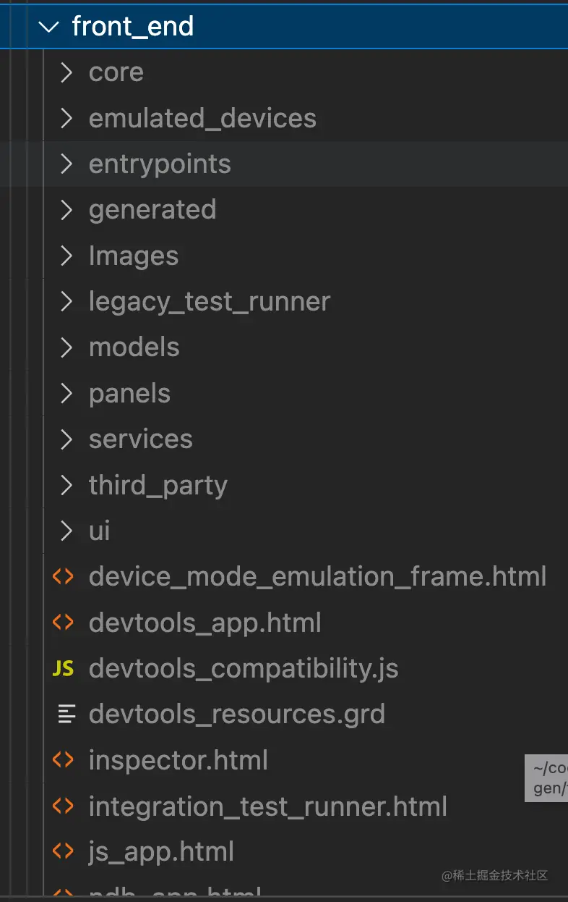
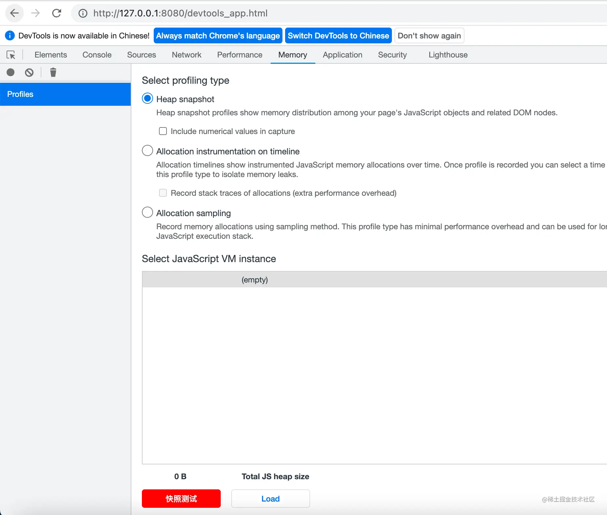
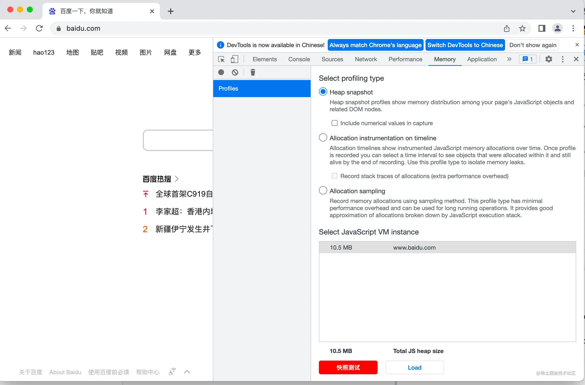
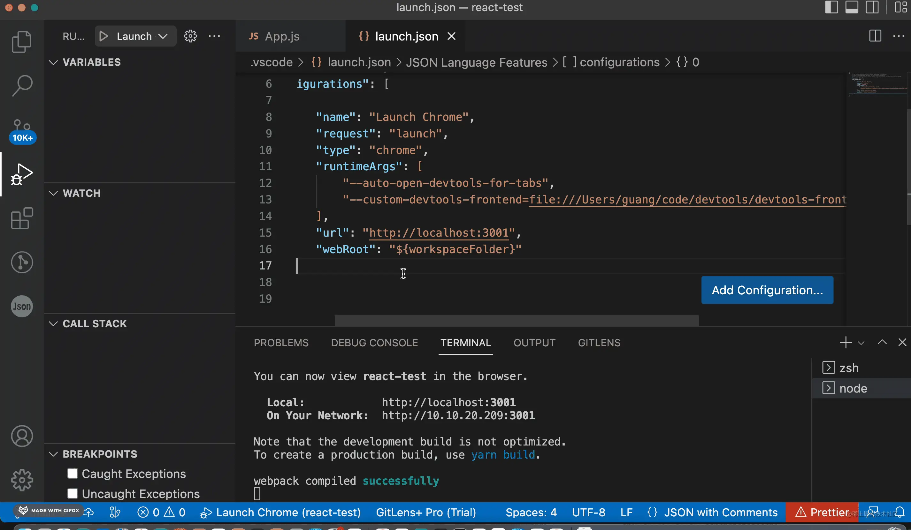

# 47.编译 chrome devtools frontend 源码，然后用它来调试

前面我们通过 npm 下载过 chrome devtools frontend 的代码：

```
npm install chrome-devtools-frontend@1.0.672485
```
但是那个是比较老的版本，不需要 build。

如果想用新版本的 chrome devtools frontend，就需要下载源码自己 build 了。

这节我们一起来编译下 chrome devtools frontend 源码，并且做下修改，生成新的 chrome devtools。

## 下载 depot_tools

chrome devtools frontend 有一套自己的工具链，我们先把这套工具链下载下来。

从 google code 下载即可（需要科学上网）：

```
git clone https://chromium.googlesource.com/chromium/tools/depot_tools.git
```
它有很多命令，我们要把它夹到环境变量里，这样就能直接用了：

```
export PATH=/本地的路径/depot_tools:$PATH
```

我们会用到这个工具链的 fetch/gn/autoninja/gclient 这些命令。

下面下载 chrome devtools frontend 代码：

## 下载和编译 devtools frontend

创建个 devtools 目录：
```
mkdir devtools

cd devtools
```
然后在 devtools 目录下执行 fetch 下载 devtools frontend 代码（这步也是从谷歌网站下载代码，需要科学上网）：

```
fetch devtools-frontend
```

这个 fetch 命令就是前面那个 depot_tools 工具包里的。

下载完之后，font_end 目录下就是 devtools 的前端代码：



我们改一些代码，比如 front_end/panels/profiler/ProfileLauncherView.ts 里加两行代码：



```
this.controlButton.textContent="快照测试"
this.controlButton.style.backgroundColor = "red";
```

然后执行编译。

在 devtools-frontend 目录下执行：

```
gn gen out/Default --args='devtools_skip_typecheck=true'

autoninja -C out/Default
```

gn 是生成编译配置的，而 autoninja 是编译的，这俩都是 depot_tools 工具包的命令。

编译完之后就可以在 out/Default/gen/front_end 下看到编译产物了：



这些 html 是不是似曾相识？

没错，这就是我们之前测试 CDP 用的那些 chrome-devtools-fontend 包里的 html。

在这个目录下执行 npx http-server .

然后点开 html 就可以了。

比如 devtools_app.html：



看到那个大红按钮了没？

这就是我们修改 ts 源码然后编译产生的 devtools frontend。

那能不能平时也用自己改过的 chrome_devtools_frontend 来调试呢？

当然是可以的：

chrome 有个 --custom-devtools-frontend 的启动参数可以自定义 frontend：

```
sudo "/Applications/Google Chrome.app/Contents/MacOS/Google Chrome" --custom-devtools-frontend=file://本地路径/devtools/devtools-frontend/out/Default/gen/front_end
```

跑起来在用 chrome devtools 你就会发现是用的我们改过的了：



那在用 vscode debugger 调试的时候，能不能用呢？

当然可以：

```json
 {
    "name": "Launch Chrome",
    "request": "launch",
    "type": "chrome",
    "runtimeArgs": [
        "--auto-open-devtools-for-tabs",
        "--custom-devtools-frontend=file:///Users/guang/code/devtools/devtools-frontend/out/Default/gen/front_end"
    ],
    "url": "http://localhost:3001",
    "webRoot": "${workspaceFolder}"
}
```

我们之前加过启动参数，再加一个 --custom-devtools-frontend 的启动参数即可。



这样我们平时调试就可以用自己修改过后的 chrome devtools 了。

## 总结

这节我们编译了 chrome devtools frontend 的 ts 源码，并且修改之后在 chrome 里使用。

下载和编译 devtools frontend 代码需要使用 depot_tools 的工具链，它提供了一些命令，加到 PATH 环境变量中就可以直接用了。

通过 --custom-devtools-frontend  的启动参数就可以指定 chrome 用自定义的 chrome devtools，我们平时用 VSCode Debugger 调试的时候也可以使用。

你完全可以定制自己的 chrome devtools，比如删掉一些工具，加上你自己的一些小工具，然后平时用这个 chrome devtools 来调试！