# 49.把 Puppeteer 融入调试流程来做自动化

中后台系统表单比较多，每次调试都要填一堆东西，而且项目需要登录，经常需要来一遍登录流程，再填写表单来调试。这个流程还是比较繁琐的。

于是我在想，自动化测试工具 puppeteer 是可以通过脚本来自动执行浏览器操作的，能不能调试的时候让 puppeteer 帮我自动做了页面操作的一些流程呢？

我试了一下还真可以，用 puppeteer 来自动执行脚本，并且过程中还可以打断点调试，调试体验简直不要太爽。

这节就来分享下。

首先，react 项目是通过 vscode debugger 来调试的：

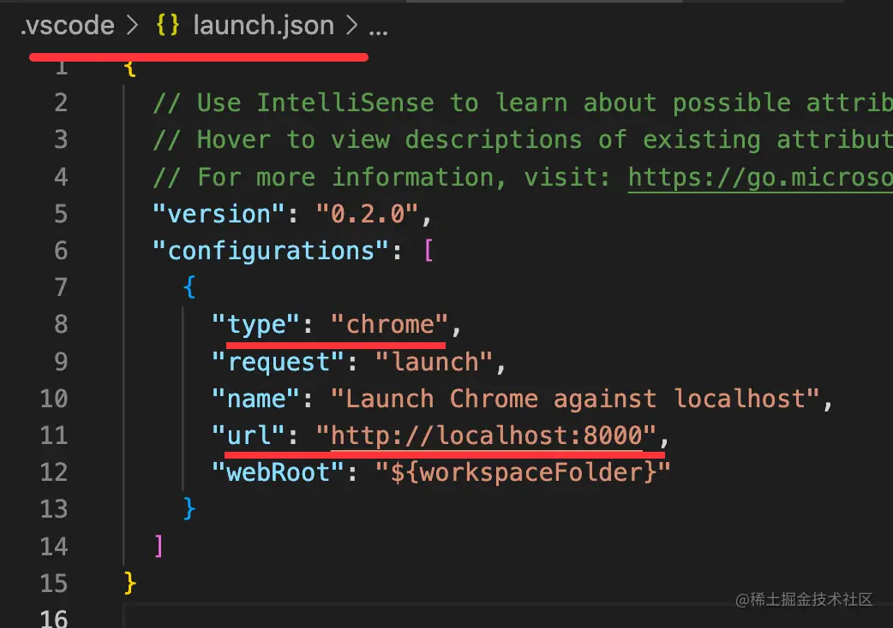

在 .vscode > launch.json 的调试配置文件里新增一个 chrome 类型的调试配置，输入调试的 url。

然后点击 debug 启动：

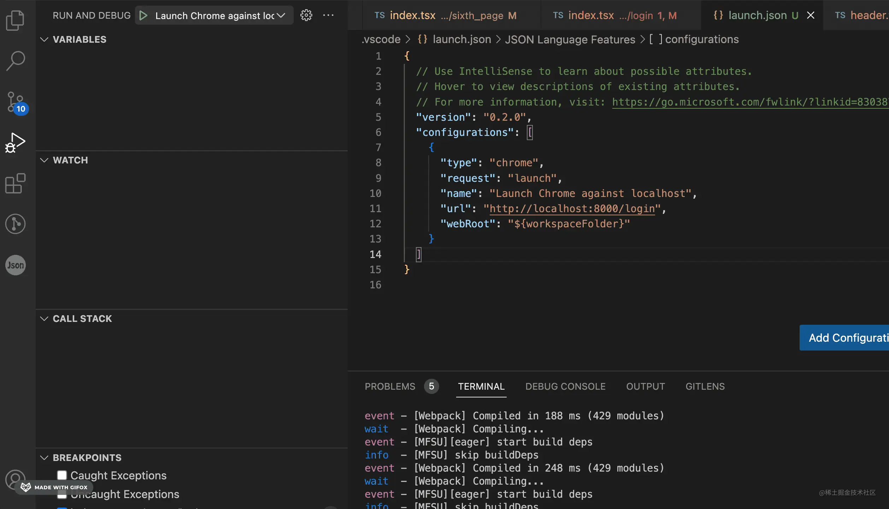

执行到代码中的断点就会在 vscode 里断住：

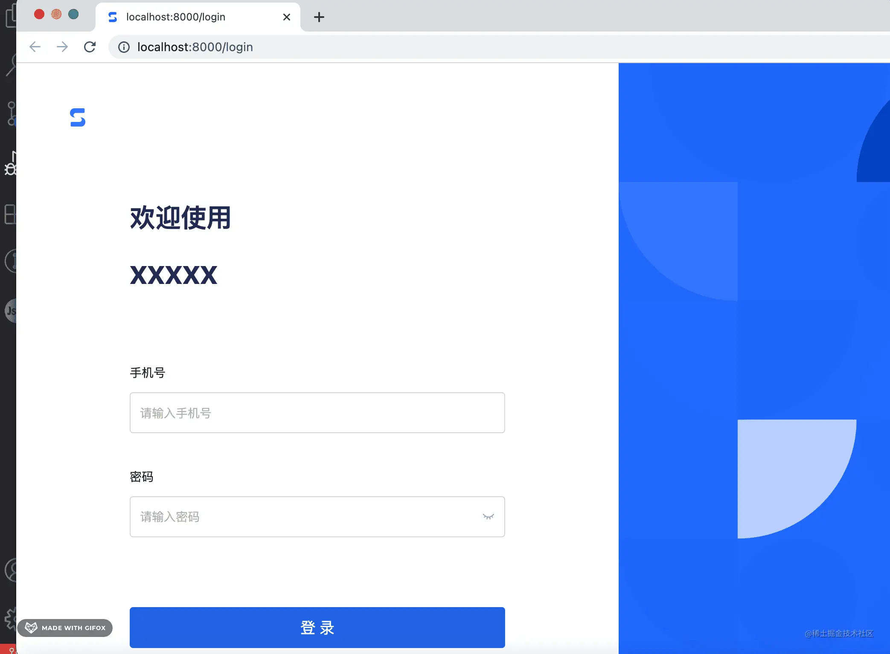

这样就可以在 vscode 里断点调试 react 项目了。

但登录还是比较麻烦的，用户名密码我经常忘，而且登录之后还要填一些表单，也很麻烦。

这时候我想到了 puppeteer。

它是可以自动执行脚本的。

比如这样一段脚本：

```javascript
const puppeteer = require('puppeteer');

(async () => {
  const browser = await puppeteer.launch({
    headless: false
  });

  const page = await browser.newPage();
  await page.goto('http://localhost:8000/login');

  await page.waitForSelector('#username');

  const $username = await page.$('#username');
  await $username.type('1111111', {
    delay: 100
  });
  
  const $password = await page.$('#password');
  await $password.type('testtest', {
    delay: 100
  });
  
  const $button = await page.$('button[type="submit"]');
  await $button.click();
})();
```
用 puppeteer 启动一个浏览器，headless 设为 false 就是需要界面。

打开新页面，加载 login 的 url，等出现 #username 的元素之后之后，输入用户名和密码，然后点击提交。

这个脚本还是很容易理解的。

跑下试试：

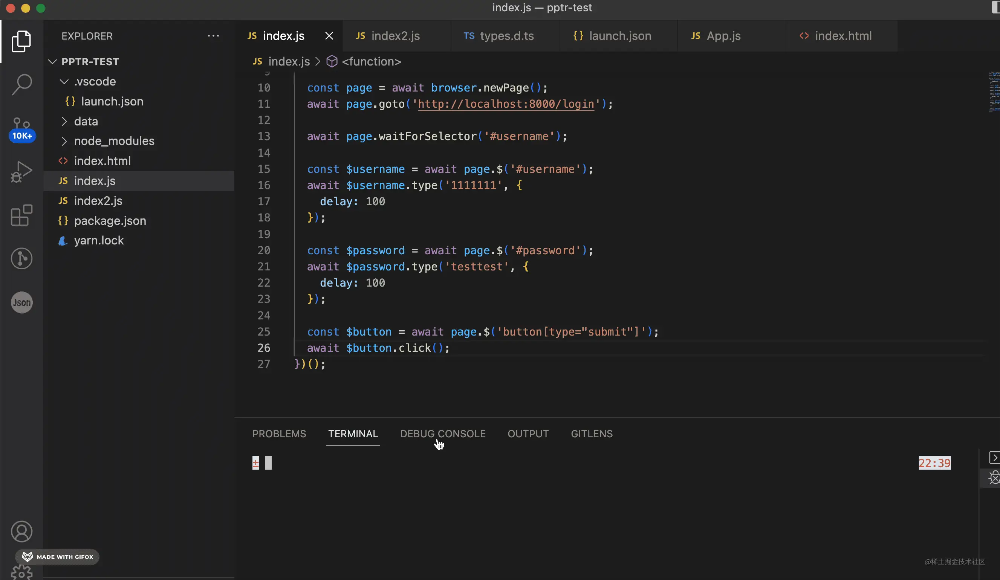

流程倒是对了，只是显示的不对，加个 viewport 的设置就好了：

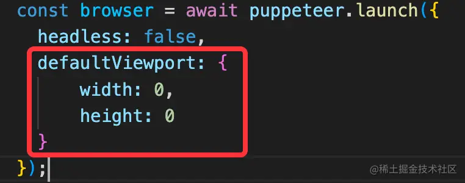

width、height 为 0 会自适应。

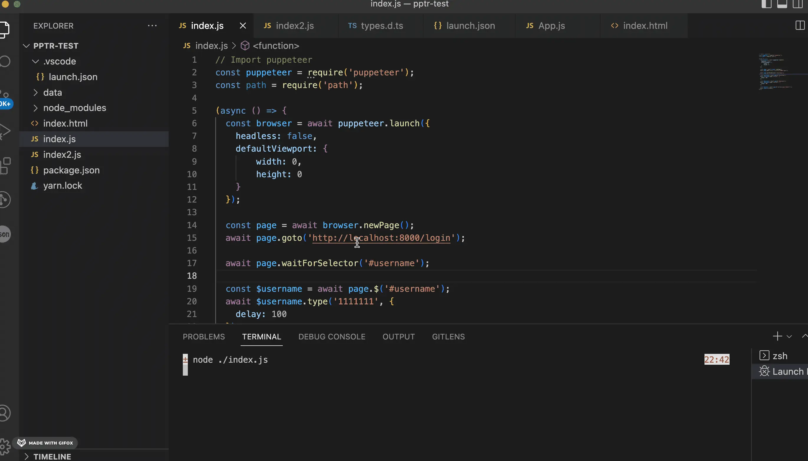

自动跑登录脚本成功了。

此外，launch 支持指定 chrome 的路径，指定 userDataDir，指定启动参数等，和我们调试的时候 launch 浏览器的配置差不多。

那问题来了，断点调试和自动化测试能不能一起跑呢？

看起来这俩都是跑了一个浏览器，应该能融合才对。

这个就要从 puppeteer 和调试的实现原理来看了。

调试是基于调试协议的，比如网页调试是 Chrome DevTools Protocol。

Chrome DevTools 对接了 CDP 可以调试网页，我们用 VSCode Debugger 能调试网页同样也是对接了 CDP。

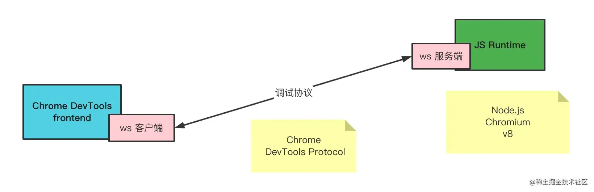

puppeteer 能控制浏览器执行一些脚本，也是基于 CDP。

这俩都需要浏览器在调试模式启动，也就是指定 remote-debugging-port。

我们前面跑 react 项目的调试是用的 launch 的方式，它会自动跑一个调试浏览器，然后连接上 ws 调试服务。

其实它还有 attach 的方式：

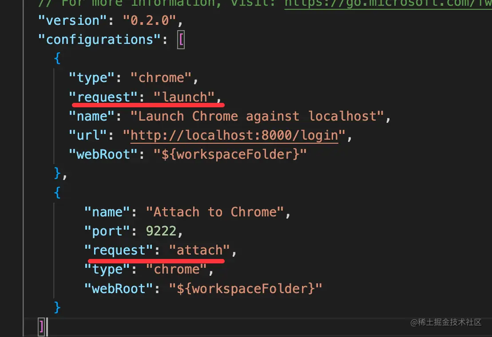

attach 的方式不单独跑调试浏览器，而是连接上已有的浏览器来调试。所以需要指定调试服务的端口。

既然 puppeteer 和调试都要以调试模式跑浏览器，那我们就等 puppeteer 跑起 chrome 之后，vscode debugger 再 attach 上它来调试。

这样不就既能自动化测试，又能断点调试了么？

我们来试一下：

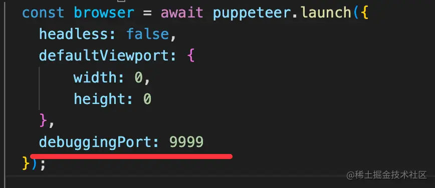

puppeteer 启动 chrome 的时候，我指定了调试端口为 9999。

然后跑下 puppeteer 脚本，把 chrome 跑起来：

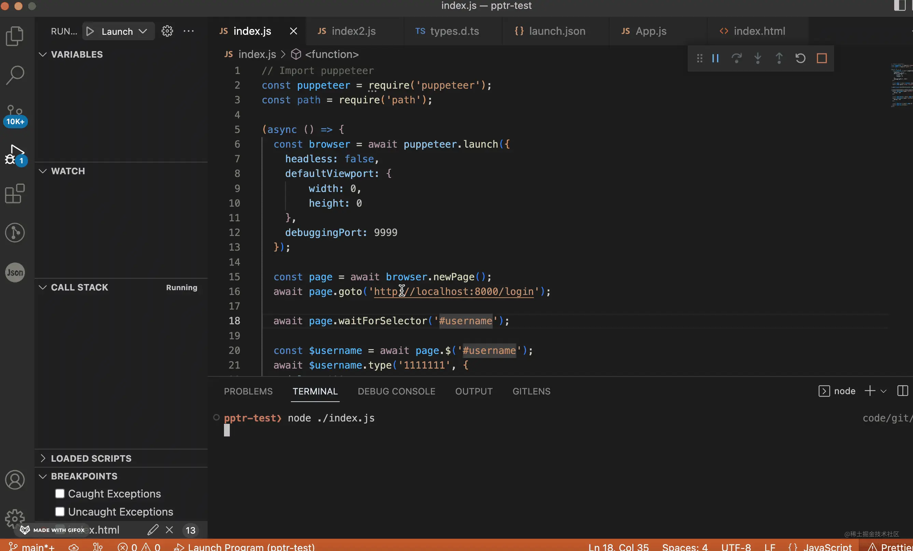

之后，去 react 项目里启动调试，只不过这次是 attach：

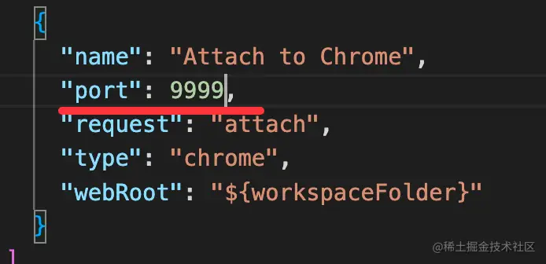

依然是能正常断点调试的：

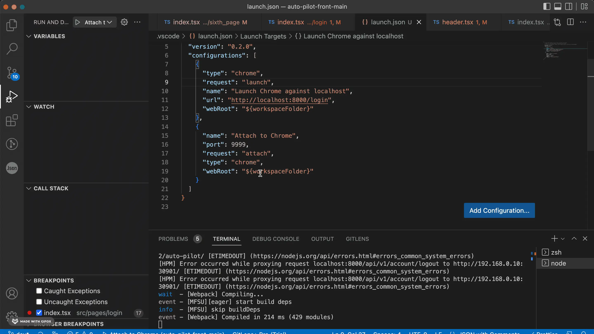

而且现在还可以跑自动化脚本了！

我们改造下 puppeteer 脚本，改成每次输入内容的时候才跑对应的脚本。
 
```javascript
const puppeteer = require('puppeteer');
const readline = require('readline');

(async () => {
  const browser = await puppeteer.launch({
    headless: false,
    defaultViewport: {
      width: 0,
      height: 0
    },
    debuggingPort: 9999
  });

  const page = await browser.newPage();

  const rl = readline.createInterface({
    input: process.stdin,
    output: process.stdout
  });

  rl.on('line', async (str) => {
    if (str === 'login') {
      await login(page);
    } else if (str === 'baidu') {
      await baidu(page);
    }
  });
})();

async function baidu(page) {
  await page.goto('http://www.baidu.com');
}
async function login(page) {
  await page.goto('http://localhost:8000/login');

  await page.waitForSelector('#username');

  const $username = await page.$('#username');
  await $username.type('1111111', {
    delay: 100
  });

  const $password = await page.$('#password');
  await $password.type('testtest', {
    delay: 100
  });

  const $button = await page.$('button[type="submit"]');
  await $button.click();
}
```

主要是加了 readline 模块，这是 node 内置模块，用于一行行读取流的输入用的。

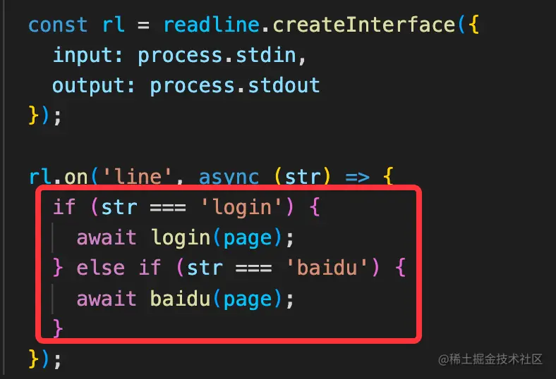

我指定了输入 baidu 的时候打开 baidu，输入 login 的时候打开 localhost:8000，然后执行登录脚本。

试一下：

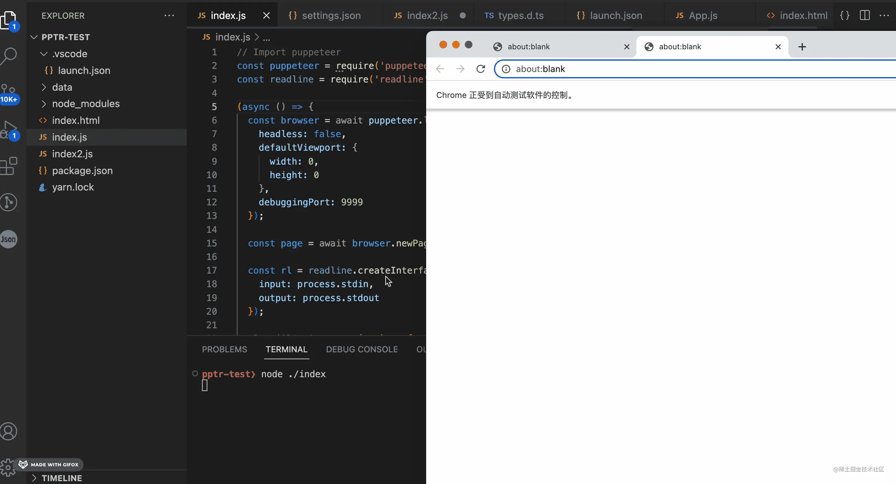

然后我们把 vscode debugger 也 attach 上。

之后再跑 puppeteer 的脚本。

猜下这时候会发生什么？

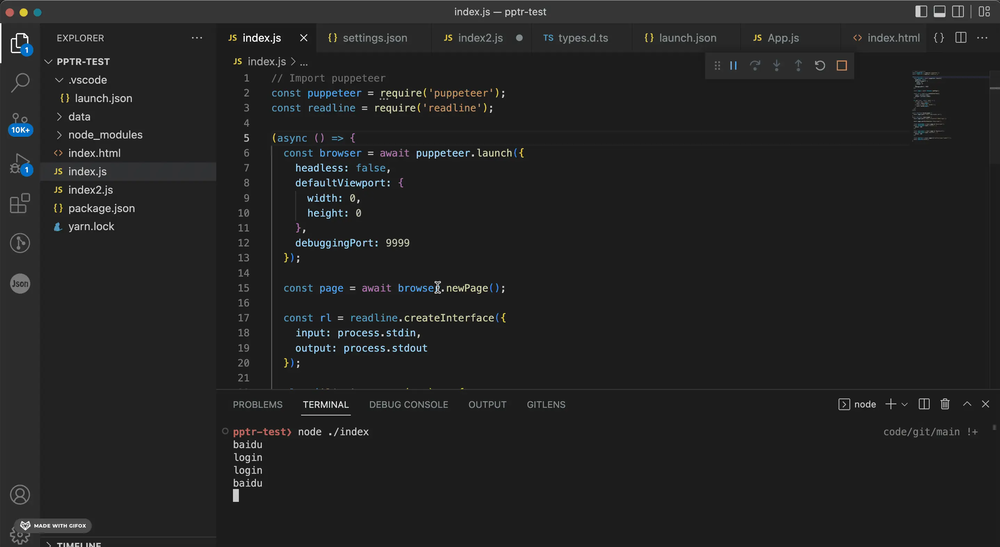

执行了自动化测试脚本，并且还在断点处断住了！

这样我们就不用再手动点点点，可以用脚本自动跑一些流程，而且还可以断点调试这个流程。

我们再改一下脚本：

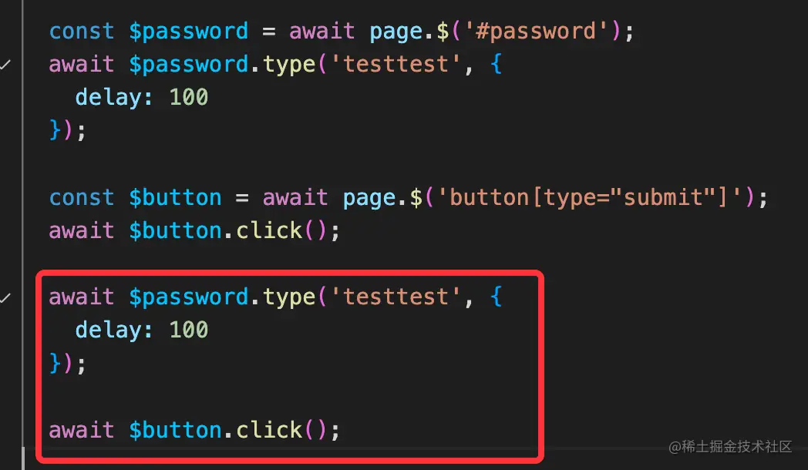

click 之后，又输入了密码，然后再 click：

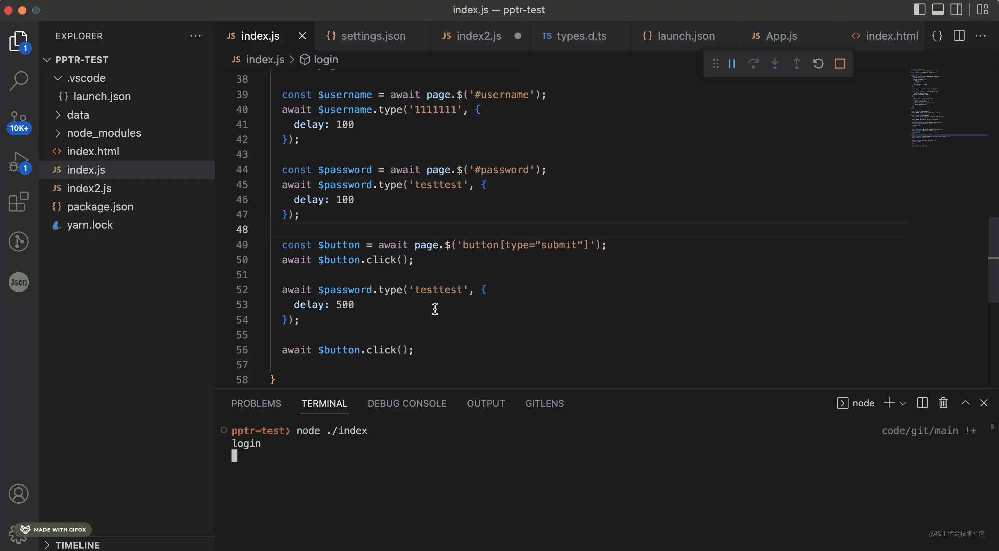

断住的时候浏览器不会执行代码，这时候自动化脚本也就执行不了，可以专心根据调用栈作用域等调试代码，调试完之后，释放断点，自动化脚本才会继续执行。

这样我们就完美的把 puppeteer 的自动化测试和 VSCode Debugger 的网页断点调试结合在了一起。

## 总结

我们会用 VSCode Debugger 断点调试网页，会用 puppeteer 写自动化测试的脚本来测试某条流程。

这俩其实完全可以结合在一起用，因为他们都是基于 CDP，会启动一个调试模式的浏览器。只要 VSCode Debugger attach 到 puppeteer 启动的浏览器就好了。

融合在一起之后，你可以写 puppeteer 脚本来自动化一些流程，比如自动登录、自动填写表单等，这个过程还可以断点调试，断点释放之后再执行后续自动化脚本。

两者简直是完美的配合。

把 puppeteer 融入调试流程，调试体验爽翻了！
