# 7.实战案例：调试 Vue 项目

我们学了如何用 VSCode Debugger 调试网页，也过了一遍各种配置，并且学习了 sourcemap，这节我们实战一下。

前面调试了 React 项目，这节来调试下 Vue 项目。

Vue 项目的创建有两种方式：

- 用 @vue/cli 创建的 webpack 作为构建工具的项目
- 用 create-vue 创建的 vite 作为构建工具的项目

我们分别来看一下：

## 调试 @vue/cli 创建的 webpack 项目

首先安装 @vue/cli：
```
yarn global add @vue/cli
```
然后执行 vue create vue-demo1 创建 vue 项目：


选择 vue3 的模版。

安装完之后进入到 vue-demo1 目录，执行 npm run serve 把开发服务跑起来。

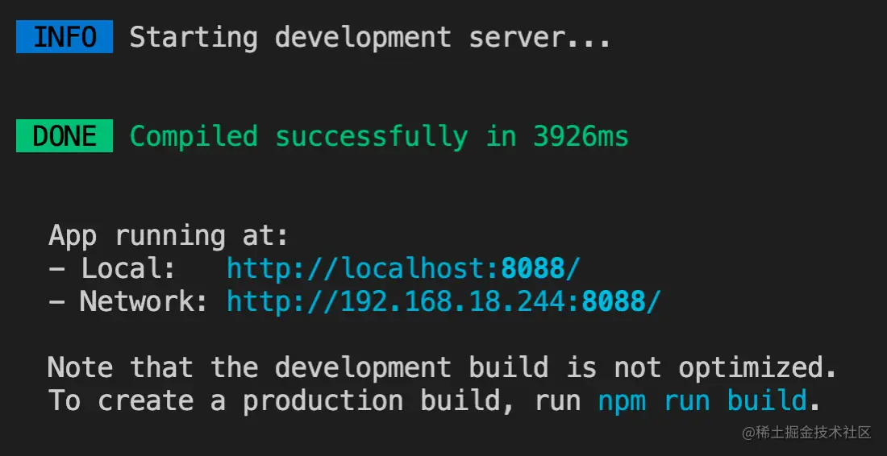

浏览器访问，会看到渲染出的页面：

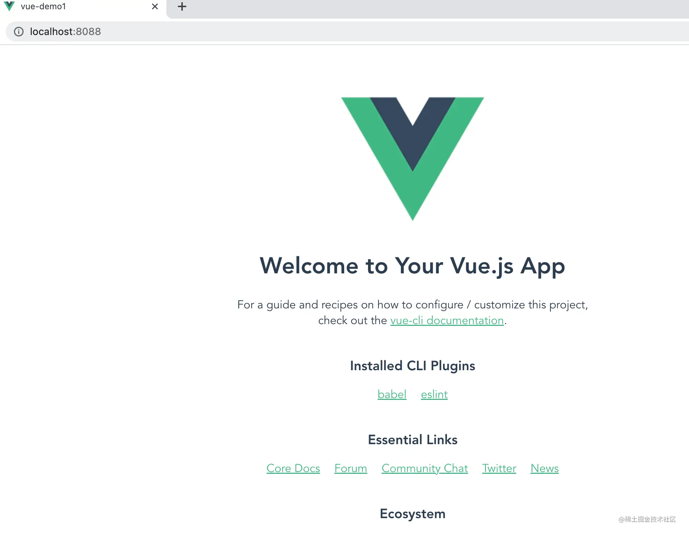

然后我们进行调试：

点击调试窗口的 create a launch.json file 来创建调试配置文件：


把 Chrome 调试配置的 url 改成目标 url 就可以进行调试了：

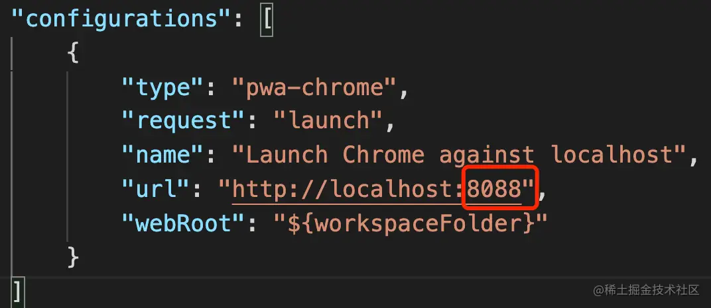

点击 debug 启动，在 vue 组件里打个断点，你会发现断点没生效：

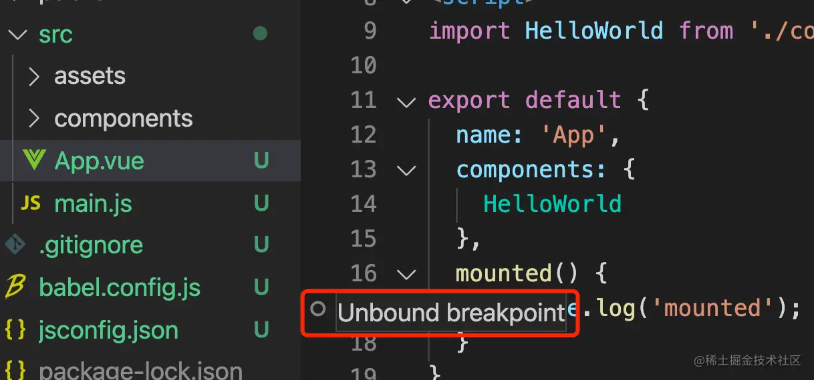

这是为什么呢？

我们先加个 debugger 来跑一下：

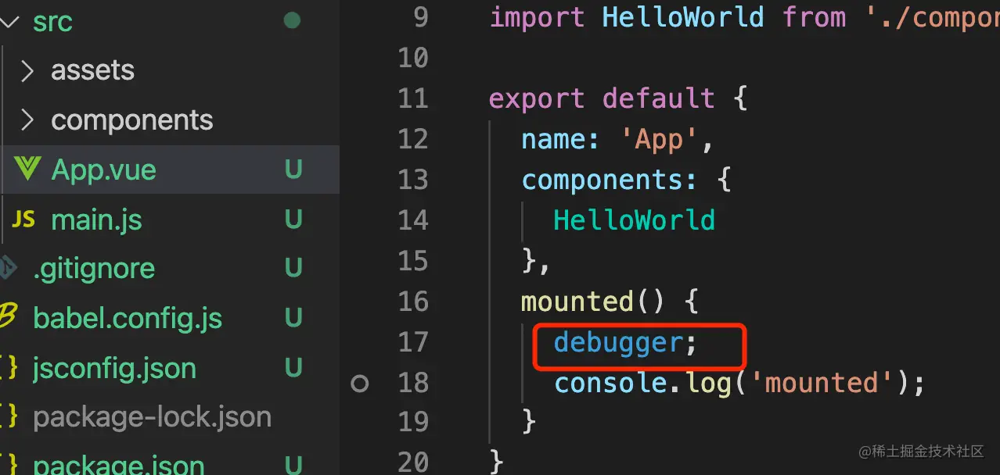

然后在 Chrome DevTools 里看下：

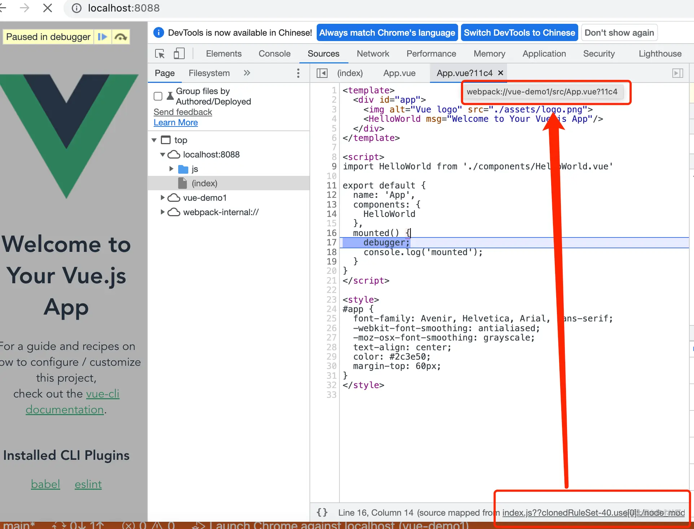

你会发现他从一个乱七八糟的路径，映射到了 webpack://vue-demo1/src/App.vue?11c4 的路径下。

然后在 VSCode Debugger 里看看这个路径：

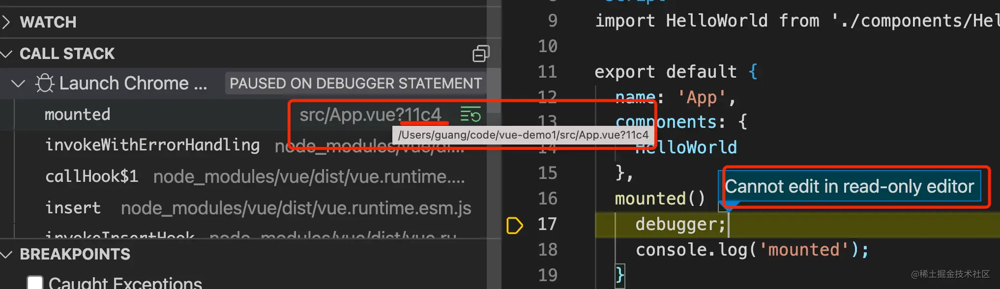

发现是 /Users/guang/code/vue-demo1/src/App.vue?11c4

本地明显没这个文件，所以就只读了。

其实这个路径已经做过了映射，就是完成了从 webpack:///vue-demo1/src/App.vue?11c4  到 /Users/guang/code/vue-demo1/src/App.vue?11c4 的映射。

看一下 sourceMapPathOverrides 默认这三条配置，很容易看出是最后一条做的映射：

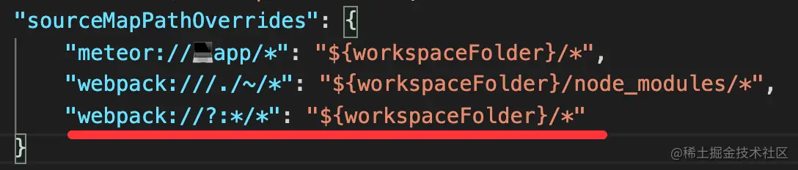

但问题就出现在后面多了一个 ?hash 的字符串，导致路径不对了。

那为什么会多这样一个 hash 呢？

这是因为 vue cli 默认的 devtool 设置是 eval-cheap-module-source-map，前面讲过，eval 是每个模块用 eval 包裹，并且通过 sourceURL 指定文件路径，通过 sourceMappingURL 指定 sourcemap。

在 Chrome DevTools 里点击下面的 source map from 的 url：

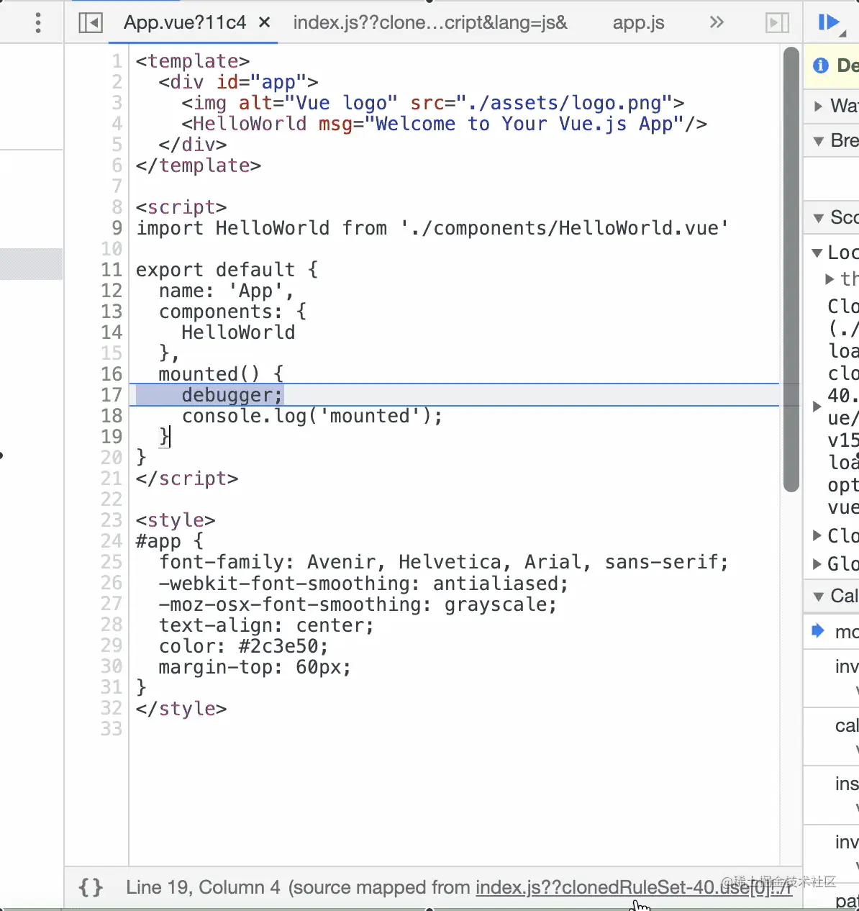

你会发现先映射到了一个中间文件：

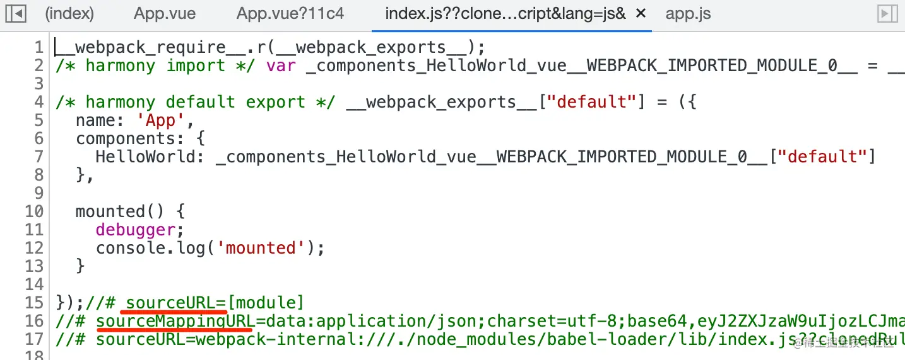

这个是被 eval 包裹并指定了 sourceURL 的模块代码，会被 Chrome DevTools 当作文件加到 sources 里。

这里有两个 sourceURL，第一个 sourceURL 在 sourceMappingURL 之前，这样 sourcemap 映射到的就是这个 url，也就是被 Chrome DevTools 当作文件的路径。而第二个 sourceURL 在之后，它可以修改当前文件的 url，也就是在调试工具里展示的路径。

然后再点击，会跳转回 bundle 的代码：

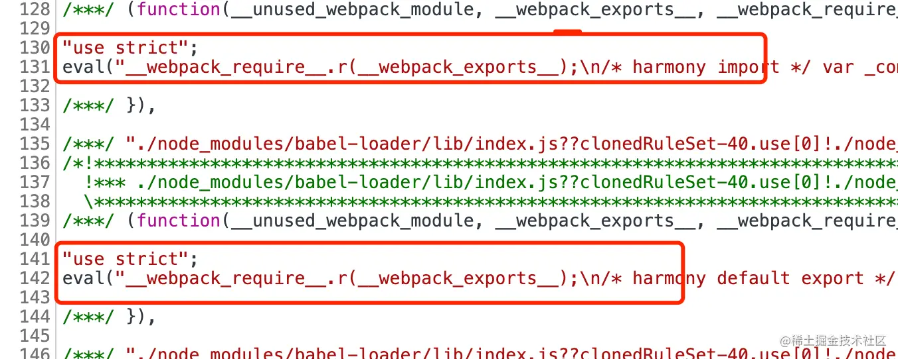

这些被 eval 包裹的就是一个个的模块代码。

这些是上节讲过的内容，这样有啥问题么？

第一个 sourceURL 的路径是通过 [module] 指定的，而模块名后默认会带 ?hash：

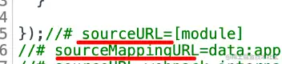

所以想要去掉 hash 就不能用 eval 的方式。

所以我们修改下 webpack 的 devtool 配置：

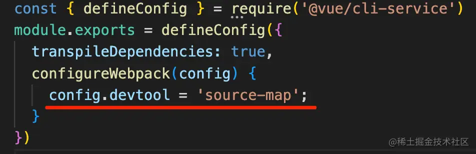

从 eval-cheap-module-source-map 变为 source-map。

去掉 eval 是为了避免生成 ?hash 的路径，去掉 cheap 是为了保留列的映射，去掉 module 是因为这里不需要合并 loader 做的转换。

然后重启跑一下 dev server，再次调试：

这时你会发现之前不生效的断点现在能生效了：

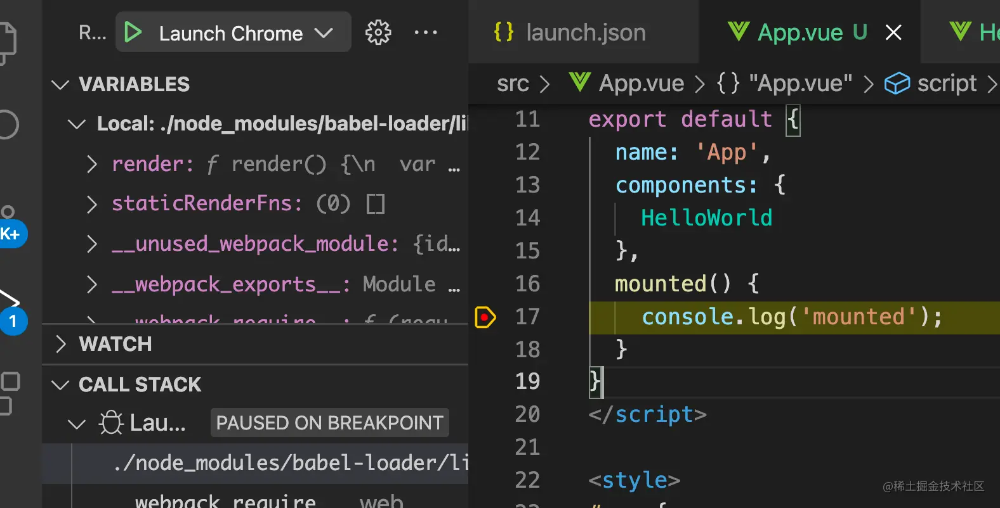

去 Chrome DevTools 里看一下，路径后也没有 ?hash 了：

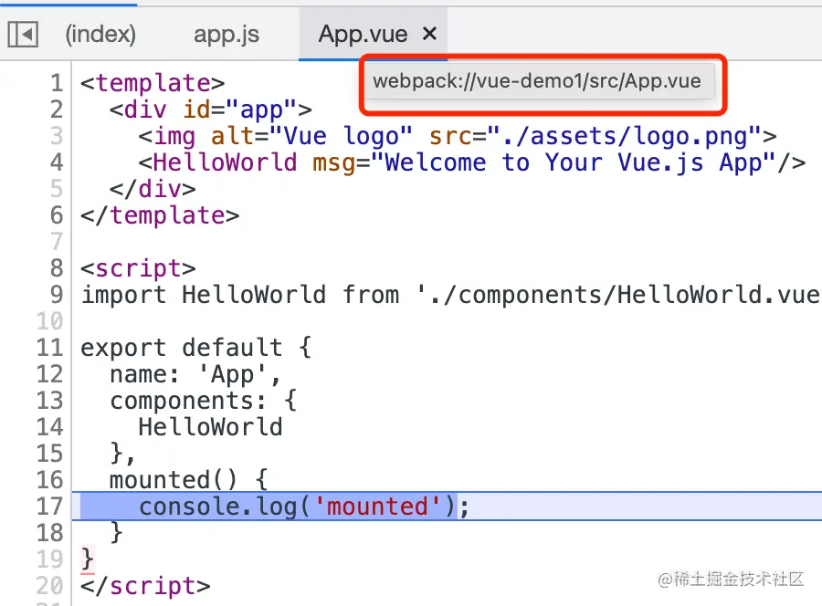

这样就能愉快的调试 vue3 的代码了。

如果你创建的是 vue2 项目，可能还要在 launch.json 的调试配置加这样一段映射（只保留这一条）：

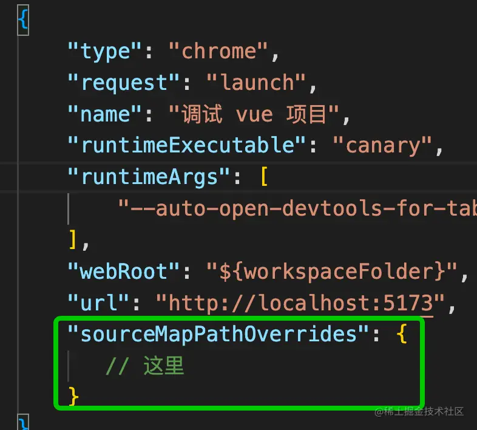

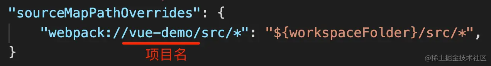

```json
"sourceMapPathOverrides": {
    "webpack://你的项目名/src/*": "${workspaceFolder}/src/*"
}
```


这个项目名就是 project 的名字，你也可以在代码里打个断点，在 Chrome DevTools 里看：

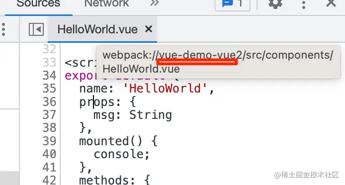

我们映射的目的就是把这个路径映射到本地目录。

如果你在 chrome devtools 里看到的路径没有项目名：

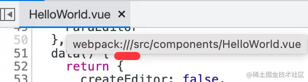

那就直接这样映射：

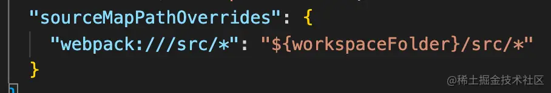

绝大多数情况下，这样样配就行了。

但有的项目可能 VSCode 还是没映射对，这时候你可以自己映射一下，打个断点看看在 Chrome DevTools 里是什么路径，然后看看本地是什么路径，配置对应的映射就好了。

知道了 vue cli 创建的 webpack 项目怎么调试，我们再来看下 create vue 创建的 vite 项目：

## 调试 create vue 创建的 vite 项目

[create vue](https://github.com/vuejs/create-vue) 是创建 vite 作为构建工具的 vue 项目的工具。

直接执行 npm init vue@3  即可：

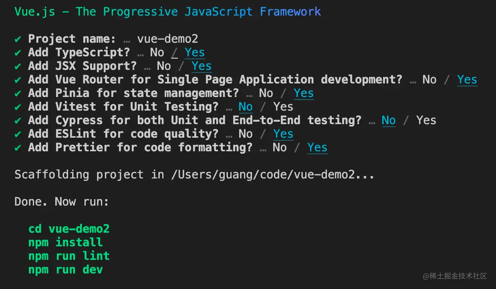

进入 vue-demo2 目录，执行安装，启动开发服务器：

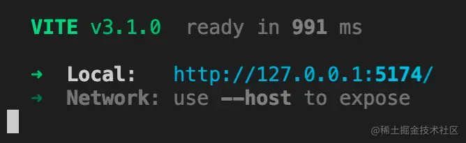

浏览器访问，可以看到渲染出的页面：

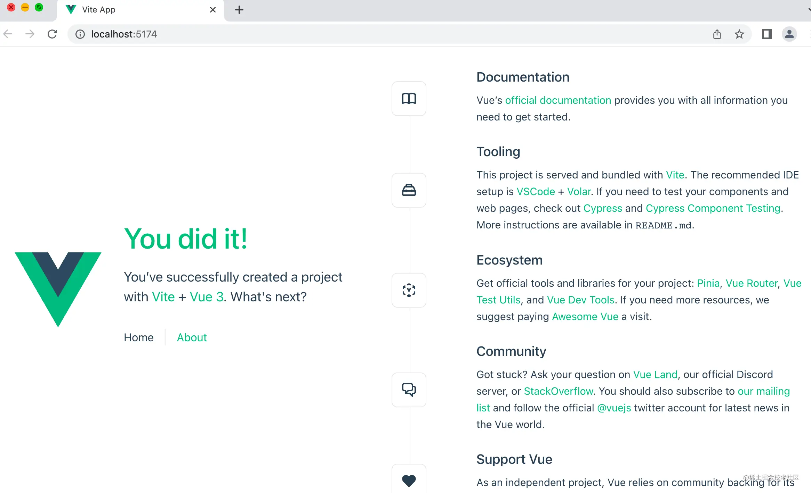

我们添加一个调试配置如下：

```json
{
    "type": "chrome",
    "request": "launch",
    "name": "调试 vite 项目",
    "runtimeExecutable": "canary",
    "runtimeArgs": [
        "--auto-open-devtools-for-tabs"
    ],
    "userDataDir": false,
    "url": "http://localhost:5174",
    "webRoot": "${workspaceFolder}/aaa"
}
```

这里设置 userDataDir 为 false，是使用默认用户数据目录，不然 Vue DevTools 之类的插件就要再次安装了。

打个断点，然后 Debug 启动：

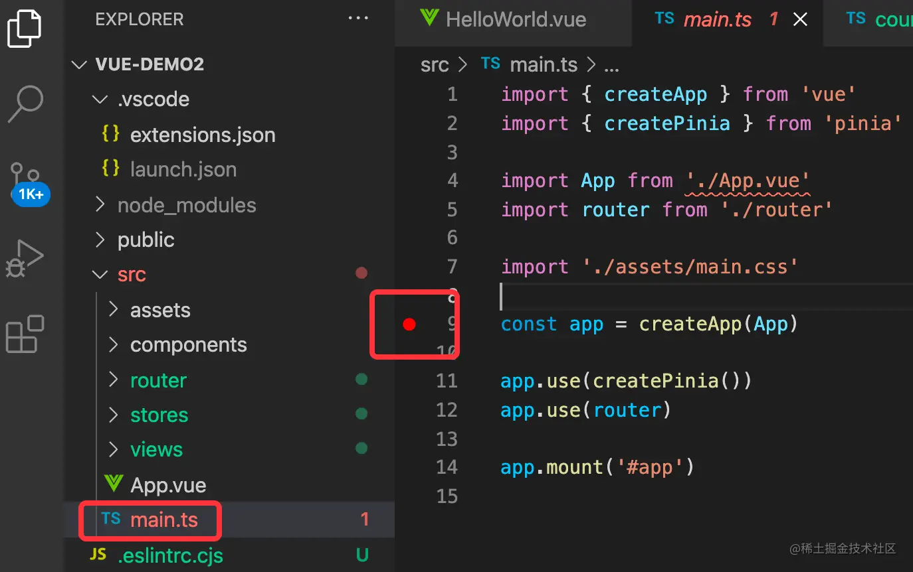

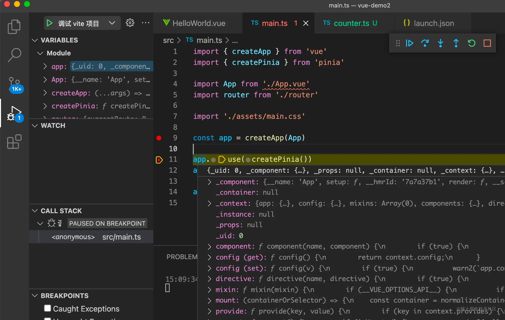

我们找个 vue 文件打个断点：

修改下 HelloWorld.vue 的代码，然后打两个断点：

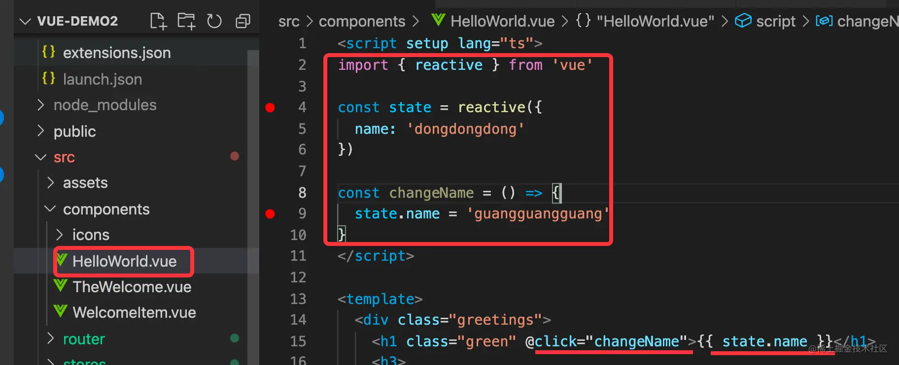

重新启动调试：

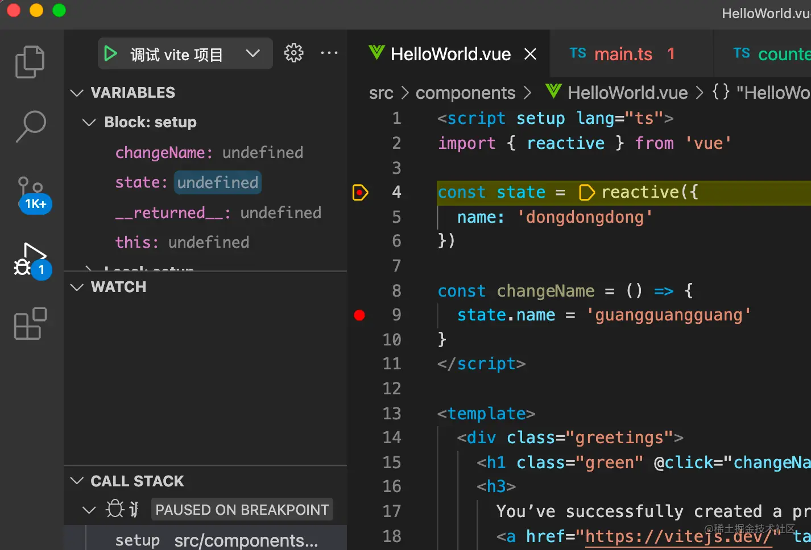


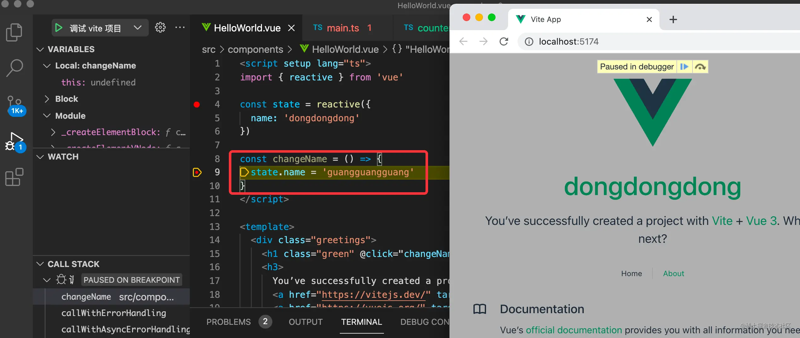

两个断点都能生效，代码也能直接修改。

还有，调试 @vue/cli 创建的项目时，我们还映射了下 sourcemap 的 path，为啥 create vue 的项目就不需要了呢？

看下 sourcemap 到的文件路径就知道了：

运行的代码文件的路径是：

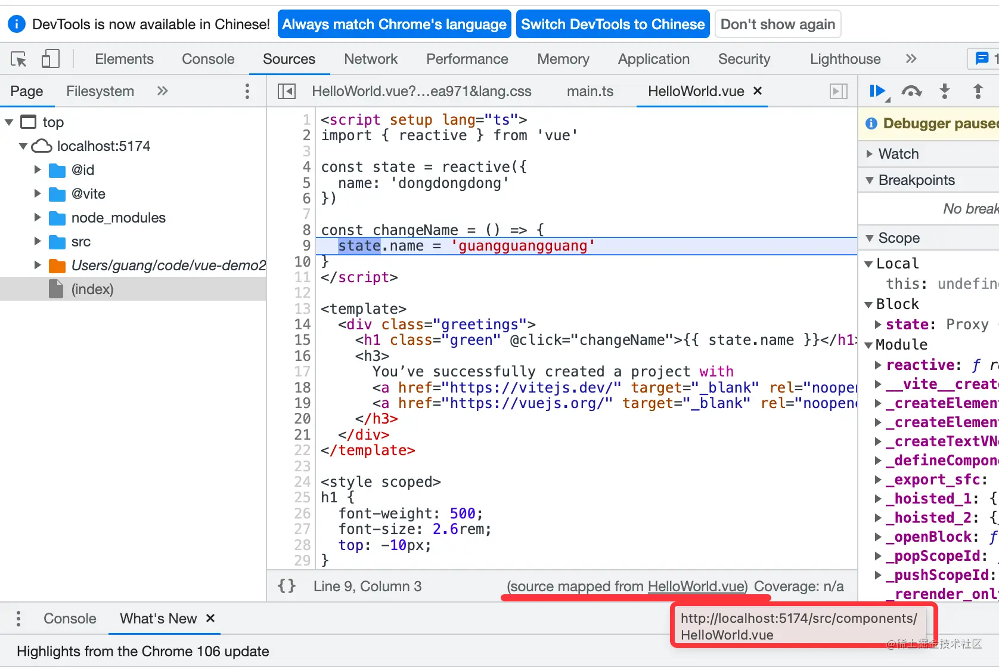

sourcemap 到的文件路径是：

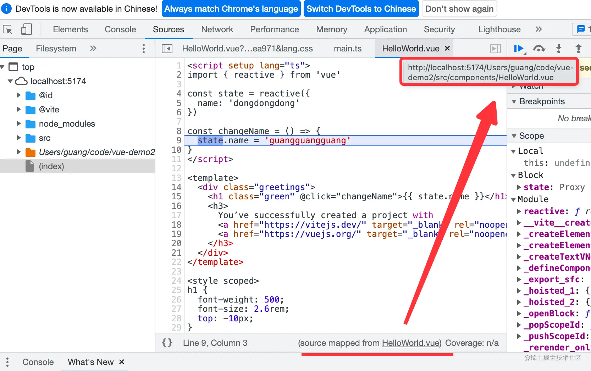

从 http://localhost:5174 后开始，把 /src/components/HelloWorld.vue 文件 sourcemap 到了 /Users/guang/code/vue-demo2/src/components/HelloWorld.vue

这已经能够对应到本地的文件了，自然也就不需要 sourceMapPathOverrides 的配置。

至此，create vue 创建的 vue 项目我们也知道怎么调试了。

有同学可能会问，为什么 webRoot 要配置成 ${workspaceFolder}/aaa 呢？

这个问题解释起来比较复杂，可以看下一节。

## 总结

这节我们调试了下 vue 项目。

vue 项目有两种创建方式，@vue/cli 和 create vue，分别是创建 webpack 和 vite 作为构建工具的项目。

vue cli 创建的项目，默认情况下打断点不生效，这是因为文件路径后带了 ?hash，这是默认的 eval-cheap-module-source-map 的 devtool 配置导致的，去掉 eval，改为 source-map 即可。

create vue 创建的 vite 做为构建工具的项目 sourcemap 到的路径直接就是本地的路径了，更简单一些。但是会有一些文件被错误映射到源码的问题，需要设置下 webRoot。

学会了 vue 项目的调试，接下来就可以愉快的边调试边写代码了。


