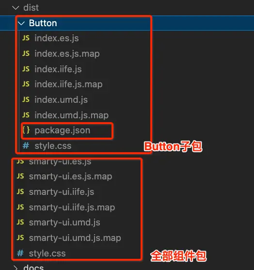

组件库会包含几十甚至上百个组件，但是应用的时候往往只使用其中的一部分。这个时候如果全部引入到项目中，就会使输出产物体积变大。按需加载的支持是组件库中必须考虑的问题。

目前组件的按需引入会分成两个方法：

-   经典方法：组件单独分包 + 按需导入 + babel-plugin-component ( 自动化按需引入)；
-   次时代方法：ESModule + Treeshaking + 自动按需 import（unplugin-vue-components 自动化配置）。

### 分包与树摇（Treeshaking）

传统的解决方案就是将组件库分包导出，比如将组件库分为 List、Button、Card，用到哪个加载哪个，简单粗暴。这样写有两个弊端：

-   需要了解软件包内部构造 例： import "ui/xxx" or import "ui/package/xxx"；
-   需要不断手工调整组件加载预注册。

```
// 全部导入
const SmartyUI = require("smarty-ui-vite")

// 单独导入
const Button = require("smarty-ui-vite/button")
```

好在后面有 babel-plugin-component，解决了需要了解软件包构造的问题。当然你需要按照约定规则导出软件包。

```
// 转换前
const { Button } = require("smarty-ui-vite")
// 转换后
const Button = require("smarty-ui-vite/button")
```

随着时代的发展，esmodule 已经成为了前端开发的主流。esmodule 带来好处是静态编译，也就是说，在编译阶段就可以判断需要导入哪些包。

```
// 动态引入的不可确定性
const m = (Math.random() > 0.5) ? require("a") : require("b")
```

这样就给 Treeshaking 提供了可能。Treeshaking 是一种通过语法分析去除无用代码的方法。目前，Treeshaking 逐渐成为了构建工具的标配，Rollup、Vite、新版本的 Webpack 都支持了这个功能。

比如：组件库只使用了 Button。

```
import { Button } from 'smarty-ui-vite'
```

使用 ES 模块并且只引用了 Button，编译器会自动将其他组件的代码去掉。

### 自动导入黑科技

unplugin-vue-components 的 auto importing 支持。

## 用户故事(UserStory)

为组件库添加按组件分包导出功能，适配按需加载需要。

## 任务分解(Task)

-   实现分包导出脚本；
-   测试按需加载。

### 实现分包导出

分包导出相当于将组件库形成无数各子软件包，软件包必须满足一下要求：

-   文件名即组件名；
-   独立的 package.json 定义，包含 esm 和 umd 的入口定义；
-   每个组件必须以 Vue 插件形式进行加载；
-   每个软件包还需要有单独的 css 导出。



1.  **重构代码结构**

首先需要在原有代码上进行重构：

- 首先将组件目录由 【button】 改为 【Button】
> 特别提醒：git 提交的时候注意，默认 git 修改的时候是忽略大小写的。需要修改一下 git 配置才可以提交。


```base
# 13.按需引入_ 实现组件库的按需引入功能
git config core.ignorecase false
```

-   Button 组件入口 index.ts 默认作为插件导出。

重构前：

```
import Button from "./Button";
import { App } from "vue";

// 导出 Button 组件
export default Button
```

重构后：

```
import Button from "./Button";
import { App } from "vue";

// 导出Button组件
export { Button };

// 导出Vue插件
export default {
  install(app: App) {
    app.component(Button.name, Button);
  },
};
```

另外要注意的是，原 uno.css 是在 entry.ts 中引入的，在子组件包中将不会以 entry.ts 为入口。如果希望 uno.css 能够正常 build，需要在子组件包入口 index.ts 引入 uno.css。

2.  **编写分包导出脚本**

默认导出方式是通过配置 vite.config.ts 的 build 属性完成。但是在分包导出的时候需要每个组件都分别配置自己的配置文件，而且需要由程序自动读取组件文件夹，根据文件夹的名字遍历打包，还需要为每个子组件包配上一个 package.json 文件。

新建一个 scripts/build.ts 文件。

首先需要学会的是如何使用代码让 vite 打包。

导入 vite.config.ts中的配置，然后调用 vite 的 build api 打包。

```
// 读取 vite 配置
import { config } from "../vite.config";
import { build, InlineConfig, defineConfig, UserConfig } from "vite";

// 全量打包
build(defineConfig(config as UserConfig) as InlineConfig);
```

读取组件文件夹遍历组件库文件夹。

```
const srcDir = path.resolve(__dirname, "../src/");
  fs.readdirSync(srcDir)
    .filter((name) => {
      // 过滤文件只保留包含index.ts
      const componentDir = path.resolve(srcDir, name);
      const isDir = fs.lstatSync(componentDir).isDirectory();
      return isDir && fs.readdirSync(componentDir).includes("index.ts");
    })
    .forEach(async (name) => {
      // 文件夹遍历
     });
```

为每个模块定制不同的编译规则。编译规则如下：

-   导出文件夹为 dist/ <组件名>/ 例： dist/Button；
-   导出模块名为： index.es.js、index.umd.js；
-   导出模块名为： <组件名> iffe 中绑定到全局的名字。

```
  const outDir = path.resolve(config.build.outDir, name);
  const custom = {
    lib: {
      entry: path.resolve(srcDir, name),
      name, // 导出模块名
      fileName: `index`,
      formats: [`esm`, `umd`],
    },
    outDir,
  };

  Object.assign(config.build, custom);
  await build(defineConfig(config as UserConfig) as InlineConfig);
```

最后还需要为每个子组件包定制一个自己的 package.json。因为根据 npm 软件包规则，当你 import 子组件包的时候，会根据子包中的 package.json 文件找到对应的模块。

```
// 读取
import Button from "smarty-ui-vite/Button"
```

子包的 package.json。

```
{
      "name": "smarty-ui-vite/Button",
      "main": "index.umd.js",
      "module": "index.umd.js"
}
```

生成 package.json 使用模版字符串实现。

```
      fs.outputFile(
        path.resolve(outDir, `package.json`),
        `{
          "name": "smarty-ui-vite/${name}",
          "main": "index.umd.js",
          "module": "index.umd.js",
        }`,
        `utf-8`
      );
```

最后把上面的代码组合一下就可以了。

```
import fs from "fs-extra";
import path from "path";
import { config } from "../vite.config";
import { build, InlineConfig, defineConfig, UserConfig } from "vite";
const buildAll = async () => {
  // const inline: InlineConfig =
  //   viteConfig;

  // 全量打包
  await build(defineConfig(config as UserConfig) as InlineConfig);
  // await build(defineConfig({}))

  const srcDir = path.resolve(__dirname, "../src/");
  fs.readdirSync(srcDir)
    .filter((name) => {
      // 只要目录不要文件，且里面包含index.ts
      const componentDir = path.resolve(srcDir, name);
      const isDir = fs.lstatSync(componentDir).isDirectory();
      return isDir && fs.readdirSync(componentDir).includes("index.ts");
    })
    .forEach(async (name) => {
      const outDir = path.resolve(config.build.outDir, name);
      const custom = {
        lib: {
          entry: path.resolve(srcDir, name),
          name, // 导出模块名
          fileName: `index`,
          formats: [`es`, `umd`],
        },
        outDir,
      };

      Object.assign(config.build, custom);
      await build(defineConfig(config as UserConfig) as InlineConfig);

      fs.outputFile(
        path.resolve(outDir, `package.json`),
        `{
          "name": "smarty-ui-vite/${name}",
          "main": "index.umd.js",
          "module": "index.umd.js",
        }`,
        `utf-8`
      );
    });
};

buildAll();
```

由于脚本是使用typescript编写的所以需要使用 esno 运行。
```bash
pnpm i esno -D
```
在package.json中添加脚本
```json
  "scripts": {
    "build": "pnpm build:components",
    "build:all": "vite build",
    "build:components": "esno ./scripts/build.ts",
    }
```
运行代码
```bash
pnpm build
```


### 测试按需加载

假设页面中只使用 Button 按钮，那么只调用Button子包中的 js、css 就可以了。

```
<h1>Demo IFFE OnDemand</h1>
<div id="app"></div>
<link rel="stylesheet" href="../../dist/style.css">
<script src="../../node_modules/vue/dist/vue.global.js"></script>
<script src="../../dist/button/index.iife.js"></script>
<script>
    const { createApp } = Vue
    console.log('vue', Vue)
    console.log('SmartyUI', Button)
    createApp({
        template: `
        <div style="margin-bottom:20px;">
            <SButton color="blue">主要按钮</SButton>
            <SButton color="green">绿色按钮</SButton>
            <SButton color="gray">灰色按钮</SButton>
            <SButton color="yellow">黄色按钮</SButton>
            <SButton color="red">红色按钮</SButton>
        </div>
        <div style="margin-bottom:20px;"
        >
            <SButton color="blue" plain>朴素按钮</SButton>
            <SButton color="green" plain>绿色按钮</SButton>
            <SButton color="gray" plain>灰色按钮</SButton>
            <SButton color="yellow" plain>黄色按钮</SButton>
            <SButton color="red" plain>红色按钮</SButton>
        </div>
        <div style="margin-bottom:20px;">
            <SButton size="small" plain>小按钮</SButton>
            <SButton size="medium" plain>中按钮</SButton>
            <SButton size="large" plain>大按钮</SButton>
        </div>
        <div style="margin-bottom:20px;">
            <SButton color="blue" round plain icon="search">搜索按钮</SButton>
            <SButton color="green" round plain icon="edit">编辑按钮</SButton>
            <SButton color="gray" round plain icon="check">成功按钮</SButton>
            <SButton color="yellow" round plain icon="message">提示按钮</SButton>
            <SButton color="red" round plain icon="delete">删除按钮</SButton>
        </div>
        <div style="margin-bottom:20px;">
            <SButton color="blue" round plain icon="search"></SButton>
            <SButton color="green" round plain icon="edit"></SButton>
            <SButton color="gray" round plain icon="check"></SButton>
            <SButton color="yellow" round plain icon="message"></SButton>
            <SButton color="red" round plain icon="delete"></SButton>
        </div>
    `
    })
        .use(Button.default)
        .mount('#app')

</script>
```

## 复盘

这节课的主要内容是为组件库添加分包导出功能，使组件库提供按需加载。组件库具备良好的按需加载能力，可以使提高页面性能。虽然目前 ESM Treeshaking 已经非常流行，但是还是有很多场合需要分包按需引入的支持。

另外，分包引入需要每个子组件包都分别使用不同的配置调用 vite 导出。这需要编写相对较为复杂的脚本完成。工程化中很重要的一部分就是要根据实际需求编写自动化的脚本。

这节课已进行了一个简单的实践，在编写的时候特别要注意配置的复用性。比如：子包与主包是在一个一个配置文件下做的不同的配置，这个然叔都是动了一番脑筋才实现的。

最后留一些思考题帮助大家复习，也欢迎在留言区讨论。

-   组件如何才能实现按需引入？
-   如何实现组件分包导出？
-   如何批量生成 package.json 文件？

下节课，我们将给大家讲解如何将开发文档发布上线，下节课见。