# 15.README： 编写标准的 README

这节课，我们来介绍如何编写 README 文档。README 文档对于开源项目的重要性甚至会超过代码本身。你试想一下，你打开一个 Github 项目，第一时间就会看到 README 文档，而这时候同一类的项目你可能有很多选择，如果这个README不正规，无法快速上手，你可能直接就弃用这个项目。

在编写自己的组件库案例之前，先带大家欣赏一下大神的作品。

优秀的案例：https://github.com/slidevjs/slidev

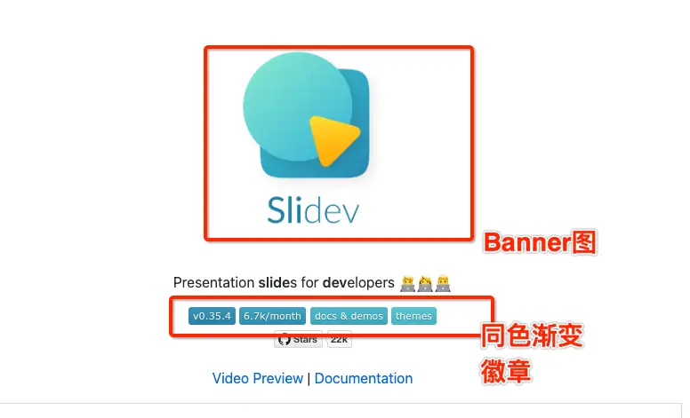

先看开头部分：

- Banner + Title 居中；
- 徽章的颜色重新定制和 Logo 呼应，并且细心地使用了渐变效果。

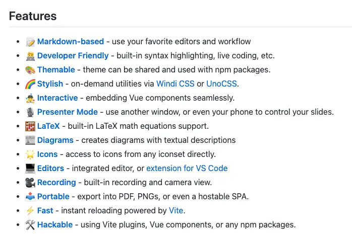

- 特性描述精炼准确；
- 字体图标开头提升了页面视觉效果；
- 引用链接完整清晰。

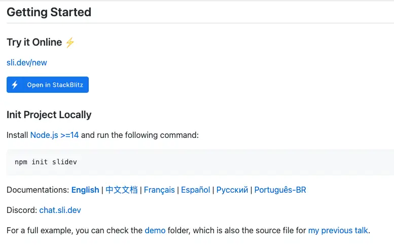

- 快速开始提供了在线编辑器可以一键试用；
- 文档提供多语言链接。

## 用户故事(UserStory)

为组件库编写标准 README 文档，使开发者更容易上手使用。

## 任务分解(Task)

- Title 标题；
- Banner 头图；
- 徽章 Badges；
- 特性 Features；
- 开源许可证 License 。

对于如何编写标准 README ，有一个[经典的 Github 项目](https://github.com/RichardLitt/standard-readme)。

这个项目系统地讲述了 README 的编写方法。文中提到标准的 README，最基本的部分包括以下几大内容：

- Background 背景；
- Install 安装 ；
- Usage 用途；
- Badge徽章 - 项目的标准，例： npm 下载量、测试覆盖率、通过 CI 工具持续验证 ；
- Contributing 贡献者名单；
- License  代码许可证。

这个应该是一个最低配的 README。

通过这个结构可以让使用者最短时间了解并上手。

如果扩展一下，让项目介绍更加的丰满，还可以采用以下结构：

- Title；
- Banner；
- Badges；
- Short Description；
- Long Description ；
- Table of Contents；
- Security；
- Background；
- Install；
- Usage；
- Extra Sections；
- API；
- Maintainers；
- Thanks；
- Contributing；
- License 。

以上，都是给你提供的一个思维框架，在实际运用中可以根据实际情况灵活掌握。

下面开始 Smarty-UI 的具体编写。

### 标题 Title

首先是标题。

内容就是项目的名字，没什么好说的，关键部分是副标题和表现形式。

副标题可以很好地解释主题。表现形式上可以考虑一下居中效果。由于 Markdown 中可以使用 html， 所以可以直接使用 html 实现。

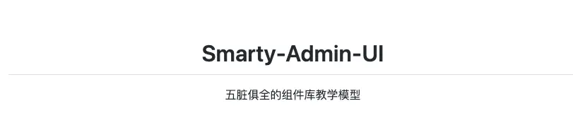

```HTML
<p align="center">

</p>

<h1 align="center">Smarty-Admin-UI</h1>

<p align="center">
五脏俱全的组件库教学模型
</p>
```

### Banner 头图

一个醒目的横幅可以有效提高 README 的颜值。所以可以选一个合适的图片作为横幅。

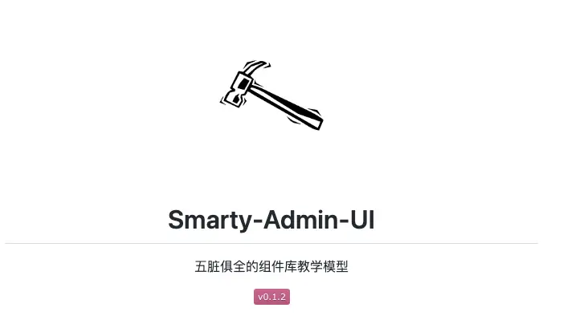

### Badges 徽章

徽章是一个开源库的品质保证。比如 npm下载量、测试覆盖率、CI运行状况。这些不是普通的字符，每一个徽章都是相应的系统动态生成的，比如 npm 下载量就是由 npm 生成并颁发的。虽然这个可以通过技术手段模拟，但是大家还是要注意自己的素质。

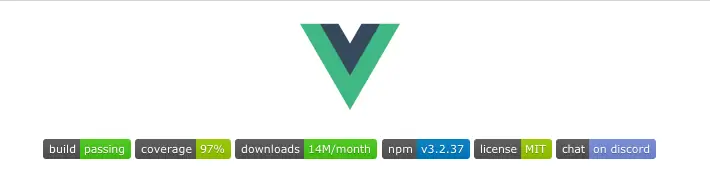

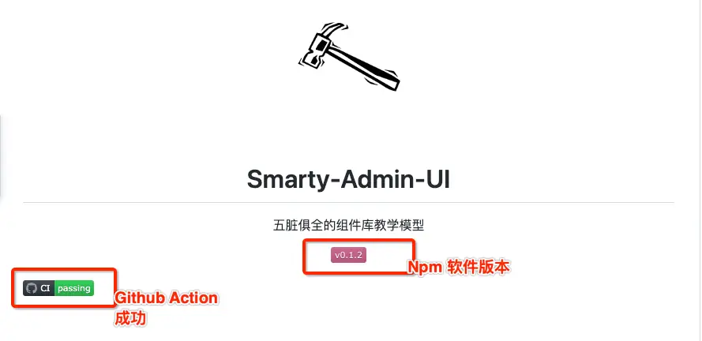

徽章在 https://shields.io/ 中生成。比如： MIT 证书徽章，访问 https://shields.io/category/license。

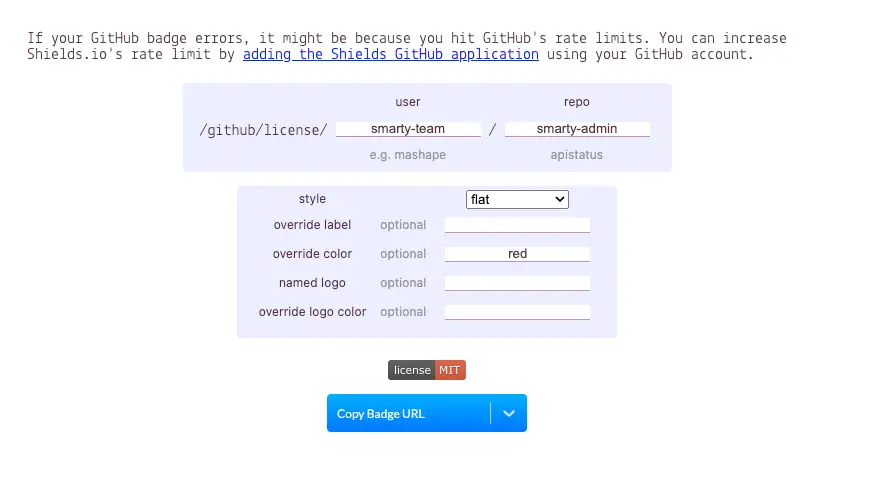

```HTML

```

颜色字体等内容可以根据页面需要稍微定制一下，让呈现效果更加美观。比如我把 MIT 定义为红色会和前端有点对比。

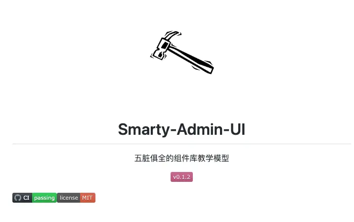

### Features 特性

这部分可以认为是一个 Description ，也就是具体说明这个库的功能。这部分主要是为了描述项目的重点功能。本项目属于工程化学习，所以我的重点是介绍技术栈，这样大家比较容易了解到通过本项目可以学习到什么。

```Markdown
## Features

前端工程化演示项目。
- 基于Vue框架
- 支持JSX与Vue单文件组件
- Jest + Vue3 plugins实现单元测试
- Eslint + Prettier + Husky 语法检查
- 采用Rollup构建
- Vitepress + Vercel 文档网站搭建
- 基于Action CI 实现持续集成与交付
```

### Install & Quick Start 安装 & 快速指南

为了让用户快速上手，这部分一般都会在第一屏出现。普遍有两种方法。

第一种是直接写到 README 里面。比如：

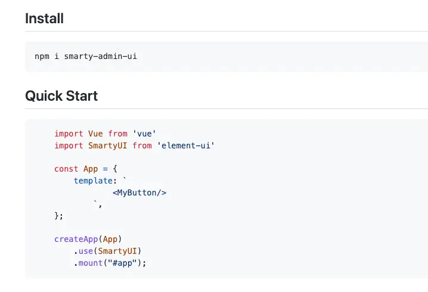

Install 安装指南要尽量简洁，目的是为了让用户尽快上手。尽量选择通过 Npm 包和 CDN 直接安装。这样使用者可以尽快感受到项目的效果，有利于推广。

Quick Start 快速开始也是同样的要求，尽量用最精华的代码让用户感受到项目的强大。

像本项目这种具备文档网站的项目，更好的方法是将用户引导到网站中去。因为网站有更好的阅读体验，可以呈现更为系统的内容。

第二种是当有文档网站的时候，显示文档网站链接就可以了。

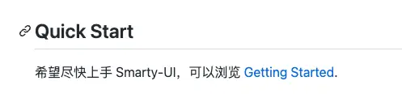

### License  代码许可证

这部分会引用开源证书链接并且填写上 Copyright 信息。

## 复盘

这节课的主要内容是编写一个标准的 README 文档。

最后留一些思考题帮助大家复习，也欢迎在留言区讨论。

- 如何使用 Vercel 部署前端项目？
- Github Page 与 Vercel 的区别 ？

下节课，我们将给大家讲解如何编写标准的README文档，下节课见。