# 17.社区参与： 如何管理社区的 PullRequest？

一个好的项目很少会由一个人来独立完成。即使你完成了所有功能实现，也需要有人给你 Review 和提建议、找 Bug。比如，然叔的组件库就非常希望大家一起来参与，比如添加新的组件、完善文档、添加单元测试、提出改进意见。

这节课我们就介绍一下如何参与开源社区的代码贡献。对于任何一个开源项目，我们都是以陌生人的身份参与的。也就是说，你并不是项目组成员，不具备直接提交代码的权限。如果你想参与其中，最好的方式就是提交 PullRequest，等你有一定贡献的话再请求成为项目成员。

## 什么是 PullRequest？

PullRequst 直译过来就是拉取请求，那么拉取请求和提交代码有什么关系呢。

这里面有一个比喻，我们可以把代码比作一个团队，对于一个陌生人来讲，你很难获取信任，让你直接插手团队的管理。这个时候上帝给了你一次证明的机会，就是复制一个一模一样的团队给你。

你经过一段时间的优化管理后，可以把你的复制团队和原有团队的对比记录发送给原团队的管理者证明你优化的效果，请求将你的改进合并到原团队之中，这种行为就是代码世界的 PullRequest。显然这个世界上并没有上帝，但是代码本身是有可复制性的，可以很轻松地复制一份，这个叫做 fork。你改进后提交的合并请求就叫做 PullRequest，是你的复制分支和原分支的对比记录 + 你对改进的描述。


假设你要给然叔的组件库提交代码，在 GitHub 中的 PullRequest 步骤如下：

1. 从然叔组件库 fork 代码仓库到你的仓库；

1. 从自己仓库 clone 到本地；

1. 修改代码或添加新代码，或提交 commit 你的更改；

1. Push 到你的的代码仓库；

1. 给然叔的组件库提交一个 PullRequest (拉取请求)，说明你的修改内容，请求然叔提交。然叔认为属于有价值提交的话，就会点击接受。则 Github 会将这次修改拉取到然叔的项目，这样的话就相当于给然叔组件库提交了一次代码贡献。

简单地说，整个代码贡献过程可以认为是复制 -> 修改 -> 提交拉取请求 -> 接受请求。

一般我们用这里面的关键一步 PullRequest 当做整个代码贡献行为的简称。现在大家就比较清楚为什么说参与开源项目叫提 PR。

## 用户故事(UserStory)

使用 Github 的 PullRequest 功能，管理陌生人提交的代码。

## 任务分解(Task)

- 模拟陌生人提交一个 PR；

- 查看 PR 和 Review Code；

- 合并代码。

### 创建一个 PullRequest

首先，我们创建一个 PullRequest。 目前然叔的个人账号是： su37josephxia。 组件库项目放在一个叫做 smarty-team 的组织上面。虽然也是然叔创建的，但是在 Github 上面可以认为是不同的账号，现在就以 su37josephxia 账号向 smarty-team 提交一个 PullRequest。

**Fork 代码**

Fork 实际上就是复制的意思。在 Github 中相当于将 samrty-team 账号中的 smarty-admin 项目复制了一份到 su37josephxia 账号中。

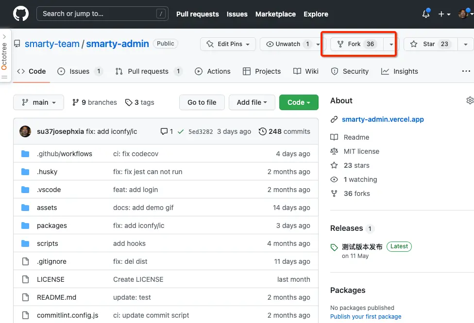


点击 【Create fork】就可以了。

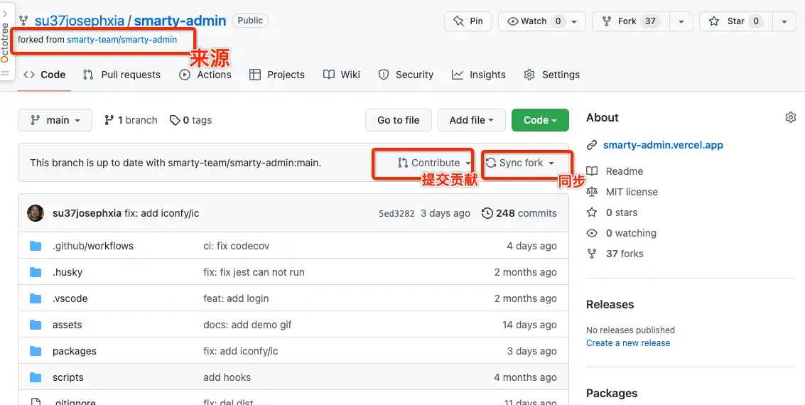

新创建的代码在 su37josephxia 账号下，这个代码和自己常见的几乎没有差别，只是在界面上多了一点内容：

- 来源：  表示项目复制得哪个地址；

- 提交贡献： 这个按钮是 PullRequest 用的；

- 同步： Sync fork，这是一个新功能，用于将源地址的最新提交拉取回本地址。

**Clone 代码到本地**

```Bash
git clone git@github.com:su37josephxia/smarty-admin.git
```


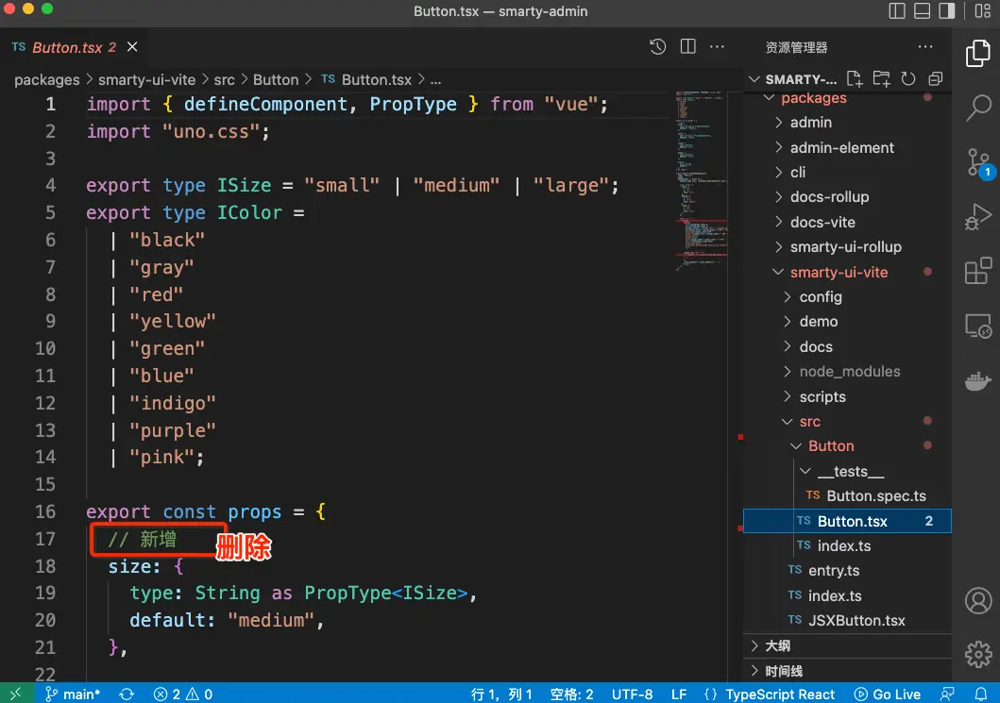

```Bash
git commit -am 'fix: del Button.tsx useless comments'
```

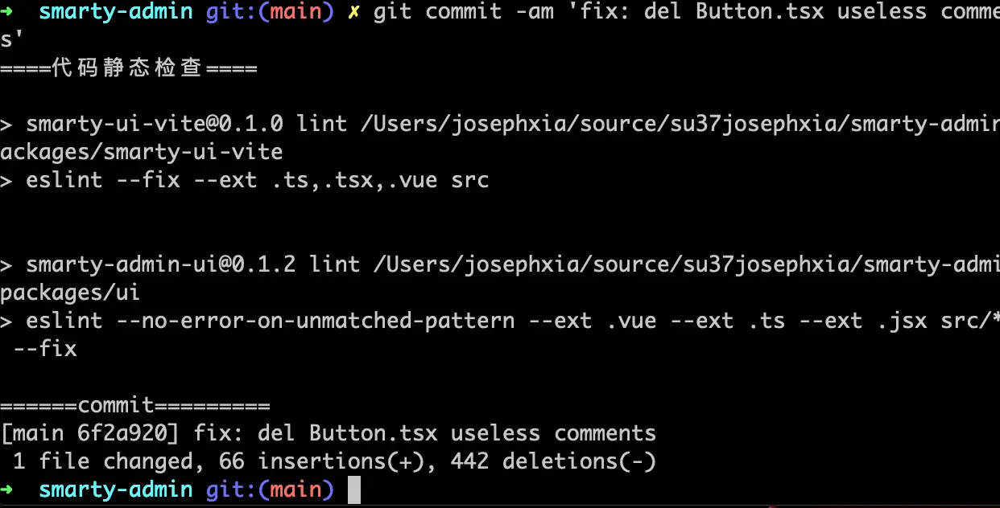

```Bash
git push
```

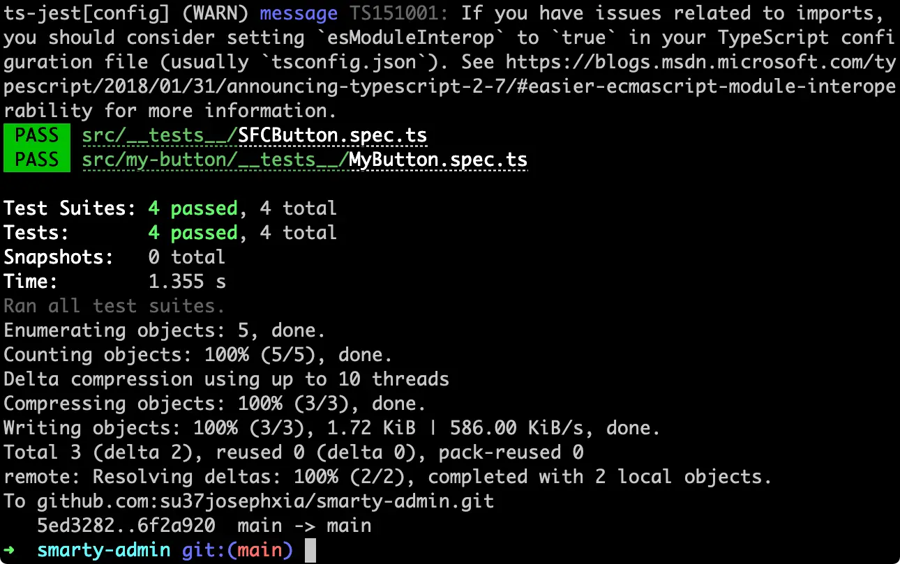

提交代码后，回到 su37josephxia/smarty-admin 的 Github 页面。这个时候就可以看到这个提交。这是一个新的功能，可以更方便你提交 PullRequest。

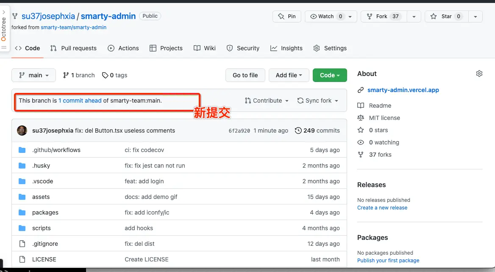

点击 【Contribute】中的 【Open pull request】按钮，就可以创建一个新的 PullRequest 了。

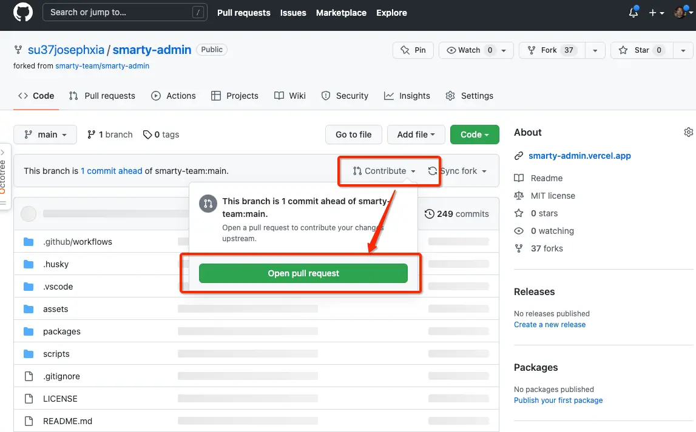

在 pull request 界面中可以看到提交的方向。这里面表明是从 su37josephxia 向 smarty-team 提交代码。当然这里面方向和分支都可以选择，多分支通常用于你同时要处理很多个 PullRequest 的情况，目前只处理一个分支就没有这么麻烦。

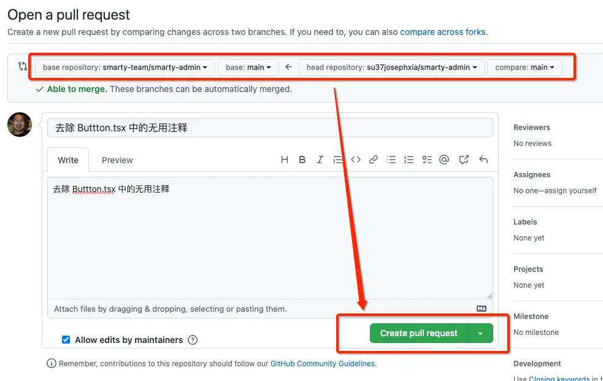

另外，你也可以从后面的比对中清楚地看到你修改的内容。

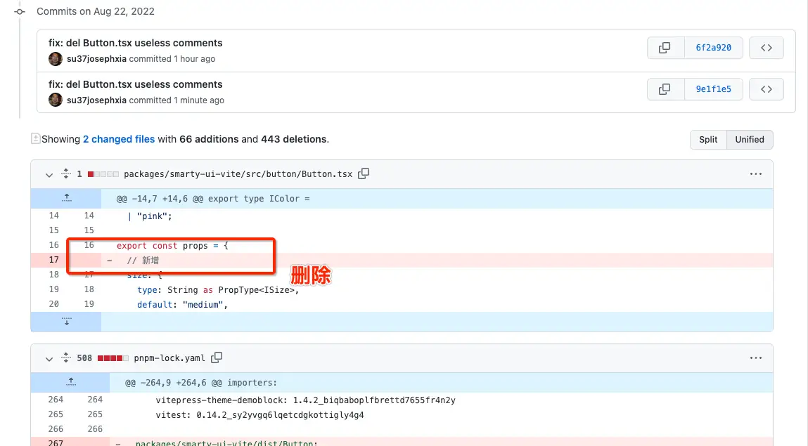

点击 【Create pull request】后，这个pullrequest 就创建成功了。这时然叔就收到了你的 pullrequest。

### 审核代码修改

当有人给然叔的组件库提交了代码贡献，然叔就可以很容易地在 【PullRequest】中看到。

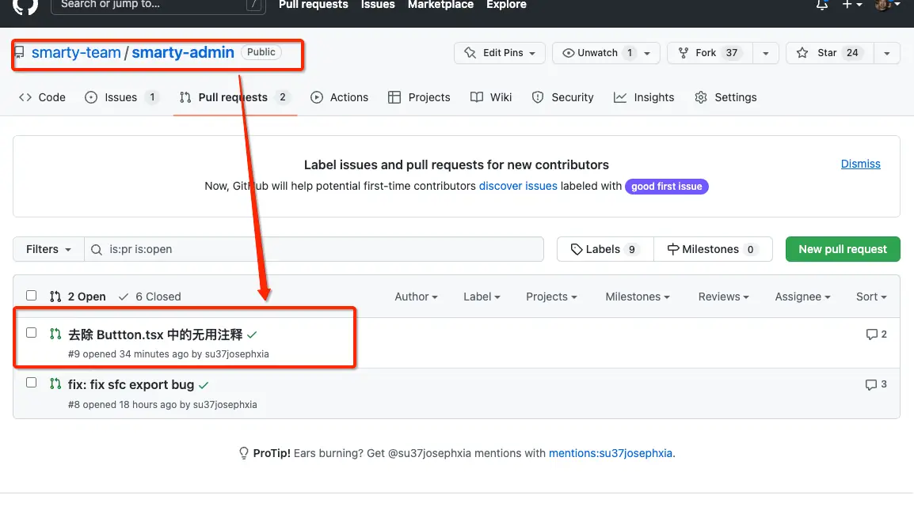

打开后可以查阅代码变更，也可以清楚地看到这个代码 CI 运行的结果。通过这个结果就可以判断代码是否正确，也可以提出一定的改进意见，让你继续进行修改。

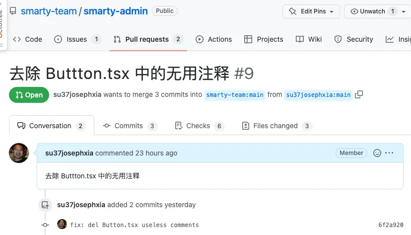

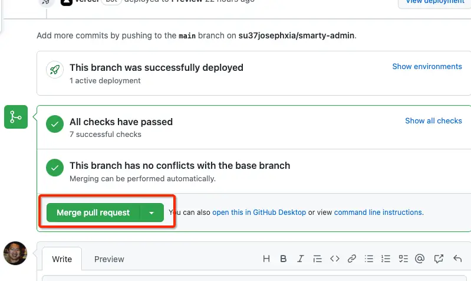

假设认为你的修改是有价值的，就可以批准你的修改。点击 Merge pull request 就可以接受这次代码合并。这时，你的代码也就合并到了 smarty-team/ smarty-admin 仓库中了，这次代码贡献宣告胜利结束。

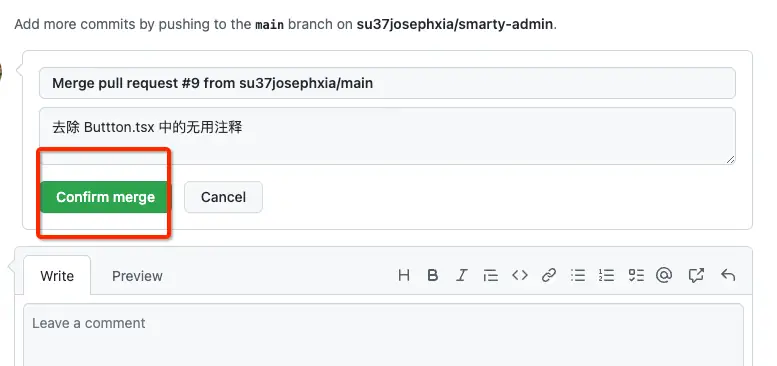

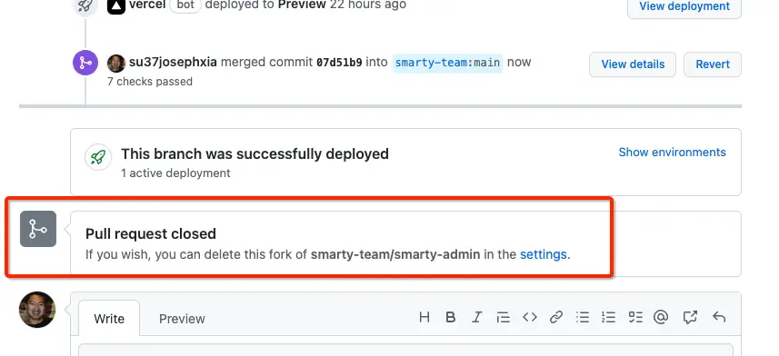

## 复盘

这节课的主要内容是介绍如何参与代码贡献。

在开源世界中，每个人都是互不相识的。开源世界中的合作也是从陌生人到熟人的过程。有趣的 Github 给我们提供了一种陌生人参与代码贡献的可能，可以通过代码来证明自己、实现自己的价值。

然叔的组件库项目是为了大家学习而存在的，希望大家可以参与其中。大家也可以把然叔的项目当做进入开源世界的大门，从给然叔的项目提交第一个代码贡献开始你的开源之路。

当然下一个问题是有哪些可以提交的内容。一开始可以从简单的注释、文档开始。更进一步的内容，就需要通过关注 Issue 和 Projects 看板来关注项目动态了，这个技能下次带来。

最后留一些思考题帮助大家复习，也欢迎在留言区讨论。

- 什么叫 PullRequest？

- 如何合并 PullRequest ？

下节课，我们将给大家讲解如何使用 Issue 和 Project看板，下节课见。 