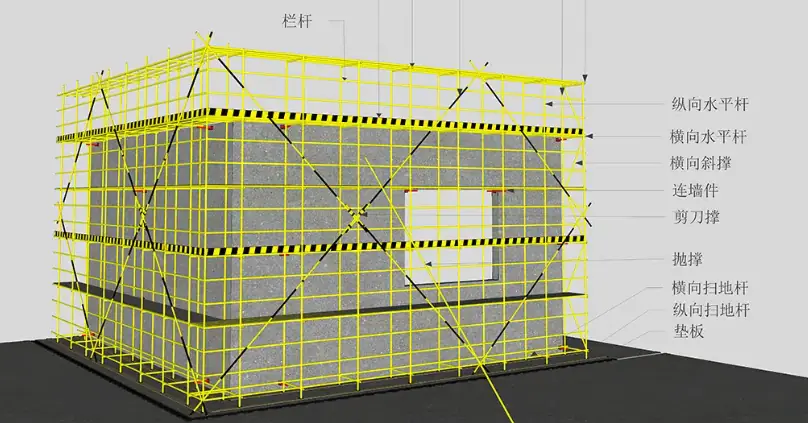
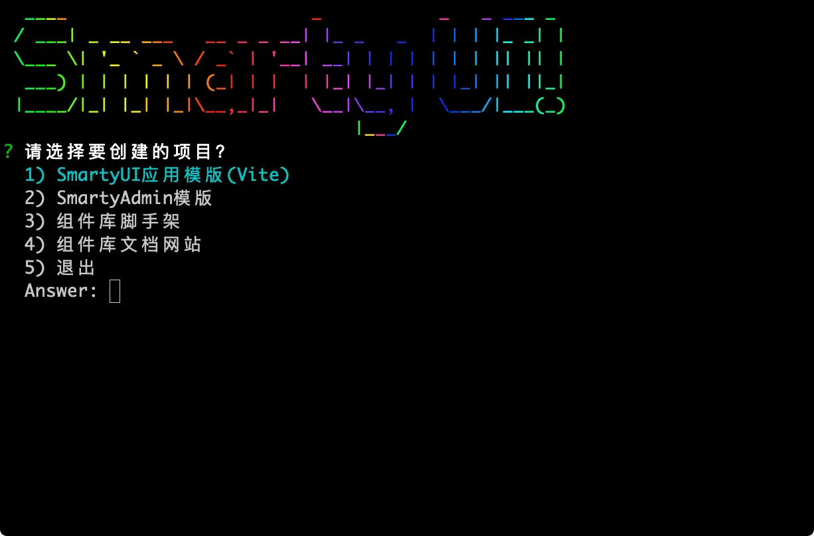
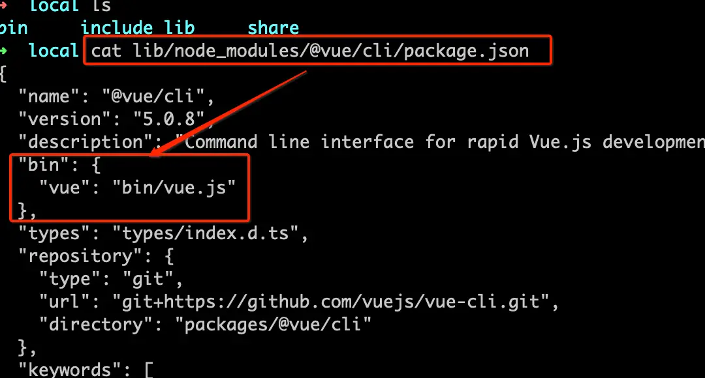
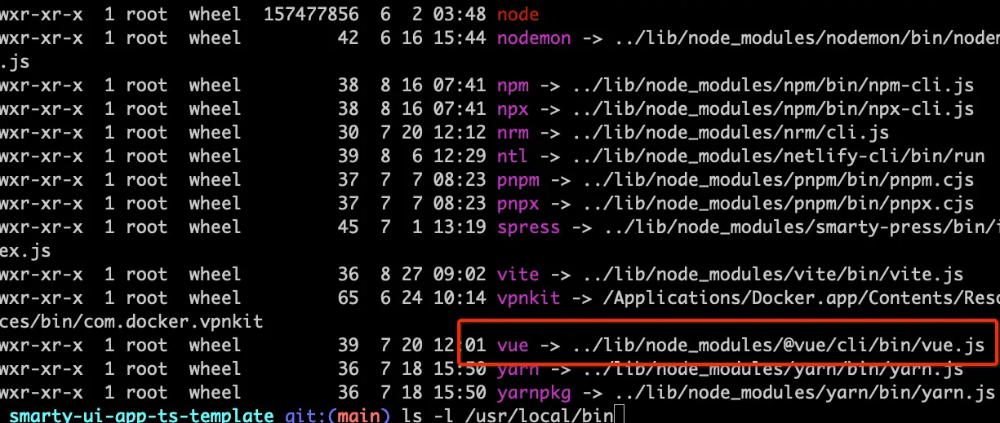
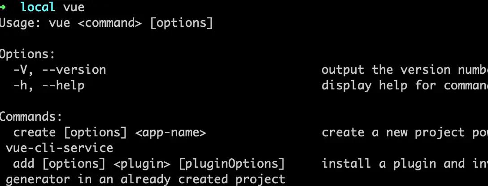
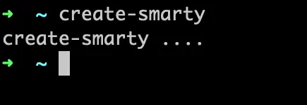
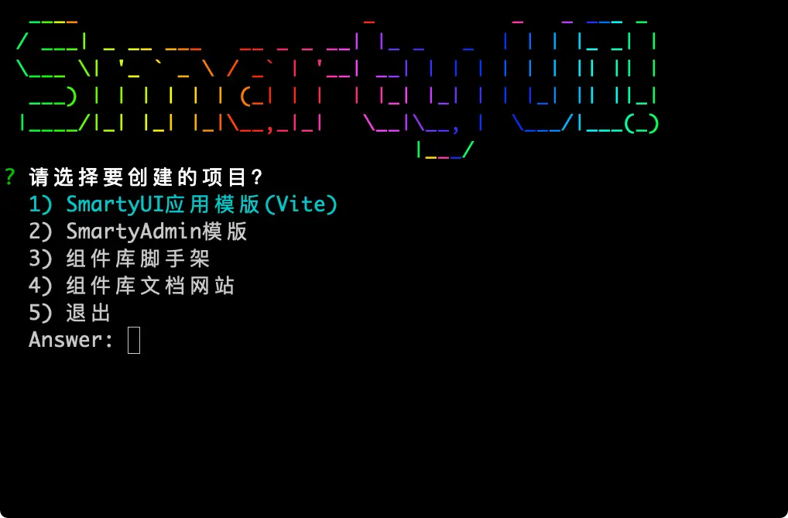
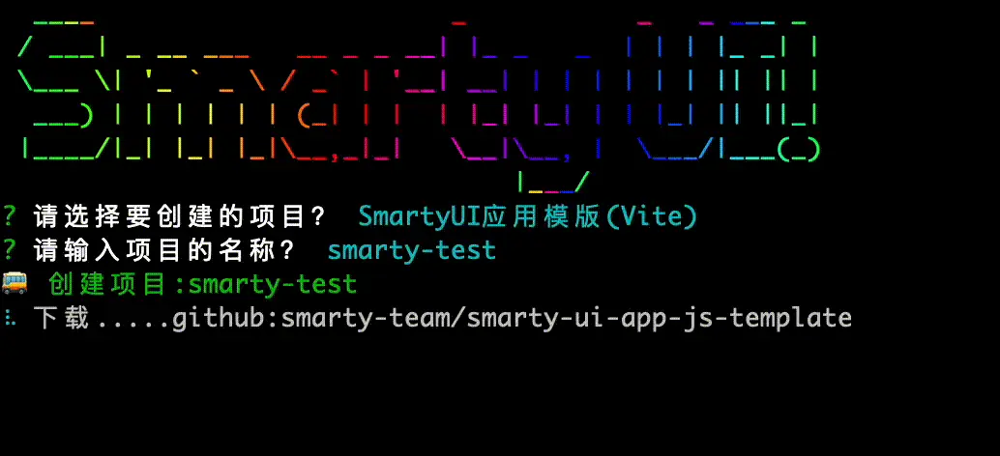
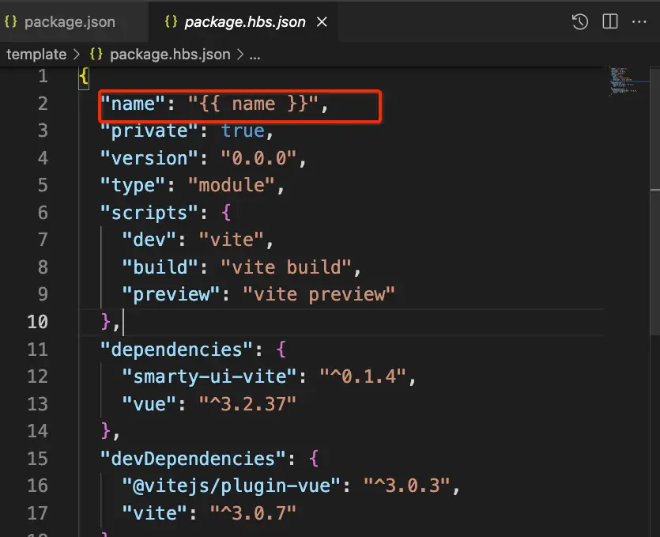

前面的章节一直都是在教大家搭建工程。大家一定觉得非常辛苦，一直在跳坑。即使然叔的描述再精确，由于版本和各种不可预知的原因，都会造成各种各样的问题。一个项目中搭建框架的人就好比项目的开路先锋，他跳坑是为了不让别人继续跳坑。

那么怎样让搭建的工程框架复用起来，让大部队享受开路先锋创造的工程成果呢？ 答案就是脚手架工具。比如 Vue 有 vue-cli，React 有 create-react-app 等。这节课我们就学习如何创建脚手架程序。

对于一个组件库来讲，脚手架一般分为两种：

- Create-smarty-ui-app  :  创建使用 Smarty-UI 组件库的程序的脚手架；

- Create-xxx-ui ： 创建和 Smarty-UI 类似的组件库的脚手架，也就是复用我们上面的架构。

实际上这两种脚手架原理和功能都非常相似。我们就以第一种为例子给大家介绍如何编写脚手架程序。

## 用户故事(UserStory)

编写一个 Create-smarty-ui-app 脚手架程序， 让用户可以轻松搭建使用 Smarty-UI 的应用程序。

## 任务分解(Task)

- 创建模版项目；

- 初始化 CLI 项目；

- 创建命令行界面；

- 克隆项目模版；

- 模版生成代码；

- 上传 Npm 仓库。

### CLI 与 脚手架的概念

用惯了 vue-cli 或者 create-react-app 的前端人可能都会认为，cli 与脚手架是一个概念。其实它们几乎是雷锋和雷峰塔的关系。



先讲讲脚手架，脚手架的概念来自于工程。脚手架就是为了工程顺利进行而搭建的工程平台。用在软件开发中，就是帮助开发过程的工具和环境配置的集合。简单来说，目前组件库的状态就是一个脚手架。虽然只有一个组件，但是为组件库的环境配置和工具已经整合完成了。这就好像一个高楼搭建前搭建的脚手架已经完成一样，另外只有一个样板间。



其次说一下 CLI 工具是什么。 CLI 是英文 command-line interface 的简写，翻译为命令行界面。也就是只在用户提示符下键入可执行命令的界面。通常脚手架程序会通过 CLI 的形式封装，这样做更加符合程序员的习惯，相比开发完整的 UI 开发效率更高。所以目前看到的大多数脚手架都是以 CLI 工具的形式封装的。久而久之，大家也就比较习惯将 CLI 与脚手架混为在一起了。

明白了概念后我们正式开始。

这次我们要开发的脚手架 create-smarty-app ，功能是可以快速创建一个使用 Smarty-UI 开发的项目模版。也就是说，假设你想使用 smarty-ui 开发项目，可以直接使用脚手架创建一个空的项目，里面包含的 vite + vue3 + smarty-ui 组件。直接开发逻辑就好了。

当然这个功能还比较初级，后续还可以不断迭代。但是麻雀虽小五脏俱全，基本上这里面会将脚手架工具所使用的工具都会演示一遍。

一般一个脚手架项目会有两部分组成：

- Template 项目： 项目的模版；

- CLI 工具项目： 提供命令行界面用于克隆项目，生成代码、自动配置、运行调试、发布等功能。

其实有兴趣的同学可以看一下 vue-cli ，它就是这样工作的。甚至你可以分析一下源码，找找 vue-cli 的模版项目放在 Github 的什么位置。

### 创建模版项目

这一步，主要就是创建一个程序的模版。其实就是从零搭建一个Vue3 + Vite 环境并且引入 Smarty-UI。

首先，选择使用 vite-cli 工具直接搭建项目。

- Vite  启动；

- 使用 Javascript 语言；

- 全局引入 Samrty-UI。

这个过程其实就是使用 Vite 脚手架工具搭建一个 vue3 项目，然后引入 smarty-ui 组件。

详细过程不再赘述，可以参考代码。

https://github.com/smarty-team/smarty-ui-app-js-template

这个模版工程搭建也可以根据喜好加入一下个性化的代码。

### 初始化 CLI 项目

有了模版项目，接下来需要创建脚手架。

脚手架主要的运行过程如下。

- 提供命令行界面：
  - 选择代码模版 ；
  - 填写项目名称。

- 克隆模版项目；

- 根据项目名称及其他配置生成代码。

这一步的目的主要是搭建一个基础的 CLI 环境。也就是可以用一个全局命令调用到 CLI 工具的 JS 程序。 CLI 工具是可以在全局执行的程序。也就是说，将 npm 软件包中的一个 JS 文件注册到全局。

下面讲一下基本原理，比如： 全局安装 vue-cli。

```Bash
sudo npm i @vue/cli -g
```

以 Mac 为例。npm 首先会把软件包下载到 /lib/node_modules/@vue/cli 目录下。然后 npm 会根据 @vue/cli 软件包中 package.json 的 bin 字段中的配置，将 bin/vue.js 文件软连接到 /usr/local/bin 中去。



你可以使用 ls -l 查看一下：

```Bash
ls -l /usr/local/bin
```



这个时候你就可以全局执行 vue 这个命令了。



其他操作系统原理类似，大家可以自行探索。这个过程实际上是 npm 包管理工具帮你实现的，大家不用过多关心。

弄清楚了基本原理，下面还有一个问题需要解决。这个问题就是需要提供一种调试CLI工具的方法。显然在调试代码时，将代码不断上传到 npm 仓库然后再全局安装太繁琐了。解决的办法就是使用 npm link 来模拟这个软连接过程。也就是说 npm link 就是在模拟全局安装。

下面开始实际操作。

首先创建项目。在 packages 目录下创建 cli 项目。

```Bash
mkdir create-smarty-app-cli
cd create-smarty-app-cli
pnpm init
```

在 packages/create-smarty-app-cli/bin 中添加一个 index.js 作为文件的入口。

```Bash
#!/usr/bin/env node
console.log('create-smarty ....')
```

这里面第一行 #!/usr/bin/env node ，这个要讲一下它的功能。首先这个 index.js 程序不是常规的使用 node xxx 命令执行。而是需要通过 source xxx 或  ./xxx 来执行。也就是像一个 shell 脚本一样执行。这时候就出现了一个问题，一个 JS 代码是不能够直接以这种形式执行的。那么这个时候就需要上述语句来声明解释器类型。也就是说，执行该代码需要使用 node 当做解释器辅助。

在 package.json 中添加一个 bin 属性，声明注册一个叫 create-smarty 的可执行文件。

```JSON
{
  "name": "create-smarty-app",
  "version": "0.1.0",
  "description": "",
  "main": "index.js",
  "type": "module",
  "bin": {
    "create-smarty": "./bin/index.js"
  },
}
```

并且将 type 设置为 module 。这么做的目的是在 Node 环境中使用 esm 模块规范。这样就可以使用 import 和 export 导入导出模块了。

脚本编写虽然也可以使用 Typescript 。为了方便，这次我们使用 JS 编写。

编写完成后运行 npm link 模拟全局安装的效果。

```Bash
# 19.架构复用： 创建 CLI 工具提高研发体验
sudo npm link
```

这个时候可以在任何一个目录下执行命令。

```Bash
create-smarty
```



日志正确输出，标志着 CLI 工具框架初始化完毕。 

### 创建命令行界面

下一步，就是打造一个命令行界面。命令行界面的意义在于可以让用户定制自己需要的程序。

比如： vue-cli 可以选择需要的 ts/js 语言、是否需要 router 与 vuex 、是否需要 eslint 等。

具体到这个 CLI 的需求，需要实现选择多种模版功能。

Vue-cli 这样的通用脚手架提供多种可选项。但是它付出的代价，就是实现逻辑复杂且容易出错。而在企业内部的脚手架，更多的是需要更为简单高效的功能，并不需要花里胡哨。比如我很少听说一个团队会在 TS、JS 语言中选择。又或者有些项目使用 eslint，而有些不使用。当然学会了基本操作，你想实现更复杂的功能也是可以的。



首先打印一个欢迎界面，这个功能是使用 clear、chalk-animation  与 figlet 合作完成。

- Clear 清除屏幕；

- Figlet 提供炫酷的文字效果；

- Chalk-animation 提供命令行动画与渐变颜色。

```Bash
pnpm i figlet@"1.5.2" clear@"0.1.0" chalk-animation@"2.0.2" 
import figlet from "figlet";
import clear from "clear";
import chalkAnimation from "chalk-animation";

// 打印欢迎画面
clear();
const logo = figlet.textSync("Smarty UI!", {
  // font: "Ghost",
  horizontalLayout: "default",
  verticalLayout: "default",
  width: 80,
  whitespaceBreak: true,
});

const rainbow = chalkAnimation.rainbow(logo);
setTimeout(() => {
  rainbow.stop(); // Animation stops
}, 500);
```

然后是命令行选项，这个使用 inquirer 这个库完成。它会根据配置显示界面并把结果返回为 json。

后面通过返回结果动态 import 导入需要的模块，这样就实现了根据选项运行不同的初始化模块。

```Bash
pnpm i chalk@"5.0.1" inquirer@"9.1.0"
#!/usr/bin/env node

import { promisify } from "util";
import figlet from "figlet";
import clear from "clear";
import chalk from "chalk";
import inquirer from "inquirer";
import chalkAnimation from "chalk-animation";

const log = (content) => console.log(chalk.green(content));
const opt = {
  "SmartyUI应用模版(Vite)": "smarty-ui-vite",
  SmartyAdmin模版: "admin",
  组件库脚手架: "uitemplate",
  组件库文档网站: "uitemplate",
  退出: "quit",
};

const question = [
  {
    type: "rawlist" /* 选择框 */,
    message: "请选择要创建的项目？",
    name: "operation",
    choices: Object.keys(opt),
  },
];

// 打印欢迎画面
clear();
const logo = figlet.textSync("Smarty UI!", {
  // font: "Ghost",
  horizontalLayout: "default",
  verticalLayout: "default",
  width: 80,
  whitespaceBreak: true,
});

const rainbow = chalkAnimation.rainbow(logo);
setTimeout(() => {
  rainbow.stop(); // Animation stops
  query();
}, 500);


async function query() {
  const answer = await inquirer.prompt(question);

  if (answer.operation === "退出") return;

  const { default: op } = await import(
    `../lib/operations/${opt[answer.operation]}.js`
  );
  await op();
}
```

### 克隆项目模版

项目的主体一般都是通过从 Github 直接拉取的形式。只有少部分需要修改的代码使用代码模版生成的方式实现。 你熟悉的 vue-cli、create-react-app 也都是一样的原理。

首先使用 download-git-repo 这个库完成克隆。 克隆是一个漫长的异步执行过程，可能会持续数秒到几分钟。这个时候为了优化用户体验，不要让用户认为程序死掉了，就需要一个进度条表示一直在加载。比如： ora 这库。下面是代码实现。

首先编写一个进度条和 git 下载结合的 clone 函数。

```Bash
pnpm i ora@"6.1.2" download-git-repo@"3.0.2"
```

lib/utils/clone.js

```JavaScript
import { promisify } from "util";
import download from "download-git-repo";
import ora from "ora";
export default async (repo, desc) => {
  const process = ora(`下载.....${repo}`);
  process.start();
  await promisify(download)(repo, desc);
  process.succeed();
};
```

然后编写克隆过程，这个里面还需要一点交互问一下它的项目名称。和上面功能相似我就不讲了。另外为了让日志有颜色，使用了 chalk 包。

operations/smarty-ui-vite.js

```JavaScript
import clone from "../utils/clone.js";
import inquirer from "inquirer";
import { resolve } from "path";
import fs from "fs";

import chalk from "chalk";
const log = (...args) => console.log(chalk.green(...args));

import handlebars from "handlebars";

export default async () => {
  const { name } = await inquirer.prompt([
    {
      type: "input" /* 选择框 */,
      message: "请输入项目的名称？",
      name: "name",
    },
  ]);

  log("🚌 创建项目:" + name);
  
  log(`
👌 安装完成：
To get Start:
===========================
cd ${name}
npm i
npm run dev
===========================
            `);
};
```



### 模版生成代码

除了模版库中的代码，还有一些代码需要自动生成。比如： 你希望项目名显示在页面中，又比如你希望根据配置决定加载什么样的 vue 插件。 这相当于动态的拼装代码，这个过程其实和前端使用一个模版库渲染 html 并没有什么区别。这个时候可以选择一个模版库完成，常用的是 handlebars 这个库。

具体到本程序，只有一个最简单的代码需要模版生成。package.json 中的项目名改写为包名。首先在模版项目 smarty-ui-app-js-template 中创建一个 template 文件夹。然后创建一个 package.json 模版。



这个模版和 package.json 几乎一样，只是将 name 属性的值变成了表达式。

template/package.hbs.json

```JSON
{
  "name": "{{ name }}",
  "private": true,
  "version": "0.0.0",
  "type": "module",
  "scripts": {
    "dev": "vite",
    "build": "vite build",
    "preview": "vite preview"
  },
  "dependencies": {
    "smarty-ui-vite": "^0.1.4",
    "vue": "^3.2.37"
  },
  "devDependencies": {
    "@vitejs/plugin-vue": "^3.0.3",
    "vite": "^3.0.7"
  }
}
```

下面就在 CLI 工具中编写通过 template 生成 package.json 的代码。

```JavaScript
import clone from "../utils/clone.js";
import inquirer from "inquirer";
import { resolve } from "path";
import fs from "fs";

import chalk from "chalk";
const log = (...args) => console.log(chalk.green(...args));

import handlebars from "handlebars";

export default async () => {
  const { name } = await inquirer.prompt([
    {
      type: "input" /* 选择框 */,
      message: "请输入项目的名称？",
      name: "name",
    },
  ]);

  log("🚌 创建项目:" + name);

  // 从github克隆项目到指定文件夹
  await clone("github:smarty-team/smarty-ui-app-js-template", name);

  // 生成路由定义
  compile(
    {
      name,
    },
    `./${name}/package.json`,
    `./${name}/template/package.hbs.json`
  );

  log(`
👌 安装完成：
To get Start:
===========================
cd ${name}
npm i
npm run dev
===========================
            `);
};


/**
 * 编译模板文件
 * @param meta 数据定义
 * @param filePath 目标文件路径
 * @param templatePath 模板文件路径
 */
function compile(meta, filePath, templatePath) {
  if (fs.existsSync(templatePath)) {
    const content = fs.readFileSync(templatePath).toString();
    const result = handlebars.compile(content)(meta);
    fs.writeFileSync(filePath, result);
    log(`📚 ${filePath} 修改成功`);
  } else {
    log(`❌ ${filePath} 修改失败`);
  }
}
```

### 上传 Npm 仓库

最后一步是上传 npm 仓库。这个步骤还是需要使用 Github Action 完成。这一步前面已经讲过，不再赘述。

.github/workflows/publish-smarty-ui-vite.yml

```YAML
name: Publish Smarty-ui-vite To Npm

on:
  push:
    branches: [publish-smarty-ui-vite]

jobs:
  publish:
    runs-on: ubuntu-latest

    name: "publish npm"

    environment: npm

    steps:
      - uses: actions/checkout@master
      - uses: pnpm/action-setup@v2.1.0
        with:
          version: 6.31.0
      - name: Install modules
        run: pnpm install
      - name: Build
        run: cd packages/smarty-ui-vite && npm run build
      - name: "Publish to the npm registry"
        uses: primer/publish@3.0.0
        env:
          GITHUB_TOKEN: ${{ secrets.GITHUB_TOKEN }}
          NPM_AUTH_TOKEN: ${{ secrets.NPM_AUTH_TOKEN }} # 跟前面步骤中的 NPM_AUTH_TOKEN 保持一致
        with:
          default_branch: "publish-smarty-ui-vite"
          dir: "packages/smarty-ui-vite/dist"
```

## 复盘

这节课的主要内容是介绍如何编写一个 CLI 工具。

虽然只是介绍了一个很基本的功能，但是我力争通过这个实践将最核心的 CLI 技术传授给大家。 其实我认为 CLI 工具最重要的功能是自动化生成代码，替代人工劳动，比如自动根据视图文件生成路由。通过这节课的学习大家可以尝试一下这个功能。

我希望这节课可能起到抛砖引玉的作用，有更多的自动化的功能可以涌现出来。

最后留一些扩展任务。

- 创造一个自己的 CLI 工具；

- 使用自动化生成代码功能解决一个项目的实际问题。

下节课，我们将给大家讲解如何实现 Vue-CLI 插件让 Smarty-UI 融入vue 生态，下节课见。 

