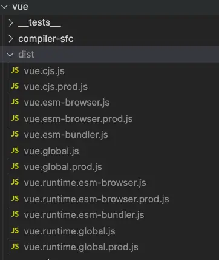
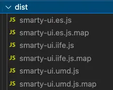
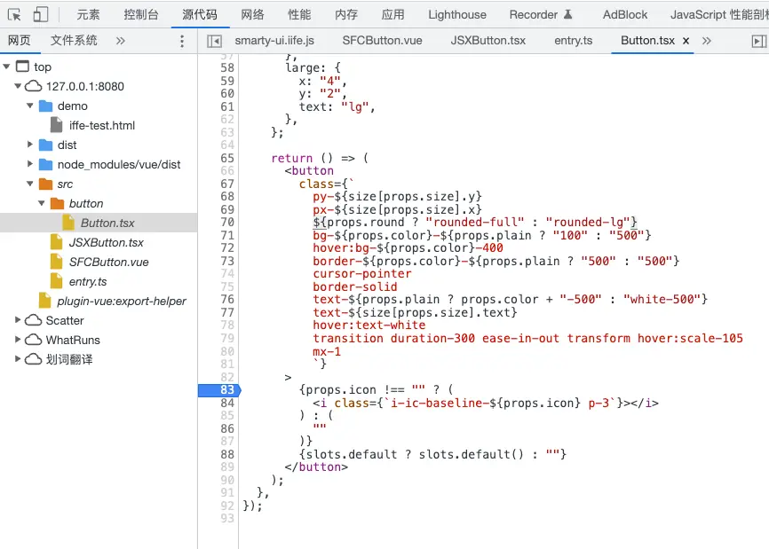
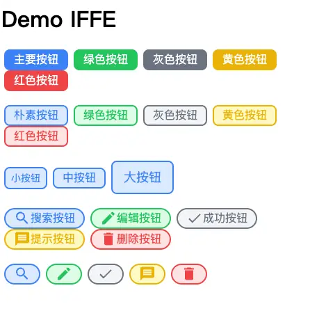

# 8.软件包封装： 如何发布兼容多种 JS 模块标准的软件包？

为了方便用户使用，一款成熟的类库都会提供多种模块封装形式，比如大家最常用到的 Vue，就提供了cjs、esm、umd 等多种封装模式，并且还会提供对应的压缩版本，方便在生产环境下使用。



**第一，需要考虑的是需要支持哪些模块规范。**

目前常见的模块规范有：
    -   IFFE：使用立即执行函数实现模块化 例：(function()) {}；
    -   CJS：基于 CommonJS 标准的模块化；
    -   AMD：使用 Require 编写；
    -   CMD：使用 SeaJS 编写；
    -   ESM：ES 标准的模块化方案 ( ES6 标准提出 )；
    -   UMD：兼容 CJS 与 AMD、IFFE 规范。

其中最常用的有三类：ESM、CJS 和 IFFE。
ESM 标准目前已经是前端开发的标配，无论是选用 Webpack 还是 Vite ，都会采用这种模块规范。其次是 CJS，不可否认，有大量的存量代码还使用 CJS 规范，完全没有必要因为引入一个库去更改编译规则。最后是 IFFE 这种类型，非常适用于逻辑简单，无需搭建工程化环境的前端应用。

**第二，需要考虑的是代码的压缩和混淆问题。**

代码压缩是指去除代码中的空格、制表符、换行符等内容，将代码压缩至几行内容甚至一行，这样可以提高网站的加载速度。混淆是将代码转换成一种功能上等价，但是难以阅读和理解的形式。混淆的主要目的是增加反向工程的难度，同时也可以相对减少代码的体积，比如将变量名缩短就会减少代码的体积。

**第三，还需要考虑 SourceMap 配置。**

SourceMap 就是一个信息文件，里面存储了代码打包转换后的位置信息，实质是一个 json 描述文件，维护了打包前后的代码映射关系。通

常输出的模块不会提供 SourceMap，因为通过 sourcemap 就很容易还原原始代码。但是如果你想在浏览器中断点调试你的代码，或者希望在异常监控工具中定位出错位置，SourceMap 就非常有必要。所以还是要正确掌握 SourceMap 的生成方法。

## 用户故事(UserStory)

让组件库能够兼容多种组件库打包格式，并可以输出压缩版本。

## 任务分解(Task)

-   配置Vite 输出多种格式模块；

-   配置SourceMap映射；

-   测试打包结果。

## 任务实现

### 配置 Vite 的打包方案

如果你使用过 Rollup 实现过多模块方案输出，你就会对 Vite 超级简单的配置所折服。在 Rollup 时代，通常这一步都需要自己编写复杂的 JS 脚本实现。比如：

```
const outputs = ["esm", "cjs", "iife", "umd"].map((format) => ({
  file: `dist/smartyui.${format}.js`,
  name: "SmartyUI",
  format,
  exports: "named",
  globals: {
    vue: "Vue",
  },
}));

const packageConfigs = outputs
  .map((output) => createConfig(output))
  .concat(outputs.map((output) => createMinifiedConfig(output)));

function createPackageJSON() {
  const data = require("./package.json");
  (data.main = "dist/smartyui.cjs.js"), (data.module = "dist/smartui.esm.js");

  fs.outputFileSync(
    resolve("./dist", "package.json"),
    JSON.stringify(data, "\t", "\t"),
    "utf-8"
  );
}
```

作为对比，看一下 Vite 的配置，就显得非常的简洁。

vite.config.ts

```
 const rollupOptions = {
  external: ["vue"],
  output: {
    globals: {
      vue: "Vue",
    },
  },
};
```

这里面有几个配置需要说明一下。

首先是 rollupOptions 配置。由于 Vite 的构建是通过 rollup 完成的，所以 rollup 中的一些配置通过这个属性传递给 rollup。其中需要配置的两个属性如下：

-   external： 作用是将该模块保留在 bundle 之外，比如在数组中添加了 vue ，就是为了不让 vue 打包到组件库中；

-   output： 这个配置用于 umd/iffe 包中，意思是全局中的某个模块在组件库中叫什么名字。比如：

```
import $ from 'jquery';
```

意味着`jquery` 模块的 id 等同于 `$` 变量:

```
var MyBundle = (function ($) {
  // 代码到这里
}(window.jQuery));
```

接着：

```
export default defineConfig({
 build: {
    rollupOptions,
    minify: 'terser', // boolean | 'terser' | 'esbuild'
    sourcemap: true, // 输出单独 source文件
    brotliSize: true,  // 生成压缩大小报告
    cssCodeSplit: true,
    lib: {
      entry: "./src/entry.ts",
      name: "SmartyUI",
      fileName: "smarty-ui",
      formats: ["esm", "umd", "iife"], // 导出模块类型
    },
  },
});
```

由于使用了 terser 用于代码压缩需要单独安装一下
```bash
pnpm i terser@"5.4.0" -D
```


其他属性：

-   formats： ["esm", "umd", "iife"] 是输出模块类型；

-   fileName：是文件名，其实只是一个输出文件名的前缀，默认情况下会和模块类型配合组成最终的文件名。



-   name 属性 : 生成包的名字，在 `iife`/`umd` 包，同一页上的其他脚本可以访问它。

-   minify 属性： 是混淆的意思，这里面有两个混淆工具可以选择，即 terser 和 esbuild。我目前选择了比较老牌的压缩工具 terser，毕竟从 Rollup 时代开始就一直在用。

这时候运行 pnpm build 就可以输出模块了。

### 配置 SourceMap 映射

下面说一下 SourceMap 配置。

如果希望导出 SourceMap， 只需要添加 SourceMap 属性就好了。

```
export default defineConfig({
 build: {
    ...
    sourcemap: true, // 输出单独 source文件
    ...
  },
});
```

此时，构建的时候会生成 SourceMap。

有了 SourceMap ，就可以在 Chrome 调试工具中进行断点调试了。



### 测试打包结果

最后编写一个测试页来确定输出模块效果OK。

先测试是 IFFE 模块。

```
<h1>Demo IFFE</h1>
<div id="app"></div>
<link rel="stylesheet" href="../dist/style.css">
<script src="../node_modules/vue/dist/vue.global.js"></script>
<script src="../dist/smarty-ui.iife.js"></script>
<script>
    console.log('111')
    const { createApp } = Vue
    console.log('vue', Vue)
    console.log('SmartyUI', SmartyUI)
    createApp({
        template: `
        <div style="margin-bottom:20px;">
            <SButton color="blue">主要按钮</SButton>
            <SButton color="green">绿色按钮</SButton>
            <SButton color="gray">灰色按钮</SButton>
            <SButton color="yellow">黄色按钮</SButton>
            <SButton color="red">红色按钮</SButton>
        </div>
        <div style="margin-bottom:20px;"
        >
            <SButton color="blue" plain>朴素按钮</SButton>
            <SButton color="green" plain>绿色按钮</SButton>
            <SButton color="gray" plain>灰色按钮</SButton>
            <SButton color="yellow" plain>黄色按钮</SButton>
            <SButton color="red" plain>红色按钮</SButton>
        </div>
        <div style="margin-bottom:20px;">
            <SButton size="small" plain>小按钮</SButton>
            <SButton size="medium" plain>中按钮</SButton>
            <SButton size="large" plain>大按钮</SButton>
        </div>
        <div style="margin-bottom:20px;">
            <SButton color="blue" round plain icon="search">搜索按钮</SButton>
            <SButton color="green" round plain icon="edit">编辑按钮</SButton>
            <SButton color="gray" round plain icon="check">成功按钮</SButton>
            <SButton color="yellow" round plain icon="message">提示按钮</SButton>
            <SButton color="red" round plain icon="delete">删除按钮</SButton>
        </div>
        <div style="margin-bottom:20px;">
            <SButton color="blue" round plain icon="search"></SButton>
            <SButton color="green" round plain icon="edit"></SButton>
            <SButton color="gray" round plain icon="check"></SButton>
            <SButton color="yellow" round plain icon="message"></SButton>
            <SButton color="red" round plain icon="delete"></SButton>
        </div>
    `}).use(SmartyUI.default).mount('#app')
</script>
```



## 复盘

这节课我们讲了如何让组件库兼容多种模块化标准。

我们希望组件一次编写处处执行，希望组件库可以有更广阔的应用场景。无论是在 Webpack 或者 Vite 甚至直接在简单网页中都可以使用。还需要同时兼顾运行性能和调试的便利性。每种应用场景都需要不同的模块配置配合，输出模块需要考虑：支持模块风格、混淆压缩策略、Sourcemap三方面内容。这样才能够成为一个合格的组件库。

最后留一些思考题帮助大家复习，也欢迎大家在评论区讨论。

-   常用的 JS 模块化标准都有哪些 ？
-   UMD 都兼容哪些模块标准 ？
-   sourcemap 的作用是什么 ？

下节课，我们将完成软件包的封装，下节课见。