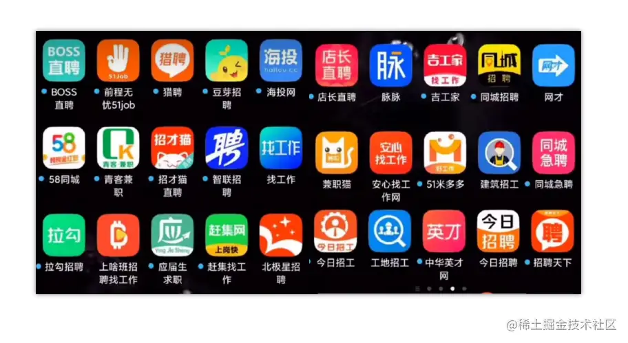

# 第11章—简历投递篇：那些你未曾关注过却很实用的简历投递技巧

当你辛辛苦苦写出一份简历，小心翼翼投递给某家公司后，结果连看都没看直接被忽略。面对这类情况，相信任何人心里难免会有点意难平，但这也并不能全怪招聘方，毕竟自从市场缩招后，结合不断有新人涌入，导致一个岗位每天会收到大量简历，所以你投递的时机、方式不对，就很容易被招聘方忽略！   

想要投出去的简历不被忽略，则需要**掌握一定的投递技巧**，以及要**把握好投递简历的时机**，这样才能增加简历被招聘方看到的几率，毕竟投简历相当于一个子弹夹，最先被压进去的子弹，往往会最后才被用上。

如若你投递简历的时机不对，正好成为了“子弹夹底部”的简历，那你简历被看到的几率将会十分渺小。

正因如此，为了让大家投简历能获取到更多的面试，本章则会围绕着“投递简历”这个话题展开，从投简历的误区开始，到投简历的原则、投递的时机、投递的技巧等方面依次叙述。

## 一、投递简历的误区与原则

经过[《求职机遇篇》](https://juejin.cn/book/7211868947363135545/section/7211874873998573620)的内容讲述后，大家对获取面试的多种方式、投简历的渠道已经很清楚了，接着来聊聊投递简历的时机、原则与技巧！

当你如履薄冰地将简历投出时，或慎之又慎向招聘方打了招呼后，结果投出去的简历犹如泥牛入海、消息已读不回，这换作是谁来，心中都难免有点悲愤交加。

所以，为了改善这种困境，下面一起聊聊投递简历的一些的技巧和策略。

### 投递简历的误区

在投资圈有句话一直广为流传：“不要把鸡蛋放在一个篮子里！”这句话相信玩过理财的小伙伴都听说过，内在含义是指投资时，不要把所有资金都买入一个产品，而是应该将资金合理分配，买入多个产品以求降低风险。而在求职中这个道理也依旧适用！

许多人在打算找工作时，步骤往往是这样的：先刷刷面试题，做一份简历，下载一个招聘软件，稍微更新一下求职信息，开始投递简历……

这个过程实际没有太大的问题，但为了获取更多的面试机会，其实不应该只在一个平台投简历，我们也要学会把鸡蛋放在多个篮子里。

有人说，这感情好啊，求职第一步，我懂！接着出现了下述这幕：   

   

嗯……，你这求职第一步的出发点很好，但你先别出发……

虽说不要把鸡蛋放在一个篮子里，但还请别在每个篮子里都放个鸡蛋，整这么多求职软件，就算你花手能摇到六十码，我认为你也切不过来屏，也许搞着搞着，就会出现“回复错乱”的尴尬场景。

一般我的建议是下载`2~3`个招聘软件为好，既能忙得过来，又能获取更多的面试！

### 认真对待在线简历

招聘平台为了更加方便用人单位筛选人才，通常会搞个“在线简历”的东东出来，这样招聘方在无需你投简历的情况下，也能先大致了解你的信息，从而判断你是否与空缺岗位合适。

但大家千万别傻乎乎地去逐个字写在线简历，因为随着现在`AI`技术越来越发达，无论当你上传`.word、.pdf、.ppt...`任何格式的附件简历，平台都能直接对附件简历进行解析，并从中提取出你的简历内容，接着提醒你把内容同步到在线简历中，所以你直接解析后同步即可。

但在同步解析内容时，有时会打乱你的排版内容，或者解析的信息会存在些许偏差，为此，也要细心一点去同步，不要一股脑地狂点下一步，这会导致你的在线简历有点问题。

相信最近不少小伙伴投简历时，都有过“已读不回”的糟心体验，当遇到这种情况时，小心脏绝对是拔凉拔凉的，那出现这种已读不回的原因是啥呢？两个原因：

- ①发布招聘需求的企业，目前并非真心招聘，或招到了人，或用人部门取消了招聘；
- ②对方看到你的信息后，快速浏览了一遍你的在线简历，认为你与岗位需求不匹配。

上述第一种情况无可避免，总不能拿枪指在别人脑袋上说：你小子最好现在招了我，不然小心老子一枪毙了你！

这显然并不合理，我们也无法顺着网线过去刀了对面，所以重点聊第二种情况，如果你多次遇到已读不回的情况，说明你的在线简历不行，这代表你写的内容无法吸引对方，此时就需稍微调整了。

如何调整呢？在线简历通常为了便于招聘方快速阅读，都有篇幅限制，不能写太多内容。为了确保能在有限的篇幅内，写出足够吸引人的内容，你可以参考“期望薪资”范围内的`JD`，把出现频率比较频繁的关键字，写到你的在线简历上。

当在线简历的关键字，与招聘方的用人需求越吻合，去沟通时得到回复的几率也就越大（除开那些不真心招聘的企业）。

除了技术关键字要匹配之外，也记得突出你的个人优势，但你要问我个人优势怎么突出呢？这得因人而异，毕竟每个人的经历有所不同，因此也没有统一标准。我这里只能给出几个例子。

- ①`XXX`社区万粉博主、`XXX`社区博客专家、`XXX`社区年度最具影响力作者。
- ②`XX`畅销书《……》原作者，累计销量破百万……
- ③十年架构经验，主导过数十个项目研发至落地，具备日千万级`PV`的实际处理经验。
- ④`XXX`开源技术的代码贡献者、`XXX`开源框架的核心维护者之一。
- ……

总之，突出优势的核心原则，就是把自己写得牛一点，或者写出别人不具备的能力，能唬住招聘方最好，唬不住至少也要让人家感觉你和别人不一样。

> 要牢记：某些招聘平台上，企业方向求职者索要附件简历是收费的，企业方单日的免费次数有限，因此有些招聘方看到你在线简历不合适，就不会继续沟通。

### 正式投递前的准备工作

优化好在线简历后，在正式投简历前，还有两个小细节要处理好。

**一是写好问候语**，毕竟投简历不是“啪地一下”给人甩脸上，你至少需要先跟对方打个招呼后，才好开始递交简历是不？因此，你的第一句问候语，也会决定对方是否回你，比如这样：

- 你：给小爷我留个坑位，爷有空了就过去入职。
- 招聘方：……
- 你：嘿，在吗在吗？给你看看我这份牛逼的简历。
- 招聘方：……

显然，这些问候语肯定不行，那如何写呢？作为技术人，我们最好表现出自己的专业性，例如：

> 您好，我之前一直从事后端开发方面的工作，目前具有八年后端研发经验、四年系统架构经验，仔细阅读了您发布的这个岗位需求后，发现和自己十分匹配，您看我们有机会深入沟通下吗？

如果你经验比较丰富，与某个招聘需求的业务也十分吻合，此时也可以稍微改成：
> 您好，我之前有过三年金融（或医疗、ERP、直播等）业务方面的开发经验……

问候语要先建立在礼貌、诚恳的基础之上，同时最好结合自身情况，尽量往对方的招聘需求上靠。比如一个做金融业务的招聘方，正在招五年经验的开发者，而你恰巧目前具有五年经验，之前也做过金融业务，此时你把问候语改成与之匹配的话，只要对方是真心招聘，看到了就绝对会回你！

道理很简单，因为你这样的人对招聘方来说，简直就是个上天恩赐的人才，年限、业务经验都符合要求，你在第一步上就超过了`90%`的竞争者！招聘方自然会优先考虑你！

设置好了问候语，还有另外一个小细节，就是**记得把附件简历的名字改一下，格式最好为“姓名+岗位+年限”**，如果你拥有别人不具备的优势，也可以在这里“整点小心机”，例如“竹子爱熊猫-清华硕士-Java 开发-八年经验”，这样是不是比单独的一个名字要好多了？所以，千万别忘记这点噢！

## 二、投递简历的最佳时机

- 好累啊，一天的事情终于忙完了，躺在床上刷刷招聘平台，睡前投一投简历看看~
- 芜湖～明天就是双休日啦！终于可以在家光明正大地投简历咯！
- 这公司一点都不好，下班就要回去投简历，找到好的下家就立马跑路！！
- 哇，金九银十哎！正好想换工作，国庆那么长的假期，就趁机去面试看看~
- 中午吃完饭就不午睡啦，抽空投投简历试试水~
- 啊！一觉睡醒来就十二点了，下份工作还没着落，不行！得上线投投简历！
- ……

上述一条条独白，相信是很多人投简历的心态，有些求职者习惯在“下班、睡前、放假、午间休息、自然醒后”等时间段投简历，毕竟这段时间自己最空闲，对还在职的小伙伴来说，这些时间段也不用像在公司看招聘那样担惊受怕。

但对于投简历来说，这些时间段虽然你方便了，但实际投递的效果并不佳！`Why`？

因为负责招聘的`HR`并不是机器，也是一个活生生的人，除开岗位和我们不同外，其他方面基本毫无差异！你今天周日放假，那`HR`放不放呢？当然也放，所以这时你去投简历，对方能看见吗？也许能，但她会理你吗？换位思考：
- **星期日的老板**：今天下午有空么？客户那边有个问题你看一下。

当美好的周日，你正在度过惬意的时光，叮咚一声，来了一条这样的信息会怎么样？心情肯定会十分糟糕，上班的时候净找我，放假了还不放过我！此时就算当你看到了信息，相信也会先忽略掉，所以这也是`HR`们在休息、放假、下班的时间内，突然看到你投简历时的心态。

之前在讲简历优化技巧时，曾反复强调要方便`HR`筛选，毕竟方便他人就是方便自己，而投简历时也一样，我们应该在`HR`正常工作的时间段内投。投简历的最好时机为：
- **周一到周四，上午`9:30 ~ 11:00`，下午`14:00 ~ 16:00`**。

这个时间段内，企业负责招聘的工作人员，身心都处于工作状态，所以此时去与之沟通，得到回复的几率也是最大的。但一周至少也要上五天班啊，为啥周五就不投了？道理很简单，任何一个打工人在周五想的是啥？

> 哦豁～放假倒计时：还剩三个小时二十分钟！

而`HR`也不例外，一般周五看到的信息、简历，会统一推到下周一再处理。

要记住，周五、周六、周日，离下次打工日还有三天，这三天绝对会有很多愣头青去投简历。

因此，你周五还在沟通或者投简历，信息、简历就很容易被后面的人覆盖掉，成为“子弹夹底部的简历”！

你想想假设你是对方，周一上班看到`99+`未读信息，是不是最多只会看前面`30%~40%`？所以周五最好不要投，实在缺面试的话，周五上午可以，但下午绝对不行。

最后，上午的投递时间要控制在`11:00`之前，下午则要控制在`16:00`之前，道理也跟上面的差不多，毕竟超出这两个时间点，所有人脑子里想的就是：“干饭干饭，冲冲冲！`GoGoGo`，下班啦！”你再去发信息的话，对方很有可能没心思搭理你。

感情讲究在对的时间遇见合适的人，殊归同途，投简历时也一样，一定要在合适的时间做对的事，想要增加简历被阅读、沟通被回复的几率，就千万别在招聘方休息的时间段去投简历！

## 三、投递简历的小妙招

把握好了投递时机，接着说说投递的妙招，虽说这些小伎俩上不了台面，但的确能给带来帮助。

### 熟悉求职平台

**首先，就是要摸熟你所用的招聘平台**。目前热门的求职`App`不在少数，有走常规路线的`Boss`直聘，有走社交路线的脉脉、领英，还有结合猎头方式的猎聘网……

不同的求职平台多少会存在差异，为了更便于后续操作，在正式投递前，应该先熟悉熟悉目前的平台，这点对于身为技术者的我们来说并不难。

> PS：就算之前用过某个平台也是一样，毕竟每个平台都会做产品升级、优化。

### 千万别无脑海投

熟悉了自己所用的求职平台后，**接着千万别海投**。一键海投虽然快捷，但也会带来隐患：

- 突然出现大量招聘方回复，你可能会忙不过来；
- 同时多家企业发出面试邀约，面试也不好排班；
- 你的简历有问题，海投回复率低，优化后也错失了那些海投过的公司；
- 海投的精准率不行，一些无法满足期望薪资、超出期望薪资的岗位也会自动投递；
- ……

对于技术求职者而言，因为专业性比较强，所以海投的隐患问题主要是上述四点，那不海投该怎么投呢？

最好的办法是**按需递增投递**，啥意思呢？下面具体说说，第一天的时候，建议`2~3`个平台，各自投递/沟通`5~8`个岗位左右就行，接着等待反馈结果，如果回复率、面试邀约率还不错，可以保持这个频率去投。但如果回复率、邀约率较低，可以采用倍投法，第二天各平台投`10~15`个岗位左右。

问题又来了，如果一直没有面试，难道一直倍投下去吗？

不行，因为市场没有那么多招聘岗位给你投，其实到了第三天之后，如果还没有回复、邀约，你应该把目光再放回自己身上，因为此时你至少已经沟通了几十家公司，还未出现有效回复，说明你的简历还是有问题，这时应当调整一下在线简历、履历后再进行投递。

怎么判断自己是简历有问题，还是对方看不上你的履历呢？

可以试着去投一些比你期望低的招聘（记得先把期望薪资改成面议），比如目前要找高级开发，就去试试投中级开发的招聘，如果能接到面试，说明是你的履历达不到高级的水准。

反之，如果投了多个中级招聘后，依旧没出现面试邀约，说明是你的简历有问题，比如包装的学历、经验、项目能被一眼看出来，此时就需要调整简历了。

> 第一步调整是去掉期望薪资，写成面议，因为这样有几率增加你的面试机会。
>     
> 第二步是优化或改正包装内容，正如“简历优化篇”中所说，可以包装但要能经得起推敲。
>    
> 第三步调整是找同专业的朋友/网友，帮你看看简历是否合理，比如期望`15K`，问一下对方是否够格。

确保简历上的基本信息、项目描述、技能描述都没有问题后，继续重复前面的投递过程，虽然现在喊着互联网寒冬，但沟通几十家后至少也会出现有效回复，毕竟人家企业在招人，你各项条件都达标，不可能出现“投几十家也没回复”的情况。

### 有事没事先投外包

许多小伙伴对外包都有排斥心理，毕竟外包给人留下的印象是加班多、没成长、`HR`套路多、地位极低，尤其是那句：**你是外包，不是正式员工，请记住你的身份，麻烦不要随便偷吃公司零食！**

这一句话更是火上浇油，让诸多求职者心中对外包的印象又恶化了几分，但我想说的是：

- 如果你对下家公司没有要求，请记住先投外包！
- 如果你想要找一家自研公司，请记住先投外包！
- 如果你希望入职中大型企业，请记住先投外包！
- 如果你打算冲击下顶级大厂，请记住先投外包！

嗯？不对劲啊，大家内心肯定在想：“你小子是不是收了外包的好处，这么卖力宣传外包？”

但答案是没有，我为什么建议大家先投外包呢？因为可以**将其当作试炼场**！打算找工作的小伙伴，要么是第一次求职，要么距离上次求职也有不短时间了，此时难免对面试有些生疏。

- 好久没出去面试了，现在外面会问什么问题啊？
- 第一次面试心里慌慌的，还略微带点小紧张是怎么回事？
- ……

总之，无论是工作过的老鸟，还是“处子之身”的小白，起初的几场面试，多少会有点不自然，而外包的存在则提供了很好的实战模拟场地！准备得再好也不如真刀实枪干一次，我相信绝大部分小伙伴，都很难在第一场面试就拿到`Offer`吧？

那面霸是怎么炼成的？没有人天生就是面霸，都是靠一场场面试积累的实战经验，因此你听的道理再多，还不如自己踏踏实实多经历几次，你第一次面试，和第五次面试，两者之间肯定会有本质上的差异。所以，大家要学会把更好的自己，留给自己想去的地方，对于自己真正期望入职的企业，可以等锻炼好了再去面试。

当然，这里也不一定是要外包，你用其他不打算入职的公司作为试炼场也行，以外包举例是由于：**外包从初级到资深基本上都招，能满足所有人的试炼需求。**

### 充分利用招聘平台的特性

当你试炼得差不多之后，就可以往自己想进的企业投简历了，但不要傻乎乎地去挨个翻招聘需求，平台提供给你的筛选功能不是摆设，输入筛选条件，能最快地将符合你期望要求的`JD`，直接呈现在你眼前，**用好筛选功能**可以减轻很多工作量。

同时，**也要记得时常刷新简历或者挂载后台程序**。许多小伙伴投完简历之后喜欢划掉进程，其实以如今的手机性能，完全可以不这么做，投完简历之后挂着程序才是最好的选择！

为啥呢？因为招聘平台不可能给已经在职的人推送信息，也不会把在职者的信息推荐给招聘方，咋实现？

基于`活跃度算法`实现的，对于求职平台而言，如果一个用户长期不在平台活跃，意味着这个人不需要找工作，所以不会推送给企业。同理，如果一个用户的活跃度越高，意味着该用户的求职欲望越强，所以推荐给企业的人才列表中，排名也会越高。

而刷新简历、后台挂程序保持在线、开会员……这类做法都是在提升你的活跃度，本质也是在增加你的曝光度，为此求职期间，可以经常进去滑滑软件，刷新刷新简历之类的。

同时，投递简历时也可以把“职位推荐”选成按最新时间排序，这样起码可以确保投出去的简历都是有效的，避免向那些长期存在的`JD`做“无效投递”。

最后，当你找到工作后，可以设置“对外屏蔽身份信息”，以及将求职状态改为在职，这样可以减少骚扰。当然，别急着卸磨杀驴、删软件，因为入职的新公司可能不适合你，你也许会很快再次踏上求职路，到时候还得再下一次。

### 投简历时要擦亮双眼

投递简历时，如果看到一个招聘与你的需求十分对口，不要急着投递简历或者发起沟通，先看看对方的活跃度。如果对方是“三天前、一周前、一月前、半年前活跃”，那这个岗位很有可能已经停止招聘了，因此不要再去做无效沟通啦！

同时，对于一些“万年常在”的`JD`，或者用人需求描述很不明确的招聘，尽量不要去投递，这类`JD`一般都属于`HR`刷绩效的工具。如果企业真心要招人，用人部门绝对会给出技术清单，并且也不可能长期招不到人，所以当你遇到需求不明确、长期存在的`JD`时，直接忽略就好啦。

### 投大厂简历有何不同？

技术人想进大厂，就好比每个大头兵都想当将军，这几乎是很多人的小梦想，所以每年求职的人群中，总会有一批冲击大厂的人，但大厂的面试会分为多轮进行，因此简历流程也相对更长一些。这里暂时就不细说了，后续的《面试流程篇》会详细讲述大致过程。

这里暂时只需记住一点，如果你想进大厂，最好找内部员工帮你内推，因为这样可以让他帮你查进度。如果实在找不到人内推的话，优先去大厂的官方招聘渠道投简历，前面说过大厂的官方渠道优先级会高一些。

## 四、总结

到这里，本节的内容也就走进尾声啦～

本节内容更多在讲：**投简历时如何获取更多的面试机会**，从投简历的误区，讲到投递的原则、时机，以及分享了一些投递小妙招，阐述了很多简历投递时的技巧。这些技巧虽然属于小手段，但当你去耐心落实之后，绝对会比随心所欲地投递简历要好上许多。

最后，也真心祝愿大家求职途中面试多多，面试之后`Offer`多多~

下节会开始分析面试官，让大家充分了解面试官这个角色，毕竟面试官是求职途中的最大对手，做到知己知彼，才能百战不殆，所以咱们下节见啦！