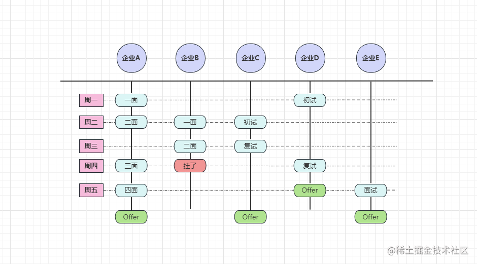
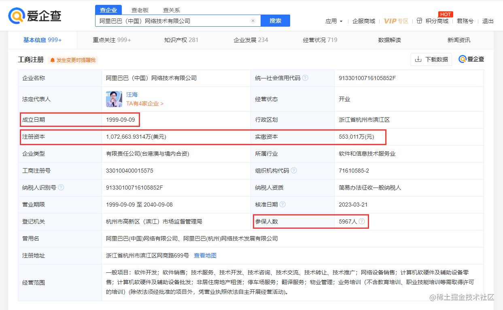
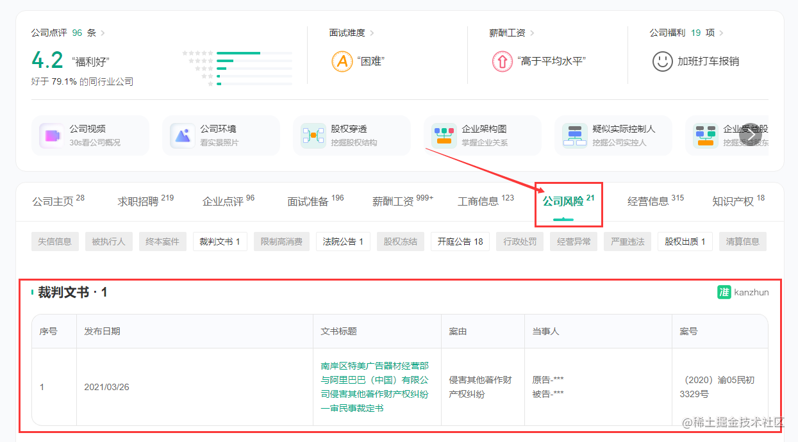
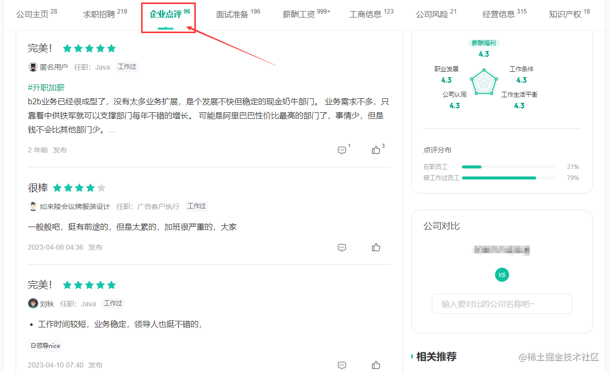

# 第18章—入职抉择篇：怎样在多份Offer中挑选最适合自己的入职

在上节中，聊到过面试复盘这个话题，建立在认真复盘每场面试且不断进步的前提下，拿到`Offer`并不算难。那假设`Offer`到手了，并且还不止一个，这时许多小伙伴就会犯“选择困难症”，究竟该怎么选呢？

选择`Offer`的原则，这要因人而异，求钱、求发展、求稳定……不同的小伙伴，各自的追求并不相同。为此，本节会给出一些`Offer`抉择时的方法，大家可以根据自身情况，综合选出一家“与自身最贴合”的企业入职。

## 一、如何选择适合自己的 Offer？

选`Offer`的前提是：手里得有多个`Offer`，如果大家手里仅有一个，这还有的选吗？

上面问题的答案很显然，所以咱们应该要想办法，让多个`Offer`同时在手才行，怎么做呢？

总共有两条准则，一是收到`Offer`别急着去入职，二是尽量用好“理由”拖延时间，这两点准则很好理解，所以就不展开讲了。唯一值得说的一点是：**用理由对延期入职时间，最长也就只有一周左右**。

> 说明：因为企业招聘的原因是项目缺人，所以急需新人来顶替，如果你把入职时间拖比较长，可能会造成“企业放弃你，选择重新招聘”的场景出现。

通常来说，如果你面试比较多，面试在“并行”发生，示意图如下：   

   

有足够的面试数量支持，手里就容易同时拿到多个`Offer`，这样的情况对自己最有利，因为此时是你挑企业，而并不是企业挑你，从被动方变成了主动方。

> 当然，这种现象在早几年比较常见，如今的环境也许难现此情此景~

不过暂时抛开环境因素不谈，假设诸位都拥有多个`Offer`在手，如何选择呢？

大家平时买笔记本电脑时，会从性能、便携性、续航、外观等多个维度考虑。选`Offer`同样如此，也要基于多个维度来斟酌，有哪些维度呢？可以分为`个人`、`公司`两个大维度，下面展开说说。

### 个人维度选 Offer 的考虑项

基于个人维度，选`Offer`要考虑薪资报酬、假期作息、通勤距离、额外福利这四点，下面略微展开聊聊。

**一、薪资报酬**。相信不管是任何人，工资的高与低，将会成为选`Offer`的第一基准。一份`20K`的工作，与一份`12K`的工作，大家无疑会选择前者，毕竟我们出来打工，肯定是向“钱”看齐。

**二、假期作息**。休息日的模式，是单休、双休、还是大小休，这点也比较重要。就拿单休、双休来做对比，看起来差距不大，但单休是做六休一，双休是做`2.5`休一，把时间拉长，单休比双休一年多上`52`天左右，意味着单休比双休的企业，一年整整多上两个月班！

同时，工作日的上班时间，也要在选`Offer`的时候综合考虑，朝九晚五、朝九晚九，其实差别还是蛮大的，同样给大家算笔账：

对比项 | `955`模式 | `996`模式
:-:|:-:|:-:
上班时间 | `9:00` | `9:00`
下班时间 | `17:30` | `21:00`
中途休息 | 半小时 | 一个半小时
单日工时 | `8`小时 | `10.5`小时
休息模式 | 双休 | 单休
工作天数 | `260`天 | `312`天
年度工时 | `8 * 260 = 2080`小时 | `10.5 * 312 = 3276`小时

> PS：`995`指朝九晚五双休制，`996`指朝九晚九单休制。

两个工作模式的时差：`3276-2080=1196`小时，这意味着`996`比`955`一年多上一半时间的班（而且表中`955`的下班时间还写成了`17:30`，并且中场休息时间只写了半小时，实际情况下，`955`单日工时在`7`小时，甚至更短）！

虽说上表中的计算过程，仅考虑了标准周，未考虑节假日，但就算把节假日算进来结果也相同（而且一般`955`比`996`的节假日还要长）。因此，通过上表的计算过程，大家能清晰感知到休息模式、上班时间造成的区别，这往往也决定着大家工作心情的愉悦感。

> 当然，我并不是倡导大家一定要找`955`，这样的企业在`IT`行业比较少见，可以接受加班，但别严重到`996`程度（不过公司如果舍得发钱，那就另说了~）。

**三、通勤距离**。考虑了前面两点之后，接着还得考虑通勤距离，尤其是北上广深这些城市，有可能你住城南，公司却在城北，上个班跟外出旅游似的，通勤时间就得花`4~5`小时，每天不是在上班，就是在上班的路上~

所以，在有的选的前提下，最好选择一家离自己近的公司，否则通勤将会成为你上班后的噩梦。当然，反向迎合也不是不行，比如公司城北你城南，入职后搬到城北去即可。

**四、额外福利**。这点可以额外的考虑项，如果有两家公司在前面的对比中难分伯仲，接着就可以参考公司的额外福利，比如年终奖、带薪假期、商业医疗保险、下午茶、生日会……这一系列的额外福利。

> 其实有个潜规则：如果一家公司的额外福利越多，说明这家企业的资本越雄厚，抗风险能力也越高，在职涨薪度也会越高。为此，额外福利也可以作为选`Offer`时的一个参考条件。

OK，聊完了个人维度后，接着再从公司层面说上一说。

### 公司层面选 Offer 的考虑项

前面从个人维度上，给出了一些选`Offer`时的考虑项，无论是哪项，其实背后的准则是相同的，也就是“谁对我更好，那我就选谁”。但其实选`Offer`也不仅仅只能看这方面，因为有时钱多并不代表一定好，好比如下例子：

- 以实体产品为主的传统企业，技术十分陈旧，开了`20K`；
- 以软件产品为核心的互联网企业，技术非常新，开了`18K`。

在这个例子中，对于技术人这个角色来说，无疑后者更好一些。虽说后者的薪资没有前者高，但在你入职后，工作带来的成长会很大，这对你的“下一份工作”十分有利。所以选前者，是先甜后苦；选后者，是先苦后甜。

那么选`Offer`时，主要看公司的哪几个方面呢？主要考虑公司性质、公司规模、公司业务、公司技术、岗位职务这五点，现在同样展开聊一聊。

**一、公司性质**。在[《求职意向篇》](https://juejin.cn/book/7211868947363135545/section/7210383406654455808)中聊过，入职不同性质的企业，工作内容、内在地位、福利待遇等各方面都有所差异。通常来说，选择的优先级为：**软件即核心型自研 > 软件非核心型自研 > 项目型外包 > 人力型外包**。

关于为何这么排序，相信认真阅读过[《求职意向篇》](https://juejin.cn/book/7211868947363135545/section/7210383406654455808)的小伙伴都清楚~

**二、公司规模**。企业的规模将决定发展的平台，通常规模越大，成长空间更高。因此，选择时的优先级为：**顶级大厂 > 独角兽 > 大型企业 > 中型企业 > 小型企业**。

不过这个顺序也并非绝对的，毕竟任何一家规模够大的企业，都是一步步从小企业走过来的，万一你入职一家小企业，所做业务正好赶上了时代风口，规模瞬间咔咔咔地暴涨呢？所以世事无常，~~大肠包小肠~~，不存在绝对的事。

> 不过咱们不考虑这种小概率事件，选`Offer`还是着眼当下，未来的事情谁也说不定。

**三、公司业务**。想要评判一家公司有没有潜力的一大要素，就是要看这家公司的业务类型，就好比举几个典型的例子：**拼多多、得物**，竟然能在原本“大厂霸权”的互联网行业杀出重围，不可否认就是由于其业务的特殊性。

同时，公司的业务不仅代表着潜力，而且还关乎着自身的成长度，比如一家做“管理系统”的公司，和一家做“跨境电商”的公司，两者之间的业务复杂度全然不同，项目的含金量也有着天差地别，两者之间究竟选谁？相信诸位心里应该有答案。

再者，业务也会影响上手速度，好比你之前做过三年的电商业务，现在有两个`Offer`，一家医疗业务、一家电商业务，此时选谁呢？显然后者会更好，因为你在电商领域有足够的经验沉淀，入职后的上手速度会更快。

> 当然，有更好的业务赛道，可以放弃原本的经验沉淀，比如你之前写了两年的管理系统，现在有个金融类业务的`Offer`，切换一个赛道也是 OK 的，毕竟业务经验的积累，对技术生涯后期还是比较重要的。

**四、公司技术**。在考虑了公司性质、规模、业务的基础上，接着可以看看公司所用的技术栈，越老、越简单的技术，入职后给自己带来的成长会越低，为此，在有的选的情况下，尽量选择一些技术更新、更牛的公司。

**五、岗位职务**。这条是针对工作经验比较丰富的小伙伴，提出的参考项，因为当薪资比较高的时候，比如达到了`30K+`，那么工作内容都会带点管理性质在内，区别就在于管理、技术的侧重面会有所不同。

同样来举个例子，目前有两个`Offer`，一个是团队`Leader`、另一个是架构师，此时你要怎么选呢？如果你更追求技术，那就选后者，后续的成长方向就是`CTO`（技术首席）；如果对技术追求度不高，则可以选前者，后续的发展方向可以往业务线、事业部、分公司老大等位置靠。

OK，上述五点是在选`Offer`时，从公司层面上来看，需要酌情考虑的几点，这个维度主要就是选好未来的发展，不同的企业，未来的发展路线也会不同。

### 结合不同维度做抉择

前面经过一顿输出后，给了整整九大条考虑项，有小伙伴或许会纳闷了：“给这么多考虑项，原本我没有选择困难症，都给我整出选择困难症了！”

如果你有这样的感慨，那我想说，你感慨得很对，哈哈哈~

话说回来，怎样把给出的这些考虑项结合起来，然后一起做抉择呢？方法很简单：**权重评分法**，评分的意思是指为每项打分，权重代表着根据个人追求，为每项设置不同的分数范围。当然，如果你没有额外追求，可以使用我给出的默认权重。

个人维度的默认权重：

考虑项 | 薪资报酬 | 假期作息 | 通勤距离 | 额外福利
:-:|:-:|:-:|:-:|:-:
**权重分** | `0~15` | `0~10` | `0~5` | `0~2`

公司维度的默认权重：

考虑项 | 公司性质 | 公司规模 | 公司业务 | 公司技术 | 岗位职务（可选）
:-:|:-:|:-:|:-:|:-:|:-:
**权重分** | `0~8` | `0~10` | `0~5` | `0~3` | `0~1`

上述的`x~y`是评分范围，我为不同项设置了不同的权重，所以大家会看到不同的范围，在选`Offer`时为了避免大家纠结，因此可以采用打分的形式，下面说明一下给出的默认权重分。

- 薪资报酬：`0~15`，由于薪资对`Offer`的影响最大，所以权重范围最大。
- 假期作息：`0~10`，这条默认权重也不小，不排斥高强度工作的可以自行调低。
- 通勤距离：`0~5`，相当于六个等级，对于不同的通勤距离，可以给出自己的满意等级。
- 额外福利：`0~2`，代表三个等级，没福利写`0`，一般般写`1`，很满意写`2`。
- 公司性质：`0~8`，代表四个等级，比如人力型外包优先级最低，那就是`1*2=2`。
- 公司规模：`0~10`，五个等级，顶级大厂打分`5*2=10`、独角兽打分为`4*2=8`……
- 公司业务：`0~5`，意味着六个满意度，可以根据自身的满意程度给分。
- 公司技术：`0~3`，四个等级，技术老写`0`、一般写`1`、新写`2`、自己满意写`3`。
- 岗位职务：`0~1`，这只有两个级别，对职务满意写`1`，反之就写`0`（这项不写也行）。

大家可以对手里的每个`Offer`评分，根据你对每个`Offer`的满意度，尽量遵从第一直觉打分，接着把评分求和，此时就能得到一个总分，最后选择总分最高的`Offer`入职即可，这样做出的决定，能在一定程度上排除主观情绪的干扰。

为了便于理解，也同样给大家上个例子，好比现在有两个`Offer`如下。

- `X`公司：`27K、965`、八公里、软件即核心型自研、独角兽、技术一般。
- `Y`公司：`30K、995`、六公里、软件即核心型自研、大厂、技术新。

此时来打分，如下：
评分项 | `X`公司 | `Y`公司
:-:|:-:|:-:
薪资报酬 | `13` | `15` 
假期作息 | `9` | `7` 
通勤距离 | `3` | `4` 
额外福利 | `1` | `1` 
公司性质 | `8` | `8` 
公司规模 | `8` | `10` 
公司业务 | `4` | `4` 
公司技术 | `2` | `3` 
岗位职务 | `1` | `1` 
综合评分 | `50` | `54` 

在这个例子中，基于每一项评分，从最后的综合评分来看，`Y`公司比`X`公司多出`4`分，所以我们应该选择`Y`公司的`Offer`去入职。这样做出的决定，在某种程度上来说，也是最理性、最科学的选择。

如果你有其他比较关心的项，比如你十分看重公司所用的技术栈，那就可以将对应的评分范围调大，比如调整到`0~10`，由于权重范围变大了，那么这一项在总评分中的占比会更高，选出来的`Offer`自然也会更偏向这方面。

### 给不同技术人的建议

不知大家是否还记得我在[《求职意向篇》](https://juejin.cn/book/7211868947363135545/section/7210383406654455808)中，给出的一条建议：**初级选业务积累，中级选技术成长，高级选后期发展**。其实这是一个很正确的建议，处于不同级别的技术人，在职业生涯的不同阶段，要追求的方向也并不同。

对于找初级开发工作的人来说，也就是刚进社会小伙伴，在这个阶段不应该想着学很广、很深的技术，而是需要快速积累业务开发经验！因为现阶段“能干活、能快速干活”才是最重要的，学技术和做业务完全是两码事，也许你学了很多很多的技术，却并不会将其应用到实际工作中，这样的技术积累相当于“徒有其表”。

关于找中级开发的小伙伴，由于之前自身有过一定的业务积累，所以“能上手业务”这个条件早已满足，如果还继续找一份单纯干业务开发的工作，那就真成了他人口中“只会`CRUD`的螺丝仔”。

这时你的关注重心应该放在“技术成长”上，好比你之前的工作一直在用老技术，现在有一个`Offer`用的都是新技术，在综合条件相差不大的基础上，就应该优先考虑这个`Offer`。毕竟只有入职这样的公司，你才能在工作中得到最大的提升，如若入职一家所用技术与之前完全相同的公司，那么这次跳槽/求职的意义就很小了，仅是给你换了一个场地，继续干之前的工作。

至于找高级及以上开发工作的小伙伴，此时更应该关注的则是后期成长，也就是关注发展的平台。

举个简单例子，一个在小公司辗转了五年的人，到最后还只是一个“普通员工”，而另一位在大公司干了五年的人，从最初的小角色，慢慢成长为“技术组长、团队`Leader`、`PM`……”，那到后续再次求职时，两者就会出现本质差别。

> 简单来说就是，找高工岗时，选择一个好的平台很重要，这会关乎到你的职业晋升线，为什么有的人工作七八年后，能成为技术总监、业务线负责人，而有的人工作七八年还是普通码农，原因就在于此，越到后期平台越重要。

所以，选`Offer`时，大家也可以根据自身级别，适当参考这些建议，在综合条件相差不大的基础上，选择一家更适合的企业入职。

最后，也分享一个选`Offer`时的技巧：**入职一家后，先不要急着拒绝其他`offer`**。

工作经验较为丰富的小伙伴，应该都有过一个类似经历，就是当入职一家企业后，待了两天发现并不是很合适，也许是因为氛围，或许是因为业务……当发现不合适后，又要重新踏上求职的旅途。

为了避免这样的情况出现，在你有多个`Offer`的基础上，聊入职时间就尽量谈出“时间差”，选择好一家企业后别急着拒绝其他`Offer`，可以拖上一两天，如果发现入职的企业很合适，再将其他`Offer`拒掉；反之，如果感觉不合适，你又可以无缝衔接到其他公司去~

> PS：这样做听起来有些不地道，但能为自己留条后路，至于要不要这么干，取决于大家自己。

## 二、如何对一家企业进行背调？

关于选择`Offer`要考虑的条件，以及具体抉择的方法，在上一阶段中已经全盘托出，接着再说另外一个话题：**如何针对要入职的企业进行背调？**

听到这个话题也许大家会愣一下，只听说过企业背调员工的，似乎很少听见员工背调企业对不？事实确实如此，但为了自己入职的公司够可靠，你也可以对其进行背调。

当然，一般规模够大的企业，通常不会出太大问题，可以把心放在肚子里去入职。这里主要是针对一些规模并不大的企业，也许入职后的坑不少，主要讲三方面。

- 一、公司信息：工商信息、经营状况、参保人数、公司风险、业务范围等。
- 二、待遇福利：上班时间、公司氛围、休息模式等。
- 三、他人评价：内部员工评价、离职员工评价、薪资评价等。

### 学会分析公司信息

公司信息大家可以借助[企查查](https://www.qcc.com/)、[天眼查](https://www.tianyancha.com/)、[爱企查](https://aiqicha.baidu.com/)等平台来查询，这里主要看注册日期、实缴资本、参保人数。

   

如果成立日期比较早，但企业规模并不大，说明这家公司业务并不是很好。比如那些经营十年、但人数还未破百的企业，进去之后成长性也不会高，毕竟都十年了，还是小公司的话，说明实力、业务、营销等方面都不强，后续涨薪的空间也不大（可能有少数个例除外）。

然后就是看公司的实缴资本，如果注册资本有几百万，但实缴资本只有一丢丢，那这家企业有可能就是空壳公司，老板用来偷税的，毕竟一家企业的实缴资本，也代表着资本能力和老板的重视度（好比看图中阿里的实缴资本）。

接着就是看参保人数，参保人数和公司规模越接近，说明这家企业越正规。如果你看到一家企业的规模是`200~499`，但参保人数才两位数，那说明这家企业很不靠谱，有可能入职都不缴公积金。

看了公司的基本信息后，接着可以去看看公司的经营风险，这里大家可以借助[国家企业信用信息公示系统](https://www.gsxt.gov.cn/index.html)、[看准网](https://www.kanzhun.com)、支付宝-芝麻企业信用等平台，或者在前面提到的几个平台，开个会员也可以，如下：  

   

大家可以快速浏览一下对应公司的风险，重点关注“严重违法”类型，这说明公司存在大风险，入职后搞不好就给一锅端了，或者突然暴雷就倒闭了。

> 题外话：真有这样的事情，我朋友入职一家做体育竞猜类的公司，还没转正就被跨省整锅端了，后面扣了一个“涉嫌网络赌博”的帽子，虽然是新人，但也在里面蹲了近两个月才被保释出来~

再其次，我们还要关注一下“劳务纠纷”这个类型，如果出现这样的裁判文书，说明这家公司有过“拖欠工资、恶意辞退”之类的前科，有离职员工仲裁过这家公司，所以入职这样的企业，就要做好被拖欠工资的心理准备（有其他选择的情况下最好别去）。

### 从招聘平台判断公司

除开可以通过前面提到的平台分析公司外，咱们也可以通过招聘平台来分析公司，因为招聘平台会强制要求公司填写认证信息，所以大家可以从给出的认证信息上进行分析，先来张图：  

   

主要就是看工作时间这一栏，如果上面写着“弹性工作”的，十有八九就是需要加班，包括写着“免费班车”的，几乎也是需要加班，但后者相对人性化，起码有加班费。

### 从网上得知他人评价

最后，与其自个儿去调查分析，也不如直接问“入职过的前辈”来得实在，大家可以通过各个网络渠道，如知乎、脉脉、小红书这类分享平台，又或者职友集、看准网之类的收集平台，还有各类社交群、交流社区等，从而得知“公司前辈”的评价。

    

通过这类社交渠道，大家可以得知很多信息，如加班强度、涨薪幅度、涨薪频率、晋升频率、工作氛围、领导作风、内部潜规则……但网络上千人千面，大家也不要听风就是雨，除非一家公司搜到的都是负面评价时，此时就可以提前避坑。

> 相反，负面评价只占少数时，这可能是由于员工自身或某个部门造成的负面点评。

至此，通过这些背调手段，可以针对最后挑选出来的`Offer`，做一次如之前的“背调”，万一你要入职的这家企业确实很坑，那就可以放弃这个`Offer`另寻他路。
> 不过当你不确信的时候，可以先去入职体验两天，不好再走就行，试错成本也不高。

## 三、总结

OK，入职抉择篇到这里，也就走入了尾声。本节的核心话题就两个，一是如何选择最适合自己的`Offer`，其中围绕着个人、公司这两个大维度，细分出了很多个小的考虑项，接着又讲述了一种名为“权重评分法”的选择方式，协助大家做出最理性的抉择，最后针对不同级别的技术人，给出了一定的建议。

讲完如何选`Offer`之后，接着聊到第二个核心话题，也就是如何对公司进行背调，这个话题比较简单，无非就是通过现有的各类工具、平台，对要入职的目标公司进行调查分析，从而为自己的入职多加一层“保险”。

讲完了本节的内容后，按照求职时间线的推进，接下来会根据选好的`Offer`去入职，那身为一个初入公司的“新人”，咱们又该如何快速融入团队、快速上手新工作呢？这将成为下一节的核心话题，所以我们下节再见~