# 35-高级篇：SVG 路径的高级技术

SVG路径（`<path>`）是一种基于数学描述的矢量图形技术，通过一系列路径命令定义节点、直线和曲线，实现各种复杂的图形和动画效果。在现代 Web 开发中，SVG 路径技术至关重要。然而，许多开发者常忽视这一技术，偏向图形编辑器生成复杂路径。

  


尽管图形编辑器在某些情况下更为便捷，但有些任务更适合在代码中完成。尤其是当需要对生成路径进行定制修改时，SVG路径技术尤为重要。简而言之，掌握这些技术的内在工作原理将大大提升你的前端技能水平，使你能实现前所未有的创意。正如下面的动画所展示的，深入了解和掌握SVG路径的高级技术可创造引人注目的视觉效果和交互体验。

  


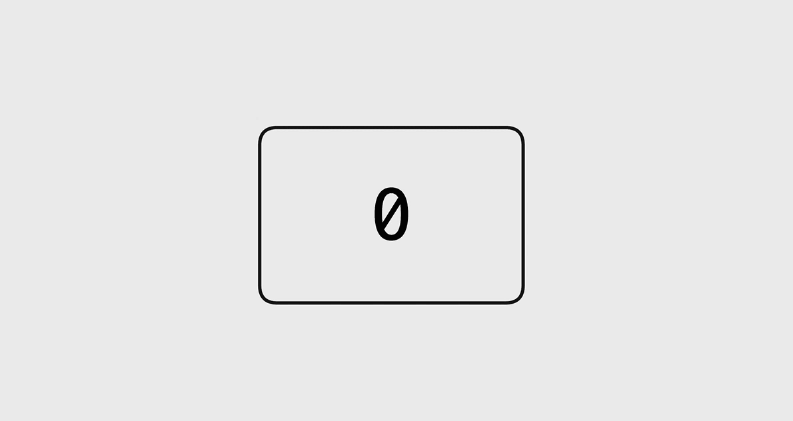

  


因此，小册单独设置了SVG路径的高级技术一节，旨在深入探讨SVG路径的高级应用，包括路径命令、贝塞尔曲线和路径动画等：

  


-   **路径命令：** SVG路径命令是指令序列，包括移动到（`M/m`）、线段到（`L/l`）、水平线到（`H/h`）、垂直线到（`V/v`）、曲线到（`C/c`、`S/s`、`Q/q`、`T/t`）、椭圆曲线到（`A/a`）和闭合路径（`Z/z`）。精通这些命令及其使用可以精确控制路径形状和行为。
-   **贝塞尔曲线：** 在SVG路径中常见的贝塞尔曲线通过控制点定义曲线形状。SVG有线性、二次、三次和四次贝塞尔曲线。了解如何使用这些曲线及其控制点可以创造各种引人注目的曲线效果。
-   **动画和交互：** SVG路径可通过CSS或JavaScript进行动画和交互。使用CSS可实现平滑的动画效果，而JavaScript可实现更复杂的交互行为，如拖拽、缩放和旋转。深入了解SVG路径动画和交互技术可为Web应用程序和用户界面创造生动引人的交互体验。

  


深入了解和掌握 SVG 路径的高级技术可以帮助你创建出令人印象深刻的视觉效果和交互体验。通过深入了解贝塞尔曲线、路径命令以及动画和交互技术，你可以更好地利用 SVG 路径的潜力，为其 Web 应用程序和用户界面带来独特的魅力和吸引力。

  


## SVG 路径（`<path>`）简介

  


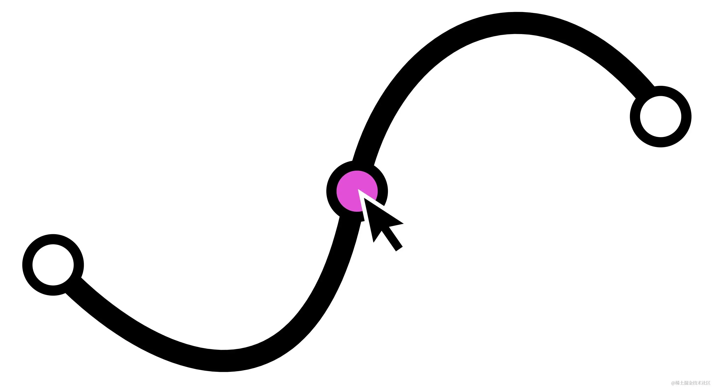

  


[在介绍 SVG 基本图形元素时](https://juejin.cn/book/7341630791099383835/section/7345813971552698406#heading-8)，就曾向大家介绍过 SVG 的 `<path>` 元素。SVG 中的 `<path>` 元素是 [SVG 基本形状](https://juejin.cn/book/7341630791099383835/section/7345813971552698406#heading-8)中最强大的一个，甚至是绘制的终极元素。它可以绘制出你想要的任何形状！据我所知，SVG 内部的所有其他图形绘制元素，比如直线（`<line>`）、矩形（`<rect>`）、圆（`<circle>`）、椭圆（`<ellipse>`）、折线（`<polyline>`）和多边形（`<polygon>`），最终都是通过路径元素（`<path>`）来实现的。

  


另外，`<path>` 只需要设定很少的点，就可以创建平流畅的线条（比如曲线）。虽然 `<polyline>` 元素也能实现类似的效果，但是必须设置大量的点（点越密集，越接近连续，看起来越平滑流畅），并且这种做法不能够放大（放大后，点的离散更明显）。所以在绘制 SVG 图形时，对路径的良好理解很重要。虽然不建议使用文本编辑器创建复杂的路径，但了解它的工作方式将助于识别和修复 SVG 中的显示问题。

  


`<path>` 元素是通过 `d` 属性来描述它所绘制的内容。`d` 属性的值是一个独特的迷你语法。它可能看起来相当晦涩。这是一大堆数字和字母组合成的长字符串。像计算机上的任何东西一样，这也有它的道理。我在这方面不是专家，但我觉得挖掘一下会很有趣。

  


例如，Web 设计师在诸如 Figma 图形设计软件中绘制了一条曲线，如下图所示：

  


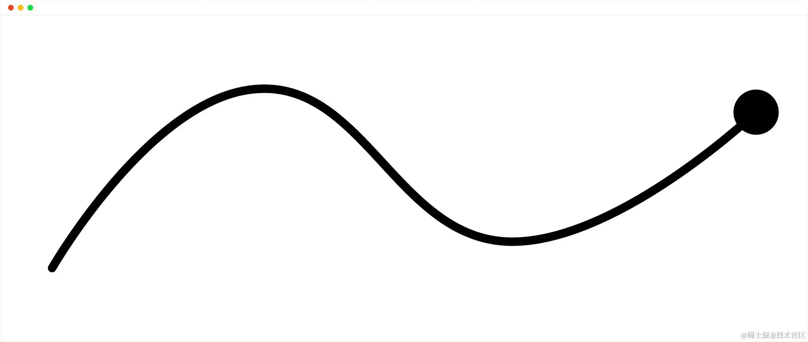

  


导出的 SVG 就是一个由 `<path>` 元素绘制的图形：

  


```XML
<svg fill="none" viewBox="0 0 1810 467">
    <path fill="#000" d="M1.899 450.384c-2.892 5.027-1.162 11.446 3.865 14.338 5.026 2.892 11.445 1.162 14.337-3.865L1.9 450.384ZM487 15.621l1.887 10.329L487 15.62Zm672 374.5.3 10.495-.3-10.495Zm538.5-321c0 30.928 25.07 56 56 56s56-25.072 56-56-25.07-56-56-56-56 25.072-56 56ZM11 455.62c9.101 5.236 9.1 5.237 9.102 5.235l.005-.009.027-.047.115-.198.475-.816a516.71 516.71 0 0 1 1.913-3.244 952.213 952.213 0 0 1 7.545-12.459c6.633-10.779 16.402-26.256 28.907-44.984 25.02-37.47 60.94-87.873 104.559-139.653 43.644-51.81 94.824-104.792 150.331-147.565 55.577-42.828 114.915-74.97 174.908-85.931l-3.774-20.658c-64.517 11.786-126.934 46.017-183.952 89.955-57.089 43.991-109.346 98.166-153.574 150.669-44.253 52.534-80.642 103.6-105.963 141.522-12.665 18.968-22.575 34.667-29.327 45.64a964.231 964.231 0 0 0-7.714 12.738 562.348 562.348 0 0 0-2.501 4.252l-.133.229-.035.062-.01.017c-.003.005-.005.008 9.096 5.245ZM488.887 25.95C630.246.125 719.36 90.87 813.492 192.994c92.66 100.527 190.028 212.124 345.808 207.622l-.6-20.991c-144.53 4.176-235.389-98.473-329.767-200.864C736.028 77.968 639.296-22.876 485.113 5.291l3.774 20.659ZM1159.3 400.616c135.15-3.905 285.96-85.781 401.79-165.193 58.18-39.89 108.04-79.521 143.36-109.176 17.66-14.833 31.7-27.18 41.34-35.833 4.82-4.327 8.53-7.73 11.06-10.059a608.93 608.93 0 0 0 2.87-2.668c.32-.304.57-.537.74-.695.08-.079.15-.14.19-.18.02-.022.04-.038.05-.05.01-.005.01-.01.01-.013.01-.003.01-.006-7.21-7.628l-7.22-7.621c0 .001-.01.004-.01.008-.01.007-.02.02-.04.037-.04.034-.09.087-.17.159-.15.143-.38.36-.69.65l-2.77 2.575c-2.46 2.265-6.1 5.602-10.84 9.86-9.49 8.515-23.35 20.71-40.81 35.375-34.95 29.342-84.26 68.531-141.74 107.939-115.49 79.183-261.92 157.806-390.51 161.522l.6 20.991Z"/>
</svg>
```

  


这是一个中等复杂度路径的示例：

  


```XML
<path fill="#000" d="M1.899 450.384c-2.892 5.027-1.162 11.446 3.865 14.338 5.026 2.892 11.445 1.162 14.337-3.865L1.9 450.384ZM487 15.621l1.887 10.329L487 15.62Zm672 374.5.3 10.495-.3-10.495Zm538.5-321c0 30.928 25.07 56 56 56s56-25.072 56-56-25.07-56-56-56-56 25.072-56 56ZM11 455.62c9.101 5.236 9.1 5.237 9.102 5.235l.005-.009.027-.047.115-.198.475-.816a516.71 516.71 0 0 1 1.913-3.244 952.213 952.213 0 0 1 7.545-12.459c6.633-10.779 16.402-26.256 28.907-44.984 25.02-37.47 60.94-87.873 104.559-139.653 43.644-51.81 94.824-104.792 150.331-147.565 55.577-42.828 114.915-74.97 174.908-85.931l-3.774-20.658c-64.517 11.786-126.934 46.017-183.952 89.955-57.089 43.991-109.346 98.166-153.574 150.669-44.253 52.534-80.642 103.6-105.963 141.522-12.665 18.968-22.575 34.667-29.327 45.64a964.231 964.231 0 0 0-7.714 12.738 562.348 562.348 0 0 0-2.501 4.252l-.133.229-.035.062-.01.017c-.003.005-.005.008 9.096 5.245ZM488.887 25.95C630.246.125 719.36 90.87 813.492 192.994c92.66 100.527 190.028 212.124 345.808 207.622l-.6-20.991c-144.53 4.176-235.389-98.473-329.767-200.864C736.028 77.968 639.296-22.876 485.113 5.291l3.774 20.659ZM1159.3 400.616c135.15-3.905 285.96-85.781 401.79-165.193 58.18-39.89 108.04-79.521 143.36-109.176 17.66-14.833 31.7-27.18 41.34-35.833 4.82-4.327 8.53-7.73 11.06-10.059a608.93 608.93 0 0 0 2.87-2.668c.32-.304.57-.537.74-.695.08-.079.15-.14.19-.18.02-.022.04-.038.05-.05.01-.005.01-.01.01-.013.01-.003.01-.006-7.21-7.628l-7.22-7.621c0 .001-.01.004-.01.008-.01.007-.02.02-.04.037-.04.034-.09.087-.17.159-.15.143-.38.36-.69.65l-2.77 2.575c-2.46 2.265-6.1 5.602-10.84 9.86-9.49 8.515-23.35 20.71-40.81 35.375-34.95 29.342-84.26 68.531-141.74 107.939-115.49 79.183-261.92 157.806-390.51 161.522l.6 20.991Z"/>
```

  


我们可以重新格式化它，开始理解它（仍然是有效的代码）：

  


```XML
<path fill="#000" 
    d="
        M1.899 450.384
        c-2.892 5.027-1.162 11.446 3.865 14.338 5.026 2.892 11.445 1.162 14.337-3.865
        L1.9 450.384Z
        M487 15.621l1.887 10.329L487 15.62
        Z
        m672 374.5.3 10.495-.3-10.495Z
        m538.5-321
        c0 30.928 25.07 56 56 56
        s56-25.072 56-56-25.07-56-56-56-56 25.072-56 56
        Z
        M11 455.62
        c9.101 5.236 9.1 5.237 9.102 5.235
        l.005-.009.027-.047.115-.198.475-.816
        a516.71 516.71 0 0 1 1.913-3.244 952.213 952.213 0 0 1 7.545-12.459
        c6.633-10.779 16.402-26.256 28.907-44.984 25.02-37.47 60.94-87.873 104.559-139.653 43.644-51.81 94.824-104.792 150.331-147.565 55.577-42.828 114.915-74.97 174.908-85.931
        l-3.774-20.658c-64.517 11.786-126.934 46.017-183.952 89.955-57.089 43.991-109.346 98.166-153.574 150.669-44.253 52.534-80.642 103.6-105.963 141.522-12.665 18.968-22.575 34.667-29.327 45.64a964.231 964.231 0 0 0-7.714 12.738 562.348 562.348 0 0 0-2.501 4.252
        l-.133.229-.035.062-.01.017
        c-.003.005-.005.008 9.096 5.245
        Z
        M488.887 25.95
        C630.246.125 719.36 90.87 813.492 192.994
        c92.66 100.527 190.028 212.124 345.808 207.622
        l-.6-20.991c-144.53 4.176-235.389-98.473-329.767-200.864
        C736.028 77.968 639.296-22.876 485.113 5.291l3.774 20.659
        Z
        M1159.3 400.616
        c135.15-3.905 285.96-85.781 401.79-165.193 58.18-39.89 108.04-79.521 143.36-109.176 17.66-14.833 31.7-27.18 41.34-35.833 4.82-4.327 8.53-7.73 11.06-10.059a608.93 608.93 0 0 0 2.87-2.668c.32-.304.57-.537.74-.695.08-.079.15-.14.19-.18.02-.022.04-.038.05-.05.01-.005.01-.01.01-.013.01-.003.01-.006-7.21-7.628l-7.22-7.621
        c0 .001-.01.004-.01.008-.01.007-.02.02-.04.037-.04.034-.09.087-.17.159-.15.143-.38.36-.69.65l-2.77 2.575c-2.46 2.265-6.1 5.602-10.84 9.86-9.49 8.515-23.35 20.71-40.81 35.375-34.95 29.342-84.26 68.531-141.74 107.939-115.49 79.183-261.92 157.806-390.51 161.522
        l.6 20.991
        Z"/>
```

  


正如你所看到的，`d` 属性包含的是一些字母和数字。其实这些字母和数字就是一个“命令 + 参数”的序列。其中，这些字母是命令，数字是传递给这些命令的值（参数）。所有空格都是可选的（它们也可以是逗号）。

  


例如，上面代码中的 `M1.899 450.384` ，字母 `M` 表示的是“移到”（Move to）命令，当解析器读到这个命令时，它就知道你是打算移动到某个点。跟在命令字母后面的，是你需要移动到的那个点的 `x` 和 `y` 轴坐标。因此 `M1.899 450.384` 命令表示的是移动到 `(1.899,450.384)` 这个点。这一段字符结束后，解析器就会去读下一段命令。每一个命令都有两种表示方式，一种是用大写字母，表示采用绝对定位。另一种是用小写字母，表示采用相对定位。

  


这意味着，要掌握 SVG 的 `<path>` ，首先要知道它有哪些命令可用，以及如何使用它们来绘制各种图形。接下来，我们将讲解这些可用的命令，并且展示一些示例。

  


让我们开始吧！

  


## 了解 SVG 路径的命令

  


大多 Web 开发者看到 `<path>` 元素的 `d` 属性的值时，或多或少都会有种头皮发麻的感觉，甚至对其有种说不出，道不明的恐惧感。它看起来就像是某种神奇的咒语。事实上，它只是一系列的命令，告诉浏览器路径应该如何绘制。如果我们稍微整理一下 `d` 属性，这一点会更加明显：

  


```XML
<path d="
    M12.07.2
    C10.55.68.15.26.36.7
    C4.58.14.210.65.712.4
    L12.018.3
    L18.312.4
    C19.710.619.58.117.76.7
    C15.85.213.45.612.07.2
    Z" />
```

  


上面的代码，将会绘制一个“心形”图形。为了绘制这个图形，浏览器按顺序执行这些路径命令，每个命令绘制路径的一小段：

  


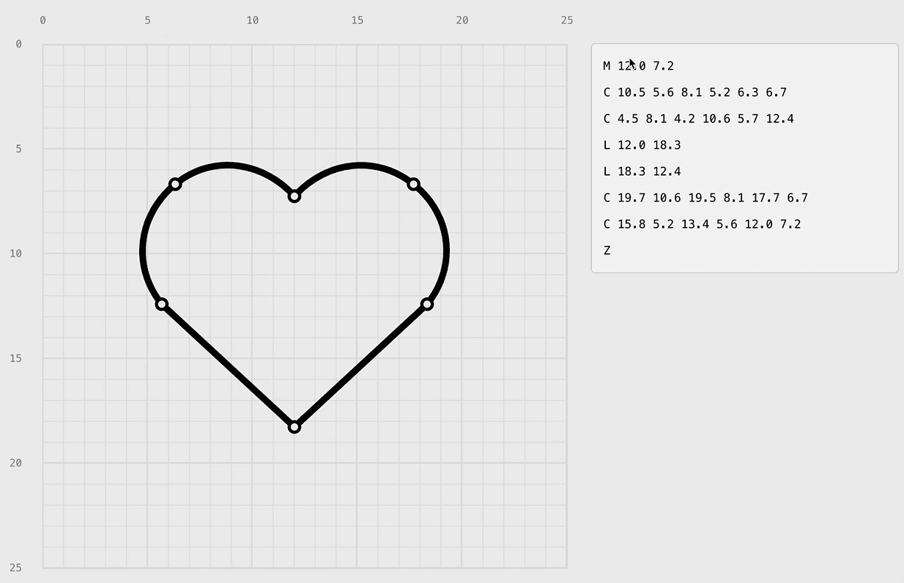

  


并不难发现，所有路径命令都遵循相同的基本语法——一个字母后面紧跟一系列数字。字母表示的是命令类型，而数字则作为命令的参数。

  


在某种程度上，你可以将这些命令看作函数调用，其中字母是函数名称，而数字是函数的参数：

  


```JavaScript
M(12, 7.2);
```

  


### 路径命令类型

  


上面所提到的 `M` 命令中是众多路径命令中的一个。据我统计，它大概有 `20` 个不同类型的命令：

  


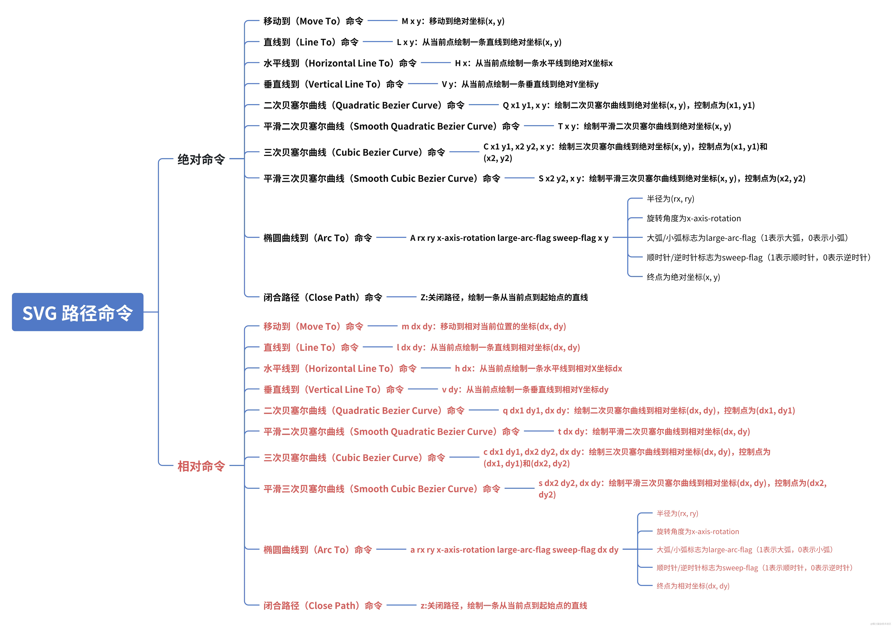


注意，以上命令用于 `<path>` 元素的 `d` 属性中。同样的语法也用于描述 `<animateMotion>` （SVG 路径动画）和 `<textPath>` 元素（文本路径）的 `path` 属性中的几何路径。该语法还适用于 CSS 的 `path()` 函数和 HTML 的 `<canvas>` 元素。

  


对于所有命令，大写字母后面跟随绝对坐标，而小写字母后面跟随相对坐标（偏移值）。每个路径段从上一个命令的终点或目的地开始。如果路径数据包含错误，浏览器会绘制直到错误之前的所有路径段。这使得调试稍微容易一些。

  


以下命令用于 `<path>` 元素的 `d` 属性中。同样的语法也用于描述 `<animateMotion>` 和 (在 SVG 2 中) `<textPath>` 元素的 `path` 属性中的路径几何。该语法还用于 CSS 的 `path()` 函数和 HTML 画布方法中。

  


在这里，我们先简单的描述一下这些命令的功能，具体的使用稍后会逐个介绍：

  


#### 移动到（Move To）命令：`M x y` 和 `m dx dy`

  


移动“笔”的位置而不绘制任何内容。

  


-   后面跟随两个数字，分别表示目的地的 `x` 和 `y` 坐标（对于 `M`）或相对位移 `dx` 和 `dy` （对于 `m`）
-   额外的坐标对将被解释为直线到（Line To）命令，其中 `M` 对应 `L`，`m` 对应 `l`
-   奇数个坐标列表是无效的，会导致错误
-   所有路径必须以移动到命令开始
-   如果路径以相对的 `m` 命令开始，则其起始点相对于 `(0,0)` 原点计算

  


#### 直线到（Line To）命令：`L x y` 和 `l dx dy`

  


绘制直线。从当前位置绘制一条直线到指定的点。

  


-   后面跟随两个数字，分别表示目的地的 `x` 和 `y` 坐标（对于 `L`）或相对位移 `dx` 和 `dy` （对于 `l`）
-   额外的坐标对会继续绘制更多的直线段
-   对于多个相对线段（`l`），每段线的起点都会重新计算
-   奇数个坐标列表是无效的，会导致错误

  


#### 水平线到（Horizontal Line To）命令：`H x` 和 `h dx`

  


绘制水平线。从当前位置绘制一条水平直线到指定位置。

  


-   后面跟一个数字，表示目的地的 `x` 坐标（对于 `H`）或相对位移 `dx`（对于 `h`）
-   额外的数字会继续绘制更多的水平线段
-   对于多个相对水平线段（`h`），每段线的起点都会重新计算

  


#### 垂直线到（Vertical Line To）命令：`V y` 和 `v dy`

  


绘制垂直线。从当前位置绘制一条直线到指定的垂直位置。

  


-   后面跟一个数字，表示目的地的 `y` 坐标（对于 `V`）或相对位移 `dy`（对于 `v`）
-   多出的数字会绘制额外的线段
-   对于多个相对垂直线（`v`），每条线段都会重新计算相对点

  


#### 二次贝塞尔曲线（Quadratic Bezier Curve）命令：`Q x1 y1, x y` 和 `q dx1 dy1, dx dy`

  


绘制二次贝塞尔曲线，使用指定的控制点，绘制到指定的结束点。

  


-   后面跟着四个数字：前两个是控制点的 `x1` 和 `y1` 坐标（对于 `Q` ）或偏移量 `dx1` 和 `dy1` （对于 `q`） ，后两个是结束点的 `x` 和 `y` 坐标（对于 `Q` ）或偏移量 `dx` 和 `dy` （对于 `q` ）
-   额外的四个数字组成的集合会绘制额外的曲线段
-   相对位置是相对于每段曲线的起点计算的，对于控制点和结束点都是如此
-   无法分组为四个一组的坐标列表是错误的

  


#### 平滑二次贝塞尔曲线（Smooth Quadratic Bezier Curve）命令：`T x y` 和 `t dx dy`

  


绘制二次贝塞尔曲线到指定的结束点，自动计算控制点，以确保与前一段曲线的连接平滑。

  


-   后面跟着两个数字，表示目的地点的 `x` 和 `y` 坐标（对于 `T`）或偏移量 `dx` 和 `dy`（对于 `t`）
-   控制点的位置由前一段曲线的控制点到其结束点的位置关系决定，以保持平滑连接
-   如果前一个路径段不是二次曲线，则新的控制点将设置为起始点
-   多出的数字对会绘制额外的曲线
-   对于多个曲线，控制点的位置计算和 `t` 命令的结束点的相对位置都基于前一段路径
-   奇数个坐标列表是错误的

  


#### 三次贝塞尔曲线（Cubic Bezier Curve）命令：`C x1 y1, x2 y2, x y` 和 `c dx1 dy1, dx2 dy2, dx dy`

  


绘制三次贝塞尔曲线，使用指定的控制点，绘制到指定的结束点。

  


-   后跟六个数字：前两个是第一个控制点的 `x1` 和 `y1` 坐标（对于 `C`）或偏移量 `dx1` 和 `dy1` （对于 `c`），接下来两个是第二个控制点的位置 `x2` 和 ` y2` 或偏移量 `dx2` 和 `dy2`，最后一对定义了结束点的 `x` 和 `y` 坐标或偏移量 `dx` 和 `dy`
-   额外的六个数字组成的集合会绘制额外的曲线段
-   控制点和结束点的相对位置都是相对于每段曲线的起点计算的
-   无法分组为六个一组的坐标列表是错误的

  


#### 平滑三次贝塞尔曲线（Smooth Cubic Bezier Curve）命令：`S x2 y2, x y` 和 `s dx2 dy2, dx d`

  


绘制三次贝塞尔曲线到指定的结束点，自动计算第一个控制点，以确保与前一段三次曲线的连接平滑，并使用指定的第二个控制点。

  


-   后面跟着四个数字：前两个是第二个控制点的 `x2` 和 `y2` 坐标（对于 `S`）或偏移量 `dx2` 和 `dy2` （对于 `s`），最后一对定义了结束点的 `x` 和 `y` 坐标或偏移量 `dx` 和 `dy`
-   第一个控制点通过确定从前一段曲线的控制点到其结束点的 `x` 和 `y` 偏移量来计算，然后再次添加这些偏移量
-   如果前一个路径段不是三次曲线，则新的控制点将设置为起始点
-   额外的四个数字组成的集合会绘制额外的曲线
-   对于多个曲线，控制点的位置计算和 `s` 命令的所有点的相对位置都基于前一段路径
-   无法分组为四个一组的坐标列表是错误的

  


#### 椭圆曲线到（Arc To）命令：`A rx ry x-axis-rotation large-arc-flag sweep-flag x y` 和 `a rx ry x-axis-rotation large-arc-flag sweep-flag dx dy`

  


绘制椭圆弧线段到指定的结束点，使用指定的参数构造弧线。后跟着七个数字，如下所示：

  


-   `rx` 表示椭圆的 `x` 轴半径
-   `ry` 表示椭圆的 `y` 轴半径
-   `x-axis-rotation` 表示椭圆 `x` 轴相对于路径 `x` 轴的旋转角度，以度数表示
-   `large-arc-flag` 表示大弧或小弧标志，其中 `1` 表示大弧，`0` 表示小弧
-   `sweep-flag` 表示顺时针或逆时针标志，其中 `1` 表示顺时针，`0` 表示逆时针
-   结束点的 `x` 位置（对于 `A`）或偏移量 `dx`（对于 `a`）
-   结束点的 `y` 位置（对于 `A`）或偏移量 `dy`（对于 `a`）
-   额外的七个数字组成的集合会创建额外的弧线
-   无法分组为七个一组的坐标列表是错误的
-   标志参数的值为除 `1` 或 `0` 之外的任何值都是错误的

  


#### 闭合路径（Close Path）命令：`Z` 和 `z`

  


从当前位置绘制一条直线（如果需要），连接到最近的移动到命令定义的点，并将两条线段连接成一条线段。

  


-   在闭合路径命令之后的任何数字都是错误的
-   唯一可以在闭合路径之后的命令是移动到 `M` 或 `m`

  


这些枯燥的文字可能并没有解决你的实际问题，甚至可能让你更加困惑。你可能还不清楚如何使用这些命令来绘制、调试和修复你的图形。别担心，我们会在接下来详细介绍这些命令的用法，帮助你精确地绘制各种形状和曲线，甚至让你在网页上创建丰富多彩且复杂的图形。当然，如果你对这些理论性的描述不感兴趣，你可以直接跳到你感兴趣的内容。但我会尽力帮助更多的Web开发者了解SVG路径命令集。

  


### 绝对和相对命令

  


SVG 路径中的命令分为绝对命令和相对命令，它们是定义路径的关键部分，决定了图形如何绘制和移动。绝对命令是以大写字母表示的，比如 `M`、`L`、`H`、`V`、`C`、`S`、`Q`、`T`、`A`、`Z` ，这些命令使用绝对坐标值来指定路径的位置和形状，这意味着它们的参数是相对于坐标原点 `(0,0)` 的。而相对命令则是以小写字母表示的，比如`m`、`l`、`h`、`v`、`c`、`s`、`q`、`t`、`a` 、 `z` ，这些命令使用相对坐标值来指定路径的位置和形状，这意味着它们的参数是相对前一个命令的终点的。

  


请看以下命令：

  


```XML
<path d="
    M 10.0 10.0
    L 5.0 5.0" stroke="hsl(206 100% 50%)" />
<path d="
    M 10.0 10.0
    l 5.0 5.0" stroke="hsl(151 55% 41.5%)" />
```

  


这里，我们有两条线都从相同的点 `(10, 10)` 开始，参数也都是 `5 5`。

  


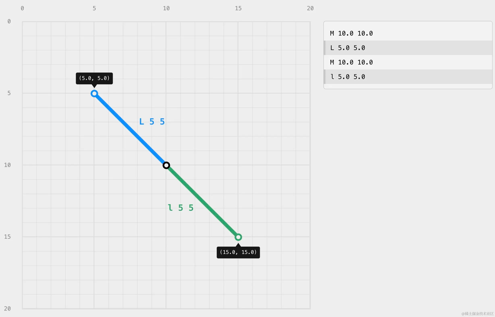

  


> Demo 地址：https://codepen.io/airen/full/ZENeRBQ

  


注意，由大写 `L` 命令绘制的线最终停在 `(5,5)` 位置，而由小写 `l` 命令绘制的线最终停在 `(15,15)` 位置。不难发现，示例中绝对命令的参数位置都是相对 `(0,0)` 坐标计算，而相对命令的参数相对于起点位置计算。

  


你可能会感到好奇，为什么 SVG 的路径命令在设计的时候会提供绝对命令和相对命令呢？这样设计的原因主要是为了提供更灵活、更方便的路径绘制方式，以满足不同的需求和工作流程。

  


-   **灵活性**：绝对命令和相对命令允许 Web 开发者以不同的方式定义路径。绝对命令直接使用绝对坐标值，使得路径的位置和形状能够准确地相对于画布或其他参考点进行定位。而相对命令则相对于当前路径的位置进行移动和绘制，更适合描述相对复杂的路径结构。
-   **简洁性**：相对命令通常比绝对命令更简洁，因为它可以相对于当前位置来指定路径的位置和形状。这种相对性质可以减少冗余的坐标值，使得路径描述更加紧凑，代码更易于理解和维护。
-   **适应性**：绝对命令和相对命令的选择取决于 Web 开发者的需求和习惯。有些情况下，绝对命令更直观、更易于掌握，特别是在需要精确控制路径位置和形状时。而在需要描述相对移动或绘制的情况下，相对命令则更加适用。

  


在实际应用中，你可以根据需要混合使用这两种类型的命令，以实现更复杂的路径绘制效果。

  


需要知道的是，在某些情景之下，例如将路径作为剪切路径或遮罩的时候，相对命令的路径将会更灵活一些。当路径所有命令都是相对的时候，移动路径就像简单地操作其初始的 `M` 命令一样，其余部分会自动调整，因为这是相对命令的全部意义。同样的，对路径的其他部分操作也是如此，剩下的部分会自动调整。这很美妙。

  


另外，在实际应用中，SVG 的绝对命令和相对命令是可以相互转换的。我们可以使用一些在线工具来对它们进行转换。例如：[SVG Path Commander](https://thednp.github.io/svg-path-commander/index.html) 就是这样的一款工具：

  


  


> URL：https://thednp.github.io/svg-path-commander/index.html

  


你也可以使用 [Convert SVG absolute clip-path to relative 工具](https://yoksel.github.io/relative-clip-path/)对路径进行转换：

  


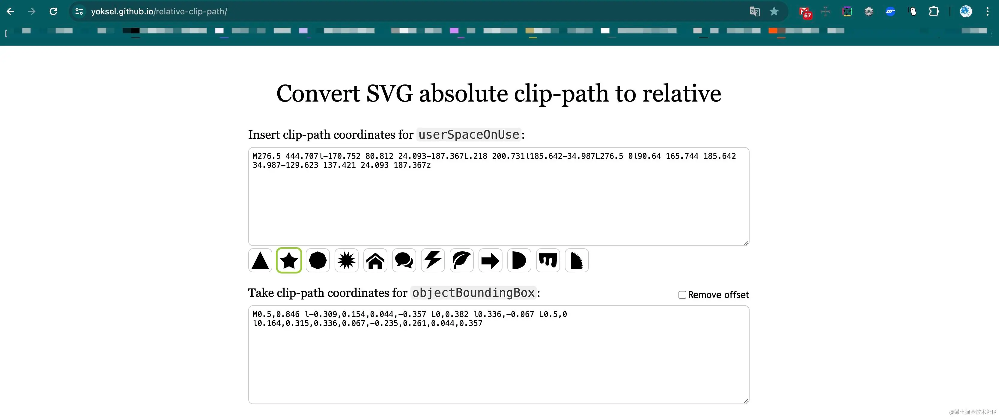

  


> URL:https://yoksel.github.io/relative-clip-path/

  


简单地小结一下：

  


-   `<path>` 元素中的 `d` 属性是一系列命令加参数
-   路径是通过按照顺序执行这些命令来绘制的
-   命令以一个单字母开，后面紧跟一个或多个数字
-   命令分绝对命令，大写字母表示的是绝对命令，小写字母表示的是相对命令，通过工具两者可以相互转换

  


关于命令的整体介绍就到这里。现在让我们深入了解不同类型的命令吧！

  


## 如何使用 SVG 路径命令

  


接下来，我们开始进入实战阶段，通过具体实例来了解如何使用 SVG 的路径命令来绘制各种形状。

  


### 光标

  


SVG 路径中的光标是一个重要概念，它代表了当前绘制的位置。在路径中，光标会随着每个路径命令的执行而移动，以确定下一个命令从何处开始绘制。光标的位置决定了路径的形状和轨迹，因此在绘制复杂图形时，正确控制光标的位置至关重要。通过移动光标，可以在 SVG 中精确地控制路径的起始点和终止点，从而绘制出各种复杂的形状和曲线。

  


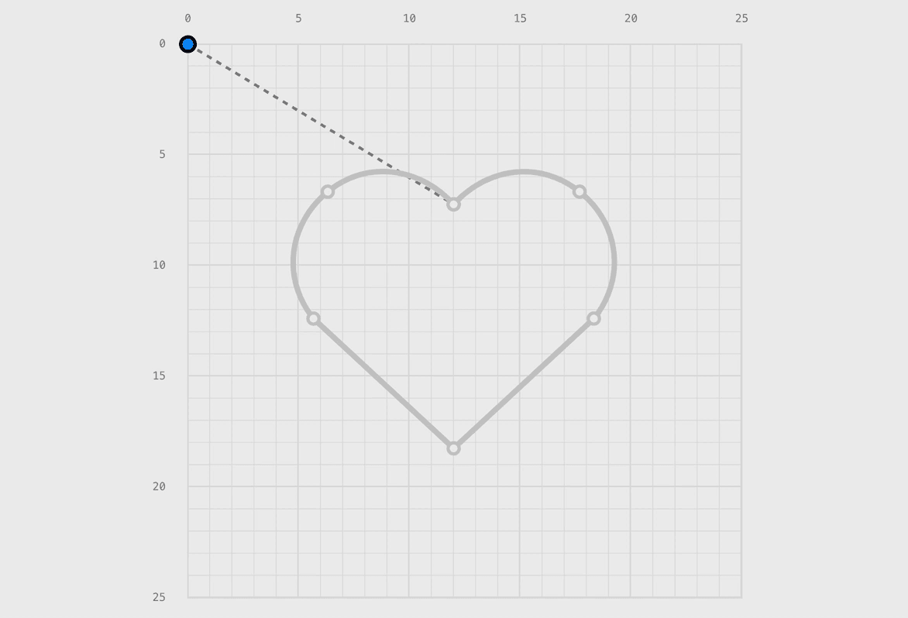

  


上图中，移动的蓝点就是 SVG 中的光标。

  


我们来看一个简单的示例：

  


```XML
<path d="
    M 5.0 5.0
    v 5.0 
    L 10.0 15.0
    h 5.0"
/>
```

  


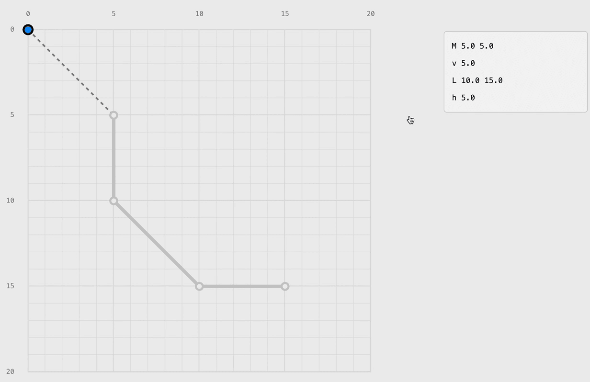

  


> Demo 地址：https://codepen.io/airen/full/bGyqjNV

  


请注意上图中移动的蓝色点（它代表的就是光标）。

  


通常情况下，光标最初的位置位于坐标原点 `(0,0)` ，然后根据 SVG 的命令来改变光标的位置。在这个示例中，光标会按照下面的命令来改变位置：

  


-   1️⃣：`M 5 5` 将光标移动到 `(5,5)` 位置
-   2️⃣：`v 5` 绘制一条长度为 `5` 的垂直线，将光标移动到 `(5, 10)` 位置。注意，`v` 是相对命令，它相对于上一个点 `(5,5)` 计算
-   3️⃣：`L 10 15` 绘制一条到 `(10, 15)` 的直线，将光标移动到 `(10,15)` 位置
-   4️⃣：`h 5` 绘制一条长度为 `5` 的水平线，将光标移动到 `(15,15)` 位置 。注意，`h` 是相对命令，它相对于上一个点 `(10, 15)` 计算

  


最初，光标位于左上角，即原点 (0, 0)。然后，这三个命令按如下方式改变光标的位置：

  


-   `M 5 5` 将光标移动到 (5, 5)；
-   `v 5` 绘制一条长度为5的垂直线，将光标移动到 (5, 10)；
-   `L 10 15` 绘制一条到 (10, 15) 的线，将光标移动到 (10, 15)；
-   `h 5` 绘制一条长度为5的水平线，将光标移动到 (15, 15)。

  


一般来说，光标会停留在当前路径“段”结束的位置。毕竟，大多数的时候，你还是希望路径中的各“段”能相互连接。

  


当前路径“段”结束位置取决于命令是绝对的还是相对的。对于绝对命令，光标将停留在命令的 `x` 和 `y` 值处。例如，上面代码中的 `L 10 15` ，不管光标当前位于何处，它会将光标移动到 `(10,15)` ：

  


```XML
<path d="
    M 5.0 5.0
    L 10.0 15.0" />
```

  


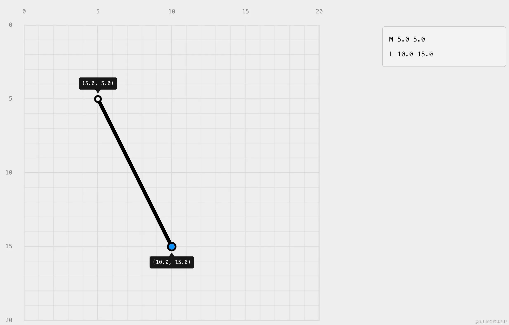

  


正如你所看到的，光标将从 `(5, 5)` 移动到 `(10, 15)`。

  


> Demo 地址：https://codepen.io/airen/full/rNgyrWJ

  


对于相对命令，光标会移动到当前光标位置加上命令的 `dx` 和 `dy` 值。例如，如果光标当前在 `(15, 5)`，那么 `l 10 15` 会将光标移动到 `(25, 20)`。

  


```XML
<path d="
    M 15.0 5.0
    l 10.0 15.0" />
```

  


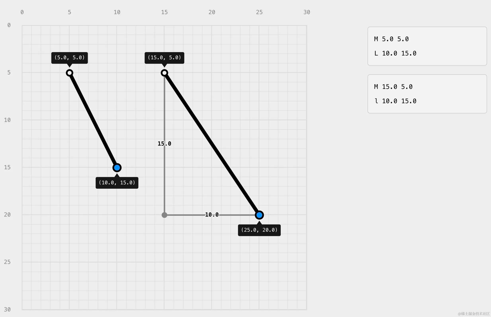

  


> Demo 地址：https://codepen.io/airen/full/VwOpBpN

  


### 移动到命令：`M` 和 `m`

  


SVG 移动到命令 `M` 和 `m` 是一个特殊的命令，它只移动光标不绘制任何东西。例如你在 Figma 图形编辑器，使用钢笔工具时，你可以将光标在画布中任意移动：

  


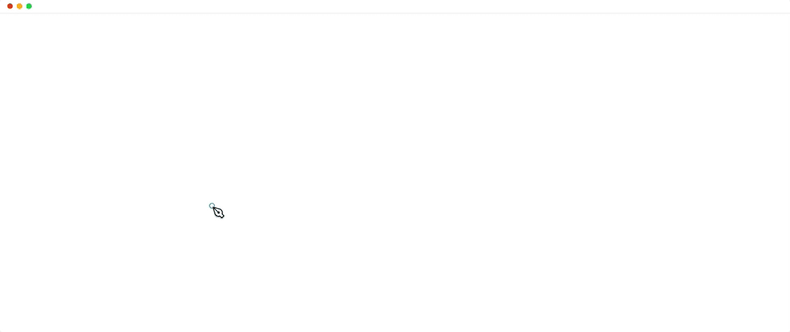

移动到命令的语法格式如下：

  


```
绝对命令  👉  M <x> <y>
相对命令  👉  m <dx> <dy>
```

  


-   **绝对命令** **`M x y`** ：将光标移动到指定的绝对坐标位置 `(x,y)` ，例如， `M 100 100` 命令将光标移动到 `(100,100)` 位置
-   **相对命令** **`m dx dy`** ：将光标移动到相对于当前光标位置的偏移位置，即 `(x + dx, y + dy)` ，例如 `M 50 50 m 10 20` ，其中 `m 10 20` 命令将光标移动到 `(60, 70)` 位置。

  


需要知道的是，SVG 的所有路径必须以 `M` 或 `m` 命令开始，以确定初始光标位置，而且在同一次路径的定义中，可以多次使用 `M` 或 `m` 命令来重新定位光标位置。

  


还有，`M` 和 `m` 命令后可以跟随多个数字，例如 `M x1 y1 x2 y2 ...` 或 `m dx1 dy1 dx2 dy2 ...` 。此时，它会被解释为额外的直线到命令 `L` 或 `l` 。这意味着以下命令：

  


```XML
<path d="M 10 10 20 20 30 30" />
```

  


实际上等于同：

  


```XML
<path d="M 10 10 L 20 20 L 30 30" />
```

  


另外，如果命令参数数量不对，浏览器会忽略出错后的部分，只绘制到错误发生前的部分。这有助于调试路径命令。

  


当你想绘制不相连的路径时，移动到命令 `M` 和 `m` 就非常有用。例如：

  


```XML
<path d="
    M 3.0 5.5
    q 2.0 2.0 0.0 4.0
    m 3.0 -6.0
    q 4.0 4.0 0.0 8.0
    m 3.0 -10.0
    q 4.0 6.0 0.0 12.0"
/>
```

  


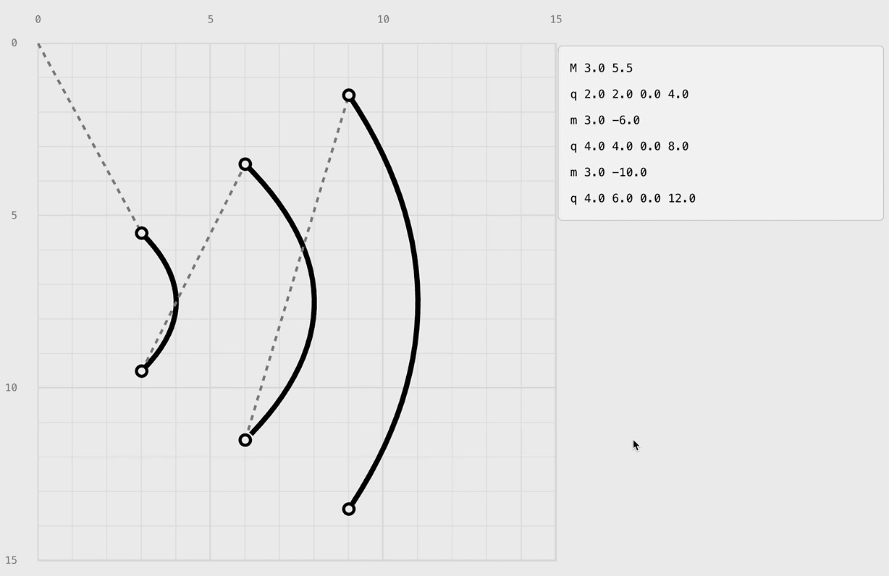

  


> Demo 地址：https://codepen.io/airen/full/RwmpBJN

  


通过掌握 `M` 和 `m` 命令，你可以精确地控制 SVG 路径的起始位置及其后续的路径绘制。请尝试着，使用 `M` 和 `m` 命令，将光标移动到下图中黑圆圈所示位置：

  


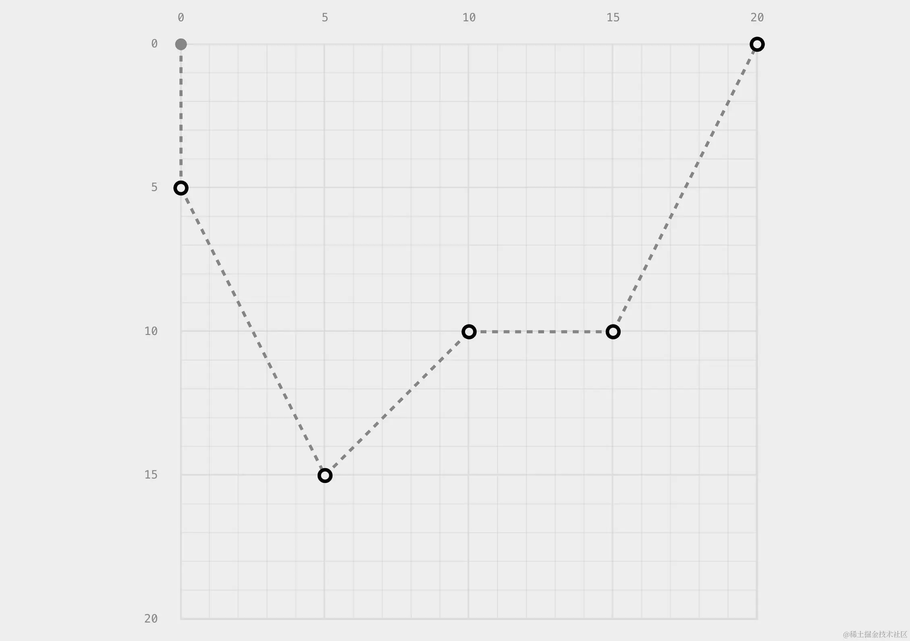

  


### 直线命令：`L` 、`l` 、`H` 、`h` 、`V` 和 `v`

  


现在，我们知道在画布是怎么通过 `M` 或 `m` 命令将光标移动到所需要的位置。接下来，我们开始使用路径的命令来绘制图形。先从最简单的直线开始。

  


众所周知，任意两点相连就能构成一条直线，例如点 `P1` 和 `P2` 相连就构建了一条直线：

  


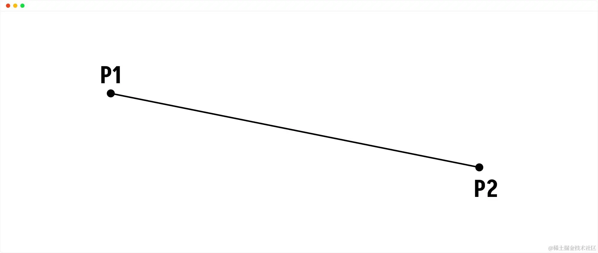

  


假设 `P1` 点的坐标是 `(5,5)`，`P2` 点的坐标是 `(15,10)` 。现在，我们需要使用路径命令来绘制这条直线。

  


首先，使用 `M` 或 `m` 命令将光标移动到 `P1` 点：

  


```XML
<path d="
    M 5 5
" />
```

  


注意，`M` 命令只是移动光标，它不会绘制任何内容，所以在画布上看不到任何图形。但是，为了更好的向大家展示，`M 5 5` 已将光标移动到了 `P1` 点位置，我使用其他元素在画布中将其标注出来了。我要强调的是，`<path d="M 5 5" />` 并不会在画布上显示。

  


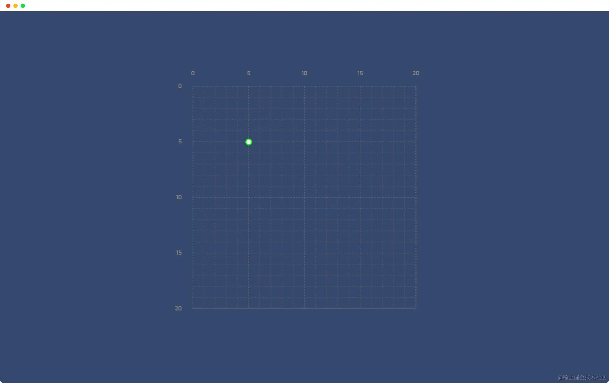

  


要想通过路径绘制出直线，还是需要使用直线命令，它可以绘制从当前位置（`P1`）到指定位置（`P2` ）的直线。直线命令包括 `L` （`l`）、`H` （`h`）和 `V` （`v`）。

  


-   `L x y` ：从当前光标位置绘制一条直线到指定的绝对坐标位置
-   `H x` ：从当前光标位置绘制一条水平线到指定的 `x` 坐标位置
-   `V y` ：从当前光标位置绘制一条垂直线到指定的 `y` 坐标位置
-   `l dx dy` ：从当前光标位置绘制一条直线到相对于当前光标位置的偏移位置
-   `h dx` ：从当前光标位置绘制一条水平线到相对于当前光标位置的 `x` 坐标偏移位置
-   `v dy` ：从当前光标位置绘制一条垂直线到相对于当前光标位置的 `y` 坐标偏移位置

  


其中最通用的是 `L` 命令，它将一条直线绘制到特定的 `(x,y)` 坐标。例如，上面未绘制完成的示例，现在可以使用 `L` 命令，绘制 `P1` 点到 `P2` 点之间的直线：

  


```XML
<path d="
    M 5 5
    L 15 10" />
```

  


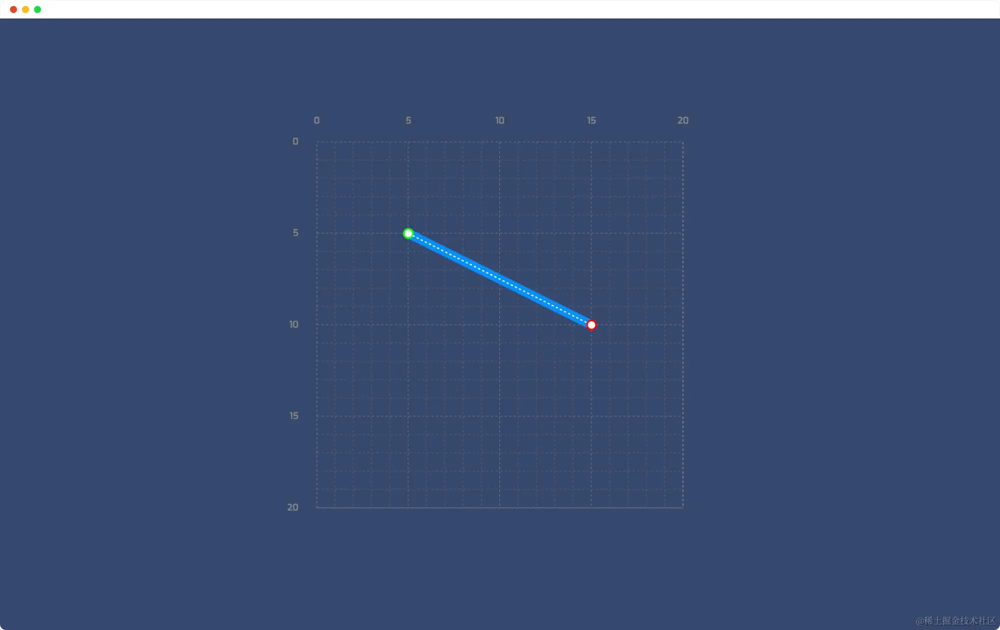

  


> Demo 地址：https://codepen.io/airen/full/XWwMBwo

  


就像 `m` 命令相对于当前位置移动光标一样，我们也可以使用小写字母 `l` 命令绘制出 `P1P2` 相连的直线，只不过 `l` 命令绘制一条相当于当前光标位置的直线：

  


```XML
<!-- 绝对命令 -->
<path d="
    M 5 5
    L 15 10" stoke="rgb(0 145 255) " />
    
<!-- 相对命令绘制 -->
<path d="
    M 5 5
    l 10 5" stoke="rgb(10 145 255 / .5) " />
    
```

  


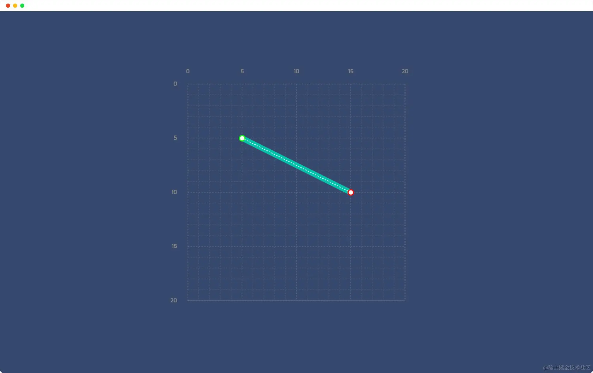

  


你会发现，这个时候两条直线完全重叠在一起。注意，上面代码中的 `l 10 5` 是一个相对命令，它相对于 `M 5 5` 来计算 `P2` 点的位置，即 `x' = x + dx = 10 + 5` ，`y' = y + dy = 5 + 5` 。

  


如果使用 `l` 命令绘制直线时，后面紧跟的参数不改变的话，它将绘制出另一条直线：

  


```XML
<!-- 绝对命令 -->
<path d="
    M 5 5
    L 15 10" stoke="rgb(0 145 255) " />
    
<!-- 相对命令绘制 -->
<path d="
    M 5 5
    l 15 10" stoke="rgb(10 145 255 / .5) " />
```

  


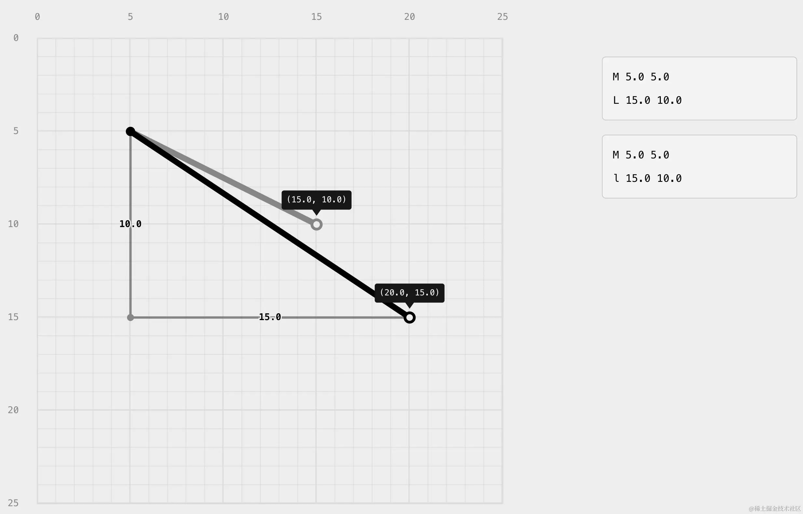

  


> Demo 地址：https://codepen.io/airen/full/wvbJEJp

  


你可以使用 `H` 和 `V` 命令在特定方向上绘制直线。`H` 绘制水平线，而 `V` 绘制垂直线：

  


```XML
<path d="
    M 13.0 5.0
    h -6.0
    V 15.0
    H 13.0
    M 7.0 10.0
    h 4.0" />
```

  


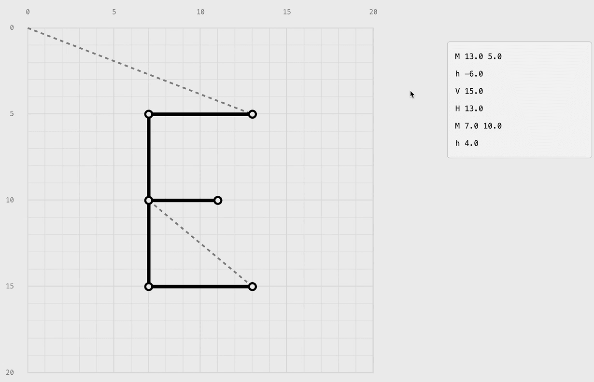

  


> Demo 地址：https://codepen.io/airen/full/NWVpLgM

  


上面示例仅仅是展示了如何使用直线命令来绘制直线。

  


你也可以在同一条路径中组合使用多个直线命令和其他路径命令来绘制复杂的图形。例如下面的示例，我们使用多个移动命令和直线命令绘制了几个我们常用的 Icon 图标。例如，“汉堡图标”、剪头图标、关闭图标等：

  


```XML
<path d="
    M 5 5 h 7
    M 5 8 h 7
    M 5 11 h 7" fill="none" stroke="#fff" stroke-width="1" stroke-linecap="round" stroke-linejoin="round" />

<path d="
    M 20 5 
    l 4 6 
    l 4 -6" fill="none" stroke="#fff" stroke-width="1" stroke-linecap="round" stroke-linejoin="round" />

<path d="
    M 36 11 
    l 4 -6 
    l 4 6" fill="none" stroke="#fff" stroke-width="1" stroke-linecap="round" stroke-linejoin="round" />

<path d="
    M 5 20 
    l 7 3 
    l -7 3" fill="none" stroke="#fff" stroke-width="1" stroke-linecap="round" stroke-linejoin="round" />

<path d="
    M 27 20 
    l -7 3 
    l 7 3" fill="none" stroke="#fff" stroke-width="1" stroke-linecap="round" stroke-linejoin="round" />
    
<path d="
    M 37 20 
    l 6 6 M 43 20 
    l -6 6" fill="none" stroke="#fff" stroke-width="1" stroke-linecap="round" stroke-linejoin="round" />
    
<path d="
    M 5 40 
    L 20 40 
    L 15 35 
    M 20 40 L 15 45" fill="none" stroke="#fff" stroke-width="1" stroke-linecap="round" stroke-linejoin="round" />

<path d="
    M 45 40 
    h -12 
    l 5 -5 
    m -5 5 
    l 5 5 " fill="none" stroke="#fff" stroke-width="1" stroke-linecap="round" stroke-linejoin="round" />
```

  


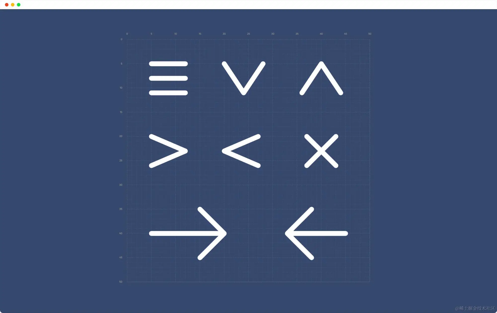

  


正如你所看到的，我们使用简单的几个命令就可以绘制出常见的一些图标。它与一些平台的的 SVG 图标相比，数据要简单的多，以“汉堡图标”为例，大多数平台导出来 SVG 代码如下：

  


```XML
<svg xmlns="http://www.w3.org/2000/svg" viewBox="0 0 448 512">
    <path d="M0 96C0 78.3 14.3 64 32 64H416c17.7 0 32 14.3 32 32s-14.3 32-32 32H32C14.3 128 0 113.7 0 96zM0 256c0-17.7 14.3-32 32-32H416c17.7 0 32 14.3 32 32s-14.3 32-32 32H32c-17.7 0-32-14.3-32-32zM448 416c0 17.7-14.3 32-32 32H32c-17.7 0-32-14.3-32-32s14.3-32 32-32H416c17.7 0 32 14.3 32 32z"/>
</svg>
```

  


对比一下，自己使用路径命令绘制的汉堡图标：

  


```XML
<svg>
    <path d="M 5 5 h 7 M 5 8 h 7 M 5 11 h 7" />
</svg>    
```

  


我想你现在应该知道如何使用直线命令了。想象一下，你现在可以使用已熟悉的直线命令，绘制出直线（`<line>`）、矩形（`<rect>`）、折线（`<polyline>`）和多边形（`<polygon>`）等元素可绘制的任何形状。

  


### 关闭命令：`Z` 和 `z`

  


在 SVG 路径命令中，关闭命令用于将当前路径的终点与起点连接起来，从而形成一个闭合的图形。这个命令在绘制多边形、封闭曲线等形状时非常有用。关闭命令有两种形式：`Z` 和 `z`，它们的功能是相同的，都是将路径闭合。有趣的是，由于它不接受任何参数，所以在功能上 `Z` 和 `z` 没有区别。

  


如果我告诉你，关闭命令是最后一种线条命令，你是不是会感到很惊讶，它怎么就变成一种线条命令了呢？原因很简单，因为关闭路径的主要功能是将一条直线从当前光标位置绘制到路径的起点，从而使路径成为一个闭合的形状。

  


例如，假设你正在使用 `<path>` 来绘制一个三角形。你可能会使用直线命令，你可能会使用直线命令绘制三条直线拼接而成。例如：

  


```XML
<path d="
    M 10.0 5.0 
    l -5.0 10.0 
    h 10.0 
    l -5.0 -10.0" />
```

  


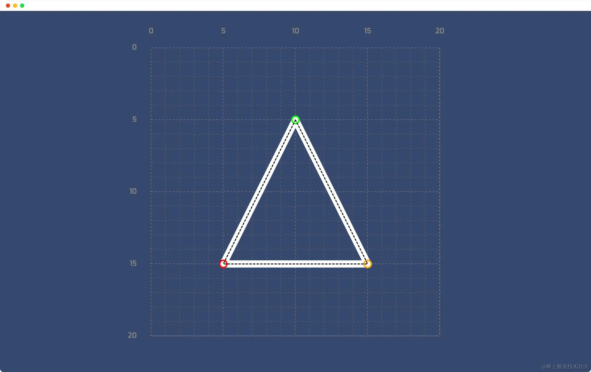

  


> Demo 地址：https://codepen.io/airen/full/pomexLj

  


事实上，对于三角形而言，我们只需要绘制两条直线，然后通过使用 `Z` 命令来自动关闭路径，它会从光标当前位置与路径起点连接起来成为一条直线，而不是像上面代码那样，显式地使用一条直线命令来关闭形状：

  


```XML
<path d="
    M 10.0 5.0
    l -5.0 10.0
    h 10.0
    Z" />
```

  


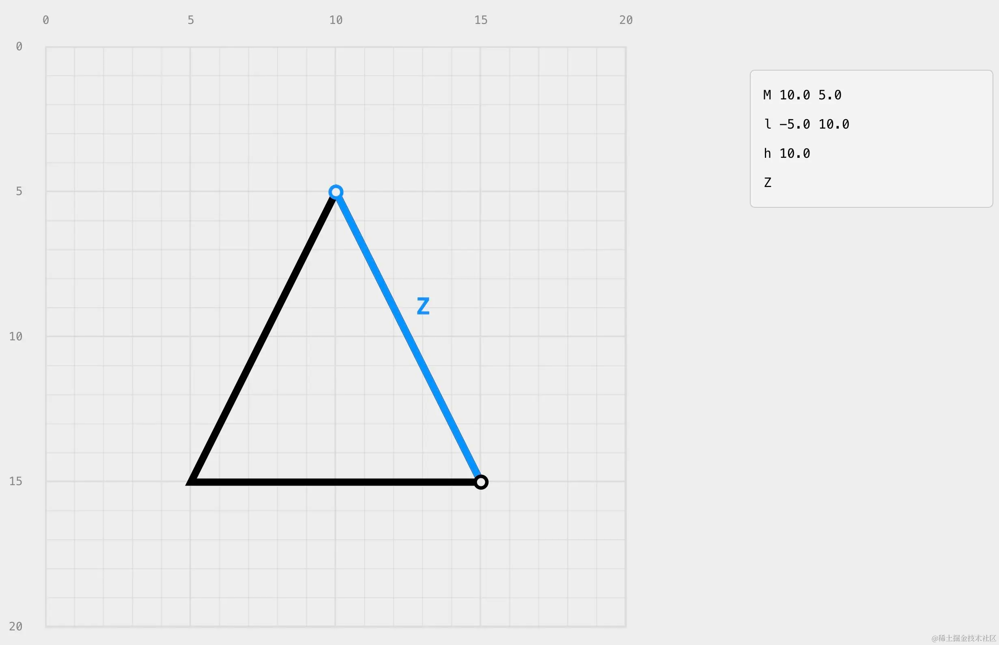

  


> Demo 地址：https://codepen.io/airen/full/YzbZJRJ

  


有趣的是，即使光标已经回到路径的起点位置，关闭命令也会“关闭”路径。例如下面这个“心形”图形：

  


```XML
<path d="
    M 11.995 7.23319
    C 10.5455 5.60999 8.12832 5.17335 6.31215 6.65972
    C 4.4959 8.14609 4.2403 10.6312 5.66654 12.3892
    L 11.995 18.25
    L 18.3235 12.3892
    C 19.7498 10.6312 19.5253 8.13046 17.6779 6.65972
    C 15.8305 5.18899 13.4446 5.60999 11.995 7.23319" />
```

  


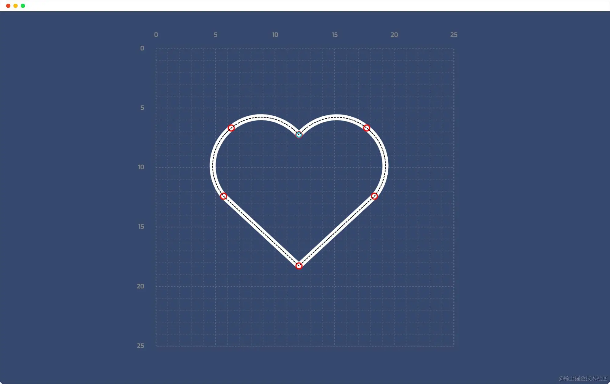

  


> Demo 地址：https://codepen.io/airen/full/pomexGb

  


请注意，在上面这个示例中，心形开始位置（红色光标点）和结束点位置（蓝色光标点）在同一个位置。这是否意味着，不需要使用关闭命令 `Z` 来关闭图形呢？

  


请仔细观察，这个心形图形有一个小小的问题，如果我们将心形图形放大，很容易发现起点和结束曲线相交的地方有一个小小的缺口：

  


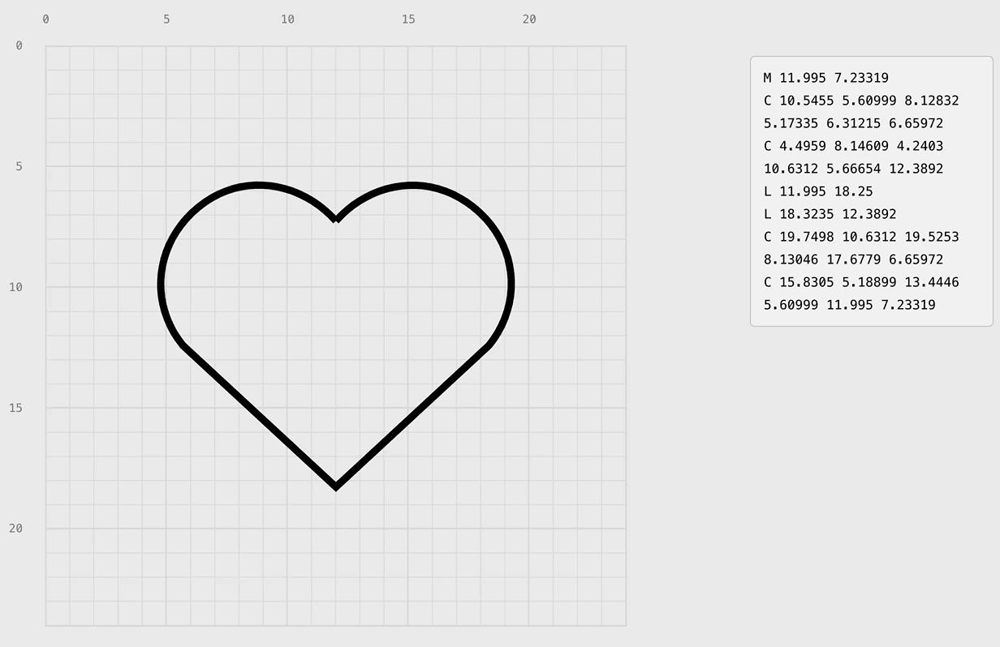

  


我们可能通过在路径的末尾添加 `Z` 命令来关闭图形，使这个点起来更平滑：

  


```XML
<path d="
    M 11.995 7.23319
    C 10.5455 5.60999 8.12832 5.17335 6.31215 6.65972
    C 4.4959 8.14609 4.2403 10.6312 5.66654 12.3892
    L 11.995 18.25
    L 18.3235 12.3892
    C 19.7498 10.6312 19.5253 8.13046 17.6779 6.65972
    C 15.8305 5.18899 13.4446 5.60999 11.995 7.23319
    Z" />
```

  


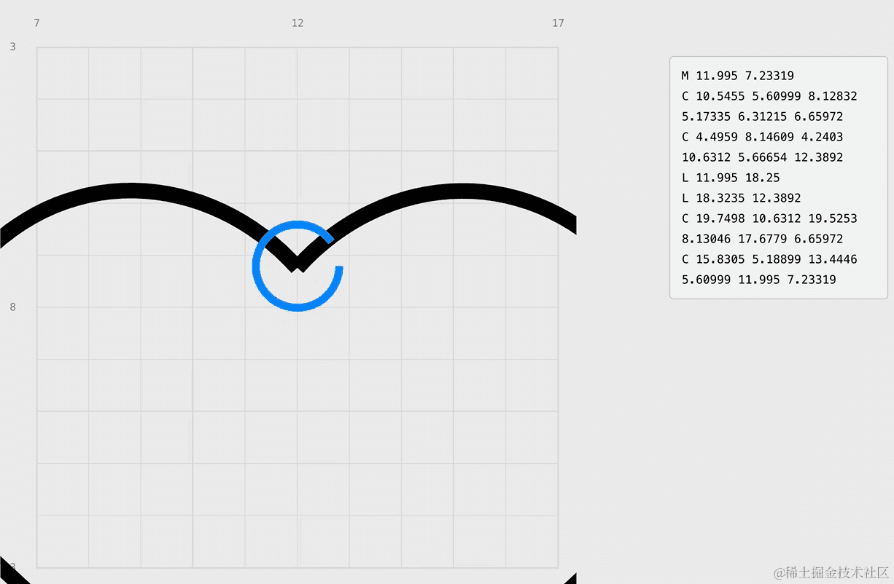

  


> Demo 地址：https://codepen.io/airen/full/GRaWwKa

  


注意，尽管这里使用了 `Z` 命令，但并不会添加新的线条（起点和终点都在同一个点），但它会告诉浏览器路径是“闭合的”，从而使其能够正确的绘制路径。

  


### 曲线命令

  


SVG 路径真正的威力在于能够绘制复杂的曲线。使用 SVG 路径可以绘制三种类型的曲线：二次贝塞尔曲线、三次贝塞尔曲线和弧线。

  


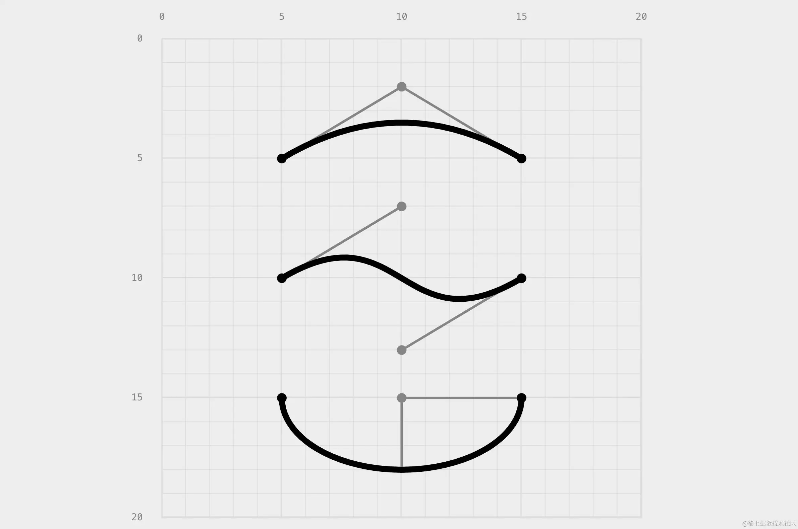

  


上图从上往下依次对应的是 SVG 路径绘制的二次贝塞尔曲线、三次贝塞尔曲线和弧线。

  


SVG 路径分别为这三种曲线提供了不同的命令：

  


-   绘制二次贝塞尔曲线的路径命令有 `Q` （`q`）和 `T` （`t`）
-   绘制三次贝塞尔曲线的路径命令有 `C` （`c`）和 `S` （`s`）
-   绘制弧线的路径命令有 `A` 和 `a`

  


我们将把这些讨论分为三部分，先从二次贝塞尔曲线开始。但是在开始之前，有必要向大家介绍一下贝塞尔曲线。

  


#### 贝塞尔曲线的基本原理

  


  


众所周知，直线只由起点（`P1`）和终点（`P2`）定义，但贝塞尔曲线除了起点和终点之外，还由一个或多个控制点定义。贝塞尔曲线方程的次数或最高指数决定了控制点的数量。顾名思义，二次贝塞尔曲线的次数为 `2` （共 `3` 点，即起点、终点和控制点），三次贝塞尔曲线的次数为 `3` （共 `4` 个点，即起点、终点和两个控制点）。

  


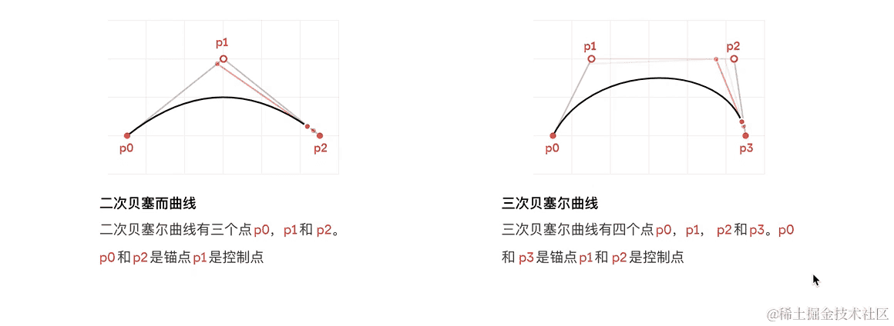

  


在连接的贝塞尔曲线中，通常会有两个手柄从一个控制点延伸出来。这些手柄可以精确控制曲线的方向。贝塞尔手柄的角度和长度可以是镜像的、不对称的，甚至是断开的，用来定义所需的形状。每种模式都会导致连接点的不同行为。诸如 Sketch 和 Figma 等设计工具提供了在这些手柄模式之间切换的灵活性，使用户能够快速创建更复杂的形状和图案。

  


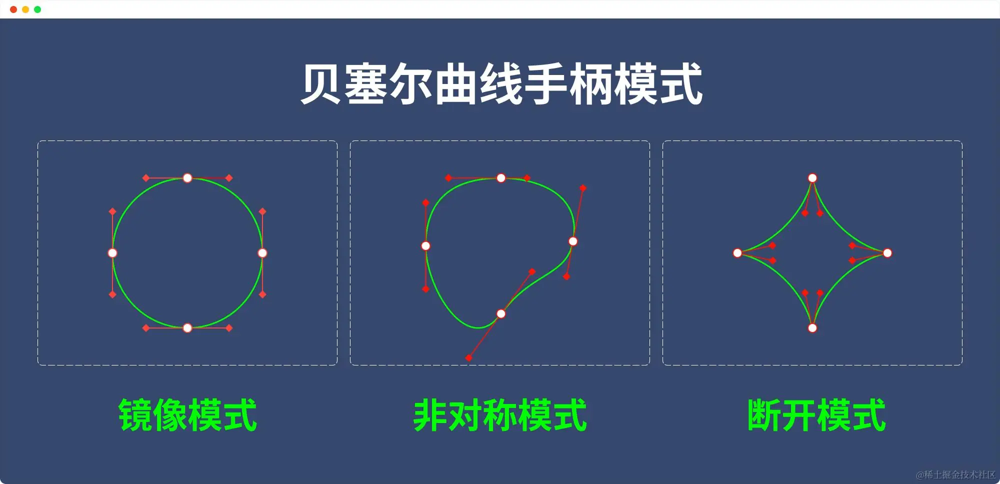

  


-   当手柄是镜像模式时，其角度和长度始终是对称的，这样可以使连接的曲线在大多数情况下保持平滑
-   当手柄是非对称模式时，手柄的角度保持不变，但长度可以变化，从而允许创建更具动态的形状
-   当手柄是断开模式时，手柄可以独立移动，从而在创建复杂曲线和形状时提供更大的灵活性和精确度

  


另外，贝塞尔曲线上的控制点越多，曲线就越复杂。

  


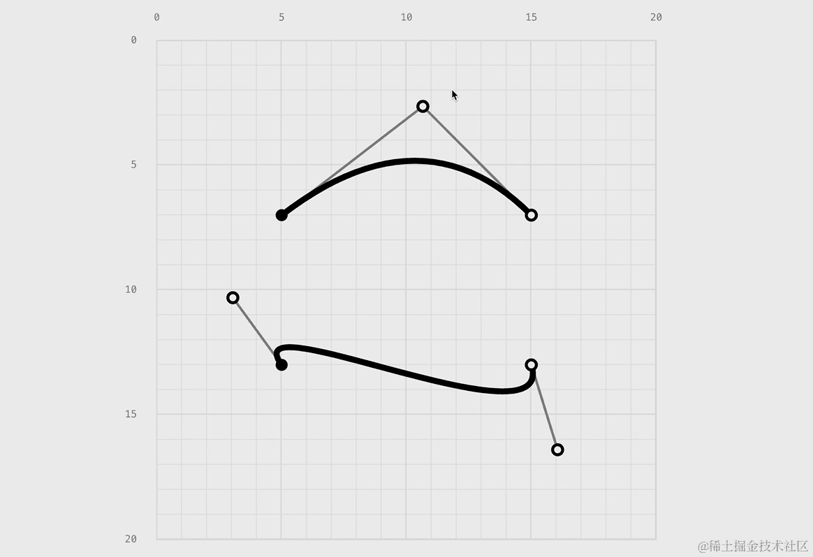

  


正如你所看到的，三次贝塞尔曲线（上图中下方的曲线）相比于二次贝塞尔曲线（上图中上方的曲线），在形状上有更多的自由度。

  


我觉得你现在对贝塞尔曲线已经有了一些了解，但其实贝塞尔曲线背后有一整套严谨的数学原理支撑着。在这里，我会尽量以简单的方式解释这些数学原理，让大家对贝塞尔曲线的工作方式有一个更全面、更深入的理解，为接下来学习 SVG 路径命令中的贝塞尔曲线打下基础。

  


之前我们提到过，贝塞尔曲线是由一组控制点定义的曲线。我们可以从最简单的形式开始探索贝塞尔曲线，以理解这些“控制点”的作用，然后逐渐深入，了解更复杂的三次贝塞尔曲线。

  


我们考虑两个不同的点 `P0` 和 `P1` ，以及另一个位于它们之间的点 `P` 。在这种情况下，`P0` 和 `P1` 是曲线的控制点，而 `P` 是在它们之间移动的点。我们可以用一个介于 `0` 和 `1` 之间的值 `t` 来定义 `P` 的位置，类似于百分比：

  


-   如果 `t = 1` ，`P` 将移动到 `P1`
-   如果 `t = 0` ，`P` 将移动到 `P0`
-   介于 `0` 和 `1` 之间的任何值都将是 `P0` 和 `P1` 的“混合”

  


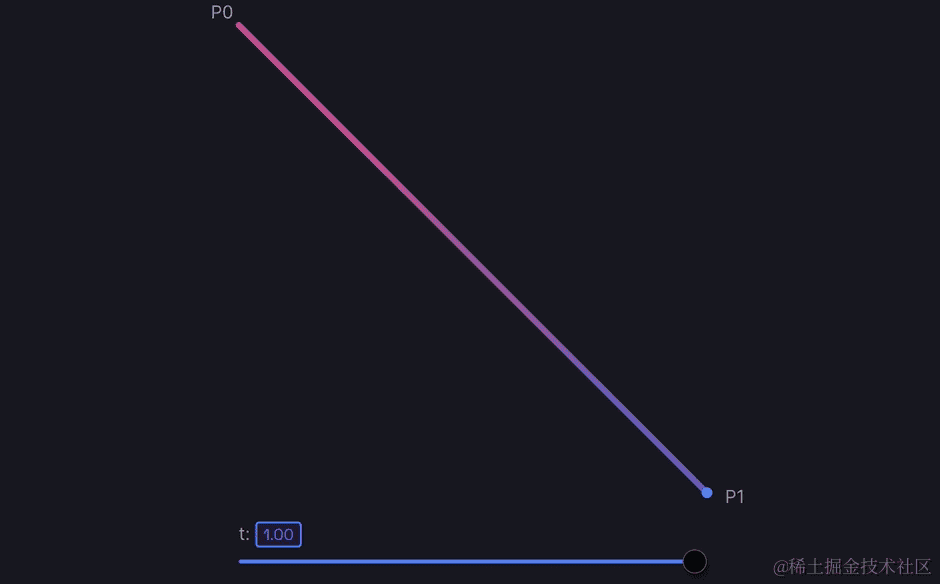

  


如上图所示，其中 `P0` 和 `P1` 位于曲线的两端，而 `P` 是在它们之间移动的蓝点。你会看到 `t` 越接近 `1` ，`P` 距离曲线的末端（`P1`）就越近。

  


这被称为“线性插值”。在线性插值的情况下，我们可以使用下面这个公式计算出 `P` 的位置：

  


```
P = (1 - t) × P0 + t × P1
```

  


你可以尝试将 `t` 替换为 `0` 或 `1` ，其计算出来的结果将会与上面描述的结果一样：

  


```
t = 0
P = (1 - t) × P0 + t × P1 = (1 - 0) × P0 + 0 × P1 = P0 👉 P 移动到 P0

t = 1
P = (1 - t) × P0 + t × P1 = (1 - 1) × P0 + 1 × P1 = P1 👉 P 移动到 P1
```

  


现在，我们再添加一个点 `P2` ！这样就可以有两个插值点，分别在每个线段之间移动，即分别沿着 `P0 👉 P1` 和 `P1 👉 P2` 移动。如果我们用一条线段连接这两个点（下图中红色点），并在其上也放置一个插值（蓝色点），我们将得到一些非常有趣的东西：

  


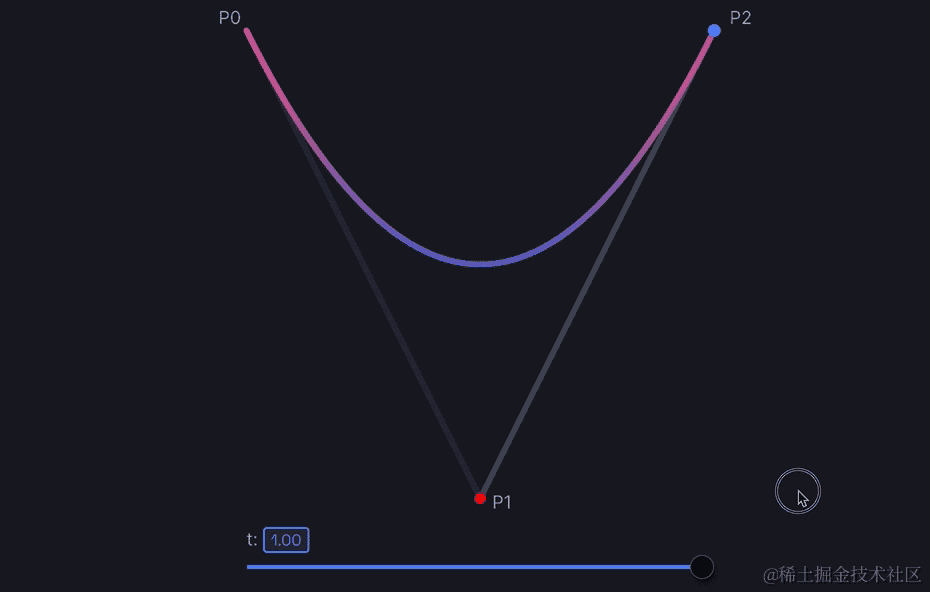

  


你会看到蓝点沿着一条类似曲线的路径移动。这个特定的路径称为二次贝塞尔曲线。我们可以通过一些数学知识，推导出给定时间 `t` 时蓝点位置的方程式。

  


首先，我们使用上面的公式分解红点的位置。这两个红点的位置可以被描述为两个不同的线性插值：

  


```
A = (1 - t) × P0 + t × P1
B = (1 - t) × P1 + t × P2
```

  


我们也可以描述蓝点的位置，但这次是在点 `A` 和点 `B` 之间进行线性插值：

  


```
P = (1 - t) × A + t × B
```

  


然后，我们替换 `A` 和 `B` ：

  


```
P = (1 - t) × ((1 - t) × P0 + t × P1) + t × ((1 - t) × P1 + t × P2)
  = (1 - t) × (1 - t) × P0 + (1 - t) × t × P1 + t × (1 - t) × P1 + t × t × P2
```

  


我们将得到二次贝塞尔曲线的公式：

  


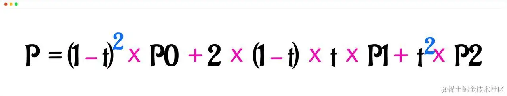

  


基于上面这个公式，我们可以编写 JavaScript 脚本来获取蓝点移动时每个位置的 `x` 和 `y` 坐标值，并以每秒 `60` 帧的速度在 `1s` 内绘制出上面的曲线：

  


```JavaScript
const quadratic = (P0, P1, P2) => {
    const x0 = P0.x;
    const y0 = P0.y;
    const x1 = P1.x;
    const y1 = P1.y;
    const x2 = P2.x;
    const y2 = P2.y;

    const x = (t) => Math.pow(1 - t, 2) * x0 + 2 * (1 - t) * t * x1 + Math.pow(t, 2) * x2;
    const y = (t) => Math.pow(1 - t, 2) * y0 + 2 * (1 - t) * t * y1 + Math.pow(t, 2) * y2;
  
    const res = [];

    // 以每秒 60 帧持续 15 秒的速度获得所有的过渡点
    for (let t = 0; t <= 1; t = t + 1 / 60) {
        const valX = x(t);
        const valY = y(t);
        
        res.push({ 
            x: valX, 
            y: valY 
        });
    }

    res.push({ x: 1, y: 0 });

    return res;
};
```

  


接着再添加第四个点。此时，我们有四个控制点，它们分别是 `P0` 、`P1` 、`P2` 和 `P3` ，这样我们就可以按照前面的过程来添加插值点。

  


-   首先在连接四个点的每一段线（即 `P0 👉 P1` 、`P1 👉 P2` 和 `P2 👉 P3`）之间添加一个插值点（如下图中的红点所示）。
-   然后将三个红点（插值点）连接起来，将会得到两条新线段，并在新获得的每个线段上定义一个新的插值点（如下图中的绿点所示）。
-   按同样的方式，再次连接绿点，将得到一条新线段，并在该线段上定义一个新的插值点（如下图中蓝点所示）：

  


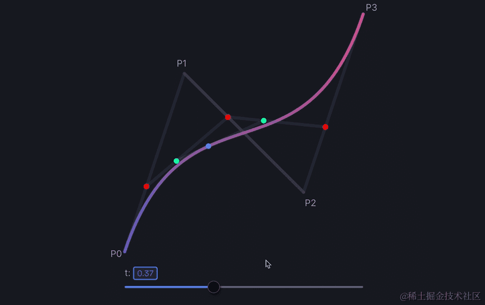

  


图中的三个红点的位置可以被描述为三个不同的线性插值：

  


```
A = (1 - t) × P0 + t × P1
B = (1 - t) × P1 + t × P2
C = (1 - t) × P2 + t × P3
```

  


我们可以使用 `A` 、`B` 和 `C` 来描述图中绿点的插值 `D` 和 `E` ：

  


```
D = (1 - t) × A + t × B
E = (1 - t) × B + t × C
```

  


再使用 `D` 和 `E` 来描述蓝点：

  


```
P = (1 - t) × D + t × E
```

  


将上面公式中的 `D` 和 `E` 替换成 `A` 、`B` 和 `C` ：

  


```
P = (1 - t) × ((1 - t) × A + t × B) + t × ((1 - t) × B + t × C)
  = (1 - t) × (1 - t) × A + (1 - t) × t × B) + t × (1 - t) × B + t × t × C
  = (1 - t) × (1 - t) × A  + 2 × (1 - t) × t × B + t × t × C
```

  


继续将 `A` 、`B` 和 `C` 替换掉：

  


```
P = (1 - t) × (1 - t) × ((1 - t) × P0 + t × P1)  + 2 × (1 - t) × t × ((1 - t) × P1 + t × P2) + t × t × ((1 - t) × P2 + t × P3)
  = (1 - t) × (1 - t) × (1 - t) × P0 + (1 - t) × (1 - t) × t × P1 + 2 × (1 - t) × t × (1 - t) × P1 + 2 × ( 1 - t) × t × t × P2 + t × t × (1 - t) × P2 + t × t × t × P3
  = (1 - t) × (1 - t) × (1 - t) × P0 + 3 × (1 - t) × (1 - t) × t × P1 + 3 × (1 - t) × t × t × P2 + t × t × t × P3
```

  


这样就获得三次贝塞尔曲线的计算公式：

  


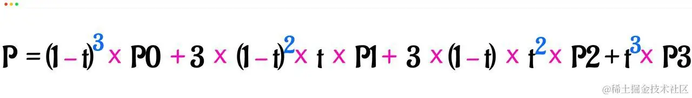

  


和二次贝塞尔曲线一样，使用 JavaScript 可以获取三次贝塞尔曲线上蓝点位置移动时每个点的 `x` 和 `y` 坐标，并以每秒 `60` 帧的速度在 `1s` 内绘制出上面的曲线：

  


```JavaScript
const cubic = (P0, P1, P2, P3) => {
    const x0 = P0.x;
    const y0 = P0.y;
    const x1 = P1.x;
    const y1 = P1.y;
    const x2 = P2.x;
    const y2 = P2.y;
    const x3 = P3.x;
    const y3 = P3.y;

    const y = (t) => Math.pow(1 - t, 3) * y0 + 3 * Math.pow(1 - t, 2) * t * y1 + 3 * (1 - t) * Math.pow(t, 2) * y2 + Math.pow(t, 3) * y3;
    const x = (t) => Math.pow(1 - t, 3) * x0 + 3 * Math.pow(1 - t, 2) * t * x1 + 3 * (1 - t) * Math.pow(t, 2) * x2 + Math.pow(t, 3) * x3;

    const res = [];
  
    for (let t = 0; t <= 1; t = t + 1 / 60) {
        const valX = x(t);
        const valY = y(t);
        res.push({ x: valX, y: valY });
    }
  
    res.push({ x: 1, y: 0 });
    return res;
};
```

  


这就是贝塞尔曲线背后的数学原理。

  


> 注意，贝塞尔曲线是 Web 前端必须掌握的一个技术点。它不仅仅用于 SVG 路径命令中，它还用于 Web 动画的缓动函数中。这里仅介绍了贝塞尔曲线最基础的部分，人个强烈建议你花点时间阅读《[Bezier Curves from the Ground Up](https://jamie-wong.com/post/bezier-curves/)》、《[A Primer on Bézier Curves](https://pomax.github.io/bezierinfo/)》和《[Bézier curve](https://en.wikipedia.org/wiki/B%C3%A9zier_curve)》，进一步深入的理解贝塞尔曲线相关的知识，这有助于你更好的应用于构建丰富的交互式组件，打开创造性的可能，激发你创作出更多有趣和丰富的作品。

  


现在，我们把注意力重新拉回到 SVG 的路径命令中来。

  


#### 二次贝塞尔曲线命令：`Q` （`q`）和 `T` （`t`）

  


虽然三次贝塞尔曲线更灵活，但二次贝塞尔曲线更容易书写，因此在不需要额外形状时更可取。SVG 路径命令中的二次贝塞尔曲线命令使用 `Q` 和 `q` 表示。它允许在 SVG 路径中绘制二次贝塞尔曲线，这种曲线由两个点控制，一个是控制点，另一个是结束点。其中控制点用来确定起点和终点的曲线斜率。因此，它需要两组参数，控制点和终点坐标：

  


```
Q controlX controlY endX endY
```

  


-   `controlX` 和 `controlY` 是控制点的绝对坐标
-   `endX` 和 `endY` 是二次贝塞尔曲线的结束点的绝对坐标

  


注意，在这里你可能会感到疑惑。二次贝塞尔曲线不是由三个点：起点（`P0`）、终点（`P2`）和控制点（`P1`）组成吗？怎么这里就变成由两个点控制呢？其实很简单，在 SVG 路径中，使用二次贝塞尔命令绘制曲线时，起点是由 `M` 或 `m` 命令决定，二次贝塞尔曲线则是由控制点 `(controlX, controlY)` 和终点 `(endX,endY)` 来控制。

  


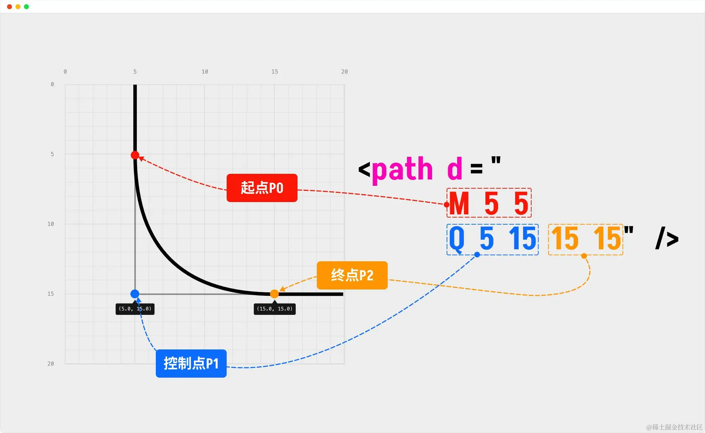

  


当你改变 `Q` 命令控制点和终点位置时，将得到不同形状的曲线：

  


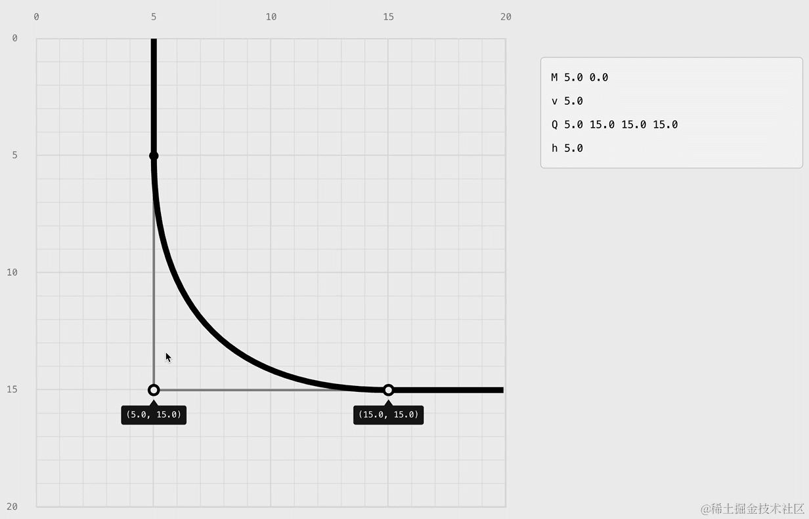

  


我们来看一个简单的示例，使用二次贝塞尔命令创建一个圆角：

  


```XML
<path d="
    M 5.0 0.0
    v 5.0
    Q 5.0 15.0 15.0 15.0
    h 5.0" />
```

  


简单解释一下上面的代码：

  


-   1️⃣：`M 5.0 0.0` 将光标移动到 `(5.0,0.0)` 位置
-   2️⃣：`v 5.0` 绘制一条垂直直线到 `(5.0,5.0)` 位置，该点也是二次贝塞尔曲线的起点位置
-   3️⃣：`Q 5.0 15.0 15.0 15.0` 绘制一条曲线，其中控制点位置是 `(5.0, 15.0)` ，终点位置是 `(15.0, 15.0)` 。这条二次贝塞尔曲线的起点 `P0 = (5.0,5.0)` 、控制点 `P1 =(5.0,15.0)` 和终点 `P2=(15.0,15.0)`
-   4️⃣：`h 5.0` 绘制一条水平直线到 `(20.0, 15.0)` 位置

  


最终绘制的图形如下图所示：

  


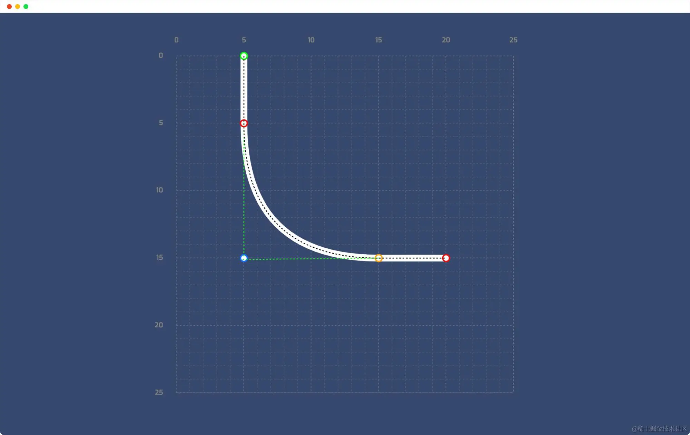

  


> Demo 地址：https://codepen.io/airen/full/OJYprYE

  


掌握了这个命令之后，就可以使用它来绘制内凹角：

  


```XML
<<path d="
    M 5.0 8.0
    v 9.0
    q 3 0 3 3
    h 9.0 
    q 0 -3 3 -3 
    v -9 q -3 0 -3 -3 
    h -9 q 0 3 -3 3 
    z" />
```

  


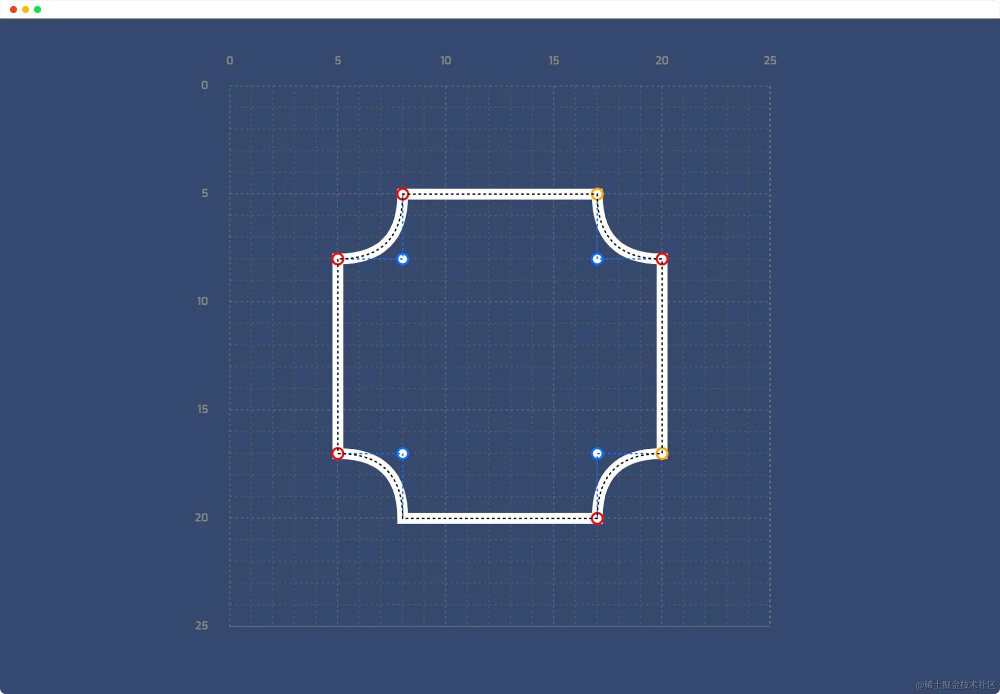

  


> Demo 地址：https://codepen.io/airen/full/jOoBoyg

  


绘制出来的内凹角图形，就可以结合前面所介绍的[剪切](https://juejin.cn/book/7341630791099383835/section/7362748816769941540)和[遮罩](https://juejin.cn/book/7341630791099383835/section/7366549423813296165)特性，将其应用于实际生产中：

  


```HTML
<div class="card">
    
    <h3>SVG Awesome</h3>
</div>

<svg class="mask" width="0" height="0" style="position: absolute">
    <mask id="mask" maskUnits="objectBoundingBox" maskContentUnits="objectBoundingBox">
        <path d="M0,0.2 V0.8 Q0.2,0.8,0.2,1 H0.8 Q0.8,0.8,1,0.8 V0.2 Q0.8,0.2,0.8,0 H0.2 Q0.2,0.2,0,0.2" fill="#fff" />
    </mask>
</svg>
```

  


注意，代码中的 `<path>` 元素的 `d` 属性值是使用了[路径转换工具](https://yoksel.github.io/relative-clip-path/)，将路径所有坐标转换为用户对象框坐标范围呢（即 `[0,]`）。具体原因，在[剪切](https://juejin.cn/book/7341630791099383835/section/7362748816769941540)和[遮罩](https://juejin.cn/book/7341630791099383835/section/7366549423813296165)有介绍过，这里不重复阐述：

  


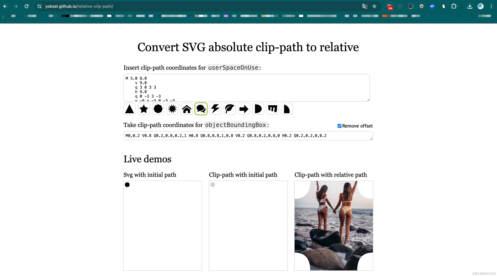

  


> URL:https://yoksel.github.io/relative-clip-path/

  


接下来，将 `<mask>` 定义的遮罩用于 `.card` 元素：

  


```CSS
.card {
    mask: url(#mask);
}
```

  


浏览器呈现给你的卡片就是你使用 `<path>` 路径命令绘制的内凹角形状：

  


  


> Demo 地址：https://codepen.io/airen/full/OJYpYBY

  


请继续！

  


假设你现在需要绘制多个连续的二次贝塞尔曲线：

  


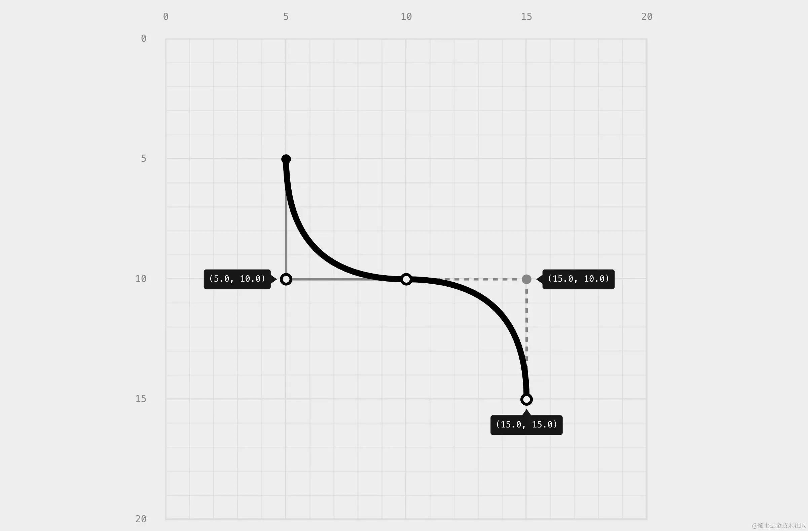

  


> Demo 地址：https://codepen.io/airen/full/rNgygEw

  


你可能会想到连续使用多个 `Q` 命令来绘制，例如：

  


```XML
<path d="
    M 5.0 5.0
    Q 5 10 10 10
    Q 15 10 15 15" />
```

  


虽然这样也可以，但有一种更简单的方法——使用 `T` 或 `t` 命令。

  


```XML
<path d="
    M 5.0 5.0
    Q 5.0 10.0 10.0 10.0
    T 15.0 15.0" />
```

  


-   **`M`** **命令**：移动到起始点 `(5, 5）`
-   **`Q`** **命令**：绘制一条二次贝塞尔曲线，从起点 `(5, 5)` 到终点 `(10, 10)` ，控制点为 `(5, 10)`
-   **`T`** **命令**：绘制一条新的二次贝塞尔曲线，终点为 `(15, 15)`，使用前一个曲线的控制点的反射点

  


`T` 或 `t` 命令将使用前一条曲线的控制点的反射来绘制新的二次贝塞尔曲线。相当于第一条曲线的终点（`P2 = (10.0,10.0)`）是第二条曲线的起点（`P0 = (10.0,10.0)`）；第一条曲线的控制点 `P1 = (5.0,10)` 的反射点则为第二条曲线的控制点 `P1 = (15.0,10)` ；第二条曲线的终点 `P2` 则为 `T` 或 `t` 命令的坐标点或偏移量，即 `P2 = （15.0，15.0）` ：

  


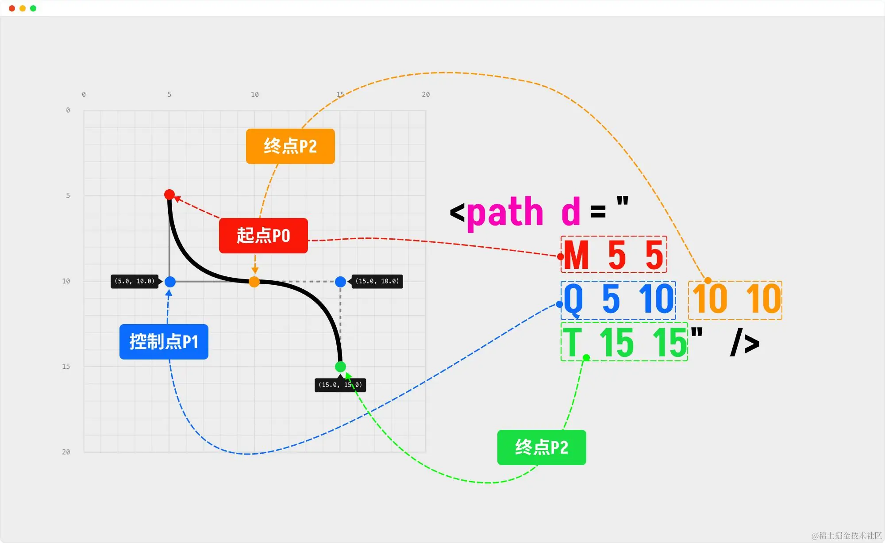

  


你可以尝试着改变第一条曲线的控制点，观察第二个曲线如何变化：

  


  


这种方法（即 `T` 或 `t` 命令）也常称为平滑二次贝塞尔曲线，它可以帮助你简化代码，并使路径更易于管理。但请要注意，这种方法只有在反射点确实是你需要的点时才有效（前面提到过，手柄反射点有三种模式，镜像模式、非对称模式和断裂模式，这里使用的是“镜像模式”），如果不是，你极需要使用完整的 `Q` 或 `q` 命令来绘制二次贝塞尔曲线。

  


有关于二次贝塞尔曲线命令 `Q` 或 `q` 和平滑二次贝塞尔曲线命令 `T` 或 `t` ，就介绍到这里。如果你感兴趣，可以挑战一下自己，应用前面所学的知识，使用 `<path>` 命令绘制出下图的形状：

  


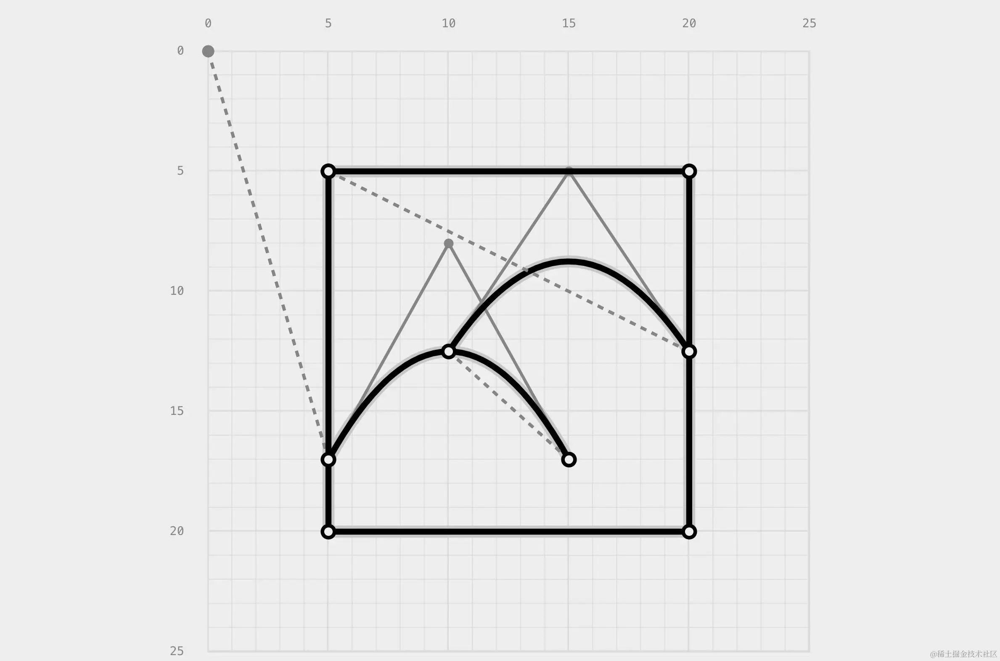

  


> Demo 地址：https://codepen.io/airen/full/MWdpNgX

  


#### 三次贝塞尔曲线命令：`C` （`c`）和 `S` （`s`）

  


虽然二次贝塞尔曲线很棒，但它也有一些限制——只有一个控制点，能绘制的形状有限。例如，使用二次贝塞尔曲线绘制的药丸形状并不太完美：

  


```XML
<path d="
    M 5.0 5.0
    h 5.0
    q 5.0 2.5 0.0 5.0
    h -5.0
    q -5.0 -2.5 0.0 -5.0
    Z" />
```

  


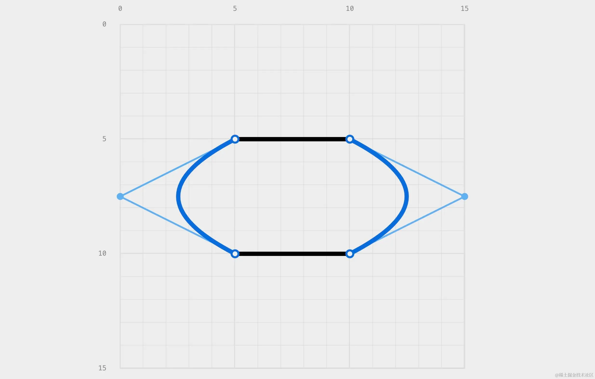

  


但是，如果我们将二次曲线改为三次曲线，我们会得到一个更加平滑的药丸形状：

  


```XML
<path d="
    M 5.05.0
    h 5.0
    c 4.0 0.0 4.0 5.0 0.0 5.0
    h -5.0
    c -4.0 0.0 -4.0 -5.0 0.0 -5.0
    Z" />
```

  


我们能够使曲线看起来更好，是因为我们有一个额外的控制点来使用。

  


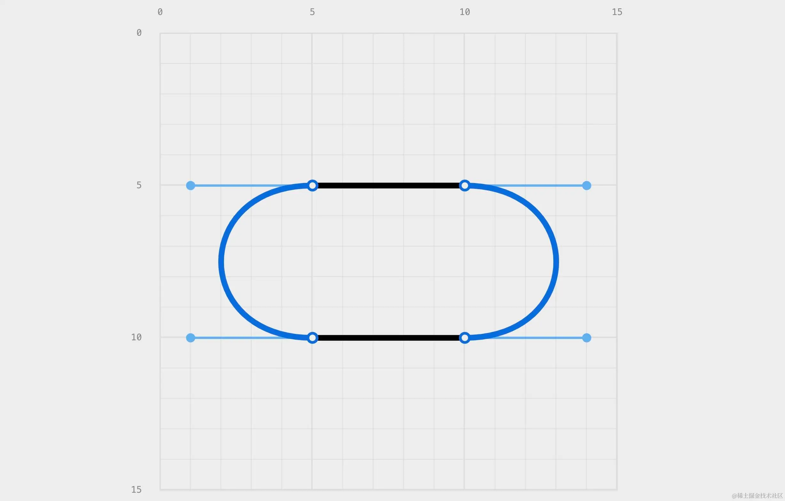

  


与二次贝塞尔曲线相比，三次贝塞尔曲线多了一个控制点，因此能绘制出更多样化，更复杂的形状：

  


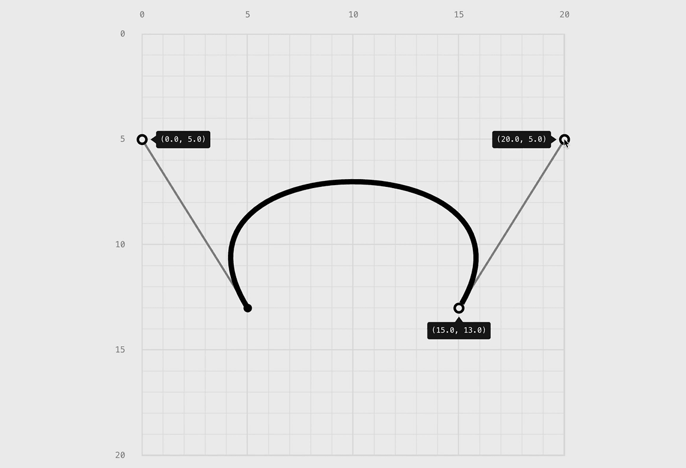

  


三次贝塞尔曲线命令使用 `C`（大写）表示绝对命令，使用 `c`（小写）表示相对命令。其基本语法如下：

  


```
C control1X control1Y control2X control2Y endX endY
```

  


-   `control1X control1Y`：第一个控制点的绝对坐标
-   `control2X control2Y`：第二个控制点的绝对坐标
-   `endX endY`：曲线终点的绝对坐标

  


```
c dx1 dy1 dx2 dy2 dx dy
```

  


-   `dx1 dy1`：相对于当前点的第一个控制点的偏移量
-   `dx2 dy2`：相对于当前点的第二个控制点的偏移量
-   `dx dy`：相对于当前点的终点的偏移量

  


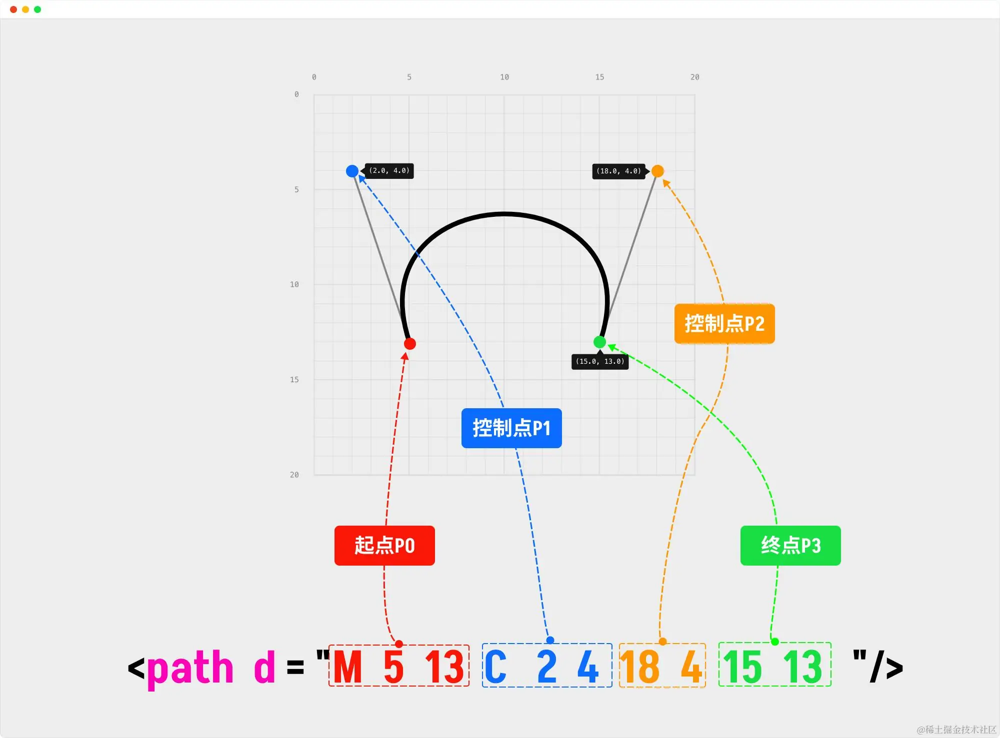

  


它看上去和二次贝塞尔曲线命令有点类似，但是有一个额外的坐标对用于第二个控制点 `P2` 。例如：

  


```XML
<path d="
    M 5.0 13.0
    C 0.0 5.0 20.0 5.0 15.0 13.0" />
```

  


这段代码创建了一条从 `(5.0, 13.0)` 开始，到 `(15.0, 13.0)` 结束的三次贝塞尔曲线。两个控制点分别是 `(0.0, 5.0)` 和 `(20.0, 5.0)`，它们共同决定了曲线的形状。该路径绘制顺序为先移动光标，然后根据控制点绘制曲线。

  


-   `M 5.0 13.0`：光标移动到起点 `(5.0, 13.0)`
-   `C 0.0 5.0 20.0 5.0 15.0 13.0`：从 `(5.0, 13.0)` 开始，使用控制点 `(0.0, 5.0)` 和 `(20.0, 5.0)` 绘制一条三次贝塞尔曲线，终点为 `(15.0, 13.0)`

  


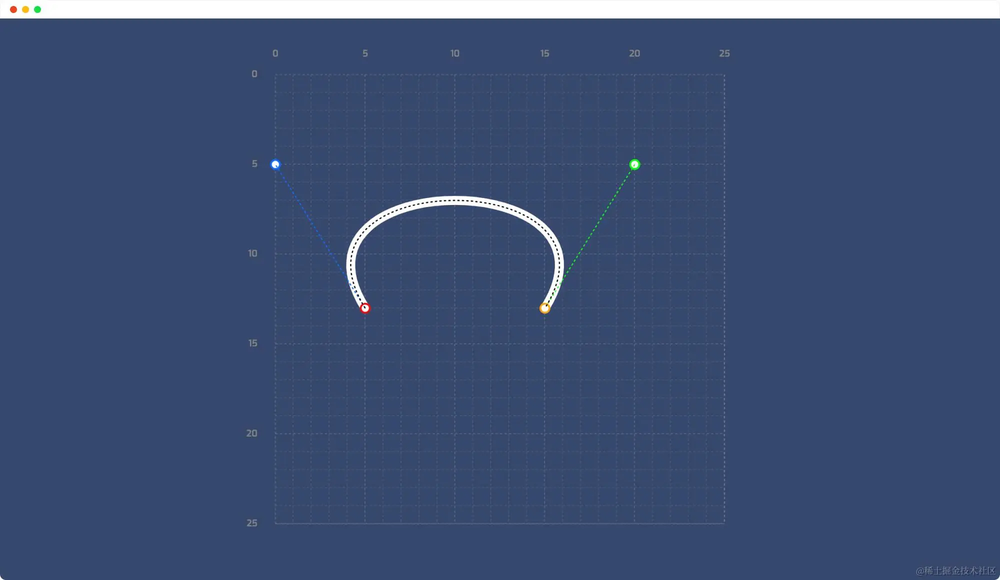

  


> Demo 地址：https://codepen.io/airen/full/GRaWVxv

  


我们可以通过改变两个控制点和终点位置，获得不同的形状的曲线：

  


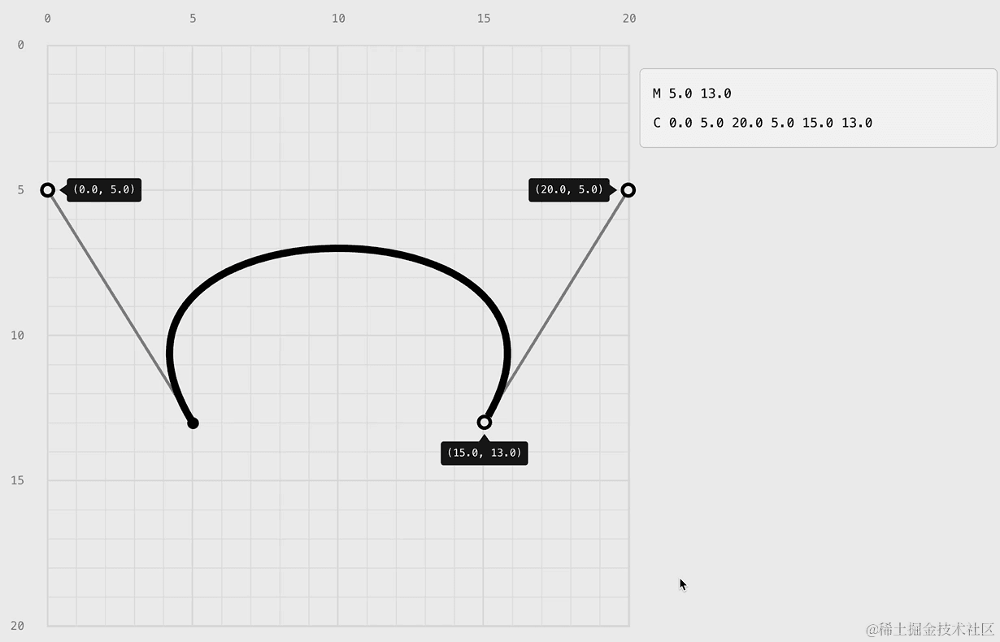

  


你可以把三次贝塞尔曲线看作是二次贝塞尔曲线的“升级版”——只要把控制点放在正确的位置，每条二次曲线都能用三次曲线来表示。

  


你可以尝试着，使三次贝塞尔曲线的两个控制点在同一个位置（模拟二次贝塞尔曲线的一个控制点），这个时候就相当于使用三次贝塞尔命令绘制了一条二次贝塞尔曲线：

  


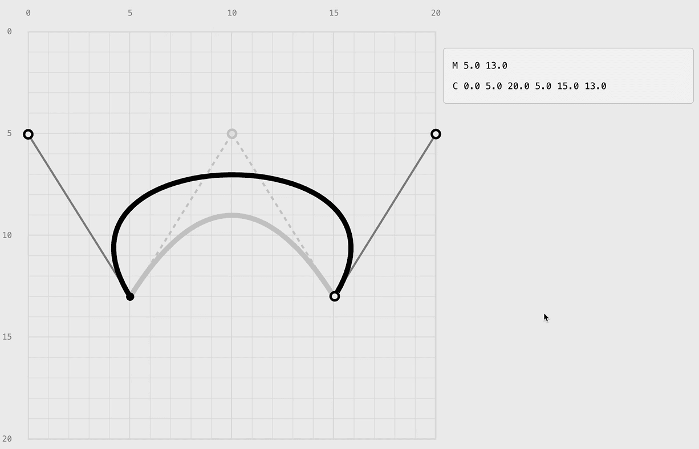

  


上图中灰色曲线是使用 `Q` 命令绘制的曲线，黑色是 `C` 命令绘制的曲线：

  


```XML
<path d="
    M 5 13
    Q 10 5 15 13" stroke="gray" />
    
<path d="
    M 5 13
    C 10 5 10 5 15 13" stroke="black" />
```

  


有趣的是，当两个控制点在同一位置时，这两条曲线并不会对齐！

  


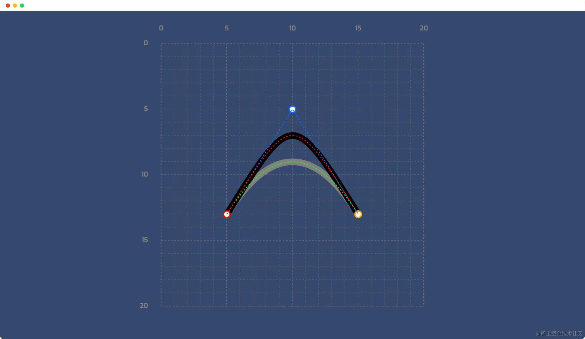

  


> Demo 地址：https://codepen.io/airen/full/ExzWqzV

  


反之，当两条曲线对齐时，即使用三次贝塞尔命令绘制一条与使用二次贝塞尔命令绘制出来的相同曲线，三次贝塞尔曲线的控制点并不会在同一个位置：

  


  


> Demo 地址：https://codepen.io/airen/full/zYQwOGr

  


像就二次贝塞尔曲线可以使用 `S` 或 `s` 命令，将若干个三次贝塞尔曲线连起来，从而创建出一条很长的平滑曲线。

  


```
绝对命令 👉👉👉 S x2 y2, x y

相对命令 👉👉👉 s dx2 dy2, dx dy
```

  


-   `x2 y2`：第二个控制点的绝对坐标
-   `x y`：曲线终点的绝对坐标
-   `dx2 dy2`：相对于当前点的第二个控制点的坐标偏移
-   `dx dy`：相对于当前点的终点的坐标偏移。

  


通常情况下，一个点某一侧的控制点是它另一侧的控制点的对称（以保持斜率不变）：

  


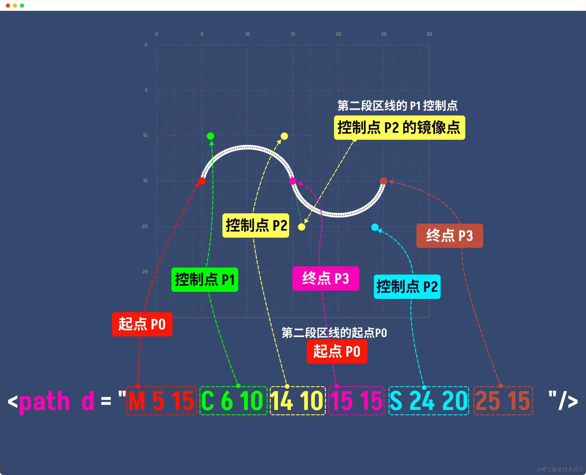

  


> Demo 地址：https://codepen.io/airen/full/WNBjewm

  


如上图所示，如果 `S` 或 `s` 命令跟在一个 `C` （或 `c`）或 `S` （或 `s`）命令后面，则它的第一个控制点会被假设成前一个命令曲线的第二个控制点的镜像点。如果 `S` 或 `s` 命令单独使用，前面没有 `C` （或 `c`）或 `S` （或 `s`）命令，那当前点将作为第一个控制点。

  


使用 `S` 或 `s` 可以绘制出更复杂的形状，例如：

  


```XML
<path d="
    M 6.0 10.0
    C 6.0 8.0 4.0 10.0 4.0 5.0
    S 11.0 0.0 11.0 5.0
    S 9.0 8.0 9.0 10.0
    Z
    M 6.3 10.0
    v 1.5
    h -0.3
    v 1.0
    q 0.0 1.0 1.0 1.0
    h 1.0
    q 1.0 0.0 1.0 -1.0
    v -1.0
    h -3.0
    m 2.8 0.0
    v -1.5 " />
```

  


简单解释一下上面的命令执行顺序：

  


-   `M 6.0 10.0`：光标移动到 `(6, 10)`
-   `C 6.0 8.0 4.0 10.0 4.0 5.0`：绘制一条三次贝塞尔曲线，控制点为 `(6, 8)` 和 `(4, 10)`，终点为 `(4, 5)`
-   `S 11.0 0.0 11.0 5.0`：绘制第二条三次贝塞尔曲线，起点为上一个终点 `(4, 5)`，第一个控制点为上一个控制点的反射点，第二个控制点为 `(11, 0)`，终点为 `(11, 5)`
-   `S 9.0 8.0 9.0 10.0`：绘制第三条三次贝塞尔曲线，起点为上一个终点 `(11, 5)`，第一个控制点为上一个控制点的反射点，第二个控制点为 `(9, 8)`，终点为 `(9, 10)`
-   `Z`：关闭路径
-   `M 6.3 10.0`：光标重新移动到 `(6.3, 10)`
-   `v 1.5`：垂直向下移动 `1.5` ，绘制一条垂直直线
-   `h -0.3`：水平向左移动 `0.3` ，绘制一条水平直线
-   `v 1.0`：垂直向下移动 `1.0` ，绘制一条垂直直线
-   `q 0.0 1.0 1.0 1.0`：绘制一条二次贝塞尔曲线，控制点为 `(0.0, 1.0)`，终点为 `(1.0, 1.0)`
-   `h 1.0`：水平向右移动 `1.0`，绘制一条水平直线
-   `q 1.0 0.0 1.0 -1.0`：绘制一条二次贝塞尔曲线，控制点为 `(1.0, 0.0)`，终点为 `(1.0, -1.0)`
-   `v -1.0`：垂直向上移动 `1.0`，绘制一条垂直直线
-   `h -3.0`：水平向左移动 `3.0` ，绘制一条水平直线
-   `m 2.8 0.0`：光标移动到相对位置 `(2.8, 0)`
-   `v -1.5`：垂直向上移动 `1.5`，绘制一条垂直直线

  


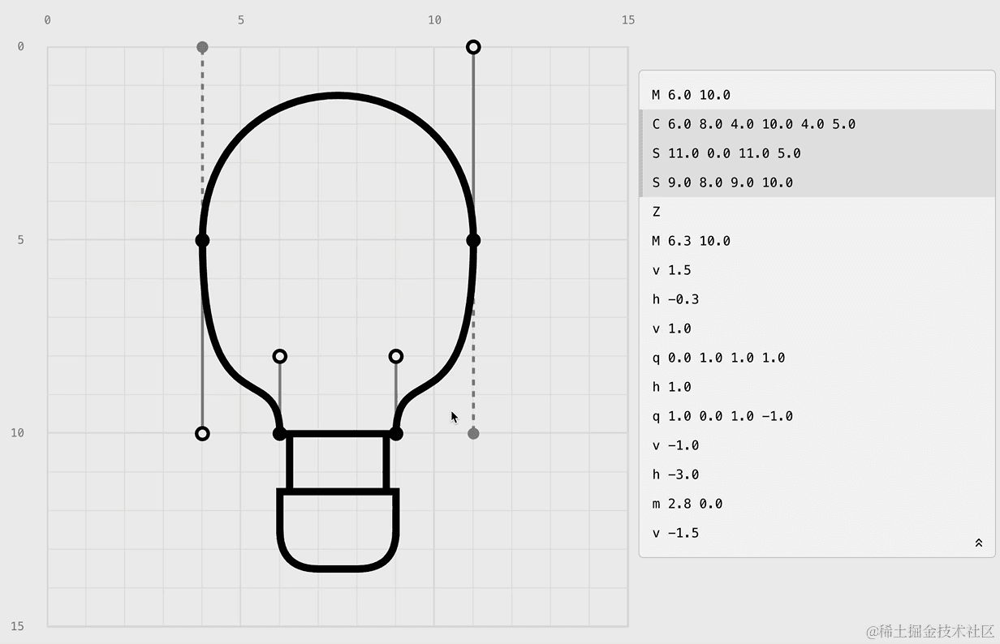

  


> Demo 地址：https://codepen.io/airen/full/BaeRBXB

  


挑战一下自己，使用已掌握的路径命令绘制一系列的天气图标：

  


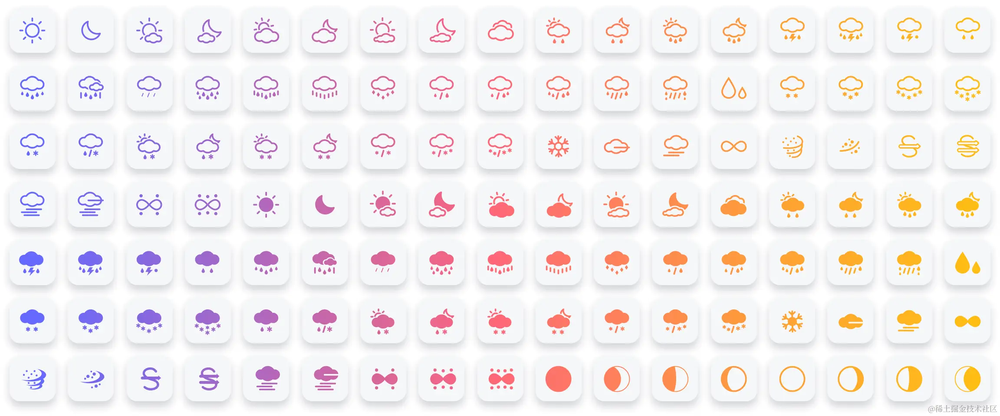

> QWeather Icons: https://icons.qweather.com/en/

  


以下雨的图标为例：

  


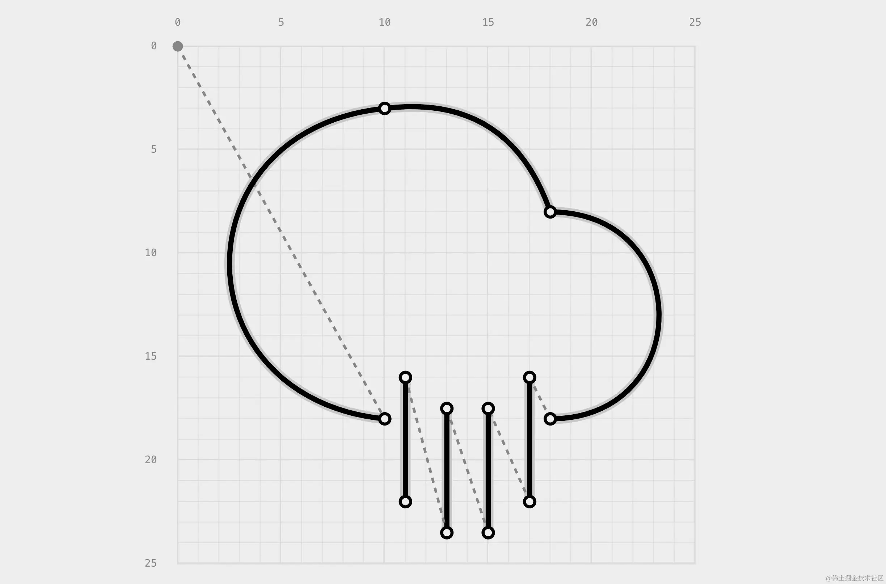

  


```XML
<path d="
    M10.0 18.0
    c -10.0 -1.0 -10.0 -14.00.0 -15.0
    q 6.0 -0.8 8.0 5.0
    c 7.0 0.0 7.0 10.0 0.0 10.0
    m -1.0 -2.0
    v 6.0
    m- 2.0 -4.5
    v 6.0
    m -2.0 -6.0
    v 6.0
    m -2.0 -7.5
    v 6.0" />
```

  


> Demo 地址：https://codepen.io/airen/full/ZENKEYK

  


#### 弧形命令：`A` 和 `a`

  


弧形命令 `A` 或 `a` 是另一个创建 SVG 曲线的命令。基本上，弧形可以视为圆形或椭圆形的一部分。假设，已知椭圆形的长轴半径和短轴半径，并且已知两个点（在椭圆上），根据半径和两点，可以画出两个椭圆，在每个椭圆上根据两点都可以画出两种弧形。所以，仅仅根据半径和两点，可以画出四种弧形。为了保证创建的弧形唯一，`A` 或 `a` 命令需要用到比较多的参数：

  


```
绝对命令 👉👉👉 A rx ry x-axis-rotation large-arc-flag sweep-flag x y
相对命令 👉👉👉 a rx ry x-axis-rotation large-arc-flag sweep-flag dx dy
```

  


它应该是 SVG 所有命令中包含参数最多的一个命令，相对而言，理解弧形命令会更困难一些。我们就先从其参数开始吧：

  


-   **`rx`**：`X` 轴方向的半径
-   **`ry`**：`Y` 轴方向的半径
-   **`x-axis-rotation`**：`X` 轴旋转角度，定义椭圆的旋转
-   **`large-arc-flag`**：弧度大小标志，取值为 `0` 或 `1`。决定弧的大小：`0` 表示绘制小于或等于 `180`度的弧；`1` 表示绘制大于 `180` 度的弧
-   **`sweep-flag`**：弧线方向标志，取值为 `0` 或 `1`。决定弧线的方向：`0` 表示逆时针方向绘制；`1` 表示顺时针方向绘制
-   **`x`** 和 **`y`** （或 **`dx`** 和 **`dy`** ）：弧的终点坐标。绝对命令使用绝对坐标，相对命令使用相对坐标。

  


例如，你可以像下面这样绘制一条弧线：

  


```XML
<path d="
    M 3 10
    A 10 7.5 0 0 0 20 15" />
```

  


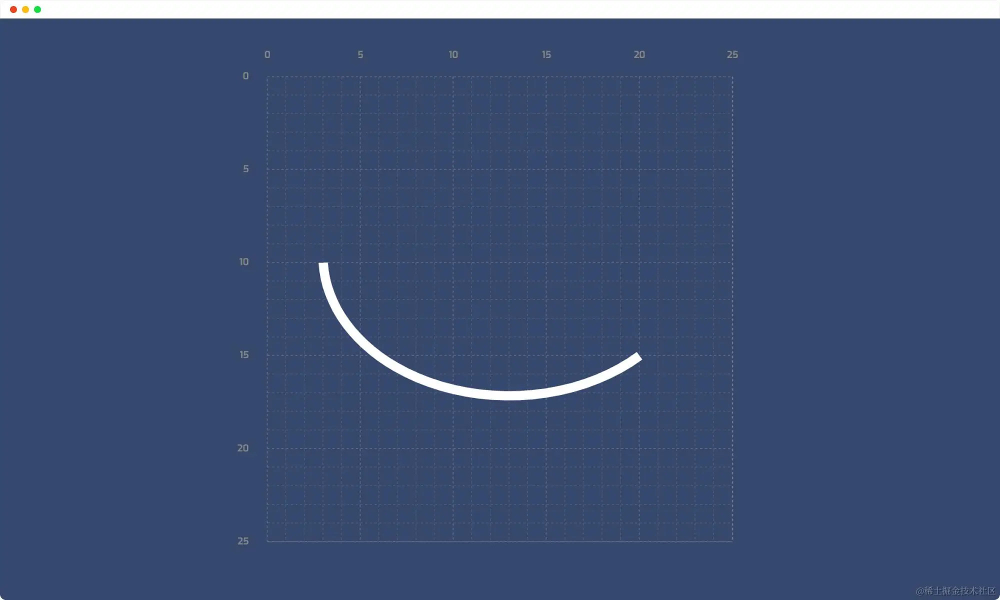

  


> Demo 地址：https://codepen.io/airen/full/BaeRaxz

  


上面代码中，`A 10 7.5 0 0 0 20 15` 绘制了这条弧线，你可以仔细观察下图，先对 `A` 或 `a` 命令中的每个参数有一个初步的认识：

  


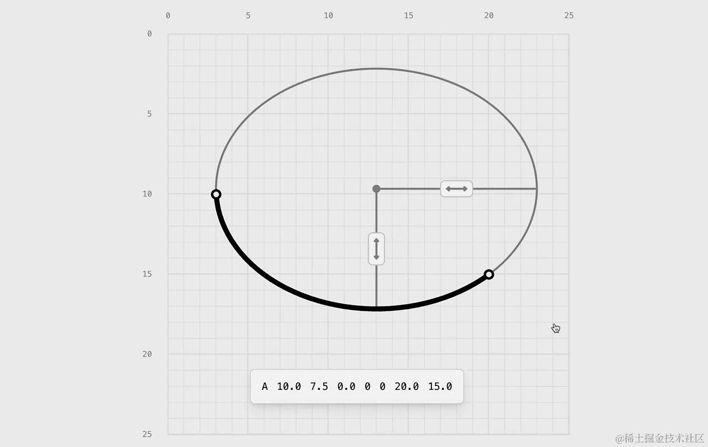

  


它的维制过程如下图所示：

  


  


接下来，我们就来聊聊 `A 10 7.5 0 0 0 20 15` 这里面的每个参数的功能与作用。先把 `A` 命令这后面的一大串数字与其参数匹配起来：

  


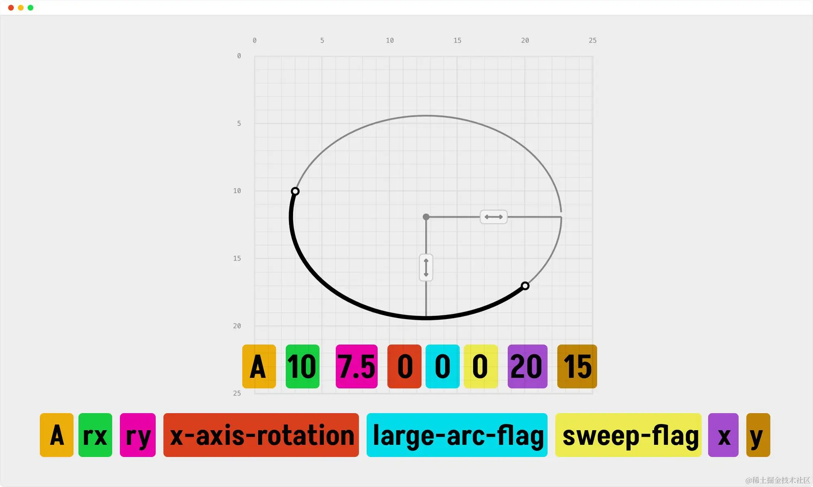

  


首先看命令和第一对和最后一对坐标：`(rx,ry)` 和 `(x,y)` 。这些点，连同初始光标位置（例如上面代码中的 `M 3 10`），一起决定了绘制弧线的椭圆形状。简单地说，为了绘制一条弧线，浏览器将取这三个点，并尝试找到一个适合的椭圆。即一个椭圆，其半径为 `rx` 和 `ry` ，并且两个点（光标的初点位置和弧线的终点位置）都在其周长上。

  


这意味着，已知椭圆的半径（`rx` 和 `ry`），并且已知椭圆上的两个点（光标初始位置和弧线终点位置），根据半径和两点，可以画出一个椭圆。例如，当你更改 `A` 命令中的 `rx` 、`ry` 以及起点和终点的位置时，椭圆将始终更改以适应这两个点和提供的半径：

  


  


从上图中不难发现，当改变 `A` 命令中的 `rx` 和 `ry` 时，光标的初始位置和弧线的终点位置，并不总是在 `rx` 和 `ry` 所绘制的椭圆上。例如：

  


```XML
<path d="
    M 3 10
    A 10 7.5 0 0 0 20 17" />
```

  


把上面代码中 `rx` 调小至 `6.5` ，即：

  


```XML
<path d="
    M 3 10
    A 6.5 7.5 0 0 0 20 17" />
```

  


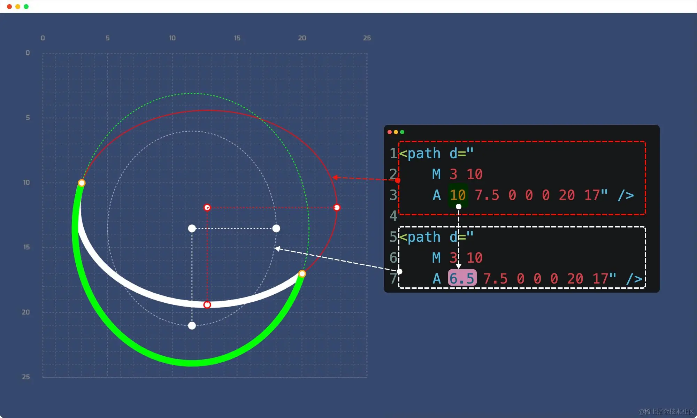

  


> Demo 地址：https://codepen.io/airen/full/KKLmpPY

  


请注意，当我们仅把椭圆的 `rx` 半径从 `10` 调整到 `6.5` 时，椭圆形状是发生了变化的，水平椭圆（上图红色椭圆）变成垂直椭圆（上图中白色椭圆）。从上图中不难发现，弧线的起点 `M 3 10` 和终点 `(20, 17)` 在没有调整的情况下，即便椭圆（白色椭圆）不够大以适应弧线的点时，弧线并不会受到影响。它仍然沿着椭圆的曲线走。这表示椭圆隐式地被缩放以适应弧线。请留意下图中的椭圆 `rx` 半径调小之后，`A` 命令绘制的弧线变化：

  


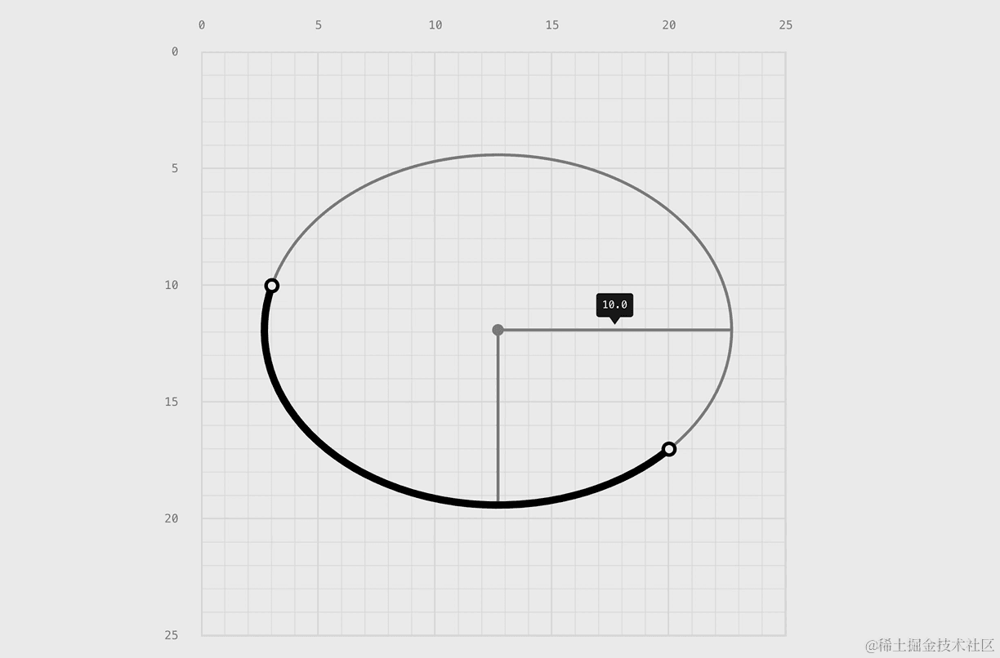

  


你可以尝试调整 `ry` 的值，它与 `rx` 是一样的，会使椭圆隐式地被缩放，但弧线始终会沿着椭圆的曲线走。

  


接下来，我们来调整 `x` 轴的旋转角度，即 **`x-axis-rotation`** 参数值。

  


```XML
<path d="
    M 3 10
    A 10 7.5 30 0 0 20 17" />
```

  


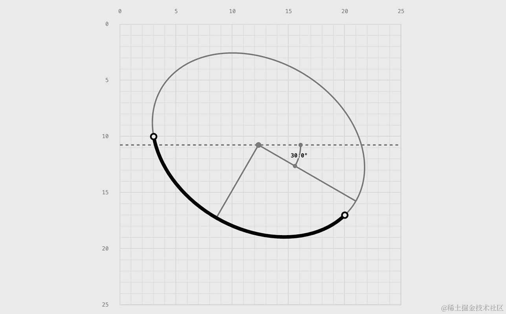

  


如上图所示，这个值将椭圆沿着其 `x` 轴（或水平轴）旋转，以确定弧线的最终方向和形状。它对弧线的影响主要体现在以下几个方面：

  


-   旋转椭圆：`rx` 和 `ry` 定义了椭圆的半径，分别沿 `x` 轴和 `y` 轴；`x-axis-rotation` 是旋转角度，以度为单位。它表示椭圆围绕其中心逆时针旋转的角度。
-   影响弧线的形状：通过旋转椭圆，可以改变弧线的形状。未旋转的椭圆会沿 `x` 轴和 `y` 轴对齐。如果对其进行旋转，那么椭圆的主轴（长轴和短轴）就会倾斜，从而影响弧线的形状。
-   影响弧线的方向：旋转椭圆会改变弧线的开始和结束方向。当你指定弧线的起点和终点时，旋转的角度会影响从起点到终点的弧线走向。

  


为了更好地理解这个参数，以下是一个示例：

  


```XML
<svg>
  <!-- 弧线没有旋转 -->
  <path d="
      M 5 5 
      A 5 3 0 0 1 15 5" stroke="red" />
  
  <!-- 弧线旋转45度 -->
  <path d="
      M 5 10 
      A 5 3 45 0 1 15 10" stroke="orange" />
  
  <!-- 弧线旋转90度 -->
  <path d="
      M 5 15 
      A 5 3 90 0 1 15 15" stroke="green" />
</svg>
```

  


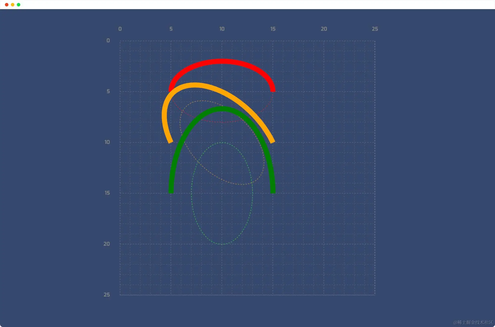

  


> Demo 地址：https://codepen.io/airen/full/QWRvgby

  


在这个示例中：

  


-   第一条红色弧线的 `x-axis-rotation` 为 `0`，即没有旋转
-   第二条橙色弧线的 `x-axis-rotation` 为 `45`，即椭圆旋转了`45`度
-   第三条绿色弧线的 `x-axis-rotation` 为 `90`，即椭圆旋转了`90`度

  


可以看到，随着旋转角度的增加，弧线的形状和方向会发生变化。具体地：

  


-   `0`度时，椭圆的主轴平行于 `x` 轴和 `y` 轴
-   `45`度时，椭圆的主轴倾斜 `45` 度，导致弧线的形状和方向也发生变化
-   `90`度时，椭圆的主轴垂直于最初的位置，弧线形状变得更为垂直

  


`A` 或 `a` 命令的最后两个参数是 `large-arc-flag` 和 `sweep-flag` ，它们看起来像是数字，但实际上它是标志，它们的值只有 `0` 和 `1` 。这是 `A` 或 `a` 命令中非常重要的两个参数，用于决定弧线的外观和方向。虽然它们的官方名称分别是“大弧线标志”（`large-arc-flag`）和“扫描标志”（`sweep-flag`），但我更喜欢称它们为大弧线和顺时针标志。

  


接下来，我们来解释一下这两个参数。

  


-   `large-arc-flag` 决定弧线是否应该是大于或小于 `180` 度的弧，其中 `0` 表示选择小于或等于 `180` 度的弧（小弧），`1` 表示选择大于 `180` 度的弧（大弧）
-   `sweep-flag` 决定弧线的绘制方向是顺时针还是逆时针，其中 `0` 表示逆时针方向，`1` 表示顺时针方向

  


假设，我们有一个起点 `(7,7)` 和终点 `(18,18)` ，并且使用半径为 `8` 的椭圆绘制弧线。我们可以通过不同的 `large-arc-flag` 和 `sweep-flag` 参数来控制弧线的形状和方向。以下是四种不同的组合：

  


```XML
<!-- large-arc-flag=0 和 sweep-flag=0 （小弧，逆时针方向）-->
<path d="
    M 7 7
    A 8 8 0 0 0 18 18" stroke="red" />
    
<!-- large-arc-flag=1 和 sweep-flag=0（大弧，逆时针方向） -->    
<path d="
    M 7 7
    A 8 8 0 1 0 18 18" stroke="lime" />
    
<!-- large-arc-flag=0 和 sweep-flag=1（小弧，顺时针方向） -->  
<path d="
    M 7 7
    A 8 8 0 0 1 18 18" stroke="orange" />  
    
<!-- large-arc-flag=1 和 sweep-flag=1（大弧，顺时针方向） -->    
<path d="
    M 7 7
    A 8 8 0 1 1 18 18"  stroke="yellow />
```

  


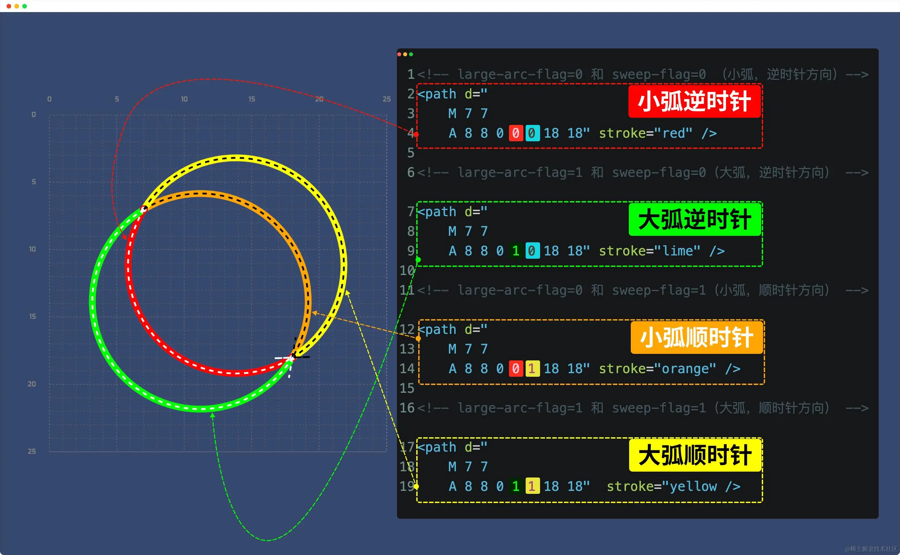

  


> Demo 地址：https://codepen.io/airen/full/yLWbXzX

  


如上图所示：

  


-   **小弧**: 当 `large-arc-flag` 为 `0` 时，弧的角度小于或等于 `180` 度
-   **大弧**: 当 `large-arc-flag` 为 `1` 时，弧的角度大于 `180` 度
-   **`sweep-flag`**: 控制弧线的方向，`0` 代表逆时针方向（图中黑色虚线），`1` 代表顺时针方向（图中白色虚线）

  


通过这个示例，可以清楚地看到 `large-arc-flag` 和 `sweep-flag` 如何影响弧线的形状和方向。理解这两个参数能够帮助你更好地利用 SVG 绘制出各种所需的弧线。

  


最后，以下图来对 SVG 路径的命令做一个简短的小结：

  


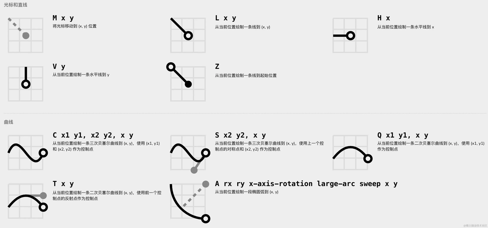

  


## SVG 路径实践

  


前面主要与大家探讨了 SVG 路径命令的类型和使用，都是以理论为基础。接下来，我们来看几个简单的案例，向大家展示 SVG 路径在 Web 中的应用。

  


### 案例一：使用 CSS 动态化 SVG 路径数据

  


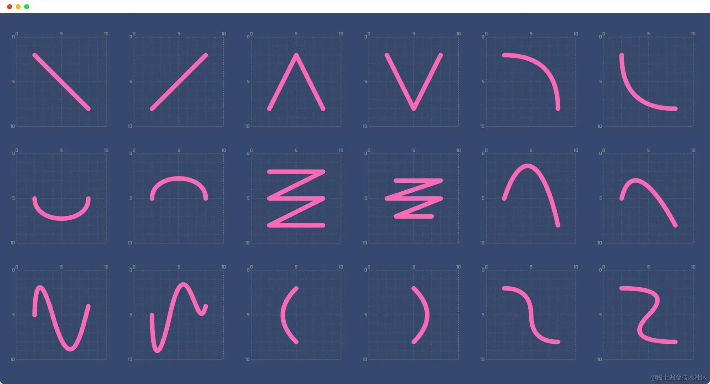

  


我想，你现在应该可以应用前面所学的内容，使用 `path` 相关命令绘制出上图所示的各种形状。

  


你会发现，上图中有很多形状是相似的，只是方向改变了，看上去有点像是镜像出来的图形。我们以第二对为例（上三角和下三角）。

  


```XML
<!-- 上三角 -->
<svg viewBox="0 0 10 10" class="path">
    <path d="M 2 8 L 5 2 L 8 8" />
</svg>

<!-- 下三角 -->
<svg viewBox="0 0 10 10" class="path">
    <path d="M 2 2 L 5 8 L 8 2" />
</svg>
```

  


很简单，就是使用 `M` 和 `L` 命令分别绘制了两条直线。

  


在这里，这么设计是接下来要向大家展示，CSS 是如何动态修改 SVG 路径数据，即 `d` 属性。在现代 CSS 中，我们可以直接在 CSS 中使用 `d` 属性来覆盖 SVG 的 `<path>` 元素的 `d` 属性值。我们把上面的代码稍微调整一下，在每个 `<path>` 元素中设置一个自定义属性，其值是 `path('...')` ：

  


```XML
<svg viewBox="0 0 10 10" class="path">
    <path d="M 2 8 L 5 2 L 8 8"  style="--d:path('M 2 2 L 5 8 L 8 2')"/>
</svg>

<svg viewBox="0 0 10 10" class="path">
    <path d="M 2 2 L 5 8 L 8 2" style="--d:path('M 2 8 L 5 2 L 8 8')" />
</svg>
```

  


`path()` 函数中的值将 `<path>` 元素的 `d` 属性的值相互互换了一下。并且在鼠标悬浮的时候，通过 `d` 属性改变 `<path>` 元素的 `d` 属性的值，并且给它添加了过渡属性，使路径数据在变化的时候有一个平滑过渡的效果：

  


```CSS
.path path {
     transition: d .35s;
 }
  
.path:hover path {
    d: var(--d);
}
```

  


这个时候，你将鼠标悬浮在图标上，看到的效果如下：

  


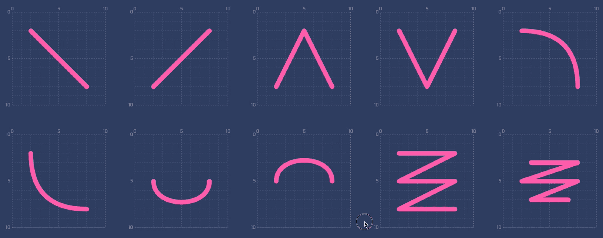

  


> Demo 地址：https://codepen.io/airen/full/vYwmebz

  


注意，实现这个效果有一个关键，路径数据需要相同的类型、相同数量的点等，否则在形状变形时，不会有平滑过渡的效果。当你无法准确确定这些关键信息时，那么建议你使用 [GSAP 的 MorphSVG 插件](https://gsap.com/docs/v3/Plugins/MorphSVGPlugin)或 [Flubber 库](https://www.bram.us/2017/06/21/smooth-svg-path-morphing-with-flubber/)来实现。例如下面这个效果，就是 GSAP 的 MorphSVG 实现的 SVG 图形变形动画效果：

  


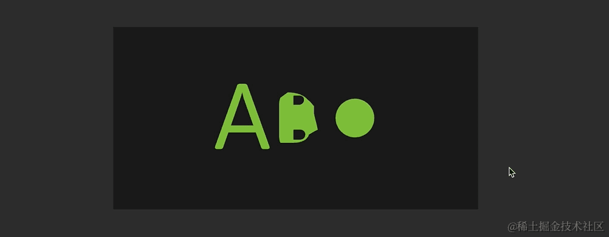

  


> Demo 地址：https://codepen.io/GreenSock/full/gagNeR

  


### 案例二：带弧形边框的用户头像

  


[CSS-Tricks 网站的第 17 版设计](https://css-tricks.com/design-v17/)，有很多不规则的 UI 形状。如下图所示：

  


  


如果只是使用 CSS 来实现这些弧形和曲线，那么还是是很棘手的。要是，换作 SVG 来说实现的话，再简单不过了。接下来，我们以用户头像的弧形边框为例：

  


  


实现上图中用户头像的边框效果，你可以需要一个类似下面这样的 HTML 结构：

  


```HTML
<div class="avatar">
    
    <svg viewBox="-10 -10 20 20">
        <!-- 重点是这里 -->
    </svg>
</div>
```

  


我们的重点是 `<svg>` 元素里面的内容。在开始之前，先使用 CSS 给用户头像设置一些基本样式：

  


```CSS
.avatar {
    width: var(--size, 50vh);
    aspect-ratio: 1;
    display: grid;
    place-content: center;
    position: relative;
    place-self: center;
    transition: all .2s linear;

    img {
        display: block;
        width: 85%;
        aspect-ratio: 1;
        border-radius: 50%;
        place-self: center;
    }

    svg {
        position: absolute;
        stroke-linecap: round;
        left: 0;
        right: 0;
        bottom: 0;
        width: 100%;
        overflow: visible;
        outline: 1px dashed;
    }
}
```

  


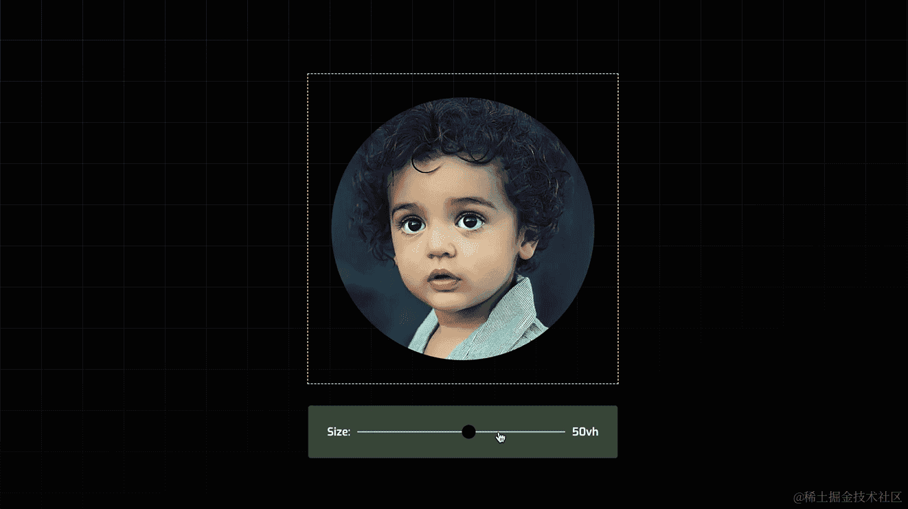

  


注意，由于现在 `<svg>` 中什么内容都没有，所以在样式中添加了一个 `outline` 样式来表示 `<svg>` 。我们要的效果是，用户头像是具有响应式效果的，它能随容器大小变化自动适配。

  


从设计图的效果来看，用户头像的边框效果是一个带有渐变的半圆效果。它刚好与 `<path>` 命令中的 `A` 或 `a` 命令所匹配。因为 `A` 或 `a` 命令，可以绘制一个半圆形的弧线。根据课程前面介绍的内容，我们在 `<svg>` 中添加一个 `<path>` 元素，并给其 `d` 属性设置相应的值。即绘制类似半圆的弧线：

  


```XML
<svg viewBox="-10 -10 20 20">
    <path d="M -10 0 A 10 10 0 0 0 10 0" stroke="#fff" stroke-width="1.4" fill="none" /> 
</svg>    
```

  


简单的解释一下 `d` 属性的值 `M -10 0 A 10 10 0 0 0 10 0`：

  


-   `M -10 0` 命令把光标移动到画布的 `(-10,0)` 位置
-   `A 10 10 0 0 0 10 0` 命令在一个半径为 `rx = ry = 10` 的椭圆上，按顺时针方向，从 `(-10,0)` 位置（弧线的起点位置）到 `(10,0)` 位置（弧线的终点位置）绘制了一个小弧线

  


现在，你能看到用户头像底部有一个类似圆形的白色边框，它能随容器大小进行缩放：

  


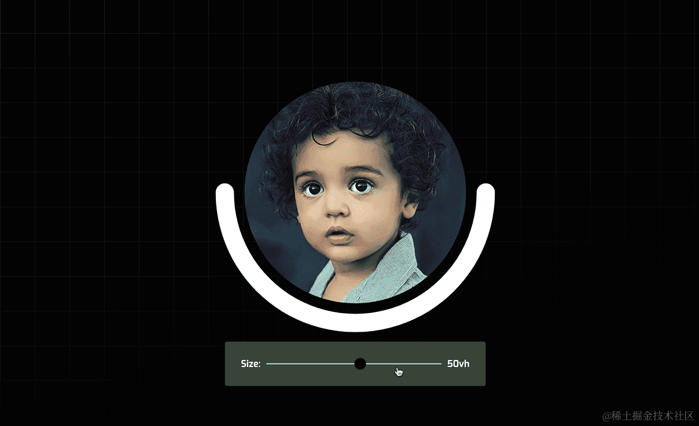

  


离目标效果已经非常接近了。现在就只需要将白色弧形边框变成渐变填充的边框。

  


在 SVG 中，我们可以使用 SVG 的 `<linearGradient>` 定义一个渐变效果，并且将其填充到 `<path>` 绘制的形状中：

  


```HTML
<div class="avatar">
    
    <svg viewBox="-10 -10 20 20">
        <linearGradient id="orange-to-pink" x1="0" x2="0" y1="1" y2="0">
            <stop offset="0" stop-color="#DA1B60" />
            <stop offset="1" stop-color="#ff8a00" />
        </linearGradient> 
        <path d="M -10 0 A 10 10 0 0 0 10 0" stroke="url(#orange-to-pink)" stroke-width="1.4" fill="none" /> 
    </svg>
</div>
```

  


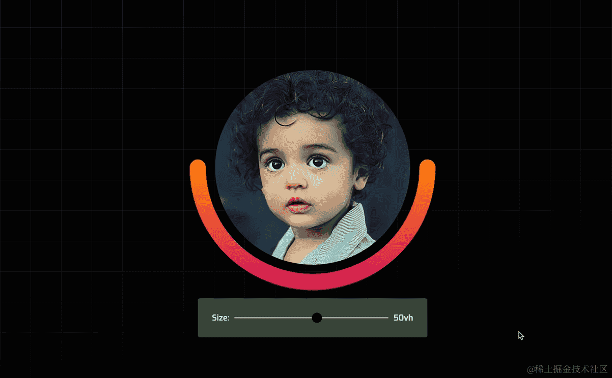

  


> Demo 地址：https://codepen.io/airen/full/VwObrbg

  


很棒，一个带有响应式效果的渐变弧形边框的用户头像 UI 效果就实现了。

  


在这个基础上，你还可以给弧形渐变边框添加一点调料。当用户鼠标悬停在头像上时，有一个动画效果：

  


```CSS
@keyframes offset {
    0% {
        stroke-dashoffset: -64px;
        stroke-dasharray: 12 8 12;
    }
    50% {
        stroke-dashoffset: 0;
        stroke-dasharray: 12 4 12;
    }
    100% {
        stroke-dashoffset: 64px;
        stroke-dasharray: 12 8 12;
    }
}

.avatar {
    cursor: pointer;

    path {
        stroke-dashoffset: 0;
    }

    &:hover path {
        animation: offset 6s linear(
              0 0%,
              0 2.27%,
              0.02 4.53%,
              0.04 6.8%,
              0.06 9.07%,
              0.1 11.33%,
              0.14 13.6%,
              0.25 18.15%,
              0.39 22.7%,
              0.56 27.25%,
              0.77 31.8%,
              1 36.35%,
              0.89 40.9%,
              0.85 43.18%,
              0.81 45.45%,
              0.79 47.72%,
              0.77 50%,
              0.75 52.27%,
              0.75 54.55%,
              0.75 56.82%,
              0.77 59.1%,
              0.79 61.38%,
              0.81 63.65%,
              0.85 65.93%,
              0.89 68.2%,
              1 72.7%,
              0.97 74.98%,
              0.95 77.25%,
              0.94 79.53%,
              0.94 81.8%,
              0.94 84.08%,
              0.95 86.35%,
              0.97 88.63%,
              1 90.9%,
              0.99 93.18%,
              0.98 95.45%,
              0.99 97.73%,
              1 100%) infinite alternate;
    }
}
```

  


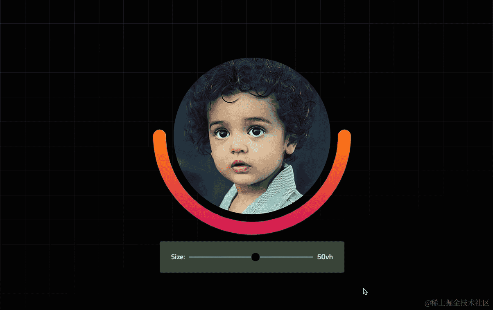

  


> Demo 地址：https://codepen.io/airen/full/dyEWZwE

  


感兴趣的同学可以挑战一下自己，设计稿上其他的不曲线效果如何实现？

  


## 小结

  


通过学习 SVG 路径的高级技术，我们能够更好地利用 SVG 的强大功能来创建复杂而精美的图形。从贝塞尔曲线和椭圆弧，到路径动画和平滑曲线，再到路径变形和布尔操作，这些技术为我们提供了丰富的工具来实现创意设计。同时，路径的简化和优化技术确保了我们所创建的图形在性能上也能保持高效。

  


掌握这些高级技术，不仅能够提升我们的图形设计水平，还能在实际应用中提高 SVG 图形的可维护性和响应速度。希望通过这节课，你能深入理解并灵活运用这些 SVG 路径技术，创作出更加生动、复杂且优化的图形作品。继续探索和实践，SVG的世界充满了无限可能！