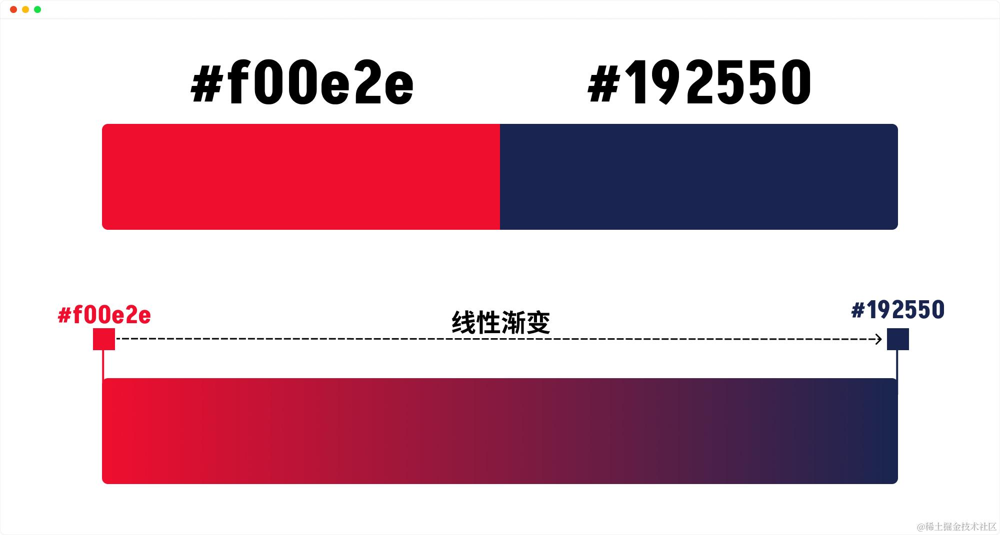
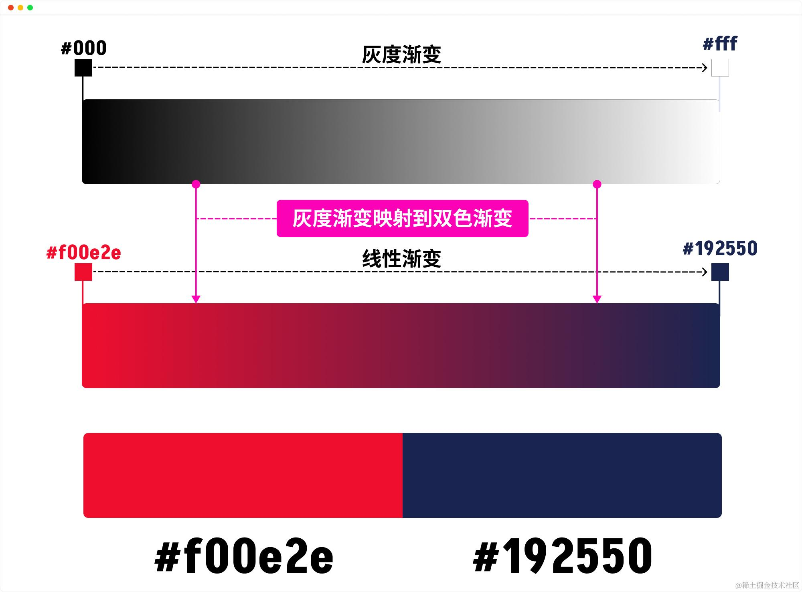
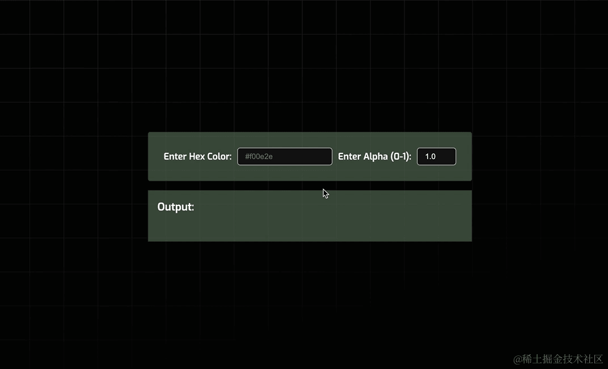
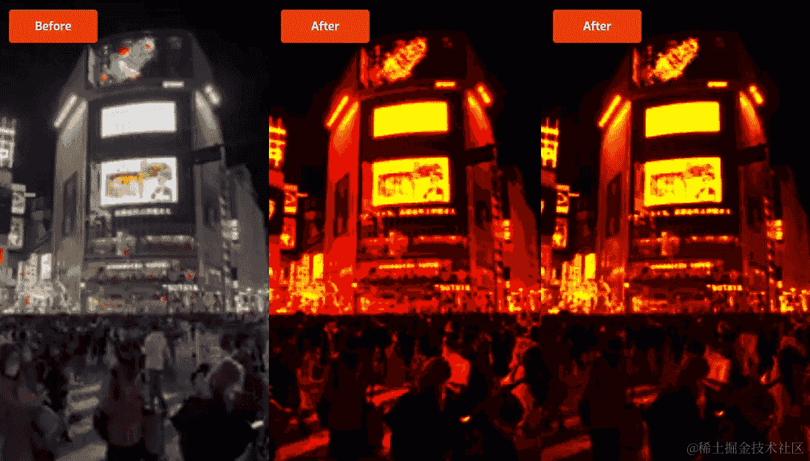

# 38-高级篇：SVG 滤镜的进阶之创建图像特效

**[SVG 滤镜](https://juejin.cn/book/7341630791099383835/section/7366549423746187273)** 提供了丰富的图像处理能力，而 **`<feComponentTransfer> 滤镜基元`** 是其中最具潜力的一个。它允许我们精细化控制图像的颜色分量，从而实现各种独特的图像效果。例如：

  


-   通过增强图像的对比度和饱和度，我们可以实现海报化图像效果，使图像看起来更加生动和引人注目
-   通过限制图像的颜色范围，并将其转换为两种主要的颜色，我们可以创建出双色调图像，营造出一种怀旧的氛围
-   通过增加图像中不同颜色通道之间的偏移量，我们可以实现3D色差故障图效果，使图像呈现出一种立体的错觉

  


不仅如此，`<feComponentTransfer>` 还可以模拟热成像效果，让图像充满科幻感，或者让图像变得模糊柔和，给人一种梦幻般的感觉。

  


在接下来的内容中，我们会从 `<feComponentTransfer>` 滤镜的基础开始，一步步地教大家如何运用这个滤镜来实现海报图像、双色调图像、热成像图像、3D色差故障图以及图像模糊等效果。我们会以实战方式进行，让大家更好地学习和掌握 `<feComponentTransfer>` 滤镜技术，为自己的 Web 项目带来更多的创意和惊喜！

  


准备好了吗？让我们一起开始吧！

  


## `<feComponentTransfer>` 简介

  


`<feComponentTransfer>` 是 SVG 滤镜中的一个滤镜基元，用于对图像的颜色分量（例如，红、绿、蓝和透明度）进行独立的非线性变换。换句话说，允许你修改像素中的 `R` 、`G` 、`B` 和 `A` 分量，通过对图像的每个颜色分量应用不同的函数，可以实现各种颜色效果，例如增加对比度、调整亮度、色彩平衡或阈值处理等。

  


通过对这些分量运行传递函数来修改颜色的 RGBA 分量。为此，每个分量都有自己的元素，称为“传递函数元素”。我们在这里称之为“分量元素”，即 `<feFuncR>` 、`<feFuncG>` 、`<feFuncB>` 和 `<feFuncA>` 。这些元素都都嵌套在 `<feComponentTransfer>` 滤镜基元内：

  


```XML
<feComponentTransfer in="SourceGraphic">
    <feFuncR type="identity" tableValues="0 1"/>
    <feFuncG type="identity" tableValues="0 1"/>
    <feFuncB type="identity" tableValues="0 1"/>
    <feFuncA type="identity" tableValues="0 1"/>
</feComponentTransfer>
```

  


通过对这些分量运行传递函数来修改 RGBA 分量。为此，每个分量都有自己的元素，称为传递函数元素。在本文中，我将这些元素称为“分量元素”——指的是各个 RGBA 分量的元素。这些元素嵌套在 `<feComponentTransfer>` 内。因此，`<feComponentTransfer>` 仅用于包含各个 RGBA 分量元素。RGBA 分量元素包括：`<feFuncR>`、`<feFuncG>`、`<feFuncB>` 和 `<feFuncA>` ，它们分别对应图像的红（`R`）、绿（`G`）、蓝（`B`）和透明度（`A`）通道。

  


每个“分量元素”都有一个 `type` 属性，主要用于定义要用来修改该分量的函数类型，常见的类型包括：

  


-   `identity`：恒等函数，不改变输入
-   `table`：使用查找表来映射输入到输出
-   `discrete`：将输入划分为多个区间，每个区间映射到一个离散的输出值
-   `linear`：线性转换，根据斜率（`slope`）和截距（`intercept`）将输入值进行线性变换来得到输出值
-   `gamma`：伽马校正，根振幅（`amplitude`）、指数（`exponent`）和偏移（`offset`）将输入值进行非线性的转换来得到输出值

  


简单地说，这些函数类型将用于修改源图形的 `R`、`G` 、`B` 和 `A` 颜色分量。在接下来的内容中将会介绍它们，并了解它们的使用方法：

  


```XML
<feComponentTransfer>
    <!-- RED 分量 -->
    <feFuncR type="identity | table | discrete | linear | gamma" />

    <!-- GREEN 分量 -->
    <feFuncG type="identity | table | discrete | linear | gamma" />

    <!-- BLUE 分量 -->
    <feFuncB type="identity | table | discrete | linear | gamma" />

    <!-- ALPHA 分量 -->
    <feFuncA type="identity | table | discrete | linear | gamma" />
</feComponentTransfer>
```

  


对于每种函数类型，存在一个或多个属性，允许你指定所用函数的更多细节。例如：

  


-   `identity` 函数类型不带任何属性设置
-   `table` 或 `discrete` 函数类型具有一个 `tableValues` 属性，定义了一个简单的查找表，每个颜色分量（`R`、`G`、`B`）都会从输入范围 `0 ~ 1` 映射到查找表中的值
-   `linear` 函数类型具有 `slope` 和 `intercept` 属性，`slope` 属性用于指定将用于修改所应用分量的线性函数的斜率；`intercept` 属性用于指定将用于修改所应用分量的线性函数的截距
-   `gamma` 函数类型具有 `amplitued` （它会使图像中亮色的区域变得更亮）、`exponent` （它会使图像中暗色的区域变得更暗）和 `offset` （它会为图像添加白色调，其值介于 `0 ~ 1` 之间）

  


  


你可以一次修改一个或多个分量元素。这意味着 `<feComponentTransfer>` 可以同时包含一个、两个、三个或所有的分量元素。你还可以独立地修改通道，对每个分量元素应用不同的函数。

  


  


> URL:https://yoksel.github.io/svg-gradient-map/#/

  


这意味着你可以在最低像素级别上对源图形的颜色进行极大的控制。例如，你可以选择通过将 `R` 和 `G` 通道映射到两种新颜色来修改它们，而保持 `B` 通道不变或者仅增加其强度。这种低级别的分量控制意味着你可以使用几行代码在浏览器中实现诸如 Photoshop 的功能:

  


  


这对于 Web 开发者来说，是多么令人兴奋的事情！

  


我们来看一个最简单的示例，假设你在 HTML 中，使用 `` 在 Web 上呈现一张 JPG 格式的位图：

  


```HTML

```

  


  


现在使用 `<feFuncA>` 来减少源图形的透明度：

  


```XML
<svg class="sr-only">
    <defs>
        <filter id="filter" color-interpolation-filters="sRGB">
            <feComponentTransfer in="SourceGraphic" result="componentTransfer">
                <feFuncA type="table" tableValues="0 0.5"></feFuncA>
            </feComponentTransfer>
        </filter>
    </defs>
</svg>
```

  


记得在 CSS 中使用 `filter` 属性引用 `<filter>` 定义的滤镜 `#filter`:

  


```CSS
img {
    filter: url("#filter");
}
```

  


此时，由 `<feComponentTransfer>` 滤镜基元定义的 `#filter` 滤镜应用到 `img` 上，它会将图像的不透明度降低到 `0.5` 。效果上看就像是 `img` 应用了 `opacity: 0.5` ：

  


  


> Demo 地址：https://codepen.io/airen/full/dyEzdbo

  


我们之前提到过，有五种不同的函数可以用来操作 RGBA 分量。在这个例子中，`<feFuncA>` 元素应用的是 `table` 函数类型，它将 `A` 通道分量的值映射到 `tableValues` 属性中提供的一系列值来工作。在这个示例中，它有两个值：`0` 和 `0.5` ，这相当于在告诉浏览器将输入的 Alpha 值范围（通常在 `[0,1]` 范围）映射到一个新的范围，即 `[0,0.5]` 范围。具体而言：

  


-   当输入值为 `0` 时，映射到查找表中的第一个值，即 `0`
-   当输入值为 `1` 时，映射到查找表中的最后一个值，即 `0.5`

  


查找表的中间值会通过线性插值法计算。例如，输入值为 `0.5` 时，映射到查找表中的中间值，即 `0.25` （在 `[0,0.5]` 之间线性插值得到）。

  


换句话说，这个设置的效果是将输入图像的透明度从 `[0,1]` 范围压缩到 `[0,0.5]` 范围。这意味着：

  


-   完全透明（`A = 0`）的部分仍然是完全透明
-   完全不透明 （`A = 1`）的部分将变成半透明（`A = 0.5`）
-   中间值（例如 `A = 0.5`）将被映射到更低的透明度（`A = 0.25`）

  


因此，在这个示例中，你看到的图像，其透明度就减少了一半。

  


上面所展示的是 `<feComponentTransfer>` 滤镜的一个基础用法，接下来，我们将通过一些具体的实例，来进一步向大家阐述 `<feComponentTransfer>`。

  


## 使用 `<feCompoentTransfer>` 制作海报化图像效果

  


在这节中，我们将重点介绍如何使用 `<feComponentTransfer>` 滤镜的 `discrete` 函数来制作海报化图像效果。

  


在开始之前，简单的介绍一下海报化图像效果是什么样的。

  


[维基百科](https://en.wikipedia.org/wiki/Posterization)是这么解释的：“海报化（Posterization）或海报化图像是指将连续的色调渐变转换为几个色调区域，每个区域有明显的色调变化。最初是通过摄影技术来制作海报化图像的。

  


海报化（Posterization）它是一种图像处理技术，用于减少图像中的颜色或灰度级别，从而产生一种分割明显的色块效果。其基本原理是将图像的颜色空间或灰度空间进行量化，即将连续的颜色或灰度级别减少到较少的级别。通过海报化，可以去除细微的颜色变化，保留图像的大体轮廓和主要色调，创造出一种抽象、艺术化的视觉效果。这种效果类似于将图像变成由有限颜色数目的色块构成的海报。

  


  


上图中左侧是原图效果，右侧手机框中的部分是通过海报化技术处理之后的效果。海报化效果会在整个图像中发生，但在色调变化微妙的区域最为明显。

  


在诸如 Photoshop 图像编辑软件中，[我们可以使用以下几个步骤来制作海报化图像效果](https://www.adobe.com/creativecloud/photography/discover/posterize-photo.html)：

  


-   选择要在 Photoshop 中进行海报化处理的图像
-   创建一个智能滤镜。从顶部菜单中选择“滤镜”，然后点击“转换为智能滤镜”。你可以添加、删除、调整或隐藏智能滤镜，这样你所做的任何编辑都是非破坏性的
-   海报化处理：在顶部菜单中，选择“图像” > “调整” > “海报化”
-   选择海报化级别：你可以在 `1 ~ 255`之间选择一个数值。这表示每个颜色通道中将出现的颜色数量。将滑块向左移动以减少颜色数量并实现海报化效果

  


我想你现在知道海报化图像是什么了？我们把焦点重新放到 `<feComponentTransfer>` 滤镜中来。

  


之前，我们提到过，`<feFunc*>` （`*` 表示的是 R 、G、B 和 A 之一 ）分量元素的 `type` 属性可以是 `discrete` 。该函数主要用于减少图像中的颜色数量（如果只有一个分量元素使用的话，就是减少该分量的颜色数量）。这意味着，图像中的颜色变化不再是平滑的线性渐变，而是更突然的颜色变化，将会导致图像看起来像是由颜色带或颜色簇组成的，从而产生类似海报的效果。

  


  


上图中右侧是使用 `discrete` 函数将其中的颜色数量减少到每个分量只有 `5` 个值。你可以看到，图像中的颜色变化不再是平滑的线性渐变，而是突然变化，形成了颜色带和颜色簇，使图像看起来更加“海报化”。

  


`discrete` 函数与 `table` 函数类似，接受在 `tableValues` 属性中提供的一系列值。它与 `table` 函数的不同之处在于它使用 `tableValues` 属性提供的一系列值的方式：

  


  


> 上图中内容来源于 SVG Filters 规范：https://www.w3.org/TR/filter-effects-1/#attr-valuedef-type-discrete

  


给我最初的感觉是，`table` 函数类型更像 [CSS 缓动函数中的 linear 关键词](https://juejin.cn/book/7288940354408022074/section/7297493957557092404)，而 `discrete` 函数类型更像 [CSS 缓动函数中的 steps() 函数](https://juejin.cn/book/7288940354408022074/section/7301594361152667698)。与线性函数相比，步进函数是从一个值跳到另一个值，而不是在它们之间线性移动。

  


这意味着，`discrete` 函数使用 `tableValues` 时，可以提供一个有限的值列表，浏览器将根据这个列表来映射颜色分量。由于提供的是一个有限值列表，最终将会得到有限数量的颜色，从而创建颜色带和颜色簇，这本来通常是线性渐变的颜色变化。

  


文字总是令人枯燥无味的，我们通过一个简单的示例代码来解释：

  


```XML
<svg class="sr-only">
    <defs>
        <filter id="filter" color-interpolation-filters="sRGB">
            <feComponentTransfer>
                <feFuncR type="discrete" tableValues="0 .5 1" />
            </feComponentTransfer>
        </filter>
    </defs>
</svg>
```

  


在这个示例中，我们应用了一个 `discrete` 函数来修改源图像中的红色通道（`<feFuncR>`）。它的 `tableValues` 属性提供了 `3` 个离散值（`tableValues="0 .5 1"`），让浏览器将红色值映射到这些值上。

  


  


> Demo 地址：https://codepen.io/airen/full/qBGXozK

  


在 SVG 滤镜中，分量值表示为 `[0,1]` 范围内的分数值。这意味着任何像素中的红色分量值可以是 `0` （即 `0%` 红色，也就是黑色），也可以是 `1` （即 `100%` 红色），或者介于它们之间的任何值（红色的不同深浅）。绿色、蓝色和 Alpha 通道亦是如此。

  


不管是 `table` 函数类型还是 `discrete` 函数类型，你都可以给 `tableValues` 提供 `n` 个值，浏览器将会创建 `n` 个范围。更具体地说，它会将 `[0,1]` 分成 `n` 个范围。然后，它会将落在这些范围内的颜色值映射到你提供的 `n` 个值。我们把这个逻辑应用到上面的示例中：

  


-   1️⃣：你在 `<feFuncR>` 分量元素的 `tableValues` 属性提供了三个值（`tableValues="0 .5 1"`），即 `n = 3` 。此时，浏览器将在 `tableValues` 中看到三个红色的离散值
-   2️⃣：浏览器将红色值在 `[0,1]` 范围内分成三个相等的范围，即 `[0,0.333]` 、`[0.333, 0.667]` 和 `[0.667, 1]`
-   3️⃣：接下来，浏览器检测图像中每个像素的当前红色值。对于每个像素，它确定该红色值属于哪个范围
-   4️⃣：然后，它将该红色值映射到你提供的个应的新值。即在 `[0,0.333]` 范围内的红色值会映射为 `0`，在 `[0.333,0.667]` 范围内的红色值会映射为 `0.5` ，在 `[0.667,1]` 范围内的红色值会映射为 `1`

  


这相当于你给图像的颜色设置了一个开关。当你为颜色提供离散值时，你告诉浏览器只有这些值会被打开，如果像素的值不等于这三个值中的一个，它应该被关闭并替换为这三个值中的一个。例如，`0.8` 的颜色值被为是关闭的，将被替换为 `1` ，因为它位于 `[0.667,1]` 范围内。

  


  


当浏览器遍历图像中的所有像素时，你将用 `tableValues` 中选择的少量值替换大量的红色值，从而用突然的颜色变化替代平滑的颜色变化，图像看起来像是由颜色簇或颜色带组成的。

  


注意，上面代码演示的仅是图像的红色通道，其他几个通道也是基于同样的原理。

  


```XML
<svg class="sr-only">
    <defs>
        <filter id="discreteR" color-interpolation-filters="sRGB">
            <feComponentTransfer in="SourceGraphic" result="DISCRETE_R">
                <feFuncR type="discrete" tableValues="0 .5 1" />
            </feComponentTransfer>
        </filter>
        
        <filter id="discreteG" color-interpolation-filters="sRGB">
            <feComponentTransfer in="SourceGraphic" result="DISCRETE_G">
                <feFuncG type="discrete" tableValues="0 .5 1" />
            </feComponentTransfer>
        </filter>
        
        <filter id="discreteB" color-interpolation-filters="sRGB">
            <feComponentTransfer in="SourceGraphic" result="DISCRETE_B">
                <feFuncB type="discrete" tableValues="0 .5 1" />
            </feComponentTransfer>
        </filter>
        
        <filter id="discreteA" color-interpolation-filters="sRGB">
            <feComponentTransfer in="SourceGraphic" result="DISCRETE_A">
                <feFuncA type="discrete" tableValues="0 .5 1" />
            </feComponentTransfer>
        </filter>
    </defs>
</svg>
```

  


  


> Demo 地址：https://codepen.io/airen/full/qBGXozK

  


需要知道的是，不管是更改离散值的数量还是更改值本身都将会影响到海报化图片的最终效果。另外，要是你想避免图像中出现任何黑色区域，那么就得尽可能得避免使用 `0` 值。我们来看下图这个效果：

  


  


> Demo 地址：https://codepen.io/airen/full/abryYYy

  


为了避免图像颜色太少，我们将同时使用 `<feFuncR>` 、`<feFuncG>` 和 `<feFuncB>` 三个分量元素，这样就可以避免因图像颜色太少失去过多的视觉效果：

  


```XML
<svg class="sr-only">
    <defs>
        <filter id="filter" color-interpolation-filters="sRGB">
            <feComponentTransfer in="SourceGraphic" result="componentTransfer">
                <feFuncR type="discrete" tableValues=".25 .4 .5 .75 1" />
                <feFuncG type="discrete" tableValues=".25 .4 .5 .75 1" />
                <feFuncB type="discrete" tableValues=".25 .4 .5 .75 1" />
            </feComponentTransfer>
        </filter>
    </defs>
</svg>
```

  


我想，你已经掌握了如何使用 `discrete` 函数类型，通过 `tableValues` 属性将图像中的颜色映射到我们提供的一系列颜色，制作出想要的海报化图像效果。接下来，我们来看看如何使用 `table` 函数类型，制作双色调图像效果。

  


## 使用 `<feCompoentTransfer>` 制作双色调图像效果

  


接下来，我们来看看如何使用 SVG 滤镜制作双色调图像效果。

  


与“海报化”类似，[双色调](https://en.wikipedia.org/wiki/Duotone)（“Duotone”）也是一种图像处理技术，它将图像转换为两种颜色的组合，而不是使用灰度或全色。通过双色调处理，图像可以获得独特的色彩和对比效果，使其在视觉上更具吸引力。这种技术广泛应用于印刷品、平面设计和艺术创作中：

  


  


现如今，这种技术也常用于 Web 网站或应用上的图片上。例如，Spotify 在 2015 年的“Year in Music”网站中采用了大胆的双色调图像处理技术，这一创意不仅提升了其品牌形象，还激发了全球创意工作者们的兴趣和灵感，引领了新一年的设计趋势。很可惜，今天我们无法打开这个网站，查看实际效果。

  


  


简单地说，这种技术是一种通过将一种颜色（传统上是黑色）与另一种颜色叠回来再现图像的半色调的方法。换句话说，较暗的色调会映射到图像的阴影部分，而较亮的色调会映射到图像的高光部分。

  


  


我们可以在 Photoshop 图形编辑器中按以下步骤创建了双色调效果：

  


-   **去色**：将图像去饱和度，变成灰度图
-   **映射灰度范围**：将灰度范围映射到一个新的范围，不再是两端的黑白，而是你想要使用的双色调效果的两种颜色。换句话说，你需要创建并使用一个灰度映射图，将灰度图映射到该图上。

  


  


请记住这两个步骤，因为这对于制作双色调图像效果非常关键。

  


在进入 SVG 中创建双色调图像效果之前，我先分享一下 [CSS 滤镜和混合模式](https://juejin.cn/book/7223230325122400288/section/7259669043622690853)是如何实现双色调图像效果的。

  


  


> [上图来自于 @una 的分享](https://x.com/Una/status/923231326420922368)

  


-   使用 `filter` 将图像转换为灰色，即 `filter:grayscale(100%) contrast(1)`
-   使用伪元素 `::before` 和 `::after` 分别定义两个颜色层，`::before` 位于图片上面，`::after` 位于图片底部，并且在伪元素 `::before` 和 `img` 上使用 `mix-blend-mode`

  


```HTML
<figure>
    
</figure>
```

  


实现双色调的关键性 CSS 代码：

  


```CSS
figure {
    --before-color: #f00e2e;
    --after-color: #192550;
    --before-blend: darken;
    --after-blend: lighten;
    
    img {
        filter:grayscale(100%) contrast(1);
        mix-blend-mode: var(--after-blend);
    }
    
    &::before {
        background-color: var(--before-color);
        mix-blend-mode: var(--before-blend);
    }
    
    &::after {
        background-color: var(--after-color);
    }
}
```

  


  


> Demo 地址：https://codepen.io/airen/full/vYwJrqW

  


你可能需要随着颜色的变化调整混合模式的类型，才有可能达到一个比较好的双色调图像效果。

  


与 SVG 滤镜不同之处是，使用 CSS 实现双色调图像效果，你是无法精细化控制图像上的颜色。接下来，我们来看看 SVG 滤镜又是如何实现双色调图像效果。

  


与 CSS 实现双色调图像效果类似，首先需要对图像源去色。我们可以使用之前介绍的 `<feColorMatrix> 滤镜基元`来实现。它允许你提供一个颜色矩阵来指定图像中的红（`R` ）、绿（`G`）和蓝（`B`）三种成分的比例。通过为这三种成分提供相同的比例，就可以将彩色图像转换为灰度版本：

  


```XML
<svg class="sr-only">
    <defs>
        <filter id="filter" color-interpolation-filters="sRGB">
            <!--    去色    -->
            <feColorMatrix  
                values="
                    0.33  0.33  0.33 0  0
                    0.33  0.33  0.33 0  0
                    0.33  0.33  0.33 0  0
                    0     0     0    1  0" 
                in="SourceGraphic" result="ASHEN" type="matrix" />
        </filter>
    </defs>
</svg>
```

  


  


注意，使用 `<feColorMatrix>` 将图像转换为灰度有多种方式，有关于这方面更详细的内容，[请移步阅读之前的课程](https://juejin.cn/book/7341630791099383835/section/7368318058076569638#heading-12)，这里不再重复阐述，或者阅读下面这个案例的源码：

  


  


> Demo 地址：https://codepen.io/airen/full/pomwWJq

  


正如你所看到的，经过 `<feColorMatrix>` 滤镜基元处理过的图像，基本上由灰色渐变组成。接下来，我们需要使用 `<feComponentTransfer>` 滤镜基元创建一个双色调渐变图来映射这个灰色渐变。

  


在 SVG 中，我们可以将 `<feComponentTransfer>` 滤镜基元的分量元素（`<feFunc*>`）的类型（`type`）设置为 `table` 函数，就可以创建渐变映射。

  


与之前介绍的 `discrete` 函数类型类似，当使用 `table` 函数类型时，我们也会在 `tableValues` 属性中提供颜色值列表。浏览器会使用我们提供的值列表将图像中的颜色映射到这些值。不过，浏览器映射颜色的方式与 `discrete` 函数类型有所不同。它不是将颜色范围映射到离散的颜色值，而是使用我们提供的值创建一个颜色范围，然后将输入范围映射到这个新范围。

  


假设我们想要使用 `#f00e2e` 和 `#192550` 两种颜色来创建我们的双色调图像效果：

  


  


这两种颜色将用于创建一个渐变映射：

  




  


我们将把灰度图映射到这个渐变映射上。

  




为了在 `<feComponentTransfer>` 中使用这些颜色，我们需要做一些简单的数学计算。首先，我们要获取 `#f00e2e` 和 `#192550` 颜色的各通道的值（即 `R` 、`G` 和 `B` 通道的值），并将这些值转换为分数，因为 `tableValues` 属性的值是以分数形式提供。

  


众所周知，颜色值通常在 `[0,255]` 范围内，要将这些值转换为分数，我们只需要将它们除以 `255` 即可。通常情况之下，我们可以使用 JavaScript 脚本来帮我们做这些转换工作：

  




  


> DEMO 地址：https://codepen.io/airen/full/jOoLvPM

  


借助上面的小工具，我们快速获得了 `#f00e2e` 和 `#192550` 颜色的 RGBA 值以及对应的分数值：

  


```
    #f00e2e      |      #192550
R: 240 (0.941)   |  R: 25 (0.098)
G: 14  (0.055)   |  G: 37 (0.145)
B: 46  (0.180)   |  B: 80 (0.314)
A: 1   (1.00)    |  A: 1  (1.00)
```

  


现在我们已经有了颜色值，可以开始创建我们的渐变映射了。正如我们之前提到的，当我们在使用 `table` 函数类型时，提供值给 `tabelValues` ，浏览器会使用 `tabelValues` 属性值创建一个范围。因此，我们从提供两种颜色的 RGBA 值作为分量元素的值开始：

  


```XML
<svg class="sr-only">
    <defs>
        <filter id="filter" color-interpolation-filters="sRGB">
            <!--    去色    -->
            <feColorMatrix  
                values="
                    0.33  0.33  0.33 0  0
                    0.33  0.33  0.33 0  0
                    0.33  0.33  0.33 0  0
                    0     0     0    1  0" 
                in="SourceGraphic" result="ASHEN" type="matrix" />
            <feComponentTransfer in="ASHEN" result="DUOTONE">
                <feFuncR type="table" tableValues="0.941  0.098" />
                <feFuncG type="table" tableValues="0.055  0.145" />
                <feFuncB type="table" tableValues="0.180  0.314" />
                <feFuncA type="table" tableValues="0      1" />
            </feComponentTransfer>
        </filter>
    </defs>
</svg>
```

  


在制作海报化图像效果过程中，我们知道了，当使用 `discrete` 函数时，浏览器会为 `tableValues` 中的 `n` 个值创建 `n` 个范围。当我们使用 `table` 函数时，浏览器会为 `n` 个值创建 `n-1` 个范围；由于我们为每个分量元素提供了两个 `tableValues` ，这意味着我们将得到一个范围（`[#f00e2e , #192550]`）:

  


  


现在 `feComponentTransfer` 将开始工作：浏览器会遍历源图像中的每一个像素。对于每个像素，它将获取RGBA 分量元素的值。由于我们的图像是灰度图，因此 R、G、B 值将在 `[0, 1]` 范围内（`0` 表示全黑，`1` 表示全白，中间为灰色）。然后，每个分量元素的值将映射到我们在 `tableValues` 中提供的新范围。因此：

  


-   `<feFuncR>` 元素的值值将映射到 `[0.941, 0.098]` 范围
-   `<feFuncG>` 元素的值将映射到 `[0.055, 0.145]` 范围
-   `<feFuncB>` 元素的值将映射到 `[0.180, 0.314]` 范围
-   `<feFuncA>` 元素的值将映射到 `[0,1]` 范围，我们并没有改变 A 通道的值

  


当浏览器遍历图像中的所有像素时，将用双色调渐变映射的 RGB 值替换灰度渐变中的所有 RGB 值。结果，图像变成了双色调。

  


  


> Demo 地址：https://codepen.io/airen/full/zYQdLNo

  


同样的，`tableValues` 值的数量和顺序都会影响最终的结果。我们把上面示例的颜色顺序互换一下：

  


```XML
<svg class="sr-only">
    <defs>
        <filter id="filter" color-interpolation-filters="sRGB">
            <!--    去色    -->
            <feColorMatrix values="
                0.33  0.33  0.33 0  0
                0.33  0.33  0.33 0  0
                0.33  0.33  0.33 0  0
                0     0     0    1  0" in="SourceGraphic" result="ASHEN" type="matrix" />
            <!-- 映射渐变色范围：[#192550, #f00e2e] -->
            <feComponentTransfer in="ASHEN" result="DUOTONE">
                <feFuncR type="table" tableValues="0.098  0.941" />
                <feFuncG type="table" tableValues="0.145  0.055" />
                <feFuncB type="table" tableValues="0.314  0.180" />        
                <feFuncA type="table" tableValues="0      1" />
            </feComponentTransfer>
        </filter>
    </defs>
</svg>
```

  


此时，你看到的效果如下：

  


  


> Demo 地址：https://codepen.io/airen/full/oNReJQK

  


你可以进一步扩展，不仅仅提供两个颜色值给渐变映射，而是提供三个颜色值给 `tableValues`，这样创建的渐变映射将包含三个颜色，而不是两个。例如 `[#F13088,#FAEF82,#FCF5B0]` 范围：

  


```
#F13088          |  #FAEF82          | #FCF5B0
R: 241 (0.945)   |  R: 250 (0.980)   | R: 252 (0.988)
G: 48  (0.188)   |  G: 239 (0.937)   | G: 245 (0.961)
B: 136 (0.533)   |  B: 130 (0.510)   | B: 176 (0.690)
A: 1   (1.00)    |  A: 1   (1.00)    | A: 1   (1.00)
```

  


  


将相应的值放入到分量元素中：

  


```XML
<svg class="sr-only">
    <defs>
        <filter id="filter" color-interpolation-filters="sRGB">
            <!--    去色    -->
            <feColorMatrix values="
                0.33  0.33  0.33 0  0
                0.33  0.33  0.33 0  0
                0.33  0.33  0.33 0  0
                0     0     0    1  0" in="SourceGraphic" result="ASHEN" type="matrix" />
            <!-- 映射渐变色范围：[#F13088,#FAEF82,#FCF5B0] -->
            <feComponentTransfer in="ASHEN" result="DUOTONE">
                <feFuncR type="table" tableValues="0.945 0.980  0.988" />
                <feFuncG type="table" tableValues="0.188 0.937  0.961" />
                <feFuncB type="table" tableValues="0.533 0.510  0.690" />        
                <feFuncA type="table" tableValues="0     1"            />
            </feComponentTransfer>
        </filter>
    </defs>
</svg>
```

  


上面代码得到的结果如下图所示：

  


  


> Demo 地址：https://codepen.io/airen/full/VwOzqoL

  


在这个基础上，你还可以把 [SVG 滤镜的 `<feBlend>` 滤镜基元](https://juejin.cn/book/7341630791099383835/section/7366549423746187273#heading-17)引入进来，为 `<feComponentTransfer>` 滤镜基元制作的双色调图像设置不同的混合模式。例如：

  


```XML
<svg class="sr-only">
    <defs>
        <filter id="filter" color-interpolation-filters="sRGB">
            <!--    去色    -->
            <feColorMatrix values="
                0.33  0.33  0.33 0  0
                0.33  0.33  0.33 0  0
                0.33  0.33  0.33 0  0
                0     0     0    1  0" in="SourceGraphic" result="ASHEN" type="matrix" />
            <!-- 映射渐变色范围：[#F13088,#FAEF82,#FCF5B0] -->
            <feComponentTransfer in="ASHEN" result="DUOTONE">
                <feFuncR type="table" tableValues="0.945 0.980  0.988" />
                <feFuncG type="table" tableValues="0.188 0.937  0.961" />
                <feFuncB type="table" tableValues="0.533 0.510  0.690" />        
                <feFuncA type="table" tableValues="0     1"            />
            </feComponentTransfer>
            <feBlend mode="overlay" in="DUOTONE" in2="SourceGraphic" result="BLEND" />
        </filter>
    </defs>
</svg>
```

  


  


> Demo 地址：https://codepen.io/airen/full/QWRMYbQ

  


你可能和我有同样的感觉，使用 `table` 函数类型制作的双色调图像效果，有时候并不像我们想象的那么“生动”：

  


  


> Demo 地址：https://codepen.io/airen/full/VwOzqoL

  


在这种情况之下，我们可以考虑使用 `gamma` 函数类型来调整图片颜色对比度和强度。

  


`gamma` 函数是分量元素的另一个函数类型，使用 `gmma` 函数类型，我们能够对源图像执行伽马校正。伽马校正是控制图像亮度水平的函数。`gamma` 函数类型有三个属性：`amplitude` 、`exponent` 和`offset` 。它们结合起来形成以下传输函数：

  


```
C′=amplitude × pow(C,exponent) + offset
```

  


-   **`C`**：输入值，通常是介于 `0 ~ 1` 之间的颜色通道值
-   **`amplitude`**：振幅，用于缩放结果值
-   **`exponent`**：指数，用于进行非线性变换的幂次
-   **`offset`**：偏移量，用于平移结果值

  


伽马校正可以用来控制图像的整体对比度。增加指数（`exponent`）会使较暗的区域更暗，而增加振幅（`amplitude`）会使较亮的区域更亮，从而增加图像的整体对比度。偏移（`offset`）用于增加每个分量元素的强度，也会影响整体图像：既有亮点也有暗点。

  


简单地说，伽马校正通过调整颜色的非线性响应，使得图像显示在不同的设备上时，亮度和对比度更加一致。对于人眼来说，这可以使图像看起来更自然和真实。

  


例如，我们在上面示例的基础上，使用 `gamma` 函数类型给图像增加一些对比度，使其看起来更生动。

  


```XML
<svg class="sr-only">
    <defs>
        <!-- 未使用伽马校正的滤镜 --> 
        <filter id="filter1" color-interpolation-filters="sRGB">
            <!--    去色    -->
            <feColorMatrix values="
                0.33  0.33  0.33 0  0
                0.33  0.33  0.33 0  0
                0.33  0.33  0.33 0  0
                0     0     0    1  0" in="SourceGraphic" result="ASHEN" type="matrix" />
            <feComponentTransfer in="ASHEN" result="DUOTONE">
                <feFuncR type="table" tableValues="0.945 0.980  0.988" />
                <feFuncG type="table" tableValues="0.188 0.937  0.961" />
                <feFuncB type="table" tableValues="0.533 0.510  0.690" />
                <feFuncA type="table" tableValues="0     1" />
            </feComponentTransfer>
        </filter>
        
        <!-- 使用伽马校正的滤镜 -->
        <filter id="filter2" color-interpolation-filters="sRGB">
            <!--    去色    -->
            <feColorMatrix values="
                0.33  0.33  0.33 0  0
                0.33  0.33  0.33 0  0
                0.33  0.33  0.33 0  0
                0     0     0    1  0" in="SourceGraphic" result="ASHEN" type="matrix" />
            <feComponentTransfer in="ASHEN" result="DUOTONE">
                <feFuncR type="table" tableValues="0.945 0.980  0.988" />
                <feFuncG type="table" tableValues="0.188 0.937  0.961" />
                <feFuncB type="table" tableValues="0.533 0.510  0.690" />
                <feFuncA type="table" tableValues="0     1" />
            </feComponentTransfer>
            <!-- 稍微增加振幅和指数 -->
            <feComponentTransfer in="DUOTONE" result="GAMMA">
                <feFuncR type="gamma" exponent="1.5" amplitude="1.3" offset="0" />
                <feFuncG type="gamma" exponent="1.5" amplitude="1.3" offset="0" />
                <feFuncB type="gamma" exponent="1.5" amplitude="1.3" offset="0" />
            </feComponentTransfer>
        </filter>
    </defs>
</svg>
```

  


  


> Demo 地址：https://codepen.io/airen/full/JjqyxXP

  


上图的中间图像效果是未使用 `gamma` 函数的双色调图像效果，最右侧是使用了 `gamma` 函数的双色调图形效果。很明显，使用了 `gamma` 函数的类型的双色调图像，它的亮区更亮，暗区更暗。

  


在使用 `gamma` 函数来调整双色调图像效果时，我们还可以考虑先对灰度图像做伽马校正，因为它控制黑白图像的对比度时最有用。

  


```XML
<svg class="sr-only">
    <defs>
        <!-- 未使用伽马校正的滤镜 -->
        <filter id="filter1" color-interpolation-filters="sRGB">
            <!--    去色    -->
            <feColorMatrix values="
                0.33  0.33  0.33 0  0
                0.33  0.33  0.33 0  0
                0.33  0.33  0.33 0  0
                0     0     0    1  0" in="SourceGraphic" result="ASHEN" type="matrix" />
        </filter>
        
        <!-- 使用了伽马校正的滤镜 -->
        <filter id="filter2" color-interpolation-filters="sRGB">
            <!--    去色    -->
            <feColorMatrix values="
                0.33  0.33  0.33 0  0
                0.33  0.33  0.33 0  0
                0.33  0.33  0.33 0  0
                0     0     0    1  0" in="SourceGraphic" result="GRAYSCALE" type="matrix" />
            <feComponentTransfer in="GRAYSCALE" result="GAMMA">
                <feFuncR type="gamma" exponent="1.5" amplitude="1.3" offset="0" />
                <feFuncG type="gamma" exponent="1.5" amplitude="1.3" offset="0" />
                <feFuncB type="gamma" exponent="1.5" amplitude="1.3" offset="0" />
            </feComponentTransfer>
        </filter>
    </defs>
</svg>
```

  


  


> Demo 地址：https://codepen.io/airen/full/BaedMwJ

  


效果差异很明显。

  


我尝试着在经过伽马校正的灰度图像上再使用 `<feCompoentTransfer>` 滤镜设置双色调效果：

  


```XML
<svg class="sr-only">
    <defs>
        <filter id="filter1" color-interpolation-filters="sRGB">
            <!--    去色    -->
            <feColorMatrix values="
                0.33  0.33  0.33 0  0
                0.33  0.33  0.33 0  0
                0.33  0.33  0.33 0  0
                0     0     0    1  0" in="SourceGraphic" result="GRAYSCALE" type="matrix" />
            <feComponentTransfer in="GRAYSCALE" result="DUOTONE">
                <feFuncR type="table" tableValues="0.945 0.980  0.988" />
                <feFuncG type="table" tableValues="0.188 0.937  0.961" />
                <feFuncB type="table" tableValues="0.533 0.510  0.690" />
                <feFuncA type="table" tableValues="0     1" />
            </feComponentTransfer>
            <feComponentTransfer in="DUOTONE" result="GAMMA">
                <feFuncR type="table" tableValues="0.945 0.980  0.988" />
                <feFuncG type="table" tableValues="0.188 0.937  0.961" />
                <feFuncB type="table" tableValues="0.533 0.510  0.690" />
                <feFuncA type="table" tableValues="0     1" />
            </feComponentTransfer>
        </filter>

        <filter id="filter2" color-interpolation-filters="sRGB">
            <!--    去色    -->
            <feColorMatrix values="
              0.33  0.33  0.33 0  0
              0.33  0.33  0.33 0  0
              0.33  0.33  0.33 0  0
              0     0     0    1  0" in="SourceGraphic" result="GRAYSCALE" type="matrix" />
    
            <feComponentTransfer in="GRAYSCALE" result="GAMMA">
                <feFuncR type="gamma" exponent="1.5" amplitude="1.3" offset="0" />
                <feFuncG type="gamma" exponent="1.5" amplitude="1.3" offset="0" />
                <feFuncB type="gamma" exponent="1.5" amplitude="1.3" offset="0" />
            </feComponentTransfer>
            <feComponentTransfer in="GAMMA" result="DUOTONE">
                <feFuncR type="table" tableValues="0.945 0.980  0.988" />
                <feFuncG type="table" tableValues="0.188 0.937  0.961" />
                <feFuncB type="table" tableValues="0.533 0.510  0.690" />
                <feFuncA type="table" tableValues="0     1" />
            </feComponentTransfer>
        </filter>
    </defs>
</svg>
```

  


  


> Demo 地址：https://codepen.io/airen/full/eYaEXmN

  


请留意观察两个滤镜的最终结果。前者是应用双色调之后再进行伽马校正，后者是先进行伽马校正，再应用双色调。最终结果是有明显的差异。你更喜欢哪个效果呢？

  


当然，你可能想要做相反的事情：而不是增加对比度，你可能想要稍微亮化暗区，在这种情况下，你可以减少振幅（`exponent`）和（或）指数（`amplitude`），而不是增加它们：

  


```XML
<svg class="sr-only">
    <defs>
        <filter id="filter1" color-interpolation-filters="sRGB">
            <!--    去色    -->
            <feColorMatrix values="
                0.33  0.33  0.33 0  0
                0.33  0.33  0.33 0  0
                0.33  0.33  0.33 0  0
                0     0     0    1  0" in="SourceGraphic" result="GRAYSCALE" type="matrix" />
            <feComponentTransfer in="GRAYSCALE" result="DUOTONE">
                <feFuncR type="table" tableValues="0.945 0.980  0.988" />
                <feFuncG type="table" tableValues="0.188 0.937  0.961" />
                <feFuncB type="table" tableValues="0.533 0.510  0.690" />
                <feFuncA type="table" tableValues="0     1" />
            </feComponentTransfer>
            <feComponentTransfer in="DUOTONE" result="GAMMA">
                <feFuncR type="gamma" exponent=".5" amplitude=".3" offset="0.2" />
                <feFuncG type="gamma" exponent=".5" amplitude=".3" offset="0.2" />
                <feFuncB type="gamma" exponent=".5" amplitude=".3" offset="0.2" />
            </feComponentTransfer>
        </filter>
        
        <filter id="filter2" color-interpolation-filters="sRGB">
            <!--    去色    -->
            <feColorMatrix values="
                0.33  0.33  0.33 0  0
                0.33  0.33  0.33 0  0
                0.33  0.33  0.33 0  0
                0     0     0    1  0" in="SourceGraphic" result="GRAYSCALE" type="matrix" />
    
            <feComponentTransfer in="GRAYSCALE" result="GAMMA">
                <feFuncR type="gamma" exponent=".5" amplitude=".3" offset="0.2" />
                <feFuncG type="gamma" exponent=".5" amplitude=".3" offset="0.2" />
                <feFuncB type="gamma" exponent=".5" amplitude=".3" offset="0.2" />
            </feComponentTransfer>
            <feComponentTransfer in="GAMMA" result="DUOTONE">
                <feFuncR type="table" tableValues="0.945 0.980  0.988" />
                <feFuncG type="table" tableValues="0.188 0.937  0.961" />
                <feFuncB type="table" tableValues="0.533 0.510  0.690" />
                <feFuncA type="table" tableValues="0     1" />
            </feComponentTransfer>
        </filter>
    </defs>
</svg>
```

  


  


> Demo 地址：https://codepen.io/airen/full/OJYjqyo

  


上面我们所展示的，都是 `<feCompoentTransfer>` 滤镜制作双色调图像效果。其实，它制作的双色调，甚至是多色调滤镜效果并不局限于图片上使用，你要是有需要，可以用于任何元素之上，例如视频：

  




  


> Demo 地址：https://codepen.io/airen/full/MWdvxjw

  


有关于双色调图像效果的制作，我们就聊到这里了。在结束这个话题之前，向你推荐[ @Yoksel 制作的一款可视化工具](https://yoksel.github.io/svg-gradient-map/#/)，该工具允许你上传图像并应用不同的双色调（甚至三色调）效果，并生成可供你随时使用的 SVG 滤镜代码：

  


  


> URL:https://yoksel.github.io/svg-gradient-map/#/

  


这是一款很棒的工具，通过它你可以了解更多关于 `<feComponentTransfer>` 滤镜基元的知识。我建议你花点时间玩一下这款工具，看看你选择的效果如何改变底层代码，因为这是了解更多关于 SVG 滤镜的最佳方式之一。

  


## 使用 `<feCompoentTransfer>` 制作热成像图

  


  


[热成像图](https://en.wikipedia.org/wiki/Heat_map)（Heat map），也称为热图，是一种数据可视化技术，用颜色来表示数据的不同值。它通常用于展示大规模数据集的模式、变化和异常情况，使观察者可以迅速识别出高频率或显著变化的区域。热图广泛应用于各种领域，如统计分析、金融、市场研究、网络分析和生物医学等。

  


接下来，我们来介绍如何使用 `<feCompoentTransfer>` 来制作热成像。当然，在整个效果我们还会应用到其他的一些滤镜基元，比如[高斯模糊 `<feGaussianBlur>`](https://juejin.cn/book/7341630791099383835/section/7366549423746187273#heading-4) 。

  


使用 SVG 滤镜制作热成像的过程与使用 `<feCompoentTransfer>` 滤镜基元制作双色调或多色调图像效果是相似的，只是在这个过程中我们会使用到高斯模糊滤镜基元。整个制作过程大致为分以下几个步骤：

  


-   1️⃣：使用 `<feColorMatrix>` 滤镜基元将图像转换为灰度图像
-   2️⃣：使用 `<feComponentTransfer>` 滤镜基元的 `gamma` 函数类型，对灰度图像进行伽马校正。这个过程不是必备的
-   3️⃣：使用 `<feGaussianBlur>` 滤镜基元使灰度图像变得模糊
-   4️⃣：使用 `<feComponentTransfer>` 滤镜基元的 `table` 函数类型，将多色调应用于图像上

  


经过以上几步，你就能获得类似下图这样的热成像图：

  


  


> Demo 地址：https://codepen.io/airen/full/XWwaGeN

  


第 1️⃣ 和 2️⃣ 很好理解，我们在介绍双色调图像效果的时候，已做过详细阐述。在这里，我就直接上代码：

  


```XML
<svg class="sr-only">
    <defs>
        <filter id="filter" color-interpolation-filters="sRGB">
          <!-- 1️⃣ ：去色    -->
          <feColorMatrix values="
              0.33  0.33  0.33 0  0
              0.33  0.33  0.33 0  0
              0.33  0.33  0.33 0  0
              0     0     0    1  0" in="SourceGraphic" result="GRAYSCALE" type="matrix" />
          <!-- 2️⃣：伽马校正，使亮色变得更亮，暗色变得更暗 -->
          <feComponentTransfer in="GRAYSCALE" result="GAMMA">
              <feFuncR type="gamma" exponent="1.5" amplitude="1.3" offset="0" />
              <feFuncG type="gamma" exponent="1.5" amplitude="1.3" offset="0" />
              <feFuncB type="gamma" exponent="1.5" amplitude="1.3" offset="0" />
          </feComponentTransfer>
        </filter>
    </defs>
</svg>
```

  


  


在这里着重介绍一下第三步——高斯模糊。

  


在制作热成像过程中使用高斯模糊滤镜基元（`<feGaussianBlur>` ），主要是可以使整个热成像看起来更加连贯。换句话说，我们通过高斯模糊，可以减少数据中的噪声，使得热图更加清晰，看起来更美观和易于理解。

  


在 SVG 滤镜中，高斯模糊（`<feGaussianBlur>` ）滤镜基元相对较为简单，通常情况之下，你只需要通过 `stdDeviation` 属性调整模糊程度即可。值越大，模糊效果越强。

  


```XML
<svg class="sr-only">
    <defs>
        <filter id="filter" color-interpolation-filters="sRGB">
            <!-- 1️⃣ ：去色    -->
            <feColorMatrix values="
                0.33  0.33  0.33 0  0
                0.33  0.33  0.33 0  0
                0.33  0.33  0.33 0  0
                0     0     0    1  0" in="SourceGraphic" result="GRAYSCALE" type="matrix" />
            <!-- 2️⃣：伽马校正，使亮色变得更亮，暗色变得更暗 -->
            <feComponentTransfer in="GRAYSCALE" result="GAMMA">
                <feFuncR type="gamma" exponent="1.5" amplitude="1.3" offset="0" />
                <feFuncG type="gamma" exponent="1.5" amplitude="1.3" offset="0" />
                <feFuncB type="gamma" exponent="1.5" amplitude="1.3" offset="0" />
            </feComponentTransfer>
            <!-- 3️⃣: 应用高斯模糊 -->
            <feGaussianBlur stdDeviation="10" in="GAMMA" edgeMode="duplicate" result="BLUR" />
        </filter>
    </defs>
</svg>
```

  


注意，上面代码中除了设置模糊程度之外，还将 `edgeMode` 属性设置为 `duplicate` 。这样一来，在处理图像边缘时会复制边缘像素值，以避免出现边缘效应，使模糊效果看起来更加自然。

  


  


最后一步，则是再次使用 `<feCompoentTransfer>` 滤镜，使其分量元素按照 `table` 函数类型将灰度图片映射到你所指定的颜色范围。在这里，为了使整个热成像图变得酷酷的，我给 `tableValues` 设置了多个颜色：

  


```
黑色： #000000  | 海军蓝： #20008c  |  粉红色： #cc0077  |  橙黄色：#ffd700   | 白色： #ffffff
R: 0  (0.000)  | R: 32  (0.125)   |  R: 204 (0.800)   |  R: 255 (1.000)  | R: 255 (1.000)
G: 0  (0.000)  | G: 0   (0.000)   |  G: 0   (0.000)   |  G: 215 (0.843)  | G: 255 (1.000)
B: 0  (0.000)  | B: 140 (0.549)   |  B: 119 (0.467)   |  B: 0   (0.000)  | B: 255 (1.000)
A: 1  (1.00)   | A: 1   (1.00)    |  A: 1   (1.00)    |  A: 1   (1.00)   | A: 1 (1.00)
```

  


这将些值应用到 `<feCompoentTransfer>` 滤镜基元的分量元素的 `tableValues` 属性中，整个滤镜的代码如下：

  


```XML
<svg class="sr-only">
    <defs>
        <filter id="filter" color-interpolation-filters="sRGB">
            <!-- 1️⃣ ：去色    -->
            <feColorMatrix values="
                0.33  0.33  0.33 0  0
                0.33  0.33  0.33 0  0
                0.33  0.33  0.33 0  0
                0     0     0    1  0" in="SourceGraphic" result="GRAYSCALE" type="matrix" />
            
            <!-- 2️⃣：伽马校正，使亮色变得更亮，暗色变得更暗 -->
            <feComponentTransfer in="GRAYSCALE" result="GAMMA">
                <feFuncR type="gamma" exponent="1.5" amplitude="1.3" offset="0" />
                <feFuncG type="gamma" exponent="1.5" amplitude="1.3" offset="0" />
                <feFuncB type="gamma" exponent="1.5" amplitude="1.3" offset="0" />
            </feComponentTransfer>
          
            <!-- 3️⃣: 应用高斯模糊 -->
            <feGaussianBlur stdDeviation="10" in="GAMMA" edgeMode="duplicate" result="BLUR" />
    
            <!-- 4️⃣: 灰度范围映射到渐变颜色范围 -->
            <feComponentTransfer in="BLUR" result="HEATMAP">
                <feFuncR type="table" tableValues="0  0.125  0.8    1      1" />
                <feFuncG type="table" tableValues="0  0      0      0.843  1" />
                <feFuncB type="table" tableValues="0  0.549  0.467  0      1" />
                <feFuncA type="table" tableValues="0  1" />
            </feComponentTransfer> 
        </filter>
    </defs>
</svg>
```

  


就是这么简单，最终你看到的热成像图的效果如下：

  


  


> Demo 地址：https://codepen.io/airen/full/XWwaGeN

  


当然，你要是原意，你还可以在新增 `<feCompoentTransfer>` 滤镜，对热成像图做进一步的处理，例如反向操作：

  


  


> Demo 地址：https://codepen.io/airen/full/QWRMPjE

  


你也可以将该滤镜应用于文本上：

  


```CSS
h3 {
    background-image: radial-gradient( farthest-corner circle at 50% 50% in oklab, oklch(100% 0 0) 0%, oklch(0% 0 0) 100%);
    filter: url("#filter") ;
    mix-blend-mode: lighten;
}
```

  


  


> Demo 地址：https://codepen.io/airen/full/xxNLeZz

  


## 使用 `<feCompoentTransfer>` 制作模糊图像效果

  


  


首先要声明，这里所说的模糊图像不是普通的模糊图像，它有一个高大上的名称——Dreamy Blur（梦幻的模糊）。“Dreamy Blur”图像效果是一种通过模糊和柔化图像边缘来创建一种柔和、梦幻般氛围的图像处理技术。这种效果常用于摄影、设计和电影中，以增加画面的浪漫、神秘或超现实的感觉。

  


在介绍使用 SVG 滤镜制作“Dreamy Blur”图像效果之前，先向大家展示几种 CSS 实现的效果。

  


```HTML
<figure class="filter">
    
    
</figure>

<figure  class="backdrop-filter">
    
</figure>

<figure class="backdrop-filter-mask">
    
</figure>
```

  


```CSS
.filter {
    position: relative;
    
    .blur {
        position: absolute;
        inset: 0;
        filter: blur(3px) opacity(0.5) brightness(1.3);
    }
}

.backdrop-filter {
    position: relative;
    
    &::after {
        content: "";
        position: absolute;
        inset: 0;
        backdrop-filter: blur(3px) opacity(0.5) brightness(1.3);
    }
}
  
.backdrop-filter-mask {
    position: relative;

    &::after {
        content: "";
        position: absolute;
        inset: 0;
        backdrop-filter: blur(3px) opacity(0.5) brightness(1.3);
        mask: radial-gradient(circle at 50% 67%, #0006, #000 50%);
    }
}
```

  


上面的 CSS 代码很简单，主要都是 CSS 中处理图像的一些特性，比如[滤镜`filter` 和 `background-filter`](https://juejin.cn/book/7223230325122400288/section/7259669043622690853) 和[遮罩 `mask`](https://juejin.cn/book/7223230325122400288/section/7259668885224456252) 等。这个时候，图像效果如下：

  


  


> Demo 地址：https://codepen.io/airen/full/dyEzLgx

  


我们的重点是使用 SVG 滤镜来制作“Dreamy Blur”图像效果。制作该效果，将会用到 `<feGaussianBlur>` 、`<feComponentTransfer>` 和 `<feBlend>` 三个滤镜基元。

  


首先，我们使用 `<feGaussianBlur>` 滤镜基元例源图像变得模糊：

  


```XML
<svg class="sr-only">
    <defs>
        <filter id="filter" color-interpolation-filters="sRGB">
            <!-- 克隆源图像，并使其模糊 -->
            <feGaussianBlur stdDeviation="3" in="SourceGraphic" result="BLUR" />
        </filter>
    </defs>
</svg>
```

  


  


接着使用 `<feComponentTransfer>` 滤镜基元继续调整高斯模糊的结果，使其半透明并稍微更亮：

  


```XML
<svg class="sr-only">
    <defs>
        <filter id="filter" color-interpolation-filters="sRGB">
            <!-- 克隆源图像，并使其模糊 -->
            <feGaussianBlur stdDeviation="3" in="SourceGraphic" result="BLUR" />
            <!-- 使图像半透明并稍微更亮 -->
            <feComponentTransfer in="BLUR" result="LINEAR">
                <feFuncR type="linear" slope="1.3" />
                <feFuncG type="linear" slope="1.3" />
                <feFuncB type="linear" slope="1.3" />
                <feFuncA type="linear" slope=".5" />
            </feComponentTransfer>
        </filter>
    </defs>
</svg>
```

  


注意，上面代码中的 `<feComponentTransfer>` 滤镜基元的分量元素与前面所展示的示例有所不同，在这里使用的是 `linear` 函数类型，与 `table` 或 `discrete` 函数类型相比，该函数类型要简单地多。

  


`linear` 函数类型表示应用一个线性函数来调整图像的 RGBA 通道。通过设置 `slope` (斜率)和 `intercept` （截距）属性，可以精确控制颜色和透明度的转换方式：

  


```
C′=slope × C + intercept
```

  


其中：

  


-   `C` 是输入值（通常是颜色通道的值，范围在 `[0,1]` 之间
-   `C′` 是输出值
-   `slope` 是斜率，决定了输入值如何被放大或缩小
-   `intercept` 是截距，决定了在输入值为 `0` 时输出值的基线偏移量

  


在我们这个示例中， R、G、B 三个颜色通道的 `slope` 都设置为 `1.3` ，这意味着图像的颜色会被增强。原本颜色的亮度会增加，图像整体看起来就会更亮、更鲜艳。与此同时，透明通道的 `slope` 设置为 `0.5` ，表示图像的透明度会减半。

  


  


最后，使用 `<feBlend>` 滤镜基元将转换后的结果与原始图像合并：

  


```XML
<svg class="sr-only">
    <defs>
        <filter id="filter" color-interpolation-filters="sRGB">
            <feGaussianBlur stdDeviation="3" in="SourceGraphic" result="BLUR" />
            <feComponentTransfer in="BLUR" result="LINEAR">
                <feFuncR type="linear" slope="1.3" />
                <feFuncG type="linear" slope="1.3" />
                <feFuncB type="linear" slope="1.3" />
                <feFuncA type="linear" slope=".5" />
            </feComponentTransfer>
            <feBlend in="LINEAR" in2="SourceGraphic" />
          </filter>
    </defs>
</svg>
```

  


注意，在这个示例中 `<feBlend>` 采用的是 `normal` 混合方式（默认值），如果你想使用其他的混合模式，只需要设置 `<feBlend>` 的 `mode` 值即可。

  


最终的效果如下：

  


  


> Demo 地址：https://codepen.io/airen/full/qBGXGBe

  


在这里，我们探讨了一种通过 CSS 和 SVG 创建“Dreamy Blur”图像效果的方法。这些技术可以用来增强图像的视觉吸引力，为 Web 和 应用程序添加更多的艺术元素。

  


最后，可以将 SVG 滤镜实现的效果与 CSS 实现的效果对比一下，看看哪种效果最符合你的期望：

  


  


> Demo 地址：https://codepen.io/airen/full/Baededm

  


## 使用 `<feCompoentTransfer>` 制作噪声纹理

  


上面的示例中提到了， `<feCompoentTrnsfer>` 滤镜基元的分量元素的函数类型为 `linear` 时，可以线性调整图形 RGBA 通道的值。那就顺着这个话题继续往下。

  


在 SVG 中，我们可以使用 `<feCompoentTransfer>` 、`<feColorMatrix>` 和 `<feTurbulence>` 等滤镜基元制作噪声纹理图像。

  


```XML
<svg class="sr-only">
    <defs>
        <filter id="filter"  color-interpolation-filters="sRGB">
            <feTurbulence type="fractalNoise" baseFrequency="0.24" numOctaves="9" stitchTiles="stitch" in="SourceGraphic" result="NOISE-TEXTURE_10"/>
            <feColorMatrix type="saturate" values="0" in="NOISE-TEXTURE_10" result="NOISE-TEXTURE_20"/>
            <feComponentTransfer in="NOISE-TEXTURE_20" result="NOISE-TEXTURE_30">
                <feFuncR type="linear" slope="0.49" />
                <feFuncG type="linear" slope="0.49" />
                <feFuncB type="linear" slope="0.49" />
                <feFuncA type="linear" slope="0.9" />
            </feComponentTransfer>
            <feComponentTransfer in="NOISE-TEXTURE_30" result="NOISE-TEXTURE_40">
                <feFuncR type="linear" slope="2.34" intercept="-0.67"/>
                <feFuncG type="linear" slope="2.34" intercept="-0.67"/>
                <feFuncB type="linear" slope="2.34" intercept="-0.67"/>
             </feComponentTransfer>
        </filter>
    </defs>
</svg>
```

  


  


> Demo 地址：https://codepen.io/airen/full/vYwJqZj

  


你可以尝试着在 [@ctushr 提供的工具](https://noice.vercel.app/)上调整相关的参数，获得不一样的噪声纹理效果：

  


  


> URL:https://noice.vercel.app/

  


SVG 滤镜制作的噪声纹理图形，可以用于任何地方，例如用它来填充文本，使文本具有纹理效果：

  


```XML
<svg class="sr-only">
    <defs>
        <filter id="filter" color-interpolation-filters="sRGB">
            <feTurbulence type="fractalNoise" baseFrequency="0.28 0.28" numOctaves="4" stitchTiles="stitch" in="SourceGraphic" result="NOISE-TEXTURE_10" />
            <feColorMatrix type="saturate" values="0" in="NOISE-TEXTURE_10" result="NOISE-TEXTURE_20" />
            <feMorphology operator="dilate" radius="6" in="SourceAlpha" result="STROKE_10" />
            <feComposite in="STROKE_10" in2="SourceGraphic" operator="out" result="BEVEL_10" />
            <feComponentTransfer in="BEVEL_10" result="BEVEL_20">
                <feFuncR type="linear" slope="0.46" />
                <feFuncG type="linear" slope="0.46" />
                <feFuncB type="linear" slope="0.46" />
                <feFuncA type="linear" slope="0.73" />
            </feComponentTransfer>
            <feComponentTransfer in="BEVEL_20" result="BEVEL_30">
                <feFuncR type="linear" slope="2.31" intercept="-0.66" />
                <feFuncG type="linear" slope="2.31" intercept="-0.66" />
                <feFuncB type="linear" slope="2.31" intercept="-0.66" />
            </feComponentTransfer>
            <feComposite in="BEVEL_30" in2="SourceGraphic" operator="in" result="BEVEL_40" />
            <feMerge result="BEVEL_50">
                <feMergeNode in="BEVEL_40" />
                <feMergeNode in="SourceGraphic" />
            </feMerge>
            <feComposite operator="out" in="BEVEL_50" in2="NOISE-TEXTURE_20" result="RESULT" />
        </filter>
    </defs>
</svg>
```

  


上面代码就不详细阐述了，[因为这个过程与之前介绍 SVG 滤镜给文本添加描边效果是相似的](https://juejin.cn/book/7341630791099383835/section/7368318146262138889)。最终的效果如下：

  


  


> Demo 地址：https://codepen.io/airen/full/QWRMRxZ

  


## 使用 `<feCompoentTransfer>` 制作 3D色差故障图效果

  


  


故障效果（Glitch Effect）是一种艺术运动，通常指图像或视频中的数字干扰效果，它模拟了数字错误或数据破损时的视觉特征，通常包含颜色偏移、条纹，块状噪声和图像扭曲等元素。这种效果在现代设计和艺术作品中被广泛应用，用于创造一种故障、科技感或未来主义的视觉体验。[Emma 网站上的图片就应用了这种效果](https://emmabodger.com/)：

  


  


故障效果的制作原理还是比较简单的。通过将图像或视频的R、G 和 B 通道（或红色和青色）分离并相互偏移来实现此效果。其结果是一种迷幻、故障的效果，使图像或视频看起来好像在移动或分离。

  


这刚好是 `<feCompoentTransfer>` 滤镜擅长做的事情，我们可以使用该滤镜来调整图像的颜色通道。不过仅使用这一个滤镜是不够的，我们还需要借助 SVG 的 `<feOffset> 滤镜基元`来对 `<feCompoentTransfer>` 滤镜的结果进行偏移处理。

  


注意，故障图效果在视觉上看，它是一个伪 3D 的效果。因此，我们需要两个层，并且这两个层偏移的方向和位置刚好相反。例如，第一个层向左向上偏移，第二个层向右向下偏移。最后，再使用 `<feBlend>` 滤镜将它们混合在一起，就实现了我们想要的故障图效果。

  


简单地说，使用 SVG 滤镜，可以按以下三个步骤来制作：

  


-   1️⃣：使用 `<feOffset>` 和 `<feComponentTransfer>` 滤镜创建第一层，其中 `<feOffset>` 滤镜基元使源图像向右向下偏移，设置它的 `dx` 和 `dy` 为正值，例如 `dx="4"` 和 `dy="4"` （图像向右向下移动 `4` 个用户单位）。在这个图层中，使用 `<feComponentTransfer>` 滤镜基元，让图像只保留红色通道，而绿色和蓝色通道被关闭，即创建了红色层
-   2️⃣：重复第一步，不同的是 `<feOffset>` 滤镜基元的 `dx` 和 `dy` 为负值，例如 `dx="-4"` 和 `dy="-4"` ，使源图像向左向上移动 `4` 个用户单位。与此同时，使用 `<feComponentTransfer>` 滤镜基元，让图像保留绿色和蓝色通道，关闭红色通道，即创建了青色层
-   3️⃣：最后，使用 `<feBlend>` 滤镜基元将图像的两个修改后的图层（红色和青色）以 `screen` 模式混合在一起。此模式会提亮图像，并有助于创建RGB分离效果。

  


详细代码如下：

  


```XML
<svg class="sr-only">
    <defs>
        <filter id="filter" color-interpolation-filters="sRGB">
            <feOffset in="SourceGraphic" dx="4" dy="4" result="LAYER_RED_10" />
            <feComponentTransfer in="LAYER_RED_10" result="LAYER_RED_20">
                <feFuncR type="identity" />
                <feFuncG type="discrete" tableValues="0" />
                <feFuncB type="discrete" tableValues="0" />
            </feComponentTransfer>
            <feOffset in="SourceGraphic" dx="-4" dy="-4" result="LAYER_CYAN_10" />
            <feComponentTransfer in="LAYER_CYAN_10" result="LAYER_CYAN_20">
                <feFuncR type="discrete" tableValues="0" />
                <feFuncG type="identity" />
                <feFuncB type="identity" />
            </feComponentTransfer>
            <feBlend in="LAYER_RED_20" in2="LAYER_CYAN_20" mode="screen" result="GLITCH" />
        </filter>
    </defs>
</svg>
```

  


  


> Demo 地址：https://codepen.io/airen/full/abryedY

  


我们可以使用 `<animate>` 给 `<feOffset>` 滤镜加点调料，使整个故障效果动起来：

  


  


> Demo 地址：https://codepen.io/airen/full/xxNLvJm

  


详细代码请查看 Demo 源码！

  


最后，我们来看看如何应用今天所学知识，实现[Emma 网站上的图片故障效果](https://emmabodger.com/) 。

  


  


简单分析一下上图的效果。

  


整个效果是由两个滤镜效果组成，默认情况图片应用的是双色调图像效果，鼠标悬浮到图片上时，使用的是故障图像效果。了解了这个之后，那事情就简单的多了。

  


首先，应用前面介绍的内容，使用 `<feColorMatrix>` 和 `<feComponentTransfer>` 滤镜基元创建一个双色调图像效果。这里使用 `<feOffset>` 让该层向右偏移 `2` 个用户单位：

  


```XML
<svg class="sr-only">
    <defs>
        <filter id="duotone" color-interpolation-filters="sRGB">
            <feColorMatrix 
                values="
                    1 0 0 0 0
                    1 0 0 0 0
                    1 0 0 0 0
                    0 0 0 1 0" in="SourceGraphic" type="matrix" result="DESATURATE_10" />
            
            <feComponentTransfer in="DESATURATE_10" result="DUOTONE_10">
                <feFuncR type="table" tableValues="0.14 0.93" />
                <feFuncG type="table" tableValues="0.13 0.68" />
                <feFuncB type="table" tableValues="0.16 0.94" />
                <feFuncA type="table" tableValues="0 1" />
            </feComponentTransfer>
            
            <feBlend in="DUOTONE_10" in2="SourceGraphic" result="BLEND_10" mode="normal" />  
            <feOffset dx="2" dy="0" result="DUOTONE_LEFT" in="BLEND_10" />
        </filter>
    </defs>
</svg>
```

  


  


接下来，使用 SVG 滤镜创建第二个效果，即故障图的效果：

  


```XML
<svg class="sr-only">
    <defs>
        <!-- 双色调图效果 -->
        <filter id="duotone" color-interpolation-filters="sRGB"></filter>
        
        <!-- 故障图效果 -->
        <filter id="glitch" color-interpolation-filters="sRGB">
            <feColorMatrix values="
            1 0 0 0 0
            1 0 0 0 0
            1 0 0 0 0
            0 0 0 1 0" in="SourceGraphic" type="matrix" result="DESATURATE_20" />
            <feComponentTransfer in="DESATURATE_20" result="DUOTONE_20">
                <feFuncR type="table" tableValues="0.14 0.93" />
                <feFuncG type="table" tableValues="0.13 0.68" />
                <feFuncB type="table" tableValues="0.16 0.94" />
                <feFuncA type="table" tableValues="0 1" />
            </feComponentTransfer>
            <feOffset in="DUOTONE_20" dx="-4" dy="0" result="DOUTONE_20_LEFT" />
            <feOffset in="DUOTONE_20" dx="4" dy="0" result="DUOTONE_20_RIGHT" />
            <feComponentTransfer in="DOUTONE_20_LEFT" result="GLITCH_RED">
                <feFuncR type="identity" />
                <feFuncG type="discrete" tableValues="0" />
                <feFuncB type="discrete" tableValues="0" />
            </feComponentTransfer>
            <feComponentTransfer in="DUOTONE_20_RIGHT" result="GLITCH_CYAN">
                <feFuncR type="discrete" tableValues="0" />
                <feFuncG type="identity" />
                <feFuncB type="identity" />
            </feComponentTransfer>
            <feBlend in="GLITCH_RED" in2="GLITCH_CYAN" mode="lighten" result="BLEND_20" />
        </filter>
    </defs>
</svg>
```

  


  


现在，你只需要在图像默认情况下使用 `#duotone` 滤镜，在悬停状态使用 `#glitch` 滤镜：

  


```CSS
figure img {
    filter: url('#duotone');
    transition: all 1s ease-in-out;
}
  
figure:hover img {
    filter: url('#glitch');
}
```

  


  


> Demo 地址：https://codepen.io/airen/full/mdYMNZP

  


## 总结

  


在这节课中，我们主要探讨了 SVG 滤镜中的 `<feComponentTransfer>` 滤镜基元是如何让我们对图像的颜色和透明通道做精细化控制。通过具体的实例，例如海报化图像、双色调图像（或多色调图像）、热成像、模糊图像、噪声纹理和故障图等效果的制作，进一步向大家阐述了 `<feComponentTransfer>` 是如何结合其他滤镜（例如， `<feOffset>` 、`<feBlend>` 和 `<feColorMatrix>` 等）来制作各种图像效果。

  


虽然在这节课中向大家呈现了几种主流图像效果的制作，但我想说的是，SVG 的滤镜能帮助我们制作出更多、更丰富、更吸引人的图像效果。关键是大家需要动手去制作，在整个制作过程中，你会对 SVG 滤镜有进一步的认识，会更爱上 SVG 滤镜！