# 41-高级篇：SVG 滤镜的进阶之创建颗粒效果

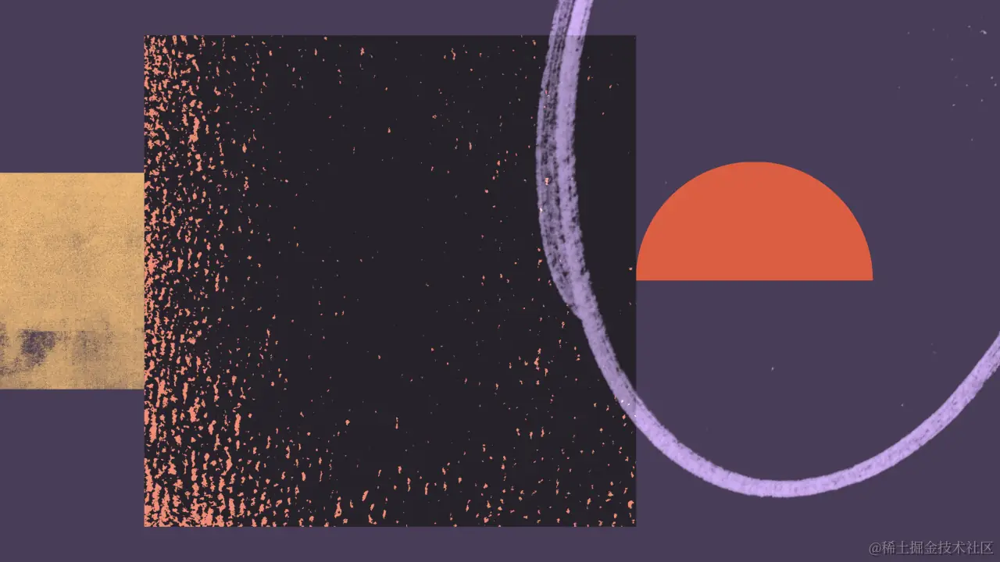

  


一直以来，许多设计师喜欢在他们的作品中运用一种简单而有效的技巧：**颗粒效果。** 颗粒效果能够为图像和渐变增添丰富的纹理和真实感，特别是在处理纯色或光滑表面时，例如阴影和背景。这种技术不仅能够使设计更加生动和引人注目，还能营造出复古、手工或艺术风格的视觉效果。

  


在 Web 设计中，颗粒效果广泛应用于背景、按钮、图标等元素，以增强其视觉效果。然而，在许多情况下，Web 开发者会选择使用位图来实现带有颗粒效果的 UI 视觉。在这里，我想告诉大家的是，使用 CSS 和 SVG 技术，也可以轻松地为 Web UI 添加引人注目的颗粒效果。

  


在这节课中，我将向你展示如何利用 CSS 和 SVG 技术创建丰富多彩的颗粒效果，从而改进 Web 设计中的渐变效果。我们将从基础开始，介绍如何使用 SVG 滤镜来生成颗粒效果，并逐步引导你探索不同的参数和效果，以实现你期望的颗粒效果。这不仅将帮助你理解如何在 Web 开发中有效地应用颗粒效果，还将使你学会根据设计需求调整和优化颗粒效果。

  


通过学习和实践这节课的内容，你将掌握创建和应用颗粒效果的关键技能，为你的 Web 设计增添独特的视觉吸引力和艺术感。

  


## 颗粒效果简介

  


在 Web 设计和开发中，颗粒效果（Grain）是一种常用的视觉技术，用来增添图像和界面元素的纹理和真实感。这种效果源于早期摄影胶片的“[胶片颗粒](https://en.wikipedia.org/wiki/Film_grain)”（Film Grain），是摄影技术的自然产物，如今在数字领域被重新诠释和应用。

  


在传统摄影中，胶片颗粒是由银卤化物微小颗粒或染料云组成的随机光学纹理，这种纹理赋予了照片独特的外观和质感。随着数码摄影技术的进步，现代相机通过噪声降低技术减少了这种胶片颗粒效应，以提高图像的清晰度和真实性。

  


然而，颗粒效果在数字艺术和 Web 设计中仍然很受欢迎。设计师和开发者通过使用CSS、SVG和其他技术手段，可以轻松地向 Web 页面和应用程序的背景、图标或按钮等元素添加颗粒效果。这种技术不仅仅是为了模拟胶片的视觉特性，还能够为设计增添深度和趣味，使得界面看起来更加生动和引人注目。

  


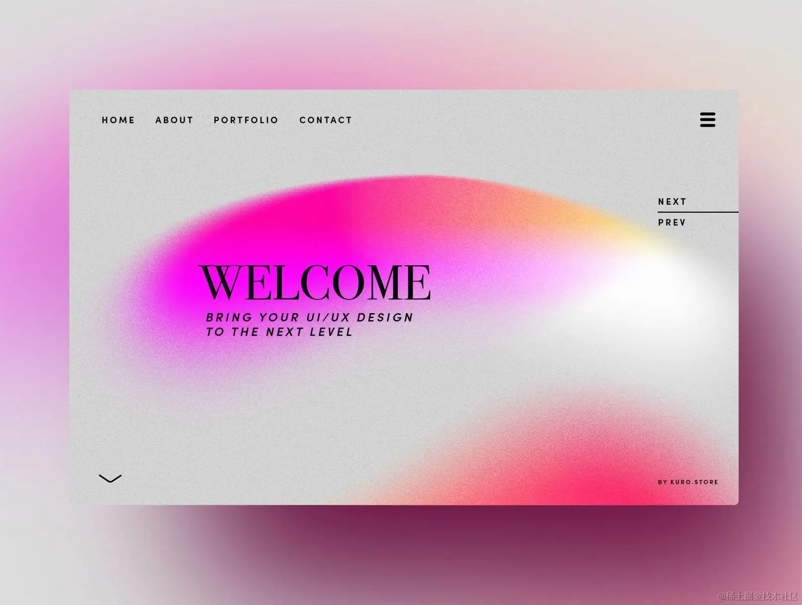

  


接下来，我们的主要目的就是探讨如何使用 SVG 和 CSS 来实现颗粒效果或者说颗粒渐变效果，以及这些效果可以用在哪里？

  


## 创建颗粒效果的诀窍

  


我们直奔主题，要实现类似上图这样的颗粒渐变效果，主要诀窍在于使用 SVG 滤镜创建噪声效果，然后将其应用为背景，将噪声层放在渐变之下，提升亮度和对比度，这样你就得到了一个逐渐消失的渐变效果：

  


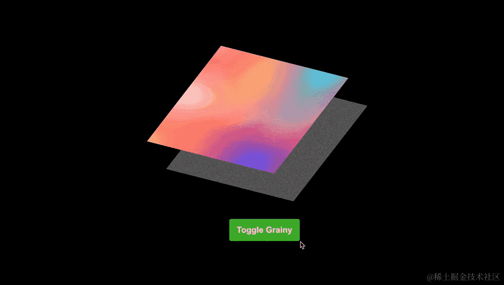

  


> Demo 地址：https://codepen.io/airen/full/yLWPGVO

  


关键部分是：

  


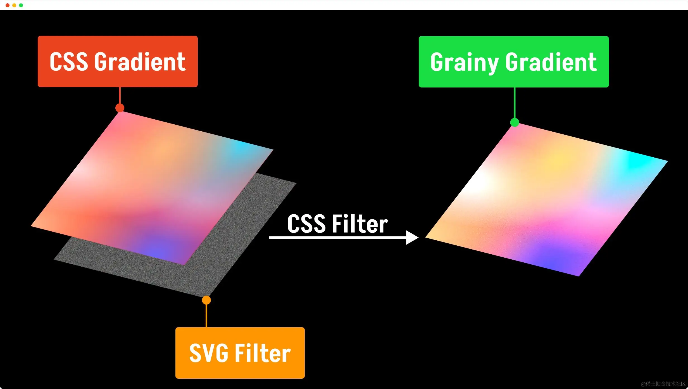

  


-   1️⃣：SVG 滤镜：使用 `<feTurbulence>` 滤镜生成噪声图案
-   2️⃣：CSS 渐变：使用 CSS 渐变属性制作渐变图像
-   3️⃣：CSS 多背景：将 SVG 滤镜生成的噪声图案作为元素的背景图案，并且放置在 CSS 渐变制作的图像之下
-   4️⃣：CSS 滤镜：使用 CSS 滤镜增加噪声图案的亮度和对比度
-   5️⃣：CSS 混合模式：可以选择使用 `mix-blend-mode` 进一步过滤颜色并混合渐变

  


注意，其中第 3️⃣ 步也可以替换成，将噪声图案和 CSS 渐变图分别放置在不同的元素中，然后再对两个元素进行合成。另外，第 5️⃣ 步不是必需的，可以根据具体的效果来选择是否使用。

  


接下来，我们来逐步探讨这几个部分。

  


## 使用 SVG 滤镜创建噪声图

  


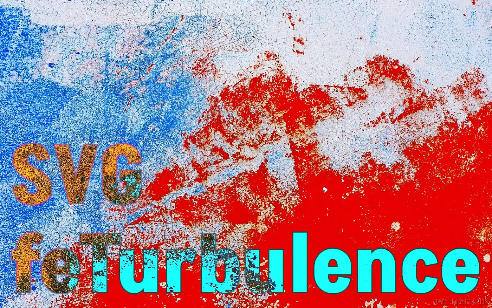

  


在 SVG 滤镜中，我们可以使用 `<feTurbulence>` 滤镜基元来创建噪声图。我们可以通过调整它的相关属性来获得所需要的噪声图案，例如 `baseFrequency` 、`numOctaves` 和 `type` 等：

  


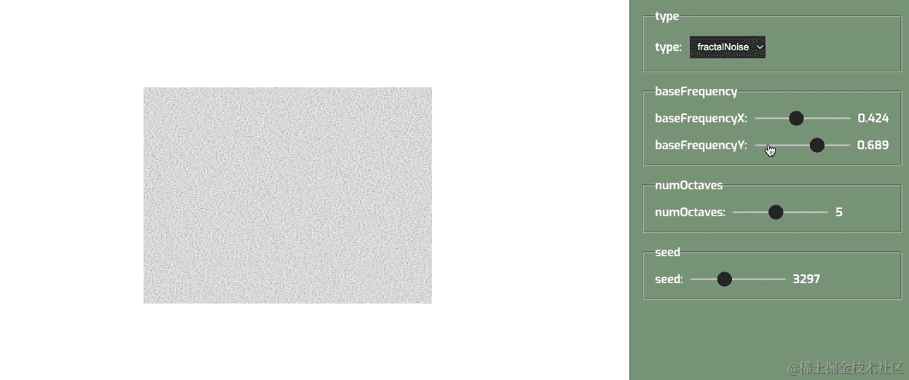

  


> Demo 地址：https://codepen.io/airen/full/bGyYgaQ

  


有关于 `<feTurbulence>` 滤镜更详细的介绍，可以阅读之前的课程《[SVG 滤镜的进阶之创建纹理](https://juejin.cn/book/7341630791099383835/section/7368318101526183986)》。

  


有一点需要知道的是，SVG 滤镜元素 `<filter>` 定义的滤镜效果，通常有两种方式来引用，其中之一是使用 CSS 的 `filter` 属性来引用，这种方式通常用于 HTML 元素上；其二是 SVG 元素的 `filter` 属性引用。对于第二种方式，如果 SVG 内联在 HTML 中，CSS 的 `filter` 属性将会覆盖 SVG 元素的 `filter` 属性。

  


由于我们需要将 SVG 滤镜用于 CSS 的 `background-image` ，我们需要通过 SVG 元素（例如 `<rect>`）来引用 `<feTurbulence>` 创建的噪声图案。例如：

  


```XML
<svg id="noise">
    <defs>
        <filter id="noise-filter" color-interpolation-filters="linearRGB" x="0%" y="0%" width="100%" height="100%">
            <feTurbulence 
                type="fractalNoise" 
                baseFrequency="2" 
                numOctaves="5" 
                stitchTiles="stitch"
                in="SourceGraphic" 
                resutl="TURBULENCE" />
        </filter>
    </defs>
    <rect x="0" y="0" width="100%" height="100%" filter="url(#noise-filter)" />
</svg>
```

  


你可以尝试着改变 `<feTurbulence>` 元素的一些属性，看看效果如何？

  


  


> Demo 地址：https://codepen.io/airen/full/qBGVvRZ

  


我们需要将这个 SVG 代码保存为一个单独的 `.svg` 文件，[提供给 `background-image` 使用](https://juejin.cn/book/7341630791099383835/section/7344089098363076620#heading-6)。由于某些特殊的原因，在 CSS 中通过 `ID` 引用 SVG 的滤镜是行不通的，[不过你可以将 SVG 文件转换为 Data URI 或 Base 64 格式](https://yoksel.github.io/url-encoder/)：

  


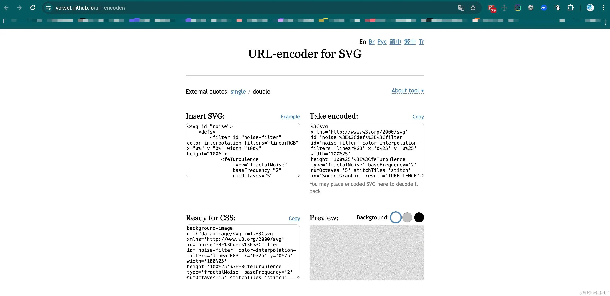

> URL:https://yoksel.github.io/url-encoder/

  


```HTML
<div class="grainy"></div>
```

  


```CSS
.grainy {
    background-image: url("data:image/svg+xml,%3Csvg xmlns='http://www.w3.org/2000/svg' id='noise'%3E%3Cdefs%3E%3Cfilter id='noise-filter' color-interpolation-filters='linearRGB' x='0%25' y='0%25' width='100%25' height='100%25'%3E%3CfeTurbulence type='fractalNoise' baseFrequency='2' numOctaves='5' stitchTiles='stitch' in='SourceGraphic' resutl='TURBULENCE' /%3E%3C/filter%3E%3C/defs%3E%3Crect x='0' y='0' width='100%25' height='100%25' filter='url(%23noise-filter)' /%3E%3C/svg%3E");
}
```

  


或者使用 JavaScript 脚本，将内联在 HTML 的 SVG 代码转换为 Data URI 或 Base 64 ，然后提供给 `.grainy` 使用：

  


```JavaScript
const svgElement = document.querySelector("#noise");
const grainyElement = document.querySelector(".grainy");


const applySvgAsBackground = (svgElement, targetElement) => {
    // 获取SVG元素的内容
    if (!svgElement) {
        console.error(`SVG element not found.`);
        return;
    }

    const svgContent = new XMLSerializer().serializeToString(svgElement);

    // 对SVG内容进行URL编码
    const encodedSvg = encodeURIComponent(svgContent).replace(/'/g, "%27").replace(/"/g, "%22");

    // 生成data URI
    const dataUri = `data:image/svg+xml,${encodedSvg}`;

    // 获取目标元素
    if (!targetElement) {
        console.error(`Target element  not found.`);
        return;
    }

    // 将data URI应用到CSS的 `--bg-noise` 变量中
    targetElement.style.setProperty(`--bg-noise`, `url("${dataUri}")`);
};

applySvgAsBackground(svgElement, grainyElement);
```

  


```CSS
.grainy {
    background:var(--bg-noise) var(--bg-color, #fff);
}
```

  


  


> Demo 地址：https://codepen.io/airen/full/Baembqq

  


目前我们所看到的仅仅是使用 `<feTurbulence>` 滤镜生成的最基础的噪声图案。如果你愿意，还可以结合其他 SVG 滤镜来调整噪声图案的效果，例如，使用 `<feColorMatrix>` 和 `<feComponentTransfer>` 来调整噪声图的颜色和细节：

  


```XML
<svg id="noise" xmlns='http://www.w3.org/2000/svg' style="display:none">
    <defs>
        <filter id="noise-filter" color-interpolation-filters="linearRGB" x="0%" y="0%" width="100%" height="100%">
            <feTurbulence type="fractalNoise" baseFrequency="2" numOctaves="5" stitchTiles="stitch" in="SourceGraphic" resutl="TURBULENCE__10" />
            <feColorMatrix type="saturate" values="0" in="TURBULENCE__10" result="TURBULENCE__20" class="saturate" />
            <feComponentTransfer in="TURBULENCE__20" result="TURBULENCE__30">
                <feFuncR type="linear" slope="2.02" class="brightness" />
                <feFuncG type="linear" slope="2.02" class="brightness" />
                <feFuncB type="linear" slope="2.02" class="brightness" />
                <feFuncA type="linear" slope="0.2" class="opacity" />
            </feComponentTransfer>
            <feComponentTransfer in="TURBULENCE__30" result="TURBULENCE__40">
                <feFuncR type="linear" slope="2.1" intercept="-0.55" class="contrast" />
                <feFuncG type="linear" slope="2.1" intercept="-0.55" class="contrast" />
                <feFuncB type="linear" slope="2.1" intercept="-0.55" class="contrast" />
            </feComponentTransfer>
        </filter>
    </defs>
    <rect x="0" y="0" width="100%" height="100%" filter="url(#noise-filter)" />
</svg>
```

  


  


> Demo 地址：https://codepen.io/airen/full/QWROPBN

  


现在，制作颗粒效果的第一层图案已准备好了，接下来我们来看盖在它上面的 CSS 渐变。

  


## 创建渐变层

  


在 CSS 中，[渐变](https://juejin.cn/book/7223230325122400288/section/7259668771856941111)主要有三种类型：**线性渐变** 、**径向渐变** 和**锥形渐变** ，每一种类型渐变又包含一次性渐变和重复性渐变：

  


-   线性渐变：`linear-gradient()` （一次性线性渐变）和 `repeating-linear-gradient()` （重复性线性渐变）
-   径向渐变：`radial-gradient()` （一次性径向渐变）和 `repeating-radial-gradient()` （重复性径向渐变）
-   锥形渐变：`conic-gradient()` （一次性锥形渐变）和 `repeating-conic-gradient()` （重复性锥形渐变）

  


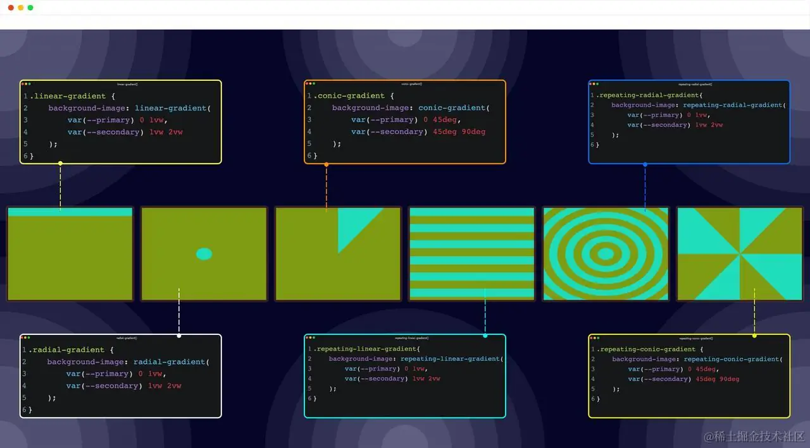

  


> Demo 地址：https://codepen.io/airen/full/xxNPNba

  


这意味着，我们可以使用不同的方式创建所需要的渐变层。

  


当然，如果你不想花太多时间去了解 CSS 渐变特性，那么可以借助在线工具来辅助你构建出所需的渐变效果。例如 [HD Gradients 工具](https://gradient.style/)，它可以帮助你创建高清的渐变效果：

  


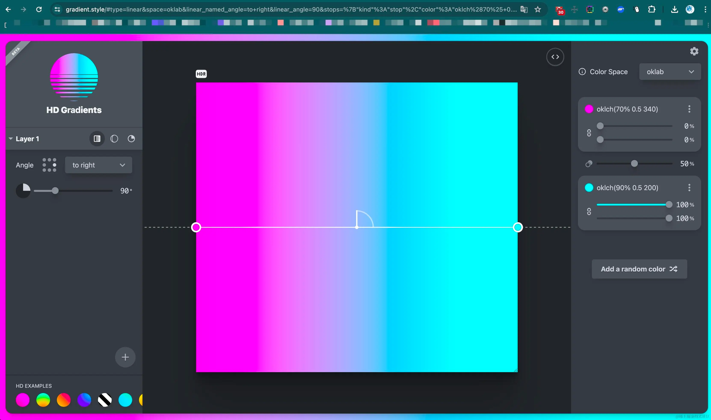

  


> URL:https://gradient.style/

  


或者使用 [Mesher 工具](https://csshero.org/mesher/)来制作 Mesh Gradient （CSS 没有专门的属性用于制作 Mesh 渐变）:

  


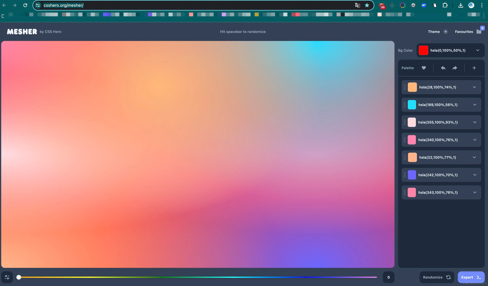

  


> URL:https://csshero.org/mesher/

  


假设你现在已经使用 CSS 渐变创建了渐变效果。例如：

  


```CSS
background-image:
radial-gradient(at 40% 20%, hsla(28,100%,74%,1) 0px, transparent 50%),
radial-gradient(at 80% 0%, hsla(189,100%,56%,1) 0px, transparent 50%),
radial-gradient(at 0% 50%, hsla(355,100%,93%,1) 0px, transparent 50%),
radial-gradient(at 80% 50%, hsla(340,100%,76%,1) 0px, transparent 50%),
radial-gradient(at 0% 100%, hsla(22,100%,77%,1) 0px, transparent 50%),
radial-gradient(at 80% 100%, hsla(242,100%,70%,1) 0px, transparent 50%),
radial-gradient(at 0% 0%, hsla(343,100%,76%,1) 0px, transparent 50%);
```

  


与之前的噪声图片一样，我们使用 CSS 自定义属性来管理渐变效果：

  


```CSS
.grainy {
    --bg-gradient: 
        radial-gradient(at 40% 20%, hsla(28,100%,74%,1) 0px, transparent 50%),
        radial-gradient(at 80% 0%, hsla(189,100%,56%,1) 0px, transparent 50%),
        radial-gradient(at 0% 50%, hsla(355,100%,93%,1) 0px, transparent 50%),
        radial-gradient(at 80% 50%, hsla(340,100%,76%,1) 0px, transparent 50%),
        radial-gradient(at 0% 100%, hsla(22,100%,77%,1) 0px, transparent 50%),
        radial-gradient(at 80% 100%, hsla(242,100%,70%,1) 0px, transparent 50%),
        radial-gradient(at 0% 0%, hsla(343,100%,76%,1) 0px, transparent 50%);
}
```

  


到这里，我们就为颗粒效果准备好两个层了，一个是噪声图案层 `--bg-noise` （由 SVG 滤镜创建，并转换为 Data URI 或 Base 64），另一个是渐变层 `--bg-gradient` 。

  


## 合并层：噪声层 + 渐变层

  


之前，我们提到过，这两个层都是 `.grainy` 的背景，而且渐变层要在噪声层上面。我们可以这样来编写我们的 CSS:

  


```CSS
.grainy {
    background:  var(--bg-gradient), var(--bg-noise) var(--bg-color, #fff);
}
```

  


请注意，我们使用了 CSS 多背景的特性，将渐变层和噪声层都作为 `.grainy` 元素的背景层使用。有个细节非常重要，那就是背景图片出现的顺序。越早出现，越在顶层：

  


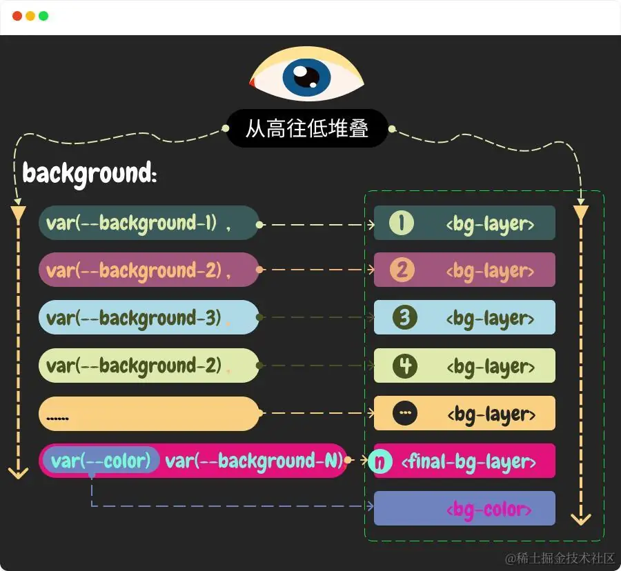

  


这意味着，`--bg-gradient` 要先于 `--bg-noise` ，因为我们需要将渐变层覆盖在噪声层上面。

  


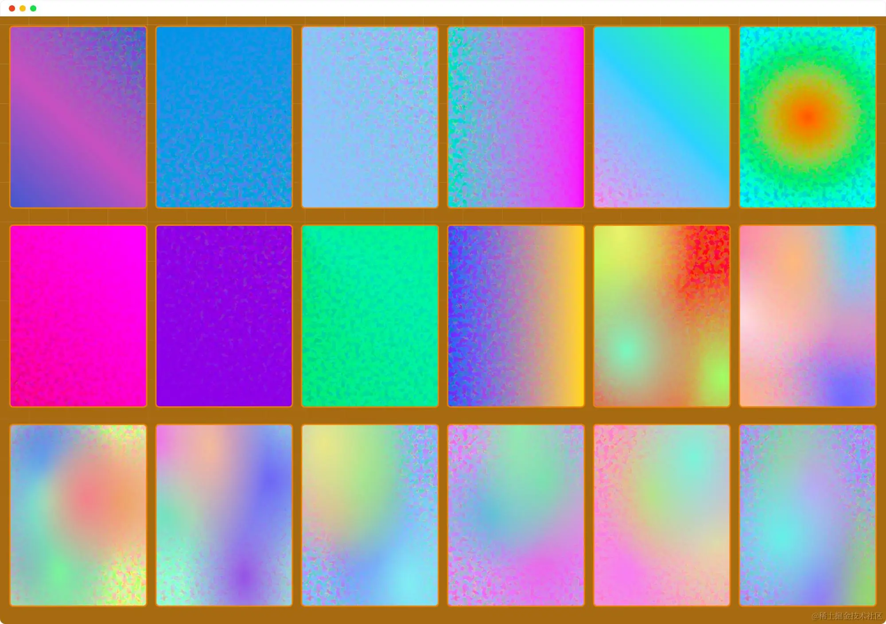

  


> Demo 地址：https://codepen.io/airen/full/xxNPNzN

  


正如你所看到的，仅仅将渐变层和噪声层合在一起，效果并不太好。颗粒效果太混乱，我们需要进一步调整。

  


注意，渐变层需要带有一定的透明度，否则看不到底部的噪声图案，也就看不到任何颗粒效果。如果你使用的是不带任何透明度的渐变效果，需要使用其他的技术手段，使底部噪声透出部分。例如 CSS 混合模式（这个稍后再讨论）。

  


## 提升亮度和对比度

  


我们可以借助 CSS 的滤镜 `filter` 中的 `contrast()` 和 `brightness()` 函数使噪声更为鲜明，将最淡的颜色变成白色或黑色：

  


```CSS
.grainy {
    background:  var(--bg-gradient), var(--bg-noise) var(--bg-color, #fff);
    filter: var(--contrast, contrast(170%)) var(--brightness, brightness(100%));
}
```

  


你可以尝试着调整 `contrast()` 和 `brightness()` 函数的值，看看它们如何影响渐变效果：

  


  


> Demo 地址：https://codepen.io/airen/full/mdYpeXq

  


## CSS 混合模式：过滤颜色

  


需要知道的是，SVG 滤镜本身就是彩色的，增加亮度和对比度进一步强调了某些颜色。虽然不太明显，但如果这些彩色斑点不受欢迎，我们可以继续使用 CSS 混合模式（例如 `mix-blend-mode` 或 `background-blend-mode`）来过滤颜色。

  


在我们这个场景，有多种不同的方式使用 CSS 混合模式来过滤镜颜色，或者说调整颗粒渐变效果。首先来看 `background-blend-mode` 属性如何影响颗粒渐变的效果。

  


我们在创建颗粒渐变效果的过程中有一步非常关键，那就是将 SVG 滤镜生成的噪声图案和 CSS 渐变创建的渐变效果，一起作为元素的背景图像在使用。

  


```CSS
.grainy {
    background:  var(--bg-gradient), var(--bg-noise) var(--bg-color, #fff);
 }
```

  


与此同时，还为元素设置了一个背景颜色。这样一来，整个元素就有三个层：渐变层、噪声层和颜色层。我们可以使用 CSS 的 `background-blend-mode` 对这三个层做一些混合处理，使整个效果变得更平滑一些：

  


```CSS
.grainy {
    background:  var(--bg-gradient), var(--bg-noise) var(--bg-color, #fff);
    filter: var(--contrast, contrast(170%)) var(--brightness, brightness(100%));
    background-blend-mode: var(--bg-blend, multiply);
 }
```

  


你可以尝试调整混合模式的值，但看颗粒渐变效果的变化：

  


  


> Demo 地址：https://codepen.io/airen/full/mdYpeYL

  


另外一种方式是使用 `mix-blend-mode` 。使用这种模式，需要在 `.grainy` 上面添加一个层，在这个层上设置一个颜色，并设置它的混合模式类型：

  


```HTML
<div class="isolate">
    <div class="grainy"></div>
</div>
```

  


```CSS
.isolate {
    position: relative;
    
    .grainy {
        background:  var(--bg-gradient), var(--bg-noise) var(--bg-color, #fff);
        filter: var(--contrast, contrast(170%)) var(--brightness, brightness(100%));
    }
    
    &::after {
        content: "";
        position: absolute;
        inset: 0;
        background-color: var(--mix-color, moccasin);
        mix-blend-mode: var(--mix-blend, multiply);
    }
}
```

  


  


> Demo 地址：https://codepen.io/airen/full/PovEZZx

  


当然，如果你有需要，可以同时使用 `mix-blend-mode` 和 `background-blend-mode` 来调整颗粒渐变的效果：

  


```CSS
.isolate {
    position: relative;
    
    .grainy {
        background:  var(--bg-gradient), var(--bg-noise) var(--bg-color, #fff);
        filter: var(--contrast, contrast(170%)) var(--brightness, brightness(100%));
        background-blend-mode: var(--bg-blend, multiply);
    }
    
    &::after {
        content: "";
        position: absolute;
        inset: 0;
        background-color: var(--mix-color, moccasin);
        mix-blend-mode: var(--mix-blend, multiply);
    }
}
```

  


  


> Demo 地址：https://codepen.io/airen/full/BaeJjYX

  


我们可以使用 [CSS 的 `isolation` 属性](https://juejin.cn/book/7341630791099383835/section/7368317864165507082#heading-25)来创建一个新的层叠上下文，从而防止元素与背景或其他元素混合。这会将元素视为一个独立的图层，不受其他元素的混合影响。

  


```CSS
.isolate {
    position: relative;
    isolation: isolate;
    
    .grainy {
        background:  var(--bg-gradient), var(--bg-noise) var(--bg-color, #fff);
        filter: var(--contrast, contrast(170%)) var(--brightness, brightness(100%));
        background-blend-mode: var(--bg-blend, multiply);
    }
    
    &::after {
        content: "";
        position: absolute;
        inset: 0;
        background-color: var(--mix-color, moccasin);
        mix-blend-mode: var(--mix-blend, multiply);
    }
}
```

  


你可以尝试在下面的示例中切换 `isolation` 状态（开启或关闭），但看颗粒渐变效果的变化：

  


  


> Demo 地址：https://codepen.io/airen/full/zYQprLE

  


我想，根据上面的步骤，你应该可以制作出你想要的颗粒渐变效果了。你可以尝试调整上面的案例的相关参数，看看它们如何影响颗粒效果。除此之外，这里还有一些继续探索这种技术的方法：

  


-   **使用不同的 SVG**：可以调整 `<feTurbulence>` 滤镜属性的值，改变其粗糙度以及外观和感觉
-   **应用不同的 SVG 滤镜**：SVG 中有 17 种不同的滤镜基元，你可以使用更多的滤镜，改变噪声图案，获得更丰富的渐变效果
-   **尝试不同的渐变**：虽然示例中提供了多种不同的渐变，但不影响你使用其他的渐变类型来绘制更复杂的渐变层效果，例如带图案的渐变层
-   **添加更多的层**：通过 CSS 混合，你可以叠加任意数量的图层并进行混合，创造出复杂的效果

  


当你尝试的越多，你将获得的效果也会越多，因为调整其中任何一个参数，你都将得到不同的效果。如果你在尝试制作的过程中，获得非常丰富的效果，请不要忘记在评论中与我一起分享你的成果。

  


## 使用多元素制作合并层

  


不难发现，上面所展示的示例，合并层（噪声层+渐变层）是以多背景方式合成的。如果你的层数并不多（假设就只有噪声层和渐变层），那么可以考虑使用多元素制作合并层。只不过，这种方式你需要额外增加 HTML 空元素或使用伪元素充当层。我在下面的示例中，使用的是伪元素 `::before` 或 `::after` ，因为我个人比较喜欢使用伪元素：

  


```HTML
<div class="isolate multi-element">
    <div class="grainy">
        <!-- ::before 是渐变层 -->
        <!-- ::after 是噪声层 -->
    </div>
</div>
```

  


```CSS
.isolate {
    isolation: var(--isolate);
    
    &::after {
        background-color: var(--mix-color);
        mix-blend-mode: var(--mix-blend);
    }
}
  
.multi-element .grainy {
    position: relative;
    filter: var(--contrast) var(--brightness);
    
    &::before {
        z-index: 2;
        background: var(--bg-gradient);
        mix-blend-mode: var(--bg-blend);
    }
    
    &::after {
        z-index: 1;
        background: var(--bg-noise) var(--bg-color);
        background-blend-mode: var(--bg-blend);
        mix-blend-mode: var(--bg-blend);
    }
} 
```

  


  


> Demo 地址：https://codepen.io/airen/full/bGyapNp

  


你可能已经发现了，虽然这两种方式都可以实现颗粒渐变效果，但最终渲染的结果上还是略有差异的。另外，一旦有更多的层需要进行合并，那么多元素的方式就越会显得鸡肋，因为你需要更多的元素来充当层。就这一而言，我个人强烈推荐使用多背景的方式，你不会受到层数限制。

  


## 一些使用场景

  


了解完如何使用 SVG 滤镜和 CSS 滤镜、混合模式制作颗粒渐变效果的理论以及制作方法之后，我们来看几个实际的案例。看看这些效果在 Web 上哪些场景可以使用该效果。

  


首先来看一个卡片效果：

  


> Demo 地址：https://codepen.io/airen/full/vYwpKLy

  


上面这个效果是在 [@Jhey 在 Codepen 提供的光晕案例](https://codepen.io/jh3y/full/yLwLVgP)基础上增加的颗粒渐变效果。原案例的效果如下：

  


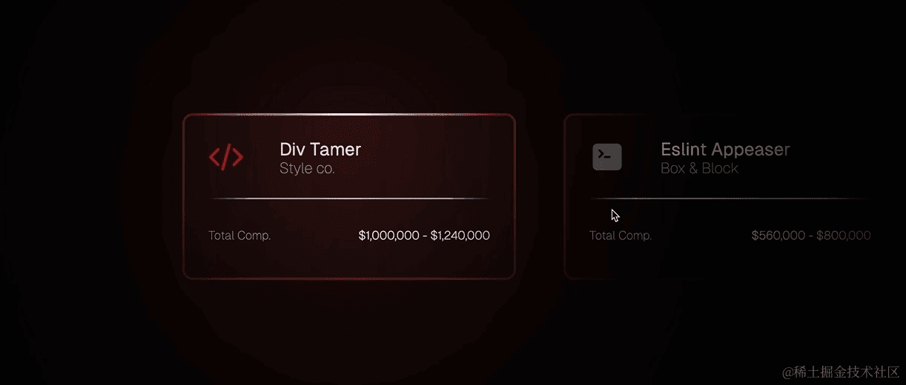

  


> Demo 地址：https://codepen.io/jh3y/full/yLwLVgP （来源于 @Jhey）

  


带有颗粒渐变的卡片效果是不是更有质感一点。

  


你可能已经猜到了，这个效果就是采用这节课介绍的技术制作的。为了不打破原有案例的光晕效果，我只是在原卡片的基础上新增了两个元素，即 `.noise` 和 `.overlay` ：

  


```HTML
<article data-glow>
    <div>
        <svg xmlns="http://www.w3.org/2000/svg" viewBox="0 0 24 24" fill="currentColor" class="w-6 h-6">
            <path fill-rule="evenodd" d="M14.447 3.026a.75.75 0 0 1 .527.921l-4.5 16.5a.75.75 0 0 1-1.448-.394l4.5-16.5a.75.75 0 0 1 .921-.527ZM16.72 6.22a.75.75 0 0 1 1.06 0l5.25 5.25a.75.75 0 0 1 0 1.06l-5.25 5.25a.75.75 0 1 1-1.06-1.06L21.44 12l-4.72-4.72a.75.75 0 0 1 0-1.06Zm-9.44 0a.75.75 0 0 1 0 1.06L2.56 12l4.72 4.72a.75.75 0 0 1-1.06 1.06L.97 12.53a.75.75 0 0 1 0-1.06l5.25-5.25a.75.75 0 0 1 1.06 0Z" clip-rule="evenodd" />
        </svg>
        <h2>Div Tamer</h2>
        <span>Style co.</span>
    </div>
    <hr>
    <span>Total Comp.</span>
    <span>$1,000,000 - $1,240,000</span>
    
    <!-- 用于制作颗粒渐变效果 -->
    <sapn class="noise"></sapn>
    <span class="overlay"></span>
</article>
```

  


实现该效果，首先需要一张噪声图，我使用了下面的 SVG 生成的噪声图：

  


```XML
<svg id="noise" xmlns="http://www.w3.org/2000/svg" style="display:none">
    <defs>
        <filter id="noise-filter" color-interpolation-filters="linearRGB" x="0%" y="0%" width="100%" height="100%">
            <feTurbulence 
                type="fractalNoise"
                baseFrequency="0.6" 
                numOctaves="3"              
                stitchTiles="stitch"
                in="SourceGraphic" 
                resutl="TURBULENCE__10"/>
        </filter>
    </defs>
    <rect x="0" y="0" width="100%" height="100%" filter="url(#noise-filter)" />
</svg>
```

  


大致的效果如下：

  


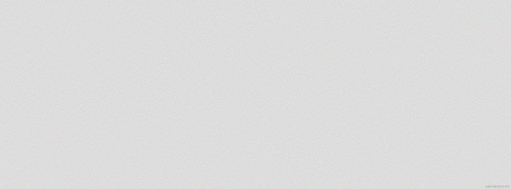

  


你可以选择将这段 SVG 代码保存为一个名为 `noise.svg` 文件，以备在 CSS 中引用。不过，我在示例中使用了 JavaScript 脚本，将这段 SVG 转换为 Data URI，并作为自定义属性 `--bg-noise` 的值：

  


```JavaScript
const feTurbulence = document.querySelector("feTurbulence");
const svgElement = document.querySelector("#noise");
const rootEle = document.documentElement; 

const applySvgAsBackground = (svgElement, targetElement) => {
    if (!svgElement) {
        console.error(`SVG element not found.`);
        return;
    }

    const svgContent = new XMLSerializer().serializeToString(svgElement);

    const encodedSvg = encodeURIComponent(svgContent).replace(/'/g, "%27").replace(/"/g, "%22");

    const dataUri = `data:image/svg+xml,${encodedSvg}`;

    if (!targetElement) {
        console.error(`Target element  not found.`);
        return;
    }

    targetElement.style.setProperty(`--bg-noise`, `url("${dataUri}")`);
};

applySvgAsBackground(svgElement, rootEle);
```

  


接下来是 CSS 部分：

  


```CSS
:root {
    --card-size: clamp(350px, 40vw, 450px);
    --card-ar: 2 / 1;
    --x: calc(50vw * 1);
    --y: calc((50vh - (var(--card-size) * 0.25)) * 1);
    --spotlight: 50vmin;
    --backdrop: black;
    --radius: 14;
    --border: 3;
    --backup-border: hsl(0 0% 10% / 0.2);
    --size: 200;
    --bg-spot-opacity: 0.16;
    --border-light-opacity: 1;
    --border-spot-opacity: 0.75;
    --bg-gradient: 
        radial-gradient(at 40% 20%,hsla(28, 100%, 74%, 1) 0px,transparent 50%),
        radial-gradient(at 80% 0%, hsla(189, 100%, 56%, 1) 0px, transparent 50%),
        radial-gradient(at 0% 50%, hsla(355, 100%, 93%, 1) 0px, transparent 50%),
        radial-gradient(at 80% 50%, hsla(340, 100%, 76%, 1) 0px, transparent 50%),
        radial-gradient(at 0% 100%, hsla(22, 100%, 77%, 1) 0px, transparent 50%),
        radial-gradient(at 80% 100%, hsla(242, 100%, 70%, 1) 0px, transparent 50%),
        radial-gradient(at 0% 0%, hsla(343, 100%, 76%, 1) 0px, transparent 50%);
}
  
[data-glow] {    
    position: relative;
    isolation: isolate;
    
    :is(.noise, .overlay) {
        position: absolute;
        inset: 0;
        width: 100%;
        height: 100%;
        border-radius: inherit;
    }

    .noise {      
        --border-size: calc(var(--border, 2) * 1px);
        --spotlight-size: calc(var(--card-size) * 1.2);
        --hue: calc(var(--base) + (var(--xp, 0) * var(--spread, 0)));
        background-image: 
            radial-gradient(var(--spotlight-size) var(--spotlight-size) at var(--x) var(--y), hsl(var(--hue, 210) calc(var(--saturation, 100) * 1%) calc(var(--lightness, 70) * 1%) / var(--bg-spot-opacity, 0.15)),transparent),
            var(--bg-gradient), 
            var(--bg-noise);
        background-color: var(--backdrop, transparent);
        background-size: calc(100% + (2 * var(--border-size))) calc(100% + (2 * var(--border-size)));
        background-position: 50% 50%;
        background-attachment: fixed;
        border: var(--border-size) solid var(--backup-border);
        touch-action: none;
        background-blend-mode: hard-light;
        filter: contrast(170%) brightness(70%);
        z-index: -2;
    }
    
    .overlay {
        z-index: -1;
        background-color: #ffeb3b;
        mix-blend-mode: multiply;
    }
}
```

  


注意，颗粒渐变使用了一个层，两个渐变层，一个噪声层，并且按照之前介绍的方法，给其添加了混合模式和滤镜等效果。在这些样式的组合之下，实现了最终的效果：

  


  


> Demo 地址：https://codepen.io/airen/full/vYwpKLy

  


按照类似的方法，我们可以给 Web 上的任何元素添加颗粒渐变效果。例如 [@ Juxtopposed 在 Codepen](https://codepen.io/tag/grainy-gradient) 上提供的两个案例：

  


  


> Demo 地址：https://codepen.io/Juxtopposed/full/PoyWzEq （来源于 @ Juxtopposed）

  


  


> Demo 地址：https://codepen.io/Juxtopposed/full/BaqLEQY （来源于 @ Juxtopposed）

  


另外，颗粒渐变还可以用来制作光和影子相关的效果：

  


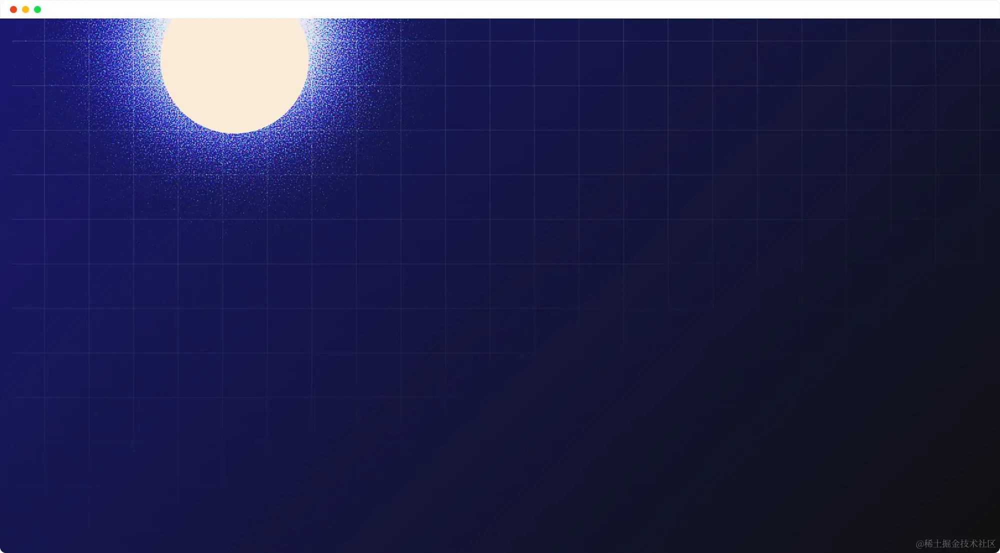

  


> Demo 地址：https://codepen.io/airen/full/zYQpKqo

  


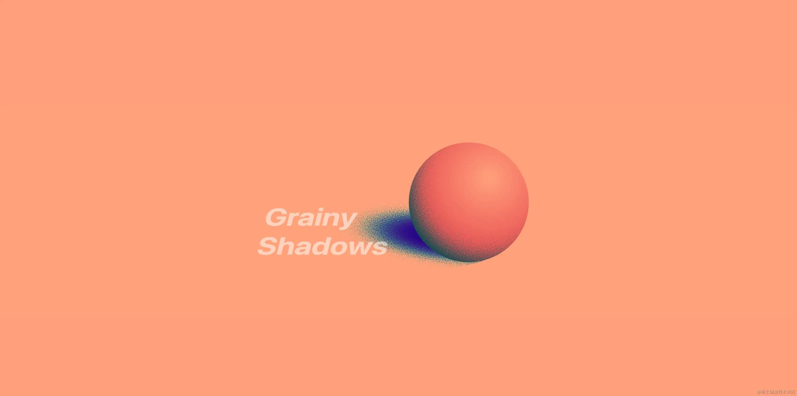

  


> Demo 地址：https://codepen.io/cjimmy/full/XWRQPep （来源于 [@Jimmy Chion](https://codepen.io/cjimmy) ）

  


如果你愿意，你还可以给 Web 上的一些标题添加颗粒渐变效果：

  


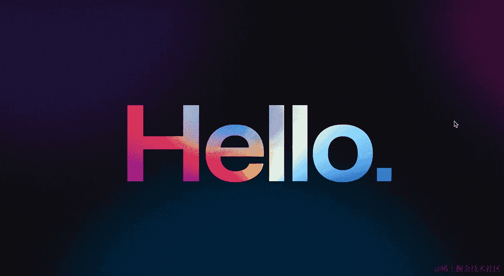

  


> Demo 地址：https://codepen.io/LukyVj/full/poOjqBv （来源于 [@LukyVJ](https://codepen.io/LukyVj) ）

  


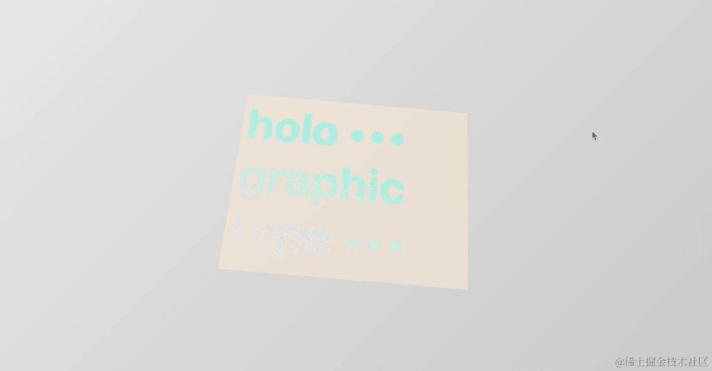

  


> Demo 地址：https://codepen.io/cjimmy/full/zYzNBJj （来源于 [@Jimmy Chion](https://codepen.io/cjimmy) ）

  


正如你所看到的，只要你敢想，愿意尝试，采用这种方法你可以为 Web 添加各式各样的颗粒渐变效果！

  


## 小结

  


在这节课，我们主要介绍了如何将 SVG 滤镜制作的噪声图与 [CSS 处理图像的技术](https://juejin.cn/book/7223230325122400288/section/7259669043622690853)（例如滤镜和混合模式）相结合来制作各式各样的颗粒渐变效果。在课程中我们展示了各种不同的颗粒渐变效果，但它们的制作原理是相同的。通过这些有趣的案例，我们也知道，只要愿意去尝试，例如调整噪声图粗细度、改变渐变风格、调整对比度和亮度以及合适的混合模式，我们就可以轻易制作出符合期望的带颗粒渐变效果的 UI 视觉。

  


而且我想说的是，虽然这节课主题是“SVG 创建颗粒效果”，但也告诉我们，在实际开发中，我们可以结合 SVG 滤镜和 CSS 现代特性为 Web 添加更丰富的，更有趣的 UI 效果和交互效果。这意味着，你又多了一种可以为 Web 增添加有深度、有质感的精美视觉效果。