# 43-高级篇：SVG 滤镜的进阶之黏糊效果

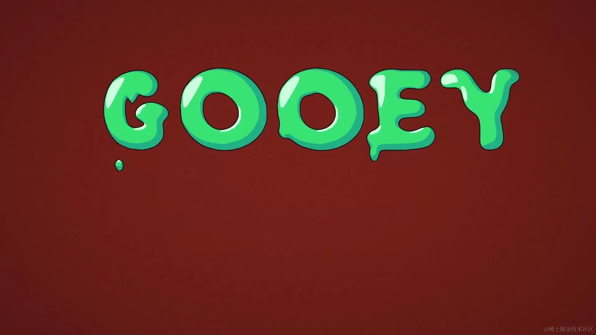

  


在现代 Web 设计中，**黏糊效果（Gooey Effect）** 作为一种引人注目的视觉效果，正变得越来越受欢迎。这种效果通过柔和、流动的动画，使界面元素看起来仿佛被一种黏性物质连接在一起，为用户体验带来了独特的动态感和互动性。无论是按钮、加载动画还是背景装饰，黏糊效果都能为页面增添独特的魅力和生动的表现力。

  


在这节课中，我们将通过一些常见的案例，如带有黏糊效果的按钮、导航菜单和背景装饰，向大家介绍使用SVG滤镜实现黏糊效果的核心技术与细节。你将学习到如何通过实际代码示例，逐步掌握这些技术，并将它们灵活应用到你的设计项目中。

  


通过这节课的学习，你将全面掌握在Web上实现黏糊效果的技能，能够自如地将这种富有创意和动感的效果融入到你的设计中。让我们一起踏上这段充满探索和创新的旅程，利用黏糊效果为你的 Web 设计注入新的活力和吸引力！

  


## 黏糊效果简介

  


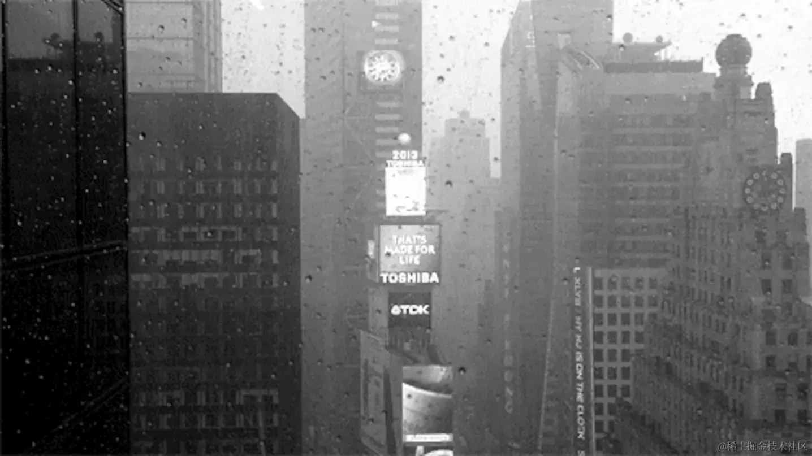

  


想象一下雨滴在玻璃上流动的样子。雨滴会沿着玻璃表面滑动，并且在碰到其他雨滴时会合并在一起，形成更大的液滴。这种自然的流动和融合现象非常类似于黏糊效果在 Web 上的表现。

  


Web 上的黏糊效果（Gooey Effect）是一种视觉效果。它的主要特点在于其流畅、连贯的动画表现。元素之间的连接就像液体一般，具有柔和的边缘和自然的过渡。这种效果不仅增加了界面的视觉吸引力，还能增强用户的互动体验，使操作更加直观有和有趣。

  


## 黏糊效果在 Web 上的应用

  


在实际应用中，黏糊效果广泛出现在按钮、加载动画、导航菜单和背景装饰等各种 Web 元素上。

  


### 按钮

  


在 Web 设计中，一个常见的黏糊效果应用场景是按钮。当用户将鼠标悬停在按钮上时，按钮的边缘会产生流动的动画效果，仿佛按钮正在融化或扩散。这种效果不仅美观，还能提供即时的视觉反馈，提升用户体验：

  


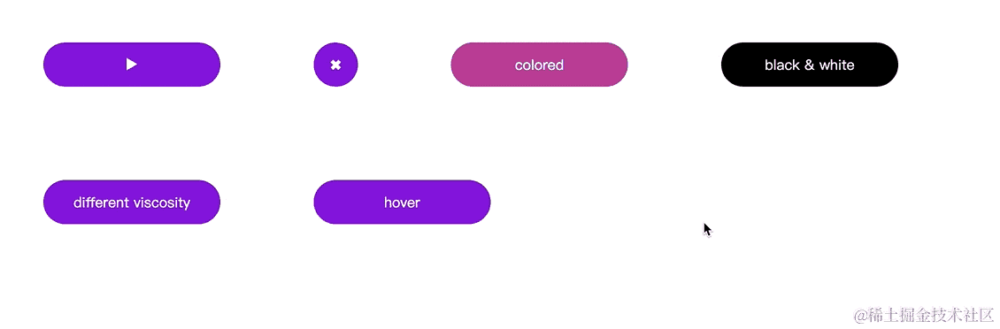

  


> Demo 地址：https://codepen.io/architechnium/full/wpYgGY

  


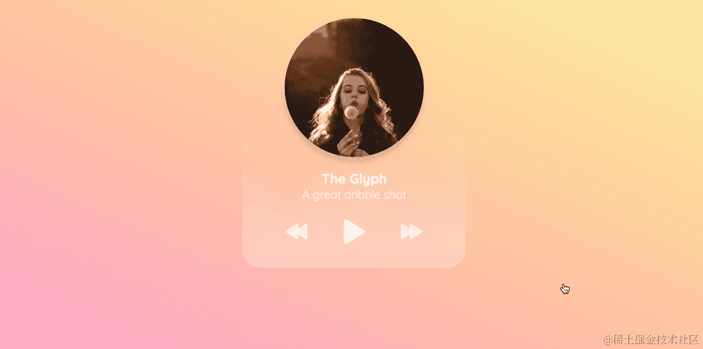

  


> Demo 地址：https://codepen.io/jakewhiteleydev/details/ymoWZo

  


### 加载动画

  


加载动画是另一个常见的应用场景。当 Web 页面正在加载内容时，使用黏糊效果的动画可以让等待过程变得更有趣和富有吸引力。通过模拟液滴的流动或黏液的移动，加载动画不仅美观，还能减少用户的等待焦虑。

  


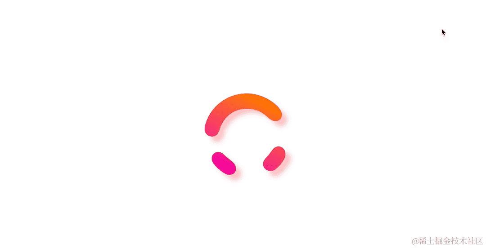

  


> Demo 地址：https://codepen.io/marknotton/full/dyPrrMd

  


### 导航菜单

  


在导航菜单中，黏糊效果可以用于菜单项的切换和悬停效果。当用户在不同的菜单项之间移动时，菜单项之间可以产生柔和的流动效果，仿佛菜单项之间被黏液连接。

  


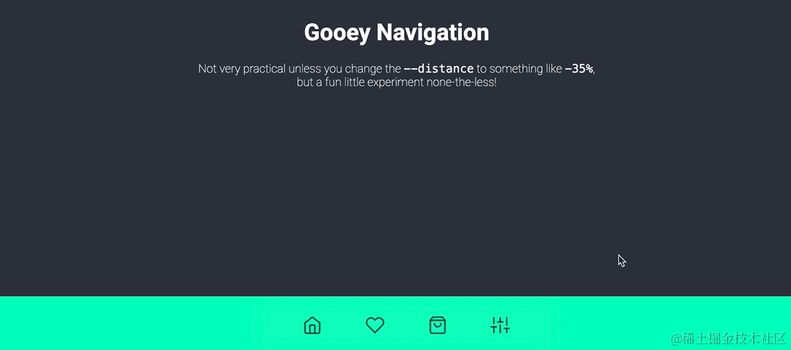

  


> Demo 地址：https://codepen.io/simeydotme/full/LYLxJqV

  


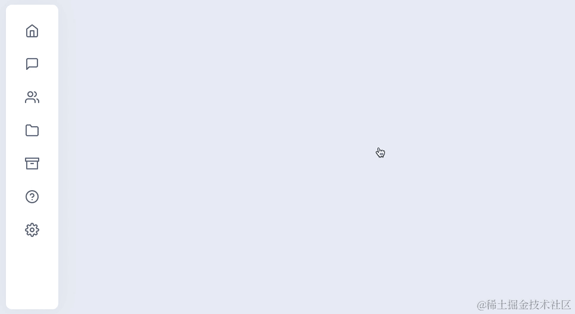

  


> Demo 地址：https://codepen.io/onediv/full/WNOdMWw

  


### 图像悬停效果

  


图像悬停效果是黏糊效果的另一个应用场景。当用户将鼠标悬停在图片上时，图片会产生柔和的流动效果，使图片看起来更生动、吸引人。这种效果可以增强用户与图片之间的互动性。

  


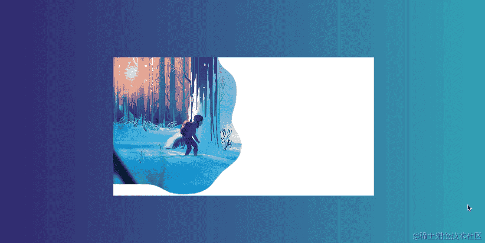

  


> Demo 地址：https://codepen.io/iremlopsum/full/VQOvOW

  


### 表单元素

  


表单元素在获得焦点或输入时，通过黏糊效果提供视觉反馈，提升用户体验。当用户点击或输入信息时，输入框的边缘会产生柔和的流动效果，使表单填写过程更加流畅和愉快。

  


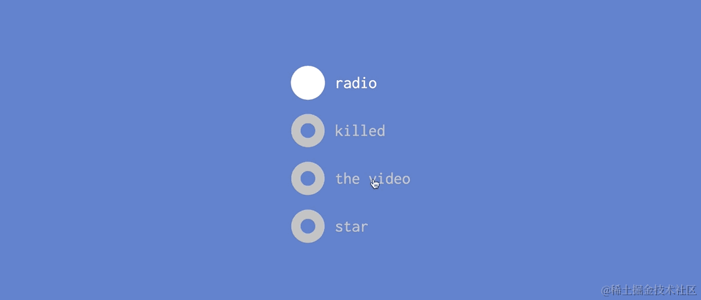

  


> Demo 地址：https://codepen.io/ainalem/full/EbdZrx

  


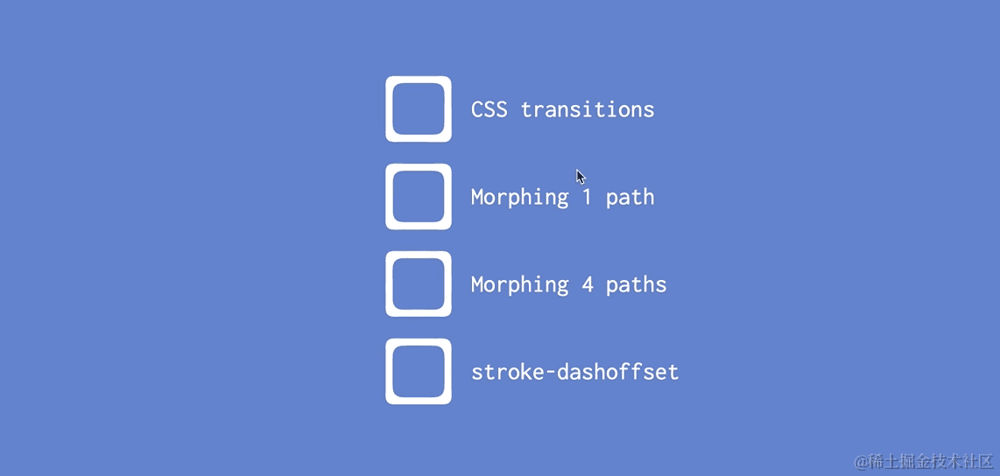

  


> Demo 地址：https://codepen.io/ainalem/full/dZwyBo

  


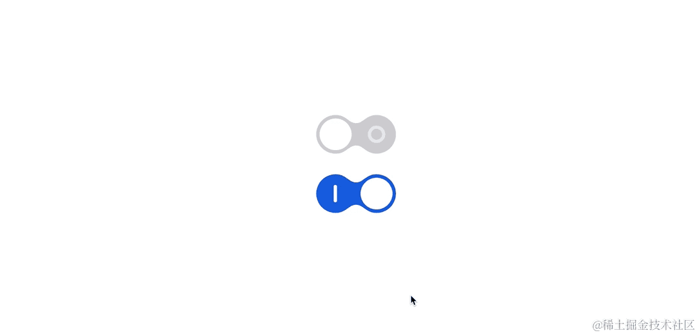

  


> Demo 地址：https://codepen.io/nicolasjesenberger/full/xxmbvxL

  


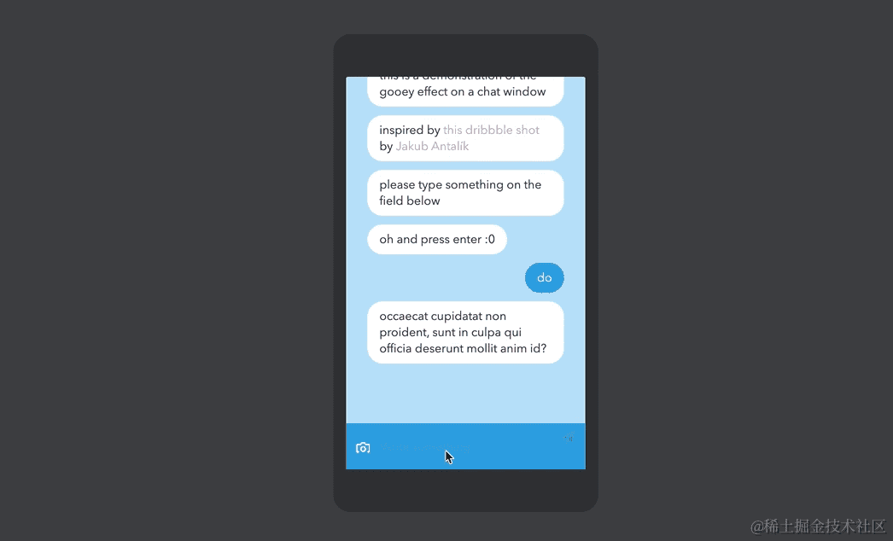

  


> Demo 地址：https://tympanus.net/Development/CreativeGooeyEffects/index.html

  


### 内容切换动画

  


在内容切换动画中，黏糊效果可以使内容之间的过渡更加自然和流畅。当用户切换内容或页面时，内容区域的边缘会产生柔和的流动效果，增强视觉连贯性。

  


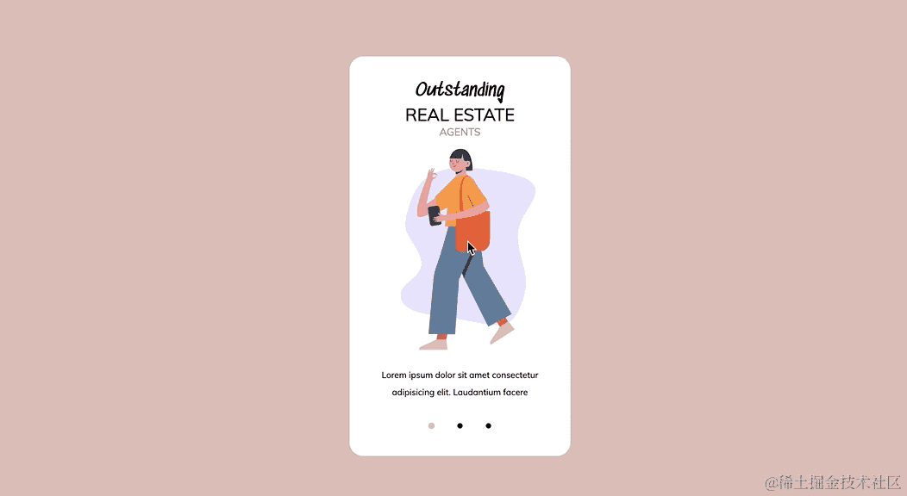

  


> Demo 地址：https://codepen.io/ainalem/full/NWxYBRq

  


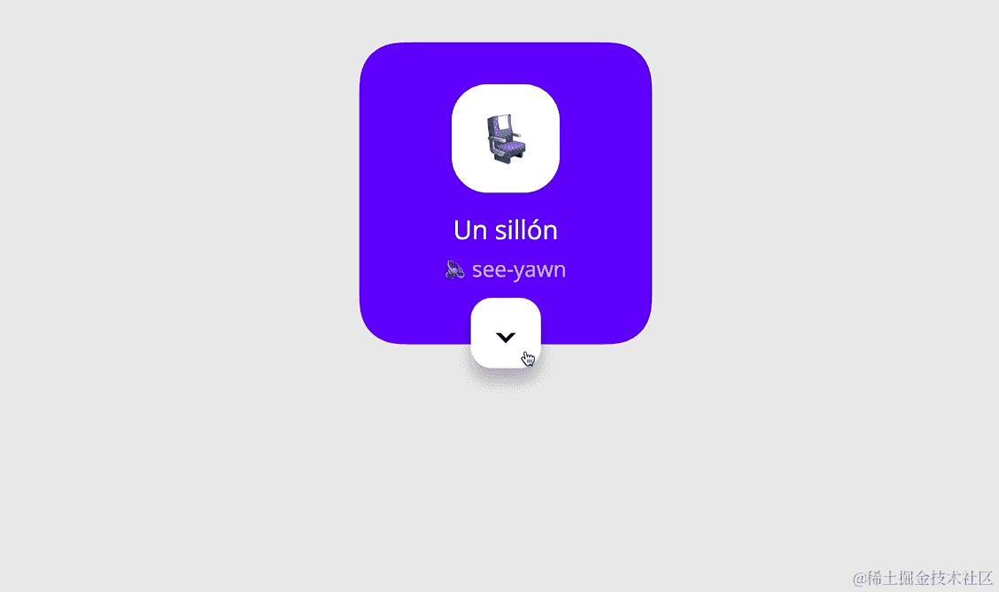

  


> Demo 地址：https://codepen.io/team/keyframers/full/YbGbOd

  


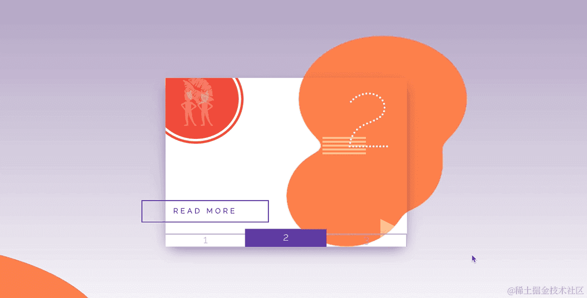

  


> Demo 地址：https://codepen.io/cobra_winfrey/details/dKMpzO

  


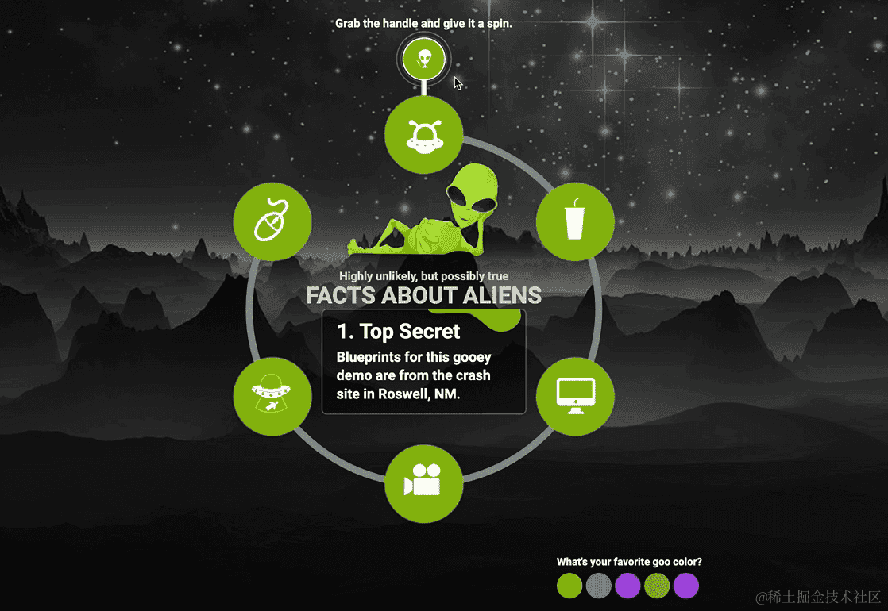

  


> Demo 地址：https://codepen.io/PointC/full/oqeJbo

  


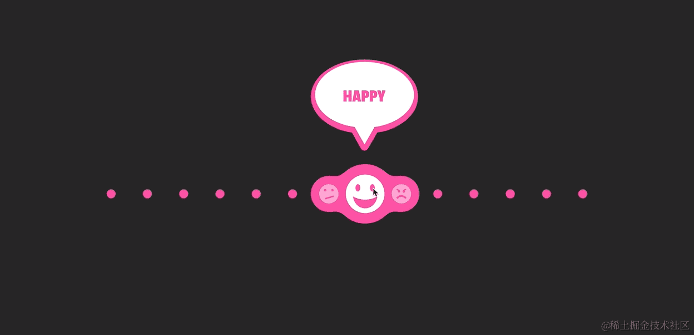

  


> Demo 地址：https://codepen.io/chrisgannon/full/GZNgLw

  


### 背景装饰

  


背景装饰中使用黏糊效果可以增强页面的视觉吸引力，使背景看起来更加动态和有趣。

  


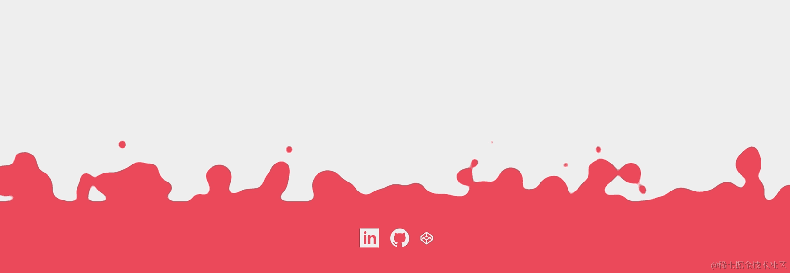

  


> Demo 地址：https://codepen.io/victor-cervantes/full/WNzoQXM

  


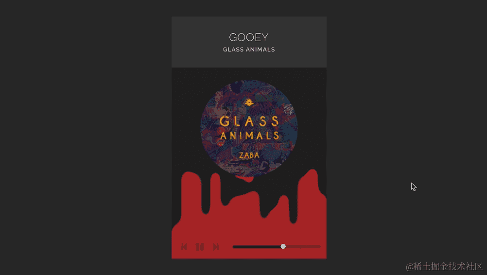

  


> Demo 地址：https://tympanus.net/Development/CreativeGooeyEffects/player.html

  


这里所列举的只是黏糊效果在 Web 常见场景，事实上还有很多黏糊效果的应用，这里就不一一列举了！

  


通过以上这些应用场景，我们可以看到黏糊效果在提升 Web 互动性和视觉吸引力方面具有广泛的应用前景。掌握这些应用场景和实现技术，可以让 Web 开发者在自己的项目中创造出更加引人注目的效果，提升用户体验。

  


## 制作黏糊效果的核心技术

  


看到上面展示的黏糊效果，是不是有一种冲动，想在自己的项目中也加类似的效果，但内心又有一种恐惧，甚至是无从下手。如果是的话，接下来的内容将能帮你解惑！

  


时至今日，制作黏糊效果主要有两种主流技术，一种是纯 CSS 技术，另一种就是 CSS 与 SVG 滤镜结合的技术。我们从简单的 CSS 技术聊起。从易到难，使你更好的掌握该项技术。

  


### 纯 CSS 制作黏糊效果

  


这个技巧相当简单，使用 [CSS 的滤镜属性 filter](https://juejin.cn/book/7223230325122400288/section/7259669043622690853#heading-1) 同时对元素添加模糊（`blur()`）和对比度（`contrast()`）。`blur()` 会使元素变得模糊，而 `contrast()` 则与 `blur()` 对抗，更倾向于显著的颜色变化。如果对比度足够高，你会得到一个（相对）清晰的形状。

  


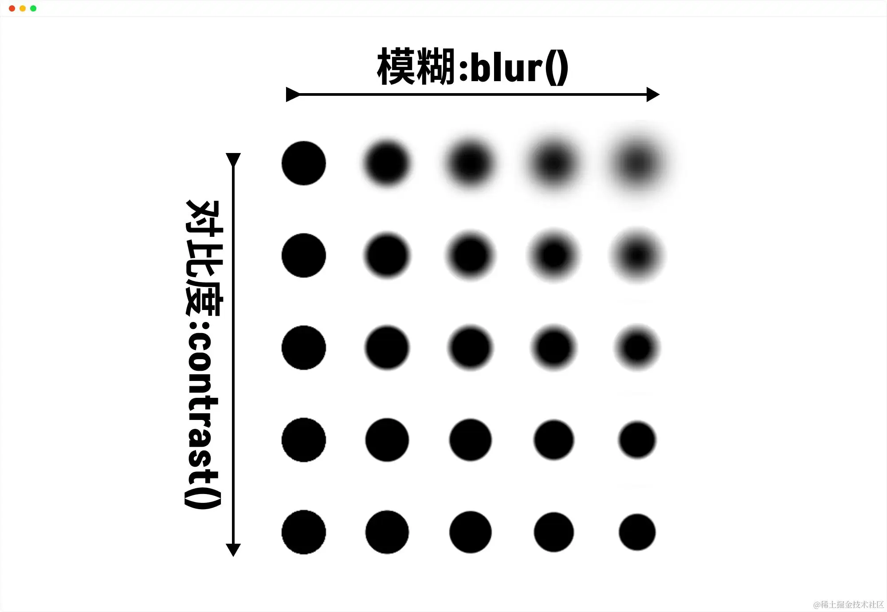

  


奇妙之处在于，当两个模糊（但被迫看起来不模糊）的元素彼此靠近时，它们潜在的模糊会产生足够的颜色对比，使这些形状看起来实际上连接在一起的。

  


```HTML
<div class="blobs">
    <div class="blob"></div>
    <div class="blob"></div>
</div>
<div class="blobs blobs--contrast">
    <div class="blob"></div>
    <div class="blob"></div>
</div>
```

  


```CSS
.blobs {
    background-color: #fff; /* 为了 blob 的对比度，这个必须设置 */
    display: flex;
    align-items: center;
    padding: 4rem; /* 尽量让 blob 不要与边缘相接触，不然会有很奇怪的事情发生 */
    gap: 6px;

    .blob {
      width: 100px;
      aspect-ratio: 1;
      border-radius: 50%;
      background: #000; /* 与 blobs 背景颜色有要鲜明的对比度，否则无效 */
      filter: blur(15px);
    }
}

.blobs--contrast {
    filter: contrast(20);
}
```

  


我发现如果你先模糊形状（例如示例中 `.blob` 设置 `blur(15px)`），然后对整个区域添加对比度（例如示例中的 `.blobs` 设置 `contrast(20)`），会更容易实现这种效果。

  


  


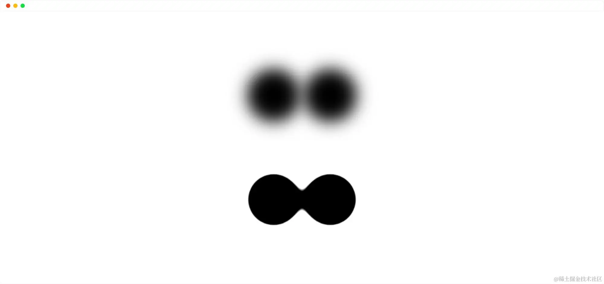

> Demo 地址：https://codepen.io/airen/full/GRaQyJQ

  


当你给这些元素添加动画，让它们四处移动时，效果会变得有趣起来。下面是一个可以调整数值的演示，包括亮度，它会影响模糊效果：

  


  


> Demo 地址：https://codepen.io/airen/full/zYQRRzR

  


正如你所看到的，使用 CSS 制作黏糊效果，有几个关键要素：

  


-   元素颜色需要具有足够高的对比度
-   利用 CSS 的 `filter` 的 `blur()` 和 `contrast()` 产生黏糊效果
-   使用 CSS 动画给元素添加动画效果，产生动画化的粘稠效果

  


上面展示的是 `blur()` 和 `contrast()` 分别应用于不同的元素上，其实它们同时应用于父容器上，效果会更会佳。例如：

  


```HTML
<div class="blobs">
    <div class="blob"></div>
    <div class="blob"></div>
</div>
```

  


```CSS
@layer demo {
    .blobs {
        --size: 25vmin;
        display: grid;
        width: calc(var(--size) * 5);
        height: calc(var(--size) * 1.5);
        place-content: center;
        pointer-events: none;
        background-color: #000; /* 这个很重要 */
        padding: 1rem;
        filter: blur(20px) contrast(30); /* 顺序很重要  */
    
        > * {
            grid-area: 1 / 1 / -1 / -1;
        }
    
        .blob {
            translate: 0 0;
            background: #fff; /* 这个很重要 */
            width: var(--size);
            aspect-ratio: 1;
            border-radius: 50%;
            
            &:first-of-type {
                animation: slide 4s infinite alternate ease-in-out;
            }
        }
    }

    @keyframes slide {
        0% {
            translate: -150% 0;
        }
        100% {
            translate: 150% 0;
        }
    }
}
```

  


注意，在这个示例中，我们把 `blur()` 和 `contrast()` 都应用在 `.blobs` 上，最终呈现的效果也是我们所期望的。除了与之前示例一样，颜色要有较高的对比度之外，还要注意应用于 `.blobs` 的 `filter` 滤镜的顺序，`blur()` 必须出现在 `contrast()` 前面，否则将达不到你期望的黏糊效果：

  


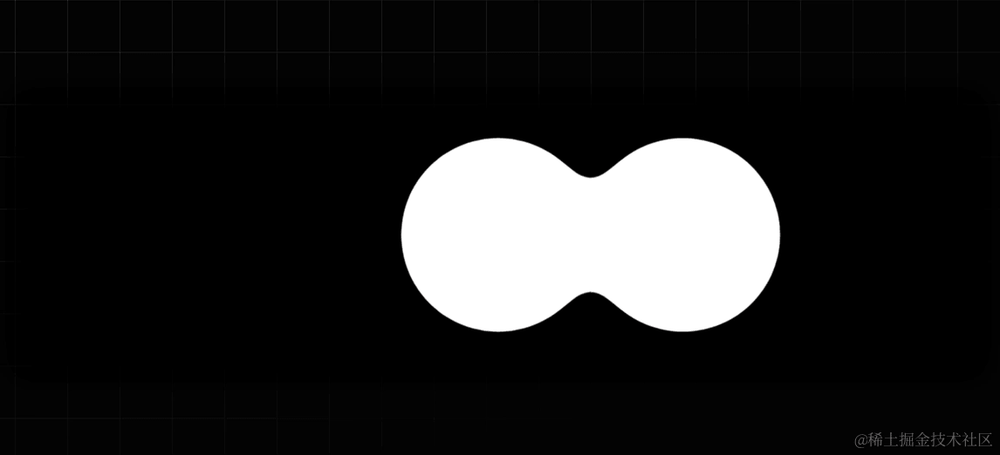

  


> Demo 地址：https://codepen.io/airen/full/abrqYoX

  


如果你感兴趣，可以尝试着调整 `.blob` 元素的 `background` 值，甚至加上混合模式（`mix-blend-mode`），可能会给你带来意外的惊喜：

  


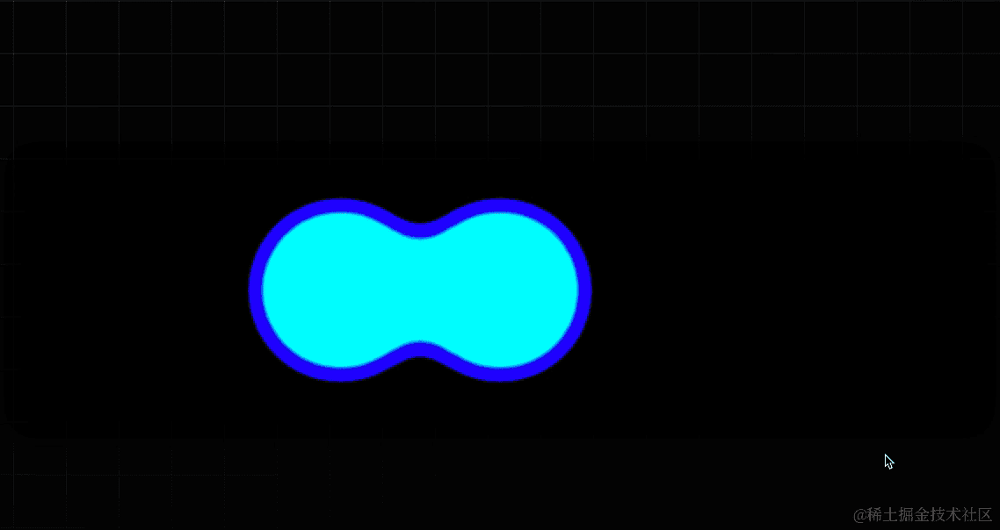

  


我想，你现在应该知道如何使用 CSS 的 `filter` 来实现黏糊效果。我们来看一个简单的案例，这个案例可以用于翻页的进度指示器上：

  


```HTML
<ul class="pagination">
    <li class="dot select">1</li>
    <li class="dot">2</li>      
</ul>
```

  


关键的 CSS：

  


```CSS
@layer demo {
    .pagination {
        list-style-type: none;
        background: black;
        filter: blur(5px) contrast(10);
        padding: 20px;
        position: relative;
        display: flex;
        align-items: center;
        gap: 1.5rem;
    }
    .dot {
        border-radius: 100%;
        width: 30px;
        aspect-ratio: 1;
        background: white;
        cursor: pointer;
        color: white;
        position: relative;
        z-index: 2;
    }
    .select {
        width: 40px;
        position: absolute;
        z-index: 3;
        top: 15px;
        left: 0px;
        pointer-events: none;
    }
}
```

  


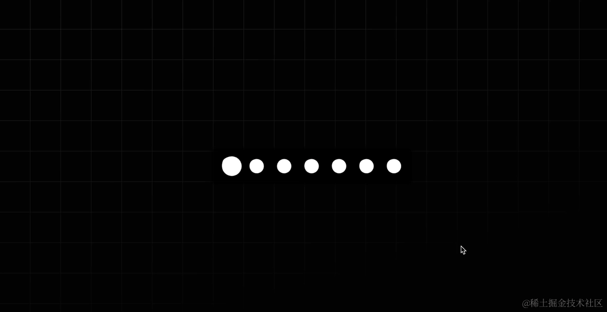

  


> Demo 地址：https://codepen.io/airen/full/WNBMMaR

  


注意，示例的交互效果是通过 [GSAP](https://gsap.com/) 来实现的，具体的代码就不在这里展示了，感兴趣的可以阅读案例源码。

  


上面所呈现的都是一些简单的用例，但这并不意味着你不能使用这种技术来创建复杂的效果。例如，下面这个由 [@Chokcoco 提供的案例](https://codepen.io/Chokcoco/full/vYExwvm)，使用相似的技术，模拟了“华为手机允电”的动画效果：

  


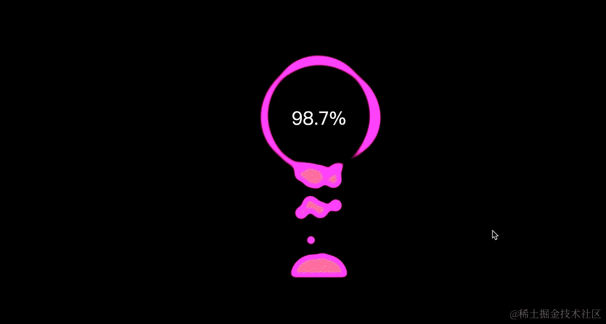

  


> Demo 地址：https://codepen.io/Chokcoco/full/vYExwvm （来源于 @Chokcoco ）

  


正如你所看到的，CSS 制作黏糊效果，虽然可以带来一些非常酷炫的视觉效果，但也存在一些局限性：

  


-   容器需要一个背景色，因此没有透明度
-   难以使黑白以外的颜色
-   将内容模糊在一起，使其不可见

  


总的来说，这使得黏糊效果大打折扣，甚至不怎么实用。但是，使用 SVG 滤镜，我们可以做到一些纯 CSS 滤镜无法做到的事情。这意味着，使用 SVG 滤镜制作的黏糊效果，实用性更强。接下来，我们进入 SVG 滤镜的世界，看看 SVG 滤镜又是如何实现黏糊效果的。

  


### 使用 SVG 滤镜制作黏糊效果

  


之前提到过，使用 SVG 滤镜可以做到一些 CSS 滤镜无法做到的事情。例如：

  


-   **只增强透明度对比度**：我们可以只增加透明度（Alpha 通道）的对比度，而不改变颜色。这样，我们可以让元素的边缘更清晰，而保持其颜色不变
-   **显示原始内容**：通过使用 `SourceGraphic` 关键字，我们可以使滤镜处理后的内容显示出来。这意味着我们可以同时看到处理前和处理后的效果
-   **透明背景的需求**：由于我们处理的是透明度通道，背景必须是透明的，否则效果不会如预期显示。所以使用时要确保背景是透明的

  


具体来说，使用 SVG 滤镜制作黏糊效果的核心技术主要依赖以下几个滤镜：

  


-   `<feGaussianBlur>` 滤镜基元，使元素变得模糊，这是黏糊效果的基础
-   `<feColorMatrix>` 滤镜基元，调整图像颜色和透明度，通过增加对比度来强化模糊效果，从而产生黏糊效果
-   `<feComposite>` 滤镜基元，将处理后的图像与原始图像进行复合，确保最终显示的是原始颜色与透明度效果叠加的结果

  


注意，`<feComposite>` 滤镜基元也可以替换成 `<feBlend>` 或 `<feMerge>` 滤镜基元，但这两者的使用方式和效果有所不同。

  


```XML
<svg class="sr-only">
    <defs>
        <filter id="goo1" color-interpolation-filters="linearRGB" x="-10%" y="-10%" width="120%" height="120%">
            <feGaussianBlur  result="GOOEY__BLUR__10" in="SourceGraphic" stdDeviation="10" />
            <feColorMatrix values="
                1 0 0 0 0                                      
                0 1 0 0 0
                0 0 1 0 0
                0 0 0 18 -7" type="matrix" result="GOOEY__COLOR__10" in="GOOEY__BLUR__10"  />
            <feComposite result="GOOEY__COLOR__10" in="GOOEY__BLUR__10" operator="atop" />
        </filter>
        
        <filter id="goo2" color-interpolation-filters="linearRGB" x="-10%" y="-10%" width="120%" height="120%">
            <feGaussianBlur  result="GOOEY__BLUR__20" in="SourceGraphic" stdDeviation="10" />
            <feColorMatrix  values="
                1 0 0 0 0                                      
                0 1 0 0 0
                0 0 1 0 0
                0 0 0 18 -7" type="matrix" result="GOOEY__COLOR__20" in="GOOEY__BLUR__20"/>
            <feBlend in="SourceGraphic" in2="GOOEY__COLOR__20" />
        </filter>
        
        <filter id="goo3" color-interpolation-filters="linearRGB" x="-10%" y="-10%" width="120%" height="120%">
            <feGaussianBlur  result="GOOEY__BLUR__30" in="SourceGraphic" stdDeviation="10" />
            <feColorMatrix  values="
                1 0 0 0 0                                      
                0 1 0 0 0
                0 0 1 0 0
                0 0 0 18 -7" type="matrix" result="GOOEY__COLOR__30" in="GOOEY__BLUR__30"/>
            <feMerge>
                <feMergeNode in="GOOEY__COLOR__30" />
                <feMergeNode in="SourceGraphic" />
            </feMerge>
        </filter>
    </defs>
</svg>
```

  


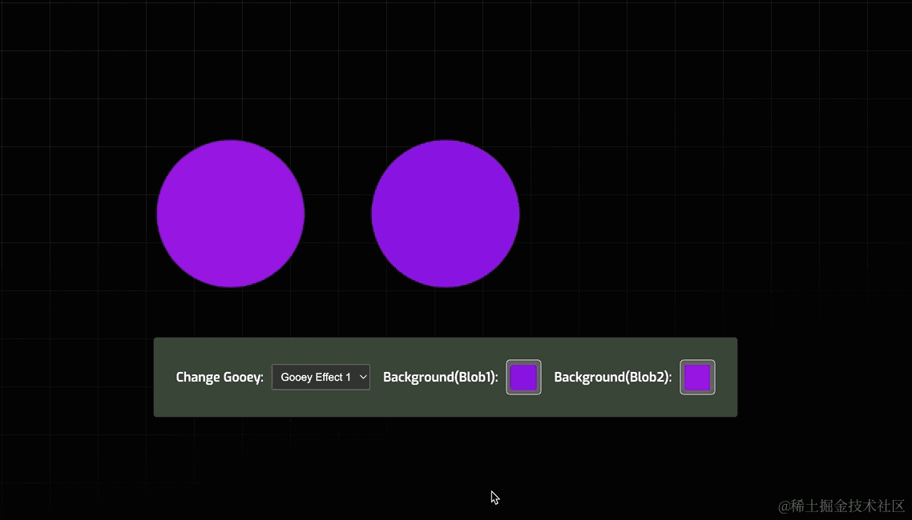

  


> Demo 地址：https://codepen.io/airen/full/jOoZxLj

  


我们以 `#goo1` 为例：

  


```XML
<filter id="goo1" color-interpolation-filters="linearRGB" x="-10%" y="-10%" width="120%" height="120%">
    <feGaussianBlur  result="GOOEY__BLUR__10" in="SourceGraphic" stdDeviation="10" />
    <feColorMatrix values="
        1 0 0 0 0                                      
        0 1 0 0 0
        0 0 1 0 0
        0 0 0 18 -7" type="matrix" result="GOOEY__COLOR__10" in="GOOEY__BLUR__10"  />
    <feComposite result="GOOEY__COLOR__10" in="GOOEY__BLUR__10" operator="atop" />
</filter>
```

  


代码很简短，让我们拆解一下：

  


-   首先，使用 `<feGaussianBlur>` 滤镜对 `SourceGraphic` 应用了一个 `10px` 的模糊，并将该结果命名为 `GOOEY__BLUR__10`
-   然后，使用 `<feColorMatrix>` 滤镜调整前一个结果（`GOOEY__BLUR__10`）的颜色和透明度，以增加 Alpha 通道的对比度。也给结果命名，比如 `GOOEY__COLOR__10`
-   最后，使用 `<feComposite>` 滤镜将前两个滤镜的结果（`GOOEY__BLUR__10` 和 `GOOEY__COLOR__10`）进行合成操作。在这里，我们可以使用带有 `atop` 操作符的 `<feComposite>` 滤镜来遮罩粘液外的任何内容

  


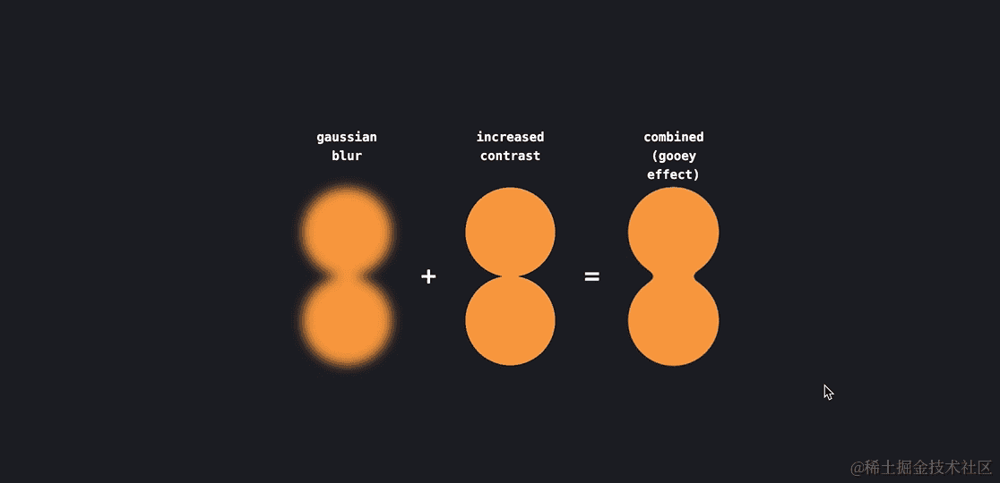

  


就这三个滤镜基础元而言，其中 `<feGaussianBlur>` 和 `<feComposite>` （以及 `<feBlend>` 和 `<feMerge>`）相对比较简单，最为复杂的是 `<feColorMatrix>` 滤镜基础。之前我们专门有一节课《[SVG 滤镜的进阶之高阶颜色矩阵](https://juejin.cn/book/7341630791099383835/section/7368318058076569638)》详细阐述了 `<feColorMatrix>` 滤镜。

  


简单的回顾一下 `<feColorMatrix>` 滤镜，它其实就是一个“四行五列”（`4 x 5`）的颜色矩阵，如下图所示：

  


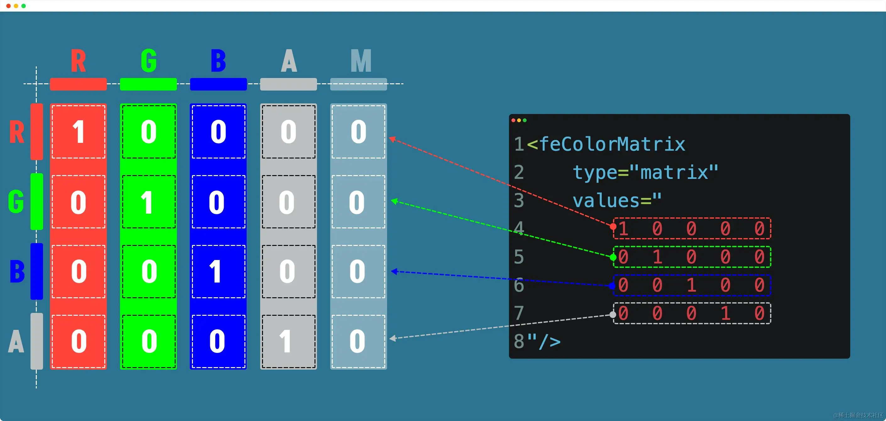

  


这是一个标准颜色矩阵。你可以将其理解为：基于 RGBA 输入，输出的 RGBA 应该是什么？

  


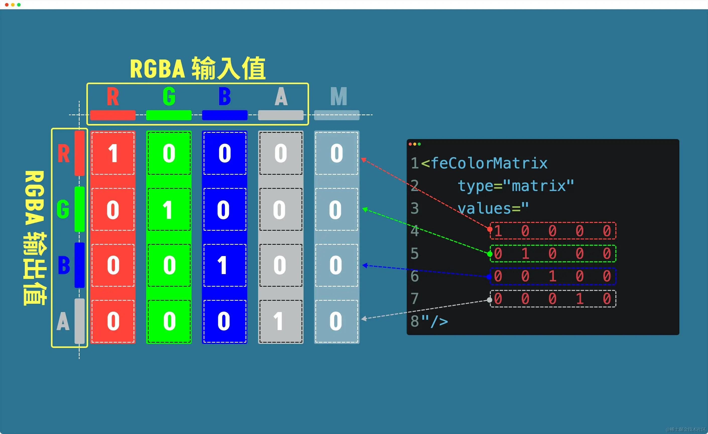

  


每个 RGBA 列中的数字作为乘数。上面的矩阵对图像没有任何影响。这是因为红色输入进来时，我们将其乘以`1` 得到红色输出。因此，图像中的红色数量不会改变。对于绿色输入值，绿色行中的乘数 `1` 使其输出相同的值，蓝色和Alpha 通道同理。最后一列被添加到输出中，可以使输出的值增加或减少，这意味着那里有一个数字会将其值乘以 `255` 后加到其通道。

  


回到上面示例中的 `<feColorMatrix>` 滤镜：

  


```XML
<feColorMatrix 
    values="
        1 0 0 0 0                                      
        0 1 0 0 0
        0 0 1 0 0
        0 0 0 18 -7" 
    type="matrix" 
    result="GOOEY__COLOR__10" 
    in="GOOEY__BLUR__10"  />
```

  


该矩阵使用了 `<feGaussianBlur>` 滤镜的输出结果（`GOOEY__BLUR__10`）来进行修改。除了Alpha通道外，其他所有内容都保持不变。

  


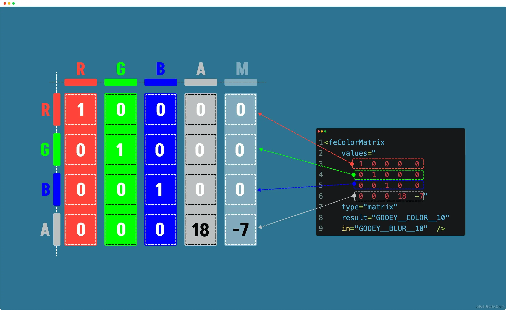

  


这使得 RGB 通道保持不变，将 Alpha 通道的值乘以 `18`，然后从该值中减去 `7 x 255`，有效地仅增加透明度的对比度。这里的 `18` 和 `-7` 是通过经验得出的数值，用于增强对比度，这些值可以根据需要进行调整。

  


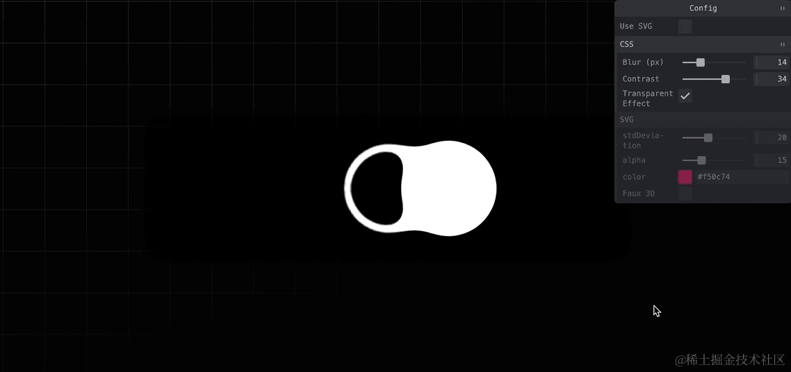

  


> Demo 地址：https://codepen.io/airen/full/NWVyBJz

  


## 案例

  


我想，你现在已经知道如何使用 CSS 和 SVG 技术来创建黏糊效果了。接下来，我们来看一些实际的案例，希望通过些案例能帮助大家更好的将黏糊效果应用到自己的项目中。

  


注意，在接下来的示例中，如果无特殊声明，都将采用下面这个黏糊滤镜效果：

  


```XML
<svg class="sr-only">
    <defs>
        <filter id="goo" color-interpolation-filters="linearRGB" x="-10%" y="-10%" width="120%" height="120%">
            <feGaussianBlur  result="GOOEY__BLUR__10" in="SourceGraphic" stdDeviation="10" />
            <feColorMatrix values="
                1 0 0 0 0                                      
                0 1 0 0 0
                0 0 1 0 0
                0 0 0 18 -7" type="matrix" result="GOOEY__COLOR__10" in="GOOEY__BLUR__10"  />
          <feComposite in="SourceGraphic" in2="GOOEY__COLOR__10" operator="atop"/>
        </filter>
    </defs>
</svg>
```

  


### 导航菜单

  


我们先从 Web 上最常见的导航菜单开始。

  


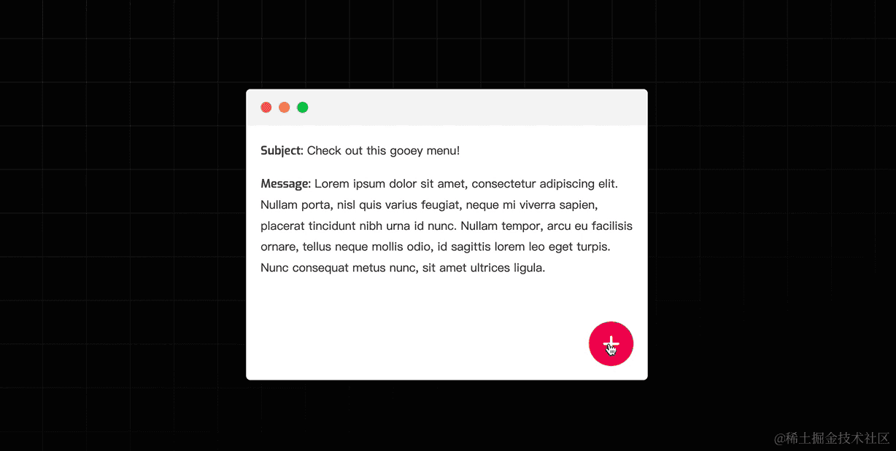

  


> Demo 地址：https://codepen.io/airen/full/JjqpaMN

  


这个示例中菜单项对应的 HTML 结构如下所示：

  


```HTML
<div class="blobs">
    <div class="blob blob--button" style="--index: 0;">
        <svg class="icon--plus">
            <use href="#plus" />
        </svg>
    </div>
    <div class="blob" style="--index: 1;">
        <svg class="icon--paper-plane">
            <use href="#paper-plane" />
        </svg>
    </div>
    <div class="blob" style="--index: 2;">
        <svg class="icon--save">
            <use href="#save" />
        </svg>
    </div>
    <div class="blob" style="--index: 3;">
        <svg class="icon--image">
            <use href="#image" />
        </svg>
    </div>
</div>
```

  


使用 CSS 对导航项进行美化和布局：

  


```CSS
.blobs {
    filter: url("#goo");
    position: absolute;
    bottom: 20px;
    right: 20px;
    width: 60px;
}

.blob {
    --nums: 4; /* blobs*/
    --z-index: calc(var(--nums) - var(--index));
    --translateY: 80px;
    width: 60px;
    aspect-ratio: 1;
    background: #f50057;
    border-radius: 50px;
    color: #fff;
    display: grid;
    place-content: center;
    position: absolute;
    left: 0;
    bottom: 0;
    cursor: pointer;
    z-index: var(--z-index);

    &:nth-child(2) {
        transition: all ease 0.3s;
    }

    &:nth-child(3) {
        transition: all ease 0.35s;
    }

    &:nth-child(4) {
        transition: all ease 0.4s;
    }

    svg {
        display: block;
        width: 45%;
        aspect-ratio: 1;
        color: #fff;
        fill: currentColor;
        place-self: center;
        transition: all 0.2s linear;
    }
}

.blobs.open {
    .icon--plus {
        rotate: 45deg;
    }

    .blob {
        translate: 0 calc(-1 * var(--index) * var(--translateY));
    }
}
```

  


整个导航定位在窗口的右下角，菜单展开时，每个选项通过 `translate` 沿着 `Y` 轴向上移，这个位置根据需要来定义。我在示例中，通过 CSS 的自定义属性 `--index` 和 `--translateY` 来计算每个菜单选项在 `Y` 轴的偏移量。这样做的好处是，你随时增加菜单项都不会影响布局，它会自动完成。

  


另外，每个菜单选项的 `z` 轴层级也是通过 `--index` 自动计算，在 HTML 中越早出现的菜单选项，其 `z` 轴的层级越高。

  


最为关键的是，我们需要在 `.blobs` 上设置 `filter` 属性的值为 `url(#goo)` ，这样才能使导航菜单具有黏糊效果。你需要将前面定义黏糊效果的 SVG 代码内联到你的 HTML 中。

  


```CSS
.blobs {
    filter: url("#goo");
}
```

  


就这样！一个具有黏糊效果的导航菜单就完成了。

  


其实，在这个导航菜单的基础上，你只需要改变图标的内容和调整导航菜单项的布局，你将演变出很多种具有黏糊效果的导航菜单。

  


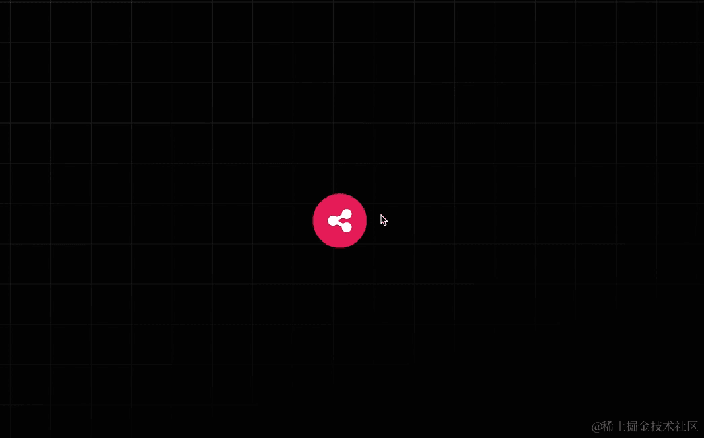

  


> Demo 地址：https://codepen.io/airen/full/VwOQEEO

  


注意，这是一个圆形导航菜单，每个菜单项在圆周上的位置是通过 CSS 的三角函数计算出来的，如果你从未接触过这方面的知识，请移步阅读《[CSS 的三角函数](https://juejin.cn/book/7223230325122400288/section/7242216512176521277)》！

  


在上面的示例基础上，稍微调整圆的半径，你将得到一个新的导航菜单效果：

  


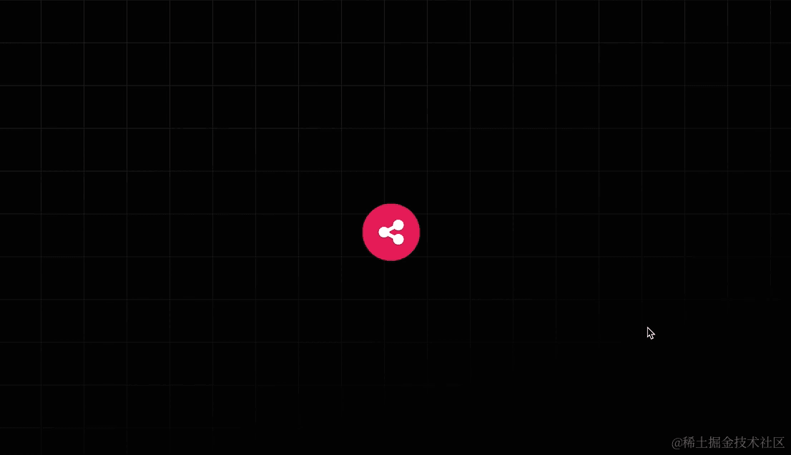

  


> Demo 地址：https://codepen.io/airen/full/QWRQJGa

  


我们再来看一个[由 @Simon Goellner 提供的导航菜单案例](https://codepen.io/simeydotme/full/LYLxJqV)：

  


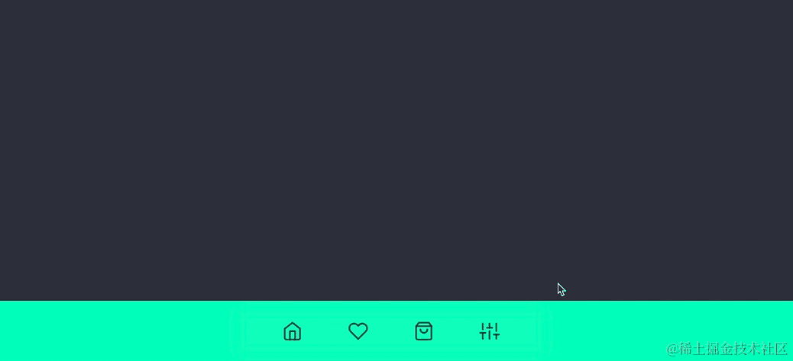

  


> Demo 地址：https://codepen.io/simeydotme/full/LYLxJqV （来源于 @Simon Goellner ）

  


这个案例与之前的几个导航菜单在实现上略有不同。最大的不同之处，应用之前定义的 `#goo` 滤镜效果（黏糊效果）会使所有 SVG 图标在视觉上丢失。因此， @Simon Goellner 在 HTML 的结构上做了一些调整，并且重新定义了 `#goo` 滤镜效果：

  


```HTML
<nav>
    <!-- 黏糊导航菜单背景 -->
    <aside class="goo">
        <ul>
            <li></li>
            <!-- 省略其他几个，需要与 menu 的列表项数量相等 -->
        </ul>
    </aside>
    <!-- 实际导航菜单，不应用黏糊滤镜  -->
    <ul class="menu">
        <li>
            <a href="#"><svg viewBox="0 0 24 24"><use href="#home" /></svg></a>
        </li>
        <!-- 省略其他导航菜单项 -->
    </ul>
</nav>

<svg viewBox="0 0 24 24">
    <!-- 黏糊滤镜效果 -->
    <filter id="schlurp">
        <feGaussianBlur id="SourceGraphic" stdDeviation="10" />
        <feColorMatrix values="
           1 0 0 0   0
           0 1 0 0   0
           0 0 1 0   0 
           0 0 0 20  -10
        " />
    </filter>
</svg>
```

  


你可能已经发现了，这个示例只使用了 `<feGaussianBlur>` 和 `<feColorMatrix>` 滤镜定义黏糊效果。然后在 `.goo` 和 `.goo ul` 上引用黏糊滤镜：

  


```CSS
.goo,
.goo ul {
    background: inherit;
    filter: url("#schlurp"); 
}
```

  


其他相关的样式，这里就不展示了，感兴趣的同学可以阅读案例源码。有的同学可能会对导航菜单的弹跳动画感兴趣，这个动画是一个 CSS 过渡动画，在鼠标悬浮状态改变了导航菜单项的 `translateY` 的值。最为关键的是，缓动函数应用的是 `linear()` 函数，模拟的是一个弹簧效果。如果你想更深入的了解这方面的知识，请移步阅读《[Web 动画之旅](https://s.juejin.cn/ds/ijos2qQa/)》中的 《[使用 `linear()` 函数创建令人惊叹的动画曲线](https://juejin.cn/book/7288940354408022074/section/7301665456824254515)》！

  


我在研究这个案例效果的时候，也非常好奇！我尝试着使用我所掌握的知识，对该导航菜单的效果做了一些尝试性的调整，虽然在视觉效果上与原案例略有差异，但在结构上比之前的要简洁一些：

  


```HTML
<nav>
    <ul class="menu">
        <li>
            <a href="#"><svg class="icon icon--home"><use href="#home" /></svg></a>
        </li>
        <!-- 省略其他的导航菜单项 -->
    </ul>
</nav>
```

  


与此同时，我使用下面的 SVG 来创建黏糊滤镜效果：

  


```XML
<svg class="sr-only">
    <defs>
        <filter id="goo" color-interpolation-filters="linearRGB" x="0%" y="0%" width="100%" height="100%">
            <feGaussianBlur  result="GOOEY__BLUR__10" in="SourceGraphic" stdDeviation="10" />
            <feColorMatrix values="
                1 0 0 0 0                                      
                0 1 0 0 0
                0 0 1 0 0
                0 0 0 18 -7" type="matrix" result="GOOEY__COLOR__10" in="GOOEY__BLUR__10"  />
            <!-- <feComposite in="SourceGraphic" in2="GOOEY__COLOR__10" operator="atop"/> -->
            <feBlend in="SourceGraphic" in2="GOOEY__COLOR__10" />
        </filter>
    </defs>
</svg>
```

  


请注意，我使用 `<feBlend>` 滤镜替代了之前的 `<feComposite>` 滤镜。然后在 `nav` 和 `.menu` 上应用已定义的 `#goo` 滤镜：

  


```CSS
nav, menu {
    filter: url(#goo);
}
```

  


与之前案例还有一个不同之处是，在 `li` 元素上添加一个伪元素，并且设置与导航菜单相同的背景颜色，这是为了使导航项弹出时，它与导航背景黏糊在一起：

  


```CSS
.menu {
    position: absolute;
    z-index: 1;
    text-align: center;

    li {
        background: transparent;
        display: flex;
        align-items: flex-start;
        justify-content: center;
        transition: all 0.85s ease;
        height: calc(var(--size) * 2);

        &::before {
            content: "";
            width: 100%;
            height: 50%;
            position: absolute;
            left: 0;
            bottom: 10px;
            border-radius: 100%;
            background: inherit;
            transition: all 0.85s ease;
            translate: 0 0 0;
            will-change: transform;
            backface-visibility: hidden;
            z-index: -1;
        }

        &:hover {
            transition: all calc(var(--duration) - 0.2s) var(--spring-easing);
            translate: 0 var(--distance) 0;
            color: white;
    
            &::before {
                transition: all var(--duration) var(--spring-easing);
                translate: 0 var(--distance) 0;
                background: var(--default);
            }
        }
    }
}
```

  


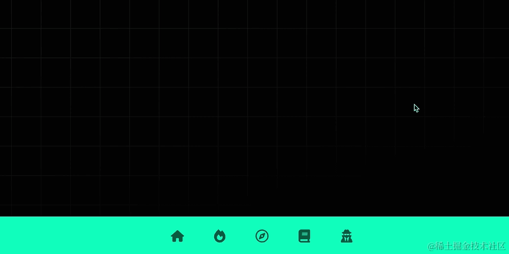

  


> Demo 地址：https://codepen.io/airen/full/MWdQzXZ

  


你可能已经发现了，鼠标悬停在导航菜单项上时，其背景颜色（`li::before`）与导航菜单的背景颜色融合的不是很完美，这是 `<feBlend>` 滤镜所产生的效果。另外，这个效果有一个明显的不足之处，不能像原案例那样为悬停菜单项设置不同的颜色。

  


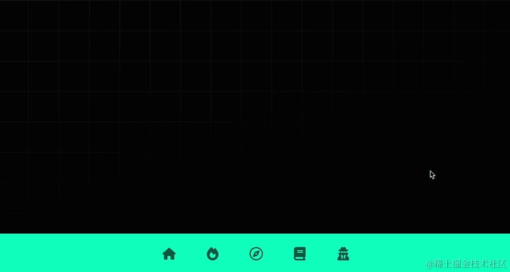

  


### 表单控件

  


现在，在制作表单控件时，你只需要在原有的基础上添加一段具有黏糊效果的 SVG 代码，然后在需要应用黏糊效果的表单控件中引用该滤镜，就使你的表单控件在交互上立即与众不同。例如下面这几个示例。

  


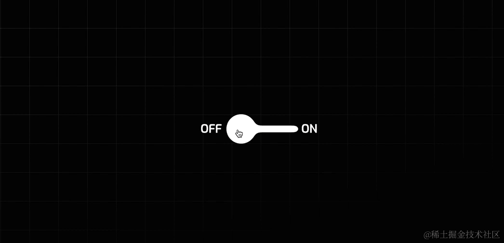

  


> Demo 地址：https://codepen.io/airen/full/LYoQKeE

  


这是一个很常见的 `Switch` 切换按钮（类似单选按钮）。现如今，我们仅使用 CSS 就能实现具有交互效果的 `Switch` ：

  


```HTML
<div class="form">
    <input type="checkbox" class="sr-only" id="goo" name="goo" />
    <span>OFF</span>
    <label for="goo" class="goo"></label>
    <span>ON</span>
</div>
```

  


```CSS
@layer demo {
    .form {
        display: flex;
        align-items: center;
        font-size: 1.5rem;
        font-weight: 900;
    
        span:nth-of-type(1) {
            translate: -70px 0;
            transition: all 0.2s;
        }
        span:nth-of-type(2) {
            translate: 35px 0;
            transition: all 0.2s;
        }
    }
    
    .goo {
        display: flex;
        cursor: pointer;
        position: relative;
        scale: 2;
    
        &::before,
        &::after {
            content: "";
            display: block;
            background: #fff;
            transition: 300ms all ease;
        }
    
        &::before {
            width: 60px;
            height: 6px;
        }
    
        &::after {
            width: 30px;
            aspect-ratio: 1;
            border-radius: 50%;
            position: absolute;
            left: 0;
            top: 50%;
            translate: -15px -50% 0;
        }
    }

    @keyframes switchOn {
        0% {
            scale: 1 1 1;
            translate: -15px -50% 0;
            transform-origin: left center;
        }
        40% {
            scale: 1.4 0.7 0;
            translate: 25px -50% 0;
            transform-origin: right center;
        }
        70% {
            scale: 0.9 1.15 1;
            translate: 35px -50% 0;
        }
        100% {
            scale: 1 1 1;
            translate: 45px -50% 0;
        }
    }
  
    @keyframes switchOff {
        0% {
            scale: 1 1 1;
            translate: 45px -50% 0;
            transform-origin: right center;
        }
        40% {
            scale: 1.4 0.7 0;
            translate: 35px -50% 0;
            transform-origin: right center;
        }
        70% {
            scale: 0.9 1.15 1;
            translate: 0 -50% 0;
        }
        100% {
            scale: 1 1 1;
            translate: -15px -50% 0;
        }
    }

    #goo {
        &:checked {
            ~ .goo {
                &::before {
                    background: oklch(0.76 0.18 80.24);
                }
                &::after {
                    background: oklch(0.76 0.18 80.24);
                    animation: switchOn 250ms linear forwards;
                }
            }
    
            ~ span {
                &:nth-of-type(1) {
                    translate: -35px 0;
                }
                &:nth-of-type(2) {
                    translate: 70px 0;
                    color: oklch(0.76 0.18 80.24);
                }
            }
        }
        
        &:not(:checked) {
            ~ .goo::after {
                animation: switchOff 250ms linear forwards;
            }
        }
    }
}
```

  


通常未使用滤镜时的效果如下所示：

  


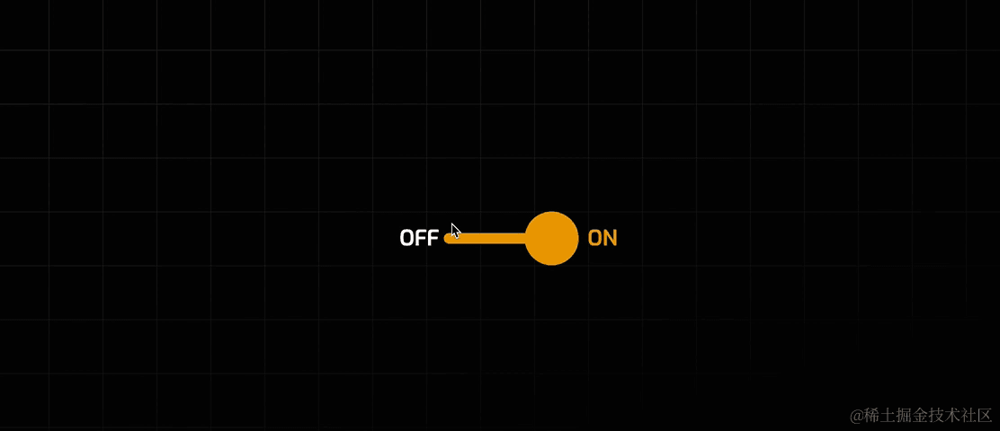

  


现在，你只需要在上面的代码的基础上，在 `.goo` 元素上应用 SVG 定义的黏糊滤镜：

  


```CSS
.goo {
    filter: url("#gooey");
}
```

  


效果立马就与众不同：

  


  


现在整个效果看上去像是在吹气球，是不是更具趣味性了！你可以使用类似的方式将黏糊效果应用于单选按钮、复选框和输入框和按钮等表单控件上。

  


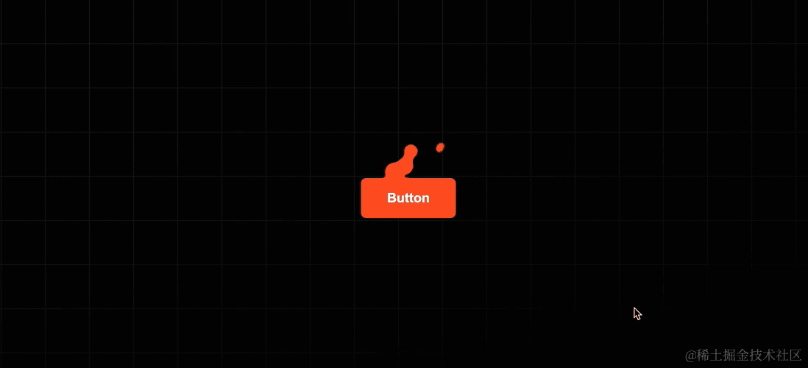

  


> Demo 地址：https://codepen.io/airen/full/WNBMVNg

  


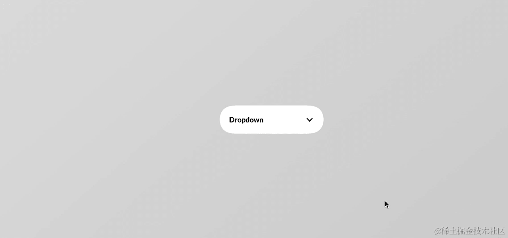

  


> Demo 地址：https://codepen.io/Markshall/full/PoZJRve （来源于 @Markshall ）

  


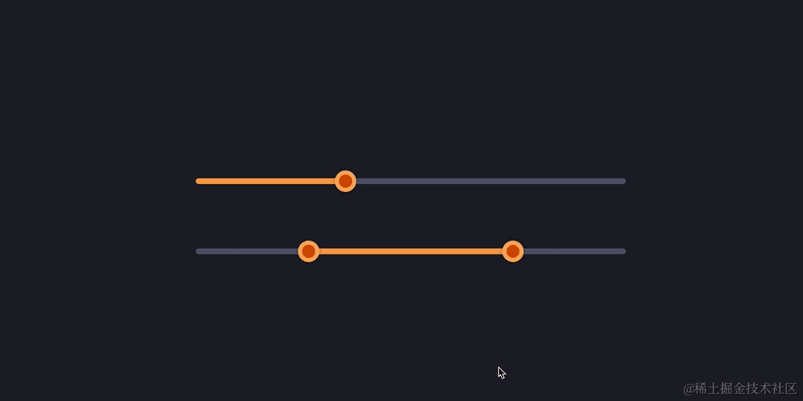

  


> Demo 地址：https://codepen.io/n3r4zzurr0/full/NWyBRpQ （来源于 @Utkarsh Verma ）

  


## 小结

  


有关于黏糊效果的制作我们就聊到这里了。你可能已经发现了，使用 SVG 滤镜制作黏糊效果并没有我们当初想象的那么复杂。简单地说，我们就使用了三个滤镜基元创建了黏糊效果：

  


```XML
<svg class="sr-only">
    <defs>
        <filter id="goo" color-interpolation-filters="linearRGB" x="-10%" y="-10%" width="120%" height="120%">
            <feGaussianBlur  result="GOOEY__BLUR__10" in="SourceGraphic" stdDeviation="10" />
            <feColorMatrix values="
                1 0 0 0 0                                      
                0 1 0 0 0
                0 0 1 0 0
                0 0 0 18 -7" type="matrix" result="GOOEY__COLOR__10" in="GOOEY__BLUR__10"  />
          <feComposite in="SourceGraphic" in2="GOOEY__COLOR__10" operator="atop"/>
        </filter>
    </defs>
</svg>
```

  


只要你愿意，上面这个黏糊效果可以应用于任何 Web 元素上。

  


```CSS
.goo {
    filter: url(#goo);
}
```

  


另外，结合 CSS 和一些动画技术，你将制作出更具吸引人的黏糊效果。有关于这方面更多的案例就不在这里阐述了，我非常期待着你能分享出你制作的一些案例！