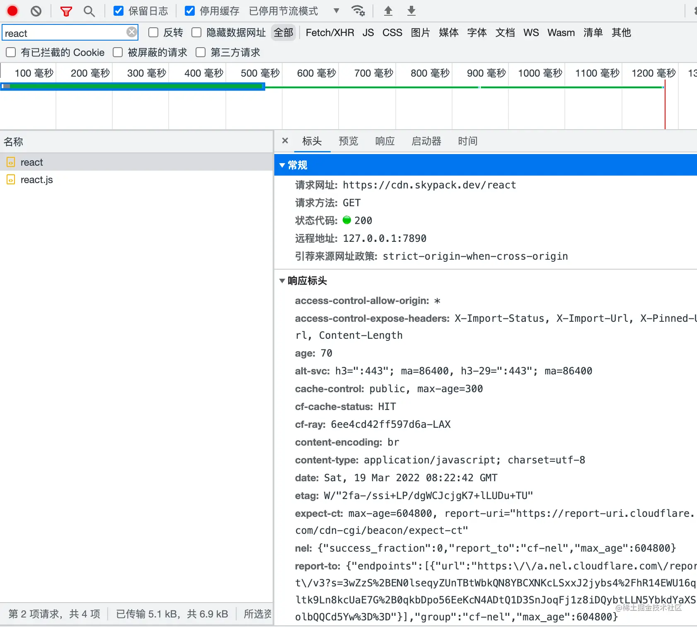
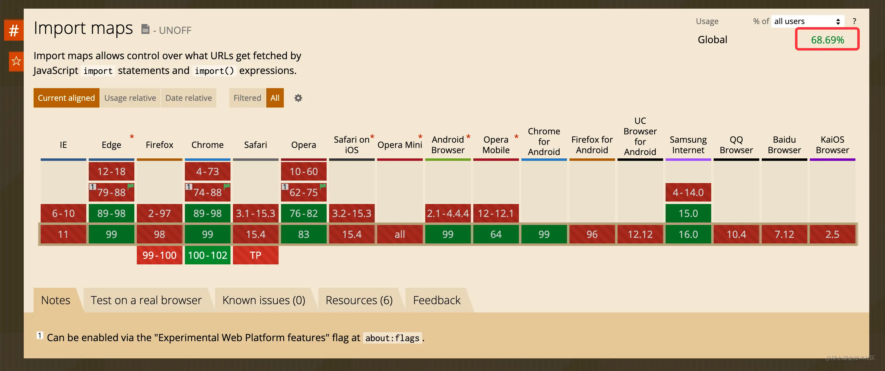
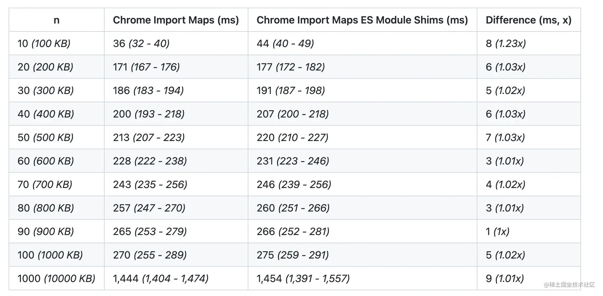
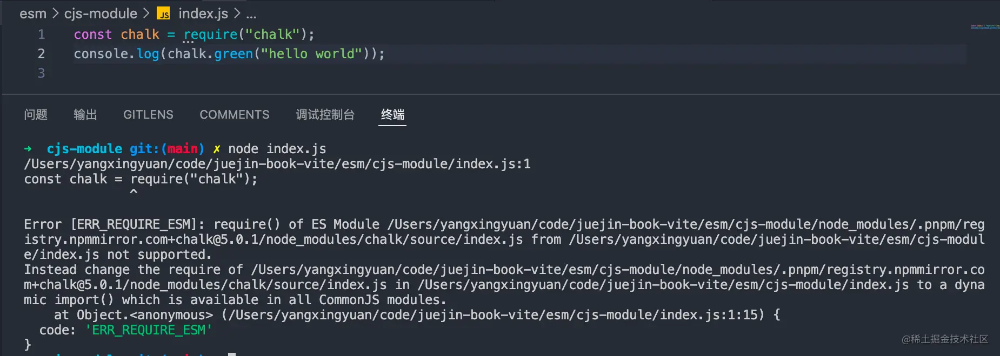
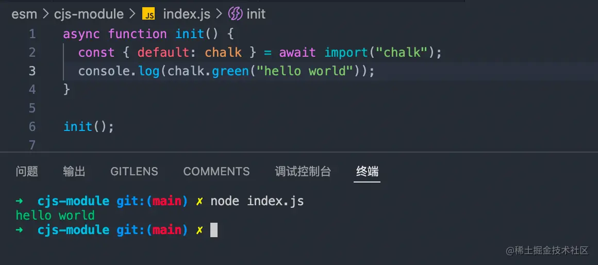

# 18.再谈 ESM：高阶特性 & Pure ESM 时代

在小册导读篇的内容当中，我们就已经详细分析过前端模块化的发展历史，谈到 ESM 已经逐步得到各大浏览器厂商以及 Node.js 的原生支持，正在成为主流前端模块化方案。而 Vite 本身就是借助浏览器原生的 ESM 解析能力(`type="module"`)实现了开发阶段的 `no-bundle`，即不用打包也可以构建 Web 应用。不过我们对于原生 ESM 的理解仅仅停留在 `type="module"`这个特性上面未免有些狭隘了，一方面浏览器和 Node.js 各自提供了不同的 ESM 使用特性，如 `import maps`、package.json 的 `imports`和`exports` 属性等等，另一方面前端社区开始逐渐向 ESM 过渡，有的包甚至仅留下 ESM 产物，`Pure ESM` 的概念随之席卷前端圈，而与此同时，基于 ESM 的 CDN 基础设施也如雨后春笋般不断涌现，诸如`esm.sh`、`skypack`、`jspm`等等。

因此你可以看到，ESM 已经不仅仅局限于一个模块规范的概念，它代表了前端社区生态的走向以及各项前端基础设施的未来，不管是浏览器、Node.js 还是 npm 上第三方包生态的发展，无一不在印证这一点。那么，作为一名 2022 年的前端，我觉得深入地了解 ESM 的高级特性、社区生态都是有必要的，一方面弥补自己对于 ESM 认知上的不足，另一方面也能享受到社区生态带给我们的红利。

在接下来的内容中，我将给你详细介绍浏览器和 Node.js 中基于 ESM 实现的一些`高级特性`，然后分析什么是 `Pure ESM` 模式，这种模式下存在哪些痛点，以及我们作为开发者，如何去拥抱`Pure ESM`的趋势。

## 高阶特性

### import map

在浏览器中我们可以使用包含`type="module"`属性的`script`标签来加载 ES 模块，而模块路径主要包含三种:

- 绝对路径，如 `https://cdn.skypack.dev/react`
- 相对路径，如`./module-a`
- `bare import`即直接写一个第三方包名，如`react`、`lodash`

对于前两种模块路径浏览器是原生支持的，而对于 `bare import`，在 Node.js 能直接执行，因为 Node.js 的路径解析算法会从项目的 node_modules 找到第三方包的模块路径，但是放在浏览器中无法直接执行。而这种写法在日常开发的过程又极为常见，除了将 bare import 手动替换为一个绝对路径，还有其它的解决方案吗？

答案是有的。现代浏览器内置的 `import map` 就是为了解决上述的问题，我们可以用一个简单的例子来使用这个特性:

```html
<!DOCTYPE html>
<html lang="en">

<head>
  <meta charset="UTF-8">
  <meta http-equiv="X-UA-Compatible" content="IE=edge">
  <meta name="viewport" content="width=device-width, initial-scale=1.0">
  <title>Document</title>
</head>

<body>
  <div id="root"></div>
  <script type="importmap">
  {
    "imports": {
      "react": "https://cdn.skypack.dev/react"
    }
  }
  </script>

  <script type="module">
    import React from 'react';
    console.log(React)
  </script>
</body>

</html>
```

在浏览器中执行这个 HTML，如果正常执行，那么你可以看到浏览器已经从网络中获取了 react 的内容，如下图所示:

> 注意: importmap 可能存在浏览器兼容性问题，这里出现浏览器报错也属于正常情况，后文会介绍解决方案。



在支持 `import map`的浏览器中，在遇到`type="importmap"`的 script 标签时，浏览器会记录下第三方包的路径映射表，在遇到`bare import`时会根据这张表拉取远程的依赖代码。如上述的例子中，我们使用 `skypack`这个第三方的 ESM CDN 服务，通过`https://cdn.skypack.dev/react`这个地址我们可以拿到 React 的 ESM 格式产物。

`import map`特性虽然简洁方便，但浏览器的兼容性却是个大问题，在 CanIUse 上的兼容性数据如下:



它只能兼容市面上 `68%` 左右的浏览器份额，而反观`type="module"`的兼容性(兼容 95% 以上的浏览器)，`import map`的兼容性实属不太乐观。但幸运的是，社区已经有了对应的 Polyfill 解决方案——[es-module-shims](https://github.com/guybedford/es-module-shims)，完整地实现了包含 `import map`在内的各大 ESM 特性，还包括:

1. `dynamic import`。即动态导入，部分老版本的 Firefox 和 Edge 不支持。

2. `import.meta`和`import.meta.url`。当前模块的元信息，类似 Node.js 中的 `__dirname`、`__filename`。

3. `modulepreload`。以前我们会在 link 标签中加上 `rel="preload"` 来进行资源预加载，即在浏览器解析 HTML 之前就开始加载资源，现在对于 ESM 也有对应的`modulepreload`来支持这个行为。

4. `JSON Modules`和 `CSS Modules`，即通过如下方式来引入`json`或者`css`:
```html
<script type="module">
// 获取 json 对象
import json from 'https://site.com/data.json' assert { type: 'json' };
// 获取 CSS Modules 对象
import sheet from 'https://site.com/sheet.css' assert { type: 'css' };
</script>
```


值得一提的是，`es-module-shims` 基于 wasm 实现，性能并不差，相比浏览器原生的行为没有明显的性能下降:




> 大家可以去[这个地址](https://github.com/guybedford/es-module-shims/tree/main/bench)查看具体的 benchmark 结果。

由此可见，`import map`虽然并没有得到广泛浏览器的原生支持，但是我们仍然可以通过 Polyfill 的方式在支持 `type="module"` 的浏览器中使用 `import map`。

### Nodejs 包导入导出策略

在 Node.js 中(`>=12.20 版本`)有一般如下几种方式可以使用原生 ES Module:

- 文件以 `.mjs` 结尾；
- package.json 中声明`type: "module"`。

那么，Nodejs 在处理 ES Module 导入导出的时候，如果是处理 npm 包级别的情况，其中的细节可能比你想象中更加复杂。

首先来看看如何导出一个包，你有两种方式可以选择: `main`和 `exports`属性。这两个属性均来自于`package.json`，并且根据 Node 官方的 resolve 算法([查看详情](http://nodejs.cn/api/esm.html#resolver-algorithm-specification))，exports 的优先级比 main 更高，也就是说如果你同时设置了这两个属性，那么 `exports`会优先生效。

`main` 的使用比较简单，设置包的入口文件路径即可，如:
```json
"main": "./dist/index.js"
```
需要重点梳理的是`exports`属性，它包含了多种导出形式: `默认导出`、`子路径导出`和`条件导出`，这些导出形式如以下的代码所示:
```json
// package.json
{
  "name": "package-a",
  "type": "module",
  "exports": {
    // 默认导出，使用方式: import a from 'package-a'
    ".": "./dist/index.js",
    // 子路径导出，使用方式: import d from 'package-a/dist'
    "./dist": "./dist/index.js",
    "./dist/*": "./dist/*", // 这里可以使用 `*` 导出目录下所有的文件
    // 条件导出，区分 ESM 和 CommonJS 引入的情况
    "./main": {
      "import": "./main.js",
      "require": "./main.cjs"
    },
  }
}
```
其中，条件导出可以包括如下常见的属性: 

- `node`: 在 Node.js 环境下适用，可以定义为嵌套条件导出，如:
```json
{
  "exports": {
    {
      ".": {
       "node": {
         "import": "./main.js",
         "require": "./main.cjs"
        }     
      }
    }
  },
}
```
- `import`: 用于 import 方式导入的情况，如`import("package-a")`;
- `require`: 用于 require 方式导入的情况，如`require("package-a")`;
- `default`，兜底方案，如果前面的条件都没命中，则使用 default 导出的路径。

当然，条件导出还包含 `types`、`browser`、`develoment`、`production` 等属性，大家可以参考 Node.js 的[详情文档](https://nodejs.org/api/packages.html#conditional-exports)，这里就不一一赘述了。

在介绍完"导出"之后，我们再来看看`"导入"`，也就是 package.json 中的 `imports`字段，一般是这样声明的:

```json
{
  "imports": {
    // key 一般以 # 开头
    // 也可以直接赋值为一个字符串: "#dep": "lodash-es"
    "#dep": {
      "node": "lodash-es",
      "default": "./dep-polyfill.js"
    },
  },
  "dependencies": {
    "lodash-es": "^4.17.21"
  }
}
```

这样你可以在自己的包中使用下面的 import 语句:
```ts
// index.js
import { cloneDeep } from "#dep";

const obj = { a: 1 };

// { a: 1 }
console.log(cloneDeep(obj));
```
Node.js 在执行的时候会将`#dep`定位到`lodash-es`这个第三方包，当然，你也可以将其定位到某个内部文件。这样相当于实现了`路径别名`的功能，不过与构建工具中的 `alias` 功能不同的是，"imports" 中声明的别名必须全量匹配，否则 Node.js 会直接抛错。


## Pure ESM 

说完了 ESM 的一些高级特性之后，我们来聊聊社区中一个叫做 `Pure ESM` 的概念。

首先，什么是 `Pure ESM` ? `Pure ESM` 最初是在 Github 上的一个[帖子](https://gist.github.com/sindresorhus/a39789f98801d908bbc7ff3ecc99d99c)中被提出来的，其中有两层含义，一个是让 npm 包都提供 ESM 格式的产物，另一个是仅留下 ESM 产物，抛弃 CommonJS 等其它格式产物。

### 对 Pure ESM 的态度

当这个概念被提出来之后社区当中出现了很多不同的声音，有人赞成，也有人不满。但不管怎么样，社区中的很多 npm 包已经出现了 `ESM First` 的趋势，可以预见的是越来越多的包会提供 ESM 的版本，来拥抱社区 ESM 大一统的趋势，同时也有一部分的 npm 包做得更加激进，直接采取`Pure ESM`模式，如大名鼎鼎的`chalk`和`imagemin`，最新版本中只提供 ESM 产物，而不再提供 CommonJS 产物。

对于 Pure ESM，我们到底应该支持还是反对呢？首先抛出我的结论: 

> 对于没有上层封装需求的大型框架，如 Nuxt、Umi，在保证能上 `Pure ESM`的情况下，直接上不会有什么问题；但如果是一个底层基础库，最好提供好 ESM 和 CommonJS 两种格式的产物。

接下来，我们就来分析这个结论是怎么得出来的。

在 ESM 中，我们可以直接导入 CommonJS 模块，如:

```ts
// react 仅有 CommonJS 产物
import React from 'react';
console.log(React)
```
Node.js 执行以上的原生 ESM 代码并没有问题，但反过来，如果你想在 CommonJS 中 require 一个 ES 模块，就行不通了:




其根本原因在于 require 是同步加载的，而 ES 模块本身具有异步加载的特性，因此两者天然互斥，即我们无法 require 一个 ES 模块。

那是不是在 CommonJS 中无法引入 ES 模块了呢? 也不尽然，我们可以通过 `dynamic import`来引入:




不知道你注意到没有，为了引入一个 ES 模块，我们必须要将原来同步的执行环境改为`异步`的，这就带来如下的几个问题:

- 1. 如果执行环境不支持异步，CommonJS 将无法导入 ES 模块；
- 2. jest 中不支持导入 ES 模块，测试会比较困难；
- 3. 在 tsc 中，对于 `await import()`语法会强制编译成 `require`的语法([详情](https://github.com/microsoft/TypeScript/issues/43329))，只能靠`eval('await import()')`绕过去。

总而言之，CommonJS 中导入 ES 模块比较困难。因此，如果一个基础底层库使用 `Pure ESM`，那么潜台词相当于你依赖这个库时(可能是直接依赖，也有可能是间接依赖)，你自己的库/应用的产物最好为 `ESM` 格式。也就是说，`Pure ESM`是具有传染性的，底层的库出现了 Pure ESM 产物，那么上层的使用方也最好是 Pure ESM，否则会有上述的种种限制。

但从另一个角度来看，对于大型框架(如 Nuxt)而言，基本没有二次封装的需求，框架本身如果能够使用 Pure ESM ，那么也能带动社区更多的包(比如框架插件)走向 Pure ESM，同时也没有上游调用方的限制，反而对社区 ESM 规范的推动是一件好事情。

当然，上述的结论也带来了一个潜在的问题: 大型框架毕竟很有限，npm 上大部分的包还是属于基础库的范畴，那对于大部分包，我们采用导出 ESM/CommonJS 两种产物的方案，会不会对项目的语法产生限制呢？

我们知道，在 ESM 中无法使用 CommonJS 中的 `__dirname`、`__filename`、`require.resolve` 等全局变量和方法，同样的，在 CommonJS 中我们也没办法使用 ESM 专有的 `import.meta`对象，那么如果要提供两种产物格式，这些模块规范相关的语法怎么处理呢？

在传统的编译构建工具中，我们很难逃开这个问题，但新一代的基础库打包器`tsup`给了我们解决方案。

### 新一代的基础库打包器

tsup 是一个基于 Esbuild 的基础库打包器，主打无配置(no config)打包。借助它我们可以轻易地打出 ESM 和 CommonJS 双格式的产物，并且可以任意使用与模块格式强相关的一些全局变量或者 API，比如某个库的源码如下:

```ts
export interface Options {
  data: string;
}

export function init(options: Options) {
  console.log(options);
  console.log(import.meta.url);
}
```

由于代码中使用了 `import.meta` 对象，这是仅在 ESM 下存在的变量，而经过 tsup 打包后的 CommonJS 版本却被转换成了下面这样:

```ts
var getImportMetaUrl = () =>
  typeof document === "undefined"
    ? new URL("file:" + __filename).href
    : (document.currentScript && document.currentScript.src) ||
      new URL("main.js", document.baseURI).href;
var importMetaUrl = /* @__PURE__ */ getImportMetaUrl();

// src/index.ts
function init(options) {
  console.log(options);
  console.log(importMetaUrl);
}
```

可以看到，ESM 中的 API 被转换为 CommonJS 对应的格式，反之也是同理。最后，我们可以借助之前提到的条件导出，将 ESM、CommonJS 的产物分别进行导出，如下所示:

```json
{
  "scripts": {
    "watch": "npm run build -- --watch src",
    "build": "tsup ./src/index.ts --format cjs,esm --dts --clean"
  },
  "exports": {
    ".": {
      "import": "./dist/index.mjs",
      "require": "./dist/index.js",
      // 导出类型
      "types": "./dist/index.d.ts"
    }
  }
}
```

示例的代码我已经放到了 Github 仓库中([点击查看](https://github.com/sanyuan0704/juejin-book-vite/tree/main/18-esm-advanced))，你可以参考学习。

tsup 在解决了双格式产物问题的同时，本身利用 Esbuild 进行打包，性能非常强悍，也能生成类型文件，同时也弥补了 Esbuild 没有类型系统的缺点，还是非常推荐大家使用的。

当然，回到 `Pure ESM` 本身，我觉得这是一个未来可以预见的趋势，但对于基础库来说，现在并不适合切到`Pure ESM`，如今作为过渡时期，还是发 ESM/CommonJS 双格式的包较为靠谱，而`tsup`这种工具能降低基础库构建上的成本。当所有的库都有 ESM 产物的时候，我们再来落地 `Pure ESM` 就轻而易举了。

## 总结
好，本小节的内容就到这里，我们来总结和回顾一下。

在最开始的部分我给你介绍了 ESM 在浏览器和 Node.js 中的高级特性，分别包括`import map` 和`npm 导入导出策略`。

接着我给你探讨了一下社区的新趋势——`Pure ESM`，首先跟你介绍了它的基本概念和目前存在的一些问题，并且给你推荐了新一代的基础库构建工具`tsup`来同时构建 CommonJS 和 ESM 两种格式的产物，来确保第三方库的可用性。我们也期待社区能有越来越多的包提供 ESM 格式，让 Pure ESM 越来越触手可及。

最后，恭喜你完成了本节的学习，欢迎你把这一节的学习收获打在评论区，我们下一节再见👋！