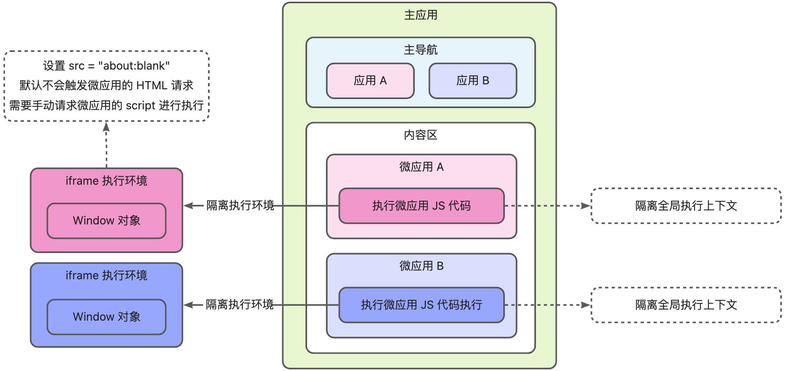
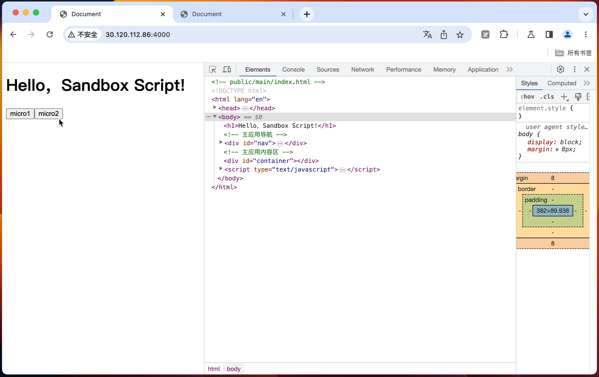
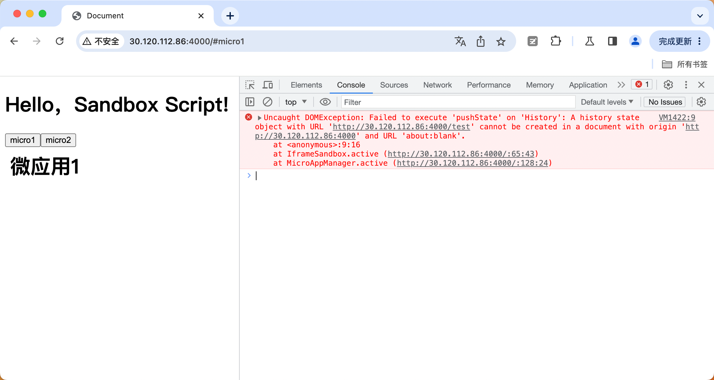
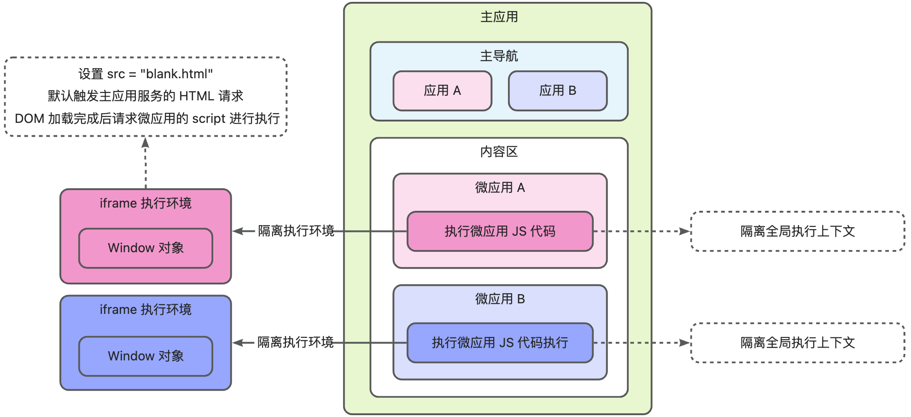
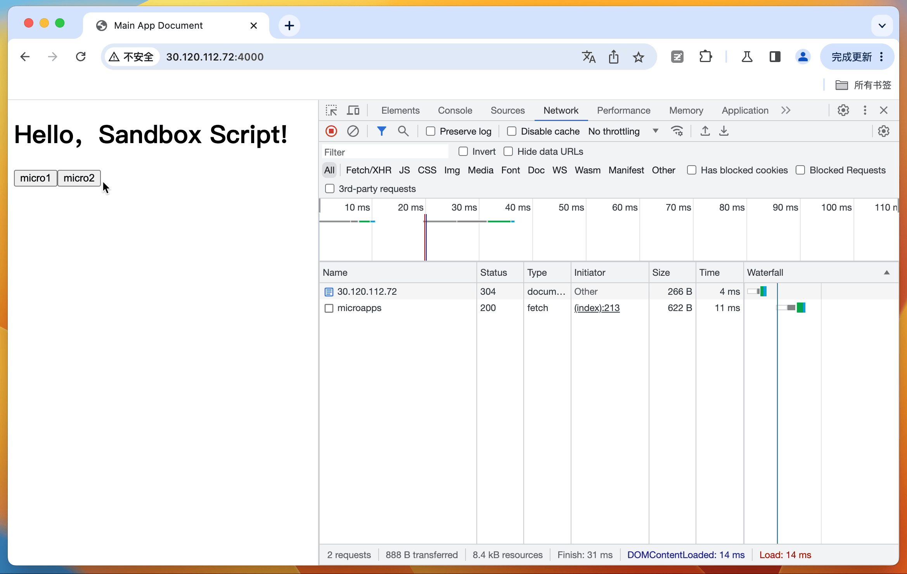

# 12.原理解析：iframe 隔离

在 V8 隔离中我们重点讲解了 Isolate 以及 Context 的概念，这也是 V8 实现 JS 执行上下文隔离的重要能力。本文主要讲解如何利用 iframe 实现在 SPA 模式下的 Context 隔离思路，从而帮助大家更好的理解 JS 隔离。

## 隔离思路

在动态 Script 方案中，我们发现在同一个全局执行上下文加载不同微应用的 JS 进行执行时，由于没有隔离措施，很容易导致微应用产生 JS 运行时冲突。在 V8 的隔离中我们了解到可以通过创建不同的 Isolate 或者 Context 对 JS 代码进行上下文隔离处理，但是这种能力没有直接开放给浏览器，因此我们无法直接利用 Web API 在动态 Script 方案中实现微应用的 JS 隔离。同时我们了解到在浏览器中创建 iframe 时会创建相应的全局执行上下文栈，用于切换主应用和 iframe 应用的全局执行上下文环境，因此可以通过在应用框架中创建空白的 iframe 来隔离微应用的 JS 运行环境。为此，我们大致可以做如下几个阶段的隔离尝试：

-   阶段一：加载空白的 iframe 应用，例如 `src="about:blank"`，生成新的微应用执行环境

    -   解决全局执行上下文隔离问题
    -   解决加载 iframe 的白屏体验问题

-   阶段二：加载同源的 iframe 应用，返回空的内容，生成新的微应用执行环境

    -   解决全局执行上下文隔离问题
    -   解决加载 iframe 的白屏体验问题
    -   解决数据状态同步问题
    -   解决前进后退问题

接下来本课程将实现上述两个阶段的隔离能力。

## 阶段一：空白页隔离

在动态 Script 方案中，微应用的 JS 运行在主应用的 Renderer UI 线程中（通过 Script 标签进行加载执行），这会导致微应用和主应用共享一个 JS 执行环境而产生全局属性冲突。为了解决冲突问题，当时采用了立即执行的匿名函数来创建各自执行的作用域，但是没有在本质上隔离全局执行上下文（例如原型链），接下来我们重新设计一个 iframe 隔离方案，使微应用和主应用彼此可以真正隔离 JS 的运行环境。具体方案如下所示：



大致实现的思路如下所示：

-   通过请求获取后端的微应用列表数据，动态创建主导航
-   根据导航切换微应用，切换时会跨域请求微应用 JS 的文本内容并进行缓存处理
-   微应用的 JS 会在 iframe 环境中通过 Script 标签进行隔离执行

实现效果如下所示，图中的两个按钮（微应用导航）根据后端数据动态渲染，点击按钮后会跨域请求微应用的 JS 静态资源并创建空白的 iframe 进行隔离执行：



文件的结构目录如下所示：

``` bash
├── public                  # 托管的静态资源目录
│   ├── main/               # 主应用资源目录                        
│   │   └── index.html                                        
│   └── micro/              # 微应用资源目录
│        ├── micro1.js        
│        └── micro2.js      
├── config.js               # 公共配置
├── main-server.js          # 主应用服务
└── micro-server.js         # 微应用服务
```

> 温馨提示：示例源码可以从 micro-framework 的 [demo/iframe-sandbox-blank](https://github.com/ziyi2/micro-framework/tree/demo/iframe-sandbox-blank) 分支获取。

iframe 隔离中获取微应用 JS 进行执行的方式和动态 Script 的方案存在差异，在动态 Script 的方案中利用浏览器内置的 `<script>` 标签进行请求和执行，天然支持跨域。而在 iframe 隔离中需要通过 Ajax 的形式获取 JS 文件进行手动隔离执行。由于微应用和主应用跨域，因此需要微应用的服务支持跨域请求，具体如下所示：

``` javascript
// micro-server.js
import express from "express";
import morgan from "morgan";
import path from "path";
import config from "./config.js";
const app = express();

const { port, host } = config;

// 打印请求日志
app.use(morgan("dev"));

// 设置支持跨域请求头（也可以使用 cors 中间件）
// 这里设置了所有请求的跨域支持，也可以单独对 express.static 设置跨域响应头
app.use((req, res, next) => {
  res.header("Access-Control-Allow-Origin", '*');
  res.header("Access-Control-Allow-Methods", "GET, POST, OPTIONS");
  res.header("Allow", "GET, POST, OPTIONS");
  next();
});

app.use(
  express.static(path.join("public", "micro"))
);

// 启动 Node 服务
app.listen(port.micro, host);
console.log(`server start at http://${host}:${port.main}/`);
```

在动态 Script 的微应用设计中，必须通过立即执行的匿名函数进行作用域隔离，为了验证 iframe 隔离的效果，这里把立即执行的匿名函数去除：

``` javascript
// public/micro/micro1.js
let root;
root = document.createElement("h1");
root.textContent = "微应用1";
document.body.appendChild(root);

// public/micro/micro2.js
let root;
root = document.createElement("h1");
root.textContent = "微应用2";
document.body.appendChild(root);
```

如果是在动态 Script 的方案下，上述 `micro1.js` 和 `micro2.js` 由于都是在主应用的全局执行上下文中执行，会产生属性命令冲突。这里通过空白的 iframe 来建立完整的隔离执行环境，具体实现如下所示：

``` html
<!-- public/main/index.html -->

<!DOCTYPE html>
<html lang="en">
  <head>
    <meta charset="UTF-8" />
    <meta http-equiv="X-UA-Compatible" content="IE=edge" />
    <meta name="viewport" content="width=device-width, initial-scale=1.0" />
    <title>Document</title>
  </head>

  <body>
    <h1>Hello，Sandbox Script!</h1>

    <!-- 主应用导航 -->
    <div id="nav"></div>

    <!-- 主应用内容区 -->
    <div id="container"></div>

    <script type="text/javascript">
      // 隔离类
      class MicroAppSandbox {
        // 配置信息
        options = null;
        // iframe 实例
        iframe = null;
        // iframe 的 Window 实例
        iframeWindow = null;
        // 是否执行过 JS
        exec = false;

        constructor(options) {
          this.options = options;
          // 创建 iframe 时浏览器会创建新的全局执行上下文，用于隔离主应用的全局执行上下文
          this.iframe = this.createIframe();
          this.iframeWindow = this.iframe.contentWindow;
        }

        createIframe() {
          const { rootElm, id, url } = this.options;
          const iframe = window.document.createElement("iframe");
          // 创建一个空白的 iframe
          const attrs = {
            src: "about:blank",
            "app-id": id,
            "app-src": url,
            style: "border:none;width:100%;height:100%;",
          };
          Object.keys(attrs).forEach((name) => {
            iframe.setAttribute(name, attrs[name]);
          });
          rootElm?.appendChild(iframe);
          return iframe;
        }

        // 激活
        active() {
          this.iframe.style.display = "block";
          // 如果已经通过 Script 加载并执行过 JS，则无需重新加载处理
          if(this.exec) return;
          this.exec = true;
          const scriptElement = this.iframeWindow.document.createElement('script');
          scriptElement.textContent = this.options.scriptText;
          this.iframeWindow.document.head.appendChild(scriptElement);
        }

        // 失活
        // INFO: JS 加载以后无法通过移除 Script 标签去除执行状态
        // INFO: 因此这里不是指代失活 JS，如果是真正想要失活 JS，需要销毁 iframe 后重新加载 Script
        inactive() {
          this.iframe.style.display = "none";
        }

        // 销毁隔离实例
        destroy() {
          this.options = null;
          this.exec = false;
          if(this.iframe) {
            this.iframe.parentNode?.removeChild(this.iframe);
          }
          this.iframe = null;
        }
      }

      // 微应用管理
      class MicroApp {
        // 缓存微应用的脚本文本（这里假设只有一个执行脚本）
        scriptText = "";
        // 隔离实例
        sandbox = null;
        // 微应用挂载的根节点
        rootElm = null;

        constructor(rootElm, app) {
          this.rootElm = rootElm;
          this.app = app;
        }

        // 获取 JS 文本（微应用服务需要支持跨域请求获取 JS 文件）
        async fetchScript(src) {
          try {
            const res = await window.fetch(src);
            return await res.text();
          } catch (err) {
            console.error(err);
          }
        }

        // 激活
        async active() {
          // 缓存资源处理
          if (!this.scriptText) {
            this.scriptText = await this.fetchScript(this.app.script);
          }

          // 如果没有创建隔离实例，则实时创建
          // 需要注意只给激活的微应用创建 iframe 隔离，因为创建 iframe 会产生内存损耗
          if (!this.sandbox) {
            this.sandbox = new MicroAppSandbox({
              rootElm: this.rootElm,
              scriptText: this.scriptText,
              url: this.app.script,
              id: this.app.id,
            });
          }

          this.sandbox.active();
        }

        // 失活
        inactive() {
          this.sandbox?.inactive();
        }
      }

      // 微前端管理
      class MicroApps {
        // 微应用实例映射表
        appsMap = new Map();
        // 微应用挂载的根节点信息
        rootElm = null;

        constructor(rootElm, apps) {
          this.rootElm = rootElm;
          this.setAppMaps(apps);
        }

        setAppMaps(apps) {
          apps.forEach((app) => {
            this.appsMap.set(app.id, new MicroApp(this.rootElm, app));
          });
        }

        // TODO: prefetch 微应用
        prefetchApps() {}

        // 激活微应用
        activeApp(id) {
          const app = this.appsMap.get(id);
          app?.active();
        }

        // 失活微应用
        inactiveApp(id) {
          const app = this.appsMap.get(id);
          app?.inactive();
        }
      }

      // 主应用管理
      class MainApp {
        microApps = [];
        microAppsManager = null;

        constructor() {
          this.init();
        }

        async init() {
          this.microApps = await this.fetchMicroApps();
          this.createNav();
          this.navClickListener();
          this.hashChangeListener();
          // 创建微前端管理实例
          this.microAppsManager = new MicroApps(
            document.getElementById("container"),
            this.microApps
          );
        }

        // 从主应用服务器获请求微应用列表信息
        async fetchMicroApps() {
          try {
            const res = await window.fetch("/microapps", {
              method: "post",
            });
            return await res.json();
          } catch (err) {
            console.error(err);
          }
        }

        // 根据微应用列表创建主导航
        createNav(microApps) {
          const fragment = new DocumentFragment();
          this.microApps?.forEach((microApp) => {
            // TODO: APP 数据规范检测 (例如是否有 script）
            const button = document.createElement("button");
            button.textContent = microApp.name;
            button.id = microApp.id;
            fragment.appendChild(button);
          });
          nav.appendChild(fragment);
        }

        // 导航点击的监听事件
        navClickListener() {
          const nav = document.getElementById("nav");
          nav.addEventListener("click", (e) => {
            // 并不是只有 button 可以触发导航变更，例如 a 标签也可以，因此这里不直接处理微应用切换，只是改变 Hash 地址
            // 不会触发刷新，类似于框架的 Hash 路由
            window.location.hash = event?.target?.id;
          });
        }

        // hash 路由变化的监听事件
        hashChangeListener() {
          // 监听 Hash 路由的变化，切换微应用（这里设定一个时刻只能切换一个微应用）
          window.addEventListener("hashchange", () => {
            this.microApps?.forEach(async ({ id }) => {
              id === window.location.hash.replace("#", "")
                ? this.microAppsManager.activeApp(id)
                : this.microAppsManager.inactiveApp(id);
            });
          });
        }
      }

      new MainApp();
    </script>
  </body>
</html>
```

上述示例中主要设计了几个类，具体的功能如下所示：

-   `MainApp`：负责管理主应用，包括获取微应用列表、创建微应用的导航、切换微应用
-   `MicroApps`：负责维护微应用列表，包括预加载、添加和删除微应用等
-   `MicroApp`：负责维护微应用，包括请求和缓存静态资源、激活微应用、状态管理等
-   `MicroAppSandbox`：负责维护微应用隔离，包括创建、激活和销毁隔离实例等

**使用该隔离方案不仅仅可以解决动态 Script 方案无法解决的全局执行上下文隔离问题（包括 CSS 隔离），还可以通过空闲时间预获取微应用的静态资源来加速 iframe 内容的渲染，从而解决原生 iframe 产生的白屏体验问题。** 除此之外，使用 `src=about:blank` 会使当前 iframe 继承父浏览上下文的源，从而会遵循同源策略：

``` javascript
// iframe src: about:blank 
// 嵌入一个遵从同源策略的空白页：https://developer.mozilla.org/zh-CN/docs/Web/HTML/Element/iframe
// 源的继承：在页面中通过 about:blank 或 javascript: URL 执行的脚本会继承打开该 URL 的文档的源，因为这些类型的 URL 没有包含源服务器的相关信息：https://developer.mozilla.org/zh-CN/docs/Web/Security/Same-origin_policy#%E6%BA%90%E7%9A%84%E7%BB%A7%E6%89%BF
console.log(window.document.domain === window.parent.document.domain);  // true
```

因此在 iframe 中可以像动态 Script 脚本一样发起 Ajax 请求，例如：

``` javascript
// 可以请求主应用服务所在的接口，因为继承了主应用的源
var oReq = new XMLHttpRequest();
oReq.addEventListener("load", reqListener);
oReq.open("POST", "/microapps");
oReq.send();
function reqListener() {
  console.log(this.responseText);
}
```

需要注意，将 iframe 设置成 `src=about:blank` 会产生一些限制，例如在 Vue 中使用 Vue-Router 时底层框架源码会用到 `history.pushState` 或者 `history.replaceState`，此时会因为 `about:blank` 而导致 iframe 无法正常运行，例如：

``` javascript
// 在微应用的 micro1.js 中运行如下代码会 产生 history 报错
window.history.pushState({ key: "hello" }, "", "/test");
```



使用 `history` 更改 URL 时可以保持页面无刷（不会发起服务请求，除非手动刷新页面），但是必须使新的 URL 和当前 URL 同源，否则就会抛出上述异常。此时很多同学可能会联想到 SPA 应用的路由，在 Vue 或者 React 框架中，路由可以分为 hash 模式或者 history 模式，hash 模式本质使用 `window.location.hash` 进行处理，而 history 模式本质使用 `history.pushState` 或者 `history.replaceState` 进行处理。如果使用路由模式在空白的 iframe 中运行，会使得框架出错。为了验证该观点，大家可以将 [demo/sandbox-micro-app-test](https://github.com/ziyi2/micro-framework/tree/demo/sandbox-micro-app-test) 中的 Vue 路由示例（构建浏览器中运行的 UMD 规范）放入空白的 iframe 中运行，此时不管是 hash 模式或者 history 模式，底层都会因为调用 `history` 而产生异常。

## 阶段二：同源 iframe 隔离

使用 `about:blank` 会导致 `history` 无法正常工作，因此可以在空白页的基础上进行改造，例如在主应用的服务中提供一个空白的 HTML 页面，可用于 iframe 的请求加载，从而保持和主应用完全同域。具体方案如下所示：



大致实现的思路如下所示：

-   通过请求获取后端的微应用列表数据，动态创建主导航
-   根据导航切换微应用，切换时会跨域请求微应用 JS 的文本内容并进行缓存处理
-   切换微应用的同时创建一个同域的 iframe 应用，请求主应用下空白的 HTML 进行渲染
-   DOM 渲染完成后，微应用的 JS 会在 iframe 环境中通过 Script 标签进行隔离执行

实现效果如下所示，图中的两个按钮（微应用导航）根据后端数据动态渲染，点击按钮后会跨域请求微应用的 JS 静态资源并创建同域的 iframe 进行隔离执行：



文件的结构目录如下所示：

``` bash
├── public                  # 托管的静态资源目录
│   ├── main/               # 主应用资源目录      
│   │   ├── blank.html      # 用于 iframe 应用进行空白页渲染                          
│   │   └── index.html                                        
│   └── micro/              # 微应用资源目录
│        ├── micro1.js        
│        └── micro2.js      
├── config.js               # 公共配置
├── main-server.js          # 主应用服务
└── micro-server.js         # 微应用服务
```

> 温馨提示：示例源码可以从 micro-framework 的 [demo/iframe-sandbox](https://github.com/ziyi2/micro-framework/tree/demo/iframe-sandbox) 分支获取。

相对于空白页隔离，iframe 同源隔离需要在主应用中提供一个空白的 HTML 页面，从而可以使 iframe 和主应用完全同域，具体的改动主要是 `MicroAppSandbox` 类：

``` javascript
  // 隔离类
  class MicroAppSandbox {
    // 配置信息
    options = null;
    // iframe 实例
    iframe = null;
    // iframe 的 Window 实例
    iframeWindow = null;
    // 是否执行过 JS
    exec = false;
    // iframe 加载延迟执行标识
    iframeLoadDeferred = null;

    constructor(options) {
      this.options = options;
      // 创建 iframe 时浏览器会创建新的全局执行上下文，用于隔离主应用的全局执行上下文
      this.iframe = this.createIframe();
      this.iframeWindow = this.iframe.contentWindow;
      this.iframeLoadDeferred = this.deferred();
      this.iframeWindow.onload = () => {
        // 用于等待 iframe 加载完成
        this.iframeLoadDeferred.resolve();
      };
    }

    deferred() {
      const deferred = Object.create({});
      deferred.promise = new Promise((resolve, reject) => {
        deferred.resolve = resolve;
        deferred.reject = reject;
      });
      return deferred;
    }

    createIframe() {
      const { rootElm, id, url } = this.options;
      const iframe = window.document.createElement("iframe");
      const attrs = {
        // 请求主应用服务下的 blank.html（保持和主应用同源）
        src: "blank.html",
        "app-id": id,
        "app-src": url,
        style: "border:none;width:100%;height:100%;",
      };
      Object.keys(attrs).forEach((name) => {
        iframe.setAttribute(name, attrs[name]);
      });
      rootElm?.appendChild(iframe);
      return iframe;
    }

    // 激活
    async active() {
      this.iframe.style.display = "block";
      // 如果已经通过 Script 加载并执行过 JS，则无需重新加载处理
      if (this.exec) return;
      // 延迟等待 iframe 加载完成（这里会有 HTML 请求的性能损耗，可以进行优化处理）
      await this.iframeLoadDeferred.promise;
      this.exec = true;
      const scriptElement =
        this.iframeWindow.document.createElement("script");
      scriptElement.textContent = this.options.scriptText;
      this.iframeWindow.document.head.appendChild(scriptElement);
    }

    // 失活
    // INFO: JS 加载以后无法通过移除 Script 标签去除执行状态
    // INFO: 因此这里不是指代失活 JS，如果是真正想要失活 JS，需要销毁 iframe 后重新加载 Script
    inactive() {
      this.iframe.style.display = "none";
    }

    // 销毁
    destroy() {
      this.options = null;
      this.exec = false;
      if (this.iframe) {
        this.iframe.parentNode?.removeChild(this.iframe);
      }
      this.iframe = null;
      this.iframeWindow = null;
    }
  }
```

  


此时由于和主应用完全同源，在微应用的 Vue 或者 React 中使用路由调用 `history` 不会存在异常问题，并且浏览器的前进和后退按钮都可以正常工作：


至此 iframe 隔离的基本功能已经完成，需要注意该隔离示例只是用于理解隔离的简单示例，真正在生产环境使用时，还需要考虑如下设计：

-   主应用刷新时， iframe 微应用无法保持自身 URL 的状态
-   主应用和 iframe 微应用处于不同的浏览上下文，无法使 iframe 中的模态框 Modal 相对于主应用居中
-   主子应用的通信处理以及持久化数据的隔离处理
-   解决主应用空白 HTML 请求的性能优化处理（例如 GET 请求空内容、请求渲染时中断请求等）

> 温馨提示：关于模态框居中的问题，如果主应用本身只是一层壳子，只包含了应用顶部和左侧菜单信息，微应用渲染的区域占据了主要的空间，那么模态框居中的问题可以被忽略。当然，如果要使的微应用中的模态框完全居中，可以在微应用中对模态框的位置进行调整，从而适配成相对于主应用进行居中展示。

需要注意，采用 iframe 隔离和之前讲解的 iframe 方案是有差异的，具体优势在于：

-   可以持续优化白屏体验
-   可以实现 URL 状态同步
-   可以额外处理浏览上下文隔离
-   同域带来的便利性（应用免登、数据共享、通信等）

感兴趣的同学可以在隔离示例的基础上进行设计，上述未完成的设计可以根据业务的需求进行不同方案的设计考虑。以模态框无法居中的情况为例，可以在已有模态框组件的基础上进行再次封装，从而使其可以适配隔离方案相对于主应用居中。当然如果想要真正实现天然居中，也可以考虑在 iframe 外进行 DOM 渲染（感兴趣的同学可以思考一下大致的实现思路），从而保持和主应用完全一致的 DOM 环境，当然此种方案还需要额外考虑 CSS 的隔离问题，如果不是为了实现非常通用的微前端框架，个人觉得会有一些得不偿失的感觉。

## 小结

本课程主要讲解了如何利用 iframe 进行 JS 隔离，当然这种隔离也适合 CSS 的隔离，本质上是在 iframe 中创建了和主应用不同的浏览上下文。在下一个课程中我们将在 iframe 隔离（`src=about:blank`）的基础上解决 `history` 报错的问题。