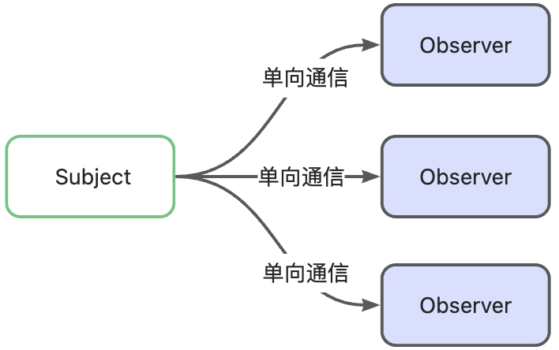
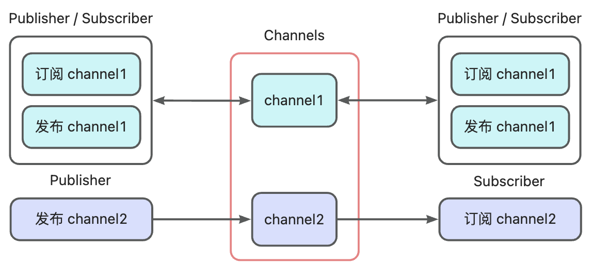
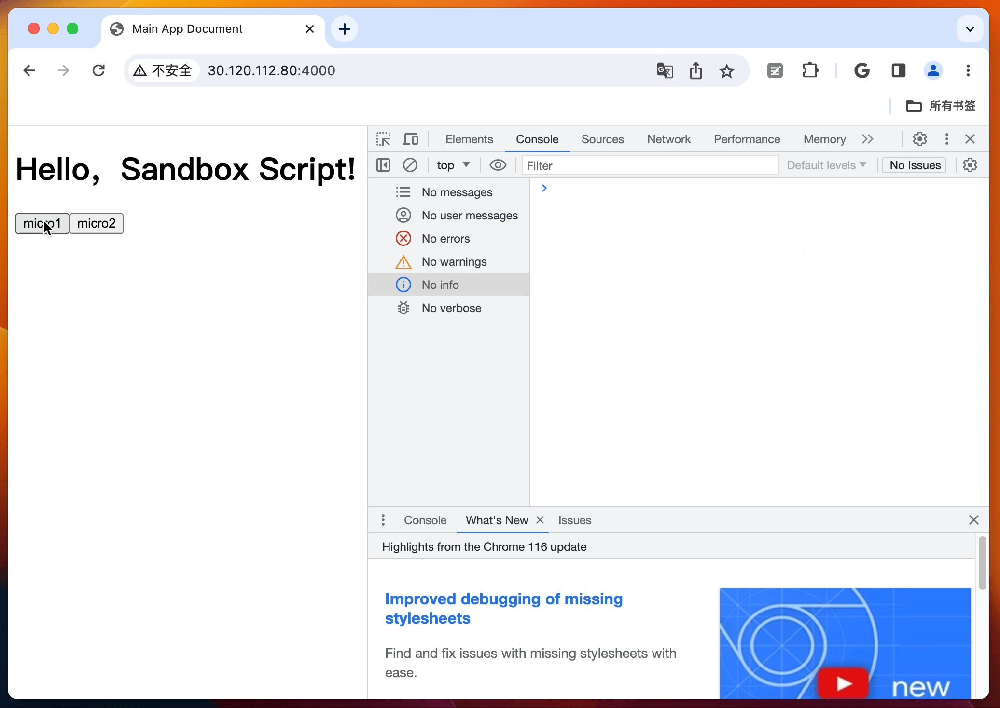
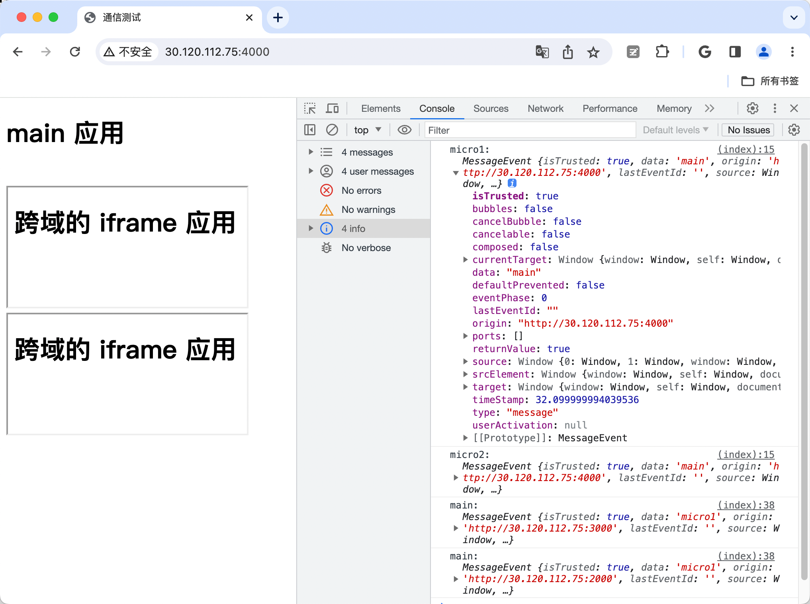

# 17.原理解析：通信

主应用和微应用在运行期间可能需要实现主子应用之间的通信，本课程接下来将重点讲解微前端的通信方式以及实现示例。

## 通信模式

在了解微前端的通信方式之前，我们先来了解两种常用的通信模式：观察者和发布 / 订阅模式。两者最主要的区别是一对多单向通信还是多对多双向通信的问题。以微前端为例，如果只需要主应用向各个子应用单向广播通信，并且多个子应用之间互相不需要通信，那么只需要使用观察者模式即可，而如果主应用需要和子应用双向通信，或者子应用之间需要实现去中心化的双向通信，那么需要使用发布 / 订阅模式。

在浏览器中会使用观察者模式来实现内置 API 的单向通信，例如 `IntersectionObserver`、`MutationObserver`、`ResizeObserver` 以及 `PerformanceObserver` 等，而发布 / 订阅模式则通常是框架提供的一种供外部开发者自定义通信的能力，例如浏览器中的 `EventTarget`、Node.js 中的 `EventEmitter`、Vue.js 中的 `$emit` 等。

> 温馨提示：常见的 MVC、MVP 和 MVVM 会使用什么模式进行通信呢？Vue.js 中的响应式设计使用了什么模式进行通信呢？

### 观察者模式

观察者模式需要包含 Subject 和 Observer 两个概念，其中 Subject 是需要被观察的目标对象，一旦状态发生变化，可以通过广播的方式通知所有订阅变化的 Observer，而 Observer 则是通过向 Subject 进行消息订阅从而实现接收 Subject 的变化通知，具体如下所示：



我们以浏览器的 `MutationObserver` 为例，来看下观察者模式如何运作：

```html
<!DOCTYPE html>
<html lang="en">
  <head>
    <meta charset="UTF-8" />
    <meta name="viewport" content="width=device-width, initial-scale=1.0" />
    <title>Document</title>
  </head>
  <body>
    <div id="subject"></div>
  </body>

  <script>


    // 当观察到变动时执行的回调函数
    const callback = function (mutationsList, observer) {
      // Use traditional 'for loops' for IE 11
      for (let mutation of mutationsList) {
        if (mutation.type === "childList") {
          console.log("A child node has been added or removed.");
        } else if (mutation.type === "attributes") {
          console.log(
            "The " + mutation.attributeName + " attribute was modified."
          );
        }
      }
    };

    // 创建第一个 Observer
    const observer1 = new MutationObserver(callback);

    // Subject 目标对象
    const subject = document.getElementById("subject");
    
    // Observer 的配置（需要观察什么变动）
    const config = { attributes: true, childList: true, subtree: true };

    // Observer 订阅 Subject 的变化
    observer1.observe(subject, config);

    // 创建第二个 Observer
    const observer2 = new MutationObserver(callback);

    // Observer 订阅 Subject 的变化
    observer2.observe(subject, config);

    // Subject 的属性变化，会触发 Observer 的 callback 监听
    subject.className = "change class";
    
    // Subject 的子节点变化，会触发 Observer 的 callback 监听
    subject.appendChild(document.createElement("span"));

    // 这里为什么需要 setTimeout 呢？如果去除会有什么影响吗？
    setTimeout(() => {
      // 取消订阅
      observer1.disconnect();
      observer2.disconnect();
    });
  </script>
</html>
```


当 DOM 元素（Subject 目标对象）改变自身的属性或者添加子元素时，都会将自身的状态变化单向通知给所有订阅该变化的观察者。当然上述 Web API 内部包装了很多功能，例如观察者配置。我们可以设计一个更加便于理解的观察者通信方式：

``` javascript
   class Subject {
    constructor() {
      this.observers = [];
    }

    // 添加订阅
    subscribe(observer) {
      this.observers.push(observer);
    }

    // 取消订阅
    unsubscribe() {}

    // 广播信息
    broadcast() {
      this.observers.forEach((observer) => observer.update());
    }
  }

  class Observer {
    constructor() {}

    // 实现一个 update 的接口，供 subject 耦合调用
    update() {
      console.log("observer update...");
    }
  }

  const subject = new Subject();

  subject.subscribe(new Observer());

  subject.broadcast();

  subject.subscribe(new Observer());

  subject.broadcast();
```

  


上述观察者模式没有一个实体的 Subject 对象，我们可以结合 DOM 做一些小小的改动，例如：

``` html
<!DOCTYPE html>
<html lang="en">
  <head>
    <meta charset="UTF-8" />
    <meta name="viewport" content="width=device-width, initial-scale=1.0" />
    <title>Document</title>
  </head>
  <body>
    <!-- 目标对象 -->
    <input type="checkbox" id="checkbox" />

    <!-- 观察者 -->
    <div id="div"></div>
    <h1 id="h1"></h1>
    <span id="span"></span>

    <script>
      class Subject {
        constructor() {
          this.observers = [];
        }

        // 添加订阅
        subscribe(observer) {
          this.observers.push(observer);
        }

        // 取消订阅
        unsubscribe() {}

        // 广播信息
        broadcast(value) {
          this.observers.forEach((observer) => observer.update(value));
        }
      }


      // 观察的目标对象
      const checkbox = document.getElementById("checkbox");

      // 将 subject 实例挂载到 DOM 对象上（也可以单独使用）
      checkbox.subject = new Subject();

      checkbox.onclick = function (event) {
        // 通知观察者 checkbox 的变化
        checkbox.subject.broadcast(event.target.checked);
      };

      // 观察者
      const span = document.getElementById("span");
      const div = document.getElementById("div");
      const h1 = document.getElementById("h1");

      // 观察者实现各自 update 接口
      span.update = function (value) {
        span.innerHTML = value;
      };
      div.update = function (value) {
        div.innerHTML = value;
      };
      h1.update = function (value) {
        h1.innerHTML = value;
      };

      // 添加订阅
      checkbox.subject.subscribe(span);
      checkbox.subject.subscribe(div);
      checkbox.subject.subscribe(h1);
    </script>
  </body>
</html>
```

> 温馨提示：不用特别关心 `MutationObserver` 和示例中的不同使用方式，需要了解的是单向一对多的通信能力。

### 发布 / 订阅模式

发布 / 订阅模式需要包含 Publisher、Channels 和 Subscriber 三个概念，其中 Publisher 是信息的发送者，Subscriber 是信息的订阅者，而 Channels 是信息传输的通道，如下所示：



发布者可以向某个通道传输信息，而订阅者则可以订阅该通道的信息变化。通过新增通道，可以将发布者和订阅者解耦出来，从而形成一种去中心化的通信模式。如上图所示，订阅者本身也可以是发布者，从而实现事件的双向通信。我们以浏览器的 `EventTarget` 为例，来看下发布 / 订阅模式如何运作：

``` javascript
const event = new EventTarget();
// event 是订阅者
event.addEventListener("channel1", (e) => console.log(e.detail));
// event 是发布者
event.dispatchEvent(
  new CustomEvent("channel1", { detail: { hello: true } })
);
event.dispatchEvent(
  new CustomEvent("channel2", { detail: { hello: true } })
);
// 由于先发布后订阅，导致订阅失败，但是发布者不感知订阅者的失败状态
event.addEventListener("channel2", (e) => console.log(e.detail));
```

我们可以通过简单的几行代码实现上述功能，如下所示：

``` javascript
class Event {
    constructor() {
      this.channels = {};
      // 这里的 token 也可以是随机生成的 uuid
      this.token = 0;
    }

    // 实现订阅
    subscribe(channel, callback) {
      if (!this.channels[channel]) this.channels[channel] = [];
      this.channels[channel].push({
        channel,
        token: ++this.token,
        callback,
      });
      return this.token;
    }

    // 实现发布
    publish(channel, data) {
      const subscribers = this.channels[channel];
      if (!subscribers) return;
      let len = subscribers.length;
      while (len--) {
        subscribers[len]?.callback(data, subscribers[len].token);
      }
    }

    // 取消订阅
    unsubscribe(token) {
      for (let channel in this.channels) {
        const index = this.channels[channel].findIndex(
          (subscriber) => subscriber.token === token
        );
        if (index !== -1) {
          this.channels[channel].splice(index, 1);
          if (!this.channels[channel].length) {
            delete this.channels[channel];
          }
          return token;
        }
      }
    }
  }

  const event = new Event();
  const token = event.subscribe("channel1", (data) => console.log('token: ', data));
  const token1 = event.subscribe("channel1", (data) => console.log('token1: ', data));
  // 打印 token 和 token1
  event.publish("channel1", { hello: true });
  event.unsubscribe(token);
  // 打印 token1，因为 token 取消了订阅
  event.publish("channel1", { hello: true });
```

发布 / 订阅模式和观察者模式存在明显差异，首先在功能上观察者模式是一对多的单向通信模式，而发布 / 订阅模式是多对多的双向通信模式。其次观察者模式需要一个中心化的 Subject 广播消息，并且需要感知 Observer（例如上述的 `observers` 列表) 实现通知，是一种紧耦合的通信方式。而发布 / 订阅模式中的发布者只需要向特定的通道发送信息，并不感知订阅者的订阅状态，是一种松散解耦的通信方式。

## 微前端通信

在微前端中往往需要实现多对多的双向通信模式，例如微应用之间实现通信，主应用和微应用之间实现通信，因此使用发布 / 订阅模式是一种不错的选择。如果微应用和主应用处于同一个全局执行上下文，那么可以利用 `window` 变量实现通信，因为 `window` 实现了 [EventTarget](https://developer.mozilla.org/zh-CN/docs/Web/API/EventTarget) 的通信接口，例如常见的 single-spa，它会将应用的生命周期通过 [EventTarget](https://developer.mozilla.org/zh-CN/docs/Web/API/EventTarget) （`window.dispatchEvent`）的形式广播出来，从而可以使得 qiankun 实现监听处理。例如：



> 温馨提示：示例源码可以从 [demo/same-origin-pubsub](https://github.com/ziyi2/micro-framework/tree/demo/same-origin-pubsub) 分支获取。

``` javascript
// 主应用
window.addEventListener("microChannel", (e) => {
  console.log("main addEventListener: ", e);

  window.dispatchEvent(
    new CustomEvent("mainChannel", {
      detail: "main",
    })
  );
});

// iframe 子应用1（加载以后立马触发）
window.parent.addEventListener("mainChannel", (e) => {
  console.log("micro1 addEventListener: ", e);
});

window.parent.dispatchEvent(
  new CustomEvent("microChannel", {
    detail: "micro1",
  })
);

// iframe 子应用2
window.parent.addEventListener("mainChannel", (e) => {
  console.log("micro2 addEventListener: ", e);
});

window.parent.dispatchEvent(
  new CustomEvent("microChannel", {
    detail: "micro2",
  })
);
```

需要注意使用发布 / 订阅模式时先进行订阅处理，从而防止发布后没有及时订阅导致消息丢失。例如上述示例，如果微应用先发布消息然后再进行消息订阅，那么会使得首次无法接收消息。

> 温馨提示：如果想使用自定义的发布 / 订阅模式，可以在 `window` 上挂载一个发布 / 订阅对象实现通信。除此之外，如果通信消息并不是所有子应用都可以订阅，那么可以通过类似于 `props` 的方式传递发布 / 订阅对象给需要的子应用进行处理，例如 Web Components 中可以通过属性的方式进行对象传递，从而实现特定范围内的通信。

当然，如果主应用和微应用不同域的情况下通信，则会报跨域的错误：

``` html
<!-- main.html：http://30.120.112.80:4000/ -->
<!DOCTYPE html>
<html lang="en">
  <head>
    <meta charset="UTF-8" />
    <meta http-equiv="X-UA-Compatible" content="IE=edge" />
    <meta name="viewport" content="width=device-width, initial-scale=1.0" />
    <title>通信测试</title>
  </head>
  <body>
    <h1>main 应用</h1>
    <br />
    <!-- 跨域应用：iframe.html -->
    <iframe id="iframe" src="<%= iframeUrl %>"></iframe>

    <script>
      const iframe = document.getElementById("iframe");

      iframe.onload = () => {
        window.dispatchEvent(
          new CustomEvent({
            detail: "main",
          })
        );
        
        // (index):14 Uncaught DOMException: Blocked a frame with origin "http://30.120.112.80:4000" 
        // from accessing a cross-origin frame. at http://30.120.112.80:4000/:14:21
        iframe.contentWindow.dispatchEvent(
          new CustomEvent({
            detail: "iframe",
          })
        );
      };
    </script>
  </body>
</html>


<!-- 跨域的 iframe.html：http://30.120.112.80:3000/ -->
<!DOCTYPE html>
<html lang="en">
  <head>
    <meta charset="UTF-8" />
    <meta http-equiv="X-UA-Compatible" content="IE=edge" />
    <meta name="viewport" content="width=device-width, initial-scale=1.0" />
    <title>跨域的 iframe 应用</title>
  </head>
  <body>
    <h1>跨域的 iframe 应用</h1>

    <script>
    
      // (index):14 Uncaught DOMException: Blocked a frame with origin "http://30.120.112.80:3000" 
      // from accessing a cross-origin frame. at http://30.120.112.80:3000/:14:21
      window.parent.addEventListener('main', (e) => {
        console.log('iframe addEventListener: ', e);
      })

      window.addEventListener('iframe', (e) => {
        console.log('iframe addEventListener: ', e);
      })
    </script>
  </body>
</html>
```

此时可以通过 `postMessage` 实现跨域通信：



> 温馨提示：示例源码可以从 [demo/iframe-cross-origin-event](https://github.com/ziyi2/micro-framework/tree/demo/iframe-cross-origin-event) 分支获取。


``` html
<!-- main.html -->
<!DOCTYPE html>
<html lang="en">
  <head>
    <meta charset="UTF-8" />
    <meta http-equiv="X-UA-Compatible" content="IE=edge" />
    <meta name="viewport" content="width=device-width, initial-scale=1.0" />
    <title>通信测试</title>
  </head>
  <body>
    <h1>main 应用</h1>
    <br />
    <!-- 跨域应用：iframe.html -->
    <iframe id="micro1" src="<%= micro1 %>"></iframe>
    <iframe id="micro2" src="<%= micro2 %>"></iframe>

    <script>
      const micro1 = document.getElementById("micro1");
      const micro2 = document.getElementById("micro2");

      // 等待 iframe 加载完毕后才能通信
      micro1.onload = () => {
        // 给子应用发送消息，注意明确 targetOrigin
        micro1.contentWindow.postMessage("main", "<%= micro1 %>");
      };

      micro2.onload = () => {
        micro2.contentWindow.postMessage("main", "<%= micro2 %>");
      };

      // 接收来自于 iframe 的消息
      window.addEventListener("message", (data) => {
        // 通过 data.origin 来进行应用过滤
        if (
          data.origin === "<%= micro1 %>" ||
          data.origin === "<%= micro2 %>"
        ) {
          console.log("main: ", data);
        }
      });
    </script>
  </body>
</html>

<!-- micro1.html -->
<!DOCTYPE html>
<html lang="en">
  <head>
    <meta charset="UTF-8" />
    <meta http-equiv="X-UA-Compatible" content="IE=edge" />
    <meta name="viewport" content="width=device-width, initial-scale=1.0" />
    <title>跨域的 iframe 应用</title>
  </head>
  <body>
    <h1>跨域的 iframe 应用</h1>

    <script>
      window.addEventListener("message", (data) => {
        console.log("micro1: ", data);

        if (data.origin === "<%= mainUrl %>") {
          window.parent.postMessage("micro1", "<%= mainUrl %>");
        }
      });
    </script>
  </body>
</html>


<!-- micro2.html -->
<!DOCTYPE html>
<html lang="en">
  <head>
    <meta charset="UTF-8" />
    <meta http-equiv="X-UA-Compatible" content="IE=edge" />
    <meta name="viewport" content="width=device-width, initial-scale=1.0" />
    <title>跨域的 iframe 应用</title>
  </head>
  <body>
    <h1>跨域的 iframe 应用</h1>

    <script>
      window.addEventListener("message", (data) => {
        console.log("micro2: ", data);
        if (data.origin === "<%= mainUrl %>") {
          window.parent.postMessage("micro1", "<%= mainUrl %>");
        }
      });
    </script>
  </body>
</html>
```

三者的服务端设计如下所示：

``` javascript
// config.js
// https://github.com/indutny/node-ip
import ip from 'ip';
import path from "path";
import { fileURLToPath } from "url";
const __filename = fileURLToPath(import.meta.url);
const __dirname = path.dirname(__filename);

export default {
  port: {
    main: 4000,
    micro1: 3000,
    micro2: 2000
  },

  // 获取本机的 IP 地址
  host: ip.address(),

  __dirname
};

// main-server.js
import path from 'path';
// https://github.com/expressjs/express
import express from 'express';
// ejs 中文网站: https://ejs.bootcss.com/#promo
// ejs express 示例: https://github.com/expressjs/express/blob/master/examples/ejs/index.js
import ejs from "ejs";
import config from './config.js';
const { port, host, __dirname } = config;

const app = express();

app.engine(".html", ejs.__express);
app.set("views", path.join(__dirname, "views"));
app.set("view engine", "html");

// 浏览器访问 http://${host}:${port.main}/ 时会渲染 views/main.html 
app.get("/", function (req, res) {
  // 使用 ejs 模版引擎填充主应用 views/main.html 中的 micro 变量，并将其渲染到浏览器
  res.render("main", {
    // 填充子应用的地址，只有端口不同，iframe 应用和 main 应用跨域
    micro1: `http://${host}:${port.micro1}`,
    micro2: `http://${host}:${port.micro2}`
  });
});

// 启动 Node 服务
app.listen(port.main, host);
console.log(`server start at http://${host}:${port.main}/`);


// micro1-server.js
import path from 'path';
import express from 'express';
import ejs from "ejs";
import config from './config.js';
const { port, host, __dirname } = config;

const app = express();

app.engine(".html", ejs.__express);
app.set("views", path.join(__dirname, "views"));
app.set("view engine", "html");

app.get("/", function (req, res) {
  res.render("micro1", {
    mainUrl:  `http://${host}:${port.main}`
  });
});

// 启动 Node 服务
app.listen(port.micro1, host);
console.log(`server start at http://${host}:${port.micro1}/`);

// micro2-server.js
import path from 'path';
import express from 'express';
import ejs from "ejs";
import config from './config.js';
const { port, host, __dirname } = config;

const app = express();

app.engine(".html", ejs.__express);
app.set("views", path.join(__dirname, "views"));
app.set("view engine", "html");

app.get("/", function (req, res) {
  res.render("micro2", {
    mainUrl:  `http://${host}:${port.main}`
  });
});

// 启动 Node 服务
app.listen(port.micro2, host);
console.log(`server start at http://${host}:${port.micro2}/`);
```

## 小结

本课程首先简单讲解了观察者和发布 / 订阅两种通信模式的差异，其次讲解了微前端中同域和跨域场景下的通信处理，当然真正在设计的时候可能还需要根据业务场景考虑通信的状态感知处理，例如上述的发布/订阅模式无法感知彼此的消息订阅情况，在一些业务场景中可能还需要考虑消息的握手处理。除此之外，如果在业务场景中只需要主应用将一些状态信息单向同步给子应用，那么也可以使用观察者模式实现通信。